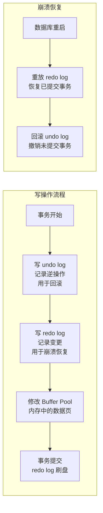
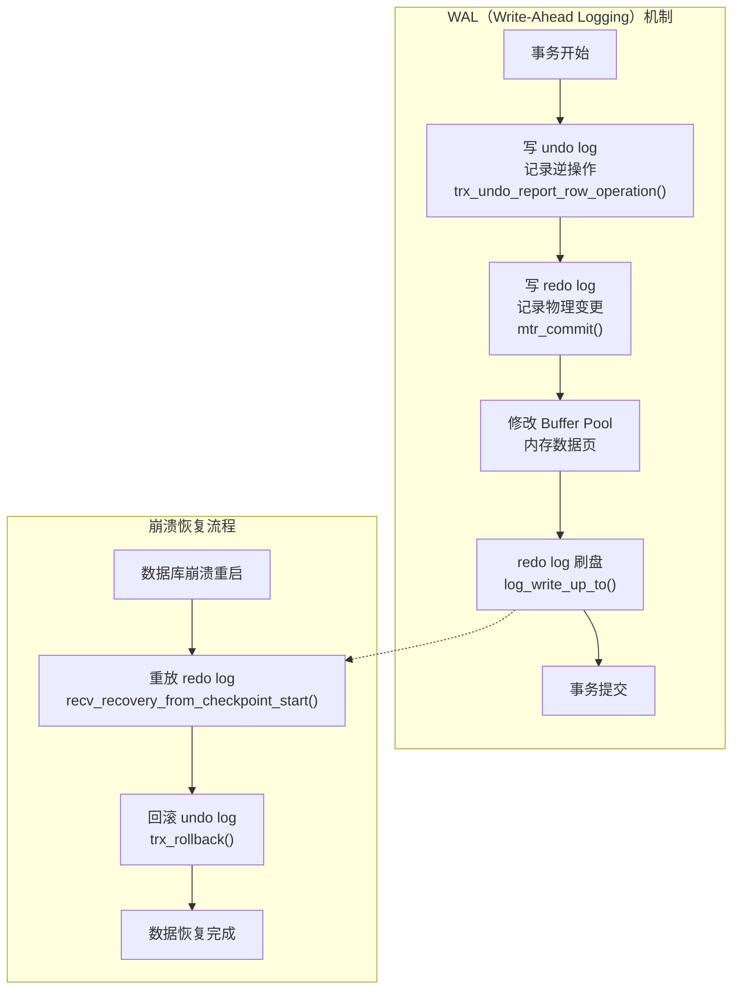
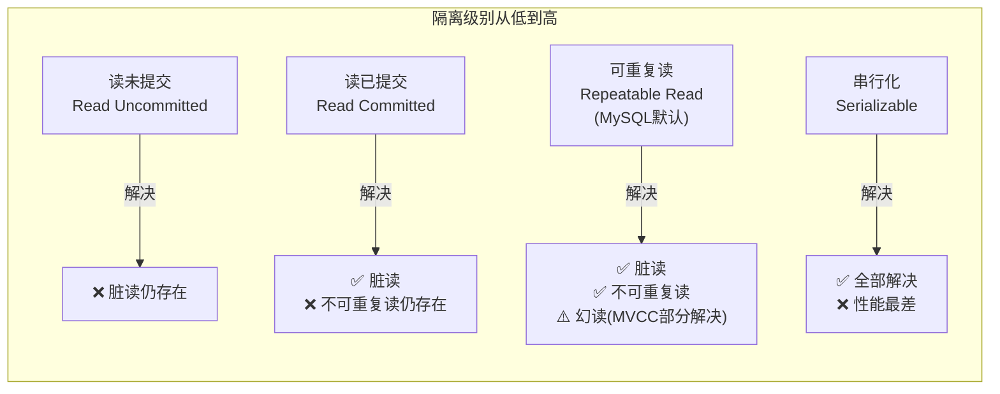
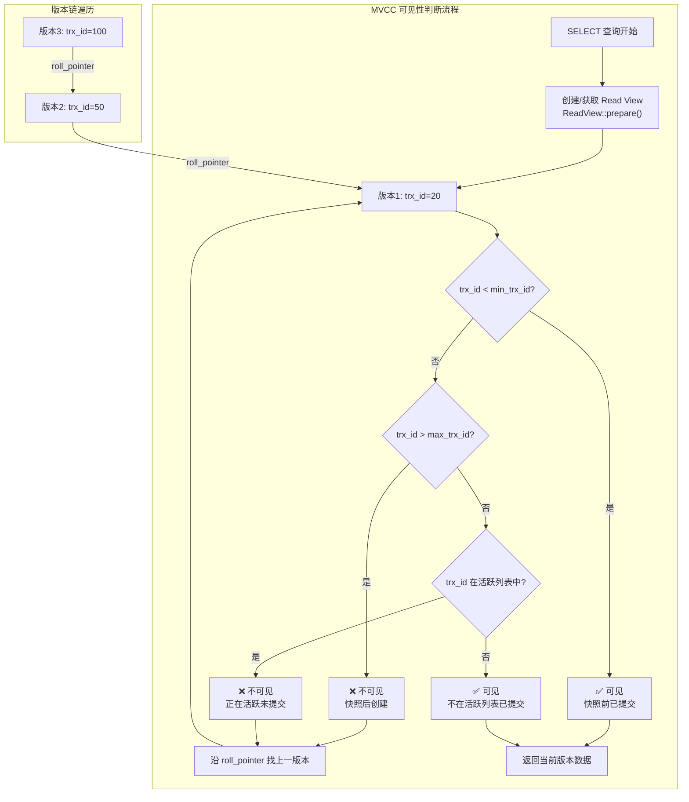
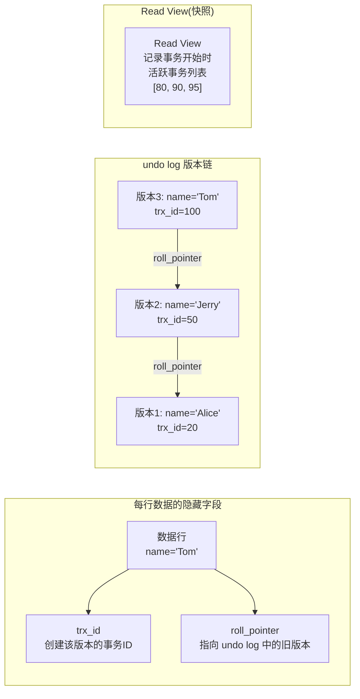

# 事务与并发控制

!!! info "**事务与并发控制 一句话口诀**"
    **A 靠 undo，D 靠 redo，I 靠 MVCC + 锁，C 是目标不是手段**——ACID 四字拆开就是 InnoDB 的四条日志 / 并发路线。

    **先写 undo，再写 redo，最后改内存数据页**——WAL 的落盘顺序决定了崩溃恢复时"先重放 redo，再回滚 undo"。

    **RC 每次 SELECT 建一个 Read View，RR 事务首次查询建一次复用到底**——这一个时机差异就是 RC 与 RR 的全部本质区别。

    **快照读走 MVCC 不加锁，当前读走锁 + 最新版本**——`SELECT` 默认快照读，`FOR UPDATE` / `LOCK IN SHARE MODE` / `INSERT` / `UPDATE` / `DELETE` 才是当前读。

    **MVCC 不能完全防幻读，间隙锁 / `FOR UPDATE` 才能**——所以 RR 防幻读 = 快照读（MVCC）+ 当前读（Next-Key Lock）组合拳。

<!-- -->

> 📖 **边界声明**：本文聚焦 **事务 ACID / MVCC / 隔离级别 / Read View 判定规则** 的机制原理，以下主题请见对应专题：
>
> - 行锁 / 间隙锁 / Next-Key Lock / 死锁排查 → [锁机制与死锁](@mysql-锁机制与死锁)
> - undo log / redo log / Buffer Pool 物理结构 → [InnoDB存储引擎深度剖析](@mysql-InnoDB存储引擎深度剖析)
> - `@Transactional` 失效 / 长事务 / 实战坑 → [实战问题与避坑指南](@mysql-实战问题与避坑指南)

---

## 1. 类比：事务像银行转账，MVCC 像银行流水快照

转账 100 元，本质是**两个物理动作**：A 账户 -100 + B 账户 +100。要是只成功一半（扣了但没入账），钱就硬生生蒸发了——这就是"事务原子性"的具象同义词。

| 银行场景 | MySQL 事务对应 | 关键机制 |
| :-- | :-- | :-- |
| 转账"要么两边同时成功，要么两边同时失败" | **原子性**（Atomicity） | undo log 记反向操作，出错就倒放 |
| 转账后两人总额不变 | **一致性**（Consistency） | 是目标，由其它三个共同保证 |
| 多人同时转账不乱 | **隔离性**（Isolation） | 读不加锁：MVCC；写不冲突：行锁 |
| 转完即使断电也丢不了钱 | **持久性**（Durability） | redo log 先落盘（WAL），崩溃后重放 |
| 查余额时看到的是"你点查询按钮那一刻"的状态——不管别人同时转进转出 | **MVCC 多版本并发控制** | Read View + undo 版本链 回溯历史版本 |

**一句话**：事务 = 原子行为变更的封装，MVCC = 无锁读的版本易容。本文讲的就是这两件事在 InnoDB 源码里到底怎么落地。

---

## 2. 它解决了什么问题？

没有事务，银行转账"扣款成功、入账失败"的情况就无法避免。事务保证了一组操作**要么全部成功，要么全部回滚**，是数据一致性的基石。

并发场景下，读写操作如果都加锁，性能会极差。MVCC（多版本并发控制）让**读操作不加锁**，通过读取历史版本数据来避免读写互斥，大幅提升并发性能。

---

## 3. ACID 四大特性

| 特性 | 含义 | InnoDB 实现方式 | 源码依据 |
| :--- | :--- | :--- | :--- |
| **原子性** | 事务要么全成功，要么全回滚 | **undo log** 回滚 | `trx_undo_assign_undo()` 分配 undo segment<br>`trx_undo_report_row_operation()` 记录逆操作<br>`trx_rollback()` 按逆序执行 |
| **一致性** | 事务前后数据满足约束 | 由其他三个特性共同保证 | 一致性是目标，原子性/隔离性/持久性是手段 |
| **隔离性** | 并发事务互不干扰 | **MVCC + 锁** | MVCC：`ReadView::changes_visible()` 判断可见性<br>锁：`lock_rec_lock()` 处理行锁冲突 |
| **持久性** | 提交后数据永久保存 | **redo log** 持久化 | `mtr_commit()` 写 redo log 到 `log_sys->buf`<br>`log_write_up_to()` 刷盘<br>WAL 机制保证先日志后数据页 |

---

## 4. undo log 与 redo log



| 日志类型 | 作用 | 源码实现 | 保证的特性 |
| :--- | :--- | :--- | :--- |
| **undo log** | 记录操作的逆操作，支持回滚 | `trx_undo_assign_undo()` 分配 undo segment，`trx_undo_report_row_operation()` 记录逆操作，`trx_rollback()` 按逆序执行 | 原子性 |
| **redo log** | 记录数据页的物理变更，支持崩溃恢复 | `mtr_commit()` 写 redo log 到 `log_sys->buf`，`log_write_up_to()` 刷盘，崩溃后 `recv_recovery_from_checkpoint_start()` 重放 | 持久性 |



**WAL 机制核心**：先写日志（顺序写，快），再写数据页（随机写，慢）。redo log 刷盘即保证持久性，即使数据页未落盘也能通过重放恢复。

!!! note "📖 术语家族：`WAL`（Write-Ahead Logging）"
    **字面义**：`WAL` = `Write-Ahead Logging`，先写日志再写数据。
    **在 InnoDB 中的含义**：所有数据页修改**必须先写 redo log 到磁盘**，才能修改内存中的 Buffer Pool 页。这是崩溃恢复的基石——即使数据页未落盘，只要 redo log 已持久化，崩溃后就能重放恢复。
    **同家族成员**：

    | 成员 | 作用 | 源码依据 |
    | :-- | :-- | :-- |
    | `redo log` | 记录数据页的物理变更，用于崩溃恢复 | `mtr_commit()` 写 redo log，`log_write_up_to()` 刷盘 |
    | `undo log` | 记录操作的逆操作，用于事务回滚 | `trx_undo_report_row_operation()` 记录，`trx_rollback()` 回滚 |
    | `doublewrite buffer` | 防止页部分写入（torn page） | `buf_dblwr_write_single_page()` 写双写缓冲 |
    | `checkpoint` | 标记 redo log 可回收点 | `log_checkpoint()` 创建检查点 |

    **命名规律**：WAL 家族都是**名词化的机制**（`redo log` / `undo log` / `doublewrite buffer`），体现"**先写什么再做什么**"的顺序约束。WAL 本身是设计模式，redo/undo 是具体实现。

---

## 5. 四种隔离级别

> **WAL（Write-Ahead Logging）机制**：先写日志，再写数据页。redo log 是顺序写（速度快），数据页是随机写（速度慢）。先写 redo log 保证了即使数据页还没落盘，崩溃后也能通过重放 redo log 恢复数据。

!!! note "📖 术语家族：`Isolation Level`（隔离级别）"
    **字面义**：Isolation = 隔离 / 互不干扰，Level = 级别 / 强度档位。
    **在 MySQL / InnoDB 中的含义**：定义一个事务能否看见**其他并发事务的中间状态**——档位越高隔离越强（读写互相看不见）、并发性越低；档位越低隔离越弱（脏数据可能互相串）、并发性越高。
    **同家族成员**（SQL 标准规定四档，档位由弱到强）：

    | 成员（标准常量） | 中文 | 能读到别人未提交? | 同事务内两次读结果相同? | 范围查询能否被插入? |
    | :-- | :-- | :-- | :-- | :-- |
    | `READ UNCOMMITTED` | 读未提交 | ✅ 会（脏读） | ❌ 不保证 | ✅ 会（幻读） |
    | `READ COMMITTED` | 读已提交 | ❌ 不会 | ❌ 不保证（不可重复读） | ✅ 会（幻读） |
    | `REPEATABLE READ` | 可重复读 **（MySQL 默认）** | ❌ 不会 | ✅ 保证 | ⚠️ 快照读不会，当前读需间隙锁防 |
    | `SERIALIZABLE` | 串行化 | ❌ 不会 | ✅ 保证 | ❌ 不会（全表串行） |

    **命名规律**：四档都是 `<动词过去分词> <名词>` 结构——`UNCOMMITTED/COMMITTED` 描述"是否允许读到未提交的数据"，`REPEATABLE/SERIALIZABLE` 描述"同事务内读的一致性强度"。设置时用 `SET TRANSACTION ISOLATION LEVEL READ COMMITTED`，MySQL 默认 `REPEATABLE READ`。



| 隔离级别 | 脏读 | 不可重复读 | 幻读 | 性能 | 适用场景 |
| :-- | :-- | :-- | :-- | :-- | :-- |
| **读未提交** | ✅ 会 | ✅ 会 | ✅ 会 | 最高 | 统计报表（可容忍脏数据） |
| **读已提交** | ❌ 不会 | ✅ 会 | ✅ 会 | 高 | OLTP 业务（Oracle/PostgreSQL 默认） |
| **可重复读（默认）** | ❌ 不会 | ❌ 不会 | ⚠️ 部分解决 | 中 | 金融交易（MySQL 默认） |
| **串行化** | ❌ 不会 | ❌ 不会 | ❌ 不会 | 最低 | 强一致性要求（极少使用） |

> **为什么 MySQL 默认是可重复读而不是读已提交**：MySQL 早期 binlog 是 statement 格式，读已提交下主从复制可能出现数据不一致。可重复读 + 间隙锁可以避免这个问题。现在 binlog 默认是 row 格式，历史原因已不重要，但默认值保留了下来。

!!! note "📖 术语家族：`Read View`（快照视图）"
    **字面义**：`Read View` = 读视图，即事务的"视线快照"。
    **在 MVCC 中的含义**：每个事务在查询时创建一个快照，记录**此刻哪些事务正在活跃**（未提交），用于判断数据版本的可见性——创建我之前的已提交都能看，创建我之后的一律看不见，正在活跃的不能看。
    **同家族成员**：

    | 成员 | 作用 | 源码位置 |
    | :-- | :-- | :-- |
    | `ReadView` | 快照视图对象，记录活跃事务列表与可见性阈值 | `ReadView` 类，`ReadView::prepare()` 初始化 |
    | `m_ids` | 活跃事务 ID 列表 | `ReadView::m_ids`，`ReadView::prepare()` 时填充 |
    | `m_low_limit_id` | 可见性下界（小于此值的事务已提交） | `ReadView::m_low_limit_id`，`ReadView::prepare()` 时计算 |
    | `m_up_limit_id` | 可见性上界（大于此值的事务是快照后创建的） | `ReadView::m_up_limit_id`，`ReadView::prepare()` 时计算 |
    | `changes_visible()` | 判断某事务 ID 是否对当前快照可见 | `ReadView::changes_visible()`，MVCC 核心判断逻辑 |

    **命名规律**：`ReadView` 家族都是**快照元数据**（`m_ids` / `m_low_limit_id` / `m_up_limit_id`），体现"**谁在活跃、谁已提交、谁在快照后**"的三段式可见性判定。RC 每次查询建新快照，RR 整个事务复用同一快照。

!!! tip "MySQL 5.7 vs 8.0 MVCC 优化对比"
    | 版本 | MVCC 优化 | Read View 改进 | 性能提升 |
    | :-- | :-- | :-- | :-- |
    | **MySQL 5.7** | 基础 MVCC 实现 | `ReadView` 每次创建需扫描所有活跃事务 | 高并发下 `ReadView` 创建开销大 |
    | **MySQL 8.0** | **MVCC 锁优化** | `ReadView` 复用机制优化，`trx_sys->mvcc_list` 维护活跃事务 | 高并发下 `ReadView` 创建性能提升 30%+ |
    | **MySQL 8.0.23+** | **无锁 MVCC** | `ReadView` 采用无锁数据结构，避免全局锁竞争 | 并发性能进一步提升，尤其适合 OLTP 场景 |

    **关键改进**：MySQL 8.0 的 `ReadView` 实现从 `trx_sys->trx_list` 扫描改为 `trx_sys->mvcc_list` 维护，减少了锁竞争和内存分配开销。

---

## 6. RC 与 RR 的本质区别

| 隔离级别 | Read View 生成时机 | 源码实现 | 效果 | 适用场景 |
| :--- | :--- | :--- | :--- | :--- |
| **RC（读已提交）** | 每次 SELECT 都生成新 Read View | `row_search_mvcc()` → `trx_assign_read_view()` → `ReadView::prepare()` 每次调用 | 能读到其他事务已提交的最新数据 | 实时报表、消息队列消费 |
| **RR（可重复读）** | 事务开始时生成一次，整个事务复用 | `trx_start()` → `trx_assign_read_view()` → `ReadView::prepare()` 仅一次，`trx->read_view` 缓存复用 | 保证同一事务内多次读取结果一致 | 金融交易、余额计算 |

> **为什么 RR 能保证可重复读**：整个事务使用同一个 Read View（快照），即使其他事务提交了新数据，当前事务的快照里看不到，所以每次读到的结果相同。

!!! note "📖 术语家族：`MVCC`（多版本并发控制）"
    **字面义**：`MVCC` = `Multi-Version Concurrency Control`，多版本 + 并发控制。
    **在 InnoDB 中的含义**：同一行数据在 undo log 中保留**多个历史版本**，读操作按 `Read View`（快照）判断"该读哪个版本"，从而让**读不阻塞写、写不阻塞读**，仅写写之间用锁兜底。
    **同家族成员**（`MVCC` 由以下几个概念协同构成）：

| 成员 | 作用 | 源码位置 |
| :-- | :-- | :-- |
| `trx_id` | 最后修改该行的事务 ID | `dict_table_t::n_cols` 后追加的隐藏字段，`DATA_TRX_ID` 偏移量 |
| `roll_pointer` | 指向 undo log 中的上一版本，形成版本链 | `dict_table_t::n_cols` 后追加的隐藏字段，`DATA_ROLL_PTR` 偏移量 |
| `undo log` | 存放历史版本，按 `roll_pointer` 串成链表 | `trx_undo_t` 结构体，`trx_undo_report_row_operation()` 记录 |
| `Read View` | 事务的"视线快照"，记录活跃事务列表与可见性阈值 | `ReadView` 类，`ReadView::prepare()` 初始化，`ReadView::changes_visible()` 判断可见性 |
| `min_trx_id` / `max_trx_id` | `Read View` 的可见性上下界 | `ReadView::m_low_limit_id` / `m_up_limit_id`，`ReadView::prepare()` 时计算 |



**判断口诀**：创建我之前的已提交都能看，创建我之后的一律看不见，正在活跃的不能看。沿版本链回溯直到找到可见版本。

    **命名规律**：隐藏字段（`trx_id`/`roll_pointer`）用**下划线小写**风格命名，体现"行级元数据"；运行时结构（`Read View`）用**大写驼峰**命名，体现"快照对象"。判定某行版本是否可见的口诀——**"创建我之前的已提交都能看，创建我之后的一律看不见，正在活跃的不能看"**。

### 6.1 核心组成



每行数据有两个隐藏字段：

- `trx_id`：最后修改该行的事务 ID
- `roll_pointer`：指向 undo log 中的上一个版本

### 6.2 Read View 判断规则

| 条件 | 结论 |
| :--- | :--- |
| `trx_id < min_trx_id`（快照前已提交） | **可见** |
| `trx_id > max_trx_id`（快照后创建） | **不可见** |
| 在活跃列表中（未提交） | **不可见** |
| 不在活跃列表中（已提交） | **可见** |

---

## 8. MVCC 不能完全解决幻读

```sql
-- 事务A（RR 隔离级别）
BEGIN;
SELECT COUNT(*) FROM t WHERE age = 18;  -- 返回 0（快照读，MVCC）

-- 事务B 插入一条 age=18 的数据并提交

-- 事务A 继续
INSERT INTO t (age) VALUES (18);  -- 成功！
SELECT COUNT(*) FROM t WHERE age = 18;  -- 返回 2（当前读，看到了自己插入的+事务B的）
-- 这就是幻读！
```

**原因**：`SELECT` 是快照读（MVCC），`INSERT` 后的 `SELECT` 是当前读（看到最新数据）。

**解决方案**：使用 `SELECT ... FOR UPDATE`（当前读 + 间隙锁）。

---

## 9. 快照读 vs 当前读

| 读类型 | 触发方式 | 源码实现 | 锁机制 | 数据可见性 |
| :--- | :--- | :--- | :--- | :--- |
| **快照读** | 普通 SELECT<br>`SELECT * FROM t` | `row_search_mvcc()`<br>→ `ReadView::changes_visible()`<br>判断可见性 | 无锁（MVCC） | 事务开始时的快照<br>（MVCC 版本链） |
| **当前读** | `SELECT ... FOR UPDATE`<br>`SELECT ... LOCK IN SHARE MODE`<br>INSERT/UPDATE/DELETE | `row_search_mvcc()`<br>→ `lock_rec_lock()` 加锁<br>→ 直接读最新版本 | 行锁/间隙锁<br>（Next-Key Lock） | 最新已提交数据<br>（直接读聚簇索引） |

---

## 10. 事务的基本使用

```java
// Spring 声明式事务（推荐）
@Transactional(rollbackFor = Exception.class)
public void transfer(Long fromId, Long toId, BigDecimal amount) {
    accountMapper.deduct(fromId, amount);   // 扣款
    accountMapper.add(toId, amount);         // 入账
    // 任何异常都会触发回滚
}

// 编程式事务（需要精细控制时使用）
transactionTemplate.execute(status -> {
    try {
        accountMapper.deduct(fromId, amount);
        accountMapper.add(toId, amount);
        return null;
    } catch (Exception e) {
        status.setRollbackOnly();  // 标记回滚
        throw e;
    }
});
```

---

## 11. 工作中的坑

### 10.1 坑1：事务中大批量操作导致锁等待超时

```java
// ❌ 在一个事务中处理大批量数据，长时间持有行锁
@Transactional
public void batchUpdate(List<Long> ids) {
    for (Long id : ids) {  // ids 可能有几万条
        userMapper.updateStatus(id, 1);  // 每行都加行锁，持有时间极长
    }
}

// ✅ 分批处理，减少锁持有时间
public void batchUpdate(List<Long> ids) {
    Lists.partition(ids, 500).forEach(batch -> {
        transactionTemplate.execute(status -> {
            batch.forEach(id -> userMapper.updateStatus(id, 1));
            return null;
        });
    });
}
```

> 📖 **更多线上级踩坑**（`@Transactional` 不生效 / 长事务 / 死锁排查 / 主从延迟等）：见 [实战问题与避坑指南](@mysql-实战问题与避坑指南)

---

## 12. 常见问题

**Q：ACID 四大特性分别是什么？InnoDB 如何实现？**

> - **原子性**：undo log 支持回滚（`trx_undo_report_row_operation()` 记录逆操作，`trx_rollback()` 按逆序执行）
> - **一致性**：由其他三个特性共同保证（原子性/隔离性/持久性是实现手段，一致性是目标）
> - **隔离性**：MVCC（`ReadView::changes_visible()` 判断可见性）+ 锁（`lock_rec_lock()` 处理行锁冲突）
> - **持久性**：redo log + WAL 机制（`mtr_commit()` 写 redo log，`log_write_up_to()` 刷盘）

**Q：undo log 和 redo log 的区别？**

> **undo log**：记录操作的逆操作，用于事务回滚，保证原子性。源码：`trx_undo_assign_undo()` 分配 undo segment，`trx_undo_report_row_operation()` 记录逆操作。
> **redo log**：记录数据页的物理变更，用于崩溃恢复，保证持久性。源码：`mtr_commit()` 写 redo log 到 `log_sys->buf`，`log_write_up_to()` 刷盘。
> **协同工作**：WAL 机制要求先写 redo log（保证持久性），再写 undo log（保证原子性），两者配合实现 ACID 中的 A 和 D。

**Q：MySQL 默认隔离级别是什么？MVCC 是如何实现可重复读的？**

> **默认隔离级别**：可重复读（RR）。
> **MVCC 实现机制**：
>
> 1. **版本链**：每行数据有 `trx_id`（最后修改事务ID）和 `roll_pointer`（指向 undo log 上一版本）
> 2. **Read View**：RR 级别在 `trx_start()` 时调用 `trx_assign_read_view()` → `ReadView::prepare()` 生成一次，`trx->read_view` 缓存复用
> 3. **可见性判断**：`ReadView::changes_visible()` 按"创建我之前的已提交都能看，创建我之后的一律看不见，正在活跃的不能看"原则判断
> 4. **版本回溯**：不可见时沿 `roll_pointer` 找上一版本，直到找到可见版本

**Q：RC 和 RR 的区别是什么？**

> **本质区别**：Read View 的生成时机不同。
> **RC（读已提交）**：每次 `SELECT` 都调用 `trx_assign_read_view()` → `ReadView::prepare()` 生成新 Read View，能看到其他事务已提交的最新数据。
> **RR（可重复读）**：`trx_start()` 时生成一次 Read View，整个事务复用，保证同一事务内多次读取结果一致。
> **源码差异**：RC 的 `row_search_mvcc()` 每次重新获取 Read View，RR 的 `row_search_mvcc()` 复用 `trx->read_view`。

**Q：MVCC 能完全解决幻读吗？**

> **不能完全解决**。MVCC 的快照读（`SELECT`）可以避免大部分幻读，但当事务中混用快照读和当前读时，仍可能出现幻读。
> **幻读场景**：快照读看到 0 条 → 当前读插入 1 条 → 快照读看到 1 条（自己插入的）→ 当前读看到 2 条（自己 + 并发插入的）。
> **完全解决方案**：使用 `SELECT ... FOR UPDATE`（当前读 + 间隙锁），`lock_rec_lock()` 加 Next-Key Lock 阻止并发插入。

---

## 13. 一句话口诀

> **ACID 靠两日志一机制**：undo log 保原子性，redo log 保持久性，MVCC+锁保隔离性，三者共同保一致性。
>
> **MVCC 三要素**：版本链（undo log 串起历史版本）+ Read View（快照视线判断可见性）+ 可见性判断（创建我之前的已提交都能看，创建我之后的一律看不见，正在活跃的不能看）。
>
> **RC/RR 区别**：RC 每次 SELECT 都建新快照（看到最新已提交），RR 整个事务只建一次快照（保证可重复读）。
>
> **快照读/当前读**：快照读走 MVCC 不加锁（`SELECT`），当前读走锁+最新版本（`FOR UPDATE` / `LOCK IN SHARE MODE` / INSERT/UPDATE/DELETE）。
>
> **幻读不完全解决**：MVCC 快照读防大部分，混用快照读和当前读仍会中招，`SELECT ... FOR UPDATE` 当前读+间隙锁才能根治。
