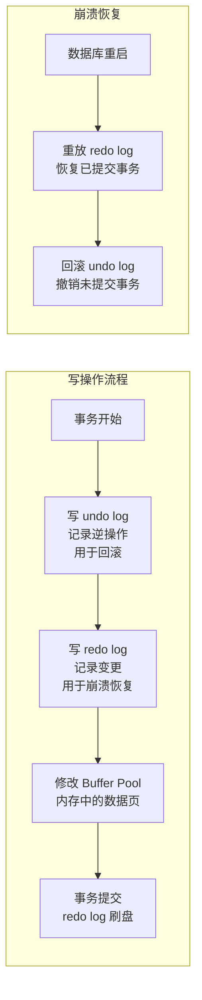
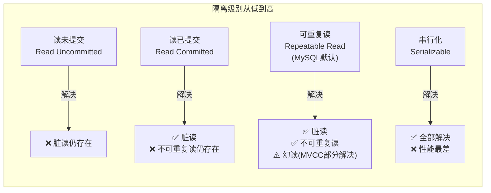
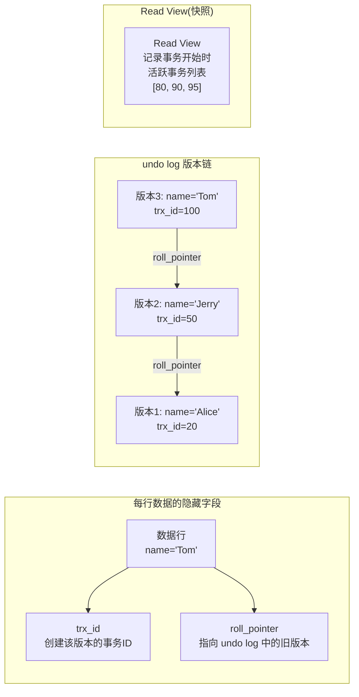

# 事务与并发控制

> **核心问题**：事务的四大特性是什么？InnoDB 是如何保证每一个特性的？MVCC 是如何在不加锁的情况下实现并发读的？四种隔离级别有什么区别？

---

## 它解决了什么问题？

没有事务，银行转账"扣款成功、入账失败"的情况就无法避免。事务保证了一组操作**要么全部成功，要么全部回滚**，是数据一致性的基石。

并发场景下，读写操作如果都加锁，性能会极差。MVCC（多版本并发控制）让**读操作不加锁**，通过读取历史版本数据来避免读写互斥，大幅提升并发性能。

**生活类比**：转账必须"扣款"和"入账"同时成功或同时失败，不能只扣款不入账——这就是事务的原子性。MVCC 就像银行给每笔交易拍了快照，你查余额时看到的是你开始查询时的状态，不受其他人同时操作的影响。

---

# 一、ACID 四大特性

| 特性 | 含义 | InnoDB 实现方式 | 为什么这样实现 |
|------|------|----------------|-------------|
| **原子性** Atomicity | 事务要么全成功，要么全回滚 | **undo log** 回滚 | undo log 记录了每个操作的逆操作，回滚时按逆序执行 |
| **一致性** Consistency | 事务前后数据满足约束 | 由其他三个特性共同保证 | 一致性是目标，原子性/隔离性/持久性是手段 |
| **隔离性** Isolation | 并发事务互不干扰 | **MVCC + 锁** | MVCC 解决读写冲突，锁解决写写冲突 |
| **持久性** Durability | 提交后数据永久保存 | **redo log** 持久化 | redo log 先于数据页写入磁盘（WAL 机制），崩溃后可重放 |

---

# 二、undo log 与 redo log



| 日志类型 | 作用 | 保证的特性 |
|---------|------|---------|
| **undo log** | 记录操作的逆操作，支持回滚 | 原子性 |
| **redo log** | 记录数据页的物理变更，支持崩溃恢复 | 持久性 |

> **WAL（Write-Ahead Logging）机制**：先写日志，再写数据页。redo log 是顺序写（速度快），数据页是随机写（速度慢）。先写 redo log 保证了即使数据页还没落盘，崩溃后也能通过重放 redo log 恢复数据。

---

# 三、四种隔离级别



| 隔离级别 | 脏读 | 不可重复读 | 幻读 | 性能 |
|---------|------|-----------|------|------|
| 读未提交 | ✅ 会 | ✅ 会 | ✅ 会 | 最高 |
| 读已提交 | ❌ 不会 | ✅ 会 | ✅ 会 | 高 |
| **可重复读（默认）** | ❌ 不会 | ❌ 不会 | ⚠️ 部分解决 | 中 |
| 串行化 | ❌ 不会 | ❌ 不会 | ❌ 不会 | 最低 |

> **为什么 MySQL 默认是可重复读而不是读已提交**：MySQL 早期 binlog 是 statement 格式，读已提交下主从复制可能出现数据不一致。可重复读 + 间隙锁可以避免这个问题。现在 binlog 默认是 row 格式，历史原因已不重要，但默认值保留了下来。

---

# 四、MVCC 原理

### 核心组成



每行数据有两个隐藏字段：
- `trx_id`：最后修改该行的事务 ID
- `roll_pointer`：指向 undo log 中的上一个版本

### Read View 判断规则

| 条件 | 结论 |
|------|------|
| `trx_id < min_trx_id`（快照前已提交） | **可见** |
| `trx_id > max_trx_id`（快照后创建） | **不可见** |
| 在活跃列表中（未提交） | **不可见** |
| 不在活跃列表中（已提交） | **可见** |

---

# 五、RC 与 RR 的本质区别

| 隔离级别 | Read View 生成时机 | 效果 |
|---------|-----------------|------|
| **RC（读已提交）** | 每次 SELECT 都生成新的 Read View | 能读到其他事务已提交的最新数据 |
| **RR（可重复读）** | 事务开始时生成一次，整个事务复用 | 保证同一事务内多次读取结果一致 |

> **为什么 RR 能保证可重复读**：整个事务使用同一个 Read View（快照），即使其他事务提交了新数据，当前事务的快照里看不到，所以每次读到的结果相同。

---

# 六、MVCC 不能完全解决幻读

```sql
-- 事务A（RR 隔离级别）
BEGIN;
SELECT COUNT(*) FROM t WHERE age = 18;  -- 返回 0（快照读，MVCC）

-- 事务B 插入一条 age=18 的数据并提交

-- 事务A 继续
INSERT INTO t (age) VALUES (18);  -- 成功！
SELECT COUNT(*) FROM t WHERE age = 18;  -- 返回 2（当前读，看到了自己插入的+事务B的）
-- 这就是幻读！
```

**原因**：`SELECT` 是快照读（MVCC），`INSERT` 后的 `SELECT` 是当前读（看到最新数据）。

**解决方案**：使用 `SELECT ... FOR UPDATE`（当前读 + 间隙锁）。

---

# 七、快照读 vs 当前读

| 读类型 | 触发方式 | 是否加锁 | 看到的数据 |
|--------|---------|---------|---------|
| **快照读** | 普通 SELECT | 不加锁 | 事务开始时的快照（MVCC） |
| **当前读** | `SELECT ... FOR UPDATE`、`SELECT ... LOCK IN SHARE MODE`、INSERT/UPDATE/DELETE | 加锁 | 最新已提交数据 |

---

# 八、事务的基本使用

```java
// Spring 声明式事务（推荐）
@Transactional(rollbackFor = Exception.class)
public void transfer(Long fromId, Long toId, BigDecimal amount) {
    accountMapper.deduct(fromId, amount);   // 扣款
    accountMapper.add(toId, amount);         // 入账
    // 任何异常都会触发回滚
}

// 编程式事务（需要精细控制时使用）
transactionTemplate.execute(status -> {
    try {
        accountMapper.deduct(fromId, amount);
        accountMapper.add(toId, amount);
        return null;
    } catch (Exception e) {
        status.setRollbackOnly();  // 标记回滚
        throw e;
    }
});
```

---

# 九、工作中的坑

### 坑1：事务中大批量操作导致锁等待超时

```java
// ❌ 在一个事务中处理大批量数据，长时间持有行锁
@Transactional
public void batchUpdate(List<Long> ids) {
    for (Long id : ids) {  // ids 可能有几万条
        userMapper.updateStatus(id, 1);  // 每行都加行锁，持有时间极长
    }
}

// ✅ 分批处理，减少锁持有时间
public void batchUpdate(List<Long> ids) {
    Lists.partition(ids, 500).forEach(batch -> {
        transactionTemplate.execute(status -> {
            batch.forEach(id -> userMapper.updateStatus(id, 1));
            return null;
        });
    });
}
```

### 坑2：@Transactional 不生效

```java
// ❌ 同类内部调用，绕过了 Spring AOP 代理，事务不生效
@Service
public class OrderService {
    public void createOrder() {
        this.saveOrder();  // this 调用，不走代理
    }

    @Transactional
    public void saveOrder() { ... }
}

// ✅ 注入自身代理，或将方法拆到另一个 Bean
```

---

# 十、常见问题

**Q：ACID 四大特性分别是什么？InnoDB 如何实现？**

> - 原子性：undo log 支持回滚
> - 一致性：由其他三个特性共同保证
> - 隔离性：MVCC + 锁
> - 持久性：redo log + WAL 机制

**Q：undo log 和 redo log 的区别？**

> undo log 记录操作的逆操作，用于事务回滚，保证原子性；redo log 记录数据页的物理变更，用于崩溃恢复，保证持久性。两者配合实现了 ACID 中的 A 和 D。

**Q：MySQL 默认隔离级别是什么？MVCC 是如何实现可重复读的？**

> 默认可重复读（RR）。MVCC 通过 undo log 版本链 + Read View 实现：RR 级别在事务开始时生成一次 Read View，整个事务复用，所以每次读到的都是事务开始时的快照，保证可重复读。

**Q：RC 和 RR 的区别是什么？**

> 本质区别在于 Read View 的生成时机：RC 每次 SELECT 都生成新的 Read View，能读到已提交的最新数据；RR 整个事务只生成一次，保证可重复读。

**Q：MVCC 能完全解决幻读吗？**

> 不能完全解决。MVCC 的快照读可以避免大部分幻读，但当事务中混用快照读和当前读时，仍可能出现幻读。完全解决幻读需要使用 `SELECT ... FOR UPDATE`（当前读 + 间隙锁）。
