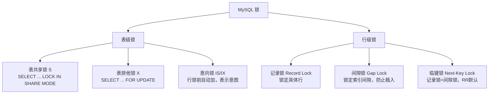
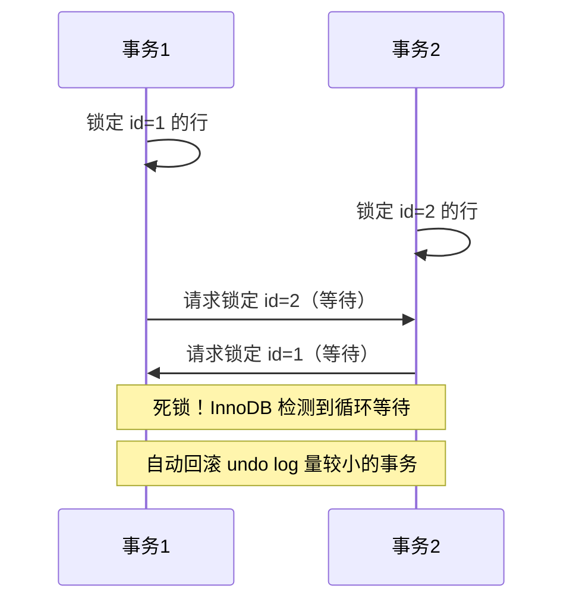

# 锁机制与死锁

> **核心问题**：间隙锁是什么？死锁是如何产生的？如何避免？

---

## 它解决了什么问题？

MVCC 解决了读写冲突，但**写写冲突**仍需要锁来解决。理解锁机制能帮你：
- 排查线上死锁报警
- 理解为什么 RR 隔离级别下某些操作会锁住大范围
- 在高并发写入场景做出正确的隔离级别选择

---

## 锁的分类



---

## 间隙锁详解

**为什么需要间隙锁？** 防止幻读——在 RR 隔离级别下，如果只锁定已有行，其他事务仍可在间隙中插入新行，导致同一事务两次查询结果不同。

```sql
-- 假设表中有 id: 1, 5, 10, 15
-- 执行以下查询（RR 隔离级别）
SELECT * FROM t WHERE id BETWEEN 5 AND 10 FOR UPDATE;

-- 加锁范围（临键锁）：
-- (1, 5] + (5, 10] = 锁定 id 在 (1, 10] 范围
-- 其他事务无法在此范围内插入 id = 3、7、8 等值
```

> **为什么间隙锁只在 RR 级别存在**：RC 级别不需要防止幻读（允许幻读），所以没有间隙锁，并发性更高。这也是为什么高并发写入场景有时会把隔离级别降到 RC——减少间隙锁的范围，降低死锁概率。

### 工作中的坑：间隙锁锁住大范围

```sql
-- 表中 id 只有 1, 5, 10
-- ⚠️ 以下语句在 RR 下会锁住 (5, +∞) 的间隙！
SELECT * FROM t WHERE id > 5 FOR UPDATE;
-- 原因：RR 级别下，范围查询会加临键锁，锁住查询范围内的所有间隙
-- 导致其他事务无法插入 id=6、7、8... 的数据，引发大量锁等待
```

---

## 死锁产生与检测

**死锁产生的四个必要条件**：互斥、占有并等待、不可剥夺、循环等待



**InnoDB 死锁检测**：InnoDB 有内置的死锁检测机制，检测到死锁后会自动回滚其中一个事务（通常是 undo log 量较小的那个），并返回错误 `ERROR 1213: Deadlock found`。

> **为什么回滚 undo log 量小的事务**：回滚代价最小，对业务影响最小。被回滚的事务可以重试，而代价大的事务已经做了很多工作，重试成本更高。

---

## 死锁排查

```sql
-- 查看最近一次死锁信息
SHOW ENGINE INNODB STATUS;

-- 输出中找到 LATEST DETECTED DEADLOCK 部分
-- 可以看到：
-- 1. 哪两个事务发生了死锁
-- 2. 各自持有的锁和等待的锁
-- 3. 哪个事务被回滚
```

---

## 避免死锁的实践

| 实践 | 说明 |
|------|------|
| **固定加锁顺序** | 所有事务按相同顺序访问资源，打破循环等待 |
| **缩短事务** | 减少锁持有时间，降低死锁概率 |
| **避免大事务** | 拆分为小事务，减少锁的范围和持有时间 |
| **精确查询条件** | `SELECT ... FOR UPDATE` 时尽量精确条件，减少间隙锁范围 |
| **降低隔离级别** | 高并发写入场景考虑用 RC，消除间隙锁 |

---

## 常见问题

**Q：间隙锁是什么？为什么需要间隙锁？**

> 间隙锁锁定索引间隙（不存在的区间），防止其他事务在间隙中插入数据，从而防止幻读。只在 RR 隔离级别下存在，RC 级别没有间隙锁。

**Q：如何排查死锁？如何避免死锁？**

> 排查：`SHOW ENGINE INNODB STATUS` 查看最近一次死锁信息。避免：保持固定加锁顺序、缩短事务、减少锁范围、避免大事务。

**Q：为什么高并发写入场景有时会把隔离级别降到 RC？**

> RC 级别没有间隙锁，锁的范围更小，死锁概率更低，并发性更高。代价是允许幻读，但很多业务场景可以接受。