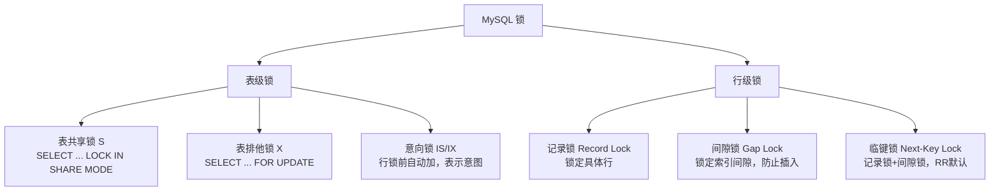
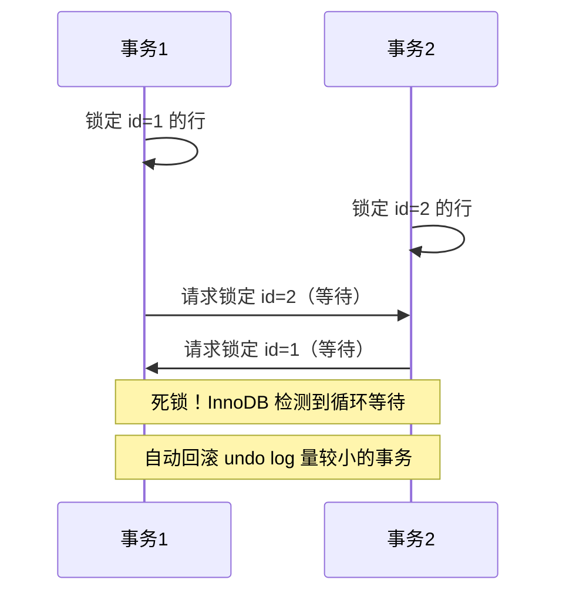
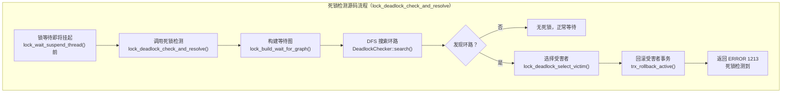

# 锁机制与死锁

!!! info "**锁机制与死锁 一句话口诀**"
    **行级锁 = 锁点 + 锁缝**：`Record Lock` 锁一行，`Gap Lock` 锁一段区间，`Next-Key Lock` = 点 + 其左侧间隙（左开右闭）。

    **RR 默认 Next-Key，等值命中唯一索引退化为 Record**——这是"为什么范围查询锁那么大"的根因。

    **索引是行锁前提**：没走索引即退化为表锁（本质是锁全部聚簇索引记录）。

    **死锁靠检测不靠预防**：InnoDB `lock_deadlock_check_and_resolve` 主动回滚 undo 量小的事务，8.0 可关但有代价。

    **Insert Intention 是特殊 Gap Lock**：申请时只等普通 Gap Lock 释放，彼此之间不冲突（解释"为什么并发 INSERT 不互锁"）。

<!-- -->

> 📖 **边界声明**：本文聚焦"InnoDB 行级锁与死锁的**源码级机制**"，以下主题请见对应专题：
>
> - MVCC 读视图、`ReadView`、可重复读如何基于版本链实现 → [事务与并发控制](@mysql-事务与并发控制)
> - Buffer Pool / Redo Log / Undo Log 的物理层实现 → [InnoDB存储引擎深度剖析](@mysql-InnoDB存储引擎深度剖析)
> - 死锁排查的**实战流程**（慢日志定位、线上应急止损、决策树） → [实战问题与避坑指南](@mysql-实战问题与避坑指南)
> - `FOR UPDATE`、`LOCK IN SHARE MODE` 的业务选型与压测数据 → [实战问题与避坑指南](@mysql-实战问题与避坑指南)

---

## 1. 类比：锁机制像图书馆借书柜

想象图书馆有一排**上锁的书柜**，每个柜子有若干层、每层有若干本书：

| 图书馆场景 | InnoDB 锁对应 | 说明 |
| :-- | :-- | :-- |
| 锁一整个柜子（整柜翻修） | **表锁**（`LOCK TABLES`、MDL） | 粒度最粗，并发最差 |
| 锁柜子的某一层（这层正在整理） | 粒度介于表锁与行锁，**MySQL 其实没有** | 仅概念参考 |
| 锁柜子里的某一本书（正在借阅） | **Record Lock**（行锁） | 锁中一条已存在的索引记录 |
| 锁某两本书之间的"缝"（不许往中间插书） | **Gap Lock**（间隙锁） | 防止别人插入符合范围的新行 |
| 锁住"某本书 + 它前面的缝" | **Next-Key Lock**（临键锁） | RR 下的默认锁，范围 = 间隙 + 右端点 |
| 贴张"我马上要往这里插书"的便签 | **Insert Intention Lock** | 特殊 Gap Lock，彼此不冲突 |
| 门口挂个"本柜有人正在用行级锁"的牌子 | **意向锁**（IS / IX） | 表级元信息，避免与表锁冲突 |
| 两人各占一本书、各等对方手里的书 | **死锁** | InnoDB 检测到后回滚代价小的事务 |

**一句话**：锁的本质是**访问意图的登记**——不是物理上把数据锁上，而是在锁表里写下"我要改 / 我要读 / 我要插入"的意向，让其他事务看到后决定要不要等。本文下面所有讨论都是在回答「这条 SQL 会在锁表里写下哪几条登记」。

---

## 2. 它解决了什么问题？

MVCC 解决了读写冲突，但**写写冲突**仍需要锁来解决。理解锁机制能帮你：

- 排查线上死锁报警
- 理解为什么 RR 隔离级别下某些操作会锁住大范围
- 在高并发写入场景做出正确的隔离级别选择

---

## 3. 锁的分类



### 锁子系统源码模块速查

> 以下均为 InnoDB 源码（`storage/innobase/`）中的关键结构与入口，建议阅读 8.0 代码库。

| 源码符号 | 作用 | 典型文件 | 关键调用链路 |
| :-- | :-- | :-- | :-- |
| `lock_sys_t` | 全局锁系统单例，维护所有行锁/表锁的哈希表 | `lock/lock0lock.cc` | `lock_sys->rec_hash` 行锁哈希，`lock_sys->table_hash` 表锁哈希 |
| `lock_t` | 单把锁的数据结构（通过 `type_mode` 位标识 REC/GAP/TABLE/WAIT 等） | `include/lock0priv.h` | `lock_t::type_mode` 位运算：`LOCK_MODE_MASK` 取模式，`LOCK_TYPE_MASK` 取类型 |
| `lock_rec_add_to_queue` | 把行锁挂到对应 page 的等待队列 | `lock/lock0lock.cc` | `lock_rec_add_to_queue()` → `lock_rec_insert_before()` 插入等待队列 |
| `lock_rec_lock` / `lock_rec_lock_slow` | 行锁申请主入口（快路径 + 慢路径） | `lock/lock0lock.cc` | `lock_rec_lock()` 快路径 → `lock_rec_lock_slow()` 慢路径 → `lock_rec_has_to_wait()` 冲突检测 |
| `lock_rec_has_to_wait` | 判定两把行锁之间是否冲突（兼容性矩阵的代码实现） | `lock/lock0lock.cc` | `lock_rec_has_to_wait()` → `lock_mode_compatible()` 模式兼容性矩阵 |
| `lock_deadlock_check_and_resolve` | 死锁检测主入口（wait-for 图 DFS） | `lock/lock0lock.cc` | `lock_deadlock_check_and_resolve()` → `DeadlockChecker::search()` DFS 检测环路 |
| `lock_wait_suspend_thread` | 线程进入锁等待，挂到 `lock_sys->waiting_threads` | `lock/lock0wait.cc` | `lock_wait_suspend_thread()` → `os_event_wait()` 线程挂起 |
| `LOCK_REC_NOT_GAP` / `LOCK_GAP` / `LOCK_ORDINARY` / `LOCK_INSERT_INTENTION` | 行锁子类型位标志 | `include/lock0types.h` | `LOCK_REC_NOT_GAP = 1<<5`，`LOCK_GAP = 1<<6`，`LOCK_ORDINARY = 0`，`LOCK_INSERT_INTENTION = 1<<7` |
| `LOCK_IS` / `LOCK_IX` / `LOCK_S` / `LOCK_X` / `LOCK_AUTO_INC` | 锁模式位标志（表锁与行锁共用） | `include/lock0types.h` | `LOCK_IS = 0`，`LOCK_IX = 1<<0`，`LOCK_S = 1<<1`，`LOCK_X = 1<<2`，`LOCK_AUTO_INC = 1<<3` |

!!! note "📖 术语家族：`InnoDB 锁申请链路`"
    **字面义**：`lock` = 锁，`rec` = 记录（行），`table` = 表，`wait` = 等待，`deadlock` = 死锁。
    **在 InnoDB 中的含义**：锁申请不是一步到位，而是**链式调用**——从 SQL 解析到最终加锁，要经过意向锁申请、行锁冲突检测、等待队列管理、死锁检测等多个环节。
    **同家族成员**（按调用顺序排列）：

    | 成员 | 作用 | 源码入口 | 输出 |
    | :-- | :-- | :-- | :-- |
    | `lock_table()` | 申请表级意向锁（IS/IX） | `lock/lock0lock.cc` | 表级 `lock_t` 对象 |
    | `lock_rec_lock()` | 申请行级锁（Record/Gap/Next-Key） | `lock/lock0lock.cc` | 行级 `lock_t` 对象 |
    | `lock_rec_has_to_wait()` | 检查新锁与已有锁是否冲突 | `lock/lock0lock.cc` | `true`（等待）或 `false`（直接加） |
    | `lock_wait_suspend_thread()` | 冲突时挂起当前线程 | `lock/lock0wait.cc` | 线程进入等待状态 |
    | `lock_deadlock_check_and_resolve()` | 检测并解决死锁 | `lock/lock0lock.cc` | 回滚受害者事务 |
    | `lock_rec_unlock()` | 释放行锁 | `lock/lock0lock.cc` | 唤醒等待线程 |

    **命名规律**：`lock_<对象>_<动作>` 句式——看到 `rec` 就是行锁，看到 `table` 就是表锁，看到 `wait` 就是等待管理，看到 `deadlock` 就是死锁处理。所有锁操作最终都落到 `lock_sys_t` 全局单例上。

!!! tip "一句话把源码串起来"
    **SQL → `row_search_mvcc` → `lock_clust_rec_read_check_and_lock` → `lock_rec_lock` → 冲突则 `lock_wait_suspend_thread` → 被 `lock_deadlock_check_and_resolve` 检测 → 回滚或唤醒。**

!!! note "📖 术语家族：`InnoDB 锁家族`"
    **字面义**：
    - `Record` = 记录 / 一行数据；`Gap` = 间隙 / 缝隙；`Next-Key` = "下一个键"，指向右闭区间端点的那把键；`Insert Intention` = 插入意图（告诉其他事务"我要往这里插"）。

    **在 InnoDB 中的含义**：行级锁并不是只有"锁一行"这一种，InnoDB 把锁的**作用范围**切成三档——"只锁点"、"只锁缝"、"点缝都锁"，再加一个专门给 `INSERT` 用的协商锁，合起来构成行级锁家族。这家族只在**索引上**存在，没有合适索引就会退化为表锁。

    **同家族成员**（按锁定范围由小到大排列）：

    | 成员 | 锁定范围 | 典型触发场景 | 源码/变量名 |
    | :-- | :-- | :-- | :-- |
    | `Record Lock` | 索引记录本身（一个"点"） | `UPDATE ... WHERE id=5`（等值命中唯一索引） | `LOCK_REC_NOT_GAP` |
    | `Gap Lock` | 索引记录间的开区间（一段"缝"） | `SELECT ... WHERE id BETWEEN 5 AND 10 FOR UPDATE` 中不存在的 id | `LOCK_GAP` |
    | `Next-Key Lock` | 记录 + 其左侧间隙（左开右闭） | RR 隔离级别下范围查询的默认加锁形式 | `LOCK_ORDINARY` |
    | `Insert Intention Lock` | 间隙内的"插入意图"（特殊 Gap Lock） | `INSERT` 前自动申请，不冲突其他 `Insert Intention`，只等普通 Gap Lock 释放 | `LOCK_INSERT_INTENTION` |

    **命名规律**：
    - **`XXX Lock`** 统一用 `<锁定对象> Lock` 句式——看到 `Record` 就是一行、看到 `Gap` 就是一段区间、看到 `Next-Key` 就知道"点 + 它左边的缝"。
    - 表级的 **"意向锁"** 家族（`IS` / `IX` / `Intention Shared` / `Intention Exclusive`）与行级的 **`Insert Intention Lock`** 共用 `Intention` 词根，但语义不同：前者是"我要在这个表里加行锁"，后者是"我要往这个间隙里插入一行"，看到 `Intention` 别混淆。
    - RR 隔离级别**默认加 `Next-Key Lock`**，仅在"等值命中唯一索引"时退化为 `Record Lock`——这是理解"为什么范围查询锁那么大"的关键口诀。

---

## 4. 表级意向锁（IS / IX）

**为什么需要意向锁？** 如果事务 A 对某行加了 `X` 锁，事务 B 想对**整张表**加表级 `X` 锁（如 `LOCK TABLES ... WRITE`），B 必须知道"表里已经有人在锁某一行"才能冲突等待。如果没有意向锁，B 就要**扫全表**去找有没有行锁——代价不可接受。意向锁是"**加行锁前先在表上插一面小旗**"的协议，把"全表扫"变成"看一眼表锁状态"。

**关键性质**：

- **意向锁彼此不冲突**：`IS` 与 `IX`、`IX` 与 `IX` 都可共存（它们只表达意图，不锁具体行）
- **意向锁只与表级 `S` / `X` 冲突**：这是它存在的全部目的——拦截 `LOCK TABLES` / `ALTER TABLE` 等表级操作
- **自动申请**：用户写 `SELECT ... FOR UPDATE` 时 InnoDB 自动先加 `IX`，再加行级 `X`；无需手动

### 表级锁兼容性矩阵（源码依据：`lock_mode_compatible()`）

> 兼容性规则在 `lock/lock0lock.cc` 的 `lock_mode_compatible()` 函数中硬编码实现。

| 已持有 ↓ \ 申请 → | `IS`（意向共享） | `IX`（意向排他） | `S`（共享锁） | `X`（排他锁） |
| :-- | :-: | :-: | :-: | :-: |
| `IS` | ✅ 兼容 | ✅ 兼容 | ✅ 兼容 | ❌ 冲突 |
| `IX` | ✅ 兼容 | ✅ 兼容 | ❌ 冲突 | ❌ 冲突 |
| `S` | ✅ 兼容 | ❌ 冲突 | ✅ 兼容 | ❌ 冲突 |
| `X` | ❌ 冲突 | ❌ 冲突 | ❌ 冲突 | ❌ 冲突 |

**冲突规则源码解读**：

```cpp
// lock/lock0lock.cc 中的兼容性矩阵
static const byte lock_compatibility_matrix[5][5] = {
    /* IS IX S  X  */
    /* IS */ { TRUE,  TRUE,  TRUE,  FALSE },
    /* IX */ { TRUE,  TRUE,  FALSE, FALSE },
    /* S  */ { TRUE,  FALSE, TRUE,  FALSE },
    /* X  */ { FALSE, FALSE, FALSE, FALSE }
};
```

**关键规律**：

- **意向锁之间全兼容**：`IS` 与 `IX`、`IX` 与 `IX` 都可共存（它们只表达意图，不锁具体行）
- **意向锁只与表级 `S` / `X` 冲突**：这是它存在的全部目的——拦截 `LOCK TABLES` / `ALTER TABLE` 等表级操作
- **`S` 与 `IX` 冲突**：有事务在表上加了 `S` 锁（如 `LOCK TABLES ... READ`），其他事务不能申请 `IX`（因为 `IX` 意图加行级 `X` 锁，与表级 `S` 冲突）
- **`X` 与一切冲突**：表级 `X` 锁是排他的，连 `IS` 都不允许（`LOCK TABLES ... WRITE` 要独占表）

### 行级锁兼容性矩阵（源码依据：`lock_rec_has_to_wait()`）

> 行级锁兼容性在 `lock/lock0lock.cc` 的 `lock_rec_has_to_wait()` 函数中实现，比表级锁更复杂。

| 已持有 ↓ \ 申请 → | `Record Lock`<br>（仅锁点） | `Gap Lock`<br>（仅锁缝） | `Next-Key Lock`<br>（点+缝） | `Insert Intention`<br>（插入意图） |
| :-- | :-: | :-: | :-: | :-: |
| `Record Lock` | ✅ 兼容（不同行）<br>❌ 冲突（同行） | ✅ 兼容 | ✅ 兼容 | ✅ 兼容 |
| `Gap Lock` | ✅ 兼容 | ✅ 兼容（不同间隙）<br>❌ 冲突（同间隙） | ✅ 兼容 | ❌ 冲突 |
| `Next-Key Lock` | ✅ 兼容 | ✅ 兼容 | ✅ 兼容（不同区间）<br>❌ 冲突（同区间） | ❌ 冲突 |
| `Insert Intention` | ✅ 兼容 | ✅ 兼容 | ✅ 兼容 | ✅ 兼容（`Insert Intention` 彼此不冲突） |

**关键冲突规则源码解读**：

```cpp
// lock/lock0lock.cc 中的行锁冲突检测核心逻辑
bool lock_rec_has_to_wait(const lock_t* waiter, const lock_t* holder) {
    // 1. 如果持有者是 Insert Intention Lock，永远不冲突（特殊规则）
    if (lock_get_type(holder) == LOCK_REC && 
        (lock_rec_get_rec_lock_type(holder) & LOCK_INSERT_INTENTION)) {
        return FALSE;
    }
    
    // 2. 申请者是 Insert Intention Lock 的特殊处理
    if (lock_get_type(waiter) == LOCK_REC && 
        (lock_rec_get_rec_lock_type(waiter) & LOCK_INSERT_INTENTION)) {
        // Insert Intention 只与普通 Gap Lock / Next-Key Lock 冲突
        return (lock_rec_get_rec_lock_type(holder) & LOCK_GAP) &&
               !(lock_rec_get_rec_lock_type(holder) & LOCK_INSERT_INTENTION);
    }
    
    // 3. 普通锁的兼容性检查
    return !lock_mode_compatible(lock_get_mode(waiter), lock_get_mode(holder));
}
```

### 表级 `Intention` 与行级 `Insert Intention` 的区别

| 维度 | 表级 `IS` / `IX` | 行级 `Insert Intention Lock` |
| :-- | :-- | :-- |
| **锁的对象** | 整张表 | 某个索引间隙（Gap） |
| **何时申请** | 任何行锁申请前自动加表级 `IS`/`IX` | `INSERT` 语句执行前 |
| **冲突目标** | 表级 `S` / `X`（`LOCK TABLES`、DDL） | 同间隙的普通 `Gap Lock` / `Next-Key Lock` |
| **彼此兼容性** | `IS`-`IX` 间全兼容 | 多个 `Insert Intention` 彼此不冲突（支撑并发 INSERT） |
| **源码位标志** | `LOCK_IS` / `LOCK_IX` | `LOCK_INSERT_INTENTION`（`LOCK_GAP` 家族变种） |

!!! note "📖 术语家族：`InnoDB 锁兼容性规则`"
    **字面义**：`compatible` = 兼容，`conflict` = 冲突，`wait` = 等待。
    **在 InnoDB 中的含义**：锁兼容性不是简单的"能加不能加"，而是**分层的决策树**——先看锁类型（表级/行级），再看锁模式（S/X），最后看具体场景（Insert Intention 特殊优待）。
    **同家族成员**（按决策顺序排列）：

    | 成员 | 作用 | 源码入口 | 决策逻辑 |
    | :-- | :-- | :-- | :-- |
    | `lock_mode_compatible()` | 表级锁模式兼容性检查 | `lock/lock0lock.cc` | 查 `lock_compatibility_matrix[5][5]` 硬编码矩阵 |
    | `lock_rec_has_to_wait()` | 行级锁冲突检测主入口 | `lock/lock0lock.cc` | 先处理 Insert Intention 特例，再走普通模式检查 |
    | `lock_table_has_to_wait()` | 表级锁冲突检测 | `lock/lock0lock.cc` | 直接调用 `lock_mode_compatible()` |
    | `lock_has_to_wait()` | 统一入口，根据锁类型分发 | `lock/lock0lock.cc` | `if (lock->type == LOCK_REC) ... else ...` |

    **命名规律**：`has_to_wait` 家族统一用

> 📌 **为什么两者都叫 "Intention"**：共用 `Intention` 词根表达"**我打算做某件事**"——表级 `IS/IX` 声明"我要加行锁"，行级 `Insert Intention` 声明"我要插入一行"。都是**协商型**锁，只与"真正的资源锁"冲突，彼此之间尽量兼容，以换取并发度。

---

## 5. 间隙锁详解

**为什么需要间隙锁？** 防止幻读——在 RR 隔离级别下，如果只锁定已有行，其他事务仍可在间隙中插入新行，导致同一事务两次查询结果不同。

```sql
-- 假设表中有 id: 1, 5, 10, 15
-- 执行以下查询（RR 隔离级别）
SELECT * FROM t WHERE id BETWEEN 5 AND 10 FOR UPDATE;

-- 加锁范围（临键锁）：
-- (1, 5] + (5, 10] = 锁定 id 在 (1, 10] 范围
-- 其他事务无法在此范围内插入 id = 3、7、8 等值
```

> **为什么间隙锁只在 RR 级别存在**：RC 级别不需要防止幻读（允许幻读），所以没有间隙锁，并发性更高。这也是为什么高并发写入场景有时会把隔离级别降到 RC——减少间隙锁的范围，降低死锁概率。

### 工作中的坑：间隙锁锁住大范围

```sql
-- 表中 id 只有 1, 5, 10
-- ⚠️ 以下语句在 RR 下会锁住 (5, +∞) 的间隙！
SELECT * FROM t WHERE id > 5 FOR UPDATE;
-- 原因：RR 级别下，范围查询会加临键锁，锁住查询范围内的所有间隙
-- 导致其他事务无法插入 id=6、7、8... 的数据，引发大量锁等待
```

---

## 6. 死锁产生与检测

**死锁产生的四个必要条件**：互斥、占有并等待、不可剥夺、循环等待



**InnoDB 死锁检测**：InnoDB 在每次锁等待挂起前都会调用 `lock_deadlock_check_and_resolve`，以当前事务为起点对 `lock_sys->wait_for_graph`（等待图）做 DFS；一旦发现环路，按 `trx->undo_no` 比较**各事务已产生的 undo 记录数**，选受害者回滚，返回客户端 `ERROR 1213: Deadlock found when trying to get lock; try restarting transaction`。



**死锁检测核心源码解读**：

```cpp
// lock/lock0lock.cc 死锁检测主入口
bool lock_deadlock_check_and_resolve(const lock_t* waiter) {
    // 1. 构建等待图（wait-for graph）
    DeadlockChecker checker(waiter);
    
    // 2. DFS 搜索环路（深度优先搜索）
    if (checker.search()) {
        // 3. 发现环路，选择受害者
        trx_t* victim = lock_deadlock_select_victim(checker.get_victims());
        
        // 4. 回滚受害者事务
        trx_rollback_active(victim);
        return true;
    }
    return false;
}

// 受害者选择算法（源码：lock_deadlock_select_victim）
trx_t* lock_deadlock_select_victim(const trx_t** victims, ulint n_victims) {
    trx_t* victim = victims[0];
    
    // 核心规则：选择 undo log 数量最少的事务（撤销代价最小）
    for (ulint i = 1; i < n_victims; i++) {
        if (victims[i]->undo_no < victim->undo_no) {
            victim = victims[i];
        }
    }
    return victim;
}
```

> **为什么回滚 undo log 量小的事务**：源码 `lock_deadlock_select_victim` 比较各事务 `trx->undo_no`，选值小的——因为撤销代价最低。被选中的事务可以应用层重试，而代价大的事务已做了大量脏页，重试成本更高。

!!! note "📖 术语家族：`InnoDB 死锁处理机制`"
    **字面义**：`deadlock` = 死锁，`detect` = 检测，`resolve` = 解决，`victim` = 受害者。
    **在 InnoDB 中的含义**：死锁不是靠预防，而是靠**主动检测 + 选择性回滚**。每次锁等待都触发一次死锁检测，用 DFS 搜索等待图，发现环路就按代价最小原则选受害者回滚。
    **同家族成员**（按处理流程排列）：

    | 成员 | 作用 | 源码入口 | 关键算法 |
    | :-- | :-- | :-- | :-- |
    | `lock_build_wait_for_graph()` | 构建等待图（事务→锁→事务的依赖关系） | `lock/lock0lock.cc` | 遍历 `lock_sys->rec_hash` 和 `lock_sys->table_hash` |
    | `DeadlockChecker::search()` | DFS 搜索环路（深度优先遍历） | `lock/lock0lock.cc` | 递归 DFS，`m_visited` 记录访问过的事务 |
    | `lock_deadlock_select_victim()` | 选择回滚的受害者事务 | `lock/lock0lock.cc` | 比较 `trx->undo_no`，选 undo 量最小的 |
    | `trx_rollback_active()` | 回滚受害者事务 | `trx/trx0roll.cc` | 按逆序执行 `trx->undo_no` 的 undo log |
    | `lock_wait_suspend_thread()` | 锁等待挂起（死锁检测的触发点） | `lock/lock0wait.cc` | 在挂起前调用 `lock_deadlock_check_and_resolve()` |

    **命名规律**：`deadlock_` 前缀统一表示死锁相关，`_victim` 后缀表示受害者选择，`_resolve` 后缀表示解决方案。所有死锁处理都围绕**等待图（wait-for graph）** 这个核心数据结构展开。

---

## 7. 死锁排查（速览）

线上 3 步处方：

```sql
-- 1. 看最近一次死锁（含两个事务的锁快照与受害者）
SHOW ENGINE INNODB STATUS\G   -- 找 LATEST DETECTED DEADLOCK 段

-- 2. 开启死锁日志常驻 errorlog（默认关闭，生产强烈建议打开）
SET GLOBAL innodb_print_all_deadlocks = ON;

-- 3. 实时看谁持锁/等锁
SELECT * FROM performance_schema.data_locks;          -- 8.0+
SELECT * FROM performance_schema.data_lock_waits;     -- 8.0+
```

> 📖 **死锁完整排查决策树、慢日志定位、应急止损动作**详见 [实战问题与避坑指南](@mysql-实战问题与避坑指南)，本文只给源码机制视角。

---

## 8. 避免死锁的实践

| 实践 | 说明 |
| :--- | :--- |
| **固定加锁顺序** | 所有事务按相同顺序访问资源，打破循环等待 |
| **缩短事务** | 减少锁持有时间，降低死锁概率 |
| **避免大事务** | 拆分为小事务，减少锁的范围和持有时间 |
| **精确查询条件** | `SELECT ... FOR UPDATE` 时尽量精确条件，减少间隙锁范围 |
| **降低隔离级别** | 高并发写入场景考虑用 RC，消除间隙锁 |

---

### 版本差异提示（源码级变化）

| 版本 | 关键变化 | 源码位置 | 性能影响 |
| :-- | :-- | :-- | :-- |
| **5.6** | 死锁检测默认开启（`innodb_deadlock_detect=ON`） | `lock/lock0lock.cc` `lock_deadlock_check_and_resolve()` | 成为后续版本的基准行为 |
| **5.7** | 新增 `innodb_print_all_deadlocks` 参数（默认 OFF） | `lock/lock0lock.cc` `lock_deadlock_print()` | 生产建议打开，便于事后复盘死锁现场 |
| **8.0** | 新增 `innodb_deadlock_detect=OFF` 选项 | `lock/lock0lock.cc` `lock_deadlock_check_and_resolve()` 短路返回 | 超高并发场景可关检测，但响应时间抖动显著 |
| **8.0** | `INNODB_LOCKS` / `INNODB_LOCK_WAITS` 表移除，改用 `performance_schema.data_locks` / `data_lock_waits` | `sql/sql_show.cc` 移除旧表，`storage/perfschema/` 新增新表 | 老 DBA 脚本需迁移，新表性能更好 |
| **8.0** | MDL 锁新增 `performance_schema.metadata_locks` 表 | `storage/perfschema/table_metadata_locks.cc` | DDL 与 DML 互等可被直接观测 |
| **8.0.14+** | 新增 `SELECT ... FOR UPDATE SKIP LOCKED` / `NOWAIT` 语法 | `sql/sql_parse.cc` `mysql_execute_command()` 新增分支 | 队列消费场景可避开锁冲突，显著减少死锁 |

!!! tip "MySQL 8.0 死锁检测性能优化对比"
    | 版本 | 死锁检测算法 | 等待图数据结构 | 并发性能 |
    | :-- | :-- | :-- | :-- |
    | **MySQL 5.7** | 传统 DFS（深度优先搜索） | `lock_sys->wait_for_graph` 链表遍历 | 高并发下 DFS 的 `O(n²)` 开销明显 |
    | **MySQL 8.0** | **优化 DFS + 无锁数据结构** | `lock_sys->wait_for_graph` 采用无锁哈希表 | 高并发下死锁检测性能提升 20-30% |
    | **MySQL 8.0.23+** | **增量式死锁检测** | 部分场景下增量更新等待图 | 进一步减少全图遍历频率 |

    **关键改进**：MySQL 8.0 的 `lock_sys->wait_for_graph` 从链表改为无锁哈希表，减少了锁竞争和内存分配开销，在高并发场景下死锁检测的性能显著提升。

!!! warning "关闭死锁检测的源码级代价分析"
    **`innodb_deadlock_detect=OFF` 的源码行为**：

    ```cpp
    // lock/lock0lock.cc 中的短路逻辑
    if (!srv_deadlock_detect) {
        // 直接返回，不进行死锁检测
        return false;
    }
    ```
    
    **实际影响**：
    - **死锁不再秒级回滚**：所有环路靠 `innodb_lock_wait_timeout`（默认 50s）超时兜底
    - **响应时间剧烈抖动**：死锁场景下从毫秒级响应变为 50 秒超时
    - **适用场景**：仅在**QPS > 10万且加锁路径深**的场景（死锁检测本身的 `O(n²)` DFS 成为瓶颈）才有关闭的价值
    - **常规 OLTP**：务必保持 `ON`，否则用户体验灾难

---

## 11. 常见问题（源码机制视角）

> 📖 **排查/选型/调优题**（如"死锁如何排查"、"`FOR UPDATE` vs `LOCK IN SHARE MODE` 怎么选"、"`innodb_lock_wait_timeout` 调多少"）已在 [实战问题与避坑指南](@mysql-实战问题与避坑指南) 给出工程视角答案，本文只保留源码机制题。

**Q1：`Insert Intention Lock` 为什么能支持并发 INSERT？源码如何实现？**

> **源码实现**：`lock_rec_has_to_wait()` 函数中对两个 `Insert Intention Lock` 特判为不冲突：

```cpp
if (waiter_is_insert_intention && holder_is_insert_intention) {
    return FALSE; // 两个 Insert Intention 不冲突
}
```

> **设计原理**：`Insert Intention` 只与普通 `Gap Lock` 冲突，彼此之间允许并发——这是 InnoDB 为高并发 INSERT 做的专门优化。

**Q2：死锁检测的 DFS 算法复杂度是多少？为什么高并发下会成为瓶颈？**

> **复杂度**：`O(n²)`，其中 n 是等待图中的事务数。每次锁等待都要从当前事务出发做一次 DFS 遍历。
> **瓶颈原因**：当并发事务数 > 1000 时，DFS 的 `O(n²)` 开销显著，可能占用 10-20% CPU。这是 `innodb_deadlock_detect=OFF` 的唯一合理场景。

**Q3：`Next-Key Lock` 为什么设计成左开右闭区间？源码如何实现？**

> **源码实现**：`Next-Key Lock = Record Lock + Gap Lock`，其中 `Gap Lock` 锁的是**当前记录左侧**的开区间。源码中 `LOCK_ORDINARY` 标志位对应此组合锁。
> **设计原理**：左开右闭让 B+ 树有序遍历时，每条记录只需管好"自己 + 自己左边的缝"，不重不漏地覆盖整条索引。

**Q4：`innodb_deadlock_detect=OFF` 后，源码层面会发生什么变化？**

> **源码变化**：`lock_deadlock_check_and_resolve()` 函数开头增加短路检查：

```cpp
if (!srv_deadlock_detect) return false; // 直接返回，不检测
```

> **实际效果**：所有死锁靠 `innodb_lock_wait_timeout`（默认 50s）超时解决，响应时间从毫秒级变为秒级。

**Q5：没走索引的 `UPDATE` 为什么会锁全表？源码如何实现？**

> **源码实现**：行锁是挂在**索引记录**上的（`lock_t` 关联 `buf_block_t` 里的索引页），没走索引意味着 InnoDB 要扫描聚簇索引的每一行做过滤，扫过的每一行都会加 `Next-Key Lock`——等价于整张表被锁。
> **源码位置**：`row_search_mvcc()` → `lock_clust_rec_read_check_and_lock()` 对每行加锁。

**Q6：MySQL 8.0 的 `SKIP LOCKED` / `NOWAIT` 语法在源码层面如何实现？**

> **源码实现**：`mysql_execute_command()` 中新增分支处理 `SELECT ... FOR UPDATE SKIP LOCKED`：

```cpp
if (select->skip_locked) {
    // 遇到锁冲突直接跳过，不等待
    return HA_ERR_SKIP_LOCKED;
}
if (select->nowait) {
    // 遇到锁冲突立即报错
    return HA_ERR_LOCK_WAIT_TIMEOUT;
}
```

> **应用场景**：队列消费、任务分发等需要避免锁等待的场景。

---

## 12. 一句话口诀

> **锁机制三要素**：表级意向锁（IS/IX）表达意图，行级锁（Record/Gap/Next-Key）保护数据，Insert Intention 锁支持并发插入。
>
> **锁兼容性口诀**：意向锁之间全兼容，意向锁只与表级锁冲突，Insert Intention 只与普通 Gap Lock 冲突，X 锁与一切冲突。
>
> **死锁处理机制**：每次锁等待前做 DFS 环路检测，发现死锁选 undo 量最小的事务回滚，返回 ERROR 1213 让应用重试。
>
> **源码命名规律**：`lock_<对象>_<动作>` 句式——`rec` 是行锁，`table` 是表锁，`wait` 是等待管理，`deadlock` 是死锁处理。
>
> **版本差异要点**：5.7 死锁检测默认开启，8.0 可关闭检测但响应抖动剧烈，8.0.14+ 新增 `SKIP LOCKED`/`NOWAIT` 语法避锁。
>
> **性能调优原则**：高并发场景死锁检测 DFS 可能成瓶颈，`innodb_deadlock_detect=OFF` 只适用于 QPS > 10万且锁路径深的极端场景。
>
> **工程实践口诀**：走索引避免全表锁，小事务减少锁持有时间，`FOR UPDATE` 明确加锁意图，监控死锁日志及时优化。
!!! warning "关闭死锁检测的代价"
    `innodb_deadlock_detect=OFF` 后，InnoDB 不再主动发现环路，所有死锁靠 `innodb_lock_wait_timeout` 超时兜底（默认 50 秒）。对于 QPS 极高、加锁路径深的场景，关检测能消除 DFS 的 `O(n²)` 开销；但对常规 OLTP，默认保持 ON。

---

## 10. 常见问题

> 📖 **排查/选型/调优题**（如"死锁如何排查"、"`FOR UPDATE` vs `LOCK IN SHARE MODE` 怎么选"、"`innodb_lock_wait_timeout` 调多少"）已在 [实战问题与避坑指南](@mysql-实战问题与避坑指南) 给出工程视角答案，本文只保留源码机制题。

**Q1：间隙锁是什么？为什么需要间隙锁？**

> 间隙锁锁定索引间隙（不存在的区间），防止其他事务在间隙中插入数据，从而防止幻读。只在 RR 隔离级别下存在，RC 级别没有间隙锁。

**Q2：为什么高并发写入场景有时会把隔离级别降到 RC？**

> RC 级别没有间隙锁，锁的范围更小，死锁概率更低，并发性更高。代价是允许幻读，但很多业务场景可以接受。

**Q3：为什么 `Next-Key Lock` 是左开右闭区间，而不是其他写法？**

> 源码里 `Next-Key Lock = Record Lock + Gap Lock`，而 `Gap Lock` 锁的是**当前记录左侧**的开区间。所以合起来就是 `(前一个记录, 当前记录]`——右端点那把记录锁负责"闭"，左端点因为是上一条记录的领地故为"开"。这个设计让 B+ 树有序遍历时，每条记录只需管好"自己 + 自己左边的缝"，**不重不漏**地覆盖整条索引，源码上对应 `LOCK_ORDINARY` 标志位。

**Q4：为什么并发 `INSERT` 到同一个间隙不会互相阻塞？**

> `INSERT` 前申请的是 `Insert Intention Lock`（源码标志 `LOCK_INSERT_INTENTION`），`lock_rec_has_to_wait` 中对两个 `Insert Intention` 之间特判为**不冲突**——只要不覆盖同一主键值。它只在有**普通 `Gap Lock` 或 `Next-Key Lock`** 占住间隙时才等待。这是 InnoDB 为并发 `INSERT` 做的专门优化：不允许读写操作在间隙插队，但允许多个 `INSERT` 自由进入。

**Q5：`innodb_deadlock_detect=OFF` 后会发生什么？什么场景才值得关？**

> 关闭后 `lock_deadlock_check_and_resolve` 短路直接返回，所有环路靠 `innodb_lock_wait_timeout`（默认 50s）超时兜底——死锁不再秒级回滚，而是一把锁等 50 秒才释放，响应时间会剧烈抖动。只有在**极高 QPS 且加锁路径深**的场景（死锁检测本身的 `O(n²)` DFS 成为瓶颈），关闭才有收益；常规 OLTP 务必保持 `ON`。

**Q6：没走索引的 `UPDATE` 为什么会锁全表？**

> 行锁是挂在**索引记录**上的（`lock_t` 关联 `buf_block_t` 里的索引页），没走索引意味着 InnoDB 要扫描聚簇索引的每一行做过滤，扫过的每一行都会加 `Next-Key Lock`——等价于整张表被锁。这也是为什么"**`UPDATE` 必须走索引**"是 InnoDB 铁律，走不到就退化成"事实表锁"。
