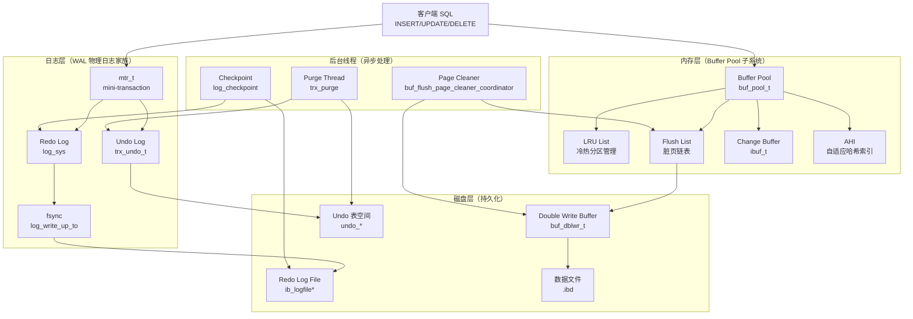
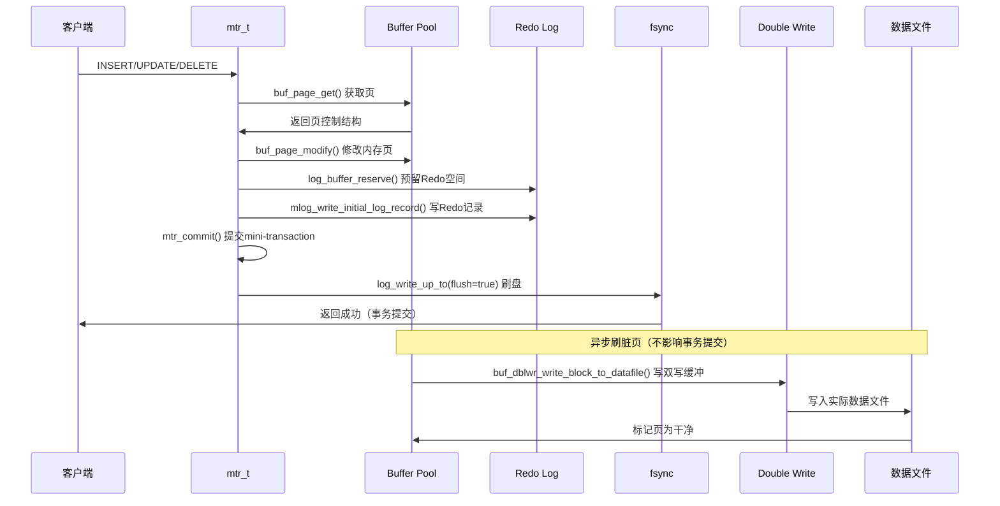
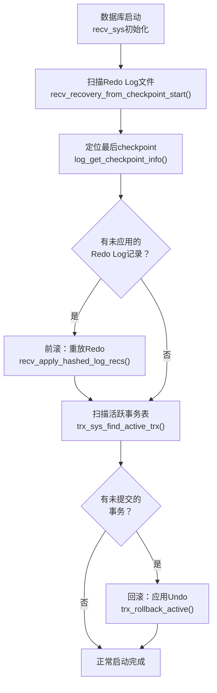
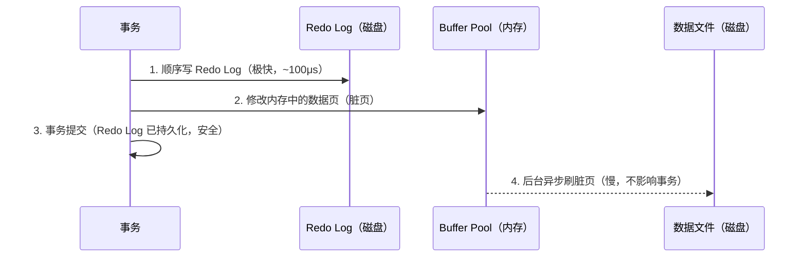
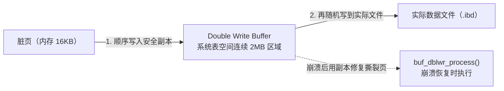

# InnoDB 存储引擎深度剖析

!!! info "**InnoDB 存储引擎深度剖析 一句话口诀**"
    **四件套 + 一个原则**——`Buffer Pool` 缓存页、`Redo Log` 保证不丢、`Undo Log` 支持回滚/多版本、`Double Write Buffer` 防页撕裂。

    **一切围绕 WAL（Write-Ahead Logging）**：先写日志，再改数据；顺序写的日志远快于随机写的数据页。

    **崩溃恢复两步走**：先用 Redo 前滚已提交事务，再用 Undo 回滚未提交事务——这是 ACID 中 D（Durability）与 A（Atomicity）的物理实现。

    **脏页异步刷**：业务写入只改内存 + 写 Redo，脏页由 Page Cleaner 线程批量刷盘——这是 MySQL 能扛高并发写入的关键。

    **Double Write 防的是"页撕裂"**：16KB 页跨多个 4KB 扇区，断电时可能只写一半，Redo 无法恢复这种物理坏页，必须先写 DWB 双副本。

<!-- -->

> 📖 **边界声明**：本文聚焦「InnoDB **存储层** 的源码结构与物理机制」——页 / 缓冲池 / 日志文件怎么组织，崩溃后怎么恢复。以下主题请看对应专题文档，本文不展开：
>
> - **事务四大特性 / 隔离级别 / Read View 语义 / MVCC 版本链可见性判定** → [事务与并发控制](@mysql-事务与并发控制)（源码：`storage/innobase/trx/trx0read.cc` `ReadView` 类）
> - **`Record Lock` / `Gap Lock` / `Next-Key Lock` / 死锁检测** → [锁机制与死锁](@mysql-锁机制与死锁)（源码：`storage/innobase/lock/lock0lock.cc` `lock_rec_lock` 系列）
> - **Binlog 格式 / 主从复制 / 2PC 中 Redo 与 Binlog 的顺序** → [Binlog与主从复制](@mysql-Binlog与主从复制)（源码：`sql/rpl_master.cc` `MYSQL_BIN_LOG::ordered_commit`）
> - **生产调优（`innodb_buffer_pool_size` 该设多大、`innodb_flush_log_at_trx_commit` 该选几、命中率低怎么排查）** → [实战问题与避坑指南](@mysql-实战问题与避坑指南)（工程视角的配置建议与排查流程）
>
> **姊妹文档分工矩阵**：
>
> | 内容类别 | 本文（深度源码型） | 姊妹篇（实战调优型） |
> | :-- | :-- | :-- |
> | 接口契约 / 源码链路 / 类名方法名 | ✅ 写满（`buf_pool_t` / `log_sys` / `mtr_t`） | ❌ 只引用，不展开 |
> | 底层动作（`mtr_commit` / `log_write_up_to` / `buf_flush_page`） | ✅ 写满 | ❌ 不写 |
> | 完整可运行代码示例、`my.cnf` 配置 | ⚠️ 仅用于解释机制的**最小片段** | ✅ 写满 |
> | 业务选型（"什么场景用 0/1/2"） | ❌ 不写 | ✅ 写满 |
> | 故障排查流程 / checklist | ❌ 不写 | ✅ 写满 |
> | 性能数据 / 压测对比 | ❌ 不写 | ✅ 写满 |

---

## 1. 类比：InnoDB 像带多重保险的银行金库

把 InnoDB 的存储结构想象成一家**带"柜台缓存 + 流水账本 + 反悔账本 + 双抄工本 + 收银机"**的银行金库：

| 银行场景 | InnoDB 组件 | 核心作用 |
| :-- | :-- | :-- |
| **柜台的现金暂存抽屉**（不每次都跑保险库取钱） | Buffer Pool | 把**热数据页**缓存在内存，降低磁盘 IO |
| **柜台的流水账**（每笔交易先写在账本） | Redo Log（WAL 顺序写） | 断电恢复靠它，业务写只打日志即返回 |
| **反悔用的"撤销单"**（写错了能按反向操作还原） | Undo Log | 支持事务回滚 + MVCC 历史版本链 |
| **重要单据同时抄两份**（防单据撕坏） | Double Write Buffer | 防 16KB 页写一半断电的"页撕裂" |
| **每天下午的"对账时刻"**（把当日流水归档） | Checkpoint + Page Cleaner | 把脏页定期刷盘，回收 Redo 空间 |
| **保险库本体**（存钱的最终地方） | `.ibd` 数据文件 | 磁盘上的真实页文件 |

**一句话**：InnoDB 做的所有事都在回答一个问题——**怎么在磁盘随机 IO 很慢的前提下，既保证数据不丢、又让业务写入飞快？**答案：**顺序写日志、随机写数据页异步化、物理断电有双写垫底**。本文每一节都是在拆解这套"日志 + 缓存 + 异步"组合拳的一块拼图。

---

## 2. 它解决了什么问题？

理解 InnoDB 的**存储层源码与物理机制**，能帮助你回答以下**机制层**问题：

| 问题 | 对应章节 | 机制关键字 |
| :-- | :-- | :-- |
| 为什么 MySQL 在断电后数据不会丢失？两阶段恢复具体怎么跑？ | §9 崩溃恢复 | `recv_recovery_from_checkpoint_start` / `trx_rollback_active` |
| Redo Log 和 Undo Log 到底是物理日志还是逻辑日志？能互相替代吗？ | §5 / §6 | `MLOG_*` 物理逻辑日志 / `TRX_UNDO_*_REC` |
| Buffer Pool 为什么能大幅提升性能？全表扫描为什么不会把热点挤出去？ | §4 Buffer Pool | 冷热分区 LRU / `innodb_old_blocks_time` |
| 为什么一定要有 Double Write Buffer？Redo 不够用吗？ | §7 DWB | 16KB 页 vs 4KB 扇区 / 页撕裂 |
| `mtr_t` 是什么？一条 `INSERT` 到底产生几个 `mtr`？ | §5.1 / §11 Q&A | mini-transaction 原子写单元 |
| Change Buffer 崩溃后会丢吗？为什么只对非唯一索引生效？ | §4.3 / §11 Q&A | `ibuf_should_try` 条件判定 |

> ⚠️ **以下问题不在本文范围内**，请移步姊妹篇：
>
> - 「Buffer Pool 设多大合适」「`innodb_flush_log_at_trx_commit` 选几」「命中率低怎么排查」→ [实战问题与避坑指南](@mysql-实战问题与避坑指南)
> - 「RC 和 RR 的 Read View 生成时机差异」「MVCC 版本可见性判定规则」→ [事务与并发控制](@mysql-事务与并发控制)

---

## 3. 整体架构与写路径时序

### 3.1 InnoDB 存储引擎整体架构



### 3.2 写路径时序图（源码调用链路）



### 3.3 崩溃恢复流程图



### 3.4 核心结构源码映射表

| 结构 | 源码核心类型 / 函数 | 源码位置 | 章节 |
| :-- | :-- | :-- | :-- |
| Buffer Pool / LRU / 脏页 | `buf_pool_t` / `buf_page_t` / `buf_LRU_add_block` / `buf_flush_*` | `storage/innobase/buf/` | §4 Buffer Pool |
| Change Buffer | `ibuf_t` / `ibuf_insert` / `ibuf_merge_*` | `storage/innobase/ibuf/ibuf0ibuf.cc` | §4.3 Change Buffer |
| Adaptive Hash Index | `btr_search_sys` / `btr_search_guess_on_hash` | `storage/innobase/btr/btr0sea.cc` | §4.4 AHI |
| Redo Log | `log_sys` / `mtr_t` / `log_write_up_to` | `storage/innobase/log/` | §5 Redo Log |
| Undo Log / 版本链 | `trx_undo_t` / `trx_rseg_t` / `row_undo_*` | `storage/innobase/trx/trx0undo.cc` | §6 Undo Log |
| Double Write Buffer | `buf_dblwr_t` / `buf_dblwr_write_block_to_datafile` | `storage/innobase/buf/buf0dblwr.cc` | §7 Double Write Buffer |
| 崩溃恢复 | `recv_sys` / `recv_recovery_from_checkpoint_start` | `storage/innobase/log/log0recv.cc` | §9 崩溃恢复 |
| 后台线程 | `buf_flush_page_cleaner_coordinator` / `trx_purge` | `storage/innobase/buf/buf0flu.cc` / `trx0purge.cc` | §8 Checkpoint机制 |

---

## 4. Buffer Pool：内存缓冲池

Buffer Pool 是 InnoDB 最核心的内存结构，默认大小 128MB（生产环境通常占物理内存的 60%~80%，具体调优见 [实战问题与避坑指南](@mysql-实战问题与避坑指南)）。

!!! note "📖 术语家族：`Buffer Pool`（内存缓冲池家族）"
    **字面义**：`Buffer` = 缓冲区，`Pool` = 池化资源。
    **在 InnoDB 中的含义**：一块常驻内存的页缓存区，**所有数据读写都必须先经过它**——读走"先查缓存，未命中再加载"，写走"先改内存脏页，再异步刷盘"。所有围绕"页换入换出、延迟写、加速查询"的优化都是 Buffer Pool 家族成员。
    **同家族成员**（按管理粒度由大到小）：

    | 成员 | 作用 | 源码位置 | 关键方法 |
    | :-- | :-- | :-- | :-- |
    | `buf_pool_t` | 整个缓冲池实例（可配多个减少锁竞争，`innodb_buffer_pool_instances`） | `storage/innobase/include/buf0buf.h` | `buf_pool_init_instance()` `buf_pool_get_descriptor()` |
    | `buf_chunk_t` | 缓冲池内部的物理内存块，由若干 `buf_block_t` 组成 | `buf0buf.h` | `buf_chunk_init()` `buf_chunk_free()` |
    | `buf_page_t` / `buf_block_t` | 一个 16KB 数据页在内存中的控制结构 + 实际页内容 | `buf0buf.h` | `buf_page_init_for_read()` `buf_block_get_frame()` |
    | `buf_LRU_*`（LRU list） | 冷热分区 LRU 链表，管理页淘汰 | `storage/innobase/buf/buf0lru.cc` | `buf_LRU_add_block()` `buf_LRU_search_and_free_block()` |
    | `buf_flush_*`（Flush list） | 脏页链表，按 `oldest_modification`（LSN）排序，供 Page Cleaner 刷盘 | `storage/innobase/buf/buf0flu.cc` | `buf_flush_insert_into_flush_list()` `buf_flush_page_cleaner_coordinator()` |
    | `ibuf_t`（Change Buffer） | **Buffer Pool 的一个特殊区域**，缓存非唯一二级索引的写变更 | `storage/innobase/ibuf/ibuf0ibuf.cc` | `ibuf_insert()` `ibuf_merge_or_delete_for_page()` |
    | `btr_search_sys`（AHI） | 自适应哈希索引，加速等值查询 | `storage/innobase/btr/btr0sea.cc` | `btr_search_info_update()` `btr_search_guess_on_hash()` |

    **命名规律**：`buf_` 前缀 = Buffer Pool 子系统；`_t` 后缀 = 结构体类型；动词后缀 `LRU` / `flush` 代表具体操作链条（谁进谁出、谁先刷盘）。记住一条：**凡是以 `buf_` 开头的 InnoDB 代码，都是在操纵这块内存缓冲池**。

    **源码调用链路示例**：
    ```cpp
    // 读路径：缓存未命中 → 磁盘加载 → LRU 管理
    buf_page_get_gen(page_id) → buf_page_init_for_read() → buf_LRU_add_block()
    
    // 写路径：修改内存页 → 加入脏页链表 → 后台刷盘
    buf_page_modify() → buf_flush_insert_into_flush_list() → buf_flush_page_cleaner_coordinator()
    ```

### 4.1 工作原理与源码调用链路

所有数据的读写都经过 Buffer Pool，源码调用链路如下：

**读路径**（`storage/innobase/buf/buf0buf.cc`）：

```cpp
// 读操作核心链路：先查缓存，未命中再加载
buf_page_get_gen(page_id, rw_latch, guess, file, line, mtr)
    ↓
buf_page_hash_get_low(page_id)  // 1. 查哈希表（O(1)）
    ↓
if (block != NULL) {
    buf_block_fix(block)          // 2. 命中，直接返回
    return block;
} else {
    buf_page_init_for_read(page_id, mtr)  // 3. 未命中，从磁盘加载
    ↓
    buf_read_page(page_id, mtr)   // 4. 同步读磁盘
    ↓
    buf_LRU_add_block(block, TRUE) // 5. 加入LRU冷区头部
    return block;
}
```

**写路径**（`storage/innobase/buf/buf0buf.cc`）：

```cpp
// 写操作核心链路：改内存脏页，异步刷盘
buf_page_get_gen(page_id, RW_X_LATCH, ...)  // 1. 获取页（同读路径）
    ↓
buf_block_get_frame(block)        // 2. 获取页内容指针
    ↓
mlog_write_initial_log_record(...) // 3. 先写Redo Log（WAL）
    ↓
memcpy(frame + offset, new_data, len) // 4. 修改内存页内容
    ↓
buf_flush_insert_into_flush_list(block, mtr) // 5. 加入脏页链表
    ↓
// 异步刷盘（由Page Cleaner线程执行）
buf_flush_page_cleaner_coordinator()
    ↓
buf_flush_batch(FLUSH_LIST, ...) // 批量刷脏页
```

### 4.2 LRU 变种算法源码实现

普通 LRU 有个问题：全表扫描会把热点数据全部挤出去。InnoDB 用**冷热分区 LRU** 解决：

```cpp
// LRU 链表结构（源码：storage/innobase/buf/buf0lru.cc）
struct buf_pool_t {
    // 热区（young，占5/8）
    UT_LIST_BASE_NODE_T(buf_page_t) LRU;
    // 冷区（old，占3/8）
    UT_LIST_BASE_NODE_T(buf_page_t) unzip_LRU;
    ulint old_size;  // 冷区大小 = buf_pool_size * 3/8
};

// 新页加入LRU（buf_LRU_add_block）
void buf_LRU_add_block(buf_block_t* block, ibool old) {
    if (old) {
        // 新加载的页先进入冷区头部（全表扫描场景）
        UT_LIST_ADD_FIRST(buf_pool->LRU, &block->page);
    } else {
        // 热页直接进热区头部
        UT_LIST_ADD_FIRST(buf_pool->LRU, &block->page);
    }
}

// 页晋升热区（buf_page_make_young）
ibool buf_page_make_young(buf_page_t* bpage) {
    if (buf_page_peek_if_young(bpage)) {
        // 在冷区停留超过 innodb_old_blocks_time（默认1000ms）后再次被访问
        if (ut_time_ms() - bpage->access_time > srv_old_blocks_timeout) {
            // 晋升到热区头部
            buf_LRU_make_block_young(bpage);
            return TRUE;
        }
    }
    return FALSE;
}
```

**冷热分区 LRU 结构**：

```txt
Buffer Pool LRU 链表（双向链表）
┌─────────────────────────────────────────────────────────┐
│  热区（young，5/8）        │ 冷区（old，3/8）          │
│  [最新访问] ←→ [较旧访问]    │ [新加载页] ←→ [待淘汰页] │
└─────────────────────────────────────────────────────────┘
```

> **为什么这样设计**：全表扫描（如 `SELECT *` 备份操作）会短时间内加载大量页，如果直接进热区，会把真正的热点数据挤出去，导致后续查询大量缓存未命中。冷热分区让全表扫描的页在冷区很快被淘汰，不影响热区中的真正热点数据。

### 4.3 Change Buffer 源码机制

对于**非唯一二级索引**的写操作，如果目标页不在 Buffer Pool 中，InnoDB 不会立即加载磁盘页，而是把变更记录到 Change Buffer（`ibuf_insert`），等下次读取该页时再 merge（`ibuf_merge_or_delete_for_page`）。

**源码调用链路**（`storage/innobase/ibuf/ibuf0ibuf.cc`）：

```cpp
// 写操作时判断是否走 Change Buffer（row0ins.cc）
ibool ibuf_should_try(index_t* index, ulint ignore) {
    // 条件1：必须是二级索引（非聚簇索引）
    if (index == index->table->first_index()) return FALSE;
    // 条件2：必须是非唯一索引（唯一索引需立即读磁盘判重）
    if (dict_index_is_unique(index)) return FALSE;
    // 条件3：不能是空间索引等特殊类型
    if (dict_index_is_spatial(index)) return FALSE;
    return TRUE;
}

// 插入 Change Buffer（ibuf_insert_low）
ibool ibuf_insert(ibuf_op_t op, const dtuple_t* entry, index_t* index, ...) {
    // 1. 构建 Change Buffer 记录
    ibuf_entry_t ibuf_entry = ibuf_build_entry(op, entry, index);
    // 2. 插入到 ibuf btree（内存结构）
    return ibuf_insert_low(&ibuf_entry, ...);
}

// 触发 merge（ibuf_merge_or_delete_for_page）
void ibuf_merge_or_delete_for_page(page_t* page, page_id_t page_id, ...) {
    // 1. 从 ibuf btree 中查找该页的所有待合并变更
    ibuf_entry_t* entries = ibuf_get_entries(page_id);
    // 2. 应用变更到实际数据页
    for (entry in entries) {
        ibuf_apply_entry(entry, page);
    }
    // 3. 从 ibuf 中删除已合并的记录
    ibuf_delete_entries(page_id);
}
```

**Change Buffer 适用场景对比**：

| 对比项 | 有 Change Buffer | 无 Change Buffer | 源码依据 |
| :-- | :-- | :-- | :-- |
| 写操作 | 只写内存，延迟合并 | 必须先读磁盘页再写 | `ibuf_insert_low` |
| 适用场景 | 写多读少（如日志表） | 写后立即读（效果不大） | — |
| 触发 merge | 读该页、后台线程、关机 | N/A | `ibuf_merge_in_background` |

> **为什么只对非唯一索引有效**：唯一索引写入时必须读磁盘判断是否重复（`row_ins_scan_sec_index_for_duplicate`），无法延迟，所以 Change Buffer 对唯一索引无效。

### 4.4 Adaptive Hash Index（AHI）源码机制

InnoDB 监控索引的访问模式，如果发现某个索引被频繁等值查询（`btr_search_info_update`），会自动在内存中为其建立哈希索引，将 B+树的 O(log n) 查询加速为 O(1)（`btr_search_guess_on_hash`）。

**源码实现**（`storage/innobase/btr/btr0sea.cc`）：

```cpp
// AHI 全局结构（btr_search_sys_t）
struct btr_search_sys_t {
    hash_table_t* hash_index;     // 哈希表
    rw_lock_t latch;              // 读写锁（可能成为热点）
    ulint n_fields;              // 哈希键字段数
    ulint n_bytes;               // 哈希键字节数
};

// 查询时尝试走 AHI（btr_search_guess_on_hash）
rec_t* btr_search_guess_on_hash(index_t* index, const dtuple_t* tuple, ...) {
    // 1. 计算哈希键
    ulint fold = dtuple_fold(tuple, btr_search_sys->n_fields, btr_search_sys->n_bytes);
    // 2. 查哈希表
    rec_t* rec = ha_search_and_get_data(btr_search_sys->hash_index, fold);
    if (rec != NULL) {
        // 3. 命中，直接返回（O(1)）
        return rec;
    }
    // 4. 未命中，走普通 B+树查询
    return btr_cur_search_to_nth_level(index, ...);
}

// 更新访问统计，决定是否建立 AHI（btr_search_info_update）
void btr_search_info_update(index_t* index, btr_cur_t* cursor) {
    // 1. 更新命中/未命中统计
    index->search_info->n_hash_potential++;
    // 2. 达到阈值时建立哈希索引
    if (index->search_info->n_hash_potential >= BTR_SEARCH_BUILD_LIMIT) {
        btr_search_build_index(index);
    }
}
```

**AHI 特性**：

- **自动建立，无需配置**：由 `btr_search_info_update` 监控访问模式自动触发
- **只在内存中，重启后消失**：AHI 不持久化，重启后重新学习建立
- **高并发下可能成为竞争热点**：`btr_search_sys->latch` 是全局锁，可通过 `innodb_adaptive_hash_index=OFF` 关闭
- **自适应调整**：`btr_search_sys->n_fields` 和 `n_bytes` 会根据访问模式动态调整哈希键长度

---

## 5. Redo Log：崩溃恢复的保障

Redo Log 是 InnoDB 实现 **ACID 中 D（Durability 持久性）** 的核心物理机制，负责把"随机写数据页"的昂贵代价转换为"顺序写日志"的低成本。

!!! note "📖 术语家族：`WAL 物理日志`（Redo / Undo / DWB 家族）"
    **字面义**：`WAL` = `Write-Ahead Logging`，先写日志、再改数据。
    **在 InnoDB 中的含义**：所有"让数据在崩溃后仍能恢复到一致状态"的机制都属于这个家族。记忆口诀——**Redo 管"已提交别丢"，Undo 管"未提交能撤"，DWB 管"页不撕裂"**，三者由 `mtr_t`（mini-transaction）统一编排。
    **同家族成员**（按写路径顺序）：

    | 成员 | 作用 | 源码位置 | 关键方法 |
    | :-- | :-- | :-- | :-- |
    | `mtr_t`（mini-transaction） | InnoDB 的**最小原子写单元**，一次 `mtr_commit` 产生一段 Redo Log 记录 | `storage/innobase/mtr/mtr0mtr.cc` | `mtr_start()` `mtr_commit()` `mtr_add_dirty_page_to_mtr()` |
    | `log_sys`（全局日志系统） | 管理 Redo Log 缓冲区、LSN、刷盘位置 `flushed_to_disk_lsn` | `storage/innobase/log/log0log.cc` | `log_buffer_reserve()` `log_write_up_to()` `log_checkpoint()` |
    | `log_write_up_to` | 把 log buffer 刷到磁盘直到指定 LSN（`fsync` 入口） | `storage/innobase/log/log0write.cc` | `log_write_up_to()` `log_flush()` |
    | `trx_undo_t` / `trx_rseg_t` | Undo 段与回滚段，存放每次修改的逆操作，供回滚与版本链使用 | `storage/innobase/trx/trx0undo.cc` / `trx0rseg.cc` | `trx_undo_report_row_operation()` `trx_undo_assign()` |
    | `buf_dblwr_t`（DWB） | Double Write Buffer，脏页刷盘前先顺序写入的"安全副本区" | `storage/innobase/buf/buf0dblwr.cc` | `buf_dblwr_write_block_to_datafile()` `buf_dblwr_process()` |
    | `recv_sys`（崩溃恢复） | 启动时扫描 Redo Log、定位最后 checkpoint、执行前滚 | `storage/innobase/log/log0recv.cc` | `recv_recovery_from_checkpoint_start()` `recv_apply_hashed_log_recs()` |

    **命名规律**：`log_` 前缀 = Redo 子系统；`trx_undo_` 前缀 = Undo 子系统；`mtr_` 前缀 = mini-transaction 编排层；`recv_` 前缀 = recovery 恢复层。

    **源码调用链路示例**：

    ```cpp
    // 写路径主干：mtr编排 → Redo记录 → 刷盘持久化
    mtr_start() → mtr_add_dirty_page_to_mtr() → mtr_commit() → log_write_up_to(fsync=true)

    // 崩溃恢复路径：扫描Redo → 前滚已提交 → 回滚未提交
    recv_recovery_from_checkpoint_start() → recv_apply_hashed_log_recs() → trx_rollback_active()
    ```

    **关键数据流**：所有物理持久化动作最终都收敛到 `mtr_commit` → 写 `log_sys` buffer → `log_write_up_to` 刷盘这条主干路径。

### 5.1 为什么需要 Redo Log？WAL 的本质

Buffer Pool 中的脏页是异步刷盘的，如果数据库崩溃，内存中的修改就丢失了。Redo Log 解决这个问题：**先写日志，再改数据**（WAL，Write-Ahead Logging）。



**WAL 的本质等式**：

```txt
事务提交延迟 = 1 次顺序写（Redo Log fsync） ≈ 100μs（SSD）
如果没有 WAL = N 次随机写（N 个脏页 × 10ms）≈ 10N ms
```

InnoDB 把"事务提交"路径上的随机写彻底从关键路径剥离，只保留一次顺序写 fsync，这是 MySQL 能扛高并发写入的本质原因。

### 5.2 Redo Log 的物理结构与 LSN 编址

Redo Log 是**循环写**的固定大小文件（默认两个 `ib_logfile0` / `ib_logfile1`，各 48MB；MySQL 8.0.30+ 改由 `#innodb_redo/` 目录下多个文件组成），由 `log_sys` 用 LSN（Log Sequence Number）统一编址：

```txt
redo log 文件（循环写 + LSN 单调递增）
┌───────────────────────────────────────────────────┐
│  write pos ──────────────────► check point        │
│  （log_sys.lsn）                （recv_sys 的起点） │
└───────────────────────────────────────────────────┘
         ▲                              ▲
         │                              │
    当前写入位置                   最早尚未刷盘的脏页对应 LSN
```

**源码中的关键 LSN 字段**（`storage/innobase/include/log0log.h` `log_sys_t`）：

| 字段 | 含义 | 推进时机 |
| :-- | :-- | :-- |
| `log_sys.lsn` | 当前最新写入 log buffer 的位置（**write pos**） | `mtr_commit` 时推进 |
| `log_sys.flushed_to_disk_lsn` | 已 `fsync` 到磁盘的位置 | `log_write_up_to(flush=true)` 推进 |
| `log_sys.last_checkpoint_lsn` | 最后一次 checkpoint 的 LSN（**check point**） | `log_checkpoint` 推进 |
| `buf_pool.oldest_modification` | 脏页链表最旧 LSN | Page Cleaner 刷盘后推进 |

**为什么会写满**：`write pos` 追上 `check point` 时，整个实例**写入暂停**，必须等待脏页刷盘推进 `last_checkpoint_lsn`——生产环境 Redo Log 太小会频繁出现这种"checkpoint 风暴"抖动。

### 5.3 `mtr_t` mini-transaction：Redo Log 的最小原子单元

**`mtr_t` 是 InnoDB 内部的原子写单元**——一次业务 SQL 可能被拆成很多个 `mtr`，每个 `mtr` 内部持有若干页的 latch，在 `mtr_commit` 时统一生成一段 Redo Log 记录、统一释放页锁。

**源码核心结构**（`storage/innobase/include/mtr0mtr.h`）：

```cpp
struct mtr_t {
    mtr_buf_t    m_memo;      // 持有的页 latch 列表（回滚时释放）
    mtr_buf_t    m_log;       // 本 mtr 产生的 Redo Log 记录（未写入 log_sys）
    lsn_t        m_start_lsn; // mtr 起始 LSN
    lsn_t        m_commit_lsn;// mtr 结束 LSN
    // ... 其他字段
};
```

**`mtr_commit` 的关键动作**（`storage/innobase/mtr/mtr0mtr.cc`）：

```cpp
void mtr_t::commit() {
    // 1. 把本 mtr 的 Redo 记录批量拷贝到 log_sys.buf
    lsn_t commit_lsn = log_buffer_write(m_log.data(), m_log.size());
    // 2. 把脏页挂到 buf_flush_list（按 LSN 排序）
    add_dirty_pages_to_flush_list(m_start_lsn, commit_lsn);
    // 3. 释放本 mtr 持有的所有 latch
    release_all_latches(m_memo);
    // 4. 如果是事务提交的最后一个 mtr，触发 log_write_up_to(fsync=true)
    if (is_trx_commit) {
        log_write_up_to(commit_lsn, /*flush=*/true);
    }
}
```

**一条 SQL 的 `mtr` 拆分示例**（`INSERT INTO t (id, name, idx_col) VALUES (...)`）：

| 阶段 | mtr 编号 | 产生的 Redo 记录类型 |
| :-- | :-- | :-- |
| 1. 申请 Undo 段 | `mtr_1` | `MLOG_UNDO_INIT` / `MLOG_UNDO_HDR_CREATE` |
| 2. 写 Undo 记录 | `mtr_2` | `MLOG_UNDO_INSERT` |
| 3. 插入聚簇索引 | `mtr_3` | `MLOG_COMP_REC_INSERT`（主键页） |
| 4. 插入二级索引 | `mtr_4` | `MLOG_COMP_REC_INSERT`（idx_col 页） |
| 5. 可能的页分裂 | `mtr_5+` | `MLOG_COMP_PAGE_REORGANIZE` |

> ⭐ **核心认知**：一条 `INSERT` 产生的 Redo 不是单段连续日志，而是 **≥5 个 mtr 合并后的原子块**——崩溃恢复时按 LSN 重放，以 `mtr` 为最小对齐单位。

### 5.4 `innodb_flush_log_at_trx_commit` 三种取值的源码动作

| 值 | 行为 | 性能 | 安全性 | 源码动作 |
| :-- | :-- | :-- | :-- | :-- |
| `0` | 每秒由后台线程写 log buffer → 磁盘 | 最高 | 最低（崩溃丢 1 秒数据） | `log_write_up_to` 周期调用，不在提交路径 |
| `1`（默认） | 每次提交都 `fsync` 到磁盘 | 最低 | 最高（不丢数据） | 提交路径调 `log_write_up_to(flush=true)` |
| `2` | 每次提交写 OS 缓存，每秒 `fsync` | 中 | 中（OS 崩溃丢数据） | 提交路径调 `write(2)` 但不 `fsync` |

**源码判定点**（`storage/innobase/log/log0write.cc`）：

```cpp
void log_write_up_to(lsn_t lsn, bool flush_to_disk) {
    // 1. 把 log buffer 的数据写到 OS 缓存
    log_group_write_buf(...);  // 所有取值都会执行
    // 2. 根据 flush_to_disk 决定是否 fsync
    if (flush_to_disk && srv_flush_log_at_trx_commit == 1) {
        fil_flush(log_space_id);  // 真正的 fsync()
    }
}
```

> 📖 三种取值在金融 / 电商 / 日志场景下该怎么选、以及与 `sync_binlog` 的"双 1"组合调优，详见 [实战问题与避坑指南](@mysql-实战问题与避坑指南)，本文只讲源码机制。

---

## 6. Undo Log：事务回滚的物理载体

本篇只讲 Undo Log 的**物理层职责**：谁在什么时机往哪个段写入逆操作记录。

### 6.1 Undo Log 的物理存储结构

| 维度 | 内容 | 源码依据 |
| :-- | :-- | :-- |
| 存放位置 | 回滚段（Rollback Segment），每个 instance 默认 128 个 | `trx_rseg_t`，`storage/innobase/trx/trx0rseg.cc` |
| 写入时机 | 每次 DML 在 `mtr` 内调 `trx_undo_report_row_operation` | `storage/innobase/trx/trx0undo.cc` |
| 两种类型 | `TRX_UNDO_INSERT_REC`（事务提交后可立即删）、`TRX_UNDO_UPDATE_REC`（要等无活跃快照引用后由 purge 线程删） | `trx0undo.cc` |
| 清理机制 | 后台 purge 线程 `trx_purge` 扫描已提交事务的 Undo | `storage/innobase/trx/trx0purge.cc` |

### 6.2 Undo 记录写入调用链路

```cpp
// DML 写入时的 Undo 产生路径（storage/innobase/row/row0ins.cc）
row_ins_index_entry()                            // 行插入入口
    → trx_undo_report_row_operation()            // 记录逆操作（核心）
        → trx_undo_assign_undo()                 // 分配 Undo 段（首次写事务）
            → trx_undo_create()                  // 创建新 Undo log header 页
        → trx_undo_page_report_insert()          // 写入具体逆操作（INSERT：仅主键）
        → trx_undo_page_report_modify()          // 写入具体逆操作（UPDATE/DELETE：旧值）
    → 修改 rec 的 roll_ptr 指向新 Undo 记录（构成版本链的链接点）
```

**关键物理字段：`roll_ptr`**（每条聚簇索引记录都有，7 字节）：

```txt
聚簇索引行记录（row）物理结构
┌─────────┬─────────┬─────────┬─────────┬─────────┐
│ rec_hdr │ trx_id  │ roll_ptr│ col_1   │  ...    │
│ (5B)    │ (6B)    │ (7B)    │         │         │
└─────────┴─────────┴─────────┴─────────┴─────────┘
                         │
                         ▼
                指向 Undo 记录（版本链上一版本）
```

### 6.3 两大用途

1. **事务回滚**：事务失败时，`trx_rollback_active()` 按 `roll_ptr` 逆序应用 Undo 记录，把数据恢复到修改前
2. **MVCC 版本链**：每条 Undo 记录就是一个历史版本，读快照时按可见性规则挑选版本

### 6.4 Purge 线程：Undo 的异步回收

```cpp
// 后台 purge 协调器（storage/innobase/trx/trx0purge.cc）
void srv_purge_coordinator_thread() {
    while (!shutdown) {
        // 1. 读全局的最早 Read View，判断哪些 Undo 可以清理
        ReadView* oldest_view = trx_sys_get_oldest_view();
        // 2. 清理没有任何快照在引用的 UPDATE/DELETE Undo
        trx_purge(oldest_view);
        // 3. 收缩 Undo 表空间，释放磁盘空间
        trx_purge_truncate_history();
    }
}
```

**恶性长事务的危害**：一个长活 Read View 会阻止 purge 回收，导致 Undo 表空间无限膨胀（`ibdata1` / `undo_*.ibu` 文件持续增大），这是生产环境必须监控的关键指标。

> 📖 **MVCC 版本链的"可见性判定规则、Read View 内部字段、RC 与 RR 生成时机差异"**详见 [事务与并发控制](@mysql-事务与并发控制) §四 MVCC 版本链家族，本文不重复展开版本链语义，只讲存储层怎么产出这些版本。

---

## 7. Double Write Buffer：防止页撕裂

### 7.1 什么是页撕裂？

InnoDB 数据页大小是 16KB，而操作系统写磁盘的最小单位是 4KB（扇区是 512B/4KB）。写一个 16KB 页需要 **4 次 4KB IO**，中间任一步断电都会导致页撕裂：

```txt
磁盘上的页预期：                    页撕裂后的页（半新半旧）：
┌───┬───┬───┬───┐                       ┌───┬───┬───┬───┐
│ N │ N │ N │ N │（全部是新页）        │ N │ N │ O │ O │（前2块新，后2块旧）
└───┴───┴───┴───┘                       └───┴───┴───┴───┘
```

**为什么 Redo Log 不能救**：Redo Log 是**物理逻辑日志**（物理 = 定位到页，逻辑 = 重放一个操作而非一个完整页微克隆），**重放的前提是页本身完整且一致**。如果页已撕裂，Redo 面对的是个"朝三暮四"的页，重放没有意义。

### 7.2 DWB 物理结构与写路径



**DWB 结构**（`storage/innobase/buf/buf0dblwr.cc`）：

```cpp
struct buf_dblwr_t {
    ib_mutex_t mutex;             // 保护 DWB 的互斥锁
    page_no_t  block1;            // 第一个 DWB 区的起始页号（1MB = 64 页）
    page_no_t  block2;            // 第二个 DWB 区的起始页号（1MB = 64 页）
    byte*      write_buf;         // 内存中的 DWB 缓冲区（2MB）
    ulint      first_free;        // write_buf 内的下一个空位
};
```

**刷脏页路径**（`buf_flush_write_block_low` → `buf_dblwr_write_block_to_datafile`）：

```cpp
void buf_dblwr_write_block_to_datafile(buf_page_t* bpage) {
    // 1. 将脏页拷贝到 DWB 内存缓冲区
    memcpy(dblwr->write_buf + offset, bpage->frame, UNIV_PAGE_SIZE);
    // 2. 当 DWB 满了，批量顺序写到 DWB 磁盘区 + fsync
    if (dblwr->first_free == DBLWR_BATCH_SIZE) {
        fil_io(IO_WRITE, SYNC, dblwr_page_id, write_buf, UNIV_PAGE_SIZE * N);
        fil_flush(dblwr_space_id);  // fsync DWB 区
    }
    // 3. DWB 已安全后，再随机写到实际数据文件
    fil_io(IO_WRITE, ASYNC, bpage->id, bpage->frame, UNIV_PAGE_SIZE);
}
```

### 7.3 崩溃恢复时 DWB 的作用

```cpp
// 启动时 buf_dblwr_process 执行（storage/innobase/buf/buf0dblwr.cc）
void buf_dblwr_process() {
    for (每个 DWB 区里的页 p) {
        // 1. 读出实际数据文件中的对应页 real_page
        read_page_from_datafile(p.id, &real_page);
        // 2. 检查 real_page 是否撕裂（校验页头、页尾、checksum）
        if (is_page_corrupted(real_page)) {
            // 3. 用 DWB 里的完整页覆盖数据文件
            write_page_to_datafile(p.id, p.frame);
        }
    }
    // 4. DWB 修复完成后，由 recv_sys 在完整页上重放 Redo
}
```

### 7.4 DWB 和 Redo 的接力关系

| 阶段 | DWB 职责 | Redo Log 职责 |
| :-- | :-- | :-- |
| 正常刷盘 | 写完整页副本（防撕裂） | 已在提交时持久化 |
| 崩溃恢复 | 先用 DWB **修好撕裂页**（物理完整性） | 再在完整页上**重放操作**（逻辑一致性） |

> ⭐ **核心认知**：二者是"先修页、再改页"的接力关系。没有 DWB，撕裂页上重放 Redo 就像在残纸上写字；没有 Redo，DWB 只能恢复到上次刷盘的样子，丢了后续变更。二者缺一不可。

**配置参数**：`innodb_doublewrite`（默认 `ON`）；如果底层存储硬件本身能保证 16KB 写原子性（如某些企业级 SSD 的 FusionIO、ZFS with `recordsize=16K`），可以关闭 DWB 换性能。

---

## 8. Checkpoint 机制

Checkpoint 是推进 `last_checkpoint_lsn`、回收 Redo Log 空间的机制，决定了哪些脏页必须刷盘。

### 8.1 两种 Checkpoint

| 类型 | 触发时机 | 特点 | 源码依据 |
| :-- | :-- | :-- | :-- |
| **Sharp Checkpoint** | 数据库关闭时 | 将所有脏页刷盘，耗时长，不影响运行 | `logs_empty_and_mark_files_at_shutdown` |
| **Fuzzy Checkpoint** | 运行时（后台线程） | 按需刷盘，不阻塞读写 | `log_checkpoint` |

### 8.2 Fuzzy Checkpoint 触发条件与源码判定

```cpp
// Page Cleaner 协调器线程（storage/innobase/buf/buf0flu.cc）
void buf_flush_page_cleaner_coordinator() {
    while (!shutdown) {
        // 触发条件 1：脏页比例超过 innodb_max_dirty_pages_pct（默认 75%）
        if (buf_get_dirty_pct() > srv_max_buf_pool_modified_pct) {
            buf_flush_batch(FLUSH_LIST, n_pages_to_flush);
        }
        // 触发条件 2：Redo Log 快写满（write_pos 接近 check_point）
        if (log_sys->lsn - log_sys->last_checkpoint_lsn > LOG_CHECKPOINT_FREE_PER_THREAD) {
            log_checkpoint_margin();  // 强制推进 checkpoint
        }
        // 触发条件 3：定时波动（默认每秒）
        os_event_wait_time(timer, PAGE_CLEANER_INTERVAL);
    }
}

// 推进 checkpoint（log_checkpoint）
void log_checkpoint() {
    // 1. 获取当前脏页链表的最早 LSN（oldest_modification）
    lsn_t oldest_lsn = buf_pool_get_oldest_modification();
    // 2. 写 checkpoint 页到 Redo Log 头部（三个 checkpoint 槽轮流）
    log_group_checkpoint(oldest_lsn);
    // 3. 更新 last_checkpoint_lsn
    log_sys->last_checkpoint_lsn = oldest_lsn;
}
```

### 8.3 Page Cleaner 多线程分工（MySQL 8.0+）

```txt
MySQL 8.0 后 Page Cleaner 有 1 个 coordinator + N 个 worker（innodb_page_cleaners）

脏页链表（buf_pool_t[0]）      脏页链表（buf_pool_t[1]）    ...
      │                              │
      ▼                              ▼
  worker_0                        worker_1         ...
      │                              │
      └──────────── coordinator ─────────────┘
                   （分配任务、监控刷盘速率）
```

**自适应刷盘**（`srv_adaptive_flushing`）：InnoDB 会根据脏页增长速率和 Redo Log 消耗速率动态调整每秒刷盘页数，避免"晚点暴刷"——这是生产环境默认打开的关键优化。

---

## 9. 崩溃恢复流程

崩溃恢复是 InnoDB 所有前述机制（Redo / Undo / DWB / Checkpoint）协同工作的最终体现。流程总览已在 §3.3 给出，本节深入每个阶段的源码动作。

### 9.1 三阶段恢复源码链路

```txt
Phase 1: DWB 修复撕裂页     │ buf_dblwr_process()
        ↓                   │   └─ 扫描 DWB 区，修复被撕裂的数据页
Phase 2: Redo 前滚已提交    │ recv_recovery_from_checkpoint_start()
        ↓                   │   ├─ recv_find_max_checkpoint()       定位最后 checkpoint
                            │   ├─ recv_group_scan_log_recs()        扫描 Redo Log
                            │   └─ recv_apply_hashed_log_recs()      按 LSN 重放变更
Phase 3: Undo 回滚未提交    │ trx_rollback_or_clean_all_recovered()
                            │   └─ 扫描活跃事务表，回滚未 commit 的事务
```

### 9.2 Phase 1：DWB 修复（物理完整性）

已在 §7.3 详述。核心作用：保证 Phase 2 重放 Redo 时每个页都是**物理完整**的。

### 9.3 Phase 2：Redo 前滚（已提交事务不丢）

```cpp
// 恢复主入口（storage/innobase/log/log0recv.cc）
dberr_t recv_recovery_from_checkpoint_start() {
    // Step 2.1: 读三个 checkpoint 槽，选 LSN 最大的作为起点
    log_group_t* group = log_find_checkpoint_info();
    lsn_t checkpoint_lsn = group->lsn;

    // Step 2.2: 从 checkpoint_lsn 开始扫描 Redo Log 文件
    recv_group_scan_log_recs(group, &contiguous_lsn);
    //   扫描过程中把每条 Redo 记录按 page_id 哈希到 recv_sys.addr_hash
    //   同一页的多条 Redo 会聚合在一起

    // Step 2.3: 按 LSN 顺序对每个脏页重放 Redo 记录
    recv_apply_hashed_log_recs(true /*allow_ibuf*/);
    //   对每个页：从磁盘读出 → 对比页头 LSN 与 Redo 记录 LSN
    //   只有 Redo LSN > 页内 LSN 时才重放（避免重复应用）
    return DB_SUCCESS;
}
```

**关键幂等性保证**：每个数据页头部都有 `FIL_PAGE_LSN` 字段，记录该页最后一次被修改的 LSN。重放 Redo 时，如果 `redo_record.lsn <= page.lsn`，说明该变更已经刷盘，**跳过不重放**。这保证了崩溃恢复的幂等性——即使恢复被打断再重来，结果一致。

### 9.4 Phase 3：Undo 回滚（未提交事务不留）

```cpp
// 回滚主入口（storage/innobase/trx/trx0roll.cc）
void trx_rollback_or_clean_all_recovered() {
    // Step 3.1: 扫描 Undo 段，找出崩溃时活跃的事务
    trx_lists_init_at_db_start();
    //   遍历所有 rseg，读出 TRX_UNDO_ACTIVE / TRX_UNDO_PREPARED 状态的事务

    // Step 3.2: 对每个未提交事务执行回滚
    for (trx_t* trx : active_trx_list) {
        if (trx->state == TRX_STATE_PREPARED) {
            continue;  // 2PC 已 prepare 的事务等待 Binlog 决策，不直接回滚
        }
        trx_rollback_active(trx);
        //   按 roll_ptr 逆序读 Undo 记录，反向应用到数据页
    }
}
```

### 9.5 2PC 崩溃恢复的特殊处理

如果崩溃时事务正处于 **XA PREPARED** 状态（已写 Redo 但 Binlog 未 commit），InnoDB **不会直接回滚**，而是：

1. 把 `prepared` 事务挂起，等 MySQL Server 层扫完 Binlog
2. 由 Server 层根据"Binlog 是否已完整写入"决定：
   - Binlog 已写 → 提交该事务（`trx_commit`）
   - Binlog 未写 → 回滚该事务（`trx_rollback`）

> 📖 2PC 的 "Redo prepare → Binlog write → Redo commit" 完整时序详见 [Binlog与主从复制](@mysql-Binlog与主从复制) §内部 XA 协议。

---

## 10. 版本差异提示

| 版本 | 关键变化 |
| :-- | :-- |
| **MySQL 5.6** | Online DDL 开始支持 `INPLACE`；Change Buffer 从"Insert Buffer"扩展到 Update/Delete；DWB 引入非压缩页刷写优化 |
| **MySQL 5.7** | Undo 表空间可独立于系统表空间（`innodb_undo_tablespaces`）；引入 `innodb_buffer_pool_dump_at_shutdown` 暖池功能；多线程 Page Cleaner（`innodb_page_cleaners`） |
| **MySQL 8.0** | Redo Log 支持**动态调整大小**（无需重启）；Undo 表空间强制独立；`innodb_dedicated_server=ON` 可按物理内存自动推导 Buffer Pool 大小；`SDI` 替代 `.frm`；`log_sys` 重构为无锁日志子系统（link_buf） |
| **MySQL 8.0.30+** | Redo Log 文件由"固定两个 `ib_logfile*`"改为 `#innodb_redo/` 目录下**多个固定 + 备用**文件，最大总大小由 `innodb_redo_log_capacity` 控制；支持热改 Redo 容量 |
| **MySQL 8.4 LTS** | `innodb_doublewrite` 支持更多取值（`ON/OFF/DETECT_AND_RECOVER/DETECT_ONLY`），允许仅检测不恢复的降级模式 |

**跨版本迁移建议**：

- 5.7 → 8.0：升级前用 `mysql_upgrade_checker` 检查 Undo 表空间独立化是否完成
- 8.0.29 → 8.0.30+：Redo 文件结构变化，**升级时会自动迁移**，但需确保磁盘空间足够（新格式占用稍大）
- 所有版本：涉及 Redo/Undo 的配置改动（如 `innodb_log_file_size`）建议先在备库灰度验证

---

## 11. 常见问题

> 📖 **调优与排查类**问题（"Buffer Pool 设置多大合适"、"命中率低怎么排查"、"`innodb_flush_log_at_trx_commit` 选几"、"DWB 对写性能影响多大"）已在 [实战问题与避坑指南](@mysql-实战问题与避坑指南) 给出工程视角答案，本文 Q&A 仅保留**源码机制题**。

**Q：Redo Log 和 Binlog 的区别是什么？为什么需要两者？**

> Redo Log 是 InnoDB 引擎层的**物理日志**（由 `log_sys` 管理），记录"某个页偏移处写了什么字节"，用于崩溃恢复；Binlog 是 MySQL Server 层的**逻辑日志**（由 `MYSQL_BIN_LOG` 管理），记录"执行了什么 SQL 或行变更"，用于主从复制和 PITR。两者缺一不可：只有 Redo → 从库无法重放；只有 Binlog → 崩溃后已提交事务丢失。二者通过 2PC（`XA PREPARE` → 写 Binlog → `XA COMMIT`）保证原子性，详见 [Binlog与主从复制](@mysql-Binlog与主从复制)。

**Q：为什么 Redo Log 必须是顺序写？WAL 的本质是什么？**

> 磁盘顺序写速度比随机写快几十倍（HDD 上差 100 倍，SSD 上差 10 倍）。数据文件的落盘是**随机写**（哪个页脏了写哪里），如果每次提交都同步随机写数据页，性能极差。WAL 的本质就是把"提交路径"上的随机写转换为"Redo Log 顺序写 + 数据页后台异步刷"，让提交路径只做顺序 IO。对应源码里就是 `mtr_commit` → `log_write_up_to(fsync=true)` 这一条极短的关键路径。

**Q：为什么 Double Write Buffer 不能被 Redo Log 替代？**

> Redo Log 是**物理逻辑日志**——它记录的是"在某页的某个偏移写入某字节序列"，**重放前提是页本身是完整且一致的**。如果页已经被写坏（页撕裂），Redo Log 无法把坏页恢复到前一个一致状态，再去"应用变更"就毫无意义。DWB 存的是**完整页副本**，正好补上这一环：先用 DWB 把坏页恢复成上次刷盘时的完整样子，再让 Redo 在完整页上重放。二者是"先修页、再改页"的接力关系，不可互相替代。

**Q：`mtr_t`（mini-transaction）在整个写路径中扮演什么角色？**

> `mtr_t` 是 InnoDB 内部的**原子写单元**——一次业务 SQL 可能被拆成很多个 `mtr`，每个 `mtr` 内部持有若干页的锁，在 `mtr_commit` 时统一生成一段 Redo Log 记录、统一释放页锁。它保证了"同一 `mtr` 内的页修改要么全部体现在 Redo，要么全部不体现"，是 Redo 的最小回放粒度，也是崩溃恢复按 LSN 重放时的对齐单位。一条 `INSERT` 语句可能涉及聚簇索引、二级索引、Undo 段等多个 `mtr`，而不是只有一个。

**Q：Change Buffer 在崩溃后会丢吗？**

> 不会。Change Buffer 本身是 Buffer Pool 的一部分（位于系统表空间的 ibuf 段），**每次写入 Change Buffer 的动作也会产生 Redo Log**（`MLOG_COMP_REC_INSERT` 等）。所以即使还没 merge 回实际数据页，崩溃后也能通过 Redo 重放恢复出 Change Buffer 里的未合并变更，再由后续读操作触发 merge。

**Q：为什么 LRU 热区晋升要设 `innodb_old_blocks_time`（默认 1000ms）这个延迟？直接按访问频次晋升不行吗？**

> 关键是防御"全表扫描连续访问"把热点挤出热区。一次全表扫描会在极短时间内连续访问同一页的所有记录（每个记录都触发一次 `buf_page_make_young` 调用）。如果按"访问 2 次就晋升"，扫描期间的冷区页瞬间全部晋升到热区，把真正的热点挤出去。加上 **1000ms 停留期**这个时间窗口门槛后，全表扫描的页在短时间内即使访问一千次也不会晋升——源码里判定条件是 `ut_time_ms() - bpage->access_time > srv_old_blocks_timeout`，时间跨度不够直接跳过晋升。

**Q：为什么 Change Buffer 只对非唯一二级索引生效？**

> 源码里 `ibuf_should_try()` 的三道条件全部拒绝了唯一索引：`dict_index_is_unique(index)` 返回 true 就直接 `return FALSE`。**底层原因**是：唯一索引写入时必须先读目标页判断是否存在重复键（`row_ins_scan_sec_index_for_duplicate`），既然磁盘读已经不可省，再把写操作缓存到 Change Buffer 就没有任何收益。而非唯一索引写入天然不需要读磁盘判重，Change Buffer 就能省掉这次读 IO，完整体现"写多读少"场景的价值。

**Q：崩溃恢复为什么是"先前滚再回滚"而不是相反？**

> 因为**回滚依赖完整的数据页和 Undo 记录**。如果先回滚：崩溃时未提交事务的 Undo 记录可能还没刷到磁盘（只在内存+Redo 里）、某些页也可能是撕裂的——此时去做回滚，找不到 Undo，更谈不上反向应用。而先前滚（Phase 2 `recv_apply_hashed_log_recs`）把所有页恢复到"崩溃那一刻所有已写 Redo 都落到页上"的状态，Undo 段也被一起重建出来，Phase 3 回滚才有完整的 Undo 记录可用。顺序反过来在工程上行不通。

**Q：LSN 是全局单调递增的，它会不会溢出？**

> LSN 是 **8 字节无符号整数**（`uint64_t`），最大值约 `1.8 × 10^19`。按业界观察到的最激进的写入速率（约 1 GB/s 的 Redo Log 产出），也要跑**约 585 年**才溢出——实践中可以视为永不溢出。InnoDB 并没有为 LSN 设计回绕机制，因为物理设备的寿命远低于这个年限。作为对比，Oracle 的 SCN 在极端场景下确实会触及上限，需要特殊运维处理，而 InnoDB 的 LSN 完全不存在这个问题。

---

!!! info "**InnoDB 存储引擎深度剖析 一句话口诀（结尾加强记忆版）**"
    **四件套**：Buffer Pool 缓存页、Redo Log 保证不丢、Undo Log 支持回滚/多版本、Double Write Buffer 防页撕裂。

    **一条主干路径**：业务写 → `mtr_t` 编排 → 写 Redo Buffer → `log_write_up_to(fsync)` → 提交返回；脏页异步由 Page Cleaner 刷。

    **崩溃恢复三阶段**：`buf_dblwr_process`（修页）→ `recv_apply_hashed_log_recs`（前滚已提交）→ `trx_rollback_active`（回滚未提交）。

    **三个命名前缀一通百通**：`buf_` = Buffer Pool 子系统，`log_` = Redo 子系统，`trx_undo_` = Undo 子系统，`mtr_` = 写路径原子编排层，`recv_` = 崩溃恢复层。

    **一个可视化记忆**：把 InnoDB 想成带流水账本的银行金库——柜台（Buffer Pool）暂存常用钞票、流水账（Redo）防断电、撤销单（Undo）支持反悔、抄两份（DWB）防单据撕坏。
