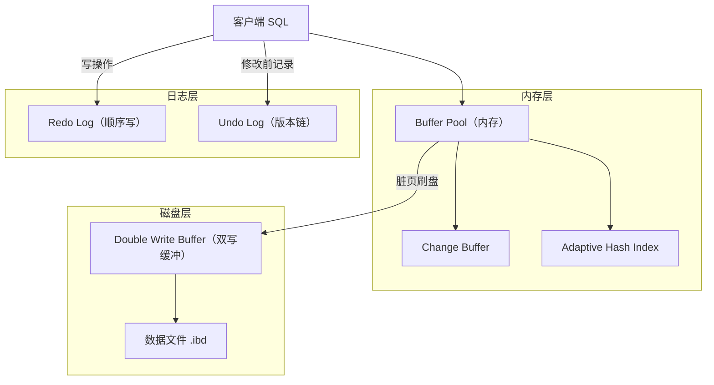
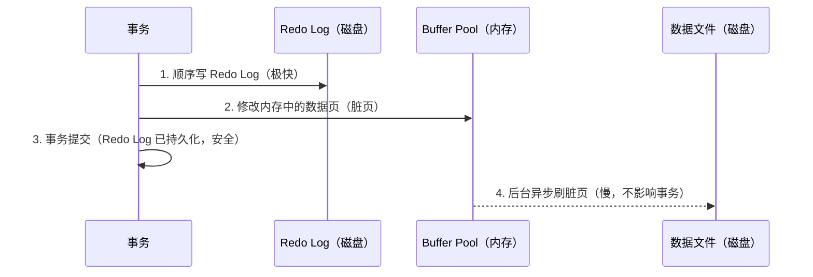
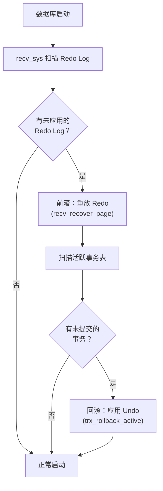

# InnoDB 存储引擎深度剖析

> **一句话口诀**：InnoDB 的灵魂就是**四件套 + 一个原则**——`Buffer Pool` 缓存页、`Redo Log` 保证不丢、`Undo Log` 支持回滚/多版本、`Double Write Buffer` 防页撕裂，全部围绕 **WAL（先写日志、再改数据）** 打转；崩溃恢复 = 先用 Redo 前滚已提交、再用 Undo 回滚未提交。

> 📖 **边界声明**：本文聚焦「InnoDB **存储层** 的源码结构与物理机制」——页 / 缓冲池 / 日志文件怎么组织，崩溃后怎么恢复。以下主题请看对应专题文档，本文不展开：
>
> - 事务四大特性 / 隔离级别 / Read View 语义 / MVCC 版本链可见性判定 → [事务与并发控制](@mysql-事务与并发控制)
> - `Record Lock` / `Gap Lock` / `Next-Key Lock` / 死锁检测 → [锁机制与死锁](@mysql-锁机制与死锁)
> - Binlog 格式 / 主从复制 / 2PC 中 Redo 与 Binlog 的顺序 → [Binlog与主从复制](@mysql-Binlog与主从复制)
> - 生产调优（`innodb_buffer_pool_size` 该设多大、`innodb_flush_log_at_trx_commit` 该选几、命中率低怎么排查）→ [实战问题与避坑指南](@mysql-实战问题与避坑指南)

---

## 1. 它解决了什么问题？

理解 InnoDB 的内部机制，能帮助你：

- 明白为什么 MySQL 在断电后数据不会丢失
- 理解 Redo Log / Undo Log 的本质区别
- 知道 Buffer Pool 为什么能大幅提升性能
- 排查 "为什么写入很慢" 等生产问题

---

## 2. 整体架构



上图涉及的核心结构，对应源码模块如下（按下文章节顺序展开）：

| 结构 | 源码核心类型 / 函数 | 源码位置 | 章节 |
| :-- | :-- | :-- | :-- |
| Buffer Pool / LRU / 脏页 | `buf_pool_t` / `buf_page_t` / `buf_LRU_add_block` / `buf_flush_*` | `storage/innobase/buf/` | §Buffer Pool |
| Change Buffer | `ibuf_t` / `ibuf_insert` / `ibuf_merge_*` | `storage/innobase/ibuf/` | §Change Buffer |
| Adaptive Hash Index | `btr_search_sys` / `btr_search_guess_on_hash` | `storage/innobase/btr/btr0sea.cc` | §AHI |
| Redo Log | `log_sys` / `mtr_t` / `log_write_up_to` | `storage/innobase/log/` | §Redo Log |
| Undo Log / 版本链 | `trx_undo_t` / `trx_rseg_t` / `row_undo_*` | `storage/innobase/trx/trx0undo.cc` | §Undo Log |
| Double Write Buffer | `buf_dblwr_t` / `buf_dblwr_write_block_to_datafile` | `storage/innobase/buf/buf0dblwr.cc` | §Double Write Buffer |

---

## 3. Buffer Pool：内存缓冲池

Buffer Pool 是 InnoDB 最核心的内存结构，默认大小 128MB（生产环境通常占物理内存的 60%~80%，具体调优见 [实战问题与避坑指南](@mysql-实战问题与避坑指南)）。

!!! note "📖 术语家族：`Buffer Pool`（内存缓冲池家族）"
    **字面义**：`Buffer` = 缓冲区，`Pool` = 池化资源。
    **在 InnoDB 中的含义**：一块常驻内存的页缓存区，**所有数据读写都必须先经过它**——读走"先查缓存，未命中再加载"，写走"先改内存脏页，再异步刷盘"。所有围绕"页换入换出、延迟写、加速查询"的优化都是 Buffer Pool 家族成员。
    **同家族成员**（从管理粒度由大到小）：

    | 成员 | 作用 | 源码依据 |
    | :-- | :-- | :-- |
    | `buf_pool_t` | 整个缓冲池实例（可配多个减少锁竞争，`innodb_buffer_pool_instances`） | `storage/innobase/include/buf0buf.h` |
    | `buf_chunk_t` | 缓冲池内部的物理内存块，由若干 `buf_block_t` 组成 | `buf0buf.h` |
    | `buf_page_t` / `buf_block_t` | 一个 16KB 数据页在内存中的控制结构 + 实际页内容 | `buf0buf.h` |
    | `buf_LRU_*`（LRU list） | 冷热分区 LRU 链表，管理页淘汰 | `storage/innobase/buf/buf0lru.cc` |
    | `buf_flush_*`（Flush list） | 脏页链表，按 `oldest_modification`（LSN）排序，供 Page Cleaner 刷盘 | `storage/innobase/buf/buf0flu.cc` |
    | `ibuf_t`（Change Buffer） | **Buffer Pool 的一个特殊区域**，缓存非唯一二级索引的写变更 | `storage/innobase/ibuf/ibuf0ibuf.cc` |
    | `btr_search_sys`（AHI） | 自适应哈希索引，加速等值查询 | `storage/innobase/btr/btr0sea.cc` |

    **命名规律**：`buf_` 前缀 = Buffer Pool 子系统；`_t` 后缀 = 结构体类型；动词后缀 `LRU` / `flush` 代表具体操作链条（谁进谁出、谁先刷盘）。记住一条：**凡是以 `buf_` 开头的 InnoDB 代码，都是在操纵这块内存缓冲池**。

### 工作原理

所有数据的读写都经过 Buffer Pool：

- **读**：先查 Buffer Pool，命中则直接返回，未命中则从磁盘加载到 Buffer Pool
- **写**：先修改 Buffer Pool 中的数据页（脏页），再异步刷盘

### LRU 变种算法

普通 LRU 有个问题：全表扫描会把热点数据全部挤出去。InnoDB 用**冷热分区 LRU** 解决：

```txt
Buffer Pool 链表
┌─────────────────────────────────────────┐
│  热区（young，5/8）      │ 冷区（old，3/8）│
└─────────────────────────────────────────┘
```

- 新加载的页先进入**冷区头部**（`buf_LRU_add_block` 中的 `old=TRUE` 分支）
- 在冷区停留超过 `innodb_old_blocks_time`（默认 1000ms）后再次被访问，才晋升到**热区头部**（`buf_page_make_young`）
- 全表扫描的页在冷区很快被淘汰，不影响热点数据

> **为什么这样设计**：全表扫描（如 `SELECT *` 备份操作）会短时间内加载大量页，如果直接进热区，会把真正的热点数据挤出去，导致后续查询大量缓存未命中。

### Change Buffer

对于**非唯一二级索引**的写操作，如果目标页不在 Buffer Pool 中，InnoDB 不会立即加载磁盘页，而是把变更记录到 Change Buffer（`ibuf_insert`），等下次读取该页时再 merge（`ibuf_merge_or_delete_for_page`）。

| 对比项 | 有 Change Buffer | 无 Change Buffer | 源码依据 |
| :-- | :-- | :-- | :-- |
| 写操作 | 只写内存，延迟合并 | 必须先读磁盘页再写 | `ibuf_insert_low` |
| 适用场景 | 写多读少（如日志表） | 写后立即读（效果不大） | — |
| 触发 merge | 读该页、后台线程、关机 | N/A | `ibuf_merge_in_background` |

> **为什么只对非唯一索引有效**：唯一索引写入时必须读磁盘判断是否重复（`row_ins_scan_sec_index_for_duplicate`），无法延迟，所以 Change Buffer 对唯一索引无效。

### Adaptive Hash Index（自适应哈希索引）

InnoDB 监控索引的访问模式，如果发现某个索引被频繁等值查询（`btr_search_info_update`），会自动在内存中为其建立哈希索引，将 B+树的 O(log n) 查询加速为 O(1)（`btr_search_guess_on_hash`）。

- **自动建立，无需配置**
- 只在内存中，重启后消失
- 高并发下可能成为竞争热点（`btr_search_latch`），可通过 `innodb_adaptive_hash_index=OFF` 关闭

---

## 4. Redo Log：崩溃恢复的保障

!!! note "📖 术语家族：`WAL 物理日志`（Redo / Undo / DWB 家族）"
    **字面义**：`WAL` = `Write-Ahead Logging`，先写日志、再改数据。
    **在 InnoDB 中的含义**：所有"让数据在崩溃后仍能恢复到一致状态"的机制都属于这个家族。记忆口诀——**Redo 管"已提交别丢"，Undo 管"未提交能撤"，DWB 管"页不撕裂"**，三者由 `mtr_t`（mini-transaction）统一编排。
    **同家族成员**：

    | 成员 | 作用 | 源码依据 |
    | :-- | :-- | :-- |
    | `mtr_t`（mini-transaction） | InnoDB 的**最小原子写单元**，一次 `mtr_commit` 产生一段 Redo Log 记录 | `storage/innobase/mtr/mtr0mtr.cc` |
    | `log_sys`（全局日志系统） | 管理 Redo Log 缓冲区、LSN、刷盘位置 `flushed_to_disk_lsn` | `storage/innobase/log/log0log.cc` |
    | `log_write_up_to` | 把 log buffer 刷到磁盘直到指定 LSN（`fsync` 入口） | `storage/innobase/log/log0write.cc` |
    | `trx_undo_t` / `trx_rseg_t` | Undo 段与回滚段，存放每次修改的逆操作，供回滚与版本链使用 | `storage/innobase/trx/trx0undo.cc` / `trx0rseg.cc` |
    | `buf_dblwr_t` | Double Write Buffer，脏页刷盘前先顺序写入的"安全副本区" | `storage/innobase/buf/buf0dblwr.cc` |
    | `recv_sys`（崩溃恢复） | 启动时扫描 Redo Log、定位最后 checkpoint、执行前滚 | `storage/innobase/log/log0recv.cc` |

    **命名规律**：`log_` 前缀 = Redo 子系统；`trx_undo_` 前缀 = Undo 子系统；`mtr_` 前缀 = mini-transaction 编排层；`recv_` 前缀 = recovery 恢复层。**所有物理持久化动作最终都收敛到 `mtr_commit` → 写 `log_sys` buffer → `log_write_up_to` 刷盘**这条主干路径。

### 为什么需要 Redo Log？

Buffer Pool 中的脏页是异步刷盘的，如果数据库崩溃，内存中的修改就丢失了。Redo Log 解决这个问题：**先写日志，再改数据**（WAL，Write-Ahead Logging）。



### Redo Log 的物理结构

Redo Log 是**循环写**的固定大小文件（默认两个 `ib_logfile0` / `ib_logfile1`，各 48MB），由 `log_sys` 用 LSN（Log Sequence Number）统一编址：

```txt
redo log 文件（循环写）
┌───────────────────────────────────────────────────┐
│  write pos ──────────────────► check point        │
│  （log_sys.lsn）                （recv_sys 的起点） │
└───────────────────────────────────────────────────┘
```

- `write pos` 追上 `check point` 时，必须等待脏页刷盘推进 checkpoint（`log_checkpoint`），此时**写入会暂停**
- 生产环境建议加大 Redo Log 文件（`innodb_log_file_size`），避免频繁 checkpoint 抖动

### innodb_flush_log_at_trx_commit

| 值 | 行为 | 性能 | 安全性 | 源码动作 |
| :-- | :-- | :-- | :-- | :-- |
| `0` | 每秒由后台线程写 log buffer → 磁盘 | 最高 | 最低（崩溃丢 1 秒数据） | `log_write_up_to` 周期调用 |
| `1`（默认） | 每次提交都 `fsync` 到磁盘 | 最低 | 最高（不丢数据） | 提交路径调 `log_write_up_to(flush=true)` |
| `2` | 每次提交写 OS 缓存，每秒 `fsync` | 中 | 中（OS 崩溃丢数据） | `write(2)` 但不 `fsync` |

> 📖 三种取值在金融 / 电商 / 日志场景下该怎么选、以及与 `sync_binlog` 的 "双 1" 组合调优，详见 [实战问题与避坑指南](@mysql-实战问题与避坑指南)，本文只讲源码机制。

---

## 5. Undo Log：事务回滚的物理载体

本篇只讲 Undo Log 的**物理层职责**：谁在什么时机往哪个段写入逆操作记录。

| 维度 | 内容 | 源码依据 |
| :-- | :-- | :-- |
| 存放位置 | 回滚段（Rollback Segment），每个 instance 默认 128 个 | `trx_rseg_t`，`storage/innobase/trx/trx0rseg.cc` |
| 写入时机 | 每次 DML 在 `mtr` 内调 `trx_undo_report_row_operation` | `storage/innobase/trx/trx0undo.cc` |
| 两种类型 | `TRX_UNDO_INSERT_REC`（事务提交后可立即删）、`TRX_UNDO_UPDATE_REC`（要等无活跃快照引用后由 purge 线程删） | `trx0undo.cc` |
| 清理机制 | 后台 purge 线程 `trx_purge` 扫描已提交事务的 Undo | `storage/innobase/trx/trx0purge.cc` |

**两大用途**：

1. **事务回滚**：事务失败时，按 `roll_ptr` 逆序应用 Undo 记录，把数据恢复到修改前
2. **MVCC 版本链**：每条 Undo 记录就是一个历史版本，读快照时按可见性规则挑选版本

> 📖 **MVCC 版本链的"可见性判定规则、Read View 内部字段、RC 与 RR 生成时机差异"**详见 [事务与并发控制](@mysql-事务与并发控制) §四 MVCC 版本链家族，本文不重复展开版本链语义，只讲存储层怎么产出这些版本。

---

## 6. Double Write Buffer：防止页撕裂

### 什么是页撕裂？

InnoDB 数据页大小是 16KB，而操作系统写磁盘的最小单位是 4KB。如果写到一半时断电，磁盘上的页就是"半新半旧"的损坏状态，Redo Log 也无法修复（因为 Redo Log 的重放依赖**完整且一致的页**作为起点）。

### 解决方案


- 先把脏页顺序写入 Double Write Buffer（系统表空间里的连续区域，`buf_dblwr_write_block_to_datafile`）
- 再把脏页写入实际数据文件
- 崩溃恢复时（`buf_dblwr_process`），如果数据文件中的页损坏，从 Double Write Buffer 中恢复完整页，再应用 Redo Log

---

## 7. Checkpoint 机制

Checkpoint 决定了哪些脏页需要刷盘，有两种：

| 类型 | 触发时机 | 特点 | 源码依据 |
| :-- | :-- | :-- | :-- |
| **Sharp Checkpoint** | 数据库关闭时 | 将所有脏页刷盘，耗时长 | `logs_empty_and_mark_files_at_shutdown` |
| **Fuzzy Checkpoint** | 运行时（后台线程） | 按需刷盘，不影响正常运行 | `log_checkpoint` |

Fuzzy Checkpoint 的触发条件（`log_checkpoint_margin`）：

- 脏页比例超过 `innodb_max_dirty_pages_pct`（默认 75%）
- Redo Log 快写满时（`write pos` 接近 `check point`）
- 后台 Page Cleaner 线程（`buf_flush_page_cleaner_coordinator`）定期刷盘

---

## 8. 崩溃恢复流程



> **两阶段恢复**：先前滚（Redo Log 恢复已提交事务），再回滚（Undo Log 撤销未提交事务）。这保证了崩溃后数据既"**已提交的没丢**"又"**未提交的没留**"。

---

## 9. 版本差异提示

| 版本 | 关键变化 |
| :-- | :-- |
| **MySQL 5.6** | Online DDL 开始支持 `INPLACE`；Change Buffer 从"Insert Buffer"扩展到 Update/Delete |
| **MySQL 5.7** | Undo 表空间可独立于系统表空间（`innodb_undo_tablespaces`） |
| **MySQL 8.0** | Redo Log 支持**动态调整大小**（无需重启）；Undo 表空间强制独立；`innodb_dedicated_server=ON` 可按物理内存自动推导 Buffer Pool 大小；`SDI` 替代 `.frm` |
| **MySQL 8.0.30+** | Redo Log 文件由"固定两个 `ib_logfile*`"改为 `#innodb_redo/` 目录下**多个固定 + 备用**文件，最大总大小由 `innodb_redo_log_capacity` 控制 |

---

## 10. 常见问题

> 📖 **调优与排查类**问题（"Buffer Pool 设置多大合适"、"命中率低怎么排查"、"`innodb_flush_log_at_trx_commit` 选几"、"DWB 对写性能影响多大"）已在 [实战问题与避坑指南](@mysql-实战问题与避坑指南) 给出工程视角答案，本文 Q&A 仅保留**源码机制题**。

**Q：Redo Log 和 Binlog 的区别是什么？为什么需要两者？**

> Redo Log 是 InnoDB 引擎层的**物理日志**（由 `log_sys` 管理），记录"某个页偏移处写了什么字节"，用于崩溃恢复；Binlog 是 MySQL Server 层的**逻辑日志**（由 `MYSQL_BIN_LOG` 管理），记录"执行了什么 SQL 或行变更"，用于主从复制和 PITR。两者缺一不可：只有 Redo → 从库无法重放；只有 Binlog → 崩溃后已提交事务丢失。二者通过 2PC（`XA PREPARE` → 写 Binlog → `XA COMMIT`）保证原子性，详见 [Binlog与主从复制](@mysql-Binlog与主从复制)。

**Q：为什么 Redo Log 必须是顺序写？WAL 的本质是什么？**

> 磁盘顺序写速度比随机写快几十倍（HDD 上差 100 倍，SSD 上差 10 倍）。数据文件的落盘是**随机写**（哪个页脏了写哪里），如果每次提交都同步随机写数据页，性能极差。WAL 的本质就是把"提交路径"上的随机写转换为"Redo Log 顺序写 + 数据页后台异步刷"，让提交路径只做顺序 IO。对应源码里就是 `mtr_commit` → `log_write_up_to(fsync=true)` 这一条极短的关键路径。

**Q：为什么 Double Write Buffer 不能被 Redo Log 替代？**

> Redo Log 是**物理逻辑日志**——它记录的是"在某页的某个偏移写入某字节序列"，**重放前提是页本身是完整且一致的**。如果页已经被写坏（页撕裂），Redo Log 无法把坏页恢复到前一个一致状态，再去"应用变更"就毫无意义。DWB 存的是**完整页副本**，正好补上这一环：先用 DWB 把坏页恢复成上次刷盘时的完整样子，再让 Redo 在完整页上重放。二者是"先修页、再改页"的接力关系，不可互相替代。

**Q：`mtr_t`（mini-transaction）在整个写路径中扮演什么角色？**

> `mtr_t` 是 InnoDB 内部的**原子写单元**——一次业务 SQL 可能被拆成很多个 `mtr`，每个 `mtr` 内部持有若干页的锁，在 `mtr_commit` 时统一生成一段 Redo Log 记录、统一释放页锁。它保证了"同一 `mtr` 内的页修改要么全部体现在 Redo，要么全部不体现"，是 Redo 的最小回放粒度，也是崩溃恢复按 LSN 重放时的对齐单位。一条 `INSERT` 语句可能涉及聚簇索引、二级索引、Undo 段等多个 `mtr`，而不是只有一个。

**Q：Change Buffer 在崩溃后会丢吗？**

> 不会。Change Buffer 本身是 Buffer Pool 的一部分（位于系统表空间的 ibuf 段），**每次写入 Change Buffer 的动作也会产生 Redo Log**（`MLOG_COMP_REC_INSERT` 等）。所以即使还没 merge 回实际数据页，崩溃后也能通过 Redo 重放恢复出 Change Buffer 里的未合并变更，再由后续读操作触发 merge。
