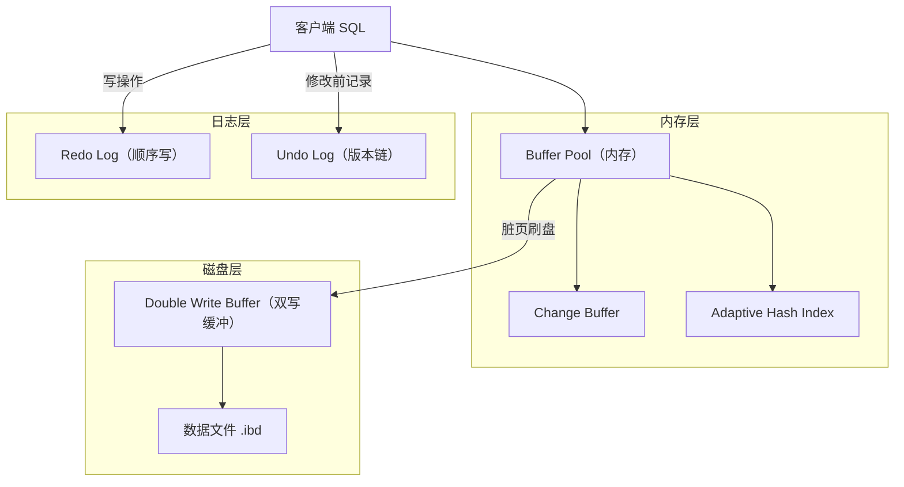
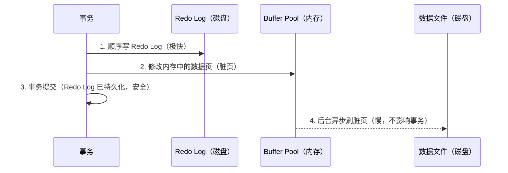
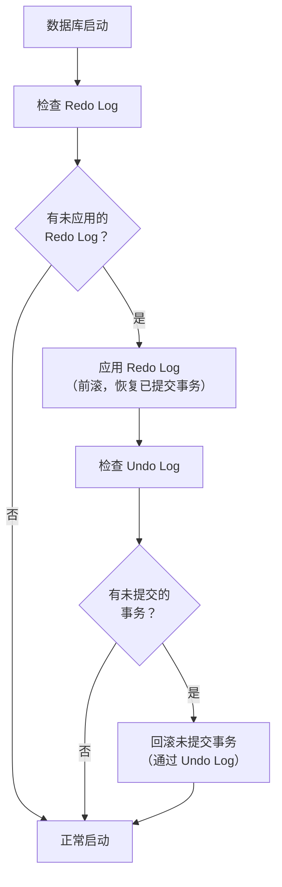

# InnoDB 存储引擎深度剖析

> **核心问题**：InnoDB 是如何保证数据不丢失的？Buffer Pool 是如何工作的？崩溃后数据是如何恢复的？

---

## 它解决了什么问题？

理解 InnoDB 的内部机制，能帮助你：

- 明白为什么 MySQL 在断电后数据不会丢失
- 理解 Redo Log / Undo Log 的本质区别
- 知道 Buffer Pool 为什么能大幅提升性能
- 排查 "为什么写入很慢" 等生产问题

---

## 整体架构



---

## Buffer Pool：内存缓冲池

Buffer Pool 是 InnoDB 最核心的内存结构，默认大小 128MB，生产环境通常设置为物理内存的 60%~80%。

### 工作原理

所有数据的读写都经过 Buffer Pool：
- **读**：先查 Buffer Pool，命中则直接返回，未命中则从磁盘加载到 Buffer Pool
- **写**：先修改 Buffer Pool 中的数据页（脏页），再异步刷盘

### LRU 变种算法

普通 LRU 有个问题：全表扫描会把热点数据全部挤出去。InnoDB 用**冷热分区 LRU** 解决：

```
Buffer Pool 链表
┌─────────────────────────────────────────┐
│  热区（young，5/8）      │ 冷区（old，3/8）│
└─────────────────────────────────────────┘
```

- 新加载的页先进入**冷区头部**
- 在冷区停留超过 1 秒后再次被访问，才晋升到**热区头部**
- 全表扫描的页在冷区很快被淘汰，不影响热点数据

> **为什么这样设计**：全表扫描（如 `SELECT *` 备份操作）会短时间内加载大量页，如果直接进热区，会把真正的热点数据挤出去，导致后续查询大量缓存未命中。

### Change Buffer

对于**非唯一二级索引**的写操作，如果目标页不在 Buffer Pool 中，InnoDB 不会立即加载磁盘页，而是把变更记录到 Change Buffer，等下次读取该页时再合并（merge）。

| 对比项 | 有 Change Buffer | 无 Change Buffer |
|--------|-----------------|-----------------|
| 写操作 | 只写内存，延迟合并 | 必须先读磁盘页再写 |
| 适用场景 | 写多读少（如日志表） | 写后立即读（效果不大） |

> **为什么只对非唯一索引有效**：唯一索引写入时必须读磁盘判断是否重复，无法延迟，所以 Change Buffer 对唯一索引无效。

### Adaptive Hash Index（自适应哈希索引）

InnoDB 监控索引的访问模式，如果发现某个索引被频繁等值查询，会自动在内存中为其建立哈希索引，将 B+树的 O(log n) 查询加速为 O(1)。

- **自动建立，无需配置**
- 只在内存中，重启后消失
- 高并发下可能成为竞争热点，可通过 `innodb_adaptive_hash_index=OFF` 关闭

---

## Redo Log：崩溃恢复的保障

### 为什么需要 Redo Log？

Buffer Pool 中的脏页是异步刷盘的，如果数据库崩溃，内存中的修改就丢失了。Redo Log 解决这个问题：**先写日志，再改数据**（WAL，Write-Ahead Logging）。



### Redo Log 的物理结构

Redo Log 是**循环写**的固定大小文件（默认两个文件，各 48MB）：

```
redo log 文件（循环写）
┌────────────────────────────────────────────┐
│  write pos ──────────────────► check point │
│  （当前写入位置）               （已刷盘位置）  │
└────────────────────────────────────────────┘
```

- `write pos` 追上 `check point` 时，必须等待刷盘，写入会暂停
- 生产环境建议加大 Redo Log 文件（`innodb_log_file_size`）

### innodb_flush_log_at_trx_commit

| 值 | 行为 | 性能 | 安全性 |
|----|------|------|--------|
| `0` | 每秒写一次 log buffer → 磁盘 | 最高 | 最低（崩溃丢 1 秒数据） |
| `1`（默认） | 每次提交都 fsync 到磁盘 | 最低 | 最高（不丢数据） |
| `2` | 每次提交写 OS 缓存，每秒 fsync | 中 | 中（OS 崩溃丢数据） |

> **生产建议**：金融/支付场景用 `1`；对性能要求高且能接受少量丢失的场景用 `2`。

---

## Undo Log：事务回滚与 MVCC

Undo Log 记录数据修改前的旧值，有两个用途：

1. **事务回滚**：事务失败时，通过 Undo Log 将数据恢复到修改前
2. **MVCC 版本链**：为其他事务提供历史版本数据（详见 MVCC 章节）

```
Undo Log 版本链（每次修改都追加一个版本）
name='Alice'(trx=20) ← name='Jerry'(trx=50) ← name='Tom'(trx=100，当前版本)
```

---

## Double Write Buffer：防止页撕裂

### 什么是页撕裂？

InnoDB 数据页大小是 16KB，而操作系统写磁盘的最小单位是 4KB。如果写到一半时断电，磁盘上的页就是"半新半旧"的损坏状态，Redo Log 也无法修复（因为 Redo Log 是基于完整页的）。

### 解决方案


- 先把脏页顺序写入 Double Write Buffer（连续磁盘区域，速度快）
- 再把脏页写入实际数据文件
- 崩溃恢复时，如果数据文件中的页损坏，从 Double Write Buffer 中恢复完整页，再应用 Redo Log

---

## Checkpoint 机制

Checkpoint 决定了哪些脏页需要刷盘，有两种：

| 类型 | 触发时机 | 特点 |
|------|---------|------|
| **Sharp Checkpoint** | 数据库关闭时 | 将所有脏页刷盘，耗时长 |
| **Fuzzy Checkpoint** | 运行时（后台线程） | 按需刷盘，不影响正常运行 |

Fuzzy Checkpoint 的触发条件：
- 脏页比例超过 `innodb_max_dirty_pages_pct`（默认 75%）
- Redo Log 快写满时（`write pos` 接近 `check point`）
- 后台 Page Cleaner 线程定期刷盘

---

## 崩溃恢复流程



> **两阶段恢复**：先前滚（Redo Log 恢复已提交事务），再回滚（Undo Log 撤销未提交事务）。这保证了崩溃后数据的一致性。

---

## 常见问题

**Q：Redo Log 和 Binlog 的区别是什么？**

> Redo Log 是 InnoDB 引擎层的物理日志，记录"某个数据页做了什么修改"，用于崩溃恢复；Binlog 是 MySQL Server 层的逻辑日志，记录"执行了什么 SQL"，用于主从复制和数据恢复。两者通过两阶段提交（2PC）保证一致性。

**Q：为什么 Redo Log 用顺序写而不是随机写？**

> 磁盘顺序写速度比随机写快几十倍。Redo Log 是追加写入，而数据文件是随机写（哪个页脏了写哪里）。WAL 的核心思想就是把随机写转换为顺序写，大幅提升写入性能。

**Q：Buffer Pool 设置多大合适？**

> 通常设置为物理内存的 60%~80%。太小则缓存命中率低，频繁磁盘 IO；太大则 OS 本身内存不足，可能触发 swap，反而更慢。可通过 `SHOW STATUS LIKE 'Innodb_buffer_pool_read%'` 监控命中率，命中率低于 95% 时考虑扩大。

**Q：Double Write Buffer 会影响性能吗？**

> 会有约 5%~10% 的写性能损耗（每次刷盘多写一次）。在使用支持原子写的存储设备（如 Fusion-io）时，可以关闭 Double Write Buffer（`innodb_doublewrite=OFF`）。
