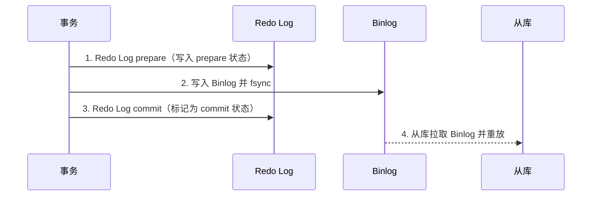
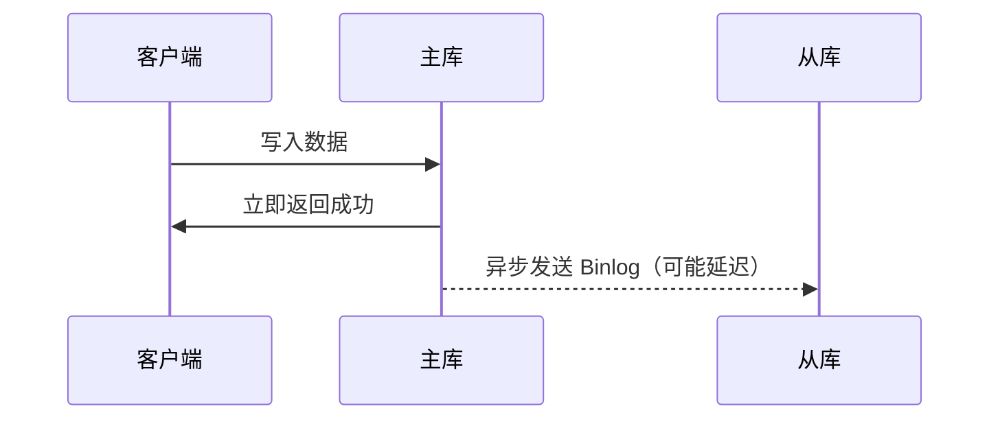
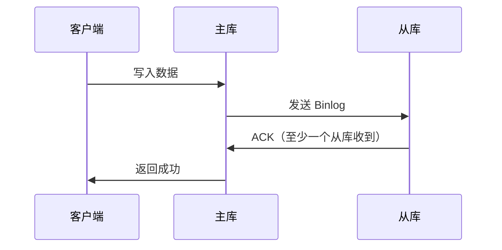

# Binlog 与主从复制

> **一句话记忆口诀**：
>
> 1. **两阶段提交以 Binlog 为准**——Redo Log prepare + Binlog 落盘 = 事务算提交，崩溃恢复看 Binlog 有没有
> 2. **Row 格式是唯一安全选择**，Statement 的不确定函数会让主从数据分家
> 3. **主从复制靠三线程跑**——主库 Binlog Dump + 从库 IO + 从库 SQL，延迟排查都从这三点切入
> 4. **GTID 是复制拓扑的身份证**，主从切换、故障恢复、数据对账全靠它
> 5. **异步→半同步→MGR 是一致性递进**，半同步在极端场景仍可能丢，强一致只能靠 MGR

> 📖 **边界声明**：本文聚焦 Binlog 格式 / 2PC 协议 / 复制原理 / GTID 机制，以下子主题请见对应专题：
>
> - 大事务 / 大表 DELETE 引发主从延迟的**工程现象与处方** → [实战问题与避坑指南](@mysql-实战问题与避坑指南) 坑 8 / 坑 15~17
> - Binlog 与 InnoDB Redo/Undo 的**物理写入链路（`mtr_t` / `log_sys` / `trx_undo_t`）** → [InnoDB存储引擎深度剖析](@mysql-InnoDB存储引擎深度剖析)
> - 事务 2PC 与 **MVCC 版本链 / Read View** → [事务与并发控制](@mysql-事务与并发控制)
> - DDL 大事务如何影响 Binlog 体积与主从延迟 → [在线DDL与大表变更](@mysql-在线DDL与大表变更)

---

## 1. 它解决了什么问题？

Binlog（Binary Log，二进制日志）是 MySQL Server 层的日志，与存储引擎无关。它解决了两个核心问题：

- **主从复制**：将主库的数据变更同步到从库，实现读写分离和高可用
- **数据恢复**：结合全量备份，通过重放 Binlog 恢复到任意时间点（PITR）

---

## 2. Binlog 三种格式

| 格式 | 记录内容 | 优点 | 缺点 |
| :--- | :--- | :--- | :--- |
| **Statement** | 原始 SQL 语句 | 日志量小 | 含不确定函数（`NOW()`、`UUID()`）时主从不一致 |
| **Row**（推荐） | 每行数据的变更前后值 | 精确，主从一致 | 日志量大（全表更新时每行都记录） |
| **Mixed** | 自动选择 Statement 或 Row | 折中 | 复杂，排查困难 |

```sql
-- 查看当前 Binlog 格式
SHOW VARIABLES LIKE 'binlog_format';

-- 推荐设置（MySQL 8.0 默认已是 ROW）
SET GLOBAL binlog_format = 'ROW';
```

> **为什么推荐 Row 格式**：Statement 格式下，`DELETE FROM t LIMIT 1` 在主从库执行时删除的可能是不同的行（取决于索引选择），导致数据不一致。Row 格式记录具体哪行被删除，绝对一致。

!!! note "📖 术语家族：`Binlog`"
    **字面义**：Binary Log = 二进制日志
    **在 MySQL 中的含义**：Server 层（与存储引擎无关）的逻辑日志，记录所有引起数据变更的操作，用于**主从复制**和**数据恢复（PITR）**，追加写不覆盖。
    **同家族成员**：

    | 成员 | 作用 | 所在位置 |
    | :-- | :-- | :-- |
    | `Binlog File` | 实际日志文件（`mysql-bin.000001`），达到 `max_binlog_size` 后滚动 | 主库磁盘 |
    | `Binlog Position` | 文件内字节偏移，传统复制用它定位同步点 | 文件 + 位置元信息 |
    | `Binlog Event` | 日志最小单元（Query / Rows / Xid / GTID 等 11 类） | 见下文 Event 速查表 |
    | `Binlog Dump Thread` | 主库推送 Binlog 的线程 | 主库 |
    | `Relay Log` | 从库 IO 线程接收 Binlog 后的本地落盘副本 | 从库磁盘（`*-relay-bin.*`） |
    | `mysqlbinlog` | 解析 Binlog 的官方 CLI 工具，支持时间 / Position / GTID 过滤 | `/usr/bin/mysqlbinlog` |

    **命名规律**：`Binlog XX` 基本都围绕「录 / 传 / 解析」这三件事展开——`File/Position/Event` 是存储形式，`Dump Thread/Relay Log` 是传输环节，`mysqlbinlog` 是解析出口。

---

## 3. Binlog Event 类型速查表

Row 格式下一个事务的 Binlog 并不是一块 SQL 文本，而是一串 **Event**（事件）。理解 Event 类型是读懂 `mysqlbinlog -v` 输出的前提：

| Event 类型 | 作用 | 何时出现 |
| :-- | :-- | :-- |
| `Format_description` | 文件头，声明 Binlog 版本与格式 | 每个 Binlog 文件首部 |
| `Previous_gtids` | 本文件之前已执行的 GTID 集合 | 文件首部（GTID 模式） |
| `Gtid` | 事务的全局唯一 ID | 事务开头 |
| `Query` | DDL 或事务边界（`BEGIN` / `COMMIT` / `CREATE TABLE`） | 每个事务开头 + DDL |
| `Table_map` | 映射表 ID 与列元信息 | 每个 Row Event 前 |
| `Write_rows` | INSERT 的行数据 | DML |
| `Update_rows` | UPDATE 的前镜像 + 后镜像 | DML |
| `Delete_rows` | DELETE 的被删行镜像 | DML |
| `Xid` | InnoDB 事务提交标志（2PC 的 commit 点） | 事务结尾 |
| `Rotate` | 文件滚动通知 | Binlog 滚动点 |
| `Anonymous_gtid` | 未开 GTID 时的占位 Event | GTID=OFF 模式 |

```bash
# 典型 Row 格式事务的 Event 序列（以 UPDATE 一行为例）
# Gtid → Query(BEGIN) → Table_map → Update_rows → Xid(COMMIT)
mysqlbinlog --base64-output=DECODE-ROWS -vv mysql-bin.000001 | head -100
```

> 📌 **为什么需要 Table_map**：Row Event 里只存列值而不存列名，靠前面的 `Table_map` 告诉解析器「这个表 ID 对应哪个表、列类型是什么」，这个设计让 Binlog 在表结构同步后仍可回放。

---

## 4. Binlog 与 Redo Log 的两阶段提交（2PC）

这是 MySQL 保证数据一致性的核心机制。如果没有 2PC，Binlog 和 Redo Log 可能出现不一致：



**崩溃恢复规则**：

- Redo Log 是 prepare 状态，但 Binlog 没有 → **回滚**（从库没有这条数据，主库也不能有）
- Redo Log 是 prepare 状态，Binlog 已写入 → **提交**（从库已有这条数据，主库必须保持一致）

> **本质**：2PC 以 Binlog 是否写入作为事务是否提交的最终判断依据，保证主库和从库的数据一致性。

---

## 5. 主从复制原理


**三个核心线程**：

1. **主库 Binlog Dump 线程**：监听 Binlog 变化，推送给从库
2. **从库 IO 线程**：接收主库 Binlog，写入本地 Relay Log
3. **从库 SQL 线程**：读取 Relay Log，重放 SQL，更新从库数据

---

## 6. 三种复制模式

### 异步复制（默认）



- **优点**：性能最好，主库不等从库
- **缺点**：主库宕机时，从库可能丢失数据

### 半同步复制



- **优点**：至少一个从库收到数据才返回，降低丢数据风险
- **缺点**：性能略低，网络抖动时可能退化为异步复制

### 组复制（MGR，MySQL Group Replication）

- 基于 Paxos 协议，多主或单主模式
- 自动故障检测和成员管理
- 强一致性保证（多数派确认后才提交）
- 适合对一致性要求极高的场景

---

## 7. GTID 模式

!!! note "📖 术语家族：`GTID`"
    **字面义**：Global Transaction Identifier = 全局事务标识符
    **在 MySQL 中的含义**：每个已提交事务在整个复制拓扑中的**全局唯一 ID**，形如 `server_uuid:transaction_id`，用于替代传统的「文件名 + Position」定位方式。
    **同家族成员**：

    | 成员 | 作用 | 可观测位置 |
    | :-- | :-- | :-- |
    | `server_uuid` | MySQL 实例的 UUID，随实例生成，存 `auto.cnf` | `SELECT @@server_uuid` |
    | `GTID_EXECUTED` | 当前实例已执行的 GTID 集合（包括本地执行 + 复制过来的） | `SHOW MASTER STATUS` / `@@gtid_executed` |
    | `GTID_PURGED` | 已从 Binlog 中清理但曾执行过的 GTID 集合 | `@@gtid_purged` |
    | `gtid_mode` | 开关（`OFF` / `OFF_PERMISSIVE` / `ON_PERMISSIVE` / `ON`） | 全局变量 |
    | `enforce_gtid_consistency` | 禁止不兼容 GTID 的 SQL（如 `CREATE TABLE ... SELECT`） | 全局变量 |
    | `mysql.gtid_executed` 表 | 崩溃后恢复 `GTID_EXECUTED` 的持久化表 | 系统库 |

    **命名规律**：GTID 相关变量都带 `gtid_` 前缀，集合类用大写复数（`GTID_EXECUTED` / `GTID_PURGED`）。

GTID（Global Transaction Identifier，全局事务标识符）是每个事务的唯一 ID：

```txt
GTID = server_uuid:transaction_id
例如：3E11FA47-71CA-11E1-9E33-C80AA9429562:23
```

### GTID vs 传统复制

| 对比项 | 传统复制（File + Position） | GTID 复制 |
| :--- | :--- | :--- |
| 主从切换 | 需要手动指定新主库的 File 和 Position | 自动，从库自动找到同步位置 |
| 故障恢复 | 复杂，容易出错 | 简单，GTID 全局唯一 |
| 数据一致性验证 | 困难 | 容易（对比 GTID 集合） |
| 限制 | 无 | 不支持非事务性表的混合操作 |

```sql
-- 开启 GTID
gtid_mode = ON
enforce_gtid_consistency = ON

-- 查看已执行的 GTID 集合
SHOW MASTER STATUS\G
-- Executed_Gtid_Set: 3E11FA47...:1-100
```

---

## 8. 主从延迟：机制视角

主从延迟的**根因在机制层**可归纳为 3 条，**工程处方**请移步 #11：

| 机制层根因 | 为什么会慢 | 本文视角 |
| :-- | :-- | :-- |
| **大事务拖垮 Binlog 串行传输** | 一个事务的所有 Event 必须连续写入 Binlog，中途不能交错；10 分钟事务 = 10 分钟 Binlog 独占 + 10 分钟从库回放 | → Event 机制 / 2PC |
| **从库 SQL 线程回放模型** | 5.6 前单线程；5.7 `LOGICAL_CLOCK` 基于 `last_committed` 并行；8.0 `WRITESET` 基于写集冲突检测并行 | → 复制协议 |
| **半同步 ACK 与网络 RTT** | 半同步主库等从库 ACK 才返回，跨机房 RTT 直接叠加到写延迟 | → 复制模式 |

```sql
-- 开启并行复制（MySQL 5.7+）
slave_parallel_type = LOGICAL_CLOCK
slave_parallel_workers = 4
-- MySQL 8.0 推荐用 WRITESET（冲突检测粒度更细）
binlog_transaction_dependency_tracking = WRITESET
```

> 📖 **主从延迟的完整排查流程 / `Seconds_Behind_Master` 判读陷阱 / 业务层「强一致读 / 最终一致读」选型** 请移步 [实战问题与避坑指南](@mysql-实战问题与避坑指南) 坑 15~17，本文不重复。

---

## 9. Binlog 数据恢复（PITR）

```bash
# 1. 查看 Binlog 文件列表
SHOW BINARY LOGS;

# 2. 查看 Binlog 内容
mysqlbinlog --base64-output=DECODE-ROWS -v mysql-bin.000001

# 3. 按时间范围恢复
mysqlbinlog --start-datetime="2024-01-01 10:00:00" \
            --stop-datetime="2024-01-01 11:00:00" \
            mysql-bin.000001 | mysql -u root -p

# 4. 按 Position 恢复
mysqlbinlog --start-position=100 --stop-position=500 \
            mysql-bin.000001 | mysql -u root -p
```

> **恢复流程**：全量备份恢复到某个时间点 → 找到对应的 Binlog 文件和 Position → 重放 Binlog 到目标时间点。

---

## 10. 常见问题

> 📖 **排查题 / 调优题 / 业务选型题**（如「主从延迟怎么办」/「半同步要不要开」）已在 [实战问题与避坑指南](@mysql-实战问题与避坑指南) 给出工程视角答案，本文不再重复，专注「机制问答」。

**Q：Binlog 和 Redo Log 的区别？**

> Redo Log 是 InnoDB 引擎层的物理日志，记录数据页的物理修改，用于崩溃恢复，循环写；Binlog 是 Server 层的逻辑日志，记录数据变更，用于主从复制和数据恢复，追加写不会覆盖。

**Q：为什么事务提交的最终标志是 `Xid` Event 而不是 `Query(COMMIT)`？**

> Row 格式下 `COMMIT` 通过 `Xid` Event 承载，Xid 同时是 InnoDB 2PC 的链路 ID——崩溃恢复时 InnoDB 拿 Xid 到 Binlog 里找对应事务是否已落盘，以此决定 prepare 态事务提交或回滚。`Query(COMMIT)` 仅在 Statement 格式时用来标记文本形式的提交。

**Q：从库回放 Binlog 时的并行模型是怎么进化的？**

> MySQL 5.6 首次引入并行复制，但粒度是「不同库」（单库仍串行）；5.7 改为 `LOGICAL_CLOCK`，基于主库事务的 `last_committed` 和 `sequence_number`——同一 group commit 内的事务互不依赖、可并行回放；8.0 新增 `WRITESET` 模式（`binlog_transaction_dependency_tracking=WRITESET`），基于写集冲突检测，即使没赶上同一 group commit 的事务也可并行。
**Q：为什么要用 GTID？**

> GTID 让主从切换变得简单可靠。传统复制切换时需要手动找到新主库的 Binlog 文件名和 Position，容易出错；GTID 模式下从库自动根据全局唯一 ID 找到同步位置，大幅降低运维复杂度。

**Q：半同步复制能保证数据不丢失吗？**

> 不能完全保证。半同步只保证至少一个从库收到了 Binlog，但如果主库在收到 ACK 之前崩溃，这个事务可能已经在从库执行但主库没有提交，切换后会出现数据不一致。MGR（组复制）才能提供更强的一致性保证。
