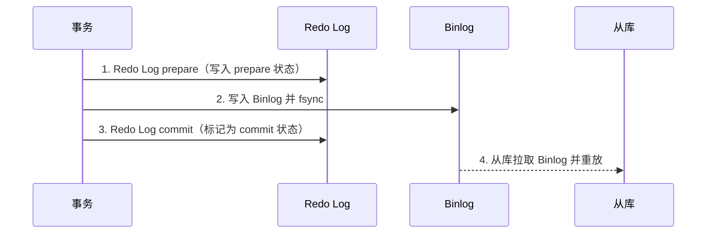
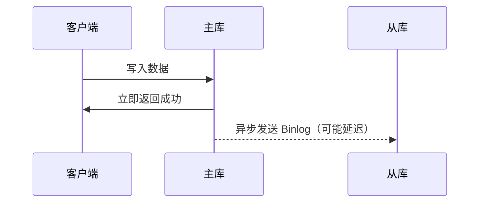
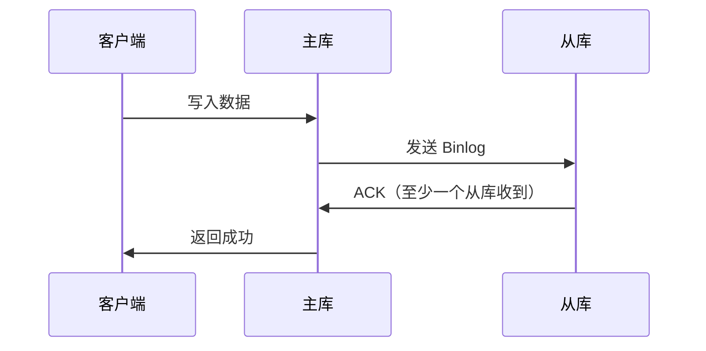

# Binlog 与主从复制

> **核心问题**：Binlog 是什么？主从复制是如何工作的？如何保证主从数据一致性？

---

## 它解决了什么问题？

Binlog（Binary Log，二进制日志）是 MySQL Server 层的日志，与存储引擎无关。它解决了两个核心问题：

- **主从复制**：将主库的数据变更同步到从库，实现读写分离和高可用
- **数据恢复**：结合全量备份，通过重放 Binlog 恢复到任意时间点（PITR）

---

## Binlog 三种格式

| 格式 | 记录内容 | 优点 | 缺点 |
|------|---------|------|------|
| **Statement** | 原始 SQL 语句 | 日志量小 | 含不确定函数（`NOW()`、`UUID()`）时主从不一致 |
| **Row**（推荐） | 每行数据的变更前后值 | 精确，主从一致 | 日志量大（全表更新时每行都记录） |
| **Mixed** | 自动选择 Statement 或 Row | 折中 | 复杂，排查困难 |

```sql
-- 查看当前 Binlog 格式
SHOW VARIABLES LIKE 'binlog_format';

-- 推荐设置（MySQL 8.0 默认已是 ROW）
SET GLOBAL binlog_format = 'ROW';
```

> **为什么推荐 Row 格式**：Statement 格式下，`DELETE FROM t LIMIT 1` 在主从库执行时删除的可能是不同的行（取决于索引选择），导致数据不一致。Row 格式记录具体哪行被删除，绝对一致。

---

## Binlog 与 Redo Log 的两阶段提交（2PC）

这是 MySQL 保证数据一致性的核心机制。如果没有 2PC，Binlog 和 Redo Log 可能出现不一致：



**崩溃恢复规则**：
- Redo Log 是 prepare 状态，但 Binlog 没有 → **回滚**（从库没有这条数据，主库也不能有）
- Redo Log 是 prepare 状态，Binlog 已写入 → **提交**（从库已有这条数据，主库必须保持一致）

> **本质**：2PC 以 Binlog 是否写入作为事务是否提交的最终判断依据，保证主库和从库的数据一致性。

---

## 主从复制原理


**三个核心线程**：
1. **主库 Binlog Dump 线程**：监听 Binlog 变化，推送给从库
2. **从库 IO 线程**：接收主库 Binlog，写入本地 Relay Log
3. **从库 SQL 线程**：读取 Relay Log，重放 SQL，更新从库数据

---

## 三种复制模式

### 异步复制（默认）



- **优点**：性能最好，主库不等从库
- **缺点**：主库宕机时，从库可能丢失数据

### 半同步复制



- **优点**：至少一个从库收到数据才返回，降低丢数据风险
- **缺点**：性能略低，网络抖动时可能退化为异步复制

### 组复制（MGR，MySQL Group Replication）

- 基于 Paxos 协议，多主或单主模式
- 自动故障检测和成员管理
- 强一致性保证（多数派确认后才提交）
- 适合对一致性要求极高的场景

---

## GTID 模式

GTID（Global Transaction Identifier，全局事务标识符）是每个事务的唯一 ID：

```
GTID = server_uuid:transaction_id
例如：3E11FA47-71CA-11E1-9E33-C80AA9429562:23
```

### GTID vs 传统复制

| 对比项 | 传统复制（File + Position） | GTID 复制 |
|--------|--------------------------|----------|
| 主从切换 | 需要手动指定新主库的 File 和 Position | 自动，从库自动找到同步位置 |
| 故障恢复 | 复杂，容易出错 | 简单，GTID 全局唯一 |
| 数据一致性验证 | 困难 | 容易（对比 GTID 集合） |
| 限制 | 无 | 不支持非事务性表的混合操作 |

```sql
-- 开启 GTID
gtid_mode = ON
enforce_gtid_consistency = ON

-- 查看已执行的 GTID 集合
SHOW MASTER STATUS\G
-- Executed_Gtid_Set: 3E11FA47...:1-100
```

---

## 主从延迟问题

主从延迟是生产中最常见的问题，可能导致读从库时读到旧数据。

### 常见原因

| 原因 | 说明 |
|------|------|
| 大事务 | 主库一个大事务执行 10 分钟，从库也要重放 10 分钟 |
| 从库单线程重放 | MySQL 5.6 之前 SQL 线程是单线程，主库并发写入，从库串行重放 |
| 从库机器性能差 | 从库 CPU/磁盘 IO 跟不上主库 |
| 网络延迟 | 主从之间网络不稳定 |

### 解决方案

```sql
-- 1. 开启并行复制（MySQL 5.7+）
slave_parallel_type = LOGICAL_CLOCK
slave_parallel_workers = 4  -- 根据 CPU 核数设置

-- 2. 查看主从延迟
SHOW SLAVE STATUS\G
-- Seconds_Behind_Master: 0  （0 表示无延迟）
```

### 业务层应对策略

- **强一致读**：直接读主库（如支付、库存扣减）
- **最终一致读**：读从库，业务可接受短暂延迟（如商品列表）
- **等待同步**：写入后等待从库同步完成再读（`WAIT_FOR_EXECUTED_GTID_SET`）

---

## Binlog 数据恢复（PITR）

```bash
# 1. 查看 Binlog 文件列表
SHOW BINARY LOGS;

# 2. 查看 Binlog 内容
mysqlbinlog --base64-output=DECODE-ROWS -v mysql-bin.000001

# 3. 按时间范围恢复
mysqlbinlog --start-datetime="2024-01-01 10:00:00" \
            --stop-datetime="2024-01-01 11:00:00" \
            mysql-bin.000001 | mysql -u root -p

# 4. 按 Position 恢复
mysqlbinlog --start-position=100 --stop-position=500 \
            mysql-bin.000001 | mysql -u root -p
```

> **恢复流程**：全量备份恢复到某个时间点 → 找到对应的 Binlog 文件和 Position → 重放 Binlog 到目标时间点。

---

## 常见问题

**Q：Binlog 和 Redo Log 的区别？**

> Redo Log 是 InnoDB 引擎层的物理日志，记录数据页的物理修改，用于崩溃恢复，循环写；Binlog 是 Server 层的逻辑日志，记录数据变更，用于主从复制和数据恢复，追加写不会覆盖。

**Q：主从复制延迟如何排查？**

> `SHOW SLAVE STATUS` 查看 `Seconds_Behind_Master`；检查是否有大事务（`SHOW PROCESSLIST`）；检查从库是否开启并行复制；监控从库 IO 和 CPU 使用率。

**Q：为什么要用 GTID？**

> GTID 让主从切换变得简单可靠。传统复制切换时需要手动找到新主库的 Binlog 文件名和 Position，容易出错；GTID 模式下从库自动根据全局唯一 ID 找到同步位置，大幅降低运维复杂度。

**Q：半同步复制能保证数据不丢失吗？**

> 不能完全保证。半同步只保证至少一个从库收到了 Binlog，但如果主库在收到 ACK 之前崩溃，这个事务可能已经在从库执行但主库没有提交，切换后会出现数据不一致。MGR（组复制）才能提供更强的一致性保证。
