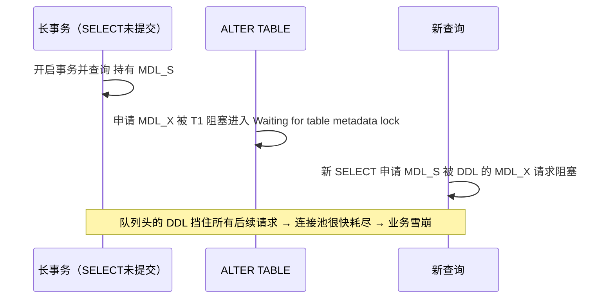
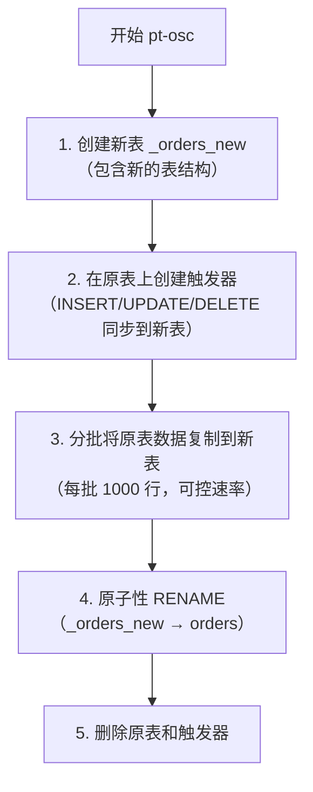
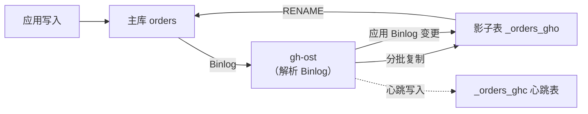
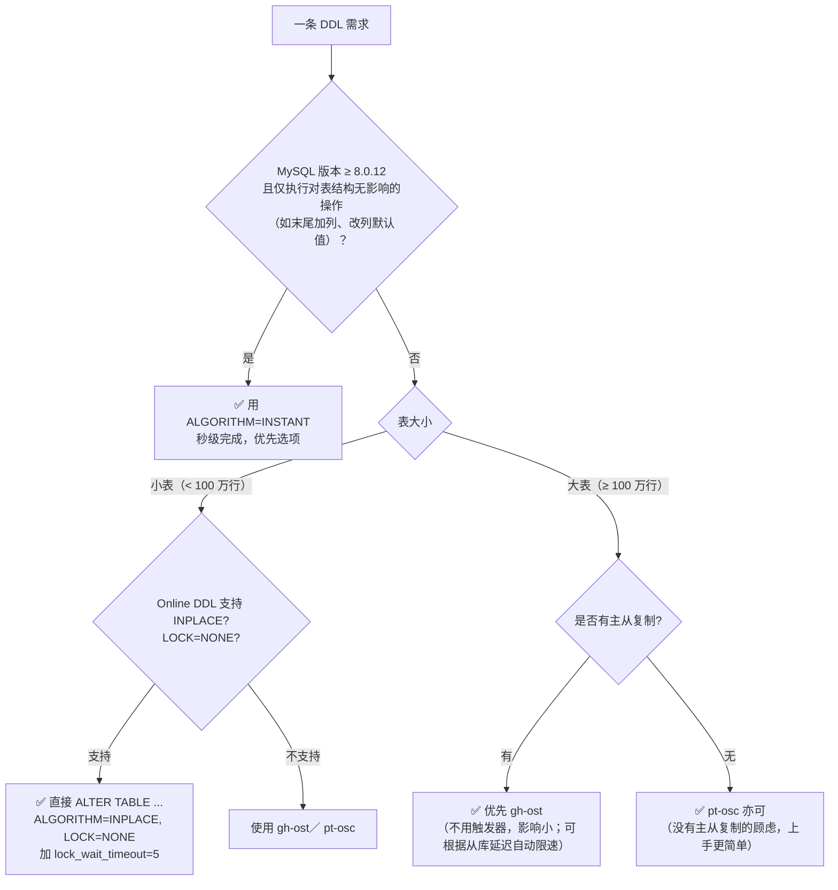

# 在线 DDL 与大表变更

!!! info "**在线 DDL 与大表变更 一句话口诀**"
    **Online DDL 不等于不锁表**——`ALGORITHM=INPLACE, LOCK=NONE` 仅仅是执行中不锁，头尾仍要短暂 MDL。

    **MDL 排他锁是雪崩链的起点**——长事务挠住 MDL、DDL 堵在队中、新查询全被挂起。

    **`ALGORITHM=COPY` 要命两条**：排他锁写操作 + 磁盘申请一张等大新表，生产大表绝对禁用。

    **触发器版 pt-osc、Binlog 版 gh-ost**——同步方式的差别决定了性能影响、可暂停性、切换可控性。

    **大表变更四件套**：低峰窗口 + 短 `lock_wait_timeout` + 保留旧表备份 + 监控主从延迟。

> 📖 **边界声明**：本文聚焦 Online DDL 机制 / MDL 锁原理 / pt-osc 与 gh-ost 原理对比 / DDL 决策树，以下子主题请见对应专题：
>
> - 大表加索引 / DELETE 大表的**生产现场版速查处方** → [实战问题与避坑指南](@mysql-实战问题与避坑指南) 坑 7 / 坑 8
> - DDL 如何影响 **Binlog / 主从复制延迟** → [Binlog与主从复制](@mysql-Binlog与主从复制)
> - **InnoDB 内部执行 DDL 的页分裂 / Redo / Undo 链路** → [InnoDB存储引擎深度剖析](@mysql-InnoDB存储引擎深度剖析)
> - **索引结构本身** （为什么加索引要排序、二级索引为何回表）→ [索引详解](@mysql-索引详解)

---

## 1. 类比：DDL 像营业中的餐厅改装

想象一家**营业中的餐厅**要装修——不能关门停业、但又必须改结构，不同改装方式对客人的影响天差地别：

| 改装方式 | DDL 对应 | 对顾客（业务）影响 |
| :-- | :-- | :-- |
| **关门一天全部翻新**（原地盖新楼，顾客全停） | `ALGORITHM=COPY`（5.5-） | 全程锁表，业务停摆 |
| **营业中换桌椅，偶尔搬动几秒**（Online DDL） | `ALGORITHM=INPLACE, LOCK=NONE` | 大部分时间正常，开头结尾 MDL 短暂阻塞 |
| **只换菜单不动桌椅**（纯元数据变更） | `ALGORITHM=INSTANT`（8.0+） | 毫秒级完成，无锁 |
| **桌子下面挖个洞藏线缆**（有人占着这桌就没法动） | 长事务持有 MDL-S，新 DDL 卡住 | 引发 MDL 雪崩：DDL 堵队 + 新查询挂起 |
| **隔壁开个"克隆店"偷偷装修好再换招牌**（pt-osc） | 触发器同步 + 追完后 RENAME 切换 | 持续双写，磁盘翻倍，最后秒级切换 |
| **同样盖克隆店，但装修通过"客户点单的副本"同步**（gh-ost） | 读 Binlog 同步 + 可暂停 | 无触发器开销，可分段可回滚 |

**一句话**：DDL 的本质是**让一张"活着的表"在不停业的前提下换结构**——方案选择 = **在"停业时长 / 磁盘翻倍 / 锁争用 / 可暂停性 / 迁移复杂度"五个维度里选一组权衡**。本文每一节都在拆解这几种方案的底层机制与适用边界。

---

## 2. 它解决了什么问题？

大表 DDL 是生产中最危险的操作之一。一张 5000 万行的表执行 `ALTER TABLE ADD COLUMN`，在 5.5 年代需要几十分钟，期间表被锁定、业务完全不可用；即便到了 8.0 时代，仍有「INSTANT 够不着、Online DDL 被 MDL 堵死、pt-osc 和 gh-ost 选型失误」三类常见翻车点。

### 2.1 读者价值矩阵

直接按**你当下的困惑**对号入座，跳到对应小节即可：

| 你的困惑 | 本文对应章节 | 机制关键字 |
| :-- | :-- | :-- |
| 为什么 DDL 有时候秒级完成，有时候卡几十分钟？ | §3 算法决定一切 | `ALGORITHM=INSTANT/INPLACE/COPY` |
| 为什么 `LOCK=NONE` 还会阻塞所有查询？ | §4 MDL 锁是雪崩链起点 | `MDL_S` / `MDL_X` / `lock_wait_timeout` |
| pt-osc 为什么会拖慢业务？怎么选限速参数？ | §5 触发器同步的代价 | `AFTER INSERT TRIGGER` + 行锁放大 |
| gh-ost 凭什么不用触发器？从库延迟怎么自动限速？ | §6 伪装从库订阅 Binlog | `COM_REGISTER_SLAVE` + `_ghc` 心跳 |
| 遇到一条 DDL 需求，到底走哪条路？ | §7 决策树 | INSTANT ⟶ Online DDL ⟶ gh-ost |
| 生产大表变更有哪些必须做的事？ | §8 最佳实践清单 | 低峰窗口 + 短 `lock_wait_timeout` + 主从延迟监控 |

### 2.2 DDL 的五维权衡

所有 DDL 方案本质上都是在下列五个维度里做取舍，选型时先问自己「哪个维度不能动」：

| 权衡维度 | COPY 原生 | INPLACE 原生 | INSTANT | pt-osc | gh-ost |
| :-- | :-- | :-- | :-- | :-- | :-- |
| **停业时长** | 全程锁写 | 头尾 MDL 短暂 | 毫秒级 | 切换瞬间 | 切换瞬间（可缓） |
| **磁盘翻倍** | ✅ 要 | 部分操作要 | ❌ 不要 | ✅ 要 | ✅ 要 |
| **锁争用** | MDL-X 全程 | MDL-X 头尾 | MDL-X 瞬间 | 触发器行锁 | 基本无 |
| **可暂停性** | ❌ | ❌ | ❌ | ❌ | ✅ |
| **迁移复杂度** | 最低 | 低 | 最低 | 中 | 中 |

---

## 3. ALTER TABLE 的锁表问题

### 3.1 MySQL 5.5 及以前：全程锁表

```sql
-- 这条语句在 MySQL 5.5 会锁表几十分钟
ALTER TABLE orders ADD COLUMN remark VARCHAR(200);
-- 执行期间：所有读写操作都被阻塞！
```

### 3.2 MySQL 5.6+：Online DDL

MySQL 5.6 引入 Online DDL，大部分 DDL 操作不再锁表：

```sql
-- 语法：指定算法和锁级别
ALTER TABLE orders
ADD COLUMN remark VARCHAR(200),
ALGORITHM=INPLACE,  -- INPLACE: 原地修改（不锁表）; COPY: 复制表（锁表）
LOCK=NONE;          -- NONE: 不加锁; SHARED: 共享锁; EXCLUSIVE: 排他锁
```

### 3.3 Online DDL 支持情况

| 操作类型 | Algorithm | Lock | 说明 |
| :--- | :--- | :--- | :--- |
| 加列（非第一列） | INPLACE | NONE | ✅ 不锁表 |
| 加列（第一列/指定位置） | COPY | SHARED | ⚠️ 锁写 |
| 删列 | INPLACE | NONE | ✅ 不锁表 |
| 修改列类型 | COPY | SHARED | ⚠️ 锁写（类型变更需重建） |
| 加索引 | INPLACE | NONE | ✅ 不锁表 |
| 删索引 | INPLACE | NONE | ✅ 不锁表 |
| 修改主键 | COPY | SHARED | ⚠️ 锁写 |
| 修改字符集 | COPY | SHARED | ⚠️ 锁写（字符集重建） |

!!! note "📖 术语家族：`Online DDL` 与 `MDL`"
    **字面义**：

    - Online DDL = 在线数据定义语言变更，「在线」指执行期间业务可读可写
    - MDL = Metadata Lock = 元数据锁（MySQL 5.5 引入）

    **在 MySQL 中的含义**：Online DDL 通过「ALGORITHM + LOCK」两个维度控制执行方式；所有 DDL 头尾都要申请·释放 **MDL 排他锁**，这是在线 DDL 最易踩的坑。
    **同家族成员**：

    | 成员 | 含义 | 关键点 |
    | :-- | :-- | :-- |
    | `ALGORITHM=INPLACE` | 原地修改表文件，不拷贝全量数据 | 适用于加/删列、索引 |
    | `ALGORITHM=COPY` | 建新表拷贝数据再 RENAME | 限制写、磁盘翻倍 |
    | `ALGORITHM=INSTANT`（8.0.12+） | 仅改元数据字典 | 真 DDL，秒级完成 |
    | `LOCK=NONE` | 执行期间不阻写 | 需引擎支持 |
    | `LOCK=SHARED` | 执行期间只准读 | DDL 和读并行 |
    | `LOCK=EXCLUSIVE` | 执行期间完全锁表 | 退化为传统 DDL |
    | **MDL 共享锁** | 任何 DML/SELECT 自动持有 | 事务提交前不释放 |
    | **MDL 排他锁** | DDL 开始 / 结束短暂持有 | 与所有 MDL 共享锁互斥 |
    | `lock_wait_timeout` | MDL 等待超时（默认 31536000s） | 生产建议降为 5–10s |

    **命名规律**：`ALGORITHM` 管「怎么改」（数据层面），`LOCK` 管「改时别人可不可以操作」（并发层面），**两者正交 = 4×3 种组合**；真正决定 DDL 是否影响业务的是「LOCK + MDL 排他锁有没有等到」这两件事。

> **注意**：即使是 `ALGORITHM=INPLACE, LOCK=NONE`，DDL 开始和结束时仍需要短暂的元数据锁（MDL），如果有长事务持有 MDL，DDL 会被阻塞，反过来又会阻塞后续所有查询。

---

## 4. MDL 锁：DDL 最常见的坑

### 4.1 雪崩链时序：一条长事务如何拖垮整张表



**关键点**：MDL 的排队规则是**FIFO 严格顺序**——即便 DDL 在等 MDL_X，后到的 MDL_S 也不能插队绕过它，因此「一条 DDL 卡住 = 所有后续读写都卡住」。

### 4.2 MDL 锁兼容矩阵

MDL 有 10 种锁模式，但日常排查只需盯住 4 种核心类型：

| 持有方 \ 请求方 | `MDL_S` (SELECT) | `MDL_SW` (DML 写) | `MDL_SU` (Online DDL 中间态) | `MDL_X` (DDL 头尾) |
| :-- | :-: | :-: | :-: | :-: |
| `MDL_S`（SELECT 持有） | ✅ 兼容 | ✅ 兼容 | ✅ 兼容 | ❌ 阻塞 |
| `MDL_SW`（DML 持有） | ✅ 兼容 | ✅ 兼容 | ❌ 阻塞 | ❌ 阻塞 |
| `MDL_SU`（Online DDL 中） | ✅ 兼容 | ❌ 阻塞 | ❌ 阻塞 | ❌ 阻塞 |
| `MDL_X`（DDL 头尾） | ❌ 阻塞 | ❌ 阻塞 | ❌ 阻塞 | ❌ 阻塞 |

**读此表要点**：

1. `MDL_X` 与**任何其他锁**都不兼容——这就是 DDL 头尾「瞬间锁」能堵死全表的根因。
2. Online DDL 在执行中持有 `MDL_SU`（Shared Upgradable），允许 SELECT 但阻塞写；在 `LOCK=NONE` 下会在 commit 阶段把 `MDL_SU` **升级为 `MDL_X`**，这个升级点是最后一个危险窗口。
3. 一条未提交的 SELECT（只持有 `MDL_S`）即可阻塞 DDL 获取 `MDL_X`——很多人以为只有写事务会锁，实际**只读长事务一样致命**。

!!! note "📖 术语家族：`MDL`（Metadata Lock）"
    **字面义**：Metadata Lock = 元数据锁，MySQL 5.5 引入用来保护表结构的稳定性

    **在 MySQL 中的含义**：任何 DML/SELECT 访问表时都会**自动申请并持有** MDL，直到事务结束才释放；DDL 需要独占的 `MDL_X` 才能修改表结构。

    **同家族成员**（按强度升序）：

    | 成员 | 触发场景 | 源码枚举（`sql/mdl.h`） |
    | :-- | :-- | :-- |
    | `MDL_INTENTION_EXCLUSIVE` (IX) | DDL 预申请 schema 级 | `MDL_INTENTION_EXCLUSIVE` |
    | `MDL_SHARED` (S) | `SELECT` / 打开 `.frm` | `MDL_SHARED` |
    | `MDL_SHARED_HIGH_PRIO` (SH) | 查询系统表 | `MDL_SHARED_HIGH_PRIO` |
    | `MDL_SHARED_READ` (SR) | `SELECT ... LOCK IN SHARE MODE` | `MDL_SHARED_READ` |
    | `MDL_SHARED_WRITE` (SW) | `INSERT/UPDATE/DELETE` | `MDL_SHARED_WRITE` |
    | `MDL_SHARED_UPGRADABLE` (SU) | Online DDL 执行中 | `MDL_SHARED_UPGRADABLE` |
    | `MDL_SHARED_NO_WRITE` (SNW) | `LOCK=SHARED` 的 DDL | `MDL_SHARED_NO_WRITE` |
    | `MDL_SHARED_NO_READ_WRITE` (SNRW) | 写锁定 DDL | `MDL_SHARED_NO_READ_WRITE` |
    | `MDL_EXCLUSIVE` (X) | DDL 头尾 / `LOCK=EXCLUSIVE` | `MDL_EXCLUSIVE` |

    **源码入口**：`MDL_context::acquire_lock()`（`sql/mdl.cc`）负责申请，失败时挂在 `MDL_wait` 上；超时由 `lock_wait_timeout` 控制，在 `MDL_wait::timed_wait()` 里实现。

    **命名规律**：`MDL_<范围>_<强度>`，范围有 `SHARED/EXCLUSIVE/INTENTION`，强度靠后缀 `_WRITE/_NO_WRITE/_NO_READ_WRITE/_UPGRADABLE` 细分；**任何 DML/SELECT 都至少持有一个 `SHARED_*`，事务不结束就不释放**——这条规律记住就够诊断 90% 的 DDL 卡死问题。

### 4.3 排查 MDL 阻塞的四连 SQL

生产现场碰到 DDL 卡死，按下列顺序执行四条 SQL，5 分钟内能定位到元凶：

```sql
-- ① 查看 MDL 锁持有与等待（需开启 performance_schema.metadata_locks 表，5.7.3+ 默认开启）
SELECT
    ml.OBJECT_SCHEMA, ml.OBJECT_NAME,
    ml.LOCK_TYPE, ml.LOCK_STATUS,
    ml.OWNER_THREAD_ID,
    t.PROCESSLIST_ID AS conn_id,
    t.PROCESSLIST_USER, t.PROCESSLIST_HOST,
    t.PROCESSLIST_TIME AS held_seconds,
    t.PROCESSLIST_INFO AS current_sql
FROM performance_schema.metadata_locks ml
JOIN performance_schema.threads t ON ml.OWNER_THREAD_ID = t.THREAD_ID
WHERE ml.OBJECT_NAME = 'orders'
ORDER BY ml.LOCK_STATUS, t.PROCESSLIST_TIME DESC;

-- ② 找出超过 60 秒未提交的长事务（真正的"罪魁"）
SELECT
    trx_id, trx_mysql_thread_id AS conn_id,
    trx_started,
    TIMESTAMPDIFF(SECOND, trx_started, NOW()) AS duration_sec,
    trx_rows_modified, trx_query
FROM information_schema.innodb_trx
WHERE TIMESTAMPDIFF(SECOND, trx_started, NOW()) > 60
ORDER BY duration_sec DESC;

-- ③ 追踪连接的全部历史（看这个连接之前执行过什么，哪条 SQL 没提交）
SELECT event_id, sql_text, timer_wait/1e9 AS ms
FROM performance_schema.events_statements_history
WHERE thread_id = <OWNER_THREAD_ID>
ORDER BY event_id DESC
LIMIT 20;

-- ④ 必要时 kill 长事务（慎用，会回滚）
KILL <conn_id>;
```

!!! warning "排查顺序不能颠倒"
    `SHOW PROCESSLIST` 只能看到**当前 SQL**，看不到「事务里前一条 SELECT 早就跑完了，但事务没提交」这种场景——这正是 MDL 阻塞最隐蔽的形态。**必须用 `performance_schema.metadata_locks` + `innodb_trx` 组合查**。

### 4.4 最佳实践：让 DDL 等不起就放弃

```sql
-- 生产大表 DDL 的标准套路
SET SESSION lock_wait_timeout = 5;   -- MDL 等待超时 5 秒（默认 31536000 = 1 年）
SET SESSION innodb_lock_wait_timeout = 5; -- InnoDB 行锁等待超时
ALTER TABLE orders ADD COLUMN remark VARCHAR(200), ALGORITHM=INPLACE, LOCK=NONE;
-- 失败时报：ERROR 1205 (HY000): Lock wait timeout exceeded
-- 重试即可，比把业务堵死强一万倍
```

**铁律**：

1. 执行 DDL 前务必 `SET lock_wait_timeout = 5~10`，宁可失败重试也不要让 DDL 堵在队头
2. 业务高峰期禁止 DDL——哪怕是 INSTANT，MDL_X 获取失败率会显著上升
3. DDL 执行前 5 分钟，把所有 `> 30s` 的长事务排查掉（大部分是慢查询、忘了提交的交互式会话）

---

## 5. pt-online-schema-change（pt-osc）

pt-osc 是 Percona Toolkit 中的工具，通过触发器实现无锁 DDL。

### 5.1 工作原理



### 5.2 命令示例与关键参数

```bash
# 示例：给 orders 表加一列
pt-online-schema-change \
    --host=127.0.0.1 \
    --user=root \
    --password=xxx \
    --alter="ADD COLUMN remark VARCHAR(200)" \
    --execute \
    D=mydb,t=orders

# 关键参数
--chunk-size=1000          # 每批复制行数
--max-load="Threads_running=50"  # 负载超过阈值时暂停
--critical-load="Threads_running=100"  # 负载过高时中止
--no-drop-old-table        # 保留原表备份
```

### 5.3 触发器的几个没人讲的代价

pt-osc 的触发器不是「放在那里就行」，其实有三个隐形代价：

```sql
-- pt-osc 在原表上创建的触发器（简化版）
CREATE TRIGGER pt_osc_mydb_orders_ins AFTER INSERT ON orders
FOR EACH ROW REPLACE INTO _orders_new (...) VALUES (NEW....);

CREATE TRIGGER pt_osc_mydb_orders_upd AFTER UPDATE ON orders
FOR EACH ROW REPLACE INTO _orders_new (...) VALUES (NEW....);

CREATE TRIGGER pt_osc_mydb_orders_del AFTER DELETE ON orders
FOR EACH ROW DELETE IGNORE FROM _orders_new WHERE id = OLD.id;
```

**代价一：行锁放大**。原表的 `INSERT/UPDATE/DELETE` 需要**同事务中**执行影子表的 `REPLACE/DELETE`，原本一条 DML 持有的行锁范围至少**翻倍**（原表 × 影子表），高并发下死锁概率显著升高。

**代价二：事务时长拉长**。触发器函体计入主事务时长，原本 5ms 的 `UPDATE` 可能变成 15ms，直接体现在业务 QPS 下降上。

**代价三：DDL 期间禁止任何其他触发器变更**。MySQL 限制一张表每种时机（AFTER INSERT 等）只能有一个触发器（低版本），pt-osc 运行期间原表上的业务触发器会写冲突。

### 5.4 RENAME 原子切换的核心语句

终点的切换是 pt-osc 最危险的一瞬，用一条 `RENAME TABLE` 同时交换原表和影子表：

```sql
-- MySQL 保证多表 RENAME 是原子的：要么全成功，要么全回滚
RENAME TABLE
    orders      TO _orders_old,
    _orders_new TO orders;
-- 整个过程仅需短暂 MDL_X，通常 < 1s
-- 切换后 orders = 新结构，_orders_old = 原表备份
```

**特别注意三点**：

1. 这一瞬仍需 MDL_X，如有长事务堵住会一起报 `Lock wait timeout`
2. RENAME 成功后 pt-osc 默认会 DROP `_orders_old`，务必加 `--no-drop-old-table` 留备份账
3. 如果原表有外键，RENAME 后外键依然指向旧表名，需额外处理（pt-osc 用 `--alter-foreign-keys-method=auto` 自动修复）

### 5.5 pt-osc 的局限

- 触发器有性能开销（约 10%~20%），高并发表不建议用
- 不支持没有主键的表（`REPLACE INTO` 需要用唯一索引定位行）
- RENAME 时有极短暂的 MDL_X 锁（通常 < 1s）
- 过程不可暂停，如需中止只能 `Ctrl+C` 后手工清理影子表与触发器

---

## 6. gh-ost：GitHub 的无触发器方案

gh-ost（GitHub Online Schema Transmogrifier）是 GitHub 开源的工具，不使用触发器，通过解析 Binlog 同步数据变更。

### 6.1 工作原理



### 6.2 伪装从库：gh-ost 为什么不用触发器

gh-ost 启动时会**伪装成一台 MySQL 从库**订阅主库的 Binlog：

```txt
1. gh-ost 发送 COM_REGISTER_SLAVE 命令，携带唯一 server_id（默认 1111~）
   → 主库把它当从库看待，分配 Binlog Dump 线程
2. gh-ost 发送 COM_BINLOG_DUMP（或 COM_BINLOG_DUMP_GTID）
   → 主库从指定位点开始持续推送 Binlog Event
3. gh-ost 解析 ROW 格式的三类 Event：
   - Write_rows_event_v2 (0x1E) → 换算为 INSERT _orders_gho
   - Update_rows_event_v2 (0x1F) → 换算为 UPDATE _orders_gho
   - Delete_rows_event_v2 (0x20) → 换算为 DELETE _orders_gho
4. 同时用 SELECT ... LOCK IN SHARE MODE 分批拷贝存量到影子表
```

**核心优势（对比 pt-osc）**：

| 维度 | pt-osc（触发器） | gh-ost（Binlog） |
| :-- | :-- | :-- |
| 同步开销 | 同事务同步，抽走业务 QPS | 异库解析，主库开销接近 0 |
| 暂停 | 不支持 | 随时 `pause`，停止解析即可 |
| 从库延迟感知 | 需手工 `--max-lag` | 原生 `--throttle-control-replicas` |
| 长事务影响 | 触发器无变 | 不受影响 |

### 6.3 `_ghc` 心跳表：怎么确认追齐了

gh-ost 除了 `_xxx_gho`（影子表），还会创建一张 `_xxx_ghc`（**G**it**H**ub **C**hangelog）心跳表：

```sql
-- gh-ost 周期性写心跳（默认每 100ms）
INSERT INTO _orders_ghc (id, last_update, hint, value)
VALUES (1, NOW(6), 'heartbeat', 'xxx');
-- 这条写入会走 Binlog → 被 gh-ost 自己解析到
-- gh-ost 比对 NOW(6) 与系统时间的差值 = 追齐滞后，用来判断是否可以 cut-over
```

**作用三重**：

1. 探测主从延迟——主库心跳时间 vs 从库解析到该心跳的时间差 = 真实复制延迟
2. 检测自己的 Binlog 解析滞后量（lag），超阈值自动降速
3. 认证所属 gh-ost 进程（避免多实例双启维护同一表）

### 6.4 命令示例与反向限速

```bash
# 示例：给 orders 表加索引
gh-ost \
    --host=127.0.0.1 \
    --user=root \
    --password=xxx \
    --database=mydb \
    --table=orders \
    --alter="ADD INDEX idx_status(status)" \
    --execute

# 关键参数
--chunk-size=1000              # 每批复制行数
--max-load=Threads_running=30  # 负载限制
--throttle-control-replicas    # 根据从库延迟自动限速
--postpone-cut-over-flag-file  # 暂停最终切换（手动控制切换时机）
--migrate-on-replica           # 直接在从库执行 DDL（避开主库写压力）
```

### 6.5 pt-osc vs gh-ost

| 对比项 | pt-osc | gh-ost |
| :--- | :--- | :--- |
| 同步方式 | 触发器 | Binlog |
| 性能影响 | 较大（触发器开销） | 较小 |
| 主从复制 | 触发器在主库执行，从库重放 | 直接在主库操作，更安全 |
| 可暂停/恢复 | 不支持 | ✅ 支持 |
| 手动控制切换 | 不支持 | ✅ 支持（flag file） |
| 从库延迟感知 | 限仅对 Seconds_Behind_Master | 心跳表比对 |
| 复杂度 | 低 | 中 |

> **推荐**：新项目优先使用 gh-ost，更安全，可控性更强。
!!! note "📖 术语家族：DDL 变更工具"
    **字面义**：

    - pt-osc = **p**ercona**-t**oolkit **o**nline-**s**chema-**c**hange
    - gh-ost = **G**it**H**ub **O**nline **S**chema **T**ransmogrifier（变形者）

    **在 MySQL 生态中的含义**：两者都是「影子表 + 分批灼入数据 + 最终 RENAME 原子切换」的外部工具，主要用来绕过 `ALGORITHM=COPY` 带来的锁写代价与主从延迟。
    **同家族成员**：

    | 工具 | 同步机制 | 依赖 | 性能影响 | 控制力 |
    | :-- | :-- | :-- | :-- | :-- |
    | `ALTER TABLE 原生 DDL` | 引擎层原地 | 无 | `COPY` 时严重，INSTANT 秒级 | 不可暂停 |
    | `pt-online-schema-change` | **触发器**同步 | Perl + Percona Toolkit | 触发器开销 10~20% | 不支持暂停 |
    | `gh-ost` | 解析 **Binlog**同步 | 唯一二进制依赖 | 很小，影子表写入不走触发器 | 支持暂停 / 缓过切换 |
    | `Online DDL (INSTANT)` | 8.0.12+ 元数据字典 | MySQL 内置 | 秒级，几乎无影响 | 只支持加列（末尾） |

    **命名规律**：第三方工具常用 `-osc` / `-ost` / `-change` 后缀，围绕**影子表、分批灼入、原子切换**三部曲；两者中间表命名也有规律——pt-osc 用 `_xxx_new`，gh-ost 用 `_xxx_gho`，百无一失地可以通过中间表后缀判断当前环境在执行哪种工具。

---

## 7. DDL 执行方式决策树

面对一条具体的 DDL 需求，按下列流程选定执行方式，避免「给大表加列就用 `ALTER` 直推」的盲从：



**核心规则**：

1. **8.0.12+ 先试 INSTANT**：无损秒级，能用就不要绕弯
2. **小表优先原生 Online DDL**：避免引入 pt-osc/gh-ost 的复杂度，但必须加 `lock_wait_timeout`
3. **大表 + 有主从 → gh-ost**：触发器方案在从库重放时成本放大
4. **COPY 算法直接拒绝**：磁盘翻倍 + 锁写，生产大表绝不能走

---

## 8. 大表变更最佳实践

### 8.1 变更前检查清单

```sql
-- 1. 确认表大小
SELECT
    table_name,
    ROUND(data_length / 1024 / 1024, 2) AS data_mb,
    ROUND(index_length / 1024 / 1024, 2) AS index_mb,
    table_rows
FROM information_schema.tables
WHERE table_schema = 'mydb' AND table_name = 'orders';

-- 2. 检查是否有长事务
SELECT * FROM information_schema.innodb_trx
WHERE TIME_TO_SEC(TIMEDIFF(NOW(), trx_started)) > 60;

-- 3. 检查主从延迟
SHOW SLAVE STATUS\G  -- Seconds_Behind_Master 应为 0

-- 4. 确认 DDL 操作是否支持 Online DDL
-- 先在测试环境执行，观察 ALGORITHM 和 LOCK
```

### 8.2 变更时间窗口

- **选择业务低峰期**（凌晨 2~4 点）
- **提前演练**：在测试环境测量执行时间
- **准备回滚方案**：保留原表（`--no-drop-old-table`）
- **监控主从延迟**：变更期间延迟增大时暂停

### 8.3 分批删除大量数据

```sql
-- ❌ 危险：一次性删除大量数据，产生大事务，锁表时间长
DELETE FROM logs WHERE create_time < '2023-01-01';

-- ✅ 安全：分批删除，每批 1000 行
DELETE FROM logs WHERE create_time < '2023-01-01' LIMIT 1000;
-- 循环执行，直到影响行数为 0

-- 更好的方案：用 pt-archiver 分批归档
pt-archiver \
    --source h=127.0.0.1,D=mydb,t=logs \
    --where "create_time < '2023-01-01'" \
    --limit=1000 \
    --sleep=0.1 \
    --purge
```

---

## 9. 常见问题

> 📖 **具体工程场景的处方**（「大表加索引怎么办」/「大表 DELETE 怎么拆」等）已在 [实战问题与避坑指南](@mysql-实战问题与避坑指南) 坑 7/8 给出快速处方，本文不再重复，专注「机制、工具对比、选型决策」三类问题。

**Q：Online DDL 一定不锁表吗？**

> 不是。Online DDL 的 `ALGORITHM=INPLACE, LOCK=NONE` 在执行过程中不锁表，但开始和结束时需要短暂的 MDL 排他锁。如果有长事务持有 MDL 共享锁，DDL 会被阻塞，进而阻塞所有后续查询。

**Q：pt-osc 和 gh-ost 如何选择？**

> 优先选 gh-ost：无触发器，性能影响小，支持暂停/恢复，可手动控制切换时机。pt-osc 更简单，适合小团队或简单场景。

**Q：如何安全地删除大表中的历史数据？**

> 分批删除，每批 1000~5000 行，批次间加 sleep（如 0.1s），避免产生大事务和主从延迟。或使用 pt-archiver 工具，支持自动限速和归档到备份表。

**Q：修改列类型（如 INT 改 BIGINT）有什么风险？**

> 修改列类型通常需要 `ALGORITHM=COPY`，会锁写操作，对大表影响极大。应使用 pt-osc 或 gh-ost 执行。另外，INT 改 BIGINT 是安全的（范围扩大），但 BIGINT 改 INT 可能导致数据截断，需要先验证数据范围。

**Q：gh-ost 如何在不用触发器的情况下保证影子表与原表数据一致？**

> gh-ost 伪装成一个 MySQL 从库，注册到主库的 Binlog Dump 线程中实时拉取 Row Event——全量拷贝走 `SELECT ... LOCK IN SHARE MODE` 分批读写入影子表，增量变更则通过解析 `Write_rows/Update_rows/Delete_rows` Event 重新回放到影子表。这种架构避开了 pt-osc 触发器的同步执行开销，且暂停时仅需停止解析 Binlog、不影响原表写入。

**Q：MySQL 8.0 INSTANT 算法为什么可以做到秒级加列？**

> 8.0.12 引入 INSTANT 算法后，末尾加列**只修改 InnoDB 数据字典中的表元数据**，不重写任何数据页；新列的默认值存到数据字典，读取旧行时遇到新列则返回默认值。因此执行时间与表大小无关，能秒级完成。限制：只能末尾加列（不能指定位置），不支持改列类型、加索引。

**Q：INSTANT 加列怎么存新列默认值？读旧行时怎么处理？**

> 在 `data_dictionary.columns.se_private_data` 字段中会新增两个属性：`default_null`（新列默认是否为 NULL）与 `default`（默认值的字节编码）；读取行时 InnoDB 比对行头 `instant_flag` 和记录里的实际列个数——如果行里的列个数少于最新表结构，缺少的那几列**直接从数据字典拿默认值补齐**，避免重写数据页。它和传统的 `NOT NULL DEFAULT` 最大的区别：传统的 `ALTER ... ADD COLUMN c INT NOT NULL DEFAULT 0` 仍需重写每一行，INSTANT 不需重写任何行。

**Q：pt-osc 为什么要求表必须有主键？**

> pt-osc 的触发器用 `REPLACE INTO ... VALUES(NEW....)` 向影子表同步数据，而 `REPLACE` 本质是「主键/唯一索引冲突时先删后插」：没有主键时 InnoDB 会隐式生成 `DB_ROW_ID`，但这个 ID 在原表和影子表中**完全独立**，触发器无法将 NEW 行匹配到影子表的对应行，数据会直接变成死行堆积；同时 `UPDATE/DELETE` 触发器在影子表里找不到要改的行。这是硬性限制，不可绕过。gh-ost 同样要求主键或唯一索引，但原因不同——它需要按键分批 `SELECT WHERE id > xxx LIMIT n`。

**Q：Online DDL 的第三条路 `ALGORITHM=INPLACE, LOCK=NONE` 在执行中怎么同步这期间的写入？**

> InnoDB 在 INPLACE DDL 开始时会申请一块 `innodb_online_alter_log_max_size`（默认 128MB）的内存缓冲区，叫「**Online DDL 日志**」（不同于 Redo/Undo）；DDL 执行期间原表的所有 DML 变更被记录到这个缓冲区，不直接在影子表上回放；DDL 快结束时会把缓冲区中的记录**由 `row0log.cc::row_log_apply()` 序列化回放**到新表，重放期间需将 `MDL_SU` 升级为 `MDL_X`。如果期间写入量超过 128MB 缓冲区会直接报 `ER_INNODB_ONLINE_LOG_TOO_BIG`，DDL 回滚——这也是大表 Online DDL 仍可能中途失败的根因。

---

## 10. 版本差异提示

| 版本 | DDL 能力差异 |
| :-- | :-- |
| **5.5 及以前** | 全程锁表，一切 DDL 走传统 COPY；生产环境已应淘汰 |
| **5.6** | 引入 Online DDL 框架 + `ALGORITHM=INPLACE`；部分 DDL 可在线 |
| **5.7** | 扩展 INPLACE 支持范围；引入 `VIRTUAL` 列支持；performance_schema 新增 `metadata_locks` 可观测 MDL |
| **8.0.0~8.0.11** | 数据字典重构为 InnoDB 表，元数据一致性更强；保留 INPLACE 能力 |
| **8.0.12+** | 新增 `ALGORITHM=INSTANT`，末尾加列秒级完成；`SET DEFAULT` / 添加虚拟列等亦可 INSTANT |
| **8.0.29+** | INSTANT 扩展支持**任意位置加列**（不再限制仅末尾） |

```sql
-- 查看当前版本的 Online DDL 能力
SHOW VARIABLES LIKE 'innodb_online_alter_log_max_size';
-- 查看某表的 INSTANT 列信息（例如 orders）
SELECT * FROM information_schema.innodb_tables WHERE name = 'mydb/orders';
```

---

## 11. 加强记忆版口诀

!!! tip "**在线 DDL 与大表变更 核心记忆卡**"
    **一句话图**：**处理在线 DDL 的顶层心法，是在「停业时长 / 磁盘翻倍 / 锁争用 / 可暂停性 / 迁移复杂度」五个维度里做取舍**——INSTANT 破局「停业时长」，Online DDL 破局「锁争用」，gh-ost 破局「可暂停性」。

    **五标特征**：

    - **"Online" 不是不锁** —— `INPLACE, LOCK=NONE` 仅是执行中不锁，头尾 MDL_X 瞬间廿迷错过一条长事务就雪崩

    - **MDL 排队是 FIFO 严格顺序** —— DDL 堵住后，后来的 SELECT 也不能插队绕过它，一条长 SELECT 就能拖垮全表

    - **`lock_wait_timeout=5` 是每条 DDL 的安全带** —— 默认 31536000（1 年）等于默认无保护，上产前必改

    - **pt-osc 靠触发器、gh-ost 靠 Binlog** —— 前者拖业务 QPS 不能暂停，后者异库解析可随时暂停，**有主从就优先 gh-ost**

    - **COPY 算法直接拒** —— 生产大表 COPY 等于「磁盘翻倍 + 全程锁写」，没有其他选项只会是愚昧

    **三句口诀**：

    1. **INSTANT 先试、INPLACE 第二、gh-ost 六亲不认 COPY** —— 选型口诀

    2. **`SET lock_wait_timeout=5; ALTER TABLE ...`** —— DDL 执行前双行礼仪

    3. **长事务 + DDL = 雪崩，`metadata_locks` + `innodb_trx` = 破案** —— 排查口诀

---
