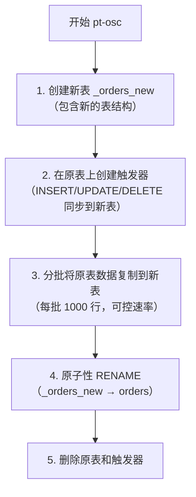
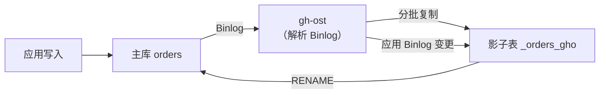

# 在线 DDL 与大表变更

> **核心问题**：如何对千万级大表做 DDL 变更而不影响业务？`ALTER TABLE` 为什么会锁表？

---

## 它解决了什么问题？

大表 DDL 是生产中最危险的操作之一。一张 5000 万行的表执行 `ALTER TABLE ADD COLUMN`，可能需要几十分钟，期间表被锁定，业务完全不可用。本章介绍如何安全地对大表做变更。

---

## ALTER TABLE 的锁表问题

### MySQL 5.5 及以前：全程锁表

```sql
-- 这条语句在 MySQL 5.5 会锁表几十分钟
ALTER TABLE orders ADD COLUMN remark VARCHAR(200);
-- 执行期间：所有读写操作都被阻塞！
```

### MySQL 5.6+：Online DDL

MySQL 5.6 引入 Online DDL，大部分 DDL 操作不再锁表：

```sql
-- 语法：指定算法和锁级别
ALTER TABLE orders
ADD COLUMN remark VARCHAR(200),
ALGORITHM=INPLACE,  -- INPLACE: 原地修改（不锁表）; COPY: 复制表（锁表）
LOCK=NONE;          -- NONE: 不加锁; SHARED: 共享锁; EXCLUSIVE: 排他锁
```

### Online DDL 支持情况

| 操作类型 | Algorithm | Lock | 说明 |
|---------|-----------|------|------|
| 加列（非第一列） | INPLACE | NONE | ✅ 不锁表 |
| 加列（第一列/指定位置） | COPY | SHARED | ⚠️ 锁写 |
| 删列 | INPLACE | NONE | ✅ 不锁表 |
| 修改列类型 | COPY | SHARED | ⚠️ 锁写（类型变更需重建） |
| 加索引 | INPLACE | NONE | ✅ 不锁表 |
| 删索引 | INPLACE | NONE | ✅ 不锁表 |
| 修改主键 | COPY | SHARED | ⚠️ 锁写 |
| 修改字符集 | COPY | SHARED | ⚠️ 锁写 |

> **注意**：即使是 `ALGORITHM=INPLACE, LOCK=NONE`，DDL 开始和结束时仍需要短暂的元数据锁（MDL），如果有长事务持有 MDL，DDL 会被阻塞，反过来又会阻塞后续所有查询。

---

## MDL 锁：DDL 最常见的坑

```mermaid
sequenceDiagram
    participant T1 as 长事务（持有 MDL 共享锁）
    participant DDL as ALTER TABLE（等待 MDL 排他锁）
    participant T2 as 新查询（等待 MDL 共享锁）

    T1->>T1: BEGIN; SELECT ... （持有 MDL 共享锁）
    DDL->>DDL: 申请 MDL 排他锁（被 T1 阻塞，等待）
    T2->>T2: SELECT ...（申请 MDL 共享锁，被 DDL 阻塞！）
    Note over T1,T2: 所有新查询都被阻塞，业务雪崩！
```

**排查和处理**：

```sql
-- 查看是否有 MDL 锁等待
SELECT * FROM performance_schema.metadata_locks
WHERE OBJECT_NAME = 'orders';

-- 找到持有 MDL 锁的事务
SELECT * FROM information_schema.innodb_trx;

-- 找到对应的连接
SHOW PROCESSLIST;

-- 必要时 kill 掉长事务
KILL 12345;
```

**最佳实践**：执行 DDL 前，先检查是否有长事务，并设置 `lock_wait_timeout`：

```sql
SET lock_wait_timeout = 5;  -- DDL 等待 MDL 锁超过 5 秒则放弃，避免阻塞业务
ALTER TABLE orders ADD COLUMN remark VARCHAR(200);
```

---

## pt-online-schema-change（pt-osc）

pt-osc 是 Percona Toolkit 中的工具，通过触发器实现无锁 DDL：

### 工作原理



```bash
# 示例：给 orders 表加一列
pt-online-schema-change \
    --host=127.0.0.1 \
    --user=root \
    --password=xxx \
    --alter="ADD COLUMN remark VARCHAR(200)" \
    --execute \
    D=mydb,t=orders

# 关键参数
--chunk-size=1000          # 每批复制行数
--max-load="Threads_running=50"  # 负载超过阈值时暂停
--critical-load="Threads_running=100"  # 负载过高时中止
--no-drop-old-table        # 保留原表备份
```

**pt-osc 的局限**：
- 触发器有性能开销（约 10%~20%）
- 不支持没有主键的表
- RENAME 时有极短暂的锁（通常 < 1s）

---

## gh-ost：GitHub 的无触发器方案

gh-ost（GitHub Online Schema Transmogrifier）是 GitHub 开源的工具，不使用触发器，通过解析 Binlog 同步数据变更。

### 工作原理



```bash
# 示例：给 orders 表加索引
gh-ost \
    --host=127.0.0.1 \
    --user=root \
    --password=xxx \
    --database=mydb \
    --table=orders \
    --alter="ADD INDEX idx_status(status)" \
    --execute

# 关键参数
--chunk-size=1000              # 每批复制行数
--max-load=Threads_running=30  # 负载限制
--throttle-control-replicas    # 根据从库延迟自动限速
--postpone-cut-over-flag-file  # 暂停最终切换（手动控制切换时机）
```

### pt-osc vs gh-ost

| 对比项 | pt-osc | gh-ost |
|--------|--------|--------|
| 同步方式 | 触发器 | Binlog |
| 性能影响 | 较大（触发器开销） | 较小 |
| 主从复制 | 触发器在主库执行，从库重放 | 直接在主库操作，更安全 |
| 可暂停/恢复 | 不支持 | ✅ 支持 |
| 手动控制切换 | 不支持 | ✅ 支持（flag file） |
| 复杂度 | 低 | 中 |

> **推荐**：新项目优先使用 gh-ost，更安全，可控性更强。

---

## 大表变更最佳实践

### 变更前检查清单

```sql
-- 1. 确认表大小
SELECT
    table_name,
    ROUND(data_length / 1024 / 1024, 2) AS data_mb,
    ROUND(index_length / 1024 / 1024, 2) AS index_mb,
    table_rows
FROM information_schema.tables
WHERE table_schema = 'mydb' AND table_name = 'orders';

-- 2. 检查是否有长事务
SELECT * FROM information_schema.innodb_trx
WHERE TIME_TO_SEC(TIMEDIFF(NOW(), trx_started)) > 60;

-- 3. 检查主从延迟
SHOW SLAVE STATUS\G  -- Seconds_Behind_Master 应为 0

-- 4. 确认 DDL 操作是否支持 Online DDL
-- 先在测试环境执行，观察 ALGORITHM 和 LOCK
```

### 变更时间窗口

- **选择业务低峰期**（凌晨 2~4 点）
- **提前演练**：在测试环境测量执行时间
- **准备回滚方案**：保留原表（`--no-drop-old-table`）
- **监控主从延迟**：变更期间延迟增大时暂停

### 分批删除大量数据

```sql
-- ❌ 危险：一次性删除大量数据，产生大事务，锁表时间长
DELETE FROM logs WHERE create_time < '2023-01-01';

-- ✅ 安全：分批删除，每批 1000 行
DELETE FROM logs WHERE create_time < '2023-01-01' LIMIT 1000;
-- 循环执行，直到影响行数为 0

-- 更好的方案：用 pt-archiver 分批归档
pt-archiver \
    --source h=127.0.0.1,D=mydb,t=logs \
    --where "create_time < '2023-01-01'" \
    --limit=1000 \
    --sleep=0.1 \
    --purge
```

---

## 常见问题

**Q：Online DDL 一定不锁表吗？**

> 不是。Online DDL 的 `ALGORITHM=INPLACE, LOCK=NONE` 在执行过程中不锁表，但开始和结束时需要短暂的 MDL 排他锁。如果有长事务持有 MDL 共享锁，DDL 会被阻塞，进而阻塞所有后续查询。

**Q：pt-osc 和 gh-ost 如何选择？**

> 优先选 gh-ost：无触发器，性能影响小，支持暂停/恢复，可手动控制切换时机。pt-osc 更简单，适合小团队或简单场景。

**Q：如何安全地删除大表中的历史数据？**

> 分批删除，每批 1000~5000 行，批次间加 sleep（如 0.1s），避免产生大事务和主从延迟。或使用 pt-archiver 工具，支持自动限速和归档到备份表。

**Q：修改列类型（如 INT 改 BIGINT）有什么风险？**

> 修改列类型通常需要 `ALGORITHM=COPY`，会锁写操作，对大表影响极大。应使用 pt-osc 或 gh-ost 执行。另外，INT 改 BIGINT 是安全的（范围扩大），但 BIGINT 改 INT 可能导致数据截断，需要先验证数据范围。
