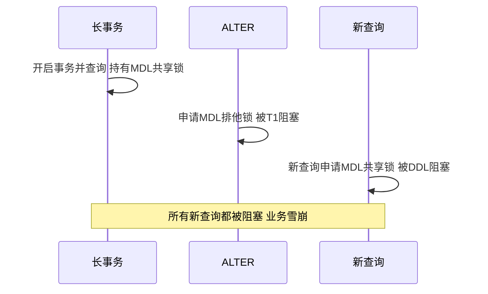
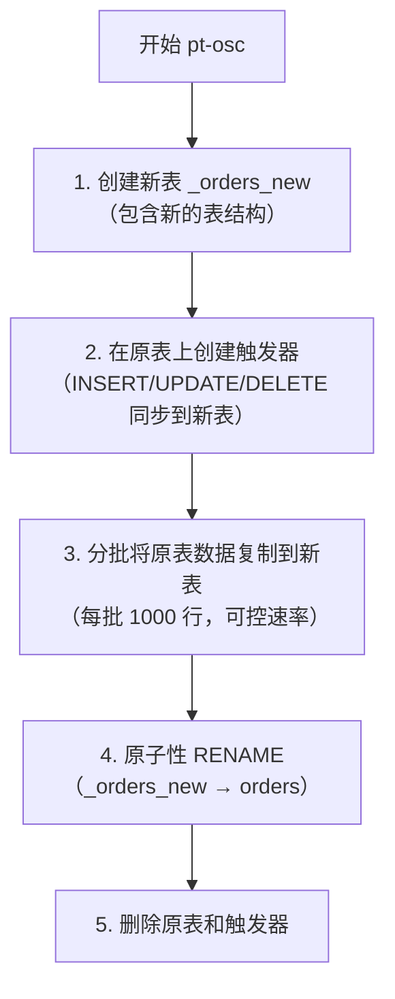
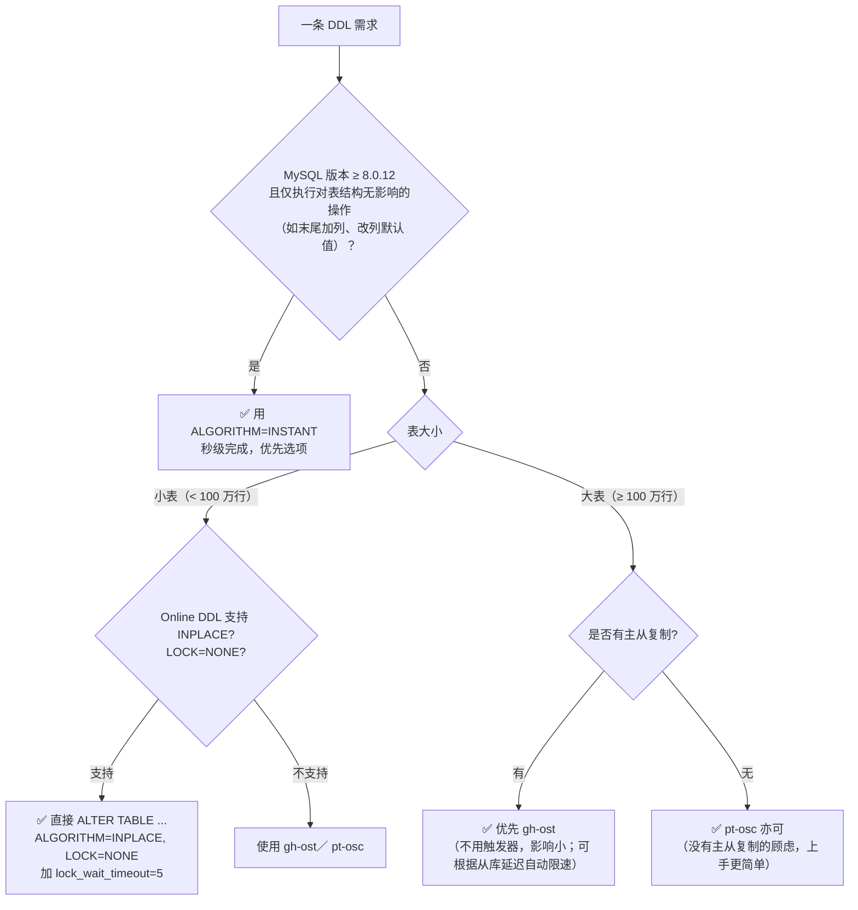

# 在线 DDL 与大表变更

!!! info "**在线 DDL 与大表变更 一句话口诀**"
    **Online DDL 不等于不锁表**——`ALGORITHM=INPLACE, LOCK=NONE` 仅仅是执行中不锁，头尾仍要短暂 MDL。

    **MDL 排他锁是雪崩链的起点**——长事务挠住 MDL、DDL 堵在队中、新查询全被挂起。

    **`ALGORITHM=COPY` 要命两条**：排他锁写操作 + 磁盘申请一张等大新表，生产大表绝对禁用。

    **触发器版 pt-osc、Binlog 版 gh-ost**——同步方式的差别决定了性能影响、可暂停性、切换可控性。

    **大表变更四件套**：低峰窗口 + 短 `lock_wait_timeout` + 保留旧表备份 + 监控主从延迟。

> 📖 **边界声明**：本文聚焦 Online DDL 机制 / MDL 锁原理 / pt-osc 与 gh-ost 原理对比 / DDL 决策树，以下子主题请见对应专题：
>
> - 大表加索引 / DELETE 大表的**生产现场版速查处方** → [实战问题与避坑指南](@mysql-实战问题与避坑指南) 坑 7 / 坑 8
> - DDL 如何影响 **Binlog / 主从复制延迟** → [Binlog与主从复制](@mysql-Binlog与主从复制)
> - **InnoDB 内部执行 DDL 的页分裂 / Redo / Undo 链路** → [InnoDB存储引擎深度剖析](@mysql-InnoDB存储引擎深度剖析)
> - **索引结构本身** （为什么加索引要排序、二级索引为何回表）→ [索引详解](@mysql-索引详解)

---

## 1. 类比：DDL 像营业中的餐厅改装

想象一家**营业中的餐厅**要装修——不能关门停业、但又必须改结构，不同改装方式对客人的影响天差地别：

| 改装方式 | DDL 对应 | 对顾客（业务）影响 |
| :-- | :-- | :-- |
| **关门一天全部翻新**（原地盖新楼，顾客全停） | `ALGORITHM=COPY`（5.5-） | 全程锁表，业务停摆 |
| **营业中换桌椅，偶尔搬动几秒**（Online DDL） | `ALGORITHM=INPLACE, LOCK=NONE` | 大部分时间正常，开头结尾 MDL 短暂阻塞 |
| **只换菜单不动桌椅**（纯元数据变更） | `ALGORITHM=INSTANT`（8.0+） | 毫秒级完成，无锁 |
| **桌子下面挖个洞藏线缆**（有人占着这桌就没法动） | 长事务持有 MDL-S，新 DDL 卡住 | 引发 MDL 雪崩：DDL 堵队 + 新查询挂起 |
| **隔壁开个"克隆店"偷偷装修好再换招牌**（pt-osc） | 触发器同步 + 追完后 RENAME 切换 | 持续双写，磁盘翻倍，最后秒级切换 |
| **同样盖克隆店，但装修通过"客户点单的副本"同步**（gh-ost） | 读 Binlog 同步 + 可暂停 | 无触发器开销，可分段可回滚 |

**一句话**：DDL 的本质是**让一张"活着的表"在不停业的前提下换结构**——方案选择 = **在"停业时长 / 磁盘翻倍 / 锁争用 / 可暂停性 / 迁移复杂度"五个维度里选一组权衡**。本文每一节都在拆解这几种方案的底层机制与适用边界。

---

## 2. 它解决了什么问题？

大表 DDL 是生产中最危险的操作之一。一张 5000 万行的表执行 `ALTER TABLE ADD COLUMN`，可能需要几十分钟，期间表被锁定，业务完全不可用。本章介绍如何安全地对大表做变更。

---

## 3. ALTER TABLE 的锁表问题

### MySQL 5.5 及以前：全程锁表

```sql
-- 这条语句在 MySQL 5.5 会锁表几十分钟
ALTER TABLE orders ADD COLUMN remark VARCHAR(200);
-- 执行期间：所有读写操作都被阻塞！
```

### MySQL 5.6+：Online DDL

MySQL 5.6 引入 Online DDL，大部分 DDL 操作不再锁表：

```sql
-- 语法：指定算法和锁级别
ALTER TABLE orders
ADD COLUMN remark VARCHAR(200),
ALGORITHM=INPLACE,  -- INPLACE: 原地修改（不锁表）; COPY: 复制表（锁表）
LOCK=NONE;          -- NONE: 不加锁; SHARED: 共享锁; EXCLUSIVE: 排他锁
```

### Online DDL 支持情况

| 操作类型 | Algorithm | Lock | 说明 |
| :--- | :--- | :--- | :--- |
| 加列（非第一列） | INPLACE | NONE | ✅ 不锁表 |
| 加列（第一列/指定位置） | COPY | SHARED | ⚠️ 锁写 |
| 删列 | INPLACE | NONE | ✅ 不锁表 |
| 修改列类型 | COPY | SHARED | ⚠️ 锁写（类型变更需重建） |
| 加索引 | INPLACE | NONE | ✅ 不锁表 |
| 删索引 | INPLACE | NONE | ✅ 不锁表 |
| 修改主键 | COPY | SHARED | ⚠️ 锁写 |
| 修改字符集 | COPY | SHARED | ⚠️ 锁写（字符集重建） |

!!! note "📖 术语家族：`Online DDL` 与 `MDL`"
    **字面义**：

    - Online DDL = 在线数据定义语言变更，「在线」指执行期间业务可读可写
    - MDL = Metadata Lock = 元数据锁（MySQL 5.5 引入）

    **在 MySQL 中的含义**：Online DDL 通过「ALGORITHM + LOCK」两个维度控制执行方式；所有 DDL 头尾都要申请·释放 **MDL 排他锁**，这是在线 DDL 最易踩的坑。
    **同家族成员**：

    | 成员 | 含义 | 关键点 |
    | :-- | :-- | :-- |
    | `ALGORITHM=INPLACE` | 原地修改表文件，不拷贝全量数据 | 适用于加/删列、索引 |
    | `ALGORITHM=COPY` | 建新表拷贝数据再 RENAME | 限制写、磁盘翻倍 |
    | `ALGORITHM=INSTANT`（8.0.12+） | 仅改元数据字典 | 真 DDL，秒级完成 |
    | `LOCK=NONE` | 执行期间不阻写 | 需引擎支持 |
    | `LOCK=SHARED` | 执行期间只准读 | DDL 和读并行 |
    | `LOCK=EXCLUSIVE` | 执行期间完全锁表 | 退化为传统 DDL |
    | **MDL 共享锁** | 任何 DML/SELECT 自动持有 | 事务提交前不释放 |
    | **MDL 排他锁** | DDL 开始 / 结束短暂持有 | 与所有 MDL 共享锁互斥 |
    | `lock_wait_timeout` | MDL 等待超时（默认 31536000s） | 生产建议降为 5–10s |

    **命名规律**：`ALGORITHM` 管「怎么改」（数据层面），`LOCK` 管「改时别人可不可以操作」（并发层面），**两者正交 = 4×3 种组合**；真正决定 DDL 是否影响业务的是「LOCK + MDL 排他锁有没有等到」这两件事。

> **注意**：即使是 `ALGORITHM=INPLACE, LOCK=NONE`，DDL 开始和结束时仍需要短暂的元数据锁（MDL），如果有长事务持有 MDL，DDL 会被阻塞，反过来又会阻塞后续所有查询。
---

## 4. MDL 锁：DDL 最常见的坑



**排查和处理**：

```sql
-- 查看是否有 MDL 锁等待
SELECT * FROM performance_schema.metadata_locks
WHERE OBJECT_NAME = 'orders';

-- 找到持有 MDL 锁的事务
SELECT * FROM information_schema.innodb_trx;

-- 找到对应的连接
SHOW PROCESSLIST;

-- 必要时 kill 掉长事务
KILL 12345;
```

**最佳实践**：执行 DDL 前，先检查是否有长事务，并设置 `lock_wait_timeout`：

```sql
SET lock_wait_timeout = 5;  -- DDL 等待 MDL 锁超过 5 秒则放弃，避免阻塞业务
ALTER TABLE orders ADD COLUMN remark VARCHAR(200);
```

---

## 5. pt-online-schema-change（pt-osc）

pt-osc 是 Percona Toolkit 中的工具，通过触发器实现无锁 DDL：

### 工作原理



```bash
# 示例：给 orders 表加一列
pt-online-schema-change \
    --host=127.0.0.1 \
    --user=root \
    --password=xxx \
    --alter="ADD COLUMN remark VARCHAR(200)" \
    --execute \
    D=mydb,t=orders

# 关键参数
--chunk-size=1000          # 每批复制行数
--max-load="Threads_running=50"  # 负载超过阈值时暂停
--critical-load="Threads_running=100"  # 负载过高时中止
--no-drop-old-table        # 保留原表备份
```

**pt-osc 的局限**：

- 触发器有性能开销（约 10%~20%）
- 不支持没有主键的表
- RENAME 时有极短暂的锁（通常 < 1s）

---

## 6. gh-ost：GitHub 的无触发器方案

gh-ost（GitHub Online Schema Transmogrifier）是 GitHub 开源的工具，不使用触发器，通过解析 Binlog 同步数据变更。

### 工作原理


```bash
# 示例：给 orders 表加索引
gh-ost \
    --host=127.0.0.1 \
    --user=root \
    --password=xxx \
    --database=mydb \
    --table=orders \
    --alter="ADD INDEX idx_status(status)" \
    --execute

# 关键参数
--chunk-size=1000              # 每批复制行数
--max-load=Threads_running=30  # 负载限制
--throttle-control-replicas    # 根据从库延迟自动限速
--postpone-cut-over-flag-file  # 暂停最终切换（手动控制切换时机）
```

### pt-osc vs gh-ost

| 对比项 | pt-osc | gh-ost |
| :--- | :--- | :--- |
| 同步方式 | 触发器 | Binlog |
| 性能影响 | 较大（触发器开销） | 较小 |
| 主从复制 | 触发器在主库执行，从库重放 | 直接在主库操作，更安全 |
| 可暂停/恢复 | 不支持 | ✅ 支持 |
| 手动控制切换 | 不支持 | ✅ 支持（flag file） |
| 复杂度 | 低 | 中 |

> **推荐**：新项目优先使用 gh-ost，更安全，可控性更强。

!!! note "📖 术语家族：DDL 变更工具"
    **字面义**：

    - pt-osc = **p**ercona**-t**oolkit **o**nline-**s**chema-**c**hange
    - gh-ost = **G**it**H**ub **O**nline **S**chema **T**ransmogrifier（变形者）

    **在 MySQL 生态中的含义**：两者都是「影子表 + 分批灼入数据 + 最终 RENAME 原子切换」的外部工具，主要用来绕过 `ALGORITHM=COPY` 带来的锁写代价与主从延迟。
    **同家族成员**：

    | 工具 | 同步机制 | 依赖 | 性能影响 | 控制力 |
    | :-- | :-- | :-- | :-- | :-- |
    | `ALTER TABLE 原生 DDL` | 引擎层原地 | 无 | `COPY` 时严重，INSTANT 秒级 | 不可暂停 |
    | `pt-online-schema-change` | **触发器**同步 | Perl + Percona Toolkit | 触发器开销 10~20% | 不支持暂停 |
    | `gh-ost` | 解析 **Binlog**同步 | 唯一二进制依赖 | 很小，影子表写入不走触发器 | 支持暂停 / 缓过切换 |
    | `Online DDL (INSTANT)` | 8.0.12+ 元数据字典 | MySQL 内置 | 秒级，几乎无影响 | 只支持加列（末尾） |

    **命名规律**：第三方工具常用 `-osc` / `-ost` / `-change` 后缀，围绕**影子表、分批灼入、原子切换**三部曲；两者中间表命名也有规律——pt-osc 用 `_xxx_new`，gh-ost 用 `_xxx_gho`，百无一失地可以通过中间表后缀判断当前环境在执行哪种工具。

---

## 7. DDL 执行方式决策树

面对一条具体的 DDL 需求，按下列流程选定执行方式，避免「给大表加列就用 `ALTER` 直推」的盲从：



**核心规则**：

1. **8.0.12+ 先试 INSTANT**：无损秒级，能用就不要绕弯
2. **小表优先原生 Online DDL**：避免引入 pt-osc/gh-ost 的复杂度，但必须加 `lock_wait_timeout`
3. **大表 + 有主从 → gh-ost**：触发器方案在从库重放时成本放大
4. **COPY 算法直接拒绝**：磁盘翻倍 + 锁写，生产大表绝不能走

---

## 8. 大表变更最佳实践

### 变更前检查清单

```sql
-- 1. 确认表大小
SELECT
    table_name,
    ROUND(data_length / 1024 / 1024, 2) AS data_mb,
    ROUND(index_length / 1024 / 1024, 2) AS index_mb,
    table_rows
FROM information_schema.tables
WHERE table_schema = 'mydb' AND table_name = 'orders';

-- 2. 检查是否有长事务
SELECT * FROM information_schema.innodb_trx
WHERE TIME_TO_SEC(TIMEDIFF(NOW(), trx_started)) > 60;

-- 3. 检查主从延迟
SHOW SLAVE STATUS\G  -- Seconds_Behind_Master 应为 0

-- 4. 确认 DDL 操作是否支持 Online DDL
-- 先在测试环境执行，观察 ALGORITHM 和 LOCK
```

### 变更时间窗口

- **选择业务低峰期**（凌晨 2~4 点）
- **提前演练**：在测试环境测量执行时间
- **准备回滚方案**：保留原表（`--no-drop-old-table`）
- **监控主从延迟**：变更期间延迟增大时暂停

### 分批删除大量数据

```sql
-- ❌ 危险：一次性删除大量数据，产生大事务，锁表时间长
DELETE FROM logs WHERE create_time < '2023-01-01';

-- ✅ 安全：分批删除，每批 1000 行
DELETE FROM logs WHERE create_time < '2023-01-01' LIMIT 1000;
-- 循环执行，直到影响行数为 0

-- 更好的方案：用 pt-archiver 分批归档
pt-archiver \
    --source h=127.0.0.1,D=mydb,t=logs \
    --where "create_time < '2023-01-01'" \
    --limit=1000 \
    --sleep=0.1 \
    --purge
```

---

## 9. 常见问题

> 📖 **具体工程场景的处方**（「大表加索引怎么办」/「大表 DELETE 怎么拆」等）已在 [实战问题与避坑指南](@mysql-实战问题与避坑指南) 坑 7/8 给出快速处方，本文不再重复，专注「机制、工具对比、选型决策」三类问题。

**Q：Online DDL 一定不锁表吗？**

> 不是。Online DDL 的 `ALGORITHM=INPLACE, LOCK=NONE` 在执行过程中不锁表，但开始和结束时需要短暂的 MDL 排他锁。如果有长事务持有 MDL 共享锁，DDL 会被阻塞，进而阻塞所有后续查询。

**Q：pt-osc 和 gh-ost 如何选择？**

> 优先选 gh-ost：无触发器，性能影响小，支持暂停/恢复，可手动控制切换时机。pt-osc 更简单，适合小团队或简单场景。

**Q：如何安全地删除大表中的历史数据？**

> 分批删除，每批 1000~5000 行，批次间加 sleep（如 0.1s），避免产生大事务和主从延迟。或使用 pt-archiver 工具，支持自动限速和归档到备份表。

**Q：修改列类型（如 INT 改 BIGINT）有什么风险？**

> 修改列类型通常需要 `ALGORITHM=COPY`，会锁写操作，对大表影响极大。应使用 pt-osc 或 gh-ost 执行。另外，INT 改 BIGINT 是安全的（范围扩大），但 BIGINT 改 INT 可能导致数据截断，需要先验证数据范围。

**Q：gh-ost 如何在不用触发器的情况下保证影子表与原表数据一致？**

> gh-ost 伪装成一个 MySQL 从库，注册到主库的 Binlog Dump 线程中实时拉取 Row Event——全量拷贝走 `SELECT ... LOCK IN SHARE MODE` 分批读写入影子表，增量变更则通过解析 `Write_rows/Update_rows/Delete_rows` Event 重新回放到影子表。这种架构避开了 pt-osc 触发器的同步执行开销，且暂停时仅需停止解析 Binlog、不影响原表写入。

**Q：MySQL 8.0 INSTANT 算法为什么可以做到秒级加列？**

> 8.0.12 引入 INSTANT 算法后，末尾加列**只修改 InnoDB 数据字典中的表元数据**，不重写任何数据页；新列的默认值存到数据字典，读取旧行时遇到新列则返回默认值。因此执行时间与表大小无关，能秒级完成。限制：只能末尾加列（不能指定位置），不支持改列类型、加索引。

---

## 10. 版本差异提示

| 版本 | DDL 能力差异 |
| :-- | :-- |
| **5.5 及以前** | 全程锁表，一切 DDL 走传统 COPY；生产环境已应淘汰 |
| **5.6** | 引入 Online DDL 框架 + `ALGORITHM=INPLACE`；部分 DDL 可在线 |
| **5.7** | 扩展 INPLACE 支持范围；引入 `VIRTUAL` 列支持；performance_schema 新增 `metadata_locks` 可观测 MDL |
| **8.0.0~8.0.11** | 数据字典重构为 InnoDB 表，元数据一致性更强；保留 INPLACE 能力 |
| **8.0.12+** | 新增 `ALGORITHM=INSTANT`，末尾加列秒级完成；`SET DEFAULT` / 添加虚拟列等亦可 INSTANT |
| **8.0.29+** | INSTANT 扩展支持**任意位置加列**（不再限制仅末尾） |

```sql
-- 查看当前版本的 Online DDL 能力
SHOW VARIABLES LIKE 'innodb_online_alter_log_max_size';
-- 查看某表的 INSTANT 列信息（例如 orders）
SELECT * FROM information_schema.innodb_tables WHERE name = 'mydb/orders';
```
