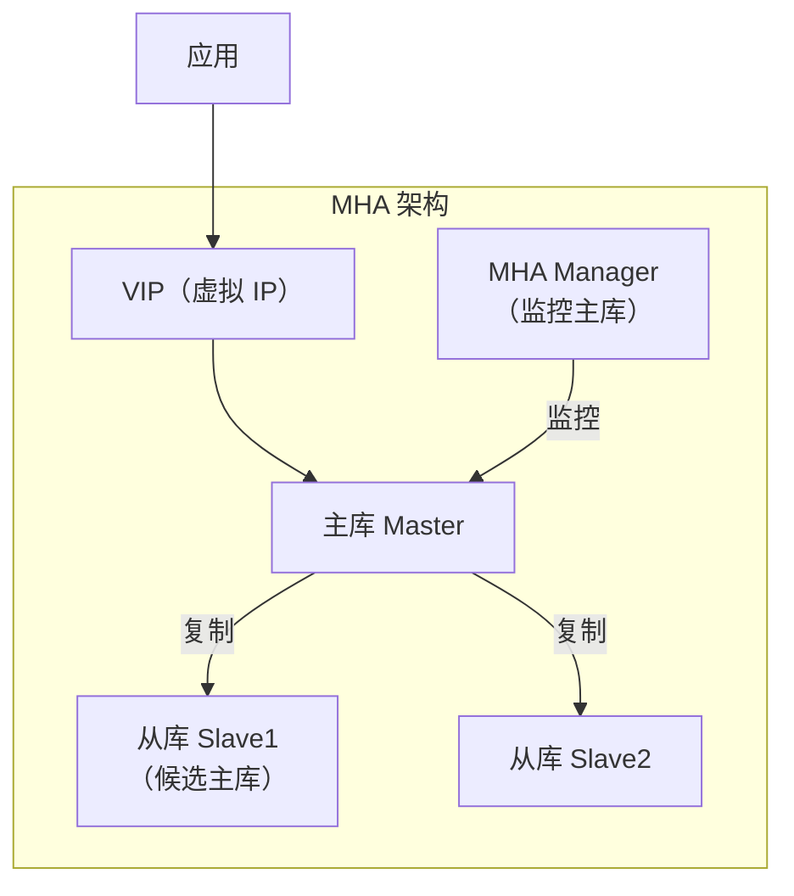
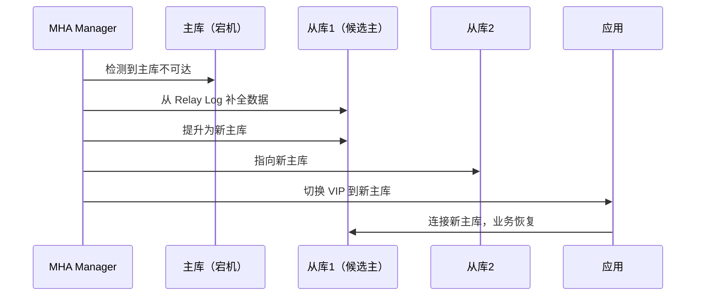
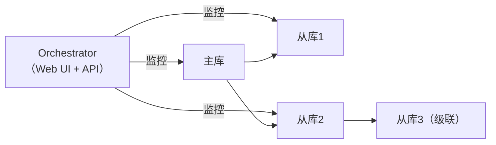
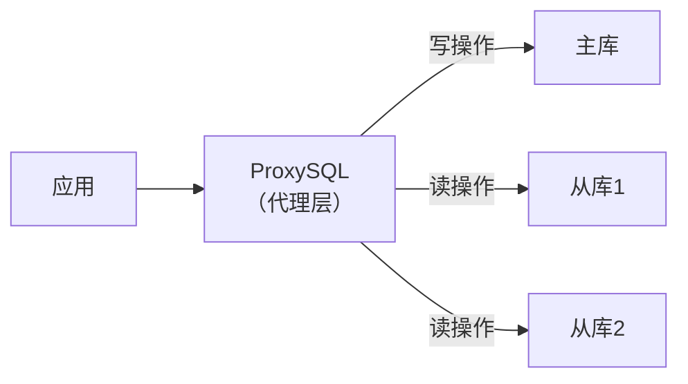
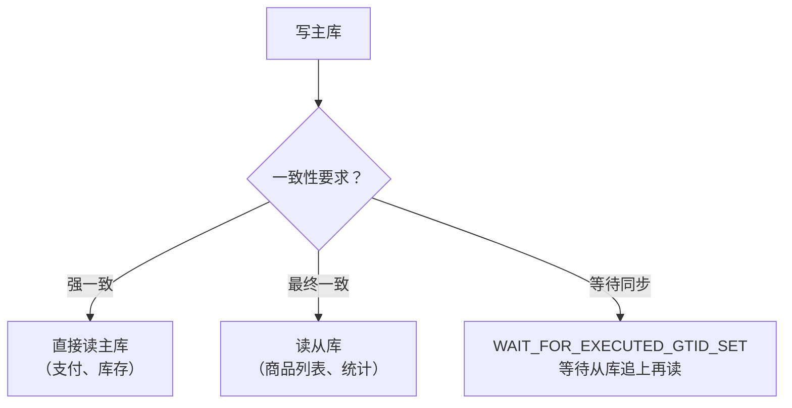

# 高可用架构方案

> **核心问题**：MySQL 如何实现高可用？主库宕机后如何自动切换？读写分离如何实现？

---

## 它解决了什么问题？

单点 MySQL 存在单点故障风险，高可用架构解决：

- **故障自动切换**：主库宕机后，自动提升从库为新主库，业务无感知
- **读写分离**：读请求分发到从库，降低主库压力
- **数据冗余**：多副本保证数据不丢失

---

## 高可用方案对比

| 方案 | 切换时间 | 数据一致性 | 复杂度 | 适用场景 |
|------|---------|-----------|--------|---------|
| **主从 + MHA** | 30s~2min | 可能丢少量数据 | 中 | 中小规模，成本敏感 |
| **主从 + Orchestrator** | 10s~30s | 可能丢少量数据 | 中 | 大规模，自动化运维 |
| **MGR（组复制）** | 5s~10s | 强一致 | 高 | 对一致性要求高 |
| **云数据库 RDS** | 秒级 | 强一致 | 低 | 云上业务，省运维 |

---

## 主从复制 + MHA

MHA（Master High Availability）是最经典的 MySQL 高可用方案。

### 架构



### 故障切换流程



**MHA 的局限**：
- 依赖 SSH 互信，运维复杂
- 切换时间较长（30s~2min）
- 不支持多主架构

---

## Orchestrator：自动化故障切换

Orchestrator 是 GitHub 开源的 MySQL 拓扑管理工具，支持自动发现、可视化、自动故障切换。



**核心特性**：
- 自动发现复制拓扑
- Web UI 可视化拓扑结构
- 支持复杂拓扑（级联复制、多从库）
- 与 Consul/ZooKeeper 集成实现分布式协调
- 支持 GTID 和传统复制

---

## MGR：MySQL Group Replication

MGR 是 MySQL 官方的高可用方案，基于 Paxos 协议实现强一致性。

### 工作原理

```mermaid
flowchart LR
    subgraph MGR 集群（单主模式）
        M["主节点\n（读写）"]
        S1["从节点1\n（只读）"]
        S2["从节点2\n（只读）"]
    end

    T["事务提交"] -->|1. 广播| M
    M -->|2. Paxos 协议| S1
    M -->|2. Paxos 协议| S2
    S1 -->|3. 多数派确认| M
    S2 -->|3. 多数派确认| M
    M -->|4. 提交| T
```

**两种模式**：
- **单主模式**：只有一个主节点可写，从节点只读，主节点故障自动选举新主
- **多主模式**：所有节点都可写，需要处理写冲突，适合特殊场景

**MGR 的要求**：
- 至少 3 个节点（保证多数派）
- 网络延迟要低（Paxos 协议对网络敏感）
- 不支持外键级联操作（可能导致冲突）

---

## 读写分离

### 方案一：应用层实现

```java
// 使用 AbstractRoutingDataSource（Spring）
@Configuration
public class DataSourceConfig {
    @Bean
    public DataSource routingDataSource() {
        Map<Object, Object> dataSources = new HashMap<>();
        dataSources.put("master", masterDataSource());
        dataSources.put("slave", slaveDataSource());

        RoutingDataSource routing = new RoutingDataSource();
        routing.setTargetDataSources(dataSources);
        routing.setDefaultTargetDataSource(masterDataSource());
        return routing;
    }
}

// 注解标记读操作走从库
@ReadOnly  // 自定义注解，AOP 切换数据源
public List<Order> queryOrders() { ... }
```

**优点**：灵活，可精细控制  
**缺点**：业务代码侵入，需要处理主从延迟

### 方案二：ProxySQL（推荐）

ProxySQL 是一个高性能 MySQL 代理，支持读写分离、连接池、查询路由。



```sql
-- ProxySQL 配置读写分离规则
INSERT INTO mysql_query_rules (rule_id, active, match_pattern, destination_hostgroup)
VALUES
    (1, 1, '^SELECT.*FOR UPDATE', 0),  -- SELECT FOR UPDATE 走主库（hostgroup 0）
    (2, 1, '^SELECT', 1);              -- 普通 SELECT 走从库（hostgroup 1）

LOAD MYSQL QUERY RULES TO RUNTIME;
SAVE MYSQL QUERY RULES TO DISK;
```

**ProxySQL 核心功能**：
- 自动读写分离（基于 SQL 规则）
- 连接池（减少连接开销）
- 查询缓存
- 慢查询监控
- 主从延迟检测（延迟过大时自动将从库摘除）

---

## 主从延迟下的一致性读

读写分离后，写主库后立即读从库可能读到旧数据。

### 解决方案



```sql
-- 方案：写入后获取 GTID，读从库时等待该 GTID 被执行
-- 主库写入后
SELECT @@GLOBAL.gtid_executed;  -- 获取当前 GTID

-- 从库读取前等待
SELECT WAIT_FOR_EXECUTED_GTID_SET('3E11FA47...:1-100', 5);
-- 返回 0 表示成功，返回 1 表示超时（5秒）
```

---

## 连接池配置

```
# 连接池关键参数
最大连接数 = (CPU核数 * 2) + 磁盘数
# 例如：8核 + 1块磁盘 = 17个连接

# 常见连接池配置（HikariCP）
maximumPoolSize: 20       # 最大连接数
minimumIdle: 5            # 最小空闲连接
connectionTimeout: 30000  # 获取连接超时（30s）
idleTimeout: 600000       # 空闲连接超时（10min）
maxLifetime: 1800000      # 连接最大存活时间（30min）
```

> **为什么连接数不是越多越好**：每个连接都消耗内存（约 1MB），过多连接导致上下文切换开销增大，反而降低吞吐量。

---

## 常见问题

**Q：MHA 和 MGR 如何选择？**

> 中小规模、成本敏感选 MHA，运维简单，社区成熟；对数据一致性要求高、能接受运维复杂度选 MGR，强一致性，官方支持。云上业务直接用 RDS，省去运维成本。

**Q：读写分离后如何处理主从延迟导致的读旧数据问题？**

> ① 强一致性场景（支付、库存）直接读主库；② 可接受延迟的场景读从库；③ 写后立即读的场景，用 GTID 等待从库同步完成；④ 业务层加缓存，减少对数据库的实时读依赖。

**Q：ProxySQL 和应用层读写分离如何选择？**

> ProxySQL 对业务代码无侵入，支持动态配置，适合大多数场景；应用层读写分离更灵活，可以精细控制哪些查询走主库，适合有特殊需求的场景。两者也可以结合使用。
