# 高可用架构方案

!!! info "**高可用架构方案 一句话口诀**"
    **单点不可怕，可怕的是没切换方案**——高可用 = 监控 + 自动故障转移 + 数据冗余。

    **MHA / Orchestrator / MGR / RDS 四选一**：按运维成本、一致性、切换时间三维度选型。

    **读写分离必处理主从延迟**——强一致读走主库，写后读用 GTID 等待。

    **GTID 是跨主从一致性读的通用抓手**——`WAIT_FOR_EXECUTED_GTID_SET` 比 `Seconds_Behind_Master` 可靠。

    **连接池不是越大越好**——`(核数 × 2) + 磁盘数` 是经验公式，过多连接只会拖垮主库。

> 📖 **边界声明**：本文聚焦 "MySQL 架构层的高可用选型与读写分离机制"，以下主题请见对应专题：
>
> - Binlog / GTID 的底层格式、Event 类型、并行复制模型 → [Binlog与主从复制](@mysql-Binlog与主从复制)
> - 主从延迟飙升的**现场排查 checklist** → [实战问题与避坑指南 §坑 15~17](@mysql-实战问题与避坑指南)
> - 单机事务隔离级别、MVCC 原理 → [事务与并发控制](@mysql-事务与并发控制)

---

## 1. 类比：高可用像飞机的"发动机冗余"

民航客机必配**双发动机 + 自动切换逻辑**——单发动机坏了另一台能顶住，这就是"高可用"三要素的生活投影：

| 飞机场景 | MySQL 高可用对应 | 核心作用 |
| :-- | :-- | :-- |
| **仪表盘告警发动机异常** | 监控（心跳 / 健康检查 / Agent） | 先发现才能谈切换 |
| **副机长自动接管** | 故障转移（Failover：MHA/Orchestrator 切主） | 主挂了要在秒级选出新主 |
| **两台发动机都有完整燃油** | 数据冗余（主从复制 / MGR 多副本） | 切换过去还能跑 |
| **副机长要有飞行记录才能接管** | 候选主库追平 Binlog / 选 GTID 最全者 | 数据一致性底线 |
| **塔台雷达告诉地面哪架飞机是正班** | VIP 漂移 / 中间件路由（ProxySQL / MaxScale） | 业务不用感知切换 |
| **"两台发动机同时坏"才算彻底故障** | 半同步 + 跨机房多副本 | 降低 RPO（数据丢失窗口） |
| **双人驾驶舱但听一人指挥** | 主从异步复制（1主多从） | 可用性高但有复制延迟 |
| **并列双机长投票决策** | MGR / Galera（多主强一致） | 一致性高但吞吐量受限 |

**一句话**：高可用的本质 = **"多一份数据副本 + 发生故障时按既定规则换一个副本服务"**——三大难点永远是「**怎么监控** / **切给谁** / **业务怎么无感**」。本文每一节都是在拆解 4 种主流架构对这三问的不同答法。

---

## 2. 它解决了什么问题？

单点 MySQL 存在单点故障风险，高可用架构解决：

- **故障自动切换**：主库宕机后，自动提升从库为新主库，业务无感知
- **读写分离**：读请求分发到从库，降低主库压力
- **数据冗余**：多副本保证数据不丢失

---

## 3. 高可用方案对比

| 方案 | 切换时间 | 数据一致性 | 复杂度 | 适用场景 |
| :--- | :--- | :--- | :--- | :--- |
| **主从 + MHA** | 30s~2min | 可能丢少量数据 | 中 | 中小规模，成本敏感 |
| **主从 + Orchestrator** | 10s~30s | 可能丢少量数据 | 中 | 大规模，自动化运维 |
| **MGR（组复制）** | 5s~10s | 强一致 | 高 | 对一致性要求高 |
| **云数据库 RDS** | 秒级 | 强一致 | 低 | 云上业务，省运维 |

!!! note "📖 术语家族：`MySQL 高可用方案`"
    **字面义**：High Availability = 高可用，指系统在故障时仍能对外提供服务的能力。
    **在 MySQL 生态中的含义**：通过冗余节点 + 故障自动切换 + 数据一致性协议实现 "主库宕机 → 秒级到分钟级恢复" 的能力，不同方案在 **切换时间 / 一致性 / 运维复杂度** 三维度间权衡。
    **同家族成员**：

    | 成员 | 角色定位 | 技术本质 |
    | :-- | :-- | :-- |
    | `MHA`（Master High Availability） | 主从架构的**故障切换管理器** | Perl 脚本 + SSH 互信，基于 Binlog 补全数据 |
    | `Orchestrator` | 复制拓扑的**可视化管理平台** | Go 语言，Web UI + REST API，与 Consul/ZK 集成 |
    | `MGR`（Group Replication） | MySQL 官方的**多副本一致性集群** | 基于 Paxos 变种协议，原生嵌入 `mysqld` |
    | `ProxySQL` | **SQL 层代理**，负责读写分离与连接池 | C++ 高性能代理，基于 SQL 规则路由 |
    | `VIP`（Virtual IP） | **网络层切换抓手**，应用无感知切换 | Keepalived / 云厂商 SLB 实现漂移 |
    | `RDS` / `PolarDB` | **云厂商托管方案**，高可用能力内置 | 底层多用 Paxos/Raft，用户侧免运维 |
    | `Consul` / `ZooKeeper` | **分布式协调服务**，给 Orchestrator 提供一致性仲裁 | Raft / ZAB 协议 |

    **命名规律**：`*Manager` / `Orchestrator` = 监控切换器；`*Replication` = 数据复制协议实现；`*Proxy` = SQL 代理层；`RDS/PolarDB` = 云托管形态。**按"监控 + 协议 + 代理 + 托管"四层即可归类任何高可用产品**。

---

## 4. 主从复制 + MHA

MHA（Master High Availability）是最经典的 MySQL 高可用方案。

### 架构

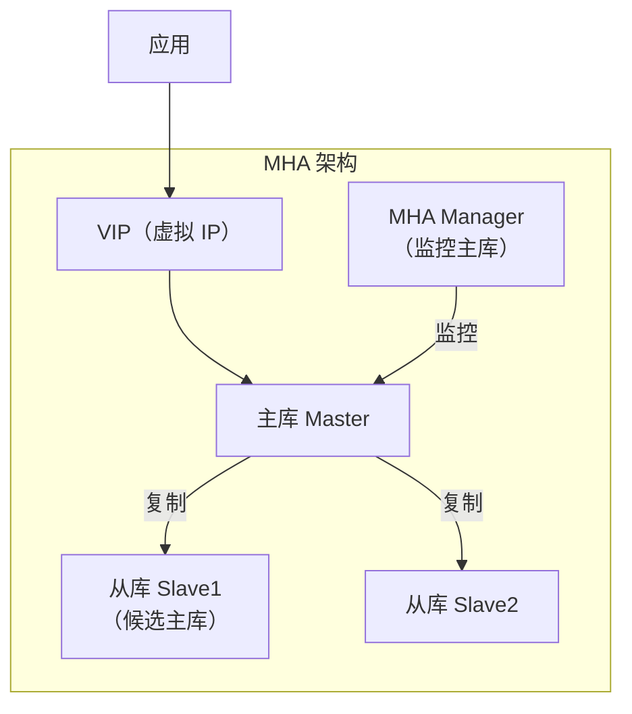

### 故障切换流程

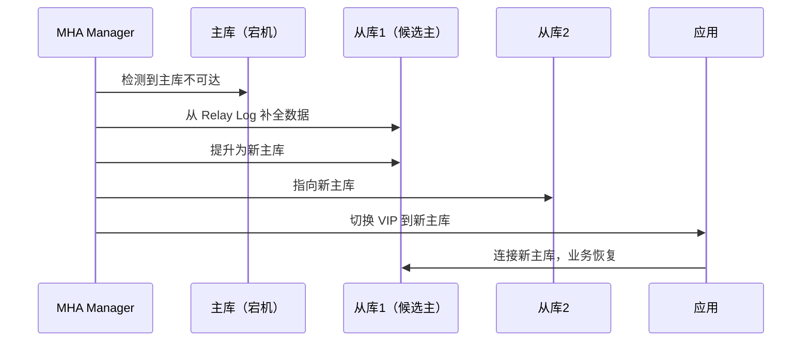

**MHA 的局限**：

- 依赖 SSH 互信，运维复杂
- 切换时间较长（30s~2min）
- 不支持多主架构

---

## 5. 半同步复制：`AFTER_SYNC` vs `AFTER_COMMIT`

MySQL 默认**异步复制**——主库提交即返回客户端，Binlog 是否到达从库完全看缘分。一旦主库宕机、从库没收到最后几笔 Binlog，就会**直接丢数据**。**半同步复制**（`rpl_semi_sync`）是弥补该缺口的内置机制，但其**何时等待从库 ACK**有两种模式，语义差异直接决定数据丢失风险。

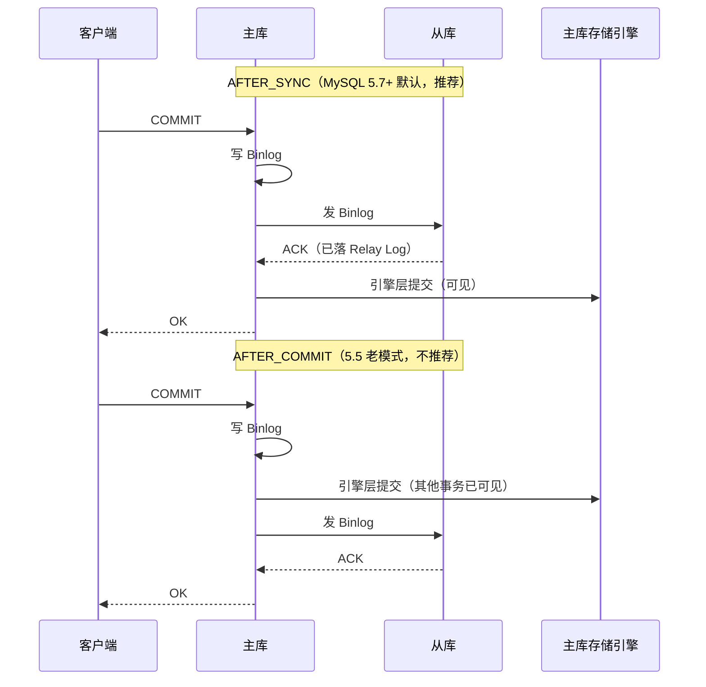

| 对比项 | `AFTER_SYNC`（无损半同步） | `AFTER_COMMIT`（有损半同步） |
| :-- | :-- | :-- |
| **ACK 等待时机** | 引擎层提交**前**等 | 引擎层提交**后**等 |
| **主库崩溃后果** | 未 ACK 事务对其他会话**不可见**，切换后数据一致 | 未 ACK 事务已可见，但从库没收到 → **幻读 / 数据丢失** |
| **性能** | 略慢（多一次网络往返串行在提交路径上） | 略快（ACK 与提交并行） |
| **默认值** | MySQL 5.7+ `rpl_semi_sync_master_wait_point = AFTER_SYNC` | MySQL 5.5 的历史默认 |
| **生产推荐** | ✅ **必选** | ❌ 弃用 |

**超时降级机制**：

```sql
-- 从库 ACK 超时（默认 10 秒）后，主库自动降级为异步复制继续对外服务
-- 这是半同步的底线保护：避免从库全挂导致主库不可写
SET GLOBAL rpl_semi_sync_master_timeout = 10000;  -- 单位 ms

-- ⚠️ 降级期间写入的事务在主库宕机时仍可能丢失
-- 金融场景可设置 rpl_semi_sync_master_wait_no_slave=ON，从库恢复才继续写
```

!!! warning "半同步不是强一致"
    半同步只保证 Binlog **到达从库 Relay Log**，不保证从库 **SQL 线程回放完成**。切换到从库后，SQL 线程还有回放积压时，读到的仍是旧数据。**要真正强一致，选 MGR**。

---

## 6. Orchestrator：自动化故障切换

Orchestrator 是 GitHub 开源的 MySQL 拓扑管理工具，支持自动发现、可视化、自动故障切换。

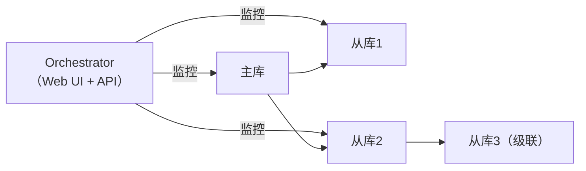

**核心特性**：

- 自动发现复制拓扑
- Web UI 可视化拓扑结构
- 支持复杂拓扑（级联复制、多从库）
- 与 Consul/ZooKeeper 集成实现分布式协调
- 支持 GTID 和传统复制

### 选主决策流程（Orchestrator 内部）

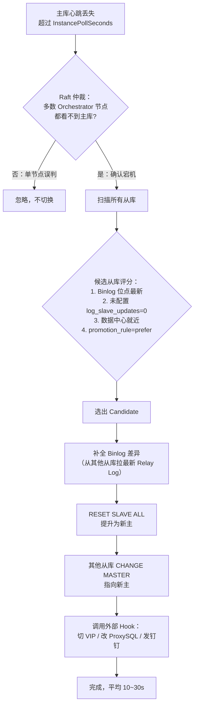

**防误切的三道门**：

1. **Raft 仲裁**：Orchestrator 集群自身用 Raft 共识，需多数节点确认主库宕机才触发切换，避免单点网络抖动误判
2. **反熵检查**：切换前要求候选从库与其他从库 Binlog 位点差异**不超过配置阈值**，否则拒绝切换
3. **冷却期**（`RecoveryPeriodBlockSeconds`）：一次切换后进入冷却窗口，禁止连续切换造成雪崩

---

## 7. MGR：MySQL Group Replication

MGR 是 MySQL 官方的高可用方案，基于 Paxos 协议实现强一致性。

### 工作原理

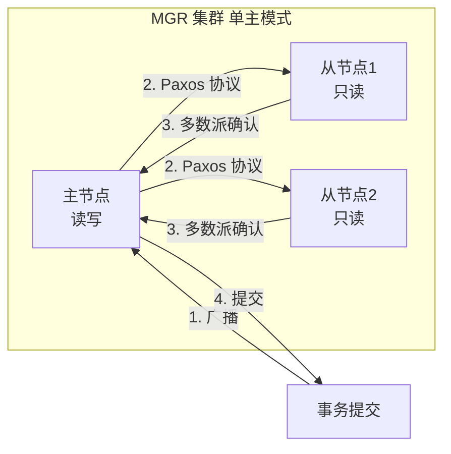

**两种模式**：

- **单主模式**：只有一个主节点可写，从节点只读，主节点故障自动选举新主
- **多主模式**：所有节点都可写，需要处理写冲突，适合特殊场景

**MGR 的要求**：

- 至少 3 个节点（保证多数派）
- 网络延迟要低（Paxos 协议对网络敏感）
- 不支持外键级联操作（可能导致冲突）

### Paxos 变种（XCom）协议细节

MGR 底层不是教科书 Paxos，而是 MySQL 自研的 **XCom**（eXtended Communication），属于 **Multi-Paxos** 变种。一次事务提交的共识过程可拆为 5 步：

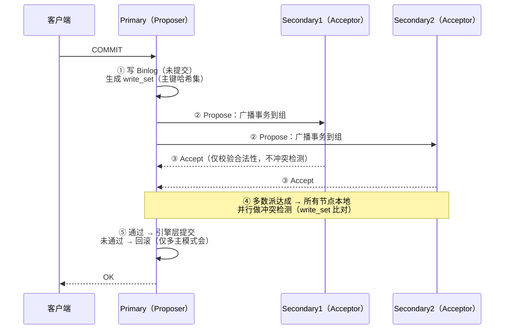

**关键设计**：

| 设计点 | 说明 |
| :-- | :-- |
| **Write Set 冲突检测** | 多主模式下，MGR 收集事务修改的主键哈希集合，提交时比对——**谁先到达多数派谁赢**，后到的同主键事务回滚（"乐观冲突"） |
| **证书数据库**（Certification DB） | 每个节点保存近期所有事务的 write_set 与 GTID，用于判断新事务是否与"并发已提交事务"冲突 |
| **Binlog 在 Paxos 之后写** | 事务先达成共识再落 Binlog，因此**所有节点的 Binlog 顺序全局一致**（这是 MGR 与主从最本质的区别） |
| **流控**（Flow Control） | 某节点 `applier` 或 `certifier` 队列积压时，主动降速 Proposer，避免慢节点脱群 |
| **仅支持 InnoDB + 主键** | 无主键表无法生成 write_set，直接拒绝写入 |

!!! tip "MGR vs Galera Cluster"
    两者都是 "Paxos 变种 + write_set 冲突检测" 思路：Galera 用 `wsrep` 协议，MySQL 官方未收编（走 MariaDB / Percona XtraDB Cluster 路线）；MGR 是 Oracle 官方嫡系，8.0 后默认可用。**选型原则**：MySQL 8.4 LTS 用 MGR，Percona 生态可评估 PXC（Galera）。

---

## 8. 脑裂（Split-Brain）场景推演

**脑裂 = 网络分区导致集群分裂成两个"自以为是主"的子集**，是高可用系统最危险的故障形态——两个"主"各自接受写入，恢复后数据无法合并。

### 场景①：MHA / 主从架构下的脑裂

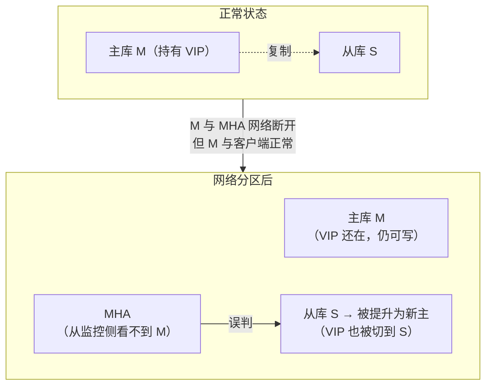

| 阶段 | 两侧写入情况 | 后果 |
| :-- | :-- | :-- |
| 分区期间 | M 侧客户端继续写老主；MHA 侧应用被切到新主 S，也在写 | **两份分叉数据**，无法合并 |
| 网络恢复 | 老主 M 发现自己不是主了，拒绝同步；人工介入 | 业务需要选择"保 M 的数据还是保 S 的数据"，另一侧数据**直接丢弃** |

**预防手段**（按有效性排序）：

1. **Fencing（围栏）**：切换前先 SSH 登录老主执行 `shutdown` 或 `iptables DROP 3306`，确保老主彻底不可写——MHA 的 `master_ip_failover_script` 就要写这段
2. **VIP + 硬件仲裁**：VIP 绑定由独立 Keepalived 集群管理，仅多数派可持有 VIP
3. **Quorum 检查**：MHA / Orchestrator 切换前要求"能连上多数从库"，避免单点误判
4. **Raft/Consul 仲裁**：Orchestrator 集群本身走 Raft，单个 Orchestrator 看不到主库不触发切换

### 场景②：MGR 的脑裂免疫性

MGR 天生**通过 Paxos 多数派规避脑裂**——任何分区只有"含多数派的那一侧"能继续写：

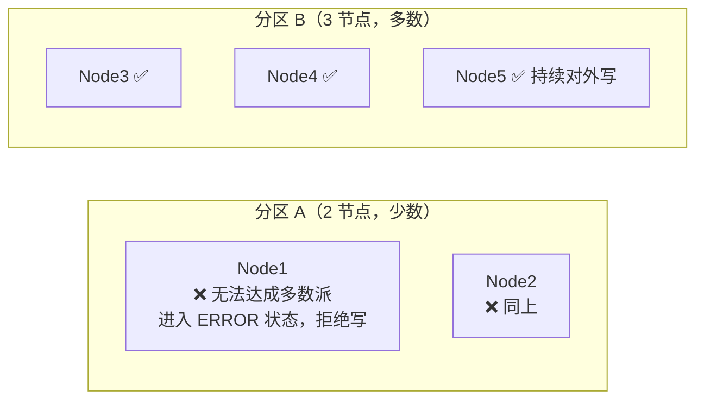

!!! warning "MGR 的偶数节点陷阱"
    部署 **偶数节点**（如 2、4、6）时，一旦 1:1 对半分区，**双方都无法达成多数派，全集群变只读**。这就是"MGR 至少 3 节点、推荐 5 节点"的根因——保证**任意一次单机房故障仍有多数派存活**。

### 场景③：读写分离下的脑裂放大

即使数据库层没脑裂，**ProxySQL / VIP 侧的配置漂移**也会造成"应用层脑裂"——一半应用连老主、一半连新主。**根治手段**：切换时同步刷新 ProxySQL `mysql_servers` + VIP + DNS，并短暂阻塞写入（几秒），让所有应用感知到切换。

---

## 9. 读写分离

### 方案一：应用层实现

```java
// 使用 AbstractRoutingDataSource（Spring）
@Configuration
public class DataSourceConfig {
    @Bean
    public DataSource routingDataSource() {
        Map<Object, Object> dataSources = new HashMap<>();
        dataSources.put("master", masterDataSource());
        dataSources.put("slave", slaveDataSource());

        RoutingDataSource routing = new RoutingDataSource();
        routing.setTargetDataSources(dataSources);
        routing.setDefaultTargetDataSource(masterDataSource());
        return routing;
    }
}

// 注解标记读操作走从库
@ReadOnly  // 自定义注解，AOP 切换数据源
public List<Order> queryOrders() { ... }
```

**优点**：灵活，可精细控制  
**缺点**：业务代码侵入，需要处理主从延迟

### 方案二：ProxySQL（推荐）

ProxySQL 是一个高性能 MySQL 代理，支持读写分离、连接池、查询路由。

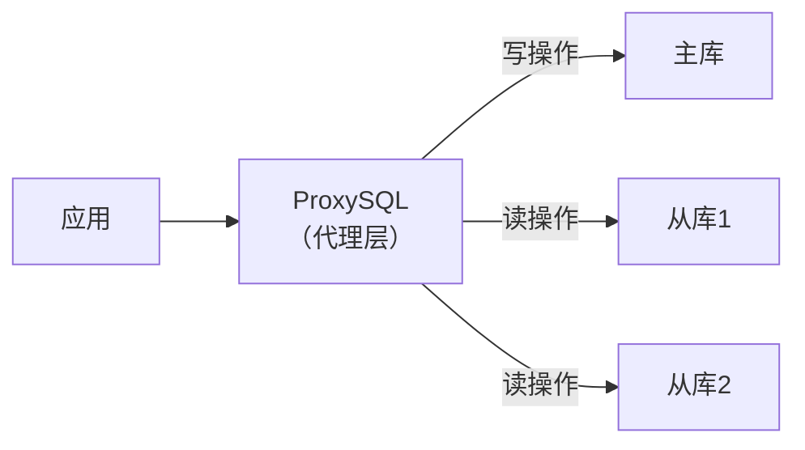

```sql
-- ProxySQL 配置读写分离规则
INSERT INTO mysql_query_rules (rule_id, active, match_pattern, destination_hostgroup)
VALUES
    (1, 1, '^SELECT.*FOR UPDATE', 0),  -- SELECT FOR UPDATE 走主库（hostgroup 0）
    (2, 1, '^SELECT', 1);              -- 普通 SELECT 走从库（hostgroup 1）

LOAD MYSQL QUERY RULES TO RUNTIME;
SAVE MYSQL QUERY RULES TO DISK;
```

**ProxySQL 核心功能**：

- 自动读写分离（基于 SQL 规则）
- 连接池（减少连接开销）
- 查询缓存
- 慢查询监控
- 主从延迟检测（延迟过大时自动将从库摘除）

---

## 10. 主从延迟下的一致性读

读写分离后，写主库后立即读从库可能读到旧数据。

### 解决方案

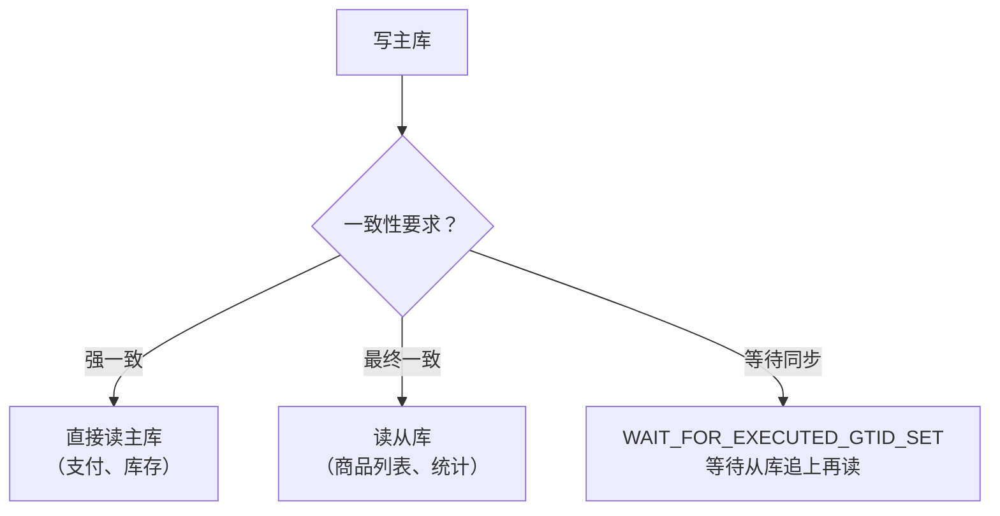

```sql
-- 方案：写入后获取 GTID，读从库时等待该 GTID 被执行
-- 主库写入后
SELECT @@GLOBAL.gtid_executed;  -- 获取当前 GTID

-- 从库读取前等待
SELECT WAIT_FOR_EXECUTED_GTID_SET('3E11FA47...:1-100', 5);
-- 返回 0 表示成功，返回 1 表示超时（5秒）
```

> 📖 GTID 的底层格式（`UUID:transaction_id`）、`gtid_executed` / `gtid_purged` 的差异与 Binlog 的写入时机详见 [Binlog与主从复制 §GTID 模式](@mysql-Binlog与主从复制)，本文不再展开。
>
> 📖 主从延迟常见的三种线上现象（从库卡在 SBM=0 却查不到最新数据 / SBM 持续增长 / 大事务阻塞并行复制）与**具体排查 checklist**详见 [实战问题与避坑指南 §坑 15~17](@mysql-实战问题与避坑指南)，本文仅讨论机制层的一致性读方案。

---

## 11. 连接池配置

```txt
# 连接池关键参数
最大连接数 = (CPU核数 * 2) + 磁盘数
# 例如：8核 + 1块磁盘 = 17个连接

# 常见连接池配置（HikariCP）
maximumPoolSize: 20       # 最大连接数
minimumIdle: 5            # 最小空闲连接
connectionTimeout: 30000  # 获取连接超时（30s）
idleTimeout: 600000       # 空闲连接超时（10min）
maxLifetime: 1800000      # 连接最大存活时间（30min）
```

> **为什么连接数不是越多越好**：每个连接都消耗内存（约 1MB），过多连接导致上下文切换开销增大，反而降低吞吐量。

---

## 12. 常见问题

> 📖 **排查题已外链**："主从延迟飙升怎么定位" / "从库读到旧数据根因分析" / "MGR 脑裂排查" 等**排查类问题**请见 [实战问题与避坑指南 §坑 15~17](@mysql-实战问题与避坑指南)；本文专注**选型题**。

**Q：MHA 和 MGR 如何选择？**

> 中小规模、成本敏感选 MHA，运维简单，社区成熟；对数据一致性要求高、能接受运维复杂度选 MGR，强一致性，官方支持。云上业务直接用 RDS，省去运维成本。

**Q：读写分离后如何处理主从延迟导致的读旧数据问题？**

> ① 强一致性场景（支付、库存）直接读主库；② 可接受延迟的场景读从库；③ 写后立即读的场景，用 GTID 等待从库同步完成；④ 业务层加缓存，减少对数据库的实时读依赖。

**Q：ProxySQL 和应用层读写分离如何选择？**

> ProxySQL 对业务代码无侵入，支持动态配置，适合大多数场景；应用层读写分离更灵活，可以精细控制哪些查询走主库，适合有特殊需求的场景。两者也可以结合使用。

**Q：`AFTER_SYNC` 半同步、MGR、RDS 三种强一致方案如何选型？**

> 先看集群规模与一致性上限：① **单主 + 半同步 `AFTER_SYNC`** 适合"主从架构已经跑着、只想加一层数据不丢"的老系统，成本最低，但 ACK 超时会自动降级为异步，**不是严格强一致**；② **MGR** 适合新系统或对一致性/自动切换要求高的场景，Paxos 多数派天然免脑裂，但至少 3 节点、对网络抖动敏感；③ **RDS/PolarDB** 是云上首选，一致性/切换/备份全部托管，代价是被厂商锁定。**金融核心走 MGR（至少 5 节点跨机房）+ 半同步做兜底**。

**Q：为什么偶数个 MGR 节点是反模式？**

> MGR 依赖 Paxos 多数派达成共识，**3 节点容忍 1 个故障、5 节点容忍 2 个故障**；但 2/4/6 偶数节点在"对半分区"场景下，**两侧都无法形成多数派，整个集群退化为只读**。同样的成本（比如 4 节点）不如布 3 节点（容错能力相同、资源更省）或 5 节点（容错能力翻倍）。
