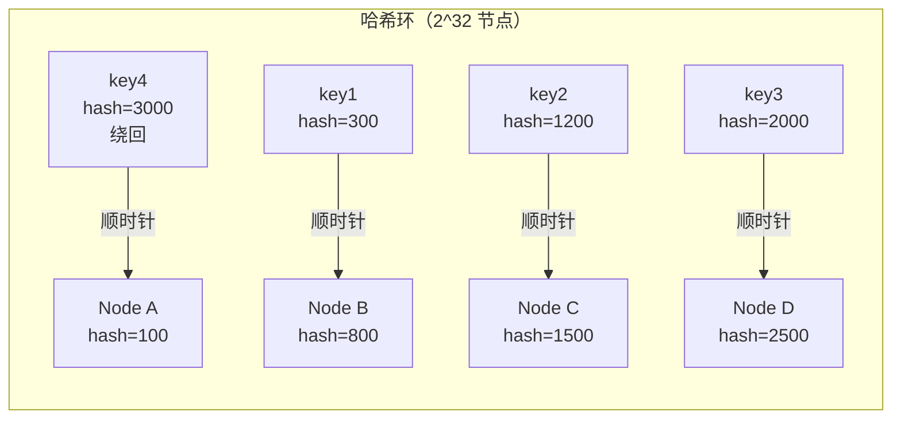
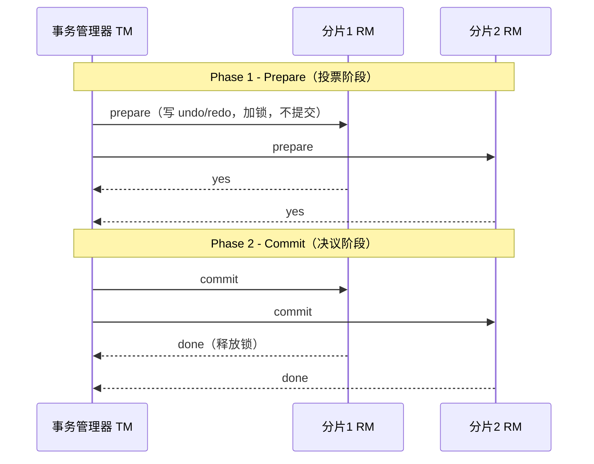
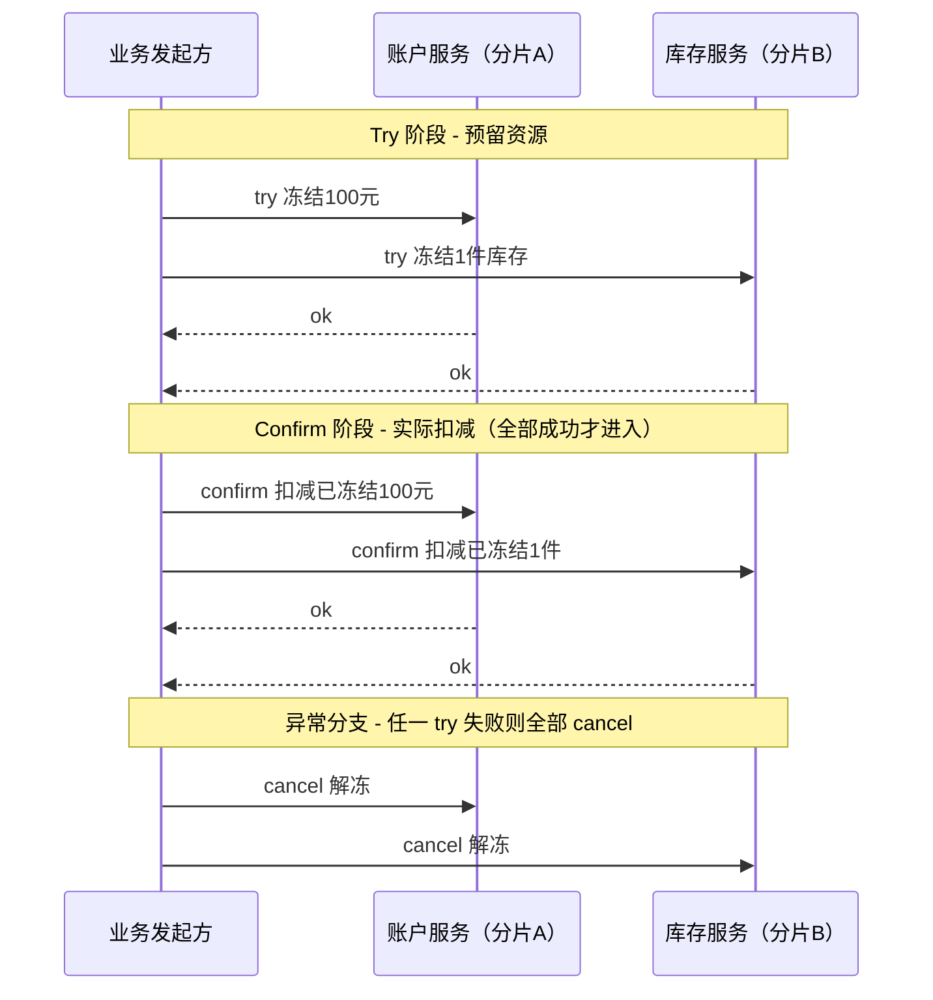
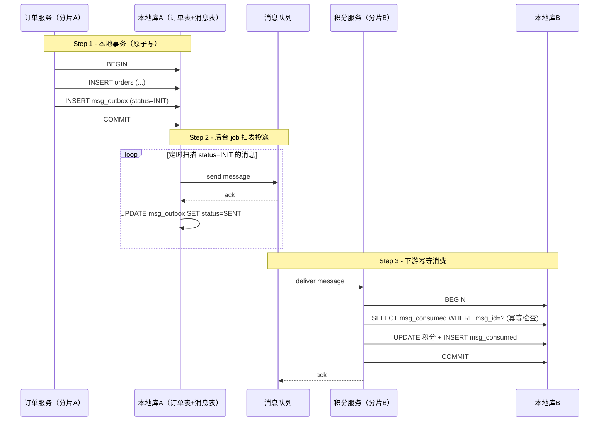
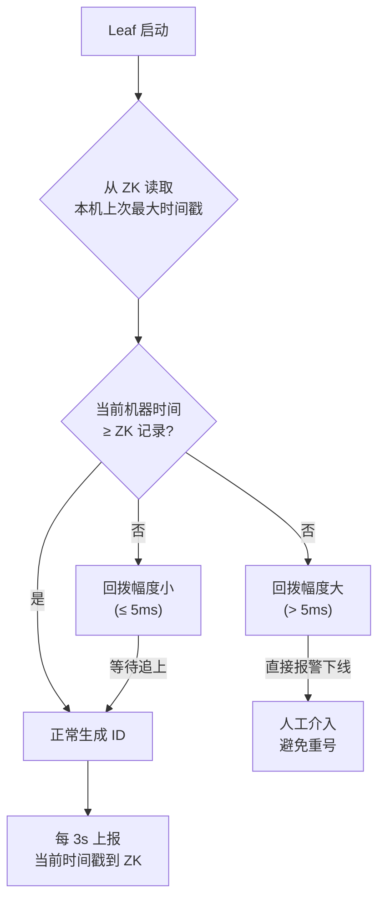
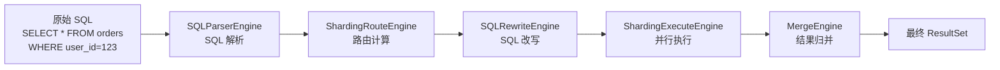

# 分库、分表与分片：分布式数据库架构详解

!!! info "**分库分表与分布式架构 一句话口诀**"
    **黄金法则：没碰到真正的性能瓶颈就不要分**——先索引、再读写分离、再缓存，最后才是分库分表。

    **分片键 > 分库数量**——选错分片键的代价比分库数不够大得多。

    **跨分片事务能避则避**——业务设计优先让同一事务落在同一分片。

    **中间件 / 代理 / 云原生三选一**：Sharding-JDBC（客户端分片） / MyCat（代理分片） / Vitess、PolarDB-X（云原生）。

    **扩容要事前设计**——一致性哈希 + 预分片预留路由空间，不要等到单库写爆才想扩容。

> 📖 **边界声明**：本文聚焦 "分库分表的架构设计与技术选型"，以下主题请见对应专题：
>
> - 单库事务的隔离级别、MVCC、锁机制 → [事务与并发控制](@mysql-事务与并发控制)
> - 主从复制原理、Binlog、GTID、CDC 数据同步 → [Binlog与主从复制](@mysql-Binlog与主从复制)
> - 高可用架构与读写分离实现 → [高可用架构方案](@mysql-高可用架构方案)
> - 全文检索 / 跨分片聚合查询 → Elasticsearch 专题

---

## 1. 类比：分库分表像连锁超市扩店

想象你开了一家超市，生意越来越好、一家店装不下那么多商品与顾客——你的扩张之路其实就是"单库 → 分表 → 分库 → 分片"的真实投影：

| 超市扩张阶段 | 数据库阶段 | 核心动作 |
| :-- | :-- | :-- |
| **一家店把货架分区**（食品区 / 日用区 / 生鲜区） | **分表**（Partitioning，同库内拆多表） | 表大了拆子表，单库能扛就不分库 |
| **一家店分楼上楼下仓库**（A-M 顾客去1楼，N-Z 去2楼） | **垂直分表**（按列拆：热列 vs 冷列） | 冷热分离，加速常用查询 |
| **把不同业务分到不同独立门店**（药房 / 生鲜店 / 百货店） | **垂直分库**（按业务拆库：订单库 / 用户库 / 商品库） | 业务隔离，压力分散 |
| **开连锁分店，每家店卖同样的货但服务一片区域** | **水平分库 + 分片**（Sharding：按用户ID哈希分片） | 扛住海量数据与并发 |
| **顾客需要"我在哪家店"的导航**（分店路由） | 分片键 + 中间件 / 代理 | 路由逻辑决定分片质量 |
| **跨店搞"全市大促"算总销量** | 跨分片聚合 / 分布式事务 | 最难做、最慢、最贵 |
| **新开一家店时把老店一半顾客迁过来** | 分片扩容 / 数据迁移 | 一致性哈希可减少搬迁量 |

**一句话**：分库分表的本质是**"让数据服从业务的物理分布"**——分得好，单机瓶颈变多机并行；分错了，每一条跨分片查询都是血泪。本文每一节都在回答一个问题——**"什么时候分、怎么分、分完之后怎么解决后遗症"**。

---

## 2. 核心概念精确定义

### 1. 分表（Table Partitioning）

**定义**：将一张大表拆分成多个结构相同的小表，每个小表存储部分数据

**特点**：

- 在同一个数据库实例内操作
- 表结构完全相同
- 通过某种规则分散数据
- 目的是解决单表过大问题

**示例**：

```sql
-- 原用户表
CREATE TABLE users (
    id BIGINT PRIMARY KEY,
    name VARCHAR(50),
    email VARCHAR(100)
);

-- 分表后（按ID取模）
CREATE TABLE users_0 ( ... );  -- id % 4 = 0
CREATE TABLE users_1 ( ... );  -- id % 4 = 1
CREATE TABLE users_2 ( ... );  -- id % 4 = 2
CREATE TABLE users_3 ( ... );  -- id % 4 = 3
```

### 2. 分库（Database Sharding）

**定义**：将数据分布到不同的数据库实例中

**特点**：

- 涉及多个数据库实例
- 可以是同一数据库服务器的不同数据库，也可以是不同服务器
- 通常按业务模块划分
- 目的是解决单库性能瓶颈和资源限制

**示例**：

```txt
用户库 (user_db)
  ├── users
  ├── user_profiles
  └── user_addresses

订单库 (order_db)  
  ├── orders
  ├── order_items
  └── payments

商品库 (product_db)
  ├── products
  ├── categories
  └── inventory
```

### 3. 分片（Sharding）

**定义**：数据分布的抽象概念，指将数据拆分到不同存储单元的过程

**特点**：

- 是一个抽象的技术概念
- 分表和分库都是分片的具体实现方式
- 强调数据分布的策略和算法
- 核心是数据路由和定位

**关系总结**：

- **分片**是总体概念
- **分表**是分片在单库内的实现  
- **分库**是分片在多库间的实现
- 可以组合使用：先分库，再在库内分表

!!! note "📖 术语家族：`分片（Sharding）`"
    **字面义**：Shard = "碎片"，Sharding = "切碎片"，指将完整数据集拆分为若干独立存储单元的过程。
    **在数据库领域的含义**：依据某个**分片键（Sharding Key）**将数据按规则分散到不同存储单元（表 / 库 / 节点），索引、查询、事务的语义边界都收缩到单个分片内。
    **同家族成员**：

    | 成员 | 含义 | 与原类概念的关系 |
    | :-- | :-- | :-- |
    | `Sharding` | 分片（总体概念） | 抽象层，不绑定具体形态 |
    | `Horizontal Sharding` | 水平分片 | 按**行**拆分，分表 / 分库都是水平分片 |
    | `Vertical Sharding` | 垂直分片 | 按**列 / 业务模块**拆分，类似微服务拆分 |
    | `Partitioning` | 分区 | MySQL 原生语法（`PARTITION BY`），单表内部分片 |
    | `Sharding Key` | 分片键 | 决定数据归属哪个分片的**路由字段** |
    | `Hash Sharding` | 哈希分片 | 分布均匀，扩容难 |
    | `Range Sharding` | 范围分片 | 范围查询友好，易热点 |
    | `Consistent Hashing` | 一致性哈希 | 哈希分片的扩容冗余方案 |

    **命名规律**： 

    - `*Sharding` = 按某种维度切碎片的策略；  
    - `*Key` = 决定切片走向的路由字段；  
    - `*Partitioning` = 数据库内部的原生分片机制。  

    **"分片 = 策略 + 路由键 + 落地机制"三件套**，缺一不可。

---

## 3. 为什么要进行数据拆分？

### 单库单表的性能瓶颈

1. **数据量过大**：
      - 单表超过1000万行时，B+树索引深度增加
      - 查询性能显著下降，索引维护成本高
2. **并发瓶颈**：
      - 高并发下大量操作集中在单表
      - 锁竞争导致性能下降，连接数受限
3. **资源限制**：
      - 单机硬件资源有限（CPU、内存、磁盘IO）
      - 备份恢复时间过长，影响业务连续性
4. **业务扩展**：
      - 无法满足业务快速增长需求
      - 缺乏水平扩展能力

### 拆分的好处

✅ **性能提升**：单个表/库数据量减少，查询更快  
✅ **并发增强**：操作分散到多个表/库，减少锁竞争  
✅ **资源优化**：更好地利用多机资源  
✅ **维护方便**：可以分表/库进行备份优化  
✅ **扩展性强**：支持水平扩展，适应业务增长

### 拆分的代价

❌ **复杂度增加**：需要处理数据路由和分布式事务  
❌ **开发成本**：业务代码需要适配分片逻辑  
❌ **运维复杂**：需要管理多个数据库和表  
❌ **查询限制**：跨分片查询性能较差

---

## 4. 拆分时机与原则

### 什么时候需要考虑拆分？

**硬性指标（建议阈值）**：

- 单表数据量 > 1000万行
- 单表数据大小 > 50GB  
- 单库QPS > 5000
- 单库连接数 > 1000

**业务指标**：

- 业务增长迅速，预计很快达到阈值
- 有明确的业务分片维度（如按用户、地域、时间）
- 对可用性和扩展性要求高

### 拆分原则

1. **先优化，后拆分**：
      - 先尝试索引优化、查询优化
      - 再考虑读写分离、缓存
      - 最后才进行数据拆分
2. **最小化影响**：
      - 尽量保持业务代码无感知
      - 使用中间件隐藏拆分细节
3. **可扩展性**：
      - 设计要支持未来继续扩容
      - 避免一次性过度拆分
4. **数据均衡**：
      - 选择合适的分片键
      - 避免数据倾斜问题
5. **业务导向**：
      - 根据业务查询模式设计拆分方案
      - 优先保证核心业务的性能

---

## 5. 分片策略详解

### 1. 哈希分片（最常用）

```java
// 基于用户ID的哈希分片
int shardIndex = userId % shardCount;
String tableName = "orders_" + shardIndex;
```

**优点**：数据分布均匀，避免热点
**缺点**：扩容时需要数据迁移
**适用场景**：用户ID、订单ID等离散值

### 2. 范围分片

```java
// 基于创建时间的范围分片
if (createTime < "2024-01-01") {
    tableName = "orders_2023";
} else if (createTime < "2025-01-01") {
    tableName = "orders_2024";
} else {
    tableName = "orders_2025";
}
```

**优点**：易于按时间范围查询，便于数据归档
**缺点**：可能产生数据倾斜（新数据集中）
**适用场景**：时间序列数据，日志数据

### 3. 一致性哈希（重点）

**核心问题**：普通哈希分片 `hash(key) % N`，当 N 从 4 扩到 5 时，**几乎所有 key 的归属都会变**，搬迁量逼近 100%。

**解决思路**：把哈希空间（`0 ~ 2^32 - 1`）想象成一个环，节点和数据都落在环上，数据**顺时针找到的第一个节点**就是归属节点。扩容时只有一小段环的数据需要搬迁。



**虚拟节点（Virtual Node）机制**：

直接用物理节点上环会导致**数据倾斜**——3 个节点把环切成 3 段，段长不均匀。解决方案是每个物理节点复制出 N 个**虚拟节点**（通常 150~200 个）散布在环上，请求先落到虚拟节点，再映射回物理节点。

```java
// Redis Cluster 式伪代码（真实实现见 Ketama / ShardingSphere）
for (PhysicalNode node : physicalNodes) {
    for (int i = 0; i < VIRTUAL_COUNT; i++) {
        String virtualKey = node.getName() + "#VN" + i;
        long hash = MurmurHash3.hash(virtualKey);
        ring.put(hash, node);  // TreeMap 按 hash 值排序
    }
}

// 查询：顺时针找第一个 >= hash(key) 的虚拟节点
Node locate(String key) {
    long h = MurmurHash3.hash(key);
    Map.Entry<Long, Node> e = ring.ceilingEntry(h);
    return e != null ? e.getValue() : ring.firstEntry().getValue();  // 绕回
}
```

**扩容搬迁量计算**：

| 方案 | N→N+1 搬迁比例 | 原因 |
| :-- | :-- | :-- |
| 普通哈希 `% N` | **≈ (N/(N+1))** ≈ 80%+ | 绝大多数 key 的模运算结果都会变 |
| 一致性哈希（无虚拟节点） | **1/(N+1)** ≈ 20%（N=4 时） | 只有新节点那一段环的数据需要搬 |
| 一致性哈希 + 虚拟节点 | **1/(N+1)**，且**分布更均匀** | 虚拟节点打散后，新节点均匀从老节点"割肉" |

**适用场景**：Redis Cluster 的 16384 槽位本质是一致性哈希变种；Memcached 的 Ketama；Cassandra 的 Token Ring；ShardingSphere 的 `ConsistentHashingShardingAlgorithm`。

### 4. 地理位置分片

按用户所在地区进行分片，适合地域性强的业务。

### 5. 业务属性分片

按业务属性如商户ID、商品类目等进行分片。

---

## 6. 分库分表带来的挑战与解决方案

### 1. 分布式事务

**问题**：跨库事务如何保证一致性？单库事务靠 InnoDB 的 Redo + Undo + MVCC 就能做到 ACID，跨多个 MySQL 实例后，**网络不可靠 + 无统一协调者**使得"要么全部提交要么全部回滚"变成一个分布式系统难题。

> 📖 单库内的事务 ACID 实现（MVCC / Redo / Undo / 锁清单）详见 [事务与并发控制](@mysql-事务与并发控制)；本节仅讨论**跨分片事务的架构策略**，两者解决的是完全不同层的问题。

!!! note "📖 术语家族：`分布式事务协议`"
    **字面义**：分布式事务 = 跨越 ≥ 2 个独立资源管理器（RM，通常是数据库实例）的事务；**协议** = 协调这些 RM 达成"全部提交 / 全部回滚"一致决议的规则集合。
    **在分片架构中的角色**：按"**一致性强度 / 性能代价 / 业务侵入度**"三维度权衡，衍生出刚性（强一致、低吞吐）与柔性（最终一致、高吞吐）两大流派。刚性协议由 JTA/XA 等规范驱动，柔性协议由业务补偿或消息最终一致性驱动。
    **同家族成员**：

    | 成员 | 流派 | 一致性 | 性能 | 业务侵入 | 代表实现 |
    | :-- | :-- | :-- | :-- | :-- | :-- |
    | `2PC`（Two-Phase Commit） | 刚性 | 强一致 | 低（同步阻塞） | 无 | MySQL XA、Atomikos、Narayana |
    | `3PC`（Three-Phase Commit） | 刚性 | 强一致 | 更低（多一轮） | 无 | 理论方案，工业极少用 |
    | `XA` | 刚性规范 | 强一致 | 低 | 无 | JTA（`javax.transaction.xa.XAResource`） |
    | `TCC`（Try-Confirm-Cancel） | 柔性补偿 | 最终一致 | 中 | **高**（业务拆三段） | Seata TCC 模式、Hmily、ByteTCC |
    | `Saga` | 柔性补偿 | 最终一致 | 高 | 中（每步写补偿） | Seata Saga 模式、Eventuate Tram |
    | `本地消息表` | 柔性消息 | 最终一致 | 高 | 中（多一张消息表） | 自研 + MQ |
    | `事务消息`（Transactional Message） | 柔性消息 | 最终一致 | 高 | 低 | RocketMQ 半消息、Kafka 事务 |
    | `最大努力通知` | 柔性消息 | 最终一致 | 最高 | 低 | 对账补偿 |
    | `AT`（Automatic Transaction） | 柔性（Seata 特色） | 最终一致 | 较高 | 极低（SQL 解析自动生成反向 SQL） | Seata AT 模式 |

    **命名规律**：

    - `*PC` / `XA` = 刚性两阶段族（协调者 + RM，同步阻塞）；
    - `TCC` / `Saga` = 柔性补偿族（业务层拆分 + 反向操作）；
    - `*消息表` / `事务消息` = 柔性消息族（持久化 + 重试 + 幂等）；
    - `AT` = Seata 自动补偿族（框架代拆分）。

    **"协议 = 协调者 + 资源管理器 + 决议规则"三件套**，选型时先问"业务能否接受最终一致"——能接受就走柔性（性能数倍于刚性），不能接受就上 XA 或 Seata AT。

#### 1.1 刚性方案：2PC（两阶段提交）

**流程**：协调者（TM）与多个 RM 通过两轮 RPC 达成决议：



**MySQL 源码依据**：`storage/innobase/trx/trx0trx.cc::trx_prepare_low()` 实现 XA prepare，`handler/ha_innodb.cc::innobase_xa_prepare()` 是 SQL 层入口；JTA 通过 `XAResource.prepare()` / `XAResource.commit(xid, false)` 调用到 MySQL。

**致命缺陷**：

1. **协调者单点**：TM 在 Phase 2 崩溃，RM 处于"prepared 悬挂态"，锁无法释放（MySQL XA 事务挂住后必须 DBA 介入 `XA RECOVER` + `XA COMMIT/ROLLBACK` 手动清理）；
2. **同步阻塞**：Phase 1 到 Phase 2 之间所有 RM 持锁等待，分片越多阻塞窗口越长；
3. **数据不一致窗口**：TM 发送 commit 后若部分 RM 收到、部分未收到，没有自动补偿机制。

#### 1.2 柔性方案：TCC（Try-Confirm-Cancel）

**流程**：业务层把操作拆成 `try`（预留资源）+ `confirm`（实际提交）+ `cancel`（补偿回滚）三段：



**核心要素**：

- `Try`：**预留资源**（如冻结余额、预占库存），必须持久化预留状态；
- `Confirm`：**实际提交**（解冻后扣减），必须**幂等**（允许重试）；
- `Cancel`：**补偿回滚**（解除预留），必须**幂等**且能处理"空回滚"（`try` 未执行就收到 `cancel`）。

**Seata TCC 源码依据**：`io.seata.rm.tcc.TCCResourceManager` 管理 TCC 资源，`@TwoPhaseBusinessAction` 注解标记 `try` 方法并声明 `commitMethod` / `rollbackMethod`，`io.seata.rm.tcc.interceptor.TccActionInterceptor` 拦截调用并注册分支事务到 TC（Transaction Coordinator）。

**业务侵入代价**：每个 RPC 接口要拆成 3 个方法 + 持久化预留表 + 幂等表 + 空回滚/悬挂防护——**接入成本极高**，适合金融核心链路。

#### 1.3 柔性方案：本地消息表（最常用）

**核心思想**：把"业务操作 + 发消息"放进**同一个本地事务**，消息表和业务表在同一个 MySQL 实例，天然 ACID；消息由后台 job 扫描并投递到 MQ，下游消费者幂等处理。



**关键设计**：

1. **消息表 `msg_outbox`** 与业务表在**同一个数据库**——保证"业务写成功 ⇔ 消息写成功"的原子性；
2. **后台 job** 负责扫表 + 重试投递（至少一次语义）；
3. **下游幂等表 `msg_consumed`** 按 `msg_id` 去重——保证"消息重复投递不会重复消费"。

**vs 事务消息（RocketMQ 半消息）**：RocketMQ 把消息表"内置"到 MQ Broker 里，通过"半消息 + 回查"机制实现同样效果，业务代码少写一张表；代价是强绑定 RocketMQ，且回查接口必须实现得幂等。

**业务场景建议**：

- **强一致 + 低频**（金融结算、账务过账）→ XA 或 Seata AT；
- **最终一致 + 高频**（订单/库存/积分联动）→ 本地消息表 或 RocketMQ 事务消息；
- **业务可拆三段 + 实时性要求高**（支付冻结-扣款）→ TCC；
- **长流程状态机**（旅行预订：机票+酒店+租车）→ Saga。

### 2. 跨库查询

**问题**：如何实现跨分片的聚合查询？

**解决方案**：

- **业务层聚合**：查询多个分片，应用层合并结果
- **使用中间件**：如Sharding-JDBC自动路由和聚合
- **建立汇总表**：预聚合数据，支持统计查询
- **使用搜索引擎**：Elasticsearch处理复杂查询
- **联邦查询**：某些数据库支持跨库查询

### 3. 全局ID生成

**问题**：如何保证分片环境下的ID唯一性？分片后自增主键失效（各分片独立自增会冲突），必须引入**全局唯一 ID 生成方案**。

!!! note "📖 术语家族：`分布式 ID 生成器`"
    **字面义**：Distributed ID Generator = 在多节点环境下生成全局唯一、趋势递增 ID 的组件。
    **在分片架构中的角色**：取代单库自增主键，保证**唯一性（unique）** + **趋势递增（monotonic）** + **高性能（低延迟、高 TPS）** + **高可用（无单点）**。不同方案在这四个维度做取舍。
    **同家族成员**：

    | 成员 | 原理 | 唯一性 | 趋势递增 | 性能 | 典型坑 |
    | :-- | :-- | :-- | :-- | :-- | :-- |
    | `UUID` (v4) | 随机 128 位 | ✅ 全球唯一 | ❌ 完全无序 | ⭐⭐⭐⭐⭐ | B+树页分裂、索引膨胀 |
    | `Snowflake` | 时间戳+机器ID+序列号 | ✅ 集群内 | ✅ 毫秒级递增 | ⭐⭐⭐⭐⭐ | 时钟回拨、机器ID分配 |
    | `DB Segment`（号段模式） | 数据库批量取号段到内存 | ✅ | ✅ | ⭐⭐⭐⭐ | DB 单点、号段浪费 |
    | `Leaf-Segment`（美团） | DB 号段 + 双 Buffer 预加载 | ✅ | ✅ | ⭐⭐⭐⭐ | DB 单点（可主备） |
    | `Leaf-Snowflake` | Snowflake + ZooKeeper 管理 workerId | ✅ | ✅ | ⭐⭐⭐⭐⭐ | 强依赖 ZK |
    | `Redis INCR` | Redis 原子自增 | ✅ | ✅ | ⭐⭐⭐⭐ | Redis 宕机、持久化丢号 |
    | `UidGenerator`（百度） | 改良 Snowflake + RingBuffer 预生成 | ✅ | ✅ | ⭐⭐⭐⭐⭐ | 仅 Java 生态 |
    | `TiDB AUTO_RANDOM` | 打散高位 + 低位自增 | ✅ | ❌（故意打散） | ⭐⭐⭐⭐⭐ | 仅 TiDB |

    **命名规律**：

    - `Snowflake` 派 = 64 位位域切分（时间+机器+序列），各家在"位数分配 + 时钟回拨处理 + workerId 管理"上做变种；
    - `Segment` 派 = 中心化 DB 发号 + 客户端缓存，靠批量摊薄 DB 压力；
    - `UUID` 派 = 去中心化，牺牲有序性换来零依赖；
    - **`Leaf-*` / `UidGenerator-*` / `*Flake` 三类前后缀一出现，就知道属于哪派**。

    **选型口诀**：**"怕时钟回拨用 Leaf-Segment；怕 DB 单点用 Snowflake；啥都不怕求省事用 Leaf-Snowflake"**。

#### Snowflake 算法：64 位位域详解

Twitter 2010 年开源，至今仍是分布式 ID 的事实标准。**64 位 long 切成 4 段**：

```txt
 0  00000000 00000000 00000000 00000000 00000000 0  00000 00000  000000000000
 ↑  ↑                                              ↑             ↑
 │  │─────────── 41 位时间戳 ───────────│          │─ 10位机器ID ─│─ 12位序列号 ─│
 │  （毫秒级，可用 69 年）                          （最多 1024 台）（单机每毫秒 4096）
 │
 符号位（固定 0，保证 ID 为正数）
```

| 段 | 位数 | 取值范围 | 作用 |
| :-- | :-- | :-- | :-- |
| **符号位** | 1 | 固定 0 | 保证 ID 为正数 |
| **时间戳** | 41 | `2^41 - 1` 毫秒 ≈ 69 年 | 保证趋势递增，相对某个起点时间（epoch）计算 |
| **机器 ID** | 10 | 0 ~ 1023 | 数据中心 ID（5位） + 机器 ID（5位），标识生成节点 |
| **序列号** | 12 | 0 ~ 4095 | 同一毫秒内的自增序列，保证同机单毫秒唯一 |

**理论 TPS**：单机 `4096 × 1000 = 409.6 万/秒`；集群 `409.6 万 × 1024 ≈ 41 亿/秒`。

**核心生成逻辑**（Twitter 原版伪代码）：

```java
public synchronized long nextId() {
    long timestamp = System.currentTimeMillis();
    // ⚠️ 时钟回拨检测——最大的坑
    if (timestamp < lastTimestamp) {
        throw new RuntimeException("Clock moved backwards!");
    }
    // 同一毫秒内，序列号递增
    if (timestamp == lastTimestamp) {
        sequence = (sequence + 1) & 0xFFF;  // 12位，掩码 4095
        if (sequence == 0) {
            timestamp = waitNextMillis(lastTimestamp);  // 本毫秒用尽，自旋等下一毫秒
        }
    } else {
        sequence = 0;
    }
    lastTimestamp = timestamp;
    // 拼接 4 段
    return ((timestamp - EPOCH) << 22)   // 时间戳左移 22 位（10 + 12）
         | (workerId << 12)              // 机器ID 左移 12 位
         | sequence;                     // 序列号不移
}
```

#### Leaf-Snowflake：美团对时钟回拨的解法

原版 Snowflake 遇到**时钟回拨**（NTP 同步、运维误操作）只能抛异常停机。Leaf 用 **ZooKeeper 持久化最新时间戳**来解决：



**源码关键类**（`com.sankuai.inf.leaf.snowflake.*`）：

- `SnowflakeIDGenImpl`：ID 生成主逻辑，`get()` 方法对应上图算法
- `SnowflakeZookeeperHolder`：workerId 分配 + 时间戳校验
- `workerid/SnowflakeIDGenImpl#init()`：启动时自检时钟合法性

#### Leaf-Segment：DB 号段 + 双 Buffer

对**不敏感时钟回拨**或**无 ZK 基础设施**的场景，Leaf 还提供号段模式：DB 里维护 `max_id / step`，每次批量取 1000 个 ID 到内存，用完再取下一段。**双 Buffer 预加载**（当前段用了 10% 就异步加载下一段）避免取号瞬间的毛刺。

```sql
-- Leaf 号段表结构
CREATE TABLE leaf_alloc (
    biz_tag   VARCHAR(128) PRIMARY KEY,  -- 业务线
    max_id    BIGINT       DEFAULT 1,    -- 当前最大 ID
    step      INT          DEFAULT 1000, -- 步长（批量大小）
    update_time TIMESTAMP
);

-- 取号段：原子 UPDATE + 返回新范围
UPDATE leaf_alloc SET max_id = max_id + step WHERE biz_tag = 'order';
SELECT max_id, step FROM leaf_alloc WHERE biz_tag = 'order';
-- 客户端拿到 [max_id - step, max_id) 这段 ID 池
```

### 4. 数据迁移与扩容

**问题**：如何平滑扩容？

> 📖 扩容双写方案底层依赖的 **Binlog 数据同步** / **CDC（Change Data Capture）** 原理详见 [Binlog与主从复制](@mysql-Binlog与主从复制)；本节仅从架构层面讨论扩容策略。

**解决方案**：

- **双写方案**：新旧集群同时写入，逐步迁移
- **数据同步工具**：使用CDC工具同步数据
- **在线扩容**：支持不停机扩容的方案
- **一致性哈希**：减少扩容时的数据迁移量

---

## 7. 常用中间件与框架

!!! note "📖 术语家族：`分片中间件`"
    **字面义**：Middleware = 应用与数据库之间的中间层，负责将**逻辑表 / 逻辑库**映射到**物理表 / 物理库**。
    **在分片架构中的角色**：封装 SQL 解析 + 路由计算 + 结果集聚合 + 分布式事务等通用能力，对业务尽量透明。根据 **实现位置**（客户端库 vs 独立代理）与 **运行形态**（进程内 vs 独立服务 vs Sidecar）分为三派。
    **同家族成员**：

    | 成员 | 流派 | 技术特征 | 适用场景 |
    | :-- | :-- | :-- | :-- |
    | `Sharding-JDBC`（ShardingSphere-JDBC） | **客户端分片** | Java JAR，进程内加载，无代理开销 | Java 栈、性能敏感 |
    | `MyCat` / `ShardingSphere-Proxy` | **代理分片** | 独立服务，伪装成 MySQL | 多语言栈、需运维简化 |
    | `Vitess` | **云原生分片** | Kubernetes 官方推荐，YouTube 开源 | 容器化、自动扩容 |
    | `PolarDB-X` / `TDSQL` | **云厂商分布式 DB** | 托管方案，内置分片 + 强一致 | 云上业务、省运维 |
    | `TDDL` | **平台型中间件** | 阿里早期方案，JDBC 层分片 | 已被 ShardingSphere 取代 |

    **命名规律**：  
    `*-JDBC` = 客户端分片（进程内）；  
    `*Cat` / `*-Proxy` = 代理分片（独立服务）；  
    `*itess` / `*-X` = 云原生 / 托管一体化。  
    **记住 "客户端 / 代理 / 云原生" 三派分类**，新冒出来的产品都能对号入座。

### 1. Sharding-JDBC（推荐）

- **类型**：客户端分片，无代理
- **优点**：对应用透明，性能好，轻量级
- **缺点**：需要应用集成

**源码级工作流程**（ShardingSphere 5.x）：



**关键接口族**（`org.apache.shardingsphere.sharding.api.sharding.*`）：

| 接口 | 作用 | 典型实现 |
| :-- | :-- | :-- |
| `ShardingAlgorithm` | 分片算法顶层接口 | 下面 4 族继承 |
| `StandardShardingAlgorithm` | 标准单键分片 | `HashShardingAlgorithm` / `IntervalShardingAlgorithm` / `ClassBasedShardingAlgorithm` |
| `ComplexKeysShardingAlgorithm` | 多键组合分片 | 业务自定义 |
| `HintShardingAlgorithm` | 强制路由（Hint） | `HintShardingAlgorithm` |
| `KeyGenerateAlgorithm` | 分布式主键生成 | `SnowflakeKeyGenerateAlgorithm` / `UUIDKeyGenerateAlgorithm` |
| `ConsistentHashingShardingAlgorithm` | 一致性哈希分片 | 虚拟节点实现在 `VirtualNodeRing` |

```yaml
# Spring Boot 配置示例
spring:
  shardingsphere:
    datasource:
      names: ds0,ds1
      ds0: ...
      ds1: ...
    rules:
      sharding:
        tables:
          orders:
            actual-data-nodes: ds$->{0..1}.orders_$->{0..3}
            table-strategy:
              standard:
                sharding-column: user_id
                sharding-algorithm-name: order-sharding
        sharding-algorithms:
          order-sharding:
            type: INLINE
            props:
              algorithm-expression: orders_$->{user_id % 4}
```

### 2. MyCat

- **类型**：代理层分片
- **优点**：功能丰富，对应用完全透明
- **缺点**：学习成本较高，有单点风险

### 3. Vitess

- **类型**：Kubernetes原生
- **优点**：适合云原生环境，自动化程度高
- **缺点**：运维复杂，定制性较差

### 4. 其他方案

- **业务层自己实现**：灵活但开发成本高
- **数据库原生支持**：如MySQL分区表（有限制）
- **云数据库方案**：如AWS Aurora、阿里云PolarDB

---

## 8. 实战案例：电商订单系统分库分表

### 业务场景

- 日订单量：100万+
- 历史订单：5亿+
- 主要查询：按用户查询、按时间范围查询

### 分片设计

```java
// 分库：按用户ID取模分4个库
int dbIndex = userId % 4;  // db0, db1, db2, db3

// 分表：每个库内按订单时间分12个月表
String month = createTime.format("yyyyMM");
String tableName = "orders_" + month;

// 最终表名：orders_202401（在db0中）
```

### 查询路由策略

- **精确查询**：直接路由到具体分片
- **按用户查询**：`WHERE user_id = ?`（需查12个表）
- **用户时间范围**：`WHERE user_id = ? AND create_time BETWEEN ? AND ?`

### 设计考量

1. **分片键选择**：用户ID + 时间，符合主要查询模式
2. **数据分布**：用户订单均匀分布，时间序列便于管理
3. **扩展性**：支持增加库数量和时间分片粒度
4. **查询支持**：优先保证核心业务的查询性能

---

## 9. 查询支持分析

### 支持的查询场景 ✅

1. **精确查询**：`WHERE user_id = ? AND create_time = ?`
2. **按用户查询**：`WHERE user_id = ?`（需查12个表）
3. **用户时间范围**：`WHERE user_id = ? AND create_time BETWEEN ? AND ?`

### 复杂查询场景 ❌

1. **纯时间范围**：`WHERE create_time BETWEEN ? AND ?`（需查48个表）
2. **多条件组合**：`WHERE status = 'paid' AND amount > 100`
3. **聚合统计**：`SELECT COUNT(*) FROM orders WHERE create_time > ?`

### 解决方案 🛠️

1. **中间件支持**：Sharding-JDBC等自动处理
2. **汇总表**：预聚合统计信息
3. **搜索引擎**：Elasticsearch处理复杂查询
4. **业务设计**：避免需要跨分片查询的接口

---

## 10. 不理解底层会踩的坑

分库分表是一把双刃剑——用得好扛下百亿数据，用不好每一个跨分片查询都是血泪。以下 5 个坑来自真实线上事故，每一个都源于**对底层机制的理解不透**。

### 坑 1：分片键选错——`order_id` 哈希分片后按 `user_id` 查询

**现象**：订单表按 `order_id` 哈希分到 16 个分片，业务最频繁的查询却是"查某用户所有订单"，每次都要扫**全部 16 个分片**再在应用层合并，延迟从 10ms 飙到 300ms。

**根因**：分片键选择没有对齐**读写比最高的查询模式**。`order_id` 与 `user_id` 之间没有函数关系，路由层拿不到分片线索，只能**广播查询**（Broadcast Query，ShardingSphere 术语叫"全库表路由"）。

**正解**：

- **方案 A（推荐）**：分片键改为 `user_id`，`order_id` 生成时**绑定 user_id 前缀**（即"基因法"——把 `user_id` 的哈希值嵌入 `order_id` 低位），这样按 `order_id` 查询也能反解出分片。
- **方案 B**：建 `user_id → order_id` 的**全局索引表**（Global Index），查询先路由到索引表拿 `order_id`，再路由到订单表。

```java
// ❌ 坑：order_id 完全无规律
long orderId = snowflake.nextId();

// ✅ 基因法：order_id 低 4 位 = user_id % 16，同用户订单落到同分片
long geneBit = userId % 16;
long orderId = (snowflake.nextId() & ~0xFL) | geneBit;
```

### 坑 2：一致性哈希没开虚拟节点——扩容后数据分布严重倾斜

**现象**：8 个物理节点扩到 9 个，按"朴素一致性哈希"在圆环上均分，结果新节点只分到 **~3% 的数据**，老节点有的扛 20%、有的扛 5%，QPS 倾斜到 CPU 100%。

**根因**：朴素一致性哈希把节点**哈希一次**放到环上，节点少时哈希值在环上分布极不均匀——8 个节点实际可能有的分到 1/16 环弧、有的分到 1/4 环弧，数据自然倾斜。

**正解**：**每个物理节点映射成 150~500 个虚拟节点**（virtual node），虚拟节点在环上大量分布，方差按 `1/√N` 收敛。Redis Cluster 的 Hash Slot（16384 槽）、Ketama 算法（默认 160 虚拟节点/物理节点）都是这个思路。

```java
// Ketama 经典参数：每节点 160 个虚拟节点
for (PhysicalNode node : physicalNodes) {
    for (int i = 0; i < 160; i++) {
        long hash = MD5(node.ip + "-" + i);
        ring.put(hash, node);   // 150+ 次在环上均匀撒点
    }
}
```

### 坑 3：跨分片 JOIN 先写再改——业务从"10ms 查询"退化为"3 秒聚合"

**现象**：用户表分片键 `user_id`，订单表分片键 `order_id`，业务 SQL 写了 `SELECT u.name, o.amount FROM users u JOIN orders o ON u.id = o.user_id WHERE u.level = 'VIP'`。中间件拆解后变成**笛卡尔积广播**——每个用户分片 × 每个订单分片 = N² 次子查询。

**根因**：跨分片 JOIN 的本质是**分布式 JOIN 算法**（Broadcast Join / Shuffle Join / Colocated Join 三种）。中间件拿到任意两张表的 JOIN 时，如果无法推断"同一 join key 落在同一分片"，就退化为最慢的 Shuffle。

**正解**：

- **Colocated Join（绑定表）**：把有 JOIN 关系的表用**同一分片键**分片——`orders.user_id` 和 `users.id` 都按 user_id % 16，ShardingSphere 识别为 `BindingTable` 后 JOIN 不拆。
- **Broadcast Table（广播表）**：字典表（省市、类目）在**每个分片复制一份**，JOIN 直接本地进行。
- **实在无法对齐**：改为**应用层两阶段查询**或走 Elasticsearch 做宽表。

### 坑 4：Snowflake 时钟回拨——同一毫秒生成重复 ID 导致主键冲突

**现象**：NTP 同步 / 虚拟机漂移后系统时钟倒退 200ms，Snowflake 服务在这 200ms 内生成的 ID 与历史 ID **位域完全重合**，主键冲突风暴。

**根因**：Snowflake 64 位 = `1 符号 | 41 时间戳 | 10 机器 ID | 12 序列号`，其"唯一性"完全依赖时间戳**单调递增**。时钟回拨直接击穿这个前提。

**正解**（从轻到重四个档）：

1. **小幅回拨（< 5ms）**：`Thread.sleep(回拨时长)`，等时钟追上再发号
2. **中幅回拨（5~1000ms）**：切换备用机器 ID 位（美团 Leaf-Snowflake 的 workerId 动态分配）
3. **大幅回拨（> 1s）**：**拒绝服务并告警**，让运维介入确认
4. **根本解决**：用百度 UidGenerator 或 Leaf-Segment（号段模式），**不依赖机器时钟**，依赖数据库预分配号段

### 坑 5：双写扩容漏了 Binlog 延迟——新老集群数据短暂不一致

**现象**：扩容方案采用"双写新老集群 + 全量迁移 + 增量 Binlog 同步 + 切流"，某一天切流后对账发现新集群**比老集群少了 3 秒内的数据**，用户反馈订单消失。

**根因**：双写切换时没考虑 **Binlog 消费端的延迟**。即使应用层已双写，老集群的存量变更还在通过 CDC 工具（Canal/Debezium）往新集群同步，切流那一刻若 CDC 存在 lag，新集群就少了这部分增量。

**正解**：

- **切流前强制校验 `Seconds_Behind_Master = 0` 与 CDC 位点追上**
- **切流窗口采用"双写 + 双读校验"**：切流后一段时间内同时查新老两份数据做对账
- **有条件时直接采用 Vitess 的 `VReplication`**，它把"全量 + 增量 + 切流"做成原子操作

> 📖 Binlog / CDC 延迟机制详见 [Binlog与主从复制](@mysql-Binlog与主从复制)，本文不展开。

---

## 11. 常见问题

**Q1：分库、分表、分片有什么区别？**
> 分表是单库内拆表，分库是多库间分布数据，分片是数据分布的抽象概念。分表和分库都是分片的具体实现方式。

**Q2：如何选择分片键？**
> 选择查询频率高、数据分布均匀的字段，避免数据倾斜。要结合业务查询模式设计。

**Q3：分库分表后如何保证分布式事务？**
> 根据业务场景选择：强一致性用 2PC/TCC，最终一致性用消息队列，或者尽量避免跨分片事务。
>
> 📖 单库事务的 ACID 实现原理（MVCC、Redo/Undo 协作、锁机制）详见 [事务与并发控制](@mysql-事务与并发控制)；跨分片事务与单库事务是两个不同层次的问题，前者解决网络不可靠 + 多节点协调，后者解决单机存储引擎内部的崩溃恢复。

**Q4：如何实现跨分片查询？**

> 1. 业务层聚合多次查询结果；
> 2. 使用中间件自动路由；
> 3. 建立汇总表；
> 4. 使用搜索引擎。

**Q5：分库分表有哪些常见的坑？**
> 数据倾斜、跨分片查询性能差、分布式事务复杂、运维成本高、扩容困难。

**Q6：ShardingSphere 如何把一条逻辑 SQL 拆成多条物理 SQL？从源码角度说完整链路？**
> 四步分工：`SQLParserEngine` 把 SQL 解析为 `SQLStatement` 抽象语法树 → `ShardingRouteEngine` 提取分片值并匹配 `ShardingRule` 计算出目标数据源 + 物理表 → `SQLRewriteEngine` 改写逻辑表名为物理表名（必要时补偿 `LIMIT` 改写、补充分片列、派生列）→ `SQLExecutorEngine` 通过线程池并行执行多分片 SQL → 最后 `MergeEngine` 做连接式 / 排序 / 分组 / 聚合四种结果集合并。**关键点：归并分"流式归并"（排序场景，仅读部分即可返回）和"内存归并"（聚合场景，需全量加载）两类**。

**Q7：Snowflake 遇到时钟回拨为什么会出问题？工业界怎么解？**
> Snowflake 的唯一性建立在**时间戳单调递增**的前提上（位域 = 1符号 + 41时间戳 + 10机器 + 12序列），一旦回拨，新生成 ID 的时间戳位可能与历史 ID 完全重合。美团 Leaf-Snowflake 的解法是：启动时把 workerId 注册到 ZooKeeper 并定期上报本机时钟，下次启动校验"本次启动时间 > 上次上报时间"；运行期小幅回拨 `sleep` 等待，大幅回拨直接拒绝服务并告警。**更彻底的方案是用 Leaf-Segment 号段模式完全摆脱时钟依赖**。

---

## 12. 总结与建议

### 技术选型建议

1. **中小项目**：先优化，必要时使用分表
2. **大型项目**：使用Sharding-JDBC等中间件
3. **超大规模**：考虑Vitess或云数据库方案
4. **混合方案**：分库分表 + 搜索引擎 + 数据仓库

### 最佳实践

1. **循序渐进**：不要过早过度设计
2. **监控预警**：建立完善的监控体系
3. **自动化运维**：使用工具简化管理
4. **容灾备份**：设计完善的灾备方案

### 黄金法则

**如果没有遇到真正的性能瓶颈，不要过早进行分库分表**。先尝试索引优化、读写分离、缓存等其他优化手段，只有当这些手段都无法满足需求时，才考虑分库分表。

---

## 13. 加强记忆版口诀

读完前面 12 节内容之后，建议把下面 7 条口诀抄到脑子里——每条都是对某个章节核心机制的最高压缩，面试与架构评审时能顺口喷出即视作理解到位。

!!! tip "**分库分表七字诀（面试/评审速查）**"
    **① 能不分就不分**
    先索引、再读写分离、再缓存，硬性阈值（单表 >1000 万行 / >50 GB / 单库 QPS >5000 / 连接数 >1000）未触及之前，任何分库分表都是"为了分而分"。— §4

    **② 分片键大于分片数**
    分片键选错的代价（热点、跨分片、无法扩容）远远大于分库数少一倍。查询模式决定分片键，不是拍脑袋或者"用主键"。— §5 / §11.1

    **③ 一致性哈希必配虚拟节点**
    裸环（每节点 1 点）数据倾斜最高可达 2~3 倍；每节点 150~200 虚拟节点是 Dynamo/Cassandra/Redis 的工业共识，扩容搬迁量 ≈ `1/(N+1)`。— §5.3 / §11.2

    **④ Snowflake 时钟回拨必须兜底**
    `NTP 跳变 + 41 位时间戳差值` = ID 重复的炸弹。Leaf-snowflake 用"ZK 上报历史时间戳 + 启动期比对"兜底，业务方案至少要做"回拨 ≤ 5ms 自旋，>5ms 抛异常"。— §6.3 / §11.4

    **⑤ 跨分片事务能避就避**
    2PC 同步阻塞 + 协调者单点、TCC 业务侵入、Saga 弱隔离、本地消息表最终一致——没有银弹。业务设计优先**让同一事务落在同一分片**。— §6.1 / §11.3

    **⑥ 跨分片 JOIN 是反模式**
    查 N 个分片 → 应用层笛卡尔积 → 内存 OOM。绑定表（同分片键）、广播表（小字典全分片冗余）、异构索引（ES/汇总表）三件套解决 95% 场景。— §9 / §11.3

    **⑦ 扩容前双写，切流后观察，有问题能回滚**
    双写方案的三大雷：双写时序不一致、Binlog 追数未对齐、路由切流后旧库删不干净。一致性哈希 + 预分片 + CDC 工具链是标准范式。— §6.4 / §11.5

---

> 分库分表是解决大数据量问题的有效手段，但也是一把双刃剑。在设计时需要明确业务需求，选择合适的技术方案，并准备好应对分布式带来的复杂性。
