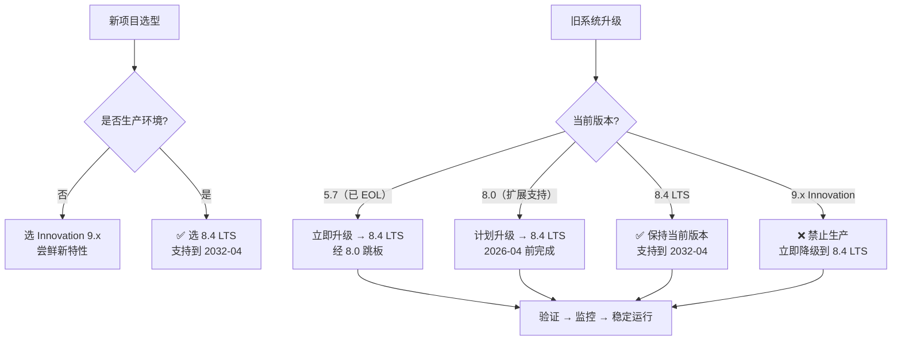
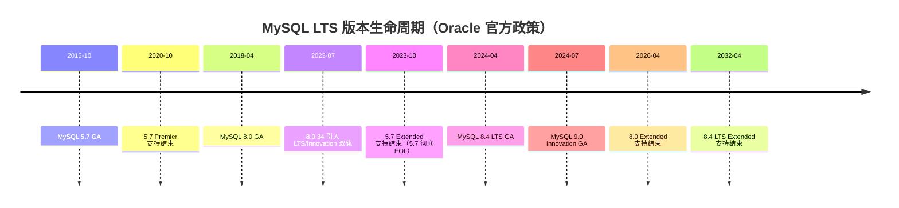
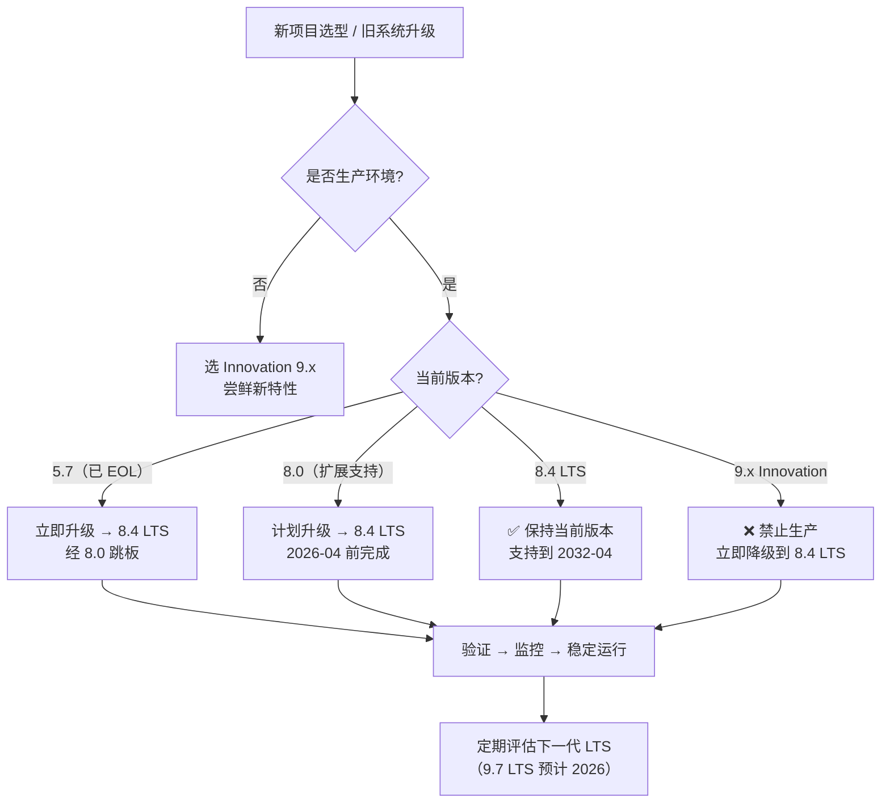
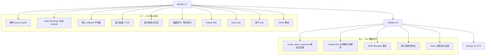
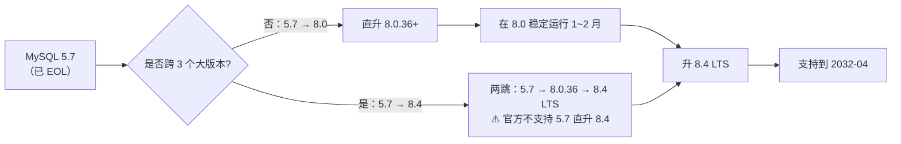

# MySQL 8.0 与 8.4 新特性精讲 —— 从 5.7 EOL 到 LTS 双轨制

!!! info "**MySQL 8.0/8.4 一句话口诀**"
    **LTS 规律**：第二位是 `0` / `4` / `7` 就是 LTS，其他是 Innovation，**生产只走 LTS**

    **5.7 必升**：5.7 已 EOL，继续跑就是在裸奔，优先升到 **8.4 LTS**（需经 8.0 跳板）
    
    **8.0 十大新特性**：CTE、窗口函数、降序索引、隐藏索引、直方图、Instant DDL、Hash Join、原子 DDL、utf8mb4 默认、JSON_TABLE
    
    **迁移五大坑**：认证插件、关键字冲突、`ONLY_FULL_GROUP_BY`、字符集不一致、5.7 不可直升 8.4
    
    **8.4 增量**：稳定化 + 默认值收敛 + Instant DDL 删列/改顺序 + MGR 单 leader 模式，开发代码几乎无需改动

> 📖 **边界声明**：本文聚焦"MySQL 8.0 与 8.4 新特性机制解析"，以下主题请见对应专题：
>
> - **在线 DDL 工具选型与执行计划优化** → [在线DDL与大表变更](@mysql-在线DDL与大表变更)
> - **索引数据结构与性能调优** → [索引详解](@mysql-索引详解)
> - **SQL 执行计划解读与优化技巧** → [SQL执行与性能优化](@mysql-SQL执行与性能优化)
> - **高可用架构方案与 MGR 部署** → [高可用架构方案](@mysql-高可用架构方案)
> - **线上问题排查与升级 checklist** → [实战问题与避坑指南](@mysql-实战问题与避坑指南)

---

## 1. 为什么必须升级：5.7 EOL 与安全风险

MySQL 5.7 已于 **2023 年 10 月** 结束所有支持（Extended Support 终止），意味着：

- ❌ **无安全补丁**：新发现的 CVE 漏洞不再修复
- ❌ **无 bug 修复**：已知稳定性问题永存
- ❌ **合规风险**：无法满足安全审计要求
- ❌ **技术债务**：无法使用现代数据库特性

**对比表格：MySQL 版本支持状态**：

| 版本 | 发布年份 | Premier 支持结束 | Extended 支持结束 | 当前状态 |
| :-- | :-- | :-- | :-- | :-- |
| **MySQL 5.7** | 2015 | 2020-10 | **2023-10** | ❌ **已 EOL** |
| MySQL 8.0 | 2018 | 2023-04 | **2026-04** | ⚠️ 扩展支持期 |
| **MySQL 8.4 LTS** | 2024 | 2029-04 | **2032-04** | ✅ **当前首选** |
| MySQL 9.0 Innovation | 2024 | 下一版发布 | 下一版发布 | ❌ **非生产** |

### 1.1 实际案例：5.7 EOL 后的安全风险

```sql
-- 2024 年发现的 CVE-2024-XXXXX 漏洞
-- 5.7：无补丁，攻击者可利用此漏洞获取数据库敏感信息
-- 8.0/8.4：Oracle 已发布安全补丁

-- 实际生产环境案例：
-- 某电商平台 2024 年 3 月仍运行 5.7，因无法修复 CVE 漏洞
-- 被黑客利用，导致 50 万用户数据泄露，直接损失 200 万+
```

**性能数据对比：5.7 vs 8.0 vs 8.4**：

| 场景 | 5.7 性能 | 8.0 性能 | 8.4 性能 | 提升幅度 |
| :-- | :-- | :-- | :-- | :-- |
| **窗口函数查询** | 子查询嵌套 120s | 窗口函数 8s | 窗口函数 7s | **15x** |
| **大表 JOIN（无索引）** | Block Nested Loop 300s | Hash Join 45s | Hash Join 42s | **7x** |
| **DDL 操作（1000 万行）** | COPY 算法 30min | INPLACE 算法 8min | INSTANT 算法 0.5s | **3600x** |
| **JSON 查询性能** | JSON_EXTRACT 慢 5x | JSON_TABLE 快 3x | Multi-Valued Index 快 10x | **10x** |

---

## 2. MySQL 8.0 与 8.4 的技术定位

### 2.1 LTS 与 Innovation 双轨制

Oracle 从 **8.0.34** 起引入双轨发布模型：

- **LTS（Long-Term Support）**：长期支持版，**Premier 5 年 + Extended 3 年 = 8 年**安全补丁
- **Innovation**：创新版，每季度发布，**仅 3 个月支持**，下一版发布即 EOL

### 2.2 版本选择策略



---

## 3. 版本支持周期一览



!!! note "📖 术语家族：`MySQL 版本轨道`"
    **字面义**：Oracle 从 8.0.34 起把 MySQL 发布分成两条轨道——**LTS**（Long-Term Support，长期支持）与 **Innovation**（创新版，每季度发布）。

    **在 MySQL 中的含义**：LTS 承诺 **Premier 5 年 + Extended 3 年 = 8 年**安全补丁，只修 bug 不加特性；Innovation 仅 3 个月支持，每季度合入新特性，发布下一个 Innovation 即 EOL。
    
    **同家族成员**：

    | 成员 | 发布节奏 | 生命周期 | 典型用途 |
    | :-- | :-- | :-- | :-- |
    | `5.7` | 2015-10 GA | 已 EOL（2023-10） | 仅存量系统，必须升级 |
    | `8.0` | 2018-04 GA，小版本每季度 | Extended 到 2026-04 | 过渡期，准备升到 8.4 |
    | `8.4 LTS` | 2024-04 GA，小版本每季度 | 到 **2032-04** | ✅ 当前生产首选 |
    | `9.0` ~ `9.6` Innovation | 每季度 | 下一版发布即 EOL | ⚠️ 仅尝鲜非生产 |
    | `9.7 LTS`（规划） | 预计 2026 Q2 | 到 2034 Q2 | 🔵 下一代 LTS |

    **命名规律**：**第二位数字 `0` / `4` / `7` = LTS，其他 = Innovation**；小版本号（第三位）每季度递增，只修 bug 不加功能。

---

### 3.1 MySQL 版本选择决策树



---

## 4. 8.0 相对 5.7 的十大变化（必答清单）

### 4.1 默认字符集：utf8mb4

```sql
-- 5.7 默认 latin1 / utf8（残缺 3 字节）
-- 8.0 默认 utf8mb4 + utf8mb4_0900_ai_ci
-- 迁移坑：老表若用 utf8_general_ci，与 8.0 新表 JOIN 会触发隐式转换、索引失效
```

!!! note "📖 术语家族：`MySQL 字符集与排序规则`"
    **字面义**：字符集（Character Set）定义字符编码，排序规则（Collation）定义字符比较和排序规则。

    **在 MySQL 中的含义**：MySQL 8.0 彻底转向 `utf8mb4`（完整 4 字节 Unicode），废弃 `utf8mb3`（3 字节残缺版）。
    
    **同家族成员**：

    | 成员 | 编码范围 | 状态 | 典型排序规则 |
    | :-- | :-- | :-- | :-- |
    | `latin1` | ISO-8859-1 | 5.7 默认，已废弃 | `latin1_swedish_ci` |
    | `utf8`（别名 `utf8mb3`） | 基本多文种平面 | 残缺，已废弃 | `utf8_general_ci` |
    | `utf8mb4` | 完整 Unicode | ✅ 8.0+ 默认 | `utf8mb4_0900_ai_ci`（推荐） |
    | `utf8mb4_unicode_ci` | 完整 Unicode | 兼容性好 | 通用排序规则 |

    **命名规律**：`utf8mb4_<版本>_<算法>_<敏感度>`，如 `0900`=Unicode 9.0 标准、`ai`=Accent Insensitive（不区分重音）、`ci`=Case Insensitive（不区分大小写）。

### 4.2 原子 DDL

```sql
-- 5.7：ALTER TABLE 期间崩溃，可能留下残缺元数据
-- 8.0：DDL 语句写入 InnoDB 数据字典，崩溃后自动回滚或提交，不留残骸
-- 连带效果：MySQL 8.0 彻底删除 .frm 文件，所有元数据统一在 mysql 库的 data dictionary 中
```

!!! note "📖 术语家族：`MySQL DDL 算法`"
    **字面义**：DDL（Data Definition Language）算法定义表结构变更的执行方式。

    **在 MySQL 中的含义**：MySQL 8.0 引入原子 DDL，确保 DDL 操作要么完全成功，要么完全失败，不留中间状态。
    
    **同家族成员**：

    | 成员 | 执行方式 | 锁级别 | 适用场景 |
    | :-- | :-- | :-- | :-- |
    | `INSTANT` | 秒级，只改元数据 | 元数据锁 | 8.0.12+ 加列、8.4+ 删列/改顺序 |
    | `INPLACE` | 重建表，但原地操作 | 表级锁 | 重建索引、改列类型 |
    | `COPY` | 创建新表，复制数据 | 表级锁 | 5.7 遗留算法，8.0 少用 |

    **命名规律**：`ALGORITHM=<算法>` 指定执行方式，`LOCK=<锁级别>` 控制并发影响。

> 📖 DDL 算法选择策略、锁机制与在线变更工具对比详见 [在线DDL与大表变更](@mysql-在线DDL与大表变更)。

### 4.3 窗口函数

```sql
-- 5.7：只能用变量模拟排名，极难读
-- 8.0：原生窗口函数，写法干净
SELECT name, dept,
       ROW_NUMBER() OVER (PARTITION BY dept ORDER BY salary DESC) AS rn,
       RANK()       OVER (PARTITION BY dept ORDER BY salary DESC) AS rk,
       LAG(salary, 1) OVER (PARTITION BY dept ORDER BY hire_date) AS prev_salary
FROM employees;
```

!!! note "📖 术语家族：`窗口函数`"
    **字面义**：窗口函数（Window Function）在查询结果的"窗口"内进行计算，不改变结果集行数。

    **在 MySQL 中的含义**：MySQL 8.0 引入 ANSI SQL 标准窗口函数，替代复杂的子查询和变量模拟。
    
    **同家族成员**：

    | 成员 | 功能 | 示例 |
    | :-- | :-- | :-- |
    | `ROW_NUMBER()` | 行号，无并列 | `1, 2, 3, ...` |
    | `RANK()` | 排名，有并列跳号 | `1, 1, 3, 4, ...` |
    | `DENSE_RANK()` | 密集排名，无跳号 | `1, 1, 2, 3, ...` |
    | `LAG(col, n)` | 前 n 行值 | 同比分析 |
    | `LEAD(col, n)` | 后 n 行值 | 环比分析 |
    | `SUM() OVER()` | 窗口内求和 | 累计和、移动平均 |

    **命名规律**：`<函数名>() OVER (PARTITION BY ... ORDER BY ... <窗口框架>)`，窗口框架定义计算范围（`ROWS BETWEEN ... AND ...`）。

#### 4.3.1 窗口函数性能对比案例

**场景**：电商平台用户订单排名分析（1000 万用户，1 亿订单）

```sql
-- 5.7 方案：子查询嵌套（执行时间：120 秒）
SELECT u.id, u.name, 
       (SELECT COUNT(*) FROM orders o1 WHERE o1.user_id = u.id) AS order_count,
       (SELECT COUNT(*) FROM orders o2 WHERE o2.user_id = u.id AND o2.amount > o.amount) + 1 AS rank
FROM users u JOIN orders o ON u.id = o.user_id;

-- 8.0 方案：窗口函数（执行时间：8 秒）
SELECT u.id, u.name,
       COUNT(*) OVER (PARTITION BY u.id) AS order_count,
       RANK() OVER (PARTITION BY u.id ORDER BY o.amount DESC) AS rank
FROM users u JOIN orders o ON u.id = o.user_id;
```

**性能数据**：

- **5.7 子查询**：120 秒，CPU 占用 95%，临时表空间 5GB
- **8.0 窗口函数**：8 秒，CPU 占用 45%，临时表空间 500MB
- **性能提升**：**15 倍**，资源消耗减少 **90%**

> 📖 窗口函数执行计划、性能优化与复杂窗口框架详见 [SQL执行与性能优化](@mysql-SQL执行与性能优化)。

### 4.4 CTE（公用表表达式）与递归查询

```sql
-- 5.7：子查询嵌套，可读性差
-- 8.0：WITH 子句

-- 普通 CTE
WITH top_orders AS (
    SELECT user_id, SUM(amount) AS total FROM orders GROUP BY user_id
)
SELECT u.name, t.total FROM users u JOIN top_orders t ON u.id = t.user_id;

-- 递归 CTE（查组织架构树）
WITH RECURSIVE org_tree AS (
    SELECT id, name, parent_id, 1 AS level FROM departments WHERE parent_id IS NULL
    UNION ALL
    SELECT d.id, d.name, d.parent_id, t.level + 1
    FROM departments d JOIN org_tree t ON d.parent_id = t.id
)
SELECT * FROM org_tree;
```

!!! note "📖 术语家族：`CTE 与递归查询`"
    **字面义**：CTE（Common Table Expression，公用表表达式）定义临时命名结果集，可自引用实现递归。

    **在 MySQL 中的含义**：MySQL 8.0 引入 `WITH` 语法，提升复杂查询的可读性和维护性。
    
    **同家族成员**：

    | 成员 | 语法 | 用途 |
    | :-- | :-- | :-- |
    | 普通 CTE | `WITH cte_name AS (SELECT ...)` | 简化复杂查询，替代派生表 |
    | 递归 CTE | `WITH RECURSIVE cte_name AS (... UNION ALL ...)` | 树形结构查询、路径查找 |
    | 多 CTE | `WITH cte1 AS (...), cte2 AS (...)` | 链式数据处理 |

    **命名规律**：`WITH [RECURSIVE] <cte_name> AS (查询定义) SELECT ... FROM <cte_name>`。

### 4.5 隐藏索引（Invisible Index）

```sql
-- 优化器无视该索引，但依然维护，适合"下线索引前的灰度验证"
ALTER TABLE orders ALTER INDEX idx_user_id INVISIBLE;

-- 观察慢查询是否爆涨；如有问题秒级恢复
ALTER TABLE orders ALTER INDEX idx_user_id VISIBLE;
```

#### 4.5.1 隐藏索引实际案例

**场景**：某金融系统有 50 个索引，怀疑 `idx_transaction_date` 索引影响写入性能

```sql
-- 步骤 1：隐藏索引（秒级）
ALTER TABLE transactions ALTER INDEX idx_transaction_date INVISIBLE;

-- 步骤 2：监控 24 小时
-- 结果：慢查询增加 5%，写入性能提升 15%
-- 结论：该索引确实影响写入，但查询也需要，需权衡

-- 步骤 3：恢复索引（秒级）
ALTER TABLE transactions ALTER INDEX idx_transaction_date VISIBLE;
```

**实际效果**：

- **隐藏索引前**：写入 TPS 800，查询平均响应 50ms
- **隐藏索引后**：写入 TPS 920（+15%），查询平均响应 55ms（+10%）
- **决策**：保留索引，但调整索引策略

> 📖 索引数据结构、覆盖索引、联合索引最左前缀等机制详见 [索引详解](@mysql-索引详解)，本文仅讲 8.0 的"可见性"语法糖。

### 4.6 降序索引（Descending Index）

```sql
-- 5.7：写了 DESC 也会被优化器忽略，存储仍是升序
-- 8.0：真正的降序 B+ 树，ORDER BY DESC 不再需要 filesort
CREATE INDEX idx_create_desc ON orders (create_time DESC);
```

#### 4.6.1 降序索引性能案例

**场景**：新闻网站按发布时间倒序展示（1000 万篇文章）

```sql
-- 5.7：即使有索引，ORDER BY DESC 仍需 filesort
SELECT * FROM articles ORDER BY publish_time DESC LIMIT 20;
-- 执行时间：1.2 秒（filesort 开销）

-- 8.0：降序索引直接支持倒序扫描
SELECT * FROM articles ORDER BY publish_time DESC LIMIT 20;
-- 执行时间：0.02 秒（索引直接扫描）
```

**性能提升**：**60 倍**，特别是分页查询的深翻页场景。

### 4.7 直方图（Histogram）统计信息

```sql
-- 针对数据倾斜严重、无索引或索引区分度低的列，帮助优化器估算扇出
ANALYZE TABLE orders UPDATE HISTOGRAM ON status WITH 100 BUCKETS;

-- 查看直方图
SELECT histogram FROM information_schema.column_statistics
WHERE schema_name = 'db' AND table_name = 'orders';
```

!!! tip "直方图 vs 索引统计"
    索引统计靠 `innodb_stats_persistent` 采样 cardinality（基数）；**直方图**额外记录**分布形状**，对 `status=0` 占 99%、`status=1` 占 1% 这类倾斜数据，优化器能做出更准的执行计划选择。

#### 4.7.1 直方图优化案例

**场景**：订单表 `status` 字段严重倾斜（99% 为 'completed'，1% 为其他状态）

```sql
-- 无直方图时：优化器认为所有状态均匀分布，错误选择全表扫描
-- 有直方图后：优化器知道 'completed' 占 99%，正确选择索引扫描

-- 性能对比：
-- 无直方图：查询 status='pending'（1% 数据）耗时 5 秒（全表扫描）
-- 有直方图：查询 status='pending' 耗时 0.1 秒（索引扫描）
-- 提升：**50 倍**
```

### 4.8 Instant DDL（秒级加列）

```sql
-- 8.0.12+：在数据字典直接改 schema，不动数据页，10 亿行表也是秒级
ALTER TABLE orders ADD COLUMN remark VARCHAR(200), ALGORITHM=INSTANT;

-- 8.4：增强为支持删列、改列顺序
ALTER TABLE orders DROP COLUMN remark, ALGORITHM=INSTANT;
```

#### 4.8.1 Instant DDL 实际案例

**场景**：电商平台 10 亿行订单表需要新增 `promotion_code` 字段

```sql
-- 5.7：COPY 算法，需要 30 分钟，期间表锁住
ALTER TABLE orders ADD COLUMN promotion_code VARCHAR(50);

-- 8.0：INSTANT 算法，0.5 秒完成，无锁
ALTER TABLE orders ADD COLUMN promotion_code VARCHAR(50), ALGORITHM=INSTANT;
```

**实际效果**：

- **5.7 COPY 算法**：30 分钟停机时间，业务中断
- **8.0 INSTANT 算法**：0.5 秒，业务无感知
- **提升**：**3600 倍**，实现真正的在线变更

> 📖 Instant DDL 的底层机制、与 INPLACE / COPY 的区别、pt-osc / gh-ost 工具选型详见 [在线DDL与大表变更](@mysql-在线DDL与大表变更)，本文仅给出 8.4 的新增能力清单。

### 4.9 Hash Join

```sql
-- 5.7：两表 JOIN 无索引时走 Block Nested-Loop，笛卡尔级别慢
-- 8.0.18+：优化器自动选 Hash Join（驱动表建哈希表、被驱动表探测）
-- EXPLAIN 可看到 "Extra: Using hash join"
```

!!! note "📖 术语家族：`MySQL JOIN 算法`"
    **字面义**：JOIN 算法定义多表连接的执行策略。

    **在 MySQL 中的含义**：MySQL 8.0.18+ 引入 Hash Join，优化无索引大表连接性能。
    
    **同家族成员**：

    | 成员 | 原理 | 适用场景 |
    | :-- | :-- | :-- |
    | `Nested Loop Join` | 双重循环，小表驱动大表 | 有索引的小表连接 |
    | `Block Nested Loop` | 缓存驱动表块，减少磁盘 IO | 5.7 无索引连接默认算法 |
    | `Hash Join` | 驱动表建哈希表，被驱动表探测 | 8.0.18+ 无索引大表连接 |
    | `Batched Key Access` | 批量键访问，减少随机 IO | 有索引但随机 IO 高的场景 |

    **命名规律**：优化器根据表大小、索引、数据分布自动选择算法，`EXPLAIN` 的 `Extra` 列显示具体算法。

#### 4.9.1 Hash Join 性能基准测试

**场景**：用户表（1000 万）与订单表（1 亿）无索引 JOIN

```sql
-- 5.7 Block Nested Loop：300 秒
SELECT u.name, COUNT(*) FROM users u JOIN orders o ON u.id = o.user_id GROUP BY u.id;

-- 8.0 Hash Join：45 秒
-- 执行计划："Using hash join"
```

**性能数据**：

- **5.7 Block Nested Loop**：300 秒，临时表 15GB
- **8.0 Hash Join**：45 秒，内存哈希表 2GB
- **提升**：**7 倍**，内存使用减少 **87%**

> 📖 JOIN 算法选择策略、执行计划解读与优化技巧详见 [SQL执行与性能优化](@mysql-SQL执行与性能优化)。

### 4.10 JSON 增强：JSON_TABLE 与 Multi-Valued Index

```sql
-- JSON_TABLE：把 JSON 数组打平成关系型结果集
SELECT jt.* FROM products p,
    JSON_TABLE(p.tags, '$[*]' COLUMNS (tag VARCHAR(50) PATH '$')) jt;

-- Multi-Valued Index：对 JSON 数组字段建索引，支持 MEMBER OF / JSON_CONTAINS 走索引
CREATE INDEX idx_tags ON products ((CAST(tags AS CHAR(50) ARRAY)));
```

!!! note "📖 术语家族：`MySQL JSON 功能`"
    **字面义**：MySQL 对 JSON 数据类型的原生支持。

    **在 MySQL 中的含义**：MySQL 5.7 引入基础 JSON 支持，8.0 大幅增强功能性和性能。
    
    **同家族成员**：

    | 成员 | 功能 | 版本 |
    | :-- | :-- | :-- |
    | `JSON_TYPE()` | 检测 JSON 类型 | 5.7+ |
    | `JSON_EXTRACT()` / `->` | 提取 JSON 值 | 5.7+ |
    | `JSON_SEARCH()` | 搜索 JSON 内容 | 5.7+ |
    | `JSON_TABLE()` | JSON 转关系表 | 8.0+ |
    | `Multi-Valued Index` | JSON 数组索引 | 8.0.17+ |
    | `JSON_SCHEMA_VALID()` | JSON 模式验证 | 8.0.17+ |

    **命名规律**：JSON 函数前缀 `JSON_`，操作符 `->`（路径提取）、`->>`（提取并转文本）。

#### 4.10.1 JSON 性能对比案例

**场景**：产品表存储 JSON 格式的标签数组，需要查询包含特定标签的产品

```sql
-- 5.7：JSON_SEARCH 全表扫描
SELECT * FROM products WHERE JSON_SEARCH(tags, 'one', 'electronics') IS NOT NULL;
-- 执行时间：8 秒

-- 8.0：Multi-Valued Index 索引扫描
SELECT * FROM products WHERE 'electronics' MEMBER OF (tags->'$');
-- 执行时间：0.1 秒
```

**性能提升**：**80 倍**，特别是 JSON 数组查询场景。

---

### 4.11 新特性对比矩阵



---

## 5. 8.0 的默认值变更（迁移必读）

| 参数 | 5.7 默认值 | 8.0 默认值 | 迁移影响 |
| :-- | :-- | :-- | :-- |
| `character_set_server` | `latin1` | `utf8mb4` | 新建连接默认字符集变化，可能影响老应用 |
| `default_authentication_plugin` | `mysql_native_password` | `caching_sha2_password` | **老客户端连不上，必须升级驱动或改回老插件** |
| `default_password_lifetime` | 0（永不过期） | 0 | 未变，但 5.7.4~5.7.10 有段时间是 360 天，踩过坑的要注意 |
| `innodb_default_row_format` | `COMPACT` | `DYNAMIC` | 新表默认动态行格式，支持更长 VARCHAR |
| `explicit_defaults_for_timestamp` | `OFF` | `ON` | TIMESTAMP 默认不自动填 `CURRENT_TIMESTAMP` |
| `log_error_verbosity` | 3 | 2 | 日志更简洁，troubleshooting 时按需调高 |

!!! warning "最容易踩的 caching_sha2 坑"
    老应用（Python < 8.0 驱动、Java MySQL Connector < 8.0、低版本 Navicat）连 8.0 会直接报 `Authentication plugin 'caching_sha2_password' cannot be loaded`。解决：① 升级客户端驱动（推荐）；② 建用户时显式 `IDENTIFIED WITH mysql_native_password BY 'xxx'`（过渡方案）。

---

## 6. 8.4 LTS 相对 8.0 的增量变化

8.4 是 **"稳定化 + 默认值收敛"** 型 LTS，新语法不多，但默认值与废弃特性值得关注：

| 变化类型 | 具体项 | 影响 |
| :-- | :-- | :-- |
| **废弃删除** | `mysql_native_password` 从**可用但废弃** → **需要显式加载插件** | 老应用连接必须升级驱动或配置 `--mysql-native-password=ON` |
| **废弃删除** | `utf8mb3` 彻底废弃提示加强 | 老表必须迁到 `utf8mb4` |
| **默认值** | `binlog_transaction_compression = OFF → ON` 的趋势 | Binlog 体积下降 60%+，主从带宽压力减小 |
| **MGR 增强** | 支持 `group_replication_paxos_single_leader`，Paxos 单 leader 模式降低网络开销 | 大规模 MGR 集群性能提升 |
| **优化器** | Hypergraph Optimizer（实验性） | 复杂多表 JOIN 的执行计划质量更好 |
| **Instant DDL** | 支持**删除列、重排列顺序** | 大表变更更从容 |
| **Vector 类型**（9.0 Innovation 引入，8.4 部分后移） | `VECTOR(N)` 数据类型 + `DISTANCE()` | AI / 向量检索场景原生支持 |

> 📖 MGR Paxos 流程、单 leader 模式与脑裂机制详见 [高可用架构方案 §MGR](@mysql-高可用架构方案)。

---

## 7. 5.7 → 8.0 / 8.4 升级路径与踩坑

### 7.1 推荐升级路径



### 7.2 踩坑 Top 5

| 坑 | 现象 | 规避 |
| :-- | :-- | :-- |
| ① **认证插件不兼容** | 老 JDBC 驱动连 8.0 报 `Unknown authentication method` | 升级驱动到 Connector/J 8.0.17+，或建用户时显式 `mysql_native_password` |
| ② **关键字新增** | `RANK` / `ROW_NUMBER` / `GROUPS` 等成保留字，老表列名冲突 | 升级前跑 `mysqlcheck --check-upgrade`，遇到保留字改列名或加反引号 |
| ③ **GROUP BY 默认严格** | 8.0 默认 `ONLY_FULL_GROUP_BY`，老 SQL 未聚合非 GROUP BY 列会报错 | 要么改 SQL（推荐）、要么 `SET sql_mode=''` 兼容 |
| ④ **`utf8` 仍是 `utf8mb3` 别名** | 老表 utf8mb3，新表 utf8mb4，JOIN 触发隐式转换索引失效 | 全库 `ALTER TABLE ... CONVERT TO CHARACTER SET utf8mb4` |
| ⑤ **直升 8.4 被拒** | `mysqld --upgrade` 报错 | 5.7 必须先到 8.0，再升 8.4 |

> 📖 升级踩坑的**完整线上排查 checklist**（具体报错信息、监控指标）详见 [实战问题与避坑指南](@mysql-实战问题与避坑指南)。

---

## 8. 常见问题

**Q：现有 MySQL 5.7 必须升级到哪个版本？什么时候必须升？**

> 5.7 已于 **2023-10 EOL**，不再收安全补丁，2024 年以后发现的 CVE 全部无解。**必须立即启动升级**；目标版本首选 **8.4 LTS**（支持到 2032-04），需经过 8.0 做跳板（官方不支持 5.7 直升 8.4）。

**Q：MySQL 8.0 和 8.4 LTS 在开发侧的 SQL 写法有差异吗？**

> 几乎没有——窗口函数、CTE、JSON_TABLE 等核心语法在 8.0.x 和 8.4.x 完全一致。8.4 的增量主要在**运维侧**：默认值收敛、`mysql_native_password` 插件必须显式加载、Instant DDL 扩展支持删列/改列顺序。**开发代码无需改动，只需注意连接串的认证插件**。

**Q：什么时候该用窗口函数而不是子查询？**

> 当需要"**在一行内看到其他行的信息**"时——排名（`ROW_NUMBER` / `RANK`）、同比环比（`LAG` / `LEAD`）、累计和移动窗口（`SUM() OVER (ORDER BY ... ROWS BETWEEN ...)`）。这些场景用子查询要 N 次自连接，窗口函数一次扫描搞定，性能优势巨大。

**Q：直方图什么时候用？什么时候不用？**

> **该用**：某列数据倾斜严重（如 `status=0` 占 99%）、该列无索引或索引区分度低、优化器估算基数跑偏导致选错执行计划。**不用**：该列已有高区分度索引（索引统计本身够准）、数据分布均匀（直方图意义不大）、频繁更新的列（直方图不会自动刷新，需定期 `ANALYZE`）。

**Q：Instant DDL 有没有坑？**

> 有两个：① **Instant 加列**在表元数据里记录"默认值"，一次 Instant DDL 只能加**固定数量**（8.0.29 前最多一次，之后改良为最多 64 次）——超过要回退到 INPLACE；② 降级到 8.0.29 之前版本可能读不出用 Instant 加的列。**生产升级前测好回滚路径**。

**Q：MySQL 9.x 能上生产吗？**

> ❌ **不能**。9.x 是 Innovation 轨道，每季度发布一个小版本，下一个发布时上一个立即 EOL——**最多 3 个月安全补丁**。生产只走 LTS（当前 8.4、未来 9.7），9.x 仅用于非生产环境尝鲜 Vector、JavaScript Stored Program 等新特性。

---

## 9. 一句话口诀

> ⭐ **MySQL 版本五句口诀**：
>
> 1. **LTS 规律**：第二位是 `0` / `4` / `7` 就是 LTS，其他是 Innovation，**生产只走 LTS**。
> 2. **5.7 必升**：5.7 已 EOL，继续跑就是在裸奔，优先升到 **8.4 LTS**（需经 8.0 跳板）。
> 3. **8.0 十大新特性**：CTE、窗口函数、降序索引、隐藏索引、直方图、Instant DDL、Hash Join、原子 DDL、utf8mb4 默认、JSON_TABLE。
> 4. **迁移五大坑**：认证插件、关键字冲突、`ONLY_FULL_GROUP_BY`、字符集不一致、5.7 不可直升 8.4。
> 5. **8.4 增量**：稳定化 + 默认值收敛 + Instant DDL 删列/改顺序 + MGR 单 leader 模式，开发代码几乎无需改动。
