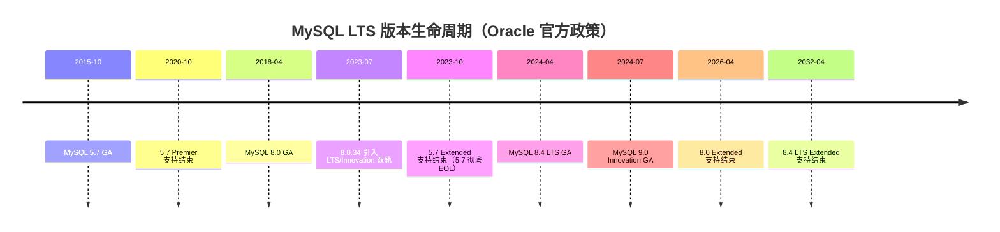
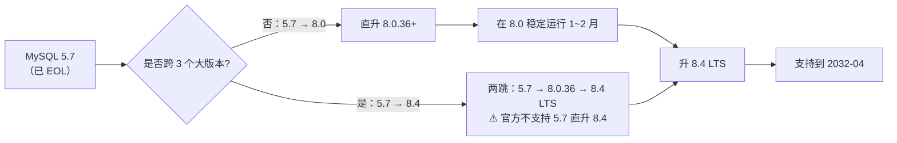

# MySQL 8.0 与 8.4 新特性精讲

> **核心问题**：MySQL 8.0 相比 5.7 有哪些值得关注的变化？8.4 LTS 又新增了什么？面试常考"MySQL 8 新特性"到底该答哪些？

---

## 1. 类比：MySQL 版本升级像手机系统升级

把 MySQL 版本类比成手机系统，版本差异一目了然：

| MySQL 版本 | 对应类比 | 关键变化 |
| :-- | :-- | :-- |
| **5.7**（已 EOL） | 老版 Android 4.x | 还能用，但不再收安全补丁，新硬件/新应用不兼容 |
| **8.0**（扩展支持收尾） | Android 10 | 稳定主力，2026-04 扩展支持结束后不再收补丁 |
| **8.4 LTS**（当前推荐） | Android 14 LTS | 8.x 系列官方 LTS 继承者，支持到 **2032-04** |
| **9.x Innovation**（尝鲜） | Android Beta | 每季度一发，新特性先行，**禁止生产** |
| **9.7 LTS**（规划中） | 下一代 LTS | 预计 2026 Q2 GA，2034 EOL |

**一句话**：生产只走 LTS（`8.4` / 未来的 `9.7`），尝鲜才用 Innovation。本文聚焦 **`5.7 → 8.0 → 8.4`** 三代 LTS 的关键差异。

---

## 2. 它解决了什么问题？

- **选型题**：新系统选哪个 LTS？旧系统何时必须升级？
- **迁移题**：从 5.7 升 8.0 / 8.4 要注意哪些默认值变更、语法兼容？
- **面试题**：MySQL 8 新特性 Top 10 必答清单。

---

## 3. 版本支持周期一览



!!! note "📖 术语家族：`MySQL 版本轨道`"
    **字面义**：Oracle 从 8.0.34 起把 MySQL 发布分成两条轨道——**LTS**（Long-Term Support，长期支持）与 **Innovation**（创新版，每季度发布）。
    **在 MySQL 中的含义**：LTS 承诺 **Premier 5 年 + Extended 3 年 = 8 年**安全补丁，只修 bug 不加特性；Innovation 仅 3 个月支持，每季度合入新特性，发布下一个 Innovation 即 EOL。
    **同家族成员**：

    | 成员 | 发布节奏 | 生命周期 | 典型用途 |
    | :-- | :-- | :-- | :-- |
    | `5.7` | 2015-10 GA | 已 EOL（2023-10） | 仅存量系统，必须升级 |
    | `8.0` | 2018-04 GA，小版本每季度 | Extended 到 2026-04 | 过渡期，准备升到 8.4 |
    | `8.4 LTS` | 2024-04 GA，小版本每季度 | 到 **2032-04** | ✅ 当前生产首选 |
    | `9.0` ~ `9.6` Innovation | 每季度 | 下一版发布即 EOL | ⚠️ 仅尝鲜非生产 |
    | `9.7 LTS`（规划） | 预计 2026 Q2 | 到 2034 Q2 | 🔵 下一代 LTS |

    **命名规律**：**第二位数字 `0` / `4` / `7` = LTS，其他 = Innovation**；小版本号（第三位）每季度递增，只改 bug 不加功能。

---

## 4. 8.0 相对 5.7 的十大变化（必答清单）

### ① 默认字符集：utf8mb4

```sql
-- 5.7 默认 latin1 / utf8（残缺 3 字节）
-- 8.0 默认 utf8mb4 + utf8mb4_0900_ai_ci
-- 迁移坑：老表若用 utf8_general_ci，与 8.0 新表 JOIN 会触发隐式转换、索引失效
```

### ② 原子 DDL

```sql
-- 5.7：ALTER TABLE 期间崩溃，可能留下残缺元数据
-- 8.0：DDL 语句写入 InnoDB 数据字典，崩溃后自动回滚或提交，不留残骸
-- 连带效果：MySQL 8.0 彻底删除 .frm 文件，所有元数据统一在 mysql 库的 data dictionary 中
```

### ③ 窗口函数

```sql
-- 5.7：只能用变量模拟排名，极难读
-- 8.0：原生窗口函数，写法干净
SELECT name, dept,
       ROW_NUMBER() OVER (PARTITION BY dept ORDER BY salary DESC) AS rn,
       RANK()       OVER (PARTITION BY dept ORDER BY salary DESC) AS rk,
       LAG(salary, 1) OVER (PARTITION BY dept ORDER BY hire_date) AS prev_salary
FROM employees;
```

### ④ CTE（公用表表达式）与递归查询

```sql
-- 5.7：子查询嵌套，可读性差
-- 8.0：WITH 子句

-- 普通 CTE
WITH top_orders AS (
    SELECT user_id, SUM(amount) AS total FROM orders GROUP BY user_id
)
SELECT u.name, t.total FROM users u JOIN top_orders t ON u.id = t.user_id;

-- 递归 CTE（查组织架构树）
WITH RECURSIVE org_tree AS (
    SELECT id, name, parent_id, 1 AS level FROM departments WHERE parent_id IS NULL
    UNION ALL
    SELECT d.id, d.name, d.parent_id, t.level + 1
    FROM departments d JOIN org_tree t ON d.parent_id = t.id
)
SELECT * FROM org_tree;
```

### ⑤ 隐藏索引（Invisible Index）

```sql
-- 优化器无视该索引，但依然维护，适合"下线索引前的灰度验证"
ALTER TABLE orders ALTER INDEX idx_user_id INVISIBLE;

-- 观察慢查询是否爆涨；如有问题秒级恢复
ALTER TABLE orders ALTER INDEX idx_user_id VISIBLE;
```

> 📖 索引数据结构、覆盖索引、联合索引最左前缀等机制详见 [索引详解](@mysql-索引详解)，本文仅讲 8.0 的"可见性"语法糖。

### ⑥ 降序索引（Descending Index）

```sql
-- 5.7：写了 DESC 也会被优化器忽略，存储仍是升序
-- 8.0：真正的降序 B+ 树，ORDER BY DESC 不再需要 filesort
CREATE INDEX idx_create_desc ON orders (create_time DESC);
```

### ⑦ 直方图（Histogram）统计信息

```sql
-- 针对数据倾斜严重、无索引或索引区分度低的列，帮助优化器估算扇出
ANALYZE TABLE orders UPDATE HISTOGRAM ON status WITH 100 BUCKETS;

-- 查看直方图
SELECT histogram FROM information_schema.column_statistics
WHERE schema_name = 'db' AND table_name = 'orders';
```

!!! tip "直方图 vs 索引统计"
    索引统计靠 `innodb_stats_persistent` 采样 cardinality（基数）；**直方图**额外记录**分布形状**，对 `status=0` 占 99%、`status=1` 占 1% 这类倾斜数据，优化器能做出更准的执行计划选择。

### ⑧ Instant DDL（秒级加列）

```sql
-- 8.0.12+：在数据字典直接改 schema，不动数据页，10 亿行表也是秒级
ALTER TABLE orders ADD COLUMN remark VARCHAR(200), ALGORITHM=INSTANT;

-- 8.4：增强为支持删列、改列顺序
ALTER TABLE orders DROP COLUMN remark, ALGORITHM=INSTANT;
```

> 📖 Instant DDL 的底层机制、与 INPLACE / COPY 的区别、pt-osc / gh-ost 工具选型详见 [在线DDL与大表变更](@mysql-在线DDL与大表变更)，本文仅给出 8.4 的新增能力清单。

### ⑨ Hash Join

```sql
-- 5.7：两表 JOIN 无索引时走 Block Nested-Loop，笛卡尔级别慢
-- 8.0.18+：优化器自动选 Hash Join（驱动表建哈希表、被驱动表探测）
-- EXPLAIN 可看到 "Extra: Using hash join"
```

### ⑩ JSON 增强：JSON_TABLE 与 Multi-Valued Index

```sql
-- JSON_TABLE：把 JSON 数组打平成关系型结果集
SELECT jt.* FROM products p,
    JSON_TABLE(p.tags, '$[*]' COLUMNS (tag VARCHAR(50) PATH '$')) jt;

-- Multi-Valued Index：对 JSON 数组字段建索引，支持 MEMBER OF / JSON_CONTAINS 走索引
CREATE INDEX idx_tags ON products ((CAST(tags AS CHAR(50) ARRAY)));
```

---

## 5. 8.0 的默认值变更（迁移必读）

| 参数 | 5.7 默认值 | 8.0 默认值 | 迁移影响 |
| :-- | :-- | :-- | :-- |
| `character_set_server` | `latin1` | `utf8mb4` | 新建连接默认字符集变化，可能影响老应用 |
| `default_authentication_plugin` | `mysql_native_password` | `caching_sha2_password` | **老客户端连不上，必须升级驱动或改回老插件** |
| `default_password_lifetime` | 0（永不过期） | 0 | 未变，但 5.7.4~5.7.10 有段时间是 360 天，踩过坑的要注意 |
| `innodb_default_row_format` | `COMPACT` | `DYNAMIC` | 新表默认动态行格式，支持更长 VARCHAR |
| `explicit_defaults_for_timestamp` | `OFF` | `ON` | TIMESTAMP 默认不自动填 `CURRENT_TIMESTAMP` |
| `log_error_verbosity` | 3 | 2 | 日志更简洁，troubleshooting 时按需调高 |

!!! warning "最容易踩的 caching_sha2 坑"
    老应用（Python < 8.0 驱动、Java MySQL Connector < 8.0、低版本 Navicat）连 8.0 会直接报 `Authentication plugin 'caching_sha2_password' cannot be loaded`。解决：① 升级客户端驱动（推荐）；② 建用户时显式 `IDENTIFIED WITH mysql_native_password BY 'xxx'`（过渡方案）。

---

## 6. 8.4 LTS 相对 8.0 的增量变化

8.4 是 **"稳定化 + 默认值收敛"** 型 LTS，新语法不多，但默认值与废弃特性值得关注：

| 变化类型 | 具体项 | 影响 |
| :-- | :-- | :-- |
| **废弃删除** | `mysql_native_password` 从**可用但废弃** → **需要显式加载插件** | 老应用连接必须升级驱动或配置 `--mysql-native-password=ON` |
| **废弃删除** | `utf8mb3` 彻底废弃提示加强 | 老表必须迁到 `utf8mb4` |
| **默认值** | `binlog_transaction_compression = OFF → ON` 的趋势 | Binlog 体积下降 60%+，主从带宽压力减小 |
| **MGR 增强** | 支持 `group_replication_paxos_single_leader`，Paxos 单 leader 模式降低网络开销 | 大规模 MGR 集群性能提升 |
| **优化器** | Hypergraph Optimizer（实验性） | 复杂多表 JOIN 的执行计划质量更好 |
| **Instant DDL** | 支持**删除列、重排列顺序** | 大表变更更从容 |
| **Vector 类型**（9.0 Innovation 引入，8.4 部分后移） | `VECTOR(N)` 数据类型 + `DISTANCE()` | AI / 向量检索场景原生支持 |

> 📖 MGR Paxos 流程、单 leader 模式与脑裂机制详见 [高可用架构方案 §MGR](@mysql-高可用架构方案)。

---

## 7. 5.7 → 8.0 / 8.4 升级路径与踩坑

### 推荐升级路径



### 踩坑 Top 5

| 坑 | 现象 | 规避 |
| :-- | :-- | :-- |
| ① **认证插件不兼容** | 老 JDBC 驱动连 8.0 报 `Unknown authentication method` | 升级驱动到 Connector/J 8.0.17+，或建用户时显式 `mysql_native_password` |
| ② **关键字新增** | `RANK` / `ROW_NUMBER` / `GROUPS` 等成保留字，老表列名冲突 | 升级前跑 `mysqlcheck --check-upgrade`，遇到保留字改列名或加反引号 |
| ③ **GROUP BY 默认严格** | 8.0 默认 `ONLY_FULL_GROUP_BY`，老 SQL 未聚合非 GROUP BY 列会报错 | 要么改 SQL（推荐）、要么 `SET sql_mode=''` 兼容 |
| ④ **`utf8` 仍是 `utf8mb3` 别名** | 老表 utf8mb3，新表 utf8mb4，JOIN 触发隐式转换索引失效 | 全库 `ALTER TABLE ... CONVERT TO CHARACTER SET utf8mb4` |
| ⑤ **直升 8.4 被拒** | `mysqld --upgrade` 报错 | 5.7 必须先到 8.0，再升 8.4 |

> 📖 升级踩坑的**完整线上排查 checklist**（具体报错信息、监控指标）详见 [实战问题与避坑指南](@mysql-实战问题与避坑指南)。

---

## 8. 常见问题

**Q：现有 MySQL 5.7 必须升级到哪个版本？什么时候必须升？**

> 5.7 已于 **2023-10 EOL**，不再收安全补丁，2024 年以后发现的 CVE 全部无解。**必须立即启动升级**；目标版本首选 **8.4 LTS**（支持到 2032-04），需经过 8.0 做跳板（官方不支持 5.7 直升 8.4）。

**Q：MySQL 8.0 和 8.4 LTS 在开发侧的 SQL 写法有差异吗？**

> 几乎没有——窗口函数、CTE、JSON_TABLE 等核心语法在 8.0.x 和 8.4.x 完全一致。8.4 的增量主要在**运维侧**：默认值收敛、`mysql_native_password` 插件必须显式加载、Instant DDL 扩展支持删列/改列顺序。**开发代码无需改动，只需注意连接串的认证插件**。

**Q：什么时候该用窗口函数而不是子查询？**

> 当需要"**在一行内看到其他行的信息**"时——排名（`ROW_NUMBER` / `RANK`）、同比环比（`LAG` / `LEAD`）、累计和移动窗口（`SUM() OVER (ORDER BY ... ROWS BETWEEN ...)`）。这些场景用子查询要 N 次自连接，窗口函数一次扫描搞定，性能优势巨大。

**Q：直方图什么时候用？什么时候不用？**

> **该用**：某列数据倾斜严重（如 `status=0` 占 99%）、该列无索引或索引区分度低、优化器估算基数跑偏导致选错执行计划。**不用**：该列已有高区分度索引（索引统计本身够准）、数据分布均匀（直方图意义不大）、频繁更新的列（直方图不会自动刷新，需定期 `ANALYZE`）。

**Q：Instant DDL 有没有坑？**

> 有两个：① **Instant 加列**在表元数据里记录"默认值"，一次 Instant DDL 只能加**固定数量**（8.0.29 前最多一次，之后改良为最多 64 次）——超过要回退到 INPLACE；② 降级到 8.0.29 之前版本可能读不出用 Instant 加的列。**生产升级前测好回滚路径**。

**Q：MySQL 9.x 能上生产吗？**

> ❌ **不能**。9.x 是 Innovation 轨道，每季度发布一个小版本，下一个发布时上一个立即 EOL——**最多 3 个月安全补丁**。生产只走 LTS（当前 8.4、未来 9.7），9.x 仅用于非生产环境尝鲜 Vector、JavaScript Stored Program 等新特性。

---

## 9. 一句话口诀

> ⭐ **MySQL 版本五句口诀**：
>
> 1. **LTS 规律**：第二位是 `0/4/7` 就是 LTS，其他是 Innovation，**生产只走 LTS**。
> 2. **5.7 必升**：5.7 已 EOL，继续跑就是在裸奔，优先升到 **8.4 LTS**（需经 8.0 跳板）。
> 3. **8.0 十大新特性**：CTE、窗口函数、降序索引、隐藏索引、直方图、Instant DDL、Hash Join、原子 DDL、utf8mb4 默认、JSON_TABLE。
> 4. **迁移五大坑**：认证插件、关键字冲突、`ONLY_FULL_GROUP_BY`、字符集不一致、5.7 不可直升 8.4。
> 5. **8.4 增量**：稳定化 + 默认值收敛 + Instant DDL 删列/改顺序 + MGR 单 leader 模式，开发代码几乎无需改动。
