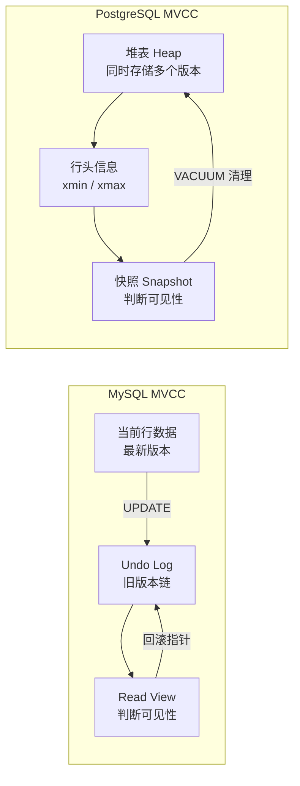
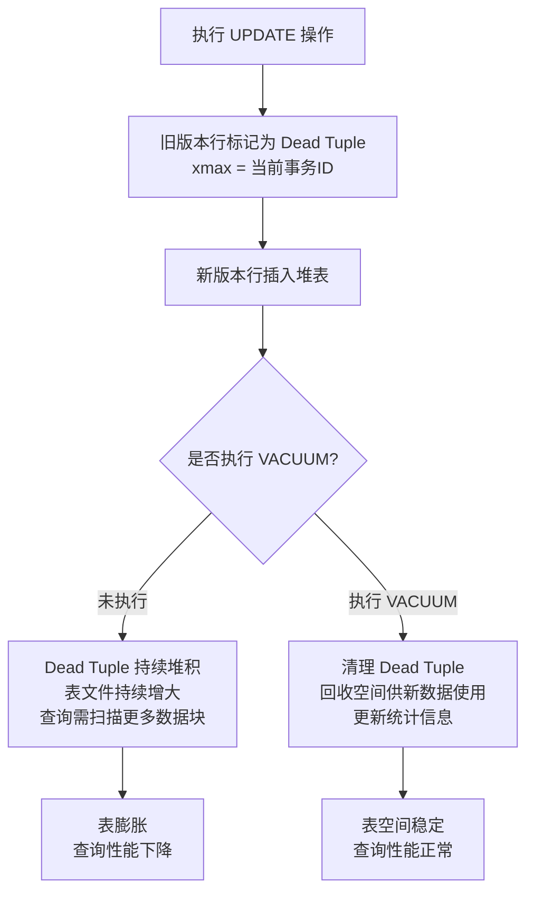

# MVCC 与 VACUUM 机制

> **核心问题**：PostgreSQL 的 MVCC 是如何实现的？为什么会产生表膨胀？VACUUM 如何清理？如何避免表膨胀？

---

## 它解决了什么问题？

MVCC（多版本并发控制）让**读操作不加锁**，通过保存数据的多个历史版本，让读写操作互不阻塞，大幅提升并发性能。

但 PG 的 MVCC 实现会在堆表中留下旧版本行（Dead Tuple），如果不清理，表空间会持续增长——这就是**表膨胀**。VACUUM 机制负责清理这些 Dead Tuple，是 PG 运维的核心知识。

**生活类比**：图书馆（数据库）里的书（数据行）被借走（删除/更新）后，书架上留下空位（Dead Tuple）。如果不定期整理（VACUUM），空位越来越多，找书（查询）时需要跳过大量空位，效率越来越低。

---

# 一、PostgreSQL MVCC 核心机制

## MySQL vs PostgreSQL 的 MVCC 对比



## 隐藏字段：xmin / xmax

每一行数据都有两个隐藏字段：

| 字段 | 含义 | 作用 |
|------|------|------|
| `xmin` | 插入该行的事务 ID | 该行从哪个事务开始可见 |
| `xmax` | 删除/更新该行的事务 ID | 该行从哪个事务开始不可见 |

**更新时**：不修改原行，而是**插入新行**（新 xmin）并将旧行的 xmax 设为当前事务 ID。

**读取时**：通过当前事务的快照（Snapshot）与行的 xmin/xmax 比较，判断该版本是否对当前事务可见。

## 与 MySQL 的关键差异

| 对比点 | PostgreSQL | MySQL (InnoDB) | 影响 |
|--------|-----------|----------------|------|
| 旧版本存储位置 | 堆表中（与新版本共存） | Undo Log 回滚段（独立存储） | PG 需要 VACUUM 清理，MySQL 自动回收 |
| 旧版本清理方式 | VACUUM 主动清理 | 事务提交后自动回收 | PG 有表膨胀风险，MySQL 没有 |
| 表膨胀风险 | **有**（需要 VACUUM） | 无（Undo Log 自动回收） | PG 需要监控和维护 |
| 读性能 | 无需回溯 Undo Log | 需要回溯 Undo Log 链 | 长事务下 PG 读性能更稳定 |

> **为什么 PG 选择把旧版本存在堆表中**：读操作不需要去 Undo Log 中回溯旧版本，读性能更稳定。代价是需要 VACUUM 定期清理 Dead Tuple，否则表空间持续增长。

---

# 二、表膨胀



### 监控表膨胀

```sql
-- 查看表的 Dead Tuple 数量（监控表膨胀）
SELECT 
    schemaname,
    tablename,
    n_live_tup AS 活跃行数,
    n_dead_tup AS 死亡行数,
    ROUND(n_dead_tup::numeric / NULLIF(n_live_tup + n_dead_tup, 0) * 100, 2) AS 死亡比例,
    last_vacuum,
    last_autovacuum
FROM pg_stat_user_tables
ORDER BY n_dead_tup DESC;
```

---

# 三、VACUUM 机制

## VACUUM 的几种形式

| 命令 | 作用 | 特点 | 适用场景 |
|------|------|------|---------|
| `VACUUM table_name` | 清理 Dead Tuple，标记空间可复用 | **不锁表**，空间不归还 OS | 日常维护 |
| `VACUUM FULL table_name` | 重写整张表，彻底回收空间 | **锁表**，空间归还 OS | 表膨胀严重时，业务低峰期 |
| `ANALYZE table_name` | 更新统计信息，优化查询计划 | 不清理数据，只更新统计 | 大量数据变化后 |
| `VACUUM ANALYZE` | 同时执行清理和统计更新 | 推荐日常使用 | 定期维护 |

> **为什么 VACUUM FULL 要慎用**：VACUUM FULL 会锁表，期间所有读写操作都被阻塞。对大表执行可能持续数小时，导致业务中断。替代方案：使用 `pg_repack` 工具在线重建表（不锁表）。

---

# 四、AUTOVACUUM 自动清理

PostgreSQL 默认开启 `autovacuum`，自动在后台执行 VACUUM：

```sql
-- 查看 autovacuum 配置
SHOW autovacuum;
SHOW autovacuum_vacuum_threshold;    -- 触发阈值（默认50行）
SHOW autovacuum_vacuum_scale_factor; -- 触发比例（默认0.2，即20%行变化）

-- 触发条件：Dead Tuple 数 > threshold + scale_factor × 总行数
-- 默认：Dead Tuple > 50 + 0.2 × 总行数 时触发
-- 对于大表（100万行），需要 200050 个 Dead Tuple 才触发，可能太晚！
```

> **为什么大表需要降低 scale_factor**：默认 20% 对小表合理，但对百万行大表意味着需要 20 万个 Dead Tuple 才触发，可能导致表膨胀过大。高频更新的大表应适当降低阈值。

```sql
-- 针对特定表调整 autovacuum 参数
ALTER TABLE hot_table SET (
    autovacuum_vacuum_scale_factor = 0.01,  -- 1% 就触发（而不是默认20%）
    autovacuum_vacuum_threshold = 100
);
```

---

# 五、长事务阻塞 VACUUM

> **重要**：长事务是表膨胀的主要原因之一。VACUUM 不能清理比最老活跃事务更新的 Dead Tuple，因为这些旧版本可能还需要被长事务读取。


### 排查长事务

```sql
-- 查看是否有长事务阻塞 VACUUM
SELECT pid, now() - pg_stat_activity.query_start AS duration, query
FROM pg_stat_activity
WHERE state = 'active' 
  AND now() - pg_stat_activity.query_start > interval '5 minutes'
ORDER BY duration DESC;
```

### 解决方案

1. 监控 `pg_stat_activity`，及时发现并终止长事务
2. 业务层设置合理的事务超时：`SET statement_timeout = '30s'`
3. 避免在事务中做耗时操作（如调用外部接口）

---

# 六、避免表膨胀的最佳实践

| 实践 | 说明 |
|------|------|
| **确保 autovacuum 开启** | 默认开启，不要关闭 |
| **降低大表的触发阈值** | 高频更新的大表降低 `autovacuum_vacuum_scale_factor` |
| **避免长事务** | 长事务会阻止 VACUUM 清理旧版本，是表膨胀的主要原因 |
| **定期监控** | 监控 `pg_stat_user_tables` 中的 `n_dead_tup` |
| **严重膨胀时用 pg_repack** | 替代 `VACUUM FULL`，在线重建表不锁表 |

---

# 七、工作中的坑

| 错误 | 原因 | 解决方案 |
|------|------|---------|
| 表空间持续增长 | autovacuum 未生效或阈值过高 | 检查 autovacuum 配置，监控 Dead Tuple |
| `VACUUM FULL` 导致业务中断 | 锁表时间过长 | 改用 `pg_repack` 工具在线重建表 |
| autovacuum 频繁触发影响性能 | 阈值设置过低 | 适当提高阈值，或在业务低峰期手动执行 |
| 长事务阻塞 VACUUM | 事务未及时提交 | 监控 `pg_stat_activity`，及时终止长事务 |

---

# 八、常见问题

**Q：PG 的 MVCC 和 MySQL 的 MVCC 有什么区别？**

> PG 将旧版本行存储在堆表中，读操作无需回溯 Undo Log，读性能更稳定，但需要 VACUUM 定期清理，有表膨胀风险；MySQL 使用 Undo Log 存储旧版本，事务提交后自动回收，无表膨胀问题，但长事务下需要回溯较长的 Undo Log 链。

**Q：什么是表膨胀？如何避免？**

> PG 的 MVCC 机制在 UPDATE/DELETE 时不删除旧版本行，而是标记为 Dead Tuple。如果不及时清理，Dead Tuple 持续堆积，表文件持续增大，这就是表膨胀。避免方法：确保 autovacuum 开启；对高频更新的表降低 `autovacuum_vacuum_scale_factor`；避免长事务；定期监控 `n_dead_tup`。

**Q：VACUUM 和 VACUUM FULL 有什么区别？**

> VACUUM 清理 Dead Tuple，将空间标记为可复用，不锁表，是日常维护命令；VACUUM FULL 重写整张表，彻底回收空间并归还 OS，但会锁表，期间业务不可用。生产环境表膨胀严重时，推荐用 `pg_repack` 替代 VACUUM FULL，实现在线重建不锁表。

**Q：为什么长事务会导致表膨胀？**

> VACUUM 不能清理比最老活跃事务更新的 Dead Tuple，因为长事务可能需要读取这些旧版本数据（MVCC 保证）。长事务运行期间，所有新产生的 Dead Tuple 都无法被清理，导致表膨胀。
