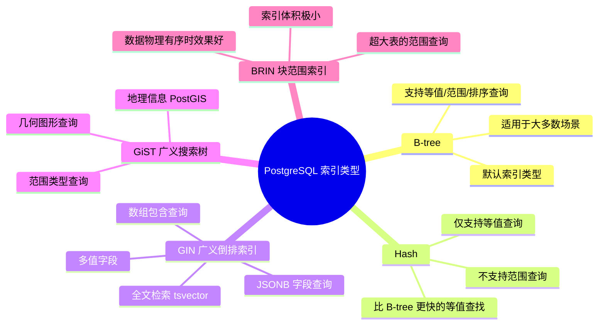

# 索引类型详解

> **核心问题**：PostgreSQL 有哪些索引类型？什么场景下选哪种索引？

---

## 它解决了什么问题？

MySQL 主要只有 B-tree 索引，而 PostgreSQL 提供了多种索引类型，针对不同数据特征做了专项优化。选对索引类型，能让查询性能提升数十倍。

---

## 索引类型全景图



---

## 各索引类型适用场景

| 索引类型 | 适用场景 | 示例 | 为什么选它 |
|---------|---------|------|----------|
| **B-tree** | 通用场景，等值/范围/排序 | `WHERE age > 18 ORDER BY name` | 最通用，大多数场景首选 |
| **Hash** | 仅等值查询，高频精确匹配 | `WHERE user_id = 12345` | 等值查询比 B-tree 更快，但不支持范围 |
| **GIN** | JSONB 字段、全文检索、数组 | `WHERE tags @> ARRAY['java']` | 多值字段，每个值单独建索引项 |
| **GiST** | 地理位置、几何图形、范围类型 | `WHERE location <-> point < 1000` | 支持空间查询，B-tree 无法处理 |
| **BRIN** | 超大表、数据物理有序（如时间序列） | 日志表按时间范围查询 | 索引极小（只存块范围），适合有序大表 |

---

## JSONB + GIN 索引详解

> **为什么 GIN 适合 JSONB**：JSONB 是多值字段（一个字段包含多个键值对），GIN（广义倒排索引）将每个键值对单独建立索引项，支持包含查询（`@>`）、键存在查询（`?`）等操作。B-tree 只能对整个 JSONB 值建索引，无法高效查询内部字段。

```sql
-- 创建 JSONB 字段
CREATE TABLE users (
    id SERIAL PRIMARY KEY,
    profile JSONB
);

-- 插入数据
INSERT INTO users (profile) VALUES 
('{"name": "张三", "skills": ["Java", "Redis"], "age": 28}');

-- 创建 GIN 索引（不建索引则全表扫描）
CREATE INDEX idx_profile_gin ON users USING GIN (profile);

-- ✅ 高效查询：查找 skills 包含 Java 的用户（走 GIN 索引）
SELECT * FROM users WHERE profile @> '{"skills": ["Java"]}';

-- ✅ 查询 JSON 字段值
SELECT profile->>'name' AS name FROM users WHERE profile->>'age' = '28';

-- ❌ 未建索引时，以下查询会全表扫描
SELECT * FROM users WHERE profile->>'name' = '张三';
-- ✅ 建立表达式索引解决
CREATE INDEX idx_profile_name ON users ((profile->>'name'));
```

---

## BRIN 索引适用场景

```sql
-- 日志表：按时间顺序插入，数据物理有序
CREATE TABLE access_logs (
    id BIGSERIAL PRIMARY KEY,
    created_at TIMESTAMP,
    user_id INT,
    action TEXT
);

-- BRIN 索引：只存每个数据块的时间范围，索引极小
CREATE INDEX idx_logs_brin ON access_logs USING BRIN (created_at);

-- 按时间范围查询，BRIN 索引高效过滤数据块
SELECT * FROM access_logs 
WHERE created_at BETWEEN '2024-01-01' AND '2024-01-31';
```

> **BRIN 的原理**：不记录每行的索引值，只记录每个数据块（Page）中的最小值和最大值。查询时跳过不在范围内的数据块，大幅减少 IO。索引体积是 B-tree 的 1/1000，但只适合数据物理有序的场景。

---

## 工作中的坑

| 错误 | 原因 | 解决方案 |
|------|------|---------|
| JSONB 查询慢 | 未建 GIN 索引 | `CREATE INDEX USING GIN (jsonb_col)` |
| GIN 索引写入慢 | GIN 维护成本高，每次写入都要更新倒排索引 | 批量写入，或使用 `fastupdate` 参数 |
| BRIN 索引不生效 | 数据插入顺序不规律，物理无序 | 改用 B-tree，BRIN 只适合物理有序数据 |

---

## 常见问题

**Q：GIN 索引和 B-tree 索引有什么区别？**

> B-tree 适合单值字段的等值/范围/排序查询，是最通用的索引类型；GIN（广义倒排索引）适合**多值字段**，如 JSONB、数组、全文检索。GIN 将每个元素单独建立索引项，支持包含查询（`@>`）、交集（`&&`）等操作。代价是写入时维护成本更高。

**Q：什么场景下用 BRIN 索引？**

> BRIN 适合超大表且数据物理有序的场景，如按时间顺序插入的日志表。BRIN 只存每个数据块的值范围，索引体积极小（是 B-tree 的 1/1000），但只有数据物理有序时才高效。