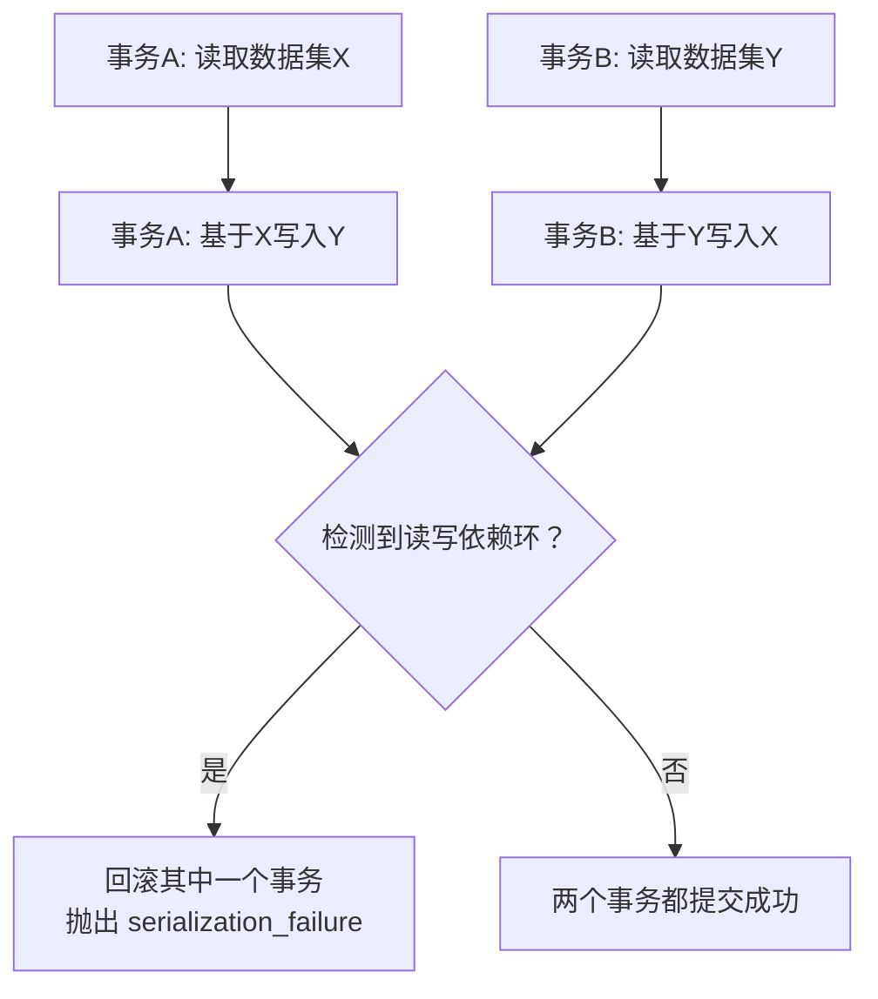

# 事务与锁机制

> **核心问题**：PostgreSQL 的事务隔离级别有哪些？与 MySQL 有什么区别？PG 的锁机制有哪些类型？咨询锁是什么？

---

## 它解决了什么问题？

事务保证一组操作的原子性和一致性，锁机制保证并发操作的正确性。PG 的事务和锁机制与 MySQL 有显著差异——PG 真正实现了 Serializable 隔离级别（基于 SSI），且提供了独特的**咨询锁（Advisory Lock）**，理解这些差异对正确使用 PG 至关重要。

---

# 一、事务隔离级别

## PG 支持的隔离级别

| 隔离级别 | 脏读 | 不可重复读 | 幻读 | 序列化异常 | PG 实现方式 |
|---------|------|-----------|------|-----------|------------|
| Read Uncommitted | ❌ 不会 | ✅ 会 | ✅ 会 | ✅ 会 | 实际等同于 Read Committed |
| **Read Committed（默认）** | ❌ 不会 | ✅ 会 | ✅ 会 | ✅ 会 | 每条语句获取新快照 |
| Repeatable Read | ❌ 不会 | ❌ 不会 | ❌ 不会 | ✅ 会 | 事务开始时获取快照 |
| Serializable | ❌ 不会 | ❌ 不会 | ❌ 不会 | ❌ 不会 | SSI（可序列化快照隔离） |

> **与 MySQL 的关键区别**：
> - PG 默认是 **Read Committed**，MySQL 默认是 **Repeatable Read**
> - PG 的 Read Uncommitted 实际等同于 Read Committed（PG 不允许脏读）
> - PG 的 Repeatable Read **真正防止幻读**（通过快照隔离），MySQL 的 RR 只能部分防止
> - PG 的 Serializable 基于 SSI 算法，性能远优于 MySQL 的串行化（加锁实现）

## 设置隔离级别

```sql
-- 设置当前事务的隔离级别
BEGIN;
SET TRANSACTION ISOLATION LEVEL REPEATABLE READ;
-- ... 执行操作 ...
COMMIT;

-- 设置会话级别的默认隔离级别
SET SESSION CHARACTERISTICS AS TRANSACTION ISOLATION LEVEL READ COMMITTED;

-- 查看当前隔离级别
SHOW transaction_isolation;
```

## SSI（Serializable Snapshot Isolation）

PG 的 Serializable 隔离级别使用 SSI 算法，而非简单的加锁：



- **乐观并发控制**：不提前加锁，而是在提交时检测冲突
- **性能优势**：大多数事务不冲突时，性能接近 Read Committed
- **使用建议**：需要严格一致性的场景（如金融系统），配合重试机制处理 `serialization_failure`

```java
// 使用 Serializable 时需要重试机制
@Retryable(value = SerializationFailureException.class, maxAttempts = 3)
@Transactional(isolation = Isolation.SERIALIZABLE)
public void transferMoney(Long fromId, Long toId, BigDecimal amount) {
    accountMapper.deduct(fromId, amount);
    accountMapper.add(toId, amount);
}
```

---

# 二、锁的类型

## 表级锁

| 锁模式 | 典型触发语句 | 与自身冲突 | 说明 |
|--------|------------|-----------|------|
| `ACCESS SHARE` | SELECT | ❌ | 最弱的锁，只与 ACCESS EXCLUSIVE 冲突 |
| `ROW SHARE` | SELECT FOR UPDATE | ❌ | |
| `ROW EXCLUSIVE` | INSERT/UPDATE/DELETE | ❌ | |
| `SHARE` | CREATE INDEX | ✅ | 阻塞写操作 |
| `ACCESS EXCLUSIVE` | ALTER TABLE / DROP TABLE | ✅ | 最强的锁，阻塞一切操作 |

> **与 MySQL 的区别**：PG 的表级锁更细粒度，有 8 种模式；MySQL 的表锁只有读锁和写锁两种。

## 行级锁

```sql
-- FOR UPDATE：排他行锁，阻塞其他事务的 FOR UPDATE 和修改
SELECT * FROM accounts WHERE id = 1 FOR UPDATE;

-- FOR SHARE：共享行锁，允许其他事务 FOR SHARE，阻塞修改
SELECT * FROM accounts WHERE id = 1 FOR SHARE;

-- FOR NO KEY UPDATE：弱排他锁，不阻塞 FOR KEY SHARE
SELECT * FROM accounts WHERE id = 1 FOR NO KEY UPDATE;

-- FOR KEY SHARE：最弱的行锁，只阻塞 FOR UPDATE
SELECT * FROM accounts WHERE id = 1 FOR KEY SHARE;
```

| 行锁模式 | 阻塞 FOR UPDATE | 阻塞 FOR NO KEY UPDATE | 阻塞 FOR SHARE | 阻塞 FOR KEY SHARE |
|---------|----------------|----------------------|---------------|-------------------|
| FOR UPDATE | ✅ | ✅ | ✅ | ✅ |
| FOR NO KEY UPDATE | ✅ | ✅ | ✅ | ❌ |
| FOR SHARE | ✅ | ✅ | ❌ | ❌ |
| FOR KEY SHARE | ✅ | ❌ | ❌ | ❌ |

> **PG 独有的优势**：`FOR NO KEY UPDATE` 和 `FOR KEY SHARE` 是 PG 特有的细粒度行锁。外键检查使用 `FOR KEY SHARE`，不会阻塞 `FOR NO KEY UPDATE`，大幅减少了外键场景下的锁冲突。

## NOWAIT 和 SKIP LOCKED

```sql
-- NOWAIT：获取不到锁时立即报错，而非等待
SELECT * FROM tasks WHERE status = 'pending' FOR UPDATE NOWAIT;

-- SKIP LOCKED：跳过已被锁定的行（适合任务队列场景）
SELECT * FROM tasks WHERE status = 'pending' 
ORDER BY created_at LIMIT 1 FOR UPDATE SKIP LOCKED;
```

> **实战场景**：`SKIP LOCKED` 非常适合用 PG 实现简单的任务队列——多个消费者并发获取任务时，自动跳过已被其他消费者锁定的任务，无需额外的消息队列中间件。

---

# 三、咨询锁（Advisory Lock）

咨询锁是 PG 独有的**应用层锁**，不与任何数据库对象关联，完全由应用程序控制语义。

## 与普通锁的区别

| 对比项 | 普通锁（行锁/表锁） | 咨询锁（Advisory Lock） |
|--------|-------------------|----------------------|
| 触发方式 | 自动（SELECT/UPDATE 等） | 手动（应用程序显式调用） |
| 锁定对象 | 表、行 | 一个整数 ID（由应用定义语义） |
| 释放时机 | 事务结束自动释放 | 会话级：手动释放或会话结束；事务级：事务结束 |
| 用途 | 保护数据一致性 | 应用层的分布式锁、防重复执行 |

## 使用方式

```sql
-- 会话级咨询锁（需要手动释放）
SELECT pg_advisory_lock(12345);       -- 获取锁（阻塞等待）
-- ... 执行业务逻辑 ...
SELECT pg_advisory_unlock(12345);     -- 释放锁

-- 非阻塞获取（获取不到返回 false）
SELECT pg_try_advisory_lock(12345);   -- 返回 true/false

-- 事务级咨询锁（事务结束自动释放）
BEGIN;
SELECT pg_advisory_xact_lock(12345);  -- 事务结束自动释放
-- ... 执行业务逻辑 ...
COMMIT;
```

## 实战场景

```java
// 场景1：防止定时任务重复执行（多实例部署时）
@Scheduled(cron = "0 0 2 * * ?")
public void dailyReport() {
    // 用任务ID作为锁标识，只有一个实例能获取到锁
    Boolean locked = jdbcTemplate.queryForObject(
        "SELECT pg_try_advisory_lock(1001)", Boolean.class);
    if (!locked) {
        log.info("其他实例正在执行，跳过");
        return;
    }
    try {
        // 执行报表生成逻辑
        generateReport();
    } finally {
        jdbcTemplate.execute("SELECT pg_advisory_unlock(1001)");
    }
}

// 场景2：用户级别的操作互斥（如防止同一用户并发下单）
public void createOrder(Long userId) {
    Boolean locked = jdbcTemplate.queryForObject(
        "SELECT pg_try_advisory_lock(?)", Boolean.class, userId);
    if (!locked) {
        throw new BusinessException("操作太频繁，请稍后重试");
    }
    try {
        // 创建订单逻辑
        orderMapper.insert(order);
    } finally {
        jdbcTemplate.execute("SELECT pg_advisory_unlock(" + userId + ")");
    }
}
```

> **与 Redis 分布式锁的对比**：咨询锁不需要额外的 Redis 组件，适合单数据库场景；Redis 分布式锁适合跨数据库、跨服务的场景。

---

# 四、死锁检测与处理

PG 内置死锁检测器，默认每秒检测一次（`deadlock_timeout = 1s`）：

```sql
-- 查看死锁超时配置
SHOW deadlock_timeout;  -- 默认 1s

-- 查看当前锁等待情况
SELECT 
    blocked.pid AS blocked_pid,
    blocked.query AS blocked_query,
    blocking.pid AS blocking_pid,
    blocking.query AS blocking_query
FROM pg_stat_activity blocked
JOIN pg_locks bl ON bl.pid = blocked.pid
JOIN pg_locks kl ON kl.locktype = bl.locktype 
    AND kl.database IS NOT DISTINCT FROM bl.database
    AND kl.relation IS NOT DISTINCT FROM bl.relation
    AND kl.page IS NOT DISTINCT FROM bl.page
    AND kl.tuple IS NOT DISTINCT FROM bl.tuple
    AND kl.transactionid IS NOT DISTINCT FROM bl.transactionid
    AND kl.pid != bl.pid
JOIN pg_stat_activity blocking ON blocking.pid = kl.pid
WHERE NOT bl.granted;
```

### 避免死锁的实践

1. **固定加锁顺序**：多个事务操作相同的表/行时，按固定顺序加锁
2. **缩短事务时间**：减少锁持有时间
3. **使用 NOWAIT**：获取不到锁时立即失败，而非等待
4. **设置 lock_timeout**：`SET lock_timeout = '5s'`，超时自动放弃

---

# 五、常见问题

**Q：PG 和 MySQL 的默认隔离级别有什么区别？**

> PG 默认 Read Committed，MySQL 默认 Repeatable Read。PG 的 RC 下每条语句获取新快照，能看到其他事务已提交的最新数据；MySQL 的 RR 下整个事务使用同一快照。

**Q：什么是咨询锁？适合什么场景？**

> 咨询锁是 PG 独有的应用层锁，不与数据库对象关联，由应用程序定义语义。适合防止定时任务重复执行、用户级操作互斥等场景。相比 Redis 分布式锁，不需要额外组件，但仅限单数据库场景。

**Q：PG 的 Serializable 和 MySQL 的 Serializable 有什么区别？**

> PG 使用 SSI（可序列化快照隔离）算法，是乐观并发控制，不提前加锁，在提交时检测冲突，性能远优于 MySQL 的串行化（通过加锁实现）。但需要应用层处理 `serialization_failure` 异常并重试。

**Q：SKIP LOCKED 有什么用？**

> `SKIP LOCKED` 跳过已被其他事务锁定的行，非常适合用 PG 实现简单的任务队列。多个消费者并发获取任务时，自动跳过已被锁定的任务，无需额外的消息队列中间件。
