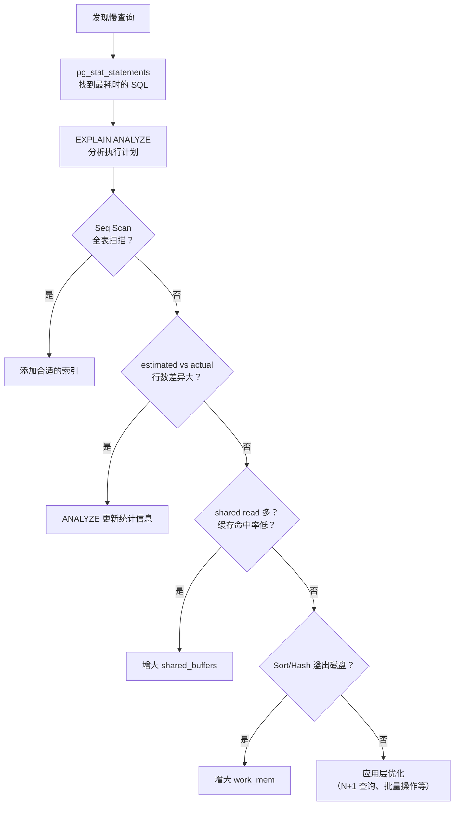

# 性能优化与调优

> **核心问题**：如何分析 PG 的慢查询？如何用 EXPLAIN 和 pg_stat_statements 定位性能瓶颈？有哪些常见的优化手段？

---

## 它解决了什么问题？

数据库性能问题是后端开发中最常见的瓶颈。PG 提供了丰富的性能分析工具（EXPLAIN ANALYZE、pg_stat_statements、auto_explain 等），掌握这些工具能帮助你快速定位慢查询、优化索引设计、调整数据库配置。

---

# 一、EXPLAIN 分析执行计划

## 基本用法

```sql
-- 查看执行计划（不实际执行）
EXPLAIN SELECT * FROM users WHERE email = 'test@example.com';

-- 查看实际执行计划（实际执行，显示真实耗时和行数）
EXPLAIN (ANALYZE, BUFFERS, FORMAT TEXT) 
SELECT * FROM users WHERE email = 'test@example.com';
```

## 关键指标

| 指标 | 含义 | 关注点 |
|------|------|--------|
| **Seq Scan** | 全表扫描 | ⚠️ 大表上需要优化，考虑加索引 |
| **Index Scan** | 索引扫描 + 回表 | ✅ 正常 |
| **Index Only Scan** | 仅索引扫描（覆盖索引） | ✅ 最优 |
| **Bitmap Index Scan** | 位图索引扫描 | ✅ 适合中等选择性查询 |
| **actual time** | 实际耗时（毫秒） | 关注首行时间和总时间 |
| **rows** | 实际返回行数 | 与 estimated rows 对比，差异大说明统计信息不准 |
| **Buffers: shared hit/read** | 缓存命中/磁盘读取的页数 | read 多说明缓存不足 |

## 执行计划示例分析

```sql
EXPLAIN (ANALYZE, BUFFERS) 
SELECT u.name, o.total 
FROM users u JOIN orders o ON u.id = o.user_id 
WHERE o.created_at > '2024-01-01';

-- 输出示例：
-- Hash Join  (cost=1.15..2.45 rows=3 width=40) (actual time=0.05..0.08 rows=3 loops=1)
--   Hash Cond: (o.user_id = u.id)
--   Buffers: shared hit=4
--   ->  Seq Scan on orders o  (cost=0.00..1.25 rows=3 width=16)
--         Filter: (created_at > '2024-01-01')
--         Rows Removed by Filter: 7
--         Buffers: shared hit=1
--   ->  Hash  (cost=1.10..1.10 rows=10 width=36)
--         Buckets: 1024  Batches: 1
--         ->  Seq Scan on users u  (cost=0.00..1.10 rows=10 width=36)
--               Buffers: shared hit=1
```

### 阅读要点

1. **从内到外读**：最内层的节点先执行
2. **关注 actual time**：`actual time=首行时间..总时间`
3. **对比 estimated vs actual rows**：差异大需要 `ANALYZE` 更新统计信息
4. **关注 Buffers**：`shared hit` 是缓存命中，`shared read` 是磁盘读取

---

# 二、pg_stat_statements：慢查询统计

`pg_stat_statements` 是 PG 最重要的性能分析扩展，记录所有 SQL 的执行统计信息。

## 安装与配置

```sql
-- 安装扩展
CREATE EXTENSION IF NOT EXISTS pg_stat_statements;

-- 在 postgresql.conf 中配置（需要重启）
-- shared_preload_libraries = 'pg_stat_statements'
-- pg_stat_statements.max = 10000
-- pg_stat_statements.track = all
```

## 常用查询

```sql
-- Top 10 最耗时的 SQL（总耗时排序）
SELECT 
    calls,
    ROUND(total_exec_time::numeric, 2) AS total_time_ms,
    ROUND(mean_exec_time::numeric, 2) AS avg_time_ms,
    ROUND((100 * total_exec_time / SUM(total_exec_time) OVER())::numeric, 2) AS percent,
    LEFT(query, 100) AS query
FROM pg_stat_statements
ORDER BY total_exec_time DESC
LIMIT 10;

-- Top 10 最慢的 SQL（平均耗时排序）
SELECT 
    calls,
    ROUND(mean_exec_time::numeric, 2) AS avg_time_ms,
    ROUND(max_exec_time::numeric, 2) AS max_time_ms,
    rows,
    LEFT(query, 100) AS query
FROM pg_stat_statements
WHERE calls > 10  -- 过滤掉偶发的 SQL
ORDER BY mean_exec_time DESC
LIMIT 10;

-- 查看缓存命中率（低于 99% 需要关注）
SELECT 
    ROUND(
        SUM(shared_blks_hit)::numeric / 
        NULLIF(SUM(shared_blks_hit + shared_blks_read), 0) * 100, 2
    ) AS cache_hit_ratio
FROM pg_stat_statements;

-- 重置统计信息（定期重置以获取最新数据）
SELECT pg_stat_statements_reset();
```

---

# 三、auto_explain：自动记录慢查询执行计划

```sql
-- 在 postgresql.conf 中配置
-- shared_preload_libraries = 'auto_explain'
-- auto_explain.log_min_duration = 1000   -- 超过 1 秒的查询自动记录执行计划
-- auto_explain.log_analyze = true         -- 记录实际执行时间
-- auto_explain.log_buffers = true         -- 记录缓冲区使用情况

-- 或者在会话级别临时开启
LOAD 'auto_explain';
SET auto_explain.log_min_duration = '500ms';
SET auto_explain.log_analyze = true;
```

---

# 四、索引优化

## 查找缺失索引

```sql
-- 查找全表扫描次数最多的表（可能缺少索引）
SELECT 
    schemaname,
    relname AS table_name,
    seq_scan,
    seq_tup_read,
    idx_scan,
    CASE WHEN seq_scan + idx_scan > 0 
        THEN ROUND(100.0 * idx_scan / (seq_scan + idx_scan), 2) 
        ELSE 0 
    END AS idx_scan_ratio
FROM pg_stat_user_tables
WHERE seq_scan > 100
ORDER BY seq_tup_read DESC
LIMIT 20;

-- 查找未使用的索引（浪费空间和写入性能）
SELECT 
    schemaname,
    relname AS table_name,
    indexrelname AS index_name,
    idx_scan,
    pg_size_pretty(pg_relation_size(indexrelid)) AS index_size
FROM pg_stat_user_indexes
WHERE idx_scan = 0
  AND schemaname = 'public'
ORDER BY pg_relation_size(indexrelid) DESC;
```

## 索引优化建议

| 场景 | 推荐索引类型 | 示例 |
|------|------------|------|
| 等值查询 | B-tree | `CREATE INDEX ON users(email)` |
| 范围查询 | B-tree | `CREATE INDEX ON orders(created_at)` |
| JSONB 字段查询 | GIN | `CREATE INDEX ON docs USING GIN(data)` |
| 全文检索 | GIN + tsvector | `CREATE INDEX ON articles USING GIN(to_tsvector('chinese', content))` |
| 地理位置查询 | GiST | `CREATE INDEX ON locations USING GiST(point)` |
| 超大时序表 | BRIN | `CREATE INDEX ON logs USING BRIN(created_at)` |
| 多列查询 | 联合索引 | `CREATE INDEX ON orders(user_id, status, created_at)` |
| 部分数据查询 | 部分索引 | `CREATE INDEX ON orders(created_at) WHERE status = 'active'` |

## 部分索引（Partial Index）

PG 独有的特性，只对满足条件的行建索引，节省空间和维护成本：

```sql
-- 只对活跃订单建索引（假设 90% 的订单已完成，只有 10% 活跃）
CREATE INDEX idx_active_orders ON orders(created_at) 
WHERE status = 'active';

-- 索引大小只有全量索引的 10%，查询速度更快
EXPLAIN SELECT * FROM orders WHERE status = 'active' AND created_at > '2024-01-01';
-- 使用 idx_active_orders，扫描行数大幅减少
```

---

# 五、配置调优

## 内存相关

```sql
-- shared_buffers：共享缓冲区，推荐设为物理内存的 25%
-- 默认 128MB，生产环境通常设为 4-8GB
SHOW shared_buffers;

-- effective_cache_size：告诉优化器可用的缓存大小（不实际分配内存）
-- 推荐设为物理内存的 50-75%
SHOW effective_cache_size;

-- work_mem：排序和哈希操作的内存，每个操作独立分配
-- 默认 4MB，复杂查询可适当增大，但注意并发连接数 × work_mem 不能超过可用内存
SHOW work_mem;

-- maintenance_work_mem：VACUUM、CREATE INDEX 等维护操作的内存
-- 推荐设为 512MB-1GB
SHOW maintenance_work_mem;
```

## 连接相关

```sql
-- max_connections：最大连接数，默认 100
-- 不建议设太大（每个连接消耗约 10MB 内存），推荐使用连接池（PgBouncer）
SHOW max_connections;
```

## WAL 相关

```sql
-- wal_buffers：WAL 缓冲区，默认 -1（自动计算，通常 16MB）
SHOW wal_buffers;

-- checkpoint_completion_target：检查点完成目标，推荐 0.9
SHOW checkpoint_completion_target;
```

## 推荐配置模板（16GB 内存服务器）

```ini
# 内存
shared_buffers = 4GB
effective_cache_size = 12GB
work_mem = 64MB
maintenance_work_mem = 1GB

# WAL
wal_buffers = 64MB
checkpoint_completion_target = 0.9
max_wal_size = 4GB

# 连接（配合 PgBouncer 使用）
max_connections = 200

# 查询优化
random_page_cost = 1.1          # SSD 磁盘设为 1.1（默认 4.0 适合 HDD）
effective_io_concurrency = 200  # SSD 磁盘设为 200
```

---

# 六、常见性能问题排查



---

# 七、常见问题

**Q：pg_stat_statements 和 EXPLAIN 的区别？什么时候用哪个？**

> `pg_stat_statements` 用于**发现问题**——找到最耗时、最频繁的 SQL；`EXPLAIN ANALYZE` 用于**分析问题**——查看具体 SQL 的执行计划，找到性能瓶颈。先用前者定位问题 SQL，再用后者分析原因。

**Q：PG 的 EXPLAIN 和 MySQL 的 EXPLAIN 有什么区别？**

> PG 的 EXPLAIN 输出是树形结构（从内到外读），显示每个节点的代价估算和实际耗时；MySQL 的 EXPLAIN 输出是表格形式。PG 的 `EXPLAIN (ANALYZE, BUFFERS)` 能显示缓冲区命中情况，对分析 IO 瓶颈更有帮助。

**Q：什么是部分索引？什么场景适合用？**

> 部分索引只对满足 WHERE 条件的行建索引。适合数据分布不均匀的场景，如只有 10% 的订单是活跃状态，对活跃订单建部分索引，索引大小只有全量的 10%，查询更快，维护成本更低。

**Q：random_page_cost 为什么 SSD 要设为 1.1？**

> 默认值 4.0 假设随机 IO 比顺序 IO 慢 4 倍（HDD 场景）。SSD 的随机 IO 和顺序 IO 速度接近，设为 1.1 能让优化器更倾向于使用索引扫描而非全表扫描，生成更优的执行计划。
