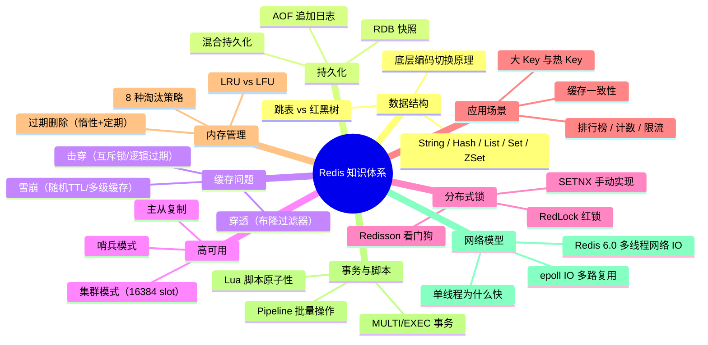

# Redis 缓存设计与高可用

> **学习目标**：从"会用 Redis 命令"升级到"理解原理 → 能设计缓存方案 → 能排查线上问题"
>
> **检验标准**：学完每个模块后，能口述"这个技术解决了什么问题？不用它会怎样？工作中有哪些坑？"

---

## 整体知识地图

---

## 知识点导航

| # | 知识点 | 核心一句话 | 详细文档 |
| :-- | :-- | :-- | :-- |
| 01 | **数据结构与底层编码** | String/Hash/List/Set/ZSet 五种数据结构，底层编码按数据量自动切换 | [数据结构与底层编码](@redis-数据结构与底层编码) |
| 02 | **持久化机制** | RDB 快照恢复快但可能丢数据，AOF 安全但文件大，混合持久化兼顾两者 | [持久化机制RDB与AOF](@redis-持久化机制RDB与AOF) |
| 03 | **缓存三大问题** | 穿透用布隆过滤器，击穿用互斥锁/逻辑过期，雪崩加随机 TTL | [缓存三大问题](@redis-缓存三大问题) |
| 04 | **高可用架构** | 主从复制做读写分离，哨兵做自动故障转移，集群做水平扩展 | [高可用架构](@redis-高可用架构) |
| 05 | **分布式锁** | SETNX 有缺陷，Redisson 看门狗自动续期，RedLock 多节点容错 | [分布式锁](@redis-分布式锁) |
| 06 | **应用型问题** | 缓存一致性用 Cache Aside/延迟双删/Canal，大 Key 要拆分 | [应用型问题](@redis-应用型问题) |
| 07 | **内存管理与淘汰机制** | 惰性+定期删除过期 Key，allkeys-lru 最常用淘汰策略 | [内存管理与淘汰机制](@redis-内存管理与淘汰机制) |
| 08 | **事务与 Lua 脚本** | MULTI/EXEC 事务不支持回滚，Lua 脚本保证原子性 | [事务与Lua脚本](@redis-事务与Lua脚本) |
| 09 | **单线程模型与网络 IO** | 单线程避免锁竞争，epoll 多路复用处理高并发连接 | [单线程模型与网络IO](@redis-单线程模型与网络IO) |

---

## Redis 命名哲学：12 个家族一张图

Redis 的类名 / 配置 / 命令看似零散，但背后有一套**强一致的命名规律**——读懂词根，就能从命令名猜出行为、从配置项猜出生效位置。本站已为 12 个核心家族建立术语卡片（各源头文档都有完整展开，登记在 `.codebuddy/plan/terminology-glossary.md`），本节按"**动词 / 名词 / 修饰词**"三类做顶层俯瞰。

### 一、名词类家族（"这是什么"）

| 家族 | 词根含义 | 源头文档 | 一句话识别规律 |
| :-- | :-- | :-- | :-- |
| **数据结构族** | 5 种基础 + 4 种高级数据类型 | [数据结构与底层编码](@redis-数据结构与底层编码) | 命令首字母即类型：`SET/GET`→String，`HSET`→Hash，`LPUSH`→List，`SADD`→Set，`ZADD`→ZSet |
| **底层编码族** | 同一数据类型的不同内存布局 | [数据结构与底层编码](@redis-数据结构与底层编码) | `int`/`embstr`/`raw`/`listpack`/`ziplist`/`quicklist`/`intset`/`hashtable`/`skiplist`——**小而紧凑 vs 大而灵活**的切换 |
| **持久化族** | 宕机恢复方案 | [持久化机制RDB与AOF](@redis-持久化机制RDB与AOF) | `RDB` = 快照，`AOF` = 日志，`Mixed` = 两者合璧 |
| **Redis 高可用族** | 集群拓扑角色 | [高可用架构](@redis-高可用架构) | `Replication` 读写分离 → `Sentinel` 自动故障转移 → `Cluster` 水平扩展（16384 slot） |
| **缓存问题族** | 缓存失效的 3 种灾难 | [缓存三大问题](@redis-缓存三大问题) | `Penetration` 穿透 / `Breakdown` 击穿 / `Avalanche` 雪崩——**"查不到 / 点过期 / 面过期"** |

### 二、动词类家族（"做什么"）

| 家族 | 词根含义 | 源头文档 | 一句话识别规律 |
| :-- | :-- | :-- | :-- |
| **过期策略族** | 何时删过期 Key | [内存管理与淘汰机制](@redis-内存管理与淘汰机制) | `Lazy` 访问时删 / `Periodic` 定时扫 / `Active` 主动删——**被动 vs 主动**的权衡 |
| **淘汰策略族** | 内存满时选谁淘汰 | [内存管理与淘汰机制](@redis-内存管理与淘汰机制) | `[allkeys/volatile]-[lru/lfu/random/ttl]` + `noeviction`——**范围 + 算法**的笛卡尔积 |
| **事务与脚本族** | 原子性执行的两条路 | [事务与Lua脚本](@redis-事务与Lua脚本) | `MULTI/EXEC` = 乐观锁事务，`Lua Script` = 服务端原子脚本，`Pipeline` = 批量网络优化（**不等于事务**） |
| **分布式锁族** | 跨进程互斥的演进 | [分布式锁](@redis-分布式锁) | `SETNX`（有坑）→ `SET NX PX`（原子）→ `Redisson WatchDog`（自动续期）→ `RedLock`（多节点容错） |

### 三、机制类家族（"怎么做到"）

| 家族 | 词根含义 | 源头文档 | 一句话识别规律 |
| :-- | :-- | :-- | :-- |
| **IO 多路复用族** | 一个线程管千连接 | [单线程模型与网络IO](@redis-单线程模型与网络IO) | `select`/`poll`→`epoll`/`kqueue`/`evport`——**轮询 → 事件通知** 的演进 |
| **Reactor 模式族** | 事件驱动的设计模式 | [单线程模型与网络IO](@redis-单线程模型与网络IO) | `Reactor` 分派 + `Acceptor` 建连 + `Handler` 处理；Redis 6 I/O Threads 仅拆了"读写"不碰命令执行 |
| **缓存一致性模式族** | 缓存与 DB 如何同步 | [应用型问题](@redis-应用型问题) | `Cache Aside`（主流）/ `Read-Through`（透明读）/ `Write-Through`（透明写）/ `Write Behind`（异步写）/ `Delayed Double Delete`（补一刀）/ `Binlog + MQ`（最终一致） |

### 命名规律速记

> ⭐ **Redis 命名三大规律**（看到词就能猜职责）：
>
> 1. **命令 = 类型首字母 + 动作**：`H`SET/`L`PUSH/`S`ADD/`Z`RANGE——第一个字母几乎总是 `String/Hash/List/Set/ZSet` 首字母。
> 2. **配置 = 作用域 + 策略名**：`allkeys-lru` / `volatile-lfu` / `appendfsync-everysec`——连字符前是"管谁"，连字符后是"用什么算法/频率"。
> 3. **内部编码 = 规模前缀 + 结构后缀**：`listpack`（小列表紧凑）/ `quicklist`（大列表链式）/ `intset`（纯整数集合）/ `hashtable`（大哈希表）——**前缀说规模，后缀说结构**。

---

## 高频问题索引

| 问题 | 详见 |
| :-- | :-- |
| Redis 为什么这么快？单线程为什么还快？ | [单线程模型与网络IO](@redis-单线程模型与网络IO) |
| Redis 内存淘汰策略有哪些？过期 Key 如何删除？ | [内存管理与淘汰机制](@redis-内存管理与淘汰机制) |
| 缓存穿透/击穿/雪崩的区别和解决方案？ | [缓存三大问题](@redis-缓存三大问题) |
| 如何保证缓存与数据库的一致性？ | [应用型问题](@redis-应用型问题) |
| 分布式锁怎么实现？Redisson 看门狗原理？ | [分布式锁](@redis-分布式锁) |
| RDB 和 AOF 怎么选？混合持久化是什么？ | [持久化机制RDB与AOF](@redis-持久化机制RDB与AOF) |
| 哨兵模式和集群模式的区别？ | [高可用架构](@redis-高可用架构) |
| 大 Key 和热 Key 怎么处理？ | [应用型问题](@redis-应用型问题) |

---

## 一句话口诀

> String 存缓存，Hash 存对象，List 做队列，Set 做去重，ZSet 做排行榜；
> 穿透用布隆，击穿用互斥锁，雪崩加随机 TTL；
> 高可用靠哨兵，扩容靠集群，分布式锁用 Redisson。

---

## 5. 工作中常见错误速查

| 场景 | 错误做法 | 正确做法 |
| :-- | :-- | :-- |
| 存储对象 | 用 String 存整个 JSON，更新时全量覆盖 | 用 Hash 存对象字段，按需更新单个字段 |
| 缓存过期 | 所有 Key 设置相同 TTL | TTL 加随机偏移量（如 300 + random(60)） |
| 分布式锁 | SETNX 后未设置过期时间 | 使用 `SET key value NX PX milliseconds` 原子命令 |
| 大 Key | 存储几 MB 的 Value | 拆分大 Key，或使用 Hash 分片存储 |
| 热 Key | 单个 Key 承受所有流量 | 本地缓存 + Redis 多副本分散热点 |
| 跨 Slot | Cluster 模式下 mget 多个 Key | 使用哈希标签 `{}` 确保相关 Key 在同一 Slot |
