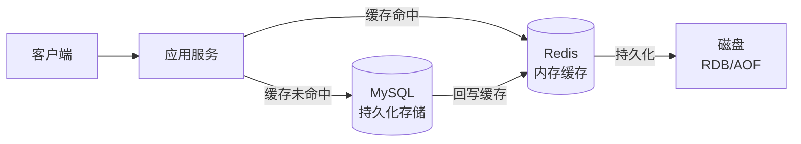

# Redis 缓存设计与高可用

> 本目录将 Redis 核心知识点拆分为独立文件，便于按需学习和复习。

---

## 知识点目录

| 序号 | 文件 | 内容概要 |
|------|------|---------|
| 01 | [数据结构与底层编码](./01-数据结构与底层编码.md) | String/Hash/List/Set/ZSet 五种数据结构、底层编码切换原理、跳表 vs 红黑树 |
| 02 | [持久化机制 RDB 与 AOF](./02-持久化机制RDB与AOF.md) | RDB 快照、AOF 追加日志、混合持久化、持久化方案选型 |
| 03 | [缓存三大问题](./03-缓存三大问题.md) | 缓存穿透（布隆过滤器）、缓存击穿（互斥锁/逻辑过期）、缓存雪崩（随机TTL/多级缓存） |
| 04 | [高可用架构](./04-高可用架构.md) | 主从复制、哨兵模式（自动故障转移）、集群模式（分片/16384 slot） |
| 05 | [分布式锁](./05-分布式锁.md) | SETNX 手动实现的问题、Redisson 看门狗/可重入锁、RedLock 红锁 |
| 06 | [应用型问题](./06-应用型问题.md) | 缓存一致性（Cache Aside/延迟双删/Canal）、排行榜/计数/限流/消息队列/Session 共享、大 Key 与热 Key 处理 |

---

## 1. Redis 解决了什么问题？

**问题背景**：没有 Redis 时，所有请求都直接打到 MySQL，高并发场景下会出现：

| 问题 | 具体表现 | Redis 的解决方案 |
|------|---------|---------------|
| **数据库压力大** | 热点数据每次都查 MySQL，连接数耗尽 | 热点数据缓存在内存，减少 DB 查询 |
| **响应速度慢** | MySQL 磁盘 IO，毫秒级响应 | 内存读写，微秒级响应（快 10 万倍） |
| **无法分布式协调** | 多实例无法共享锁、Session | 分布式锁、分布式 Session |
| **计数/排行榜复杂** | 数据库实现计数器、排行榜性能差 | 原子 INCR、ZSet 天然支持 |

---

## 2. Redis 在系统架构中的位置

---

## 3. 常见问题速查

**Q：Redis 为什么这么快？**
> ① 纯内存操作；② 单线程避免锁竞争；③ IO 多路复用（epoll）；④ 高效的数据结构（跳表、压缩列表等）。注意：Redis 6.0 引入了多线程处理网络 IO，但命令执行仍是单线程。

**Q：Redis 单线程为什么还这么快？**
> 瓶颈在内存和网络 IO，不在 CPU。单线程避免了线程切换和锁竞争开销，反而更高效。Redis 的 QPS 可达 10 万+，对大多数业务场景已经足够。

**Q：Redis 内存淘汰策略有哪些？**
> - `noeviction`：不淘汰，内存满时报错
> - `allkeys-lru`：淘汰最近最少使用的 Key（最常用）
> - `volatile-lru`：只淘汰设置了过期时间的 Key 中最近最少使用的
> - `allkeys-random`：随机淘汰
> - `volatile-ttl`：淘汰剩余 TTL 最短的 Key

**Q：Redis 过期 Key 是如何删除的？**
> ① **惰性删除**：访问时检查是否过期，过期则删除（节省 CPU，但可能内存泄漏）；② **定期删除**：每隔 100ms 随机抽取一批设置了过期时间的 Key 检查删除。两者结合使用，互补不足。

---

## 4. 一句话口诀

> String 存缓存，Hash 存对象，List 做队列，Set 做去重，ZSet 做排行榜；
> 穿透用布隆，击穿用互斥锁，雪崩加随机 TTL；
> 高可用靠哨兵，扩容靠集群，分布式锁用 Redisson。

---

## 5. 工作中常见错误速查

| 场景 | 错误做法 | 正确做法 |
|------|---------|---------| 
| 存储对象 | 用 String 存整个 JSON，更新时全量覆盖 | 用 Hash 存对象字段，按需更新单个字段 |
| 缓存过期 | 所有 Key 设置相同 TTL | TTL 加随机偏移量（如 300 + random(60)） |
| 分布式锁 | SETNX 后未设置过期时间 | 使用 `SET key value NX PX milliseconds` 原子命令 |
| 大 Key | 存储几 MB 的 Value | 拆分大 Key，或使用 Hash 分片存储 |
| 热 Key | 单个 Key 承受所有流量 | 本地缓存 + Redis 多副本分散热点 |
| 跨 Slot | Cluster 模式下 mget 多个 Key | 使用哈希标签 `{}` 确保相关 Key 在同一 Slot |