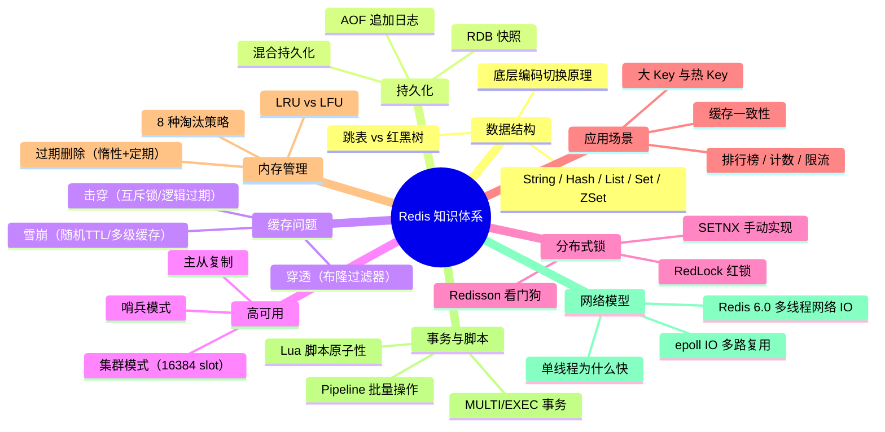

# Redis 缓存设计与高可用

> **学习目标**：从"会用 Redis 命令"升级到"理解原理 → 能设计缓存方案 → 能排查线上问题"
>
> **检验标准**：学完每个模块后，能口述"这个技术解决了什么问题？不用它会怎样？工作中有哪些坑？"

---

## 整体知识地图

---

## 知识点导航

| # | 知识点 | 核心一句话 | 详细文档 |
|---|--------|-----------|---------|
| 01 | **数据结构与底层编码** | String/Hash/List/Set/ZSet 五种数据结构，底层编码按数据量自动切换 | [数据结构与底层编码](@redis-数据结构与底层编码) |
| 02 | **持久化机制** | RDB 快照恢复快但可能丢数据，AOF 安全但文件大，混合持久化兼顾两者 | [持久化机制RDB与AOF](@redis-持久化机制RDB与AOF) |
| 03 | **缓存三大问题** | 穿透用布隆过滤器，击穿用互斥锁/逻辑过期，雪崩加随机 TTL | [缓存三大问题](@redis-缓存三大问题) |
| 04 | **高可用架构** | 主从复制做读写分离，哨兵做自动故障转移，集群做水平扩展 | [高可用架构](@redis-高可用架构) |
| 05 | **分布式锁** | SETNX 有缺陷，Redisson 看门狗自动续期，RedLock 多节点容错 | [分布式锁](@redis-分布式锁) |
| 06 | **应用型问题** | 缓存一致性用 Cache Aside/延迟双删/Canal，大 Key 要拆分 | [应用型问题](@redis-应用型问题) |
| 07 | **内存管理与淘汰机制** | 惰性+定期删除过期 Key，allkeys-lru 最常用淘汰策略 | [内存管理与淘汰机制](@redis-内存管理与淘汰机制) |
| 08 | **事务与 Lua 脚本** | MULTI/EXEC 事务不支持回滚，Lua 脚本保证原子性 | [事务与Lua脚本](@redis-事务与Lua脚本) |
| 09 | **单线程模型与网络 IO** | 单线程避免锁竞争，epoll 多路复用处理高并发连接 | [单线程模型与网络IO](@redis-单线程模型与网络IO) |

---

## 高频问题索引

| 问题 | 详见 |
|------|------|
| Redis 为什么这么快？单线程为什么还快？ | [单线程模型与网络IO](@redis-单线程模型与网络IO) |
| Redis 内存淘汰策略有哪些？过期 Key 如何删除？ | [内存管理与淘汰机制](@redis-内存管理与淘汰机制) |
| 缓存穿透/击穿/雪崩的区别和解决方案？ | [缓存三大问题](@redis-缓存三大问题) |
| 如何保证缓存与数据库的一致性？ | [应用型问题](@redis-应用型问题) |
| 分布式锁怎么实现？Redisson 看门狗原理？ | [分布式锁](@redis-分布式锁) |
| RDB 和 AOF 怎么选？混合持久化是什么？ | [持久化机制RDB与AOF](@redis-持久化机制RDB与AOF) |
| 哨兵模式和集群模式的区别？ | [高可用架构](@redis-高可用架构) |
| 大 Key 和热 Key 怎么处理？ | [应用型问题](@redis-应用型问题) |

---

## 一句话口诀

> String 存缓存，Hash 存对象，List 做队列，Set 做去重，ZSet 做排行榜；
> 穿透用布隆，击穿用互斥锁，雪崩加随机 TTL；
> 高可用靠哨兵，扩容靠集群，分布式锁用 Redisson。

---

## 5. 工作中常见错误速查

| 场景 | 错误做法 | 正确做法 |
|------|---------|---------| 
| 存储对象 | 用 String 存整个 JSON，更新时全量覆盖 | 用 Hash 存对象字段，按需更新单个字段 |
| 缓存过期 | 所有 Key 设置相同 TTL | TTL 加随机偏移量（如 300 + random(60)） |
| 分布式锁 | SETNX 后未设置过期时间 | 使用 `SET key value NX PX milliseconds` 原子命令 |
| 大 Key | 存储几 MB 的 Value | 拆分大 Key，或使用 Hash 分片存储 |
| 热 Key | 单个 Key 承受所有流量 | 本地缓存 + Redis 多副本分散热点 |
| 跨 Slot | Cluster 模式下 mget 多个 Key | 使用哈希标签 `{}` 确保相关 Key 在同一 Slot |