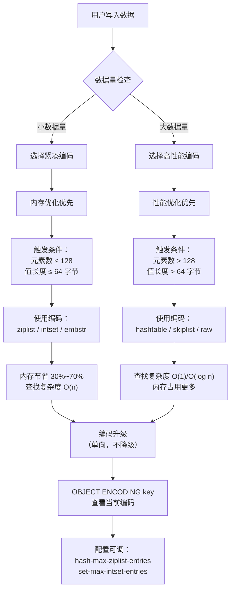
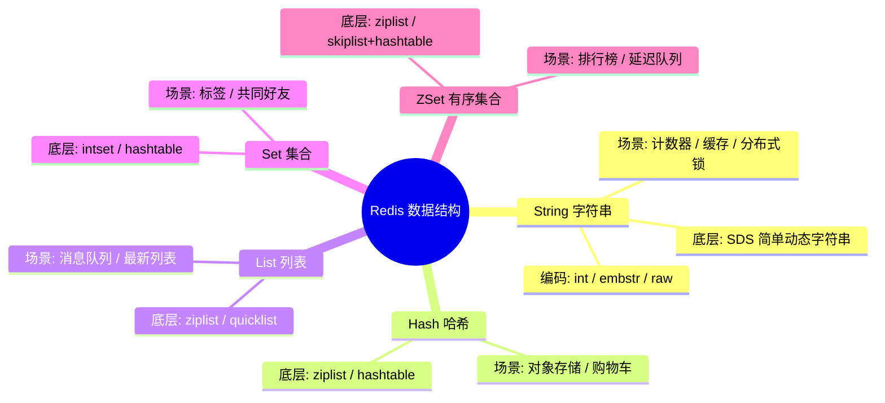
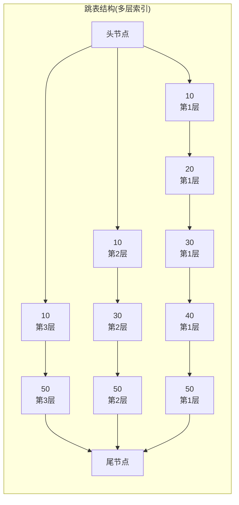

# Redis 数据结构与底层编码

> **一句话记忆口诀**：Redis 对外 5 种数据类型（String/Hash/List/Set/ZSet），对内 9 种底层编码（int/embstr/raw/ziplist/listpack/quicklist/intset/hashtable/skiplist），**按数据量自动切换**——小数据用紧凑编码（省内存、缓存友好）、大数据用高性能编码（O(1)/O(log n) 查找）；阈值（128/64/512）全部可配，ZSet 之所以同时挂跳表和哈希表，是为了**范围查询 + 单点查 score 两个 API 都 O(log n)/O(1)**。

> 📖 **边界声明**：本文聚焦"**Redis 数据类型 + 底层编码 + 跳表原理**"，以下主题请见对应专题：
>
> - 内存回收、过期删除、LRU/LFU 淘汰 → [内存管理与淘汰机制](@redis-内存管理与淘汰机制)
> - RDB/AOF 如何把这些数据结构落盘 → [持久化机制RDB与AOF](@redis-持久化机制RDB与AOF)
> - 大 Key、热 Key 的排查与拆分 → [应用型问题](@redis-应用型问题)
> - 单线程 + epoll 如何驱动这些命令执行 → [单线程模型与网络IO](@redis-单线程模型与网络IO)

---

## 1. 引入：为什么要了解底层编码？

**类比**：Redis 的 5 种数据类型 ≈ **工具箱里的 5 种工具**，底层编码 ≈ **工具的不同材质和结构**：

- **小螺丝刀**（ziplist/intset）：小巧精致，处理小零件（小数据量）时效率高、不占地方
- **大扳手**（hashtable/skiplist）：粗壮有力，处理大部件（大数据量）时力量足、速度快
- **智能工具箱**（自动切换）：根据任务大小自动选择最合适的工具，既省空间又保证效率

Redis 对外暴露的是 5 种数据类型（String/Hash/List/Set/ZSet），但底层会根据数据量大小**自动切换编码方式**。

- 数据量小时：使用**紧凑型编码**（ziplist/intset），内存利用率高
- 数据量大时：切换为**高性能编码**（hashtable/skiplist），查询性能好

**编码切换流程图**：



理解底层编码，能帮助你：

- 解释为什么 Redis 内存占用有时出乎意料地小
- 在面试中回答"Redis 为什么快"、"ZSet 为什么用跳表"等高频问题
- 合理设计 Key 结构，避免触发不必要的编码升级

---

## 2. 五种数据结构全景图



---

## 3. 各数据结构详解

!!! note "📖 术语家族：`Redis 数据类型族`"
    **字面义**：Redis 对外暴露的 5 种**用户可见**的数据类型，每个类型对应一套独立的命令集（`SET` / `HSET` / `LPUSH` / `SADD` / `ZADD`）。  
    **在 Redis 中的含义**：数据类型 ≠ 底层编码——同一个数据类型（如 Hash）在**数据量小**时用 `ziplist`/`listpack`、**数据量大**时切换到 `hashtable`，对用户完全透明。  
    **同家族成员**：

    | 成员 | 命令前缀 | 底层编码 | 典型用途 |
    | :-- | :-- | :-- | :-- |
    | `String` | `SET` / `GET` / `INCR` | int / embstr / raw | 缓存、计数器、分布式锁 |
    | `Hash` | `HSET` / `HGET` / `HGETALL` | ziplist / hashtable | 对象存储、购物车 |
    | `List` | `LPUSH` / `RPUSH` / `BLPOP` | ziplist / quicklist | 消息队列、最新列表 |
    | `Set` | `SADD` / `SINTER` / `SRANDMEMBER` | intset / hashtable | 标签、共同好友、抽奖 |
    | `ZSet` | `ZADD` / `ZRANGE` / `ZRANGEBYSCORE` | ziplist / skiplist+hashtable | 排行榜、延迟队列 |

    **扩展类型**（不在本文展开）：`Bitmap`（基于 String）、`HyperLogLog`（基于 String 的基数统计）、`GEO`（基于 ZSet 的地理位置）、`Stream`（5.0 新增的消息流）。  
    **命名规律**：**首字母**标识命令归属（`H*` 操作 Hash、`L*` 操作 List、`S*` 操作 Set、`Z*` 操作 ZSet），看到命令前缀就能猜出数据类型，**String 是默认空间所以没前缀**。

### 3.1 String 字符串

String 是 Redis 最基础的数据类型，存储的是**一个 key 对应一个值**，值可以是：

- 普通字符串（如 `"hello"`）
- 整数（如 `100`）
- 二进制数据（如序列化后的对象、图片字节）

**存储形式**：

```txt
key  →  value（单个值）

"user:123:name"  →  "张三"
"article:views"  →  1024
"session:abc"    →  "{...json...}"
```

**底层实现：SDS（Simple Dynamic String，简单动态字符串）**：

!!! note "📖 术语家族：`SDS 简单动态字符串族`"
    **字面义**：Simple Dynamic String = 简单 + 动态 + 字符串，Redis 对 C 语言原生字符串的**封装和增强**。
    **在 Redis 中的含义**：Redis 所有字符串（键名、键值、Hash 字段等）的**底层存储引擎**，解决 C 字符串的**长度计算 O(n)、缓冲区溢出、二进制不安全**三大痛点。
    **同家族成员**：

    | 成员 | 结构特点 | 适用场景 |
    | :-- | :-- | :-- |
    | `sdshdr5`（Redis 3.2 前） | 固定头 8 字节，存长度 ≤ 31 的字符串 | 已废弃，兼容性保留 |
    | `sdshdr8` | 头 3 字节（len + alloc + flags），存长度 ≤ 255 | 短字符串，如键名、短值 |
    | `sdshdr16` | 头 5 字节，存长度 ≤ 65535 | 中等长度字符串 |
    | `sdshdr32` | 头 9 字节，存长度 ≤ 2^32-1 | 长字符串，如大 JSON、序列化对象 |
    | `sdshdr64` | 头 17 字节，存长度 ≤ 2^64-1 | 超长字符串（理论值） |

    **核心优势**：
    
    1. **O(1) 长度获取**：`sdshdr->len` 直接读取，不用遍历 `\0`
    2. **杜绝缓冲区溢出**：`sdshdr->alloc` 记录总容量，追加前检查空间
    3. **二进制安全**：可存任意字节（含 `\0`），支持图片、序列化数据
    4. **兼容 C 字符串**：`buf` 字段仍以 `\0` 结尾，可直接用 `printf`
    5. **内存预分配**：空间不足时按**倍增策略**扩容，减少重分配次数
    6. **惰性空间释放**：缩容不立即缩内存，`sdshdr->free` 记录空闲空间

**三种编码方式**：

| 编码 | 触发条件 | 内存特点 | 时间复杂度 |
| :-- | :-- | :-- | :-- |
| `int` | 值为整数且在 long 范围内 | 直接存整数，最省内存 | O(1) |
| `embstr` | 字符串长度 ≤ 44 字节 | 对象头和 SDS 连续分配，一次内存分配 | O(1) |
| `raw` | 字符串长度 > 44 字节 | 对象头和 SDS 分开分配，两次内存分配 | O(1) |

**常用命令**：

```bash
SET key value [EX seconds] [NX]   # 设置值，NX=不存在才设置
GET key                            # 获取值
INCR key                           # 原子自增（计数器）
SETNX key value                    # 不存在才设置（分布式锁基础）
MSET k1 v1 k2 v2                   # 批量设置
```

**典型场景**：

- **缓存**：`SET user:123 "{name:'张三'}" EX 300`
- **计数器**：`INCR article:123:views`（原子操作，不会并发问题）
- **分布式锁**：`SET lock:order uuid NX PX 30000`

---

### 3.2 Hash 哈希

Hash 是一个 key 对应**一组键值对（field-value）**，类似 Java 中的 `HashMap`，适合存储一个对象的多个属性。

**存储形式**：

```txt
key  →  { field1: value1, field2: value2, ... }

"user:123"  →  {
    "name":  "张三",
    "age":   "25",
    "email": "zhangsan@qq.com"
}
```

**和 String 存 JSON 的区别**：

| 存储方式 | 更新单个字段 | 内存效率 | 并发安全 |
| :-- | :-- | :-- | :-- |
| String 存 JSON | 需全量覆盖，O(n) | 较差（含 JSON 格式开销） | ❌ 并发覆盖风险 |
| Hash 存字段 | 独立更新，O(1) | 较好（无格式开销） | ✅ 原子操作安全 |

**两种编码方式**：

!!! note "📖 术语家族：`ziplist 压缩列表族`"
    **字面义**：Zip List = 压缩 + 列表，**连续内存块**存储多个元素的紧凑结构。  
    **在 Redis 中的含义**：Redis 3.2 前 Hash/List/ZSet **小数据量**的默认编码，**内存极致压缩**但**插入删除 O(n)** 性能差，Redis 7.0 被 `listpack` 全面替代。  
    **结构特点**：

    - **连续内存**：所有元素紧挨着存储，无指针开销
    - **变长编码**：整数用变长编码，短整数占 1 字节
    - **双向遍历**：每个元素记录**前驱长度**，支持反向遍历
    - **级联更新缺陷**：插入/删除可能触发后续元素的**前驱长度字段连锁更新**

    **同家族演变**：

    | 版本 | 编码 | 改进点 | 缺陷 |
    | :-- | :-- | :-- | :-- |
    | Redis 3.2 前 | `ziplist` | 内存极致压缩（省 70%+） | 级联更新 O(n^2) 最坏情况 |
    | Redis 3.2~6.2 | `quicklist`（节点为 ziplist） | 链表结构避免级联更新扩散 | 单个 ziplist 节点内仍有级联风险 |
    | Redis 7.0+ | `listpack` | 彻底解决级联更新，单元素操作不影响邻居 | 兼容 ziplist 配置名但底层已替换 |

    **配置阈值**（Redis 7.0+ 实际控制 listpack）：

    - `hash-max-ziplist-entries 512`：Hash 字段数 ≤ 512 用 listpack
    - `hash-max-ziplist-value 64`：Hash 单个字段值 ≤ 64 字节
    - `zset-max-ziplist-entries 128`：ZSet 元素数 ≤ 128
    - `zset-max-ziplist-value 64`：ZSet 单个元素值 ≤ 64 字节

!!! warning "版本差异：Redis 7.0+ 的 listpack 替代"
    **Redis 7.0 重大变化**：`ziplist` 编码**被 `listpack` 全面替代**，但**配置项名称保持不变**（兼容性考虑）。

    - **Redis 6.x 及更早**：`OBJECT ENCODING key` 返回 `"ziplist"`
    - **Redis 7.0+**：`OBJECT ENCODING key` 返回 `"listpack"`
    
    虽然编码名变了，但**阈值配置项名不变**（如 `hash-max-ziplist-entries`），**行为完全兼容**。

| 编码 | 触发条件 | 特点 | 时间复杂度 |
| :-- | :-- | :-- | :-- |
| `ziplist`（压缩列表） | 字段数 ≤ 128 且所有值长度 ≤ 64 字节 | 连续内存，节省空间 | O(n) 查找 |
| `hashtable`（哈希表） | 超出上述阈值 | 查找 O(1)，但内存占用更多 | O(1) |

**常用命令**：

```bash
HSET user:123 name "张三" age 25   # 设置字段
HGET user:123 name                  # 获取单个字段
HMGET user:123 name age             # 批量获取字段
HGETALL user:123                    # 获取所有字段
HINCRBY user:123 age 1              # 字段自增
HDEL user:123 age                   # 删除字段
```

**典型场景**：

- **用户信息存储**：每个字段独立更新，避免全量覆盖
- **购物车**：`HSET cart:user123 product:456 2`（商品ID → 数量）

> ⚠️ **避坑**：不要用 String 存整个 JSON 对象，更新时需全量覆盖，并发场景下会互相覆盖。用 Hash 存对象字段，可按需更新单个字段。

---

### 3.3 List 列表

List 是一个 key 对应**一组有序的字符串列表**，底层是双向链表结构，支持从两端插入和弹出，类似 Java 的 `LinkedList`。

**存储形式**：

```txt
key  →  [ v1, v2, v3, v4, ... ]（有序，可重复）

"news:list"  →  ["文章3", "文章2", "文章1"]   ← 左边是最新
"task:queue" →  ["任务A", "任务B", "任务C"]   ← 右边是最早入队
```

**特点**：

- 有序（按插入顺序）
- 允许重复元素
- 支持两端操作（左进左出 = 栈，右进左出 = 队列）
- 支持阻塞弹出（`BLPOP`），天然适合做消息队列

**两种编码方式**：

!!! note "📖 术语家族：`quicklist 快速列表族`"
    **字面义**：Quick List = 快速 + 列表，**双向链表 + 压缩列表节点**的混合结构。  
    **在 Redis 中的含义**：Redis 3.2 引入的 List **默认编码**，解决 `ziplist` 级联更新和 `linkedlist` 内存碎片两大痛点，**兼顾内存效率与操作性能**。  
    **结构特点**：

    - **宏观链表**：双向链表结构，支持 O(1) 头尾插入删除
    - **微观压缩**：每个节点是一个 `ziplist`/`listpack`，保持连续内存优势
    - **大小可配**：`list-max-ziplist-size` 控制单个节点最大容量（默认 -2 = 8KB）
    - **压缩深度**：`list-compress-depth` 控制两端不压缩的节点数（LZF 压缩）

    **同家族成员**：

    | 成员 | 节点类型 | 适用场景 |
    | :-- | :-- | :-- |
    | `ziplist 节点`（Redis 3.2~6.2） | 传统 ziplist，有级联更新风险 | 小数据量，内存极致压缩 |
    | `listpack 节点`（Redis 7.0+） | 无级联更新的 listpack | 默认配置，安全高效 |

    **性能权衡**：

    - **头尾操作**：O(1)（直接操作链表两端）
    - **中间插入**：O(n)（需找到对应节点 + 在 ziplist 内移动）
    - **内存效率**：比纯链表省 30%~70%（ziplist 连续内存）
    - **缓存友好**：局部性原理，相邻元素大概率在同一 CPU 缓存行

!!! tip "版本演进：节点类型变化"
    - **Redis 3.2~6.2**：quicklist 节点使用 `ziplist`，有级联更新风险
    - **Redis 7.0+**：quicklist 节点默认使用 `listpack`，彻底解决级联更新

    可通过 `list-max-listpack-size` 配置（Redis 7.0+），但**配置项名仍兼容** `list-max-ziplist-size`。

| 编码 | 触发条件 | 特点 | 时间复杂度 |
| :-- | :-- | :-- | :-- |
| `ziplist`（压缩列表） | 元素数 ≤ 128 且所有值长度 ≤ 64 字节 | 连续内存，节省空间 | O(n) 查找 |
| `quicklist`（快速列表） | 超出上述阈值 | 双向链表 + 每个节点是 ziplist，兼顾内存和性能 | O(1) 头尾，O(n) 中间 |

**常用命令**：

```bash
LPUSH list v1 v2 v3    # 从左侧插入（栈）
RPUSH list v1 v2 v3    # 从右侧插入（队列）
LPOP list              # 从左侧弹出
RPOP list              # 从右侧弹出
LRANGE list 0 -1       # 获取所有元素
LLEN list              # 获取长度
BLPOP list 10          # 阻塞弹出，等待最多10秒（消息队列）
```

**典型场景**：

- **消息队列**：`RPUSH queue msg` + `BLPOP queue 0`（阻塞消费）
- **最新动态**：`LPUSH news article1`，`LRANGE news 0 9` 取最新10条
- **分页列表**：`LRANGE list (page-1)*size page*size-1`

---

### 3.4 Set 集合

Set 是一个 key 对应**一组无序、不重复的字符串集合**，类似 Java 的 `HashSet`。核心特性是**自动去重**，并且支持集合间的交集、并集、差集运算。

**存储形式**：

```txt
key  →  { v1, v2, v3, ... }（无序，不重复）

"user:123:tags"    →  {"Java", "Redis", "MySQL"}
"user:123:friends" →  {"uid:456", "uid:789", "uid:101"}
"user:456:friends" →  {"uid:123", "uid:789"}

// 共同好友 = SINTER user:123:friends user:456:friends
// 结果: {"uid:789"}
```

**特点**：

- 无序
- 自动去重（同一个值加多次只保留一个）
- 支持集合运算（交集/并集/差集），非常适合关系类场景

**两种编码方式**：

| 编码 | 触发条件 | 特点 | 时间复杂度 |
| :-- | :-- | :-- | :-- |
| `intset`（整数集合） | 所有元素都是整数且元素数 ≤ 512 | 有序整数数组，内存紧凑 | O(log n) 二分查找 |
| `hashtable`（哈希表） | 超出上述阈值 | 查找 O(1)，但内存占用更多 | O(1) |

**常用命令**：

```bash
SADD tags "Java" "Redis" "MySQL"   # 添加元素
SMEMBERS tags                       # 获取所有元素
SISMEMBER tags "Java"               # 判断是否存在
SINTER tags1 tags2                  # 交集（共同好友）
SUNION tags1 tags2                  # 并集
SDIFF tags1 tags2                  # 差集
SRANDMEMBER tags 3                  # 随机取3个（抽奖）
SCARD tags                          # 元素数量
```

**典型场景**：

- **标签系统**：`SADD user:123:tags "Java" "后端"`
- **共同好友**：`SINTER user:123:friends user:456:friends`
- **抽奖**：`SRANDMEMBER lottery 3`（随机不重复抽取）
- **UV 统计**：`SADD uv:20240101 user123`（自动去重）

---

### 3.5 ZSet 有序集合

ZSet（Sorted Set）是一个 key 对应**一组有序、不重复的成员集合**，每个成员都关联一个**浮点数分值（score）**，Redis 根据 score 自动排序。可以理解为 Set + 排序能力。

**存储形式**：

```txt
key  →  { member1: score1, member2: score2, ... }（按 score 自动排序）

"leaderboard"  →  {
    "张三": 100,
    "王五": 150,
    "李四": 200     ← score 越大排名越靠前
}

"delay:queue"  →  {
    "task:A": 1712500000,   ← score 是执行时间戳
    "task:B": 1712500060,
    "task:C": 1712500120
}
```

**特点**：

- 成员不重复，但 score 可以相同
- 按 score 自动排序，支持范围查询
- 同时维护一个哈希表，可以 O(1) 查某个成员的 score

**两种编码方式**:

!!! note "📖 术语家族：`listpack 列表包族`"
    **字面义**：List Pack = 列表 + 包，**无级联更新的紧凑结构**。  
    **在 Redis 中的含义**：Redis 7.0 引入，**全面替代 ziplist**，解决级联更新问题，同时保持内存紧凑优势。  
    **结构特点**：

    - **固定长度编码**：每个元素独立编码，无前驱长度依赖
    - **无级联更新**：插入/删除只影响当前元素，不触发邻居更新
    - **内存紧凑**：连续内存存储，CPU 缓存友好
    - **双向遍历**：支持正向/反向遍历
  
    **与 ziplist 对比**：

    | 特性 | ziplist（Redis 6.x） | listpack（Redis 7.0+） |
    | :-- | :-- | :-- |
    | **级联更新** | ❌ 有风险（最坏 O(n^2)） | ✅ 彻底解决 |
    | **内存效率** | ✅ 极致压缩 | ✅ 同等压缩率 |
    | **插入性能** | ⚠️ 可能 O(n^2) | ✅ 稳定 O(n) |
    | **删除性能** | ⚠️ 可能 O(n^2) | ✅ 稳定 O(n) |
    | **配置兼容** | 专用配置项 | 兼容 ziplist 配置名 |

    **适用场景**：

    - Hash/ZSet 的小数据量紧凑存储
    - quicklist 的节点内部存储
    - 任何需要内存极致压缩的场景

!!! warning "Redis 7.0+ 编码变化"
    **Redis 7.0 重大变化**：ZSet 的紧凑编码从 `ziplist` 改为 `listpack`。

    - **Redis 6.x**：`OBJECT ENCODING zset_key` 返回 `"ziplist"`
    - **Redis 7.0+**：`OBJECT ENCODING zset_key` 返回 `"listpack"`
    
    **配置项兼容**：`zset-max-ziplist-entries` 等配置名保持不变，但实际控制的是 listpack 阈值。

| 编码 | 触发条件 | 特点 | 时间复杂度 |
| :-- | :-- | :-- | :-- |
| `ziplist`（压缩列表） | 元素数 ≤ 128 且所有值长度 ≤ 64 字节 | 连续内存，节省空间 | O(n) 查找 |
| `skiplist + hashtable`（跳表+哈希表） | 超出上述阈值 | 跳表支持范围查询，hashtable 支持 O(1) 按 member 查 score | O(log n) 查找，O(1) 查score |

**常用命令**：

```bash
ZADD rank 100 "张三" 200 "李四"    # 添加元素（score member）
ZRANGE rank 0 -1 WITHSCORES        # 按 score 升序获取
ZREVRANGE rank 0 9                  # 按 score 降序获取前10
ZRANGEBYSCORE rank 100 200          # 按 score 范围查询
ZSCORE rank "张三"                  # 获取某成员的 score
ZRANK rank "张三"                   # 获取排名（从0开始）
ZINCRBY rank 50 "张三"              # 增加 score
```

**典型场景**：

- **排行榜**：`ZADD leaderboard score userId`，`ZREVRANGE leaderboard 0 9` 取 Top10
- **延迟队列**：score 存执行时间戳，定时 `ZRANGEBYSCORE queue 0 now` 取到期任务
- **热搜词**：`ZINCRBY hot:search 1 "关键词"`，`ZREVRANGE hot:search 0 9` 取 Top10

---

## 4. 跳表（SkipList）原理详解

> ZSet 在数据量大时使用跳表，面试高频考点。

### 4.1 跳表结构图



**查找过程**：从最高层开始，向右走到不能走为止，再向下一层继续，直到找到目标节点。

### 4.2 跳表 vs 红黑树

| 对比项 | 跳表 | 红黑树 |
| :-- | :-- | :-- |
| **查找时间复杂度** | O(log n) | O(log n) |
| **范围查询效率** | ✅ 高效（定位后顺序遍历链表） | ⚠️ 需要中序遍历 O(n) |
| **实现复杂度** | 简单（随机层数） | 复杂（旋转/变色） |
| **内存占用** | 稍多（多层指针） | 较少 |
| **并发友好度** | ✅ 局部修改，锁粒度细 | ⚠️ 全局平衡，锁粒度粗 |
| **缓存友好度** | ⚠️ 多层指针，局部性差 | ✅ 树结构，局部性好 |

**Redis 选择跳表而非红黑树的原因**：

1. **实现更简单**：跳表通过随机层数实现平衡，代码更易维护
2. **范围查询更高效**：`ZRANGEBYSCORE` 是 ZSet 的高频操作，跳表定位后直接顺序遍历
3. **内存可控**：通过随机层数控制平均层数约为 log n
4. **并发友好**：跳表局部修改 vs 红黑树全局平衡（锁粒度更细）

---

## 5. 为什么小数据量用 ziplist？

!!! note "📖 术语家族：`Redis 底层编码族`"
    **字面义**：Redis 内部**实际**使用的数据结构家族——每个数据类型可以有多种编码，按数据量阈值**自动升级**，**从不降级**（避免抖动）。  
    **在 Redis 中的含义**：编码选择遵循"**小数据省内存、大数据重性能**"原则。`OBJECT ENCODING <key>` 命令可查看任意 Key 的当前编码。  
    **同家族成员**：

    | 编码 | 所属类型 | 升级阈值 | 时间复杂度 | 空间特性 |
    | :-- | :-- | :-- | :-- | :-- |
    | `int` | String | 值超出 long 范围 | O(1) | 最省，8 字节 |
    | `embstr` | String | 长度 > 44 字节 | O(1) | 对象头 + SDS 连续分配 |
    | `raw` | String | — | O(1) | 对象头 + SDS 分离分配 |
    | `intset` | Set | 非整数 或 > `set-max-intset-entries`（512）| O(log n) 二分查找 | 最紧凑的整数数组 |
    | `ziplist` | Hash/List/ZSet（旧版）| > `*-max-ziplist-entries`（128）或单元素 > 64 字节 | O(n) | 连续内存、CPU 缓存友好 |
    | `listpack` | Hash/ZSet（7.0 起替代 ziplist）| 同上 | O(n) | 解决 ziplist 级联更新问题 |
    | `quicklist` | List | — | O(1) 两端、O(n) 中间 | 链表 + ziplist/listpack 节点 |
    | `hashtable` | Hash/Set | — | O(1) | 查找最快、内存最费 |
    | `skiplist` | ZSet | — | O(log n) | 范围查询友好 |

    **关键配置项**：`hash-max-ziplist-entries` / `hash-max-ziplist-value` / `list-max-ziplist-size` / `zset-max-ziplist-entries` / `zset-max-ziplist-value` / `set-max-intset-entries`，**Redis 7.0+** 对应的 `ziplist` 配置名全部替换为 `listpack`（兼容老名）。

    **命名规律**：

    - `*list` / `*pack` 表明**线性结构（省内存）**，  
    - `*table` / `*skip*` 表明**索引结构（查得快）**；  
    - 小数据用前者、大数据用后者，**阈值由配置项控制、可运行时调整**。

**ziplist（压缩列表）的特点**：

- 连续内存存储，内存利用率高
- CPU 缓存友好（局部性原理）
- 查找是 O(n)，数据量大时性能差

**阈值设计的工程权衡**：

| 数据量 | 编码选择 | 性能特点 | 内存特点 |
| :-- | :-- | :-- | :-- |
| **小数据量（< 128 个元素）** | ziplist | O(n) 查找代价可接受（128次遍历很快） | 连续内存，缓存命中率高，内存节省明显 |
| **大数据量（> 128 个元素）** | hashtable/skiplist | O(1)/O(log n) 查找，性能优先 | 内存占用更多，用空间换时间 |

> 这个阈值（128/512 等）是工程上的经验值，可通过 `hash-max-ziplist-entries` 等配置项调整。

---

## 6. 常见问题

**Q：Redis 的 ZSet 底层为什么同时用跳表和哈希表？**
> 跳表支持按 score 范围查询（`ZRANGEBYSCORE`），哈希表支持按 member 查 score（`ZSCORE`，O(1)）。两者互补，覆盖 ZSet 的所有操作场景。

**Q：ziplist 和 quicklist 的区别？**
> ziplist 是纯连续内存，插入删除需要移动数据，数据量大时性能差。quicklist 是双向链表，每个节点是一个 ziplist，兼顾了内存效率（ziplist 压缩）和操作性能（链表 O(1) 插入删除）。

**Q：intset 是什么？**
> 整数集合，有序整数数组，支持二分查找（O(log n)）。当 Set 中所有元素都是整数且数量不超过 512 时使用，内存极为紧凑。

**Q：Redis 7.0 的 listpack 相比 ziplist 有什么改进？**
> listpack 解决了 ziplist 的**级联更新**问题。在 ziplist 中，插入/删除元素可能触发后续所有元素的`prevlen`字段连锁更新（最坏 O(n^2)）。listpack 改用**固定长度编码**，单元素操作不影响邻居，**彻底消除级联更新**，同时保持 ziplist 的内存紧凑优势。

**Q：编码切换是双向的吗？升级后还会降级吗？**
> **单向升级，从不降级**。一旦从紧凑编码（ziplist/intset）升级到高性能编码（hashtable/skiplist），即使后续数据量减少，**也不会自动降级**。这是为了避免编码频繁切换带来的性能抖动。如需降级，必须删除 Key 后重新写入。

**Q：紧凑编码（ziplist/intset）能节省多少内存？**
> 实测数据：小数据量下，ziplist 比 hashtable **节省 30%~70% 内存**。例如存储 100 个字段的 Hash，ziplist 约 1KB，hashtable 约 3KB。intset 存储 500 个整数约 2KB，hashtable 约 8KB。**内存节省主要来自**：连续内存无指针开销、变长编码压缩小整数、无哈希表元数据开销。

**Q：如何查看一个 Key 当前使用的编码？**
> 使用 `OBJECT ENCODING key` 命令。例如：`OBJECT ENCODING user:123` 返回 `"ziplist"` 或 `"hashtable"`。结合 `DEBUG OBJECT key` 可查看更详细的内存信息（但生产环境慎用 DEBUG 命令）。

**Q：编码切换的阈值可以动态调整吗？**
> **可以**。所有 `*-max-*` 配置项（如 `hash-max-ziplist-entries`）都支持 `CONFIG SET` 动态调整，**立即生效**。但调整后**只影响新写入的数据**，已有 Key 的编码不会自动重编码。如需重编码现有数据，需删除后重新写入。

**Q：为什么 String 的 embstr 和 raw 分界线是 44 字节？**
> 这是 Redis 对象头的内存对齐结果。RedisObject 占 16 字节，sdshdr8 头占 3 字节，加上 `\0` 结尾 1 字节，共 20 字节。64 字节缓存行 - 20 = 44 字节可用数据空间。≤44 字节时对象头+SDS 可分配在**同一缓存行**，>44 字节则分到不同内存块。

**Q：Redis 7.0 的 listpack 配置项名为什么还叫 ziplist？**
> **向后兼容性**考虑。虽然底层实现从 ziplist 改为 listpack，但**配置项名保持不变**，避免用户升级时修改配置。`hash-max-ziplist-entries` 等配置名在 Redis 7.0+ 实际控制的是 listpack 的阈值。

**Q：Redis 7.0 升级后，已有的 ziplist 数据会自动转成 listpack 吗？**
> **不会自动转换**。Redis 7.0 升级后：
>
> - **新写入的数据**：使用 listpack 编码
> - **已存在的 ziplist 数据**：保持 ziplist 编码不变
> - **当数据修改时**：如果触发编码升级，会升级到 hashtable/skiplist，**不会降级到 listpack**
>
> 如需将旧数据转为 listpack，需删除 Key 后重新写入。
