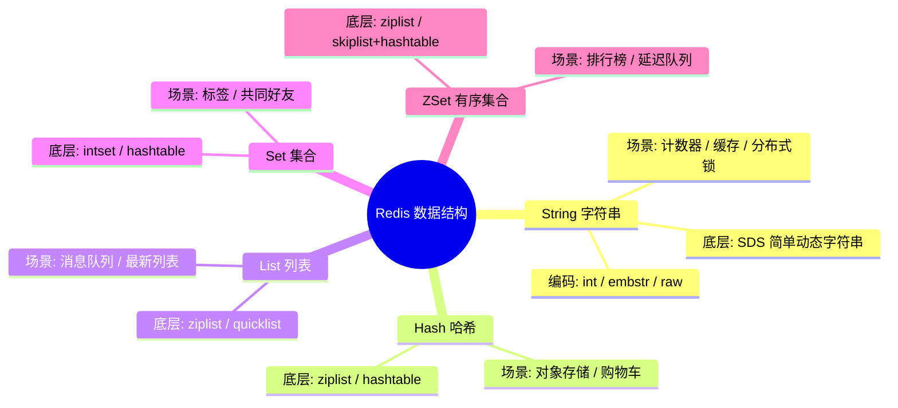
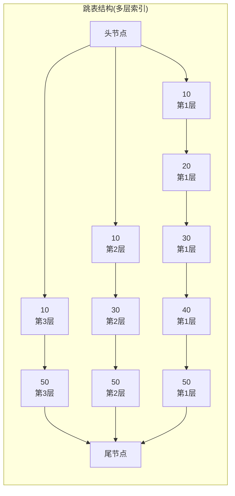

# Redis 数据结构与底层编码

---

## 1. 引入：为什么要了解底层编码？

Redis 对外暴露的是 5 种数据类型（String/Hash/List/Set/ZSet），但底层会根据数据量大小**自动切换编码方式**。

- 数据量小时：使用**紧凑型编码**（ziplist/intset），内存利用率高
- 数据量大时：切换为**高性能编码**（hashtable/skiplist），查询性能好

理解底层编码，能帮助你：
- 解释为什么 Redis 内存占用有时出乎意料地小
- 在面试中回答"Redis 为什么快"、"ZSet 为什么用跳表"等高频问题
- 合理设计 Key 结构，避免触发不必要的编码升级

---

## 2. 五种数据结构全景图



---

## 3. 各数据结构详解

### 3.1 String 字符串

**是什么？**

String 是 Redis 最基础的数据类型，存储的是**一个 key 对应一个值**，值可以是：
- 普通字符串（如 `"hello"`）
- 整数（如 `100`）
- 二进制数据（如序列化后的对象、图片字节）

**存储形式**：
```
key  →  value（单个值）

"user:123:name"  →  "张三"
"article:views"  →  1024
"session:abc"    →  "{...json...}"
```

**底层实现：SDS（Simple Dynamic String，简单动态字符串）**

SDS 相比 C 语言原生字符串的优势：
- 记录字符串长度，`STRLEN` 命令 O(1) 复杂度
- 预分配空间，减少内存重分配次数
- 二进制安全，可存储任意二进制数据（如图片、序列化对象）

**三种编码方式**：

| 编码 | 触发条件 | 内存特点 |
|------|---------|---------|
| `int` | 值为整数且在 long 范围内 | 直接存整数，最省内存 |
| `embstr` | 字符串长度 ≤ 44 字节 | 对象头和 SDS 连续分配，一次内存分配 |
| `raw` | 字符串长度 > 44 字节 | 对象头和 SDS 分开分配，两次内存分配 |

**常用命令**：
```bash
SET key value [EX seconds] [NX]   # 设置值，NX=不存在才设置
GET key                            # 获取值
INCR key                           # 原子自增（计数器）
SETNX key value                    # 不存在才设置（分布式锁基础）
MSET k1 v1 k2 v2                   # 批量设置
```

**典型场景**：
- **缓存**：`SET user:123 "{name:'张三'}" EX 300`
- **计数器**：`INCR article:123:views`（原子操作，不会并发问题）
- **分布式锁**：`SET lock:order uuid NX PX 30000`

---

### 3.2 Hash 哈希

**是什么？**

Hash 是一个 key 对应**一组键值对（field-value）**，类似 Java 中的 `HashMap`，适合存储一个对象的多个属性。

**存储形式**：
```
key  →  { field1: value1, field2: value2, ... }

"user:123"  →  {
    "name":  "张三",
    "age":   "25",
    "email": "zhangsan@qq.com"
}
```

**和 String 存 JSON 的区别**：
- String 存 JSON：读写都是整个对象，更新一个字段也要全量覆盖
- Hash：每个字段独立读写，`HSET user:123 age 26` 只更新 age，不影响其他字段

**两种编码方式**：

| 编码 | 触发条件 | 特点 |
|------|---------|------|
| `ziplist`（压缩列表） | 字段数 ≤ 128 且所有值长度 ≤ 64 字节 | 连续内存，节省空间，查找 O(n) |
| `hashtable`（哈希表） | 超出上述阈值 | 查找 O(1)，但内存占用更多 |

**常用命令**：
```bash
HSET user:123 name "张三" age 25   # 设置字段
HGET user:123 name                  # 获取单个字段
HMGET user:123 name age             # 批量获取字段
HGETALL user:123                    # 获取所有字段
HINCRBY user:123 age 1              # 字段自增
HDEL user:123 age                   # 删除字段
```

**典型场景**：
- **用户信息存储**：每个字段独立更新，避免全量覆盖
- **购物车**：`HSET cart:user123 product:456 2`（商品ID → 数量）

> ⚠️ **避坑**：不要用 String 存整个 JSON 对象，更新时需全量覆盖，并发场景下会互相覆盖。用 Hash 存对象字段，可按需更新单个字段。

---

### 3.3 List 列表

**是什么？**

List 是一个 key 对应**一组有序的字符串列表**，底层是双向链表结构，支持从两端插入和弹出，类似 Java 的 `LinkedList`。

**存储形式**：
```
key  →  [ v1, v2, v3, v4, ... ]（有序，可重复）

"news:list"  →  ["文章3", "文章2", "文章1"]   ← 左边是最新
"task:queue" →  ["任务A", "任务B", "任务C"]   ← 右边是最早入队
```

**特点**：
- 有序（按插入顺序）
- 允许重复元素
- 支持两端操作（左进左出 = 栈，右进左出 = 队列）
- 支持阻塞弹出（`BLPOP`），天然适合做消息队列

**两种编码方式**：

| 编码 | 触发条件 | 特点 |
|------|---------|------|
| `ziplist`（压缩列表） | 元素数 ≤ 128 且所有值长度 ≤ 64 字节 | 连续内存，节省空间 |
| `quicklist`（快速列表） | 超出上述阈值 | 双向链表 + 每个节点是 ziplist，兼顾内存和性能 |

**常用命令**：
```bash
LPUSH list v1 v2 v3    # 从左侧插入（栈）
RPUSH list v1 v2 v3    # 从右侧插入（队列）
LPOP list              # 从左侧弹出
RPOP list              # 从右侧弹出
LRANGE list 0 -1       # 获取所有元素
LLEN list              # 获取长度
BLPOP list 10          # 阻塞弹出，等待最多10秒（消息队列）
```

**典型场景**：
- **消息队列**：`RPUSH queue msg` + `BLPOP queue 0`（阻塞消费）
- **最新动态**：`LPUSH news article1`，`LRANGE news 0 9` 取最新10条
- **分页列表**：`LRANGE list (page-1)*size page*size-1`

---

### 3.4 Set 集合

**是什么？**

Set 是一个 key 对应**一组无序、不重复的字符串集合**，类似 Java 的 `HashSet`。核心特性是**自动去重**，并且支持集合间的交集、并集、差集运算。

**存储形式**：
```
key  →  { v1, v2, v3, ... }（无序，不重复）

"user:123:tags"    →  {"Java", "Redis", "MySQL"}
"user:123:friends" →  {"uid:456", "uid:789", "uid:101"}
"user:456:friends" →  {"uid:123", "uid:789"}

// 共同好友 = SINTER user:123:friends user:456:friends
// 结果: {"uid:789"}
```

**特点**：
- 无序
- 自动去重（同一个值加多次只保留一个）
- 支持集合运算（交集/并集/差集），非常适合关系类场景

**两种编码方式**：

| 编码 | 触发条件 | 特点 |
|------|---------|------|
| `intset`（整数集合） | 所有元素都是整数且元素数 ≤ 512 | 有序整数数组，内存紧凑 |
| `hashtable`（哈希表） | 超出上述阈值 | 查找 O(1) |

**常用命令**：
```bash
SADD tags "Java" "Redis" "MySQL"   # 添加元素
SMEMBERS tags                       # 获取所有元素
SISMEMBER tags "Java"               # 判断是否存在
SINTER tags1 tags2                  # 交集（共同好友）
SUNION tags1 tags2                  # 并集
SDIFF tags1 tags2                   # 差集
SRANDMEMBER tags 3                  # 随机取3个（抽奖）
SCARD tags                          # 元素数量
```

**典型场景**：
- **标签系统**：`SADD user:123:tags "Java" "后端"`
- **共同好友**：`SINTER user:123:friends user:456:friends`
- **抽奖**：`SRANDMEMBER lottery 3`（随机不重复抽取）
- **UV 统计**：`SADD uv:20240101 user123`（自动去重）

---

### 3.5 ZSet 有序集合

**是什么？**

ZSet（Sorted Set）是一个 key 对应**一组有序、不重复的成员集合**，每个成员都关联一个**浮点数分值（score）**，Redis 根据 score 自动排序。可以理解为 Set + 排序能力。

**存储形式**：
```
key  →  { member1: score1, member2: score2, ... }（按 score 自动排序）

"leaderboard"  →  {
    "张三": 100,
    "王五": 150,
    "李四": 200     ← score 越大排名越靠前
}

"delay:queue"  →  {
    "task:A": 1712500000,   ← score 是执行时间戳
    "task:B": 1712500060,
    "task:C": 1712500120
}
```

**特点**：
- 成员不重复，但 score 可以相同
- 按 score 自动排序，支持范围查询
- 同时维护一个哈希表，可以 O(1) 查某个成员的 score

**两种编码方式**:

| 编码 | 触发条件 | 特点 |
|------|---------|------|
| `ziplist`（压缩列表） | 元素数 ≤ 128 且所有值长度 ≤ 64 字节 | 连续内存，节省空间 |
| `skiplist + hashtable`（跳表+哈希表） | 超出上述阈值 | 跳表支持范围查询，hashtable 支持 O(1) 按 member 查 score |

**常用命令**：
```bash
ZADD rank 100 "张三" 200 "李四"    # 添加元素（score member）
ZRANGE rank 0 -1 WITHSCORES        # 按 score 升序获取
ZREVRANGE rank 0 9                  # 按 score 降序获取前10
ZRANGEBYSCORE rank 100 200          # 按 score 范围查询
ZSCORE rank "张三"                  # 获取某成员的 score
ZRANK rank "张三"                   # 获取排名（从0开始）
ZINCRBY rank 50 "张三"              # 增加 score
```

**典型场景**：
- **排行榜**：`ZADD leaderboard score userId`，`ZREVRANGE leaderboard 0 9` 取 Top10
- **延迟队列**：score 存执行时间戳，定时 `ZRANGEBYSCORE queue 0 now` 取到期任务
- **热搜词**：`ZINCRBY hot:search 1 "关键词"`，`ZREVRANGE hot:search 0 9` 取 Top10

---

## 4. 跳表（SkipList）原理详解

> ZSet 在数据量大时使用跳表，面试高频考点。

### 4.1 跳表结构图



**查找过程**：从最高层开始，向右走到不能走为止，再向下一层继续，直到找到目标节点。

### 4.2 跳表 vs 红黑树

| 对比项 | 跳表 | 红黑树 |
|--------|------|--------|
| 查找时间复杂度 | O(log n) | O(log n) |
| 范围查询 | ✅ 高效（定位后顺序遍历链表） | ⚠️ 需要中序遍历 |
| 实现复杂度 | 简单（随机层数） | 复杂（旋转/变色） |
| 内存占用 | 稍多（多层指针） | 较少 |

**Redis 选择跳表而非红黑树的原因**：
1. **实现更简单**：跳表通过随机层数实现平衡，代码更易维护
2. **范围查询更高效**：`ZRANGEBYSCORE` 是 ZSet 的高频操作，跳表定位后直接顺序遍历
3. **内存可控**：通过随机层数控制平均层数约为 log n

---

## 5. 为什么小数据量用 ziplist？

**ziplist（压缩列表）的特点**：
- 连续内存存储，内存利用率高
- CPU 缓存友好（局部性原理）
- 查找是 O(n)，数据量大时性能差

**阈值设计的工程权衡**：

```
数据量小（< 128 个元素）：
  - ziplist 的 O(n) 查找代价可以接受（128次遍历很快）
  - 连续内存带来的缓存命中率提升收益更大
  - 内存节省明显

数据量大（> 128 个元素）：
  - O(n) 查找代价不可接受
  - 切换到 hashtable/skiplist，用空间换时间
```

> 这个阈值（128/512 等）是工程上的经验值，可通过 `hash-max-ziplist-entries` 等配置项调整。

---

## 6. 常见问题

**Q：Redis 的 ZSet 底层为什么同时用跳表和哈希表？**
> 跳表支持按 score 范围查询（`ZRANGEBYSCORE`），哈希表支持按 member 查 score（`ZSCORE`，O(1)）。两者互补，覆盖 ZSet 的所有操作场景。

**Q：ziplist 和 quicklist 的区别？**
> ziplist 是纯连续内存，插入删除需要移动数据，数据量大时性能差。quicklist 是双向链表，每个节点是一个 ziplist，兼顾了内存效率（ziplist 压缩）和操作性能（链表 O(1) 插入删除）。

**Q：intset 是什么？**
> 整数集合，有序整数数组，支持二分查找（O(log n)）。当 Set 中所有元素都是整数且数量不超过 512 时使用，内存极为紧凑。