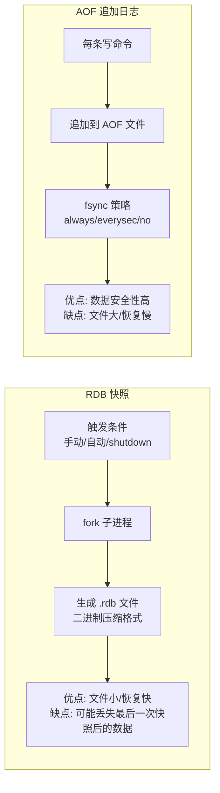
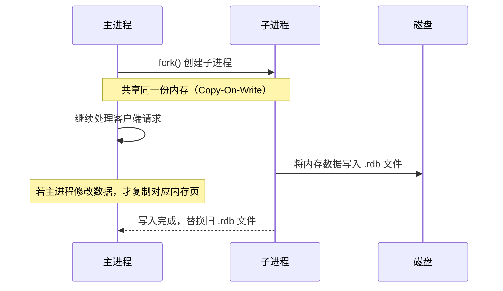
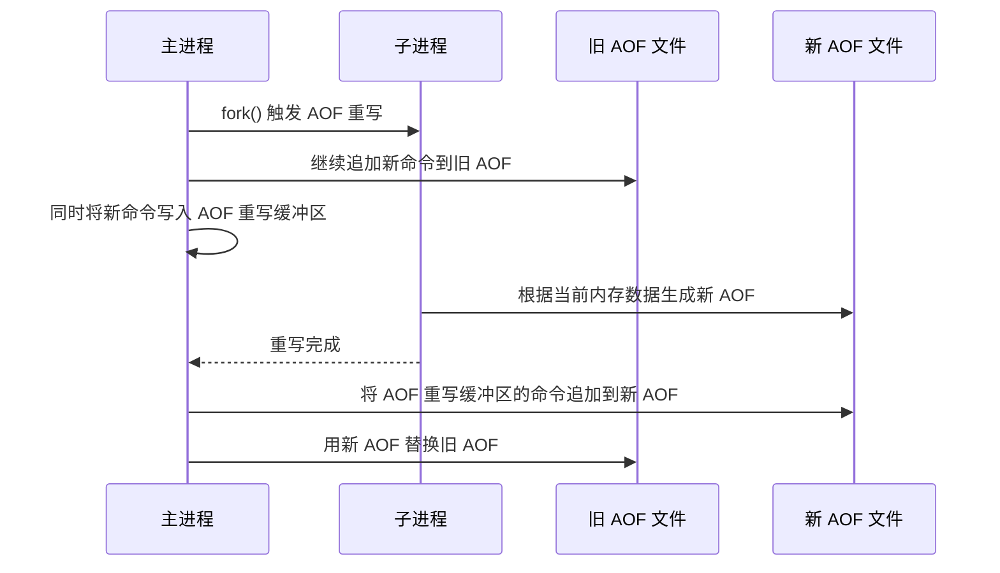
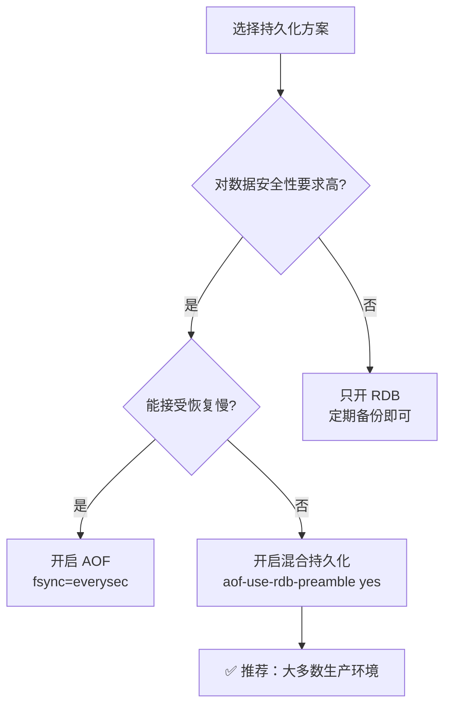

# Redis 持久化机制：RDB 与 AOF

> **一句话记忆口诀**（按结论优先级）：
>
> 1. **RDB = 全量快照**（二进制、体积小、恢复快，但分钟级丢数据）；**AOF = 增量日志**（文本命令、体积大、恢复慢，但秒级安全）。
> 2. **生产唯一正解 = 混合持久化**（Redis 4.0+ 默认开启）：AOF 文件头是 RDB、文件尾是增量 AOF，兼顾**恢复快**与**数据安全**。
> 3. **fsync 三档就记 `everysec`**：`always` 性能炸、`no` 安全炸，`everysec` 最多丢 1 秒——99% 场景闭眼选它。
> 4. **fork + COW** 是 RDB / AOF 重写共享的底层机制——内存越大 fork 越慢（页表复制），**单实例内存别超 10GB**。
> 5. **重启恢复优先级：AOF > RDB**（只有关闭 AOF 时才用 RDB）；**主节点必须开持久化**，否则重启后空数据会同步给从节点清空从库。

> 📖 **边界声明**：本文聚焦"**两种持久化方式的机制与选型**"，以下主题请见对应专题：
>
> - 主从复制 / 哨兵 / Cluster 如何利用 RDB 做全量同步 → [高可用架构](@redis-高可用架构)
> - `fork` 导致的 `latest_fork_usec` 抖动排查、大 Key 引发的持久化卡顿 → [应用型问题](@redis-应用型问题)
> - `maxmemory-policy` 淘汰策略（与持久化无关但常混淆） → [内存管理与淘汰机制](@redis-内存管理与淘汰机制)

---

## 1. 类比：用生活场景理解持久化

| 持久化方式 | 生活场景类比 | 核心特点 | 优缺点 |
| :-- | :-- | :-- | :-- |
| **RDB** | **拍照存档**：每隔一小时自动保存一次长文 | 全量快照，二进制压缩 | **优点**：恢复快、文件小<br>**缺点**：可能丢失最后一次快照后的数据 |
| **AOF** | **记账本**：每写一句话就记录在笔记本上 | 增量日志，文本命令 | **优点**：数据安全性高<br>**缺点**：恢复慢、文件大 |
| **混合持久化** | **智能笔记本**：开头是完整快照，后面只记录增量 | RDB 快照头 + AOF 增量尾 | **优点**：恢复快且数据安全<br>**缺点**：Redis 4.0+ 才支持 |
| **fsync 策略** | **笔记本保存频率** | 刷盘策略 | `always`：每写一句话就保存（最安全）<br>`everysec`：每秒保存一次（推荐）<br>`no`：自动决定（不推荐） |

---

## 2. 引入：为什么需要持久化？

Redis 是内存数据库，进程重启后数据会丢失。持久化机制将内存数据保存到磁盘，重启后可以恢复。

**不了解持久化会导致的线上问题**：

- ❌ **生产环境只开 RDB**：Redis 宕机后丢失最近几分钟的数据
- ❌ **AOF 文件无限增长**：磁盘被打满，服务不可用
- ❌ **重启恢复时间过长**：影响业务连续性

---

## 3. 两种持久化方式概览



!!! note "📖 术语家族：`Redis 持久化族`"
    **字面义**：**Persistence**（持久化）= "把内存数据落到磁盘，进程重启后可恢复"。

    **在 Redis 中的含义**：Redis 提供**两条独立轨道** + **一条混合轨道**，按"**快照 vs 日志**"的根本差异区分。

    **同家族成员对比**：

    | 成员 | 记录方式 | 文件体积 | 恢复速度 | 数据丢失窗口 | 生效配置 |
    | :-- | :-- | :-- | :-- | :-- | :-- |
    | **RDB**（Redis Database Snapshot）| 二进制快照 | 小（LZF 压缩）| 快（直接加载）| 分钟级（两次快照之间）| `save` / `bgsave` / `save 900 1` |
    | **AOF**（Append Only File）| 文本命令流水 | 大（未压缩命令）| 慢（重放命令）| 秒级（`everysec`）| `appendonly yes` |
    | **AOF Rewrite**（重写）| 用当前内存状态生成最小命令集 | 压缩旧 AOF | — | — | `auto-aof-rewrite-percentage` |
    | **Mixed Persistence**（混合持久化）| 文件头 RDB + 文件尾 AOF 增量 | 中（头部压缩）| 快（RDB 头部 + 少量 AOF 重放）| 秒级 | `aof-use-rdb-preamble yes`（4.0+ 默认开启）|
    | **fsync 三档** | 刷盘策略 | — | — | `always` 最多丢 1 命令 / `everysec` 最多丢 1 秒 / `no` 由 OS 决定 | `appendfsync everysec` |

    **命名规律**：

    - **RDB / AOF** 分别取自「**R**edis **D**ata**b**ase」与「**A**ppend **O**nly **F**ile」——名称即本质
    - **Rewrite**（重写）= "压缩历史命令"，与 MySQL redo log 的 checkpoint 机制同源思路
    - **Preamble**（前奏）= "文件开头"，`aof-use-rdb-preamble` 字面即"在 AOF 开头用 RDB"

---

## 4. RDB（Redis Database Snapshot）

### 4.1 工作原理

RDB 是在某个时间点对 Redis 内存数据做**全量快照**，生成一个二进制压缩文件（`.rdb`）。

```bash
# 触发方式
# 手动触发：SAVE（阻塞主线程）/ BGSAVE（fork 子进程，推荐）
# 自动触发：配置 save 规则，如 save 900 1（900秒内有1次写操作则触发）
# 关闭时触发：shutdown 命令默认触发 BGSAVE
```

### 4.2 fork + Copy-On-Write 机制



**Copy-On-Write（写时复制）**：fork 后父子进程共享内存页，只有当某页被修改时才复制该页。这样 fork 的开销很小，子进程看到的是 fork 时刻的内存快照。

> ⚠️ **注意**：如果 Redis 内存很大（如 10GB），fork 时需要复制页表，可能造成几毫秒到几秒的停顿（`latency`）。这是 RDB 的主要性能隐患。

### 4.3 RDB 配置

```bash
# redis.conf 配置示例
save 900 1       # 900秒内至少1次写操作，触发 BGSAVE
save 300 10      # 300秒内至少10次写操作，触发 BGSAVE
save 60 10000    # 60秒内至少10000次写操作，触发 BGSAVE

dbfilename dump.rdb          # RDB 文件名
dir /var/lib/redis           # RDB 文件存储目录
rdbcompression yes           # 是否压缩（LZF算法）
```

### 4.4 RDB 优缺点

| 优点 | 缺点 |
| :-- | :-- |
| 文件紧凑，体积小，适合备份和传输 | 可能丢失最后一次快照后的数据（分钟级） |
| 恢复速度快（直接加载二进制数据） | fork 时可能造成短暂停顿 |
| 对 Redis 性能影响小（子进程处理） | 不适合对数据安全性要求高的场景 |

---

## 5. AOF（Append Only File）

### 5.1 工作原理

AOF 将每条**写命令**以文本格式追加到 AOF 文件中，重启时重放所有命令来恢复数据。

```txt
写命令执行流程：
  1. 客户端发送写命令（如 SET key value）
  2. Redis 执行命令，修改内存数据
  3. 将命令追加到 AOF 缓冲区（aof_buf）
  4. 根据 fsync 策略，将缓冲区数据刷到磁盘
```

### 5.2 三种 fsync 策略

| 策略 | 触发时机 | 数据安全性 | 性能影响 | 适用场景 |
| :-- | :-- | :-- | :-- | :-- |
| `always` | 每条命令都 fsync | 最高（最多丢失1条命令） | 最差（每次都写磁盘） | 金融等极高安全要求 |
| `everysec`（推荐） | 每秒 fsync 一次 | 高（最多丢失1秒数据） | 较小（后台线程处理） | 大多数业务场景 |
| `no` | 由操作系统决定 | 低（可能丢失较多数据） | 最好 | 不推荐生产使用 |

### 5.3 AOF 重写（Rewrite）

**问题**：AOF 文件会不断增长（记录所有历史命令），如 `INCR counter` 执行了 1000 次，AOF 中有 1000 条记录，但实际只需要 `SET counter 1000` 一条。

**解决方案**：AOF 重写，将内存中的当前数据状态转换为最少的命令集合，生成新的 AOF 文件。



**AOF 重写配置**：

```bash
auto-aof-rewrite-percentage 100   # AOF 文件比上次重写后增长 100% 时触发
auto-aof-rewrite-min-size 64mb    # AOF 文件至少 64MB 才触发（防止小文件频繁重写）
```

### 5.4 AOF 优缺点

| 优点 | 缺点 |
| :-- | :-- |
| 数据安全性高（最多丢失1秒数据） | 文件体积大（文本格式，未压缩） |
| 文件可读，便于排查问题 | 恢复速度慢（需要重放所有命令） |
| 支持 AOF 重写压缩文件 | 对性能有持续影响（写磁盘） |

---

## 6. 混合持久化（Redis 4.0+）

### 6.1 为什么需要混合持久化？

| 方案 | 问题 |
| :-- | :-- |
| 纯 RDB | 数据安全性低，可能丢失几分钟数据 |
| 纯 AOF | 恢复速度慢，大数据量时重放命令耗时很长 |
| **混合持久化** | ✅ 兼顾恢复速度和数据安全性 |

### 6.2 混合持久化原理

```txt
AOF 文件结构：
┌─────────────────────────────────────────────────────┐
│  RDB 格式的全量数据（文件头）                         │
│  （AOF 重写时，将当前内存数据以 RDB 格式写入）          │
├─────────────────────────────────────────────────────┤
│  AOF 格式的增量命令（文件尾）                         │
│  （重写完成后，新产生的写命令以 AOF 格式追加）          │
└─────────────────────────────────────────────────────┘
```

**恢复流程**：

1. 加载文件头的 RDB 数据（快速恢复全量数据）
2. 重放文件尾的 AOF 增量命令（补全最新数据）

### 6.3 开启混合持久化

```bash
# redis.conf
aof-use-rdb-preamble yes   # 开启混合持久化（Redis 4.0+ 默认开启）
appendonly yes              # 同时需要开启 AOF
```

---

## 7. 持久化方案选择指南



| 场景 | 推荐方案 |
| :-- | :-- |
| 纯缓存，数据丢失可接受 | 只开 RDB，或不开持久化 |
| 需要数据安全，但恢复速度不敏感 | 只开 AOF（everysec） |
| 需要数据安全，且恢复速度要快 | **混合持久化**（推荐） |
| 数据量极大，重启恢复时间敏感 | 混合持久化 + 主从复制 |

---

## 8. 经典坑 / 不生效场景

### 8.1 配置类错误

#### ❌ 坑1：生产环境只开 RDB，宕机丢数据

**错误配置**：

```bash
# redis.conf
appendonly no    # 关闭 AOF
save 900 1       # 15分钟才保存一次
```

**问题**：Redis 宕机后丢失**最近 15 分钟**的所有数据

**✅ 正确配置**：

```bash
appendonly yes                    # 开启 AOF
aof-use-rdb-preamble yes          # 开启混合持久化
appendfsync everysec              # 每秒刷盘，最多丢 1 秒数据
```

#### ❌ 坑2：AOF 文件无限增长，磁盘被打满

**错误配置**：

```bash
auto-aof-rewrite-percentage 0     # 关闭自动重写
# 或配置值过大，如 auto-aof-rewrite-percentage 1000
```

**问题**：AOF 文件持续增长，最终占满磁盘空间

**✅ 正确配置**：

```bash
auto-aof-rewrite-percentage 100   # 文件增长 100% 时触发重写
auto-aof-rewrite-min-size 64mb    # 文件至少 64MB 才重写
```

#### ❌ 坑3：大内存实例频繁 BGSAVE，服务卡顿

**错误配置**：

```bash
save 60 10000    # 1分钟内有 10000 次写就触发 BGSAVE
# Redis 实例内存：32GB
```

**问题**：频繁 fork 32GB 内存，每次耗时数秒，服务不可用

**✅ 正确配置**：

```bash
# 控制单实例内存 ≤ 10GB
save 900 1       # 降低触发频率
save 300 10
save 60 10000    # 调高触发阈值
```

### 8.2 架构类错误

#### ❌ 坑4：主节点不开持久化，从节点数据清空

**错误架构**：

```txt
主节点：appendonly no   # 不开持久化
从节点：appendonly yes  # 开持久化
```

**问题**：主节点重启后数据为空，同步给从节点，**从节点数据被清空**

**✅ 正确架构**：

```txt
主节点：appendonly yes  # 必须开持久化
从节点：appendonly yes  # 建议也开，双重保险
```

#### ❌ 坑5：fsync=always 导致性能瓶颈

**错误配置**：

```bash
appendfsync always    # 每条命令都刷盘
```

**问题**：写性能急剧下降，QPS 从几万降到几百

**✅ 正确配置**：

```bash
appendfsync everysec   # 99% 场景闭眼选这个
```

### 8.3 运维类错误

#### ❌ 坑6：手动删除 AOF 文件导致数据丢失

**错误操作**：

```bash
rm appendonly.aof    # 手动删除 AOF 文件
```

**问题**：重启后无法恢复数据，**永久丢失**

**✅ 正确操作**：

```bash
# 先备份再操作
cp appendonly.aof appendonly.aof.bak
# 或使用 BGREWRITEAOF 安全重写
```

#### ❌ 坑7：磁盘空间不足，持久化失败

**错误场景**：

```bash
# 磁盘使用率 95%，AOF 重写失败
[ERR] Background AOF rewrite terminated by signal: 9
```

**问题**：AOF 重写进程被 OOM killer 杀死

**✅ 解决方案**：

```bash
# 监控磁盘使用率，设置告警阈值（如 80%）
# 定期清理旧备份文件
# 使用监控工具（如 Prometheus）告警
```

### 8.4 排查工具与命令

**检查持久化状态**：

```bash
# 查看持久化配置
CONFIG GET appendonly
CONFIG GET save

# 查看 AOF 重写状态
INFO persistence

# 查看 fork 耗时（单位：微秒）
INFO stats | grep latest_fork_usec

# 手动触发 RDB 备份
BGSAVE

# 手动触发 AOF 重写
BGREWRITEAOF
```

**监控指标**：

- `aof_current_size`：当前 AOF 文件大小
- `aof_base_size`：上次重写时 AOF 文件大小
- `rdb_last_save_time`：上次 RDB 保存时间
- `latest_fork_usec`：上次 fork 耗时（>100ms 需关注）

---

## 9. 常见问题 Q&A

**Q1：RDB 和 AOF 哪个更好？应该怎么选？**

> **结论**：没有绝对的好坏，取决于业务需求。**生产环境推荐混合持久化**（Redis 4.0+ 默认开启）。
>
> **选型矩阵**：
>
> | 场景 | 推荐方案 | 理由 |
> | :-- | :-- | :-- |
> | **纯缓存**，数据丢失可接受 | 只开 RDB | 文件小、恢复快，适合缓存场景 |
> | **需要数据安全**，恢复时间不敏感 | 只开 AOF（everysec） | 最多丢 1 秒数据，安全性高 |
> | **数据安全 + 恢复速度**都要 | **混合持久化**（推荐） | RDB 快照 + AOF 增量，兼顾两者 |
> | **大内存实例**（>10GB） | 混合持久化 + 主从复制 | 避免单实例 fork 卡顿 |

**Q2：AOF 重写期间，新的写命令怎么处理？会丢数据吗？**

> **结论**：不会丢数据，Redis 通过**双写机制**保证数据安全。
>
> **详细流程**：
>
> 1. **主进程 fork 子进程**做 AOF 重写
> 2. **同时**将新命令写入：
>     - **旧 AOF 文件**（保证当前数据安全）
>     - **AOF 重写缓冲区**（用于后续追加）
> 3. 重写完成后，将**缓冲区命令追加到新 AOF 文件**
> 4. **原子替换**旧文件
>
> **关键点**：重写期间**数据不丢失**，但可能**短暂阻塞**（fork 瞬间）。

**Q3：Redis 重启后，RDB 和 AOF 哪个优先恢复？**

> **结论**：**AOF 优先**，因为 AOF 数据更完整（更新更及时）。
>
> **恢复优先级**：
>
> 1. **先检查 AOF 文件是否存在且可读**
> 2. **如果 AOF 可用，优先用 AOF 恢复**（命令重放）
> 3. **只有 AOF 关闭或损坏时，才用 RDB 恢复**
> 4. **如果两者都不可用，启动空数据库**
>
> **配置验证**：`INFO persistence` 查看 `aof_enabled` 和 `rdb_last_save_time`。

**Q4：fork 导致的卡顿问题怎么解决？**

> **结论**：fork 卡顿是**内存页表复制**导致的，**无法完全避免**，但可优化。
>
> **优化策略**：
>
> 1. **控制单实例内存 ≤ 10GB**（页表复制时间与内存大小正相关）
> 2. **使用大页内存**（HugePages）减少页表数量
> 3. **避免在高峰期触发 BGSAVE**（配置合理的 save 阈值）
> 4. **监控 fork 耗时**：`INFO stats | grep latest_fork_usec`（>100ms 需关注）
> 5. **使用主从复制**，在从节点做持久化，减轻主节点压力

**Q5：fsync 三档策略（always/everysec/no）怎么选？**

> **结论**：**99% 场景选 `everysec`**，平衡安全与性能。
>
> **三档对比**：
>
> | 策略 | 数据丢失窗口 | 性能影响 | 适用场景 |
> | :-- | :-- | :-- | :-- |
> | `always` | **最多丢 1 条命令** | **最差**（每条命令都刷盘） | 金融等高安全要求 |
> | `everysec` | **最多丢 1 秒数据** | **较小**（后台线程处理） | **推荐：大多数业务** |
> | `no` | **由 OS 决定**（可能丢很多） | **最好** | 不推荐生产使用 |
>
> **配置**：`appendfsync everysec`（Redis 默认值）。

**Q6：混合持久化的文件结构是怎样的？恢复流程如何？**

> **结论**：**文件头 RDB + 文件尾 AOF**，恢复时**先加载 RDB 再重放 AOF**。
>
> **文件结构**：
>
> ```txt
> ┌─────────────────────────────────────────────────────┐
> │  RDB 格式的全量数据（文件头）                           │
> │  （AOF 重写时，将当前内存数据以 RDB 格式写入）            │
> ├─────────────────────────────────────────────────────┤
> │  AOF 格式的增量命令（文件尾）                           │
> │  （重写完成后，新产生的写命令以 AOF 格式追加）             │
> └─────────────────────────────────────────────────────┘
> ```
>
> **恢复流程**：
>
> 1. **快速加载 RDB 头部**（二进制格式，O(1) 加载）
> 2. **增量重放 AOF 尾部**（补全最新数据）
> 3. **总耗时 ≈ RDB 加载时间 + 少量 AOF 重放时间**
>
> **开启配置**：`aof-use-rdb-preamble yes`（Redis 4.0+ 默认开启）。

**Q7：AOF 文件过大怎么处理？重写机制如何工作？**

> **结论**：通过 **AOF 重写** 压缩历史命令，生成最小命令集。
>
> **重写触发条件**：
>
> ```bash
> # redis.conf
> auto-aof-rewrite-percentage 100   # 文件比上次重写后增长 100%
> auto-aof-rewrite-min-size 64mb    # 文件至少 64MB
> ```
>
> **重写原理**：
>
> - **不是简单删除旧文件**，而是**根据当前内存状态生成新命令集**
> - 例如：`INCR counter` 执行 1000 次 → 重写为 `SET counter 1000`
> - **压缩率通常 50%~90%**，取决于写操作模式
>
> **手动触发**：`BGREWRITEAOF`（非阻塞，后台执行）。

**Q8：主从架构中，持久化配置有什么注意事项？**

> **结论**：**主节点必须开持久化**，否则重启空数据会同步给从节点**清空从库**。
>
> **错误配置**：
>
> ```txt
> 主节点：appendonly no   # 不开持久化
> 从节点：appendonly yes  # 开持久化
> ```
>
> **风险**：主节点重启 → 数据为空 → 同步给从节点 → **从节点数据被清空**
>
> **正确配置**：
>
> ```txt
> 主节点：appendonly yes          # 必须开持久化
> 从节点：appendonly yes（可选）    # 双重保险，但可能增加从节点压力
> ```
>
> **最佳实践**：主节点开混合持久化，从节点可根据业务需求选择。

---

## 10. 一句话记忆口诀（收尾）

**RDB = 拍照存档**（快、小、但分钟级丢数据）  
**AOF = 记账本**（慢、大、但秒级安全）  
**混合持久化 = 智能笔记本**（RDB 快照头 + AOF 增量尾，又快又安全）  
**fsync 三档就记 `everysec`**（平衡安全与性能，99% 场景闭眼选）  
**主节点必须开持久化**，否则重启空数据会清空从库！

---

## 11. 版本差异与演进

!!! note "📖 Redis 版本演进：持久化机制的重大变化"
    **Redis 4.0+**：引入**混合持久化**（`aof-use-rdb-preamble yes`），默认开启，成为生产环境标准配置。

    **Redis 7.0+**：AOF 重写机制优化，**减少重写期间的阻塞时间**，提升大内存实例的稳定性。
    
    **配置兼容性**：虽然底层实现不断优化，但**配置项名称保持向后兼容**，确保老版本配置文件在新版本中仍能正常工作。

**关键版本里程碑**：

| 版本 | 持久化相关重大变化 |
| :-- | :-- |
| **Redis 2.6** | AOF 重写机制稳定，支持后台重写 |
| **Redis 4.0** | **混合持久化**（默认开启），解决纯 AOF 恢复慢的问题 |
| **Redis 5.0** | RDB 文件格式优化，提升加载速度 |
| **Redis 6.0** | 多线程 I/O，提升 AOF fsync 性能 |
| **Redis 7.0** | AOF 重写性能优化，减少大内存实例的卡顿 |

**生产环境推荐版本**：**Redis 6.0+**（支持多线程 I/O）或 **Redis 7.0+**（AOF 重写优化）。

---

> 📖 **延伸阅读**：
>
> - 想深入了解 Redis 高可用架构如何利用 RDB 做全量同步？ → [高可用架构](@redis-高可用架构)
> - 遇到 `fork` 卡顿、大 Key 引发的持久化问题？ → [应用型问题](@redis-应用型问题)
> - 需要了解内存淘汰策略与持久化的区别？ → [内存管理与淘汰机制](@redis-内存管理与淘汰机制)
