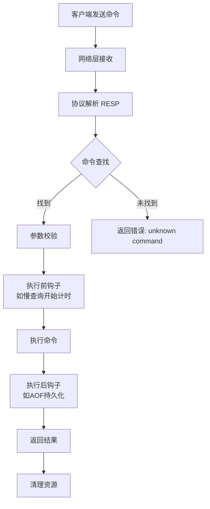
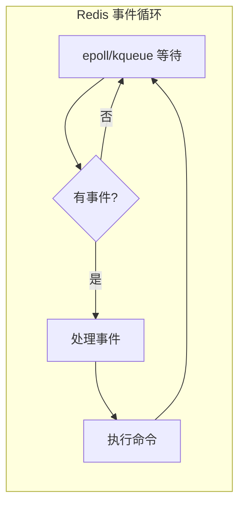

# Redis 指令解析与执行机制

> **一句话记忆口诀**：Redis 指令执行遵循 **"解析 → 查找 → 执行 → 返回"** 四步流水线，单线程 + 事件驱动保证原子性，**命令查找用哈希表 O(1)**，**参数解析防溢出**，**执行前后可挂载钩子**（如慢查询日志、AOF 持久化），理解这套机制才能解释"Redis 为什么快"和"如何保证线程安全"。

## 1. 核心概念：Redis 命令处理全流程

Redis 接收到客户端命令后，经过 **四步核心处理**：



**关键特性**：

- **单线程执行**：所有命令在**主线程**顺序执行，天然避免竞态条件
- **事件驱动**：基于 epoll/kqueue 的 I/O 多路复用，高并发下仍高效
- **协议简单**：RESP（Redis Serialization Protocol）二进制安全且易解析

## 2. RESP 协议：Redis 的通信语言

### 2.1 协议格式详解

RESP 是 Redis 客户端与服务端通信的**标准协议**，支持 5 种数据类型：

| 类型 | 前缀 | 示例 | 说明 |
| :-- | :-- | :-- | :-- |
| **简单字符串** | `+` | `+OK\r\n` | 状态回复，如 `PING` 返回 |
| **错误信息** | `-` | `-ERR unknown command\r\n` | 错误回复 |
| **整数** | `:` | `:100\r\n` | 数字回复，如 `INCR` 结果 |
| **批量字符串** | `$` | `$5\r\nhello\r\n` | 二进制安全字符串 |
| **数组** | `*` | `*3\r\n$3\r\nSET\r\n$5\r\nhello\r\n$5\r\nworld\r\n` | 命令封装 |

**SET 命令的 RESP 格式**：

```bash
# 客户端发送
*3\r\n           # 数组，3个元素
$3\r\nSET\r\n     # 第一个元素：命令名 "SET"，长度3
$5\r\nhello\r\n   # 第二个元素：key "hello"，长度5
$5\r\nworld\r\n   # 第三个元素：value "world"，长度5

# 服务端返回
+OK\r\n          # 简单字符串回复
```

### 2.2 协议解析流程

```c
// Redis 源码中的协议解析（简化）
void processInputBuffer(client *c) {
    // 1. 解析命令数量（数组长度）
    if (c->reqtype == REDIS_REQ_INLINE) {
        // 内联命令（旧协议）
        parseInlineBuffer(c);
    } else {
        // RESP 协议
        if (c->argc == 0) {
            // 解析数组长度
            if (c->querybuf[c->qb_pos] == '*') {
                c->qb_pos++;
                c->argc = readLongLong(c->querybuf, &c->qb_pos);
            }
        }
        
        // 2. 逐个解析参数
        while (c->argc > 0) {
            // 读取批量字符串长度和内容
            if (c->querybuf[c->qb_pos] == '$') {
                c->qb_pos++;
                len = readLongLong(c->querybuf, &c->qb_pos);
                // 读取字符串内容
                c->argv[c->argc++] = createStringObject(c->querybuf + c->qb_pos, len);
                c->qb_pos += len + 2; // +2 for \r\n
            }
        }
    }
    
    // 3. 命令查找与执行
    if (c->argc > 0) {
        processCommand(c);
    }
}
```

## 3. 命令查找机制

### 3.1 命令表（Command Table）

Redis 维护一个**全局命令表**，存储所有可用命令的元信息：

```c
// Redis 命令结构（简化）
struct redisCommand {
    char *name;                    // 命令名，如 "SET"
    redisCommandProc *proc;        // 命令处理函数指针
    int arity;                     // 参数个数（负数表示至少需要 |arity| 个）
    int flags;                     // 命令标志位（读写/管理/危险等）
    // ... 其他字段
};

// 命令表初始化（server.c）
struct redisCommand redisCommandTable[] = {
    {"SET", setCommand, -3, "wm", ...},     // SET 命令，至少3个参数，写模式
    {"GET", getCommand, 2, "r", ...},       // GET 命令，2个参数，读模式
    {"DEL", delCommand, -2, "w", ...},      // DEL 命令，至少2个参数，写模式
    // ... 上百个命令
};
```

### 3.2 哈希表查找优化

Redis 使用**哈希表**加速命令查找，时间复杂度 O(1)：

```c
// 命令查找流程（简化）
redisCommand *lookupCommand(char *name) {
    // 1. 先在主命令表查找
    redisCommand *cmd = dictFetchValue(server.commands, name);
    
    // 2. 如果没找到，检查是否是子命令（如 CLUSTER SLOTS）
    if (!cmd) {
        char *dot = strchr(name, '.');
        if (dot) {
            *dot = '\0';
            redisCommand *parent = dictFetchValue(server.commands, name);
            if (parent && parent->flags & REDIS_CMD_MODULE) {
                cmd = moduleLookupSubCommand(parent, dot+1);
            }
            *dot = '.';
        }
    }
    
    return cmd;
}
```

**查找优化特性**：

- **大小写不敏感**：`SET`、`set`、`Set` 都指向同一个命令
- **命令别名**：支持为常用命令设置别名（如 `DEL` 别名 `UNLINK`）
- **模块命令**：支持动态加载的模块命令

## 4. 参数校验与安全检查

### 4.1 参数个数校验

```c
// 参数个数检查（简化）
int checkCommandArity(redisCommand *cmd, int argc) {
    if (cmd->arity > 0) {
        // 固定参数个数
        if (argc != cmd->arity) return 0;
    } else {
        // 可变参数个数（负数表示至少需要 |arity| 个）
        if (argc < -cmd->arity) return 0;
    }
    return 1;
}
```

**示例**：
- `SET key value`：arity = -3（至少3个参数）
- `GET key`：arity = 2（必须2个参数）
- `MGET key1 key2 ...`：arity = -2（至少2个参数）

### 4.2 权限与安全检查

**认证检查**：
```c
// 检查客户端是否已认证
if (server.requirepass && !c->authenticated) {
    // 只有 AUTH 命令允许未认证客户端执行
    if (strcasecmp(c->argv[0]->ptr,"auth") != 0) {
        addReplyError(c,"NOAUTH Authentication required.");
        return C_ERR;
    }
}
```

**只读模式检查**：
```c
// 如果配置了 slave-read-only，从节点拒绝写命令
if (server.masterhost && server.repl_slave_ro && 
    (cmd->flags & CMD_WRITE)) {
    addReplyError(c,"READONLY You can't write against a read only replica.");
    return C_ERR;
}
```

## 5. 命令执行与钩子机制

### 5.1 执行前钩子（Pre-execution Hooks）

在执行命令前，Redis 会执行一系列检查和处理：

1. **慢查询开始计时**：记录命令开始时间
2. **监控检查**：如果开启监控，记录命令信息
3. **内存检查**：检查是否超过 maxmemory 限制

### 5.2 核心执行流程

```c
// 命令执行入口（简化）
void call(client *c, int flags) {
    // 1. 记录开始时间（用于慢查询）
    long long start = ustime();
    
    // 2. 执行命令
    c->cmd->proc(c);
    
    // 3. 记录执行时间
    long long duration = ustime() - start;
    
    // 4. 慢查询检查
    if (duration > server.slowlog_log_slower_than) {
        slowlogPushEntryIfNeeded(c, c->argv, c->argc, duration);
    }
    
    // 5. 统计命令调用次数
    c->cmd->calls++;
}
```

### 5.3 执行后钩子（Post-execution Hooks）

命令执行完成后，触发相关处理：

1. **AOF 持久化**：如果是写命令，追加到 AOF 缓冲区
2. **主从复制**：如果是写命令，传播给从节点
3. **发布订阅**：如果命令涉及频道，通知订阅者
4. **事务处理**：如果处于事务中，命令入队而非立即执行

## 6. 单线程模型与性能优化

### 6.1 为什么单线程还能快？

Redis 的单线程模型通过以下机制实现高性能：

**事件驱动架构**：



**性能关键点**：

- **纯内存操作**：数据在内存中，操作速度极快
- **I/O 多路复用**：单线程处理大量网络连接
- **避免锁竞争**：无锁设计，减少上下文切换
- **局部性原理**：CPU 缓存命中率高

### 6.2 Redis 6.0+ 多线程 I/O

Redis 6.0 引入**多线程网络 I/O**，但**命令执行仍是单线程**：

```txt
多线程 I/O（读写网络数据） → 单线程命令执行 → 多线程 I/O（返回结果）
```

**配置示例**：
```bash
# redis.conf
io-threads 4          # 启用 4 个 I/O 线程
io-threads-do-reads yes # I/O 线程也处理读操作
```

## 7. 错误处理与响应返回

### 7.1 错误类型分类

| 错误类型 | 示例 | 处理方式 |
| :-- | :-- | :-- |
| **协议错误** | `-ERR Protocol error` | 关闭连接 |
| **命令不存在** | `-ERR unknown command` | 返回错误，连接保持 |
| **参数错误** | `-ERR wrong number of arguments` | 返回错误，继续服务 |
| **权限错误** | `-NOAUTH Authentication required` | 返回错误，继续服务 |

### 7.2 结果返回机制

```c
// 返回结果给客户端（简化）
void addReply(client *c, robj *obj) {
    if (c->flags & CLIENT_CLOSE_AFTER_REPLY) return;
    
    // 将结果对象添加到回复列表
    listAddNodeTail(c->reply, obj);
    
    // 标记客户端有待发送数据
    c->flags |= CLIENT_PENDING_WRITE;
}
```

## 8. 性能监控与调试

### 8.1 慢查询日志

**配置慢查询**：
```bash
# redis.conf
slowlog-log-slower-than 10000  # 超过 10ms 的记录为慢查询
slowlog-max-len 128            # 最多保存 128 条慢查询
```

**查看慢查询**：
```bash
SLOWLOG GET 10  # 获取最近 10 条慢查询
```

### 8.2 命令统计

**监控命令调用**：
```bash
INFO commandstats  # 查看所有命令的调用统计
```

**输出示例**：
```txt
cmdstat_get:calls=123456,usec=789012,usec_per_call=6.40
cmdstat_set:calls=98765,usec=456789,usec_per_call=4.62
```

## 9. 实战：自定义命令开发

### 9.1 Redis 模块系统

Redis 4.0+ 支持**模块化**，可以开发自定义命令：

```c
// 自定义命令示例（简化）
int MyCommand_RedisCommand(RedisModuleCtx *ctx, RedisModuleString **argv, int argc) {
    // 参数校验
    if (argc != 2) return RedisModule_WrongArity(ctx);
    
    // 业务逻辑
    RedisModuleString *key = argv[1];
    RedisModuleCallReply *reply = RedisModule_Call(ctx, "GET", "s", key);
    
    // 返回结果
    RedisModule_ReplyWithCallReply(ctx, reply);
    RedisModule_FreeCallReply(reply);
    
    return REDISMODULE_OK;
}

// 注册命令
int RedisModule_OnLoad(RedisModuleCtx *ctx) {
    if (RedisModule_Init(ctx, "mymodule", 1, REDISMODULE_APIVER_1) == REDISMODULE_ERR)
        return REDISMODULE_ERR;
    
    if (RedisModule_CreateCommand(ctx, "mycommand", 
                                 MyCommand_RedisCommand, 
                                 "readonly", 1, 1, 1) == REDISMODULE_ERR)
        return REDISMODULE_ERR;
    
    return REDISMODULE_OK;
}
```

## 10. 常见问题与排查技巧

### 10.1 性能瓶颈分析

**CPU 瓶颈特征**：
- 单个命令执行时间过长
- 慢查询日志中出现大量命令
- CPU 使用率持续高位

**排查方法**：
1. `SLOWLOG GET` 查看慢查询
2. `INFO commandstats` 分析命令耗时
3. `MONITOR` 实时监控命令流（生产环境慎用）

### 10.2 内存使用分析

**大 Key 问题**：
- 单个 Key 的 Value 过大
- 导致网络传输和持久化性能下降

**排查工具**：
```bash
# 扫描大 Key
redis-cli --bigkeys

# 内存分析
redis-cli --memkeys
```

## 总结

Redis 的指令解析与执行机制体现了其**设计哲学**：

1. **简单高效**：RESP 协议简洁，解析开销小
2. **原子安全**：单线程执行避免竞态条件
3. **可扩展**：模块系统支持自定义命令
4. **监控友好**：完善的统计和日志机制

理解这套机制，有助于：
- **性能调优**：识别瓶颈，合理设计命令
- **问题排查**：快速定位协议或执行问题
- **架构设计**：基于 Redis 特性设计系统

---

## 📚 延伸阅读

- [Redis 持久化机制 RDB 与 AOF](@redis-持久化机制RDB与AOF) - 命令执行后的数据落地
- [Redis 高可用架构](@redis-高可用架构) - 命令在集群中的传播
- [Redis 事务与 Lua 脚本](@redis-事务与Lua脚本) - 命令的原子性组合执行