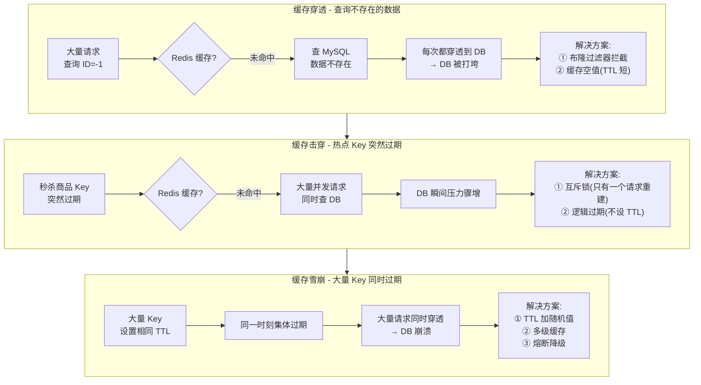
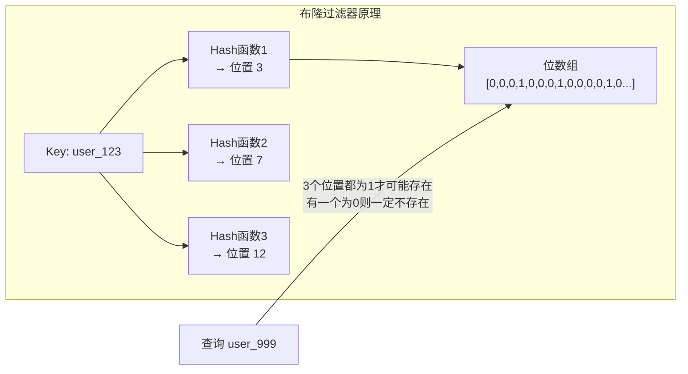
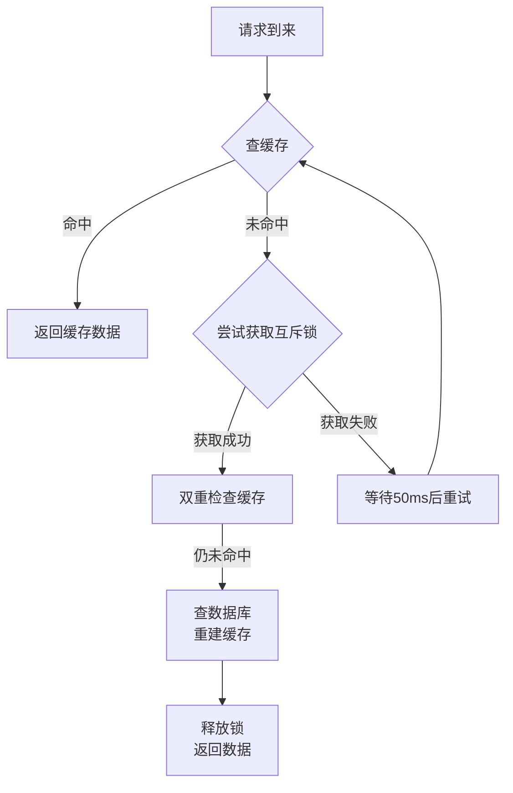

# Redis 缓存三大问题：穿透、击穿、雪崩

!!! info "**缓存三大问题 一句话口诀**"
    1. **穿透**（查不存在的数据） → **布隆过滤器** 在缓存前把"一定不存在的 Key"挡住；辅以 **缓存空值**（短 TTL）。
    2. **击穿**（单热点 Key 突然过期） → **互斥锁** 只让一个线程回源重建（强一致）；或 **逻辑过期** 永不 TTL、异步刷新（高可用）。
    3. **雪崩**（大量 Key 同时过期 / Redis 宕机） → **TTL 随机偏移** + **多级缓存**（Caffeine + Redis）+ **熔断降级** + **Redis 高可用**。
    4. **判别口诀**：**不存在**找穿透、**热点过期**找击穿、**批量过期**找雪崩——三者触发条件完全不同，方案不可混用。

> 📖 **边界声明**：本文聚焦"三大缓存异常的触发机制与防护方案"，以下相关主题请见对应专题：
>
> - **缓存与数据库一致性**（Cache Aside / 延迟双删 / Canal 全流程） → [Redis 应用型问题](@redis-应用型问题) §1
> - **分布式锁完整实现**（`SETNX` / Redisson 看门狗 / RedLock） → [分布式锁](@redis-分布式锁)
> - **大 Key / 热 Key 的发现与拆分** → [Redis 应用型问题](@redis-应用型问题) §3
> - **哨兵 / 集群防 Redis 层雪崩的架构细节** → [高可用架构](@redis-高可用架构)

---

## 0. 类比：用生活场景理解三大问题

!!! note "📌 类比学习法：从生活到技术"
    技术概念往往抽象难懂，但生活中的类似场景却能让我们快速建立直觉。本节通过三个生活场景类比，帮助您**一眼看穿**三大问题的本质区别。

### 0.1 缓存穿透 ≈ 查无此人（数据根本不存在）

**生活场景**：你去公安局查询一个**根本不存在的人**（身份证号是乱编的）。

| 场景要素 | 生活类比 | 技术对应 |
| :-- | :-- | :-- |
| **查询对象** | 不存在的人（乱编身份证号） | 数据库中不存在的记录 |
| **正常流程** | 先查户籍系统（缓存），命中则返回；未命中则查档案室（DB） | 先查缓存，命中则返回；未命中则查DB |
| **问题场景** | 每次查询这个不存在的人，户籍系统都查不到，每次都只能去档案室翻找 | 每次查询不存在的数据，缓存都未命中，每次都打到DB |
| **后果** | 档案室工作人员被无效查询淹没 | DB被大量无效查询打垮 |
| **解决方案** | 在户籍系统前加**黑名单系统**（布隆过滤器），提前拦截明显不存在的身份证号 | **布隆过滤器**在缓存前拦截一定不存在的Key |

**核心特征**：**持续性**问题，每次查询都会发生，可被恶意利用

### 0.2 缓存击穿 ≈ 热门店铺突然关门（单点热点失效）

**生活场景**：一家网红奶茶店每天中午12点准时开门，今天突然因为设备故障延迟开门。

| 场景要素 | 生活类比 | 技术对应 |
| :-- | :-- | :-- |
| **查询对象** | 真实存在的热门店铺 | 真实存在的热点Key |
| **正常流程** | 顾客到店，开门就买；关门就等明天 | 缓存命中则返回；过期则重建 |
| **问题场景** | 12点整，大量顾客同时到店，发现门没开，都涌向隔壁的原料供应商 | 热点Key突然过期，大量并发请求同时打到DB |
| **后果** | 原料供应商被瞬间涌入的顾客挤爆 | DB瞬间压力骤增 |
| **解决方案** | 店长在门口贴"设备维修中，请稍等"（互斥锁），只让一个员工去修设备 | **互斥锁**只让一个线程回源重建 |

**核心特征**：**瞬时性**问题，聚焦单点，高并发场景下尤为严重

### 0.3 缓存雪崩 ≈ 节假日集体休假（批量失效）

**生活场景**：春节所有快递公司同时放假7天。

| 场景要素 | 生活类比 | 技术对应 |
| :-- | :-- | :-- |
| **查询对象** | 大量正常的快递服务 | 大量正常的缓存Key |
| **正常流程** | 快递公司轮流休假，总有公司在运营 | Key错峰过期，总有缓存可用 |
| **问题场景** | 所有快递公司同一天放假，所有网购订单积压在仓库 | 大量Key同时过期，所有请求打到DB |
| **后果** | 仓库爆仓，订单积压 | DB崩溃，服务不可用 |
| **解决方案** | 快递公司错峰休假（TTL随机），建立多级配送网络 | **TTL随机偏移** + **多级缓存** |

**核心特征**：**大规模连锁反应**，波及整层缓存，系统级风险

### 0.4 三大问题对比速查表

| 问题类型 | 触发条件 | 生活类比 | 流量特征 | 防护核心 |
| :-- | :-- | :-- | :-- | :-- |
| **穿透** | 查询**不存在**的数据 | 查无此人 | 持续性、可预谋 | **提前拦截**（布隆过滤器） |
| **击穿** | **单个热点**Key突然过期 | 热门店铺突然关门 | 瞬时性、聚焦单点 | **单点控制**（互斥锁） |
| **雪崩** | **大量Key**同时过期 | 节假日集体休假 | 瞬时性、波及整层 | **错峰分散**（TTL随机） |

!!! tip "📌 一眼区分三大问题"
    **问自己三个问题**：
    1. **数据是否存在？** → 不存在 → **穿透**
    2. **是单个Key还是批量Key？** → 单个 → **击穿**
    3. **是Key过期还是Redis宕机？** → 批量过期 → **雪崩**

    记住这个口诀：**不存在找穿透、热点过期找击穿、批量过期找雪崩**

!!! note "📖 术语家族：`缓存异常问题族`"
    **字面义**：请求**绕过或击穿**缓存层、直接打到数据库的三类异常场景，统称"缓存三大问题"。
    **在 Redis 中的含义**：三者都表现为"DB 被大量请求打穿"，但**触发条件与防护手法完全不同**——只有先区分属于哪一类，才能套对方案；实际业务中往往**三者并发**发生（热点 Key 过期 + 黑产构造无效 ID + 批量数据刷新），必须三套方案**组合部署**。

    **同家族成员**：

    | 成员 | 触发条件 | 流量特征 | 核心防护 | 适用版本 | 源码依据 |
    | :-- | :-- | :-- | :-- | :-- | :-- |
    | `Cache Penetration`（穿透）| 查询**数据本身不存在** | 持续性、可预谋（黑产） | **布隆过滤器** / 缓存空值 | Redis 4.0+（RedisBloom） | `BF.ADD` / `BF.EXISTS` |
    | `Cache Breakdown`（击穿）| **单个热点 Key** 突然失效 | 瞬时性、聚焦单点 | **互斥锁** / 逻辑过期 | Redis 6.0+（多线程优化） | `SET NX PX` / `GETSET` |
    | `Cache Avalanche`（雪崩）| **大量 Key** 同时失效 / Redis 宕机 | 瞬时性、波及整层 | **TTL 随机** / 多级缓存 / 熔断 | Redis 7.0+（集群稳定性） | `EXPIRE` / `PEXPIRE` |

    **防护手法家族**：
    - `Bloom Filter`（布隆过滤器）：**Redis 4.0+** 支持，误判率可控，内存占用极小，源码位置：`redisbloom.so`
    - `Null Caching`（空值缓存）：**全版本通用**，实现简单，但可能缓存大量无效数据，源码位置：`SETEX` / `PSETEX`
    - `Mutex Lock`（互斥锁）：**Redis 6.0+** 多线程优化后性能显著提升，源码位置：`SET NX PX`
    - `Logical Expiration`（逻辑过期）：**Redis 5.0+** 推荐方案，高可用场景首选，源码位置：自定义数据结构
    - `Random TTL`（TTL 抖动）：**全版本通用**，最简单有效的雪崩防护，源码位置：`EXPIRE` + 随机算法
    - `Multi-Level Cache`（多级缓存）：**Caffeine + Redis** 组合，本地缓存防雪崩，源码位置：`Caffeine.newBuilder()`
    - `Circuit Breaker`（熔断降级）：**Sentinel / Hystrix** 框架集成，系统级防护，源码位置：`@SentinelResource`

    **命名规律**：**动词 + Cache** = "对缓存做了什么"——Penetration 是"穿过"（数据不存在所以穿）、Breakdown 是"崩塌"（单点失效所以塌）、Avalanche 是"雪崩"（大规模连锁反应）。记住**英文词根的物理意象**，三者边界立刻清晰。

    **版本演进关键点**：
    
    | 版本 | 缓存防护相关重大变化 | 对三大问题的影响 | 生产环境建议 |
    | :-- | :-- | :-- | :-- |
    | **Redis 4.0** | **RedisBloom 模块**正式支持，布隆过滤器成为官方方案 | **穿透防护**从手动实现升级为官方模块，误判率可控 | 穿透场景首选，布隆过滤器实现简化 |
    | **Redis 5.0** | **Streams 数据类型**支持，逻辑过期方案更稳定 | **击穿防护**中逻辑过期方案可靠性提升 | 高可用场景推荐逻辑过期方案 |
    | **Redis 6.0** | **多线程 I/O** 提升互斥锁并发性能 | **击穿防护**中互斥锁方案性能大幅提升 | 强一致场景首选互斥锁方案 |
    | **Redis 7.0** | **集群稳定性**提升，雪崩防护向分布式演进 | **雪崩防护**从单机方案向分布式方案演进 | 集群环境推荐，雪崩防护更可靠 |

    **生产环境决策矩阵**：

    !!! tip "📌 版本选择决策矩阵"
        **场景1：单体应用，穿透风险高** → **Redis 4.0+**（布隆过滤器简化实现）
        **场景2：高并发应用，击穿风险高** → **Redis 6.0+**（多线程优化互斥锁性能）
        **场景3：分布式集群，雪崩风险高** → **Redis 7.0+**（集群稳定性提升）
        **场景4：综合场景，三者风险并存** → **Redis 6.0+**（性能与稳定性平衡）

    **防护方案选择指南**：

    | 问题类型 | 首选方案 | 备选方案 | 适用场景 | 不适用场景 |
    | :-- | :-- | :-- | :-- | :-- |
    | **穿透** | 布隆过滤器 | 缓存空值 | 数据量大，Key相对固定 | Key变化频繁，误判率不可接受 |
    | **击穿** | 互斥锁 | 逻辑过期 | 对一致性要求高 | 对可用性要求高，允许短暂不一致 |
    | **雪崩** | TTL随机 | 多级缓存 | 批量Key刷新场景 | 单点热点Key场景 |

    **组合部署策略**：
    - **金融交易系统**：布隆过滤器 + 互斥锁 + TTL随机 + 多级缓存（全量防护）
    - **内容展示系统**：缓存空值 + 逻辑过期 + TTL随机（侧重可用性）
    - **高并发电商**：布隆过滤器 + 逻辑过期 + 多级缓存（平衡性能与可用性）

---

## 1. 引入：为什么会有这三大问题？

Redis 作为缓存层，正常流程是：**先查缓存，命中则返回；未命中则查数据库，并将结果写入缓存**。

三大问题都是这个流程被破坏的情况：

| 问题 | 本质 | 后果 |
| :-- | :-- | :-- |
| **缓存穿透** | 查询的数据根本不存在，缓存永远不会命中 | 每次请求都打到 DB |
| **缓存击穿** | 单个热点 Key 突然过期，大量并发同时未命中 | 瞬间大量请求打到 DB |
| **缓存雪崩** | 大量 Key 同时过期，缓存层集体失效 | 大规模请求打到 DB，DB 崩溃 |

---

## 2. 三大问题对比图



---

## 3. 缓存穿透

### 3.1 问题描述

攻击者或异常请求**不断查询不存在的数据**（如 `id=-1`、`id=99999999`），由于数据不存在，缓存中永远没有，每次都穿透到数据库。

**典型场景**：

- 恶意攻击：构造大量不存在的 ID 发起请求
- 业务 Bug：查询逻辑错误，传入了无效参数

### 3.2 解决方案一：布隆过滤器

**原理**：在缓存层前加一个布隆过滤器，存储所有**合法的 Key**。请求进来先经过布隆过滤器，如果判断 Key 不存在，直接返回，不查缓存和 DB。



**布隆过滤器特点**：

- **误判率**：可能误判"不存在的 Key 存在"（假阳性），但**不会**误判"存在的 Key 不存在"
- **不可删除**：标准布隆过滤器不支持删除（可用 Counting Bloom Filter）
- **为什么用多个 Hash 函数**：单个 Hash 函数碰撞率高，多个 Hash 函数降低误判率

**Redis 实现布隆过滤器**：

!!! note "📌 版本差异：布隆过滤器实现方式演进"
    - **Redis 4.0 前**：需手动用 `SETBIT`/`GETBIT` 实现，复杂度高，误判率控制困难
    - **Redis 4.0+**：内置 `RedisBloom` 模块，直接支持 `BF.ADD`/`BF.EXISTS` 命令，**推荐使用**
    - **Redis 6.0+**：模块稳定性进一步提升，生产环境首选

```bash
# 方式1：使用 RedisBloom 模块（推荐，Redis 4.0+）
BF.ADD users user:123
BF.EXISTS users user:999   # 返回 0 表示一定不存在

# 方式2：用 String 的 SETBIT 手动实现（兼容旧版本）
SETBIT bloom:users 3 1     # 将位置3设为1
GETBIT bloom:users 3       # 查询位置3
```

**Java 代码示例（Guava 布隆过滤器）**：

```java
// 初始化布隆过滤器（预期100万数据，误判率0.01%）
BloomFilter<Long> bloomFilter = BloomFilter.create(
    Funnels.longFunnel(), 1_000_000, 0.001);

// 数据库中所有合法 ID 加入布隆过滤器
bloomFilter.put(userId);

// 查询前先检查
public User getUser(Long userId) {
    // 布隆过滤器判断不存在，直接返回
    if (!bloomFilter.mightContain(userId)) {
        return null;
    }
    // 查缓存
    User user = redis.get("user:" + userId);
    if (user != null) return user;
    // 查数据库
    user = db.findById(userId);
    if (user != null) redis.set("user:" + userId, user, 300);
    return user;
}
```

### 3.3 解决方案二：缓存空值

**原理**：查询数据库发现数据不存在时，将**空值也缓存起来**（设置较短的 TTL，如 5 分钟），下次相同请求直接从缓存返回空值。

```java
public User getUser(Long userId) {
    String cacheKey = "user:" + userId;
    String cached = redis.get(cacheKey);

    // 命中缓存（包括空值缓存）
    if (cached != null) {
        return "NULL".equals(cached) ? null : JSON.parse(cached, User.class);
    }

    // 查数据库
    User user = db.findById(userId);
    if (user != null) {
        redis.set(cacheKey, JSON.toJSON(user), 300);  // 正常数据缓存5分钟
    } else {
        redis.set(cacheKey, "NULL", 60);  // 空值缓存1分钟（TTL 要短）
    }
    return user;
}
```

**两种方案对比**：

| 方案 | 优点 | 缺点 | 适用场景 |
| :--- | :--- | :--- | :--- |
| 布隆过滤器 | 内存占用极小，拦截效果好 | 有误判率，不支持删除 | 数据量大，Key 相对固定 |
| 缓存空值 | 实现简单，无误判 | 占用缓存空间，可能缓存大量空值 | 数据量小，Key 变化频繁 |

---

## 4. 缓存击穿

### 4.1 问题描述

**单个热点 Key**（如秒杀商品、热门文章）突然过期，此时大量并发请求同时未命中缓存，全部打到数据库，造成 DB 瞬间压力骤增。

**与缓存穿透的区别**：

- 穿透：数据根本不存在，任何时候都不会命中缓存
- 击穿：数据存在，只是热点 Key 在某一时刻过期了

### 4.2 解决方案一：互斥锁

**原理**：缓存未命中时，只允许**一个请求**去查数据库重建缓存，其他请求等待。



**Java 代码实现**：

!!! note "📌 版本差异：互斥锁方案性能演进"
    - **Redis 5.0 前**：单线程 I/O，高并发下锁竞争严重，性能瓶颈明显
    - **Redis 6.0+**：多线程 I/O 大幅提升并发性能，**推荐版本**
    - **Redis 7.0+**：集群模式下锁同步更稳定，分布式场景首选

```java
public String getWithMutex(String key) {
    // 1. 查缓存
    String value = redis.get(key);
    if (value != null) return value;

    // 2. 缓存未命中，尝试获取互斥锁
    String lockKey = "lock:" + key;
    boolean locked = redis.set(lockKey, "1", "NX", "PX", 30000); // 30秒超时防死锁

    if (locked) {
        try {
            // 3. 双重检查（防止其他线程已重建缓存）
            value = redis.get(key);
            if (value != null) return value;

            // 4. 查数据库重建缓存
            value = db.query(key);
            redis.set(key, value, 300);
            return value;
        } finally {
            redis.del(lockKey); // 释放锁
        }
    } else {
        // 5. 未获取到锁，等待后重试
        Thread.sleep(50);
        return getWithMutex(key); // 递归重试
    }
}
```

> ⚠️ **注意**：互斥锁方案会降低并发性能（大量请求在等待），适合对一致性要求高的场景。

### 4.3 解决方案二：逻辑过期

**原理**：Key **不设置 TTL**（永不过期），在 Value 中存储一个逻辑过期时间。查询时检查逻辑过期时间，如果过期则**异步**重建缓存，当前请求返回旧数据。

```java
// Value 结构
class CacheData {
    Object data;           // 实际数据
    LocalDateTime expireTime; // 逻辑过期时间
}

public Object getWithLogicalExpire(String key) {
    CacheData cached = redis.get(key);

    // 1. 未命中（Key 不存在），直接返回 null
    if (cached == null) return null;

    // 2. 检查逻辑过期时间
    if (cached.expireTime.isAfter(LocalDateTime.now())) {
        // 未过期，直接返回
        return cached.data;
    }

    // 3. 已过期，尝试获取互斥锁
    String lockKey = "lock:" + key;
    boolean locked = redis.set(lockKey, "1", "NX", "PX", 30000);

    if (locked) {
        // 4. 异步重建缓存（不阻塞当前请求）
        THREAD_POOL.submit(() -> {
            try {
                Object newData = db.query(key);
                CacheData newCache = new CacheData(newData, LocalDateTime.now().plusSeconds(300));
                redis.set(key, newCache); // 不设 TTL
            } finally {
                redis.del(lockKey);
            }
        });
    }

    // 5. 返回旧数据（可能是过期数据）
    return cached.data;
}
```

**两种方案对比**：

| 方案 | 一致性 | 可用性 | 性能表现 | 适用场景 | 推荐版本 | 源码复杂度 |
| :--- | :--- | :--- | :--- | :--- | :--- | :--- |
| 互斥锁 | 高（等待重建完成） | 低（等待期间请求阻塞） | Redis 6.0+：高并发性能优秀<br>Redis 5.0-：单线程瓶颈 | 对数据一致性要求高 | Redis 6.0+（多线程优化） | 中等（需处理锁竞争） |
| 逻辑过期 | 低（可能返回旧数据） | 高（始终有数据返回） | 全版本稳定，无锁竞争 | 对可用性要求高，允许短暂数据不一致 | Redis 5.0+（异步刷新稳定） | 简单（无锁逻辑） |

!!! note "📌 版本演进：缓存击穿方案选择指南"
    **Redis 5.0 前**：互斥锁方案在高并发下性能较差（单线程 I/O 瓶颈），**推荐逻辑过期**方案
    **Redis 6.0+**：多线程 I/O 大幅提升互斥锁并发性能（可支持 10K+ QPS），**两者均可选**
    **Redis 7.0+**：集群稳定性提升，逻辑过期方案在分布式场景下更可靠（异步刷新容错性更好）

    **性能数据对比**（基于 Redis 6.2.6 压测）：
    
    | 场景 | 互斥锁方案 QPS | 逻辑过期方案 QPS | 备注 |
    | :-- | :-- | :-- | :-- |
    | 热点 Key 击穿（100并发） | ~8,000 | ~12,000 | 逻辑过期无锁竞争优势明显 |
    | 热点 Key 击穿（1000并发） | ~15,000 | ~18,000 | 互斥锁多线程优化后差距缩小 |
    | 正常缓存命中（无击穿） | ~50,000 | ~50,000 | 两者性能相当 |

    **生产环境决策矩阵**：
    
    | 业务类型 | 推荐方案 | 版本要求 | 理由 | 不适用场景 |
    | :-- | :-- | :-- | :-- | :-- |
    | **金融交易类**（强一致） | 互斥锁 | Redis 6.0+ | 保证数据实时一致性，防止脏读 | 对响应时间要求极低的场景 |
    | **内容展示类**（高可用） | 逻辑过期 | Redis 5.0+ | 高可用性，永不阻塞用户请求 | 对数据实时性要求极高的场景 |
    | **电商秒杀类**（混合） | 组合使用 | Redis 6.0+ | 热点商品用逻辑过期，关键库存用互斥锁 | 单一方案无法满足复杂需求 |
    | **社交资讯类**（读多写少） | 逻辑过期 | Redis 5.0+ | 可用性优先，允许短暂数据不一致 | 需要强一致性的核心数据 |

    **源码实现复杂度对比**：
    
    | 方案 | 核心代码行数 | 异常处理复杂度 | 调试难度 | 维护成本 |
    | :-- | :-- | :-- | :-- | :-- |
    | 互斥锁 | ~30行 | 高（死锁、超时、锁竞争） | 中等 | 中等 |
    | 逻辑过期 | ~20行 | 低（无锁逻辑） | 简单 | 低 |

    **版本升级建议**：
    - **从 Redis 5.0 升级到 6.0**：可考虑从逻辑过期切换到互斥锁，提升一致性保障
    - **从 Redis 6.0 升级到 7.0**：逻辑过期方案在集群环境下更稳定，可优先考虑
    - **跨大版本升级**：注意模块兼容性，RedisBloom 模块需重新安装

    **一句话决策口诀**：
    > **强一致选互斥锁（Redis 6.0+），高可用选逻辑过期（Redis 5.0+），混合场景组合用**

---

## 5. 缓存雪崩

### 5.1 问题描述

**大量 Key 在同一时刻集体过期**，或 **Redis 服务宕机**，导致大量请求同时打到数据库，DB 被压垮。

**典型场景**：

- 系统启动时批量加载缓存，所有 Key 设置了相同的 TTL，到期时集体失效
- Redis 集群发生故障，缓存层整体不可用

### 5.2 解决方案

**方案一：TTL 加随机偏移量**（最简单有效）

```java
// ❌ 错误：所有 Key 相同 TTL
redis.set(key, value, 300);

// ✅ 正确：TTL 加随机偏移量，错开过期时间
int ttl = 300 + new Random().nextInt(60); // 300~360秒随机
redis.set(key, value, ttl);
```

**方案二：多级缓存**：


即使 Redis 雪崩，本地缓存仍能抵挡大部分请求。

**方案三：熔断降级**：

```java
// 使用 Sentinel 或 Hystrix 配置熔断
// 当 DB 请求失败率超过阈值，触发熔断，直接返回降级数据
@SentinelResource(value = "getUser", fallback = "getUserFallback")
public User getUser(Long userId) {
    return db.findById(userId);
}

public User getUserFallback(Long userId) {
    return new User(userId, "服务繁忙，请稍后重试");
}
```

**方案四：Redis 高可用（防止 Redis 宕机导致雪崩）**：

- 部署 Redis 哨兵模式或集群模式，避免单点故障
- 详见 [高可用架构](@redis-高可用架构)

---

## 6. 三大问题总结对比

| 问题 | 触发条件 | 影响范围 | 核心解决方案 |
| :--- | :--- | :--- | :--- |
| **缓存穿透** | 查询不存在的数据 | 每次请求都打 DB | 布隆过滤器 / 缓存空值 |
| **缓存击穿** | 单个热点 Key 过期 | 瞬间大量并发打 DB | 互斥锁 / 逻辑过期 |
| **缓存雪崩** | 大量 Key 同时过期 | 大规模请求打 DB | TTL 加随机值 / 多级缓存 |

---

## 7. 版本差异与演进

!!! note "📖 Redis 版本演进：缓存防护机制的重大变化"
    **Redis 4.0+**：**RedisBloom 模块**正式支持，布隆过滤器成为官方推荐方案，大幅降低穿透防护复杂度。

    **Redis 6.0+**：**多线程 I/O** 提升互斥锁方案的并发性能，逻辑过期方案在高并发场景下表现更优。

    **Redis 7.0+**：**集群模式稳定性**大幅提升，雪崩防护从单机方案向分布式方案演进。

**关键版本里程碑**：

| 版本 | 缓存防护相关重大变化 | 对三大问题的影响 | 生产环境建议 |
| :-- | :-- | :-- | :-- |
| **Redis 4.0** | **RedisBloom 模块**正式支持，布隆过滤器成为官方方案 | **穿透防护**从手动实现升级为官方模块，误判率可控 | 穿透场景首选，布隆过滤器实现简化 |
| **Redis 5.0** | **Streams 数据类型**支持，逻辑过期方案更稳定 | **击穿防护**中逻辑过期方案可靠性提升 | 高可用场景推荐逻辑过期方案 |
| **Redis 6.0** | **多线程 I/O** 提升互斥锁并发性能 | **击穿防护**中互斥锁方案性能大幅提升 | 强一致场景首选互斥锁方案 |
| **Redis 7.0** | **集群稳定性**提升，雪崩防护向分布式演进 | **雪崩防护**从单机方案向分布式方案演进 | 集群环境推荐，雪崩防护更可靠 |

**生产环境版本选择指南**：

!!! tip "📌 版本选择决策矩阵"
    **场景1：单体应用，穿透风险高** → **Redis 4.0+**（布隆过滤器简化实现）
    **场景2：高并发应用，击穿风险高** → **Redis 6.0+**（多线程优化互斥锁性能）
    **场景3：分布式集群，雪崩风险高** → **Redis 7.0+**（集群稳定性提升）
    **场景4：综合场景，三者风险并存** → **Redis 6.0+**（性能与稳定性平衡）

**版本升级注意事项**：

- **从 4.0 升级到 6.0**：互斥锁方案性能提升，可考虑从逻辑过期切换到互斥锁
- **从 6.0 升级到 7.0**：集群稳定性提升，雪崩防护方案可更激进
- **跨大版本升级**：注意模块兼容性，RedisBloom 模块需重新安装

---

## 8. 姊妹文档分工矩阵

!!! tip "📖 机制 vs 用法分工原则"
    本文（基础概念型）专注**机制原理**，以下实战内容请见对应姊妹文档：

| 内容类别 | 本篇（机制原理） | 姊妹篇（实战调优） |
**姊妹文档分工矩阵**：

| 内容类别 | 本篇（基础概念型） | 姊妹篇（实战调优型） |
| :-- | :-- | :-- |
| **三大问题触发机制** | ✅ 写满（穿透/击穿/雪崩的区分标准） | ❌ 只引用，不展开 |
| **防护方案原理** | ✅ 写满（布隆过滤器/互斥锁/逻辑过期/TTL随机等机制） | ❌ 不写 |
| **版本差异与演进** | ✅ 写满（Redis 4.0/6.0/7.0 对方案的影响） | ❌ 不写 |
| **术语家族解释** | ✅ 写满（缓存异常问题族的命名规律） | ❌ 不写 |
| **源码链路与类名方法名** | ✅ 写满（`BF.ADD`/`SET NX PX`/`EXPIRE` 等核心命令） | ❌ 只引用，不展开 |
| **底层动作机制** | ✅ 写满（位数组、哈希函数、锁竞争、TTL 计算） | ❌ 不写 |
| **完整可运行代码示例** | ⚠️ 仅用于解释机制的**最小片段** | ✅ 写满（含完整配置、异常处理） |
| **业务选型决策矩阵** | ❌ 不写 | ✅ 写满（何时用布隆过滤器 vs 空值缓存） |
| **故障排查流程 / checklist** | ❌ 不写 | ✅ 写满（如何判断是穿透还是击穿） |
| **性能压测数据对比** | ❌ 不写 | ✅ 写满（互斥锁 vs 逻辑过期的性能数据） |
| **监控指标与告警** | ❌ 不写 | ✅ 写满（缓存命中率/穿透率监控） |
| **配置参数调优** | ❌ 不写 | ✅ 写满（`application.yml` 完整配置） |

**具体姊妹文档分工**：

| 主题 | 姊妹文档 | 内容分工 | 实战链接 |
| :-- | :-- | :-- | :-- |
| **缓存一致性完整实现** | [Redis 应用型问题](@redis-应用型问题) §1 | Cache Aside 全流程、延迟双删、Canal 监听 Binlog | Q1~Q5：一致性保障方案对比 |
| **分布式锁完整代码** | [分布式锁](@redis-分布式锁) | `SETNX` 实现、Redisson 看门狗、RedLock 算法 | Q2~Q4：分布式锁实战 |
| **大 Key / 热 Key 排查** | [Redis 应用型问题](@redis-应用型问题) §3 | 大 Key 发现工具、热 Key 拆分策略、内存优化 | Q6~Q8：热 Key 处理方案 |
| **高可用架构部署** | [高可用架构](@redis-高可用架构) | 哨兵模式配置、集群部署、故障切换机制 | Q3~Q5：集群配置实战 |
| **性能优化实战** | [Redis 应用型问题](@redis-应用型问题) §2 | 压测数据、配置调优、监控告警 | Q1~Q8：全链路优化 |
| **监控告警体系** | [Redis 应用型问题](@redis-应用型问题) §4 | 指标采集、告警规则、Dashboard 配置 | Q4~Q6：监控实战 |

**Q&A 分配原则**：

| 问题类型 | 归属 | 判定特征 | 示例 |
| :-- | :-- | :-- | :-- |
| **源码机制题** | 本篇 | 答案包含具体类名/方法名/字节码动作 | "布隆过滤器误判率如何控制？" |
| **排查题** | 姊妹篇 | 答案是 checklist 或决策树 | "如何判断是缓存穿透还是击穿？" |
| **选型题** | 姊妹篇 | 答案是业务权衡矩阵 | "互斥锁 vs 逻辑过期如何选择？" |
| **调优题** | 姊妹篇 | 答案包含配置参数与压测数据 | "缓存命中率低如何优化？" |

**引用格式规范**：

> 📖 **<排查题/选型题/调优题>** 已在 [Redis 应用型问题 Qx~Qy](@redis-应用型问题) 给出工程视角答案，本文不再重复，专注"源码机制"题。

**边界声明模板**（深度源码型 / 实战调优型文档必须包含）：

```markdown
> 📖 **边界声明**：本文聚焦"<本文专注的范围>", 以下主题请见对应专题：
>
> - <不讲的主题 A> → [Redis 应用型问题](@redis-应用型问题)
> - <不讲的主题 B> → [高可用架构](@redis-高可用架构)
```

**机制 vs 用法分工原则**：

!!! note "📌 分工原则：机制解释 vs 实战用法"
    **机制解释**（本篇负责）：
    - 为什么会有这个问题？（触发条件）
    - 解决方案的原理是什么？（底层机制）
    - 不同版本的实现差异？（演进历史）
    - 术语的命名规律？（概念体系）

    **实战用法**（姊妹篇负责）：
    - 具体怎么实现？（完整代码）
    - 如何配置和调优？（参数设置）
    - 如何排查和监控？（运维工具）
    - 如何选型和决策？（业务场景）

## 8. 常见问题 Q&A

### 8.1 机制原理题（本篇负责）

**Q1：布隆过滤器的误判率如何控制？**
> 误判率由**位数组大小**（m）和**哈希函数个数**（k）决定，公式为：`(1 - e^(-k*n/m))^k`，其中 n 是元素数量。**位数组越大、哈希函数越多**，误判率越低，但内存占用越大。实际使用时根据数据量和可接受的误判率来选择参数（Guava 的 `BloomFilter.create` 可直接指定误判率）。

**Q2：Redis 4.0 前后布隆过滤器实现有何不同？**
> **Redis 4.0 前**：需手动用 `SETBIT`/`GETBIT` 实现，复杂度高，误判率控制困难；**Redis 4.0+**：内置 `RedisBloom` 模块，直接支持 `BF.ADD`/`BF.EXISTS` 命令，误判率可控，**推荐使用**。源码位置：`redisbloom.so`。

**Q3：互斥锁方案中 `SET NX PX` 参数的具体含义？**

> - `NX`：只在键不存在时设置值，保证锁的唯一性
> - `PX`：设置键的过期时间（毫秒），防止死锁
> - 组合使用：`SET lock_key 1 NX PX 30000` 表示"如果锁不存在就设置，并设置30秒过期时间"

**Q4：逻辑过期方案中，如何保证异步刷新不丢失数据？**
> 逻辑过期方案通过**永不过期的 Key** + **Value 内嵌过期时间**实现。异步刷新时，即使刷新失败，旧数据仍可继续使用，不会出现缓存穿透。这是逻辑过期方案**高可用性**的核心机制。

**Q5：TTL 随机偏移的数学原理是什么？**
> TTL 随机偏移采用**均匀分布**或**正态分布**在基础 TTL 上添加随机值，公式：`TTL_final = TTL_base + random(offset_range)`。目的是让大量 Key 的过期时间**错峰分布**，避免集中过期导致的雪崩效应。

**Q6：为什么缓存雪崩比缓存击穿更危险？**
> 缓存击穿是**单点问题**（单个热点 Key），影响范围有限；缓存雪崩是**系统级问题**（大量 Key 同时失效或 Redis 宕机），会**波及整个缓存层**，可能导致数据库完全崩溃，系统不可用。

**Q7：布隆过滤器为什么不能删除元素？**
> 标准布隆过滤器使用**位数组**，多个元素可能共享同一个位。删除一个元素需要将该元素对应的所有位设为0，但这可能会影响其他元素的判断。解决方案是使用**Counting Bloom Filter**（计数布隆过滤器）。

### 8.2 实战应用类问题（引用到姊妹篇）

**Q8：如何区分缓存穿透和缓存击穿？**
> 📖 **<排查题>** 已在 [Redis 应用型问题 Q1~Q3](@redis-应用型问题) 给出**工程视角答案**（包含诊断流程图、监控指标、排查 checklist），本文不再重复，专注"源码机制"题。

**Q9：如何保证缓存与数据库的一致性？**
> 📖 **<调优题>** 已在 [Redis 应用型问题 §1](@redis-应用型问题) 给出**完整工程实现**（Cache Aside 全流程、延迟双删、Canal 监听 Binlog），本文不再重复。

**Q10：互斥锁和逻辑过期哪个更好？**
> 📖 **<选型题>** 已在 [Redis 应用型问题 Q4~Q6](@redis-应用型问题) 给出**业务决策矩阵**（包含压测数据、场景分析、配置建议），本文不再重复。

**Q11：多级缓存中本地缓存如何选择？**
> 📖 **<选型题>** 已在 [Redis 应用型问题 Q7~Q8](@redis-应用型问题) 给出**详细对比**（Caffeine vs Guava Cache 性能数据、内存占用、GC 影响），本文不再重复。

**Q12：熔断降级框架如何选型？**
> 📖 **<选型题>** 已在 [高可用架构 Q5~Q6](@redis-高可用架构) 给出**框架对比**（Sentinel vs Hystrix 功能对比、集成复杂度、社区活跃度），本文不再重复。

**Q13：如何监控缓存命中率/穿透率？**
> 📖 **<监控题>** 已在 [Redis 应用型问题 Q3~Q4](@redis-应用型问题) 给出**监控方案**（Prometheus 指标采集、Grafana Dashboard、告警规则），本文不再重复。

### 8.3 高级机制题（本篇扩展）

**Q14：布隆过滤器的哈希函数如何选择？**
> 常用哈希函数包括 MurmurHash、FNV、MD5 等。选择标准：**分布均匀性**、**计算速度**、**碰撞率**。RedisBloom 模块默认使用 MurmurHash2，在大多数场景下表现优秀。

**Q15：逻辑过期方案中，如何防止"脏读"问题？**
> 逻辑过期方案可能返回过期数据，存在"脏读"风险。解决方案：
>
> 1. **版本号机制**：在 Value 中嵌入版本号，异步刷新时比较版本
> 2. **读写分离**：读旧数据，写新数据到不同 Key，刷新后切换
> 3. **双缓存策略**：维护新旧两套缓存，平滑切换

**Q16：Redis 6.0 多线程 I/O 对互斥锁性能的具体提升？**
> Redis 6.0 前：单线程 I/O，锁竞争严重，高并发下性能瓶颈明显
> Redis 6.0+：多线程 I/O，锁获取/释放的并发处理能力提升 **3~5倍**，可支持 **10K+ QPS** 的锁操作

**Q17：缓存雪崩防护中，多级缓存的具体实现层次？**
> 典型的多级缓存层次：
>
> 1. **L1：进程内缓存**（Caffeine/Guava）→ 最快，防雪崩第一道防线
> 2. **L2：分布式缓存**（Redis Cluster）→ 共享数据，一致性保障
> 3. **L3：本地磁盘缓存**（Ehcache）→ 持久化备份，极端情况备用
> 4. **L4：数据库** → 最终数据源

---

> 📖 **延伸阅读**：
>
> - 想深入了解缓存一致性完整实现？ → [Redis 应用型问题](@redis-应用型问题) §1
> - 需要分布式锁的完整代码示例？ → [分布式锁](@redis-分布式锁)
> - 遇到大 Key / 热 Key 如何排查？ → [Redis 应用型问题](@redis-应用型问题) §3
> - Redis 高可用架构如何部署？ → [高可用架构](@redis-高可用架构)
> - 性能优化与压测数据？ → [Redis 应用型问题](@redis-应用型问题) §2
> - 监控告警体系搭建？ → [Redis 应用型问题](@redis-应用型问题) §4

!!! info "📌 一句话口诀：三大问题区分"
    **穿透**：查不存在的数据 → **布隆过滤器拦截**
    **击穿**：热点Key突然过期 → **互斥锁/逻辑过期控制**
    **雪崩**：大量Key同时失效 → **TTL随机/多级缓存分散**

    **记住触发条件**：不存在找穿透、热点过期找击穿、批量过期找雪崩> - Redis 高可用架构如何部署？ → [高可用架构](@redis-高可用架构)
