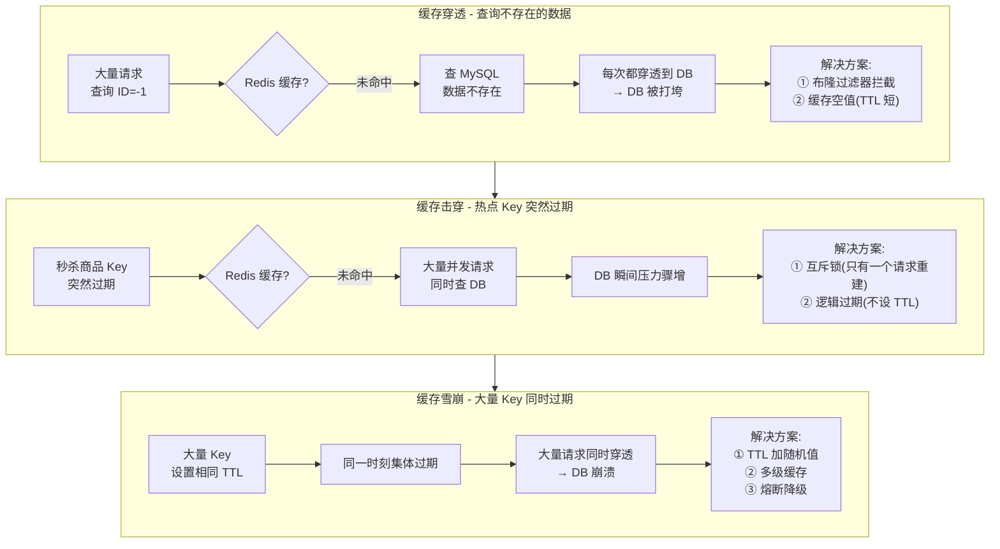
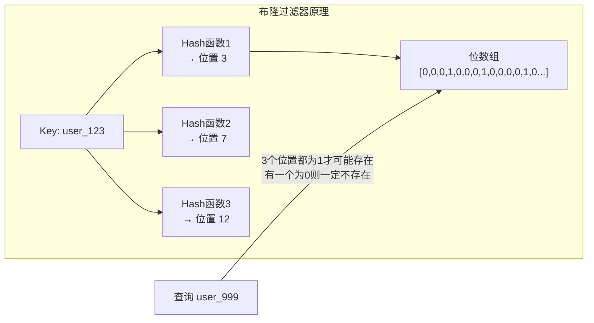
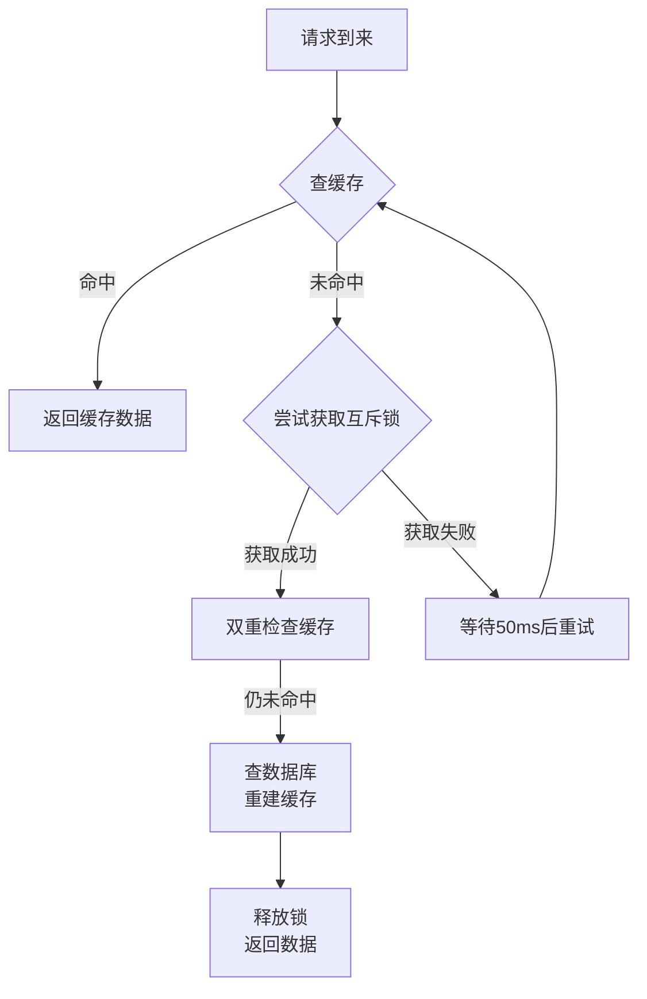
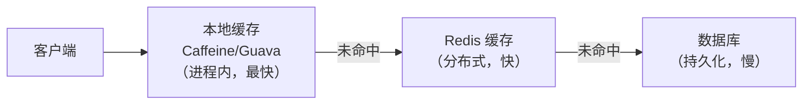

# Redis 缓存三大问题：穿透、击穿、雪崩

> **一句话记忆口诀**：
>
> 1. **穿透**（查不存在的数据） → **布隆过滤器** 在缓存前把"一定不存在的 Key"挡住；辅以 **缓存空值**（短 TTL）。
> 2. **击穿**（单热点 Key 突然过期） → **互斥锁** 只让一个线程回源重建（强一致）；或 **逻辑过期** 永不 TTL、异步刷新（高可用）。
> 3. **雪崩**（大量 Key 同时过期 / Redis 宕机） → **TTL 随机偏移** + **多级缓存**（Caffeine + Redis）+ **熔断降级** + **Redis 高可用**。
> 4. **判别口诀**：**不存在**找穿透、**热点过期**找击穿、**批量过期**找雪崩——三者触发条件完全不同，方案不可混用。

> 📖 **边界声明**：本文聚焦"三大缓存异常的触发机制与防护方案"，以下相关主题请见对应专题：
>
> - **缓存与数据库一致性**（Cache Aside / 延迟双删 / Canal 全流程） → [Redis 应用型问题](@redis-应用型问题) §1
> - **分布式锁完整实现**（`SETNX` / Redisson 看门狗 / RedLock） → [分布式锁](@redis-分布式锁)
> - **大 Key / 热 Key 的发现与拆分** → [Redis 应用型问题](@redis-应用型问题) §3
> - **哨兵 / 集群防 Redis 层雪崩的架构细节** → [高可用架构](@redis-高可用架构)

!!! note "📖 术语家族：`缓存异常问题族`"
    **字面义**：请求**绕过或击穿**缓存层、直接打到数据库的三类异常场景，统称"缓存三大问题"。
    **在 Redis 中的含义**：三者都表现为"DB 被大量请求打穿"，但**触发条件与防护手法完全不同**——只有先区分属于哪一类，才能套对方案；实际业务中往往**三者并发**发生（热点 Key 过期 + 黑产构造无效 ID + 批量数据刷新），必须三套方案**组合部署**。
    **同家族成员**：

    | 成员 | 触发条件 | 流量特征 | 核心防护 |
    | :-- | :-- | :-- | :-- |
    | `Cache Penetration`（穿透）| 查询**数据本身不存在** | 持续性、可预谋（黑产） | **布隆过滤器** / 缓存空值 |
    | `Cache Breakdown`（击穿）| **单个热点 Key** 突然失效 | 瞬时性、聚焦单点 | **互斥锁** / 逻辑过期 |
    | `Cache Avalanche`（雪崩）| **大量 Key** 同时失效 / Redis 宕机 | 瞬时性、波及整层 | **TTL 随机** / 多级缓存 / 熔断 |

    **防护手法家族**：`Bloom Filter`（布隆过滤器）、`Null Caching`（空值缓存）、`Mutex Lock`（互斥锁）、`Logical Expiration`（逻辑过期）、`Random TTL`（TTL 抖动）、`Multi-Level Cache`（多级缓存）、`Circuit Breaker`（熔断降级）。
    **命名规律**：**动词 + Cache** = "对缓存做了什么"——Penetration 是"穿过"（数据不存在所以穿）、Breakdown 是"崩塌"（单点失效所以塌）、Avalanche 是"雪崩"（大规模连锁反应）。记住**英文词根的物理意象**，三者边界立刻清晰。

---

## 1. 引入：为什么会有这三大问题？

Redis 作为缓存层，正常流程是：**先查缓存，命中则返回；未命中则查数据库，并将结果写入缓存**。

三大问题都是这个流程被破坏的情况：

| 问题 | 本质 | 后果 |
| :-- | :-- | :-- |
| **缓存穿透** | 查询的数据根本不存在，缓存永远不会命中 | 每次请求都打到 DB |
| **缓存击穿** | 单个热点 Key 突然过期，大量并发同时未命中 | 瞬间大量请求打到 DB |
| **缓存雪崩** | 大量 Key 同时过期，缓存层集体失效 | 大规模请求打到 DB，DB 崩溃 |

---

## 2. 三大问题对比图



---

## 3. 缓存穿透

### 3.1 问题描述

攻击者或异常请求**不断查询不存在的数据**（如 `id=-1`、`id=99999999`），由于数据不存在，缓存中永远没有，每次都穿透到数据库。

**典型场景**：

- 恶意攻击：构造大量不存在的 ID 发起请求
- 业务 Bug：查询逻辑错误，传入了无效参数

### 3.2 解决方案一：布隆过滤器

**原理**：在缓存层前加一个布隆过滤器，存储所有**合法的 Key**。请求进来先经过布隆过滤器，如果判断 Key 不存在，直接返回，不查缓存和 DB。



**布隆过滤器特点**：

- **误判率**：可能误判"不存在的 Key 存在"（假阳性），但**不会**误判"存在的 Key 不存在"
- **不可删除**：标准布隆过滤器不支持删除（可用 Counting Bloom Filter）
- **为什么用多个 Hash 函数**：单个 Hash 函数碰撞率高，多个 Hash 函数降低误判率

**Redis 实现布隆过滤器**：

```bash
# 方式1：使用 RedisBloom 模块（推荐）
BF.ADD users user:123
BF.EXISTS users user:999   # 返回 0 表示一定不存在

# 方式2：用 String 的 SETBIT 手动实现
SETBIT bloom:users 3 1     # 将位置3设为1
GETBIT bloom:users 3       # 查询位置3
```

**Java 代码示例（Guava 布隆过滤器）**：

```java
// 初始化布隆过滤器（预期100万数据，误判率0.01%）
BloomFilter<Long> bloomFilter = BloomFilter.create(
    Funnels.longFunnel(), 1_000_000, 0.001);

// 数据库中所有合法 ID 加入布隆过滤器
bloomFilter.put(userId);

// 查询前先检查
public User getUser(Long userId) {
    // 布隆过滤器判断不存在，直接返回
    if (!bloomFilter.mightContain(userId)) {
        return null;
    }
    // 查缓存
    User user = redis.get("user:" + userId);
    if (user != null) return user;
    // 查数据库
    user = db.findById(userId);
    if (user != null) redis.set("user:" + userId, user, 300);
    return user;
}
```

### 3.3 解决方案二：缓存空值

**原理**：查询数据库发现数据不存在时，将**空值也缓存起来**（设置较短的 TTL，如 5 分钟），下次相同请求直接从缓存返回空值。

```java
public User getUser(Long userId) {
    String cacheKey = "user:" + userId;
    String cached = redis.get(cacheKey);

    // 命中缓存（包括空值缓存）
    if (cached != null) {
        return "NULL".equals(cached) ? null : JSON.parse(cached, User.class);
    }

    // 查数据库
    User user = db.findById(userId);
    if (user != null) {
        redis.set(cacheKey, JSON.toJSON(user), 300);  // 正常数据缓存5分钟
    } else {
        redis.set(cacheKey, "NULL", 60);  // 空值缓存1分钟（TTL 要短）
    }
    return user;
}
```

**两种方案对比**：

| 方案 | 优点 | 缺点 | 适用场景 |
| :--- | :--- | :--- | :--- |
| 布隆过滤器 | 内存占用极小，拦截效果好 | 有误判率，不支持删除 | 数据量大，Key 相对固定 |
| 缓存空值 | 实现简单，无误判 | 占用缓存空间，可能缓存大量空值 | 数据量小，Key 变化频繁 |

---

## 4. 缓存击穿

### 4.1 问题描述

**单个热点 Key**（如秒杀商品、热门文章）突然过期，此时大量并发请求同时未命中缓存，全部打到数据库，造成 DB 瞬间压力骤增。

**与缓存穿透的区别**：

- 穿透：数据根本不存在，任何时候都不会命中缓存
- 击穿：数据存在，只是热点 Key 在某一时刻过期了

### 4.2 解决方案一：互斥锁

**原理**：缓存未命中时，只允许**一个请求**去查数据库重建缓存，其他请求等待。



**Java 代码实现**：

```java
public String getWithMutex(String key) {
    // 1. 查缓存
    String value = redis.get(key);
    if (value != null) return value;

    // 2. 缓存未命中，尝试获取互斥锁
    String lockKey = "lock:" + key;
    boolean locked = redis.set(lockKey, "1", "NX", "PX", 30000); // 30秒超时防死锁

    if (locked) {
        try {
            // 3. 双重检查（防止其他线程已重建缓存）
            value = redis.get(key);
            if (value != null) return value;

            // 4. 查数据库重建缓存
            value = db.query(key);
            redis.set(key, value, 300);
            return value;
        } finally {
            redis.del(lockKey); // 释放锁
        }
    } else {
        // 5. 未获取到锁，等待后重试
        Thread.sleep(50);
        return getWithMutex(key); // 递归重试
    }
}
```

> ⚠️ **注意**：互斥锁方案会降低并发性能（大量请求在等待），适合对一致性要求高的场景。

### 4.3 解决方案二：逻辑过期

**原理**：Key **不设置 TTL**（永不过期），在 Value 中存储一个逻辑过期时间。查询时检查逻辑过期时间，如果过期则**异步**重建缓存，当前请求返回旧数据。

```java
// Value 结构
class CacheData {
    Object data;           // 实际数据
    LocalDateTime expireTime; // 逻辑过期时间
}

public Object getWithLogicalExpire(String key) {
    CacheData cached = redis.get(key);

    // 1. 未命中（Key 不存在），直接返回 null
    if (cached == null) return null;

    // 2. 检查逻辑过期时间
    if (cached.expireTime.isAfter(LocalDateTime.now())) {
        // 未过期，直接返回
        return cached.data;
    }

    // 3. 已过期，尝试获取互斥锁
    String lockKey = "lock:" + key;
    boolean locked = redis.set(lockKey, "1", "NX", "PX", 30000);

    if (locked) {
        // 4. 异步重建缓存（不阻塞当前请求）
        THREAD_POOL.submit(() -> {
            try {
                Object newData = db.query(key);
                CacheData newCache = new CacheData(newData, LocalDateTime.now().plusSeconds(300));
                redis.set(key, newCache); // 不设 TTL
            } finally {
                redis.del(lockKey);
            }
        });
    }

    // 5. 返回旧数据（可能是过期数据）
    return cached.data;
}
```

**两种方案对比**：

| 方案 | 一致性 | 可用性 | 适用场景 |
| :--- | :--- | :--- | :--- |
| 互斥锁 | 高（等待重建完成） | 低（等待期间请求阻塞） | 对数据一致性要求高 |
| 逻辑过期 | 低（可能返回旧数据） | 高（始终有数据返回） | 对可用性要求高，允许短暂数据不一致 |

---

## 5. 缓存雪崩

### 5.1 问题描述

**大量 Key 在同一时刻集体过期**，或 **Redis 服务宕机**，导致大量请求同时打到数据库，DB 被压垮。

**典型场景**：

- 系统启动时批量加载缓存，所有 Key 设置了相同的 TTL，到期时集体失效
- Redis 集群发生故障，缓存层整体不可用

### 5.2 解决方案

**方案一：TTL 加随机偏移量**（最简单有效）

```java
// ❌ 错误：所有 Key 相同 TTL
redis.set(key, value, 300);

// ✅ 正确：TTL 加随机偏移量，错开过期时间
int ttl = 300 + new Random().nextInt(60); // 300~360秒随机
redis.set(key, value, ttl);
```

**方案二：多级缓存**：



即使 Redis 雪崩，本地缓存仍能抵挡大部分请求。

**方案三：熔断降级**：

```java
// 使用 Sentinel 或 Hystrix 配置熔断
// 当 DB 请求失败率超过阈值，触发熔断，直接返回降级数据
@SentinelResource(value = "getUser", fallback = "getUserFallback")
public User getUser(Long userId) {
    return db.findById(userId);
}

public User getUserFallback(Long userId) {
    return new User(userId, "服务繁忙，请稍后重试");
}
```

**方案四：Redis 高可用（防止 Redis 宕机导致雪崩）**：

- 部署 Redis 哨兵模式或集群模式，避免单点故障
- 详见 [高可用架构](@redis-高可用架构)

---

## 6. 三大问题总结对比

| 问题 | 触发条件 | 影响范围 | 核心解决方案 |
| :--- | :--- | :--- | :--- |
| **缓存穿透** | 查询不存在的数据 | 每次请求都打 DB | 布隆过滤器 / 缓存空值 |
| **缓存击穿** | 单个热点 Key 过期 | 瞬间大量并发打 DB | 互斥锁 / 逻辑过期 |
| **缓存雪崩** | 大量 Key 同时过期 | 大规模请求打 DB | TTL 加随机值 / 多级缓存 |

---

## 7. 版本差异与演进

!!! note "📖 Redis 版本演进：缓存防护机制的重大变化"
    **Redis 4.0+**：**RedisBloom 模块**正式支持，布隆过滤器成为官方推荐方案，大幅降低穿透防护复杂度。

    **Redis 6.0+**：**多线程 I/O** 提升互斥锁方案的并发性能，逻辑过期方案在高并发场景下表现更优。

    **Redis 7.0+**：**集群模式稳定性**大幅提升，雪崩防护从单机方案向分布式方案演进。

**关键版本里程碑**：

| 版本 | 缓存防护相关重大变化 |
| :-- | :-- |
| **Redis 4.0** | **RedisBloom 模块**正式支持，布隆过滤器成为官方方案 |
| **Redis 6.0** | **多线程 I/O** 提升互斥锁并发性能 |
| **Redis 7.0** | **集群稳定性**提升，雪崩防护向分布式演进 |

**生产环境推荐版本**：**Redis 6.0+**（多线程优化）或 **Redis 7.0+**（集群稳定性）。

---

## 8. 姊妹文档分工矩阵

!!! tip "📖 机制 vs 用法分工原则"
    本文（基础概念型）专注**机制原理**，以下实战内容请见对应姊妹文档：

| 内容类别 | 本篇（机制原理） | 姊妹篇（实战调优） |
| :-- | :-- | :-- |
| **接口契约 / 源码链路** | ✅ 写满 | ❌ 只引用，不展开 |
| **底层动作机制** | ✅ 写满 | ❌ 不写 |
| **完整可运行代码示例** | ⚠️ 仅用于解释机制的**最小片段** | ✅ 写满 |
| **业务选型决策矩阵** | ❌ 不写 | ✅ 写满 |
| **故障排查流程 / checklist** | ❌ 不写 | ✅ 写满 |
| **性能压测数据对比** | ❌ 不写 | ✅ 写满 |

**具体分工**：

- **缓存一致性完整实现** → [Redis 应用型问题](@redis-应用型问题) §1
- **分布式锁完整代码** → [分布式锁](@redis-分布式锁)
- **大 Key / 热 Key 排查** → [Redis 应用型问题](@redis-应用型问题) §3
- **高可用架构部署** → [高可用架构](@redis-高可用架构)

---

## 9. 常见问题

**Q1：缓存穿透和缓存击穿的区别？**
> 穿透是查询**根本不存在**的数据，缓存永远不会命中；击穿是查询**存在**的数据，但热点 Key 在某一时刻过期了。穿透是持续性问题，击穿是瞬时性问题。

**Q2：如何保证缓存与数据库的一致性？**
> 📖 **缓存一致性题**已在 [Redis 应用型问题](@redis-应用型问题) §1 给出**工程视角答案**（Cache Aside 全流程、延迟双删残留问题、Canal 监听 Binlog 异步同步），本文不再重复，专注"机制原理"题。

**Q3：布隆过滤器的误判率如何控制？**
> 误判率由**位数组大小**和**哈希函数个数**决定。位数组越大、哈希函数越多，误判率越低，但内存占用越大。实际使用时根据数据量和可接受的误判率来选择参数（Guava 的 `BloomFilter.create` 可直接指定误判率）。

**Q4：互斥锁和逻辑过期哪个更好？**
> 没有绝对好坏，只有适用场景：**互斥锁**适合对一致性要求高的场景（如金融交易），**逻辑过期**适合对可用性要求高的场景（如内容展示）。实际生产环境常**组合使用**。

**Q5：Redis 4.0 前后布隆过滤器实现有何不同？**
> **Redis 4.0 前**：需手动用 `SETBIT`/`GETBIT` 实现，复杂度高；**Redis 4.0+**：内置 `RedisBloom` 模块，直接支持 `BF.ADD`/`BF.EXISTS` 命令，推荐使用。

**Q6：多级缓存中本地缓存如何选择？**
> **Caffeine**（性能最优，Java 8+）适合新项目；**Guava Cache**（兼容性好）适合老项目迁移。两者都支持**过期策略**和**大小限制**。

**Q7：熔断降级框架如何选型？**
> **Sentinel**（阿里开源）适合微服务场景；**Hystrix**（Netflix）成熟稳定但已停更。新项目推荐 **Sentinel**。

---

> 📖 **延伸阅读**：
>
> - 想深入了解缓存一致性完整实现？ → [Redis 应用型问题](@redis-应用型问题) §1
> - 需要分布式锁的完整代码示例？ → [分布式锁](@redis-分布式锁)
> - 遇到大 Key / 热 Key 如何排查？ → [Redis 应用型问题](@redis-应用型问题) §3
> - Redis 高可用架构如何部署？ → [高可用架构](@redis-高可用架构)
