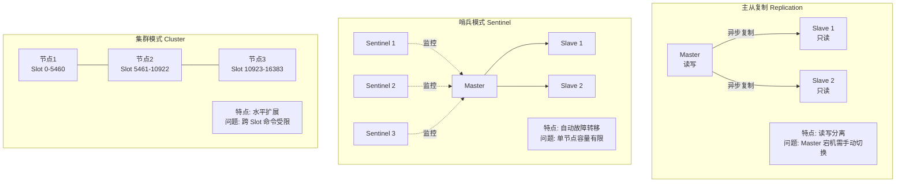
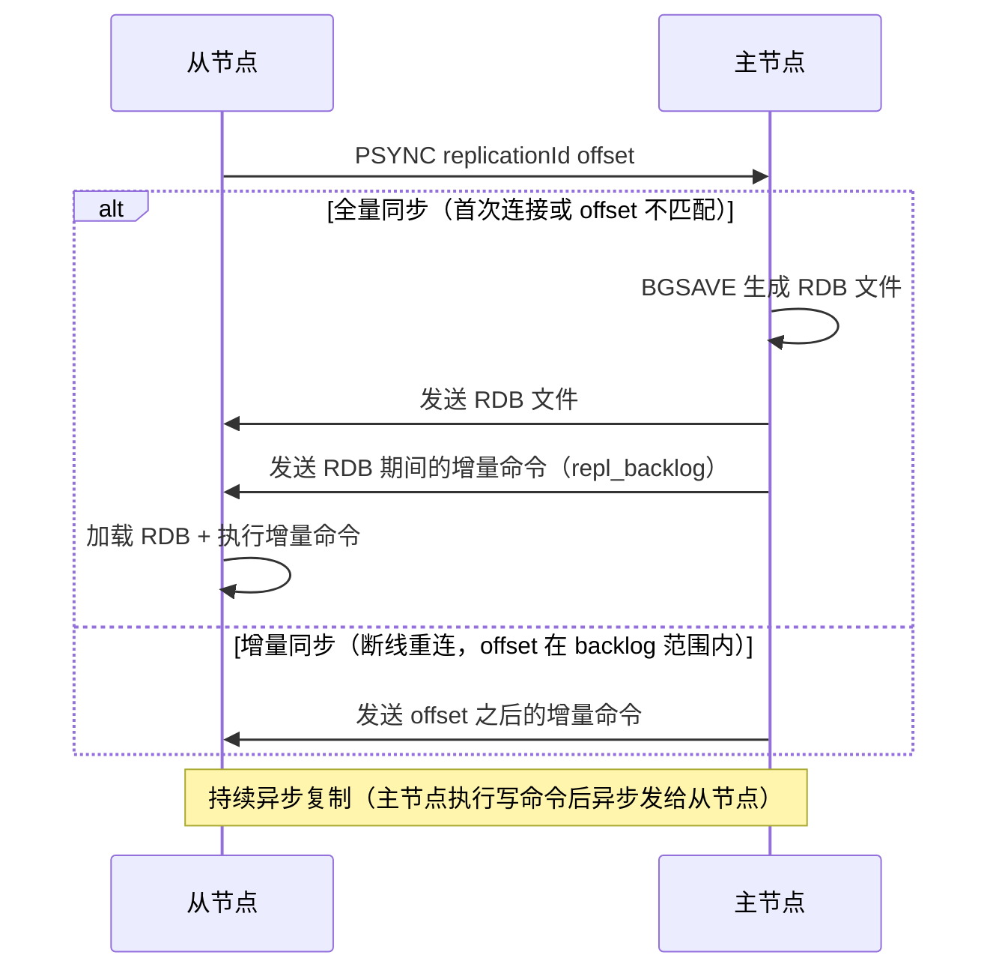
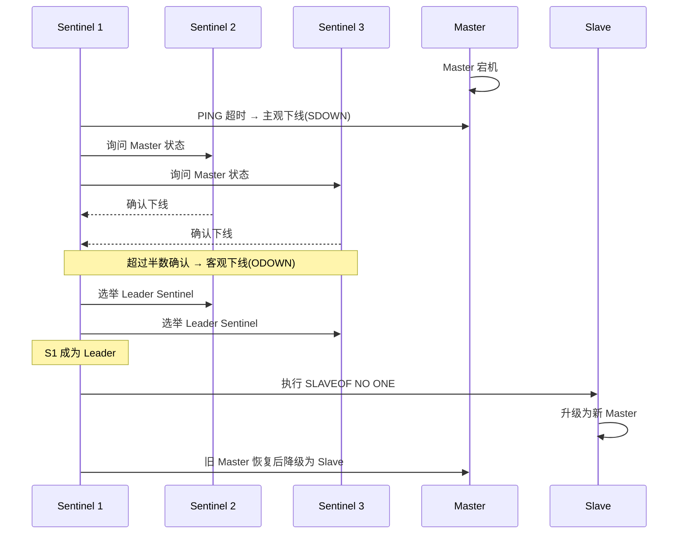
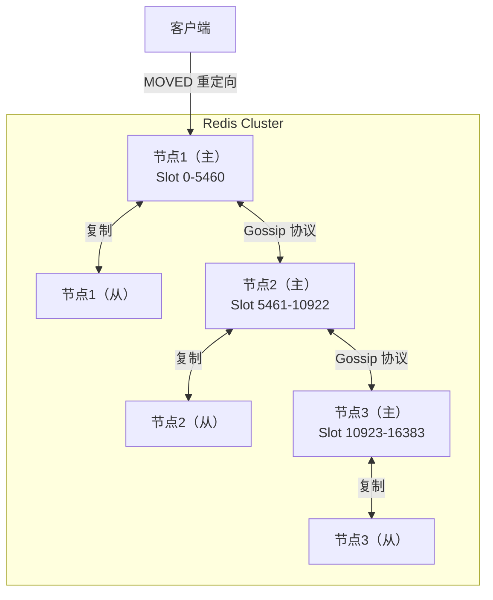
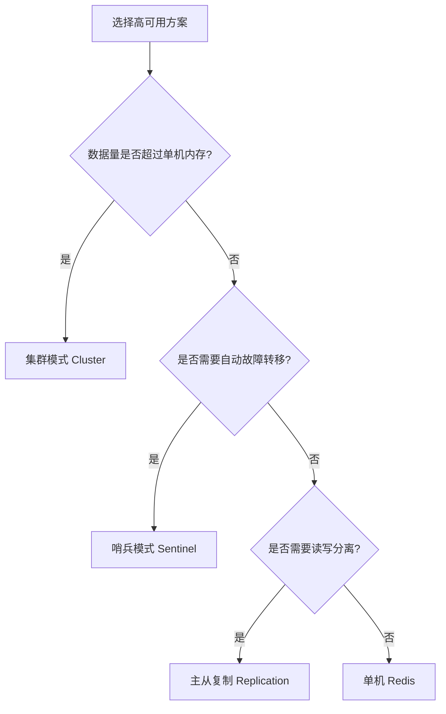

# Redis 高可用架构：主从、哨兵、集群

---

## 1. 引入：为什么需要高可用？

单机 Redis 存在以下问题：

| 问题 | 具体表现 | 解决方案 |
|------|---------|---------|
| **单点故障** | Redis 宕机，缓存层完全不可用 | 主从复制 + 哨兵自动切换 |
| **读性能瓶颈** | 单节点 QPS 约 10 万，高并发读场景不够 | 主从复制，读写分离 |
| **容量瓶颈** | 单机内存有限（通常 16~64GB） | 集群模式，水平扩展 |

---

## 2. 三种高可用方案概览



| 方案 | 适用场景 | 优点 | 缺点 |
|------|---------|------|------|
| **主从复制** | 读多写少，简单场景 | 读写分离，提升读性能 | 主节点宕机需手动切换 |
| **哨兵模式** | 需要自动故障转移 | 自动选主，高可用 | 单节点容量有限，无法水平扩展 |
| **集群模式** | 数据量大，需要水平扩展 | 水平扩展，支持海量数据 | 跨 Slot 命令受限，运维复杂 |

---

## 3. 主从复制（Replication）

### 3.1 工作原理



### 3.2 主从复制的特点

**读写分离**：
- 主节点：处理写请求
- 从节点：处理读请求（需要客户端或代理层支持）

**异步复制**：
- 主节点执行写命令后**不等待**从节点确认，直接返回客户端
- 优点：性能好；缺点：主节点宕机时，从节点可能丢失少量数据

**配置示例**：
```bash
# 从节点 redis.conf
replicaof 192.168.1.100 6379   # 指定主节点地址
replica-read-only yes           # 从节点只读（推荐）
```

### 3.3 主从复制的问题

- **主节点宕机需手动切换**：需要人工执行 `SLAVEOF NO ONE` 将从节点提升为主节点
- **脑裂风险**：网络分区时，客户端可能同时向两个"主节点"写数据

---

## 4. 哨兵模式（Sentinel）

### 4.1 哨兵的职责

哨兵是一个独立的 Redis 进程，负责：
1. **监控**：定期向主从节点发送 PING，检测是否存活
2. **通知**：节点状态变化时通知客户端
3. **自动故障转移**：主节点宕机时，自动选举新主节点

### 4.2 故障转移流程



**关键概念**：
- **主观下线（SDOWN）**：单个哨兵认为节点不可用
- **客观下线（ODOWN）**：超过半数哨兵确认节点不可用（防止网络抖动误判）
- **Leader 选举**：哨兵之间通过 Raft 算法选出 Leader，由 Leader 执行故障转移

> **为什么需要超过半数哨兵确认才客观下线**：防止网络分区导致的误判——如果只需要一个哨兵确认，网络抖动可能导致频繁的主从切换，影响稳定性。半数以上确认（Quorum）是分布式系统中常用的多数派原则。

### 4.3 哨兵配置示例

```bash
# sentinel.conf
sentinel monitor mymaster 192.168.1.100 6379 2  # 监控主节点，quorum=2
sentinel down-after-milliseconds mymaster 5000   # 5秒无响应则主观下线
sentinel failover-timeout mymaster 60000         # 故障转移超时60秒
sentinel parallel-syncs mymaster 1               # 故障转移时，同时同步的从节点数
```

### 4.4 哨兵模式的局限性

- **容量有限**：所有数据都在单个主节点，内存上限受单机限制
- **无法水平扩展**：写请求只能打到主节点，无法通过增加节点提升写性能

---

## 5. 集群模式（Cluster）

### 5.1 分片原理

Redis Cluster 将数据分散到 **16384 个哈希槽（slot）** 中：

```
计算公式：slot = CRC16(key) % 16384

示例：
  key = "user:123"
  CRC16("user:123") = 12345
  slot = 12345 % 16384 = 12345
  → 该 key 存储在负责 slot 12345 的节点上
```

**为什么是 16384 个 slot（而不是 65536 或更多）**：
- 16384 个 slot，每个节点的心跳包需要携带 slot 信息（位图），16384/8 = **2KB**
- 如果是 65536 个 slot，心跳包需要 **8KB**，网络开销太大
- 16384 个 slot 对于 1000 个节点以内的集群已经足够

### 5.2 集群架构图



### 5.3 MOVED 重定向

客户端请求到错误节点时，节点返回 `MOVED` 响应，告知正确节点地址：

```
客户端：GET user:123
节点1：MOVED 12345 192.168.1.102:6379   # 该 key 在节点2
客户端：重新向节点2发送请求
```

> 智能客户端（如 Jedis Cluster、Lettuce）会缓存 slot 与节点的映射关系，避免每次都重定向。

### 5.4 集群模式的注意事项

**跨 Slot 命令限制**：
```bash
# ❌ 错误：mget 的多个 key 在不同 slot，Cluster 模式不支持
MGET user:123 user:456

# ✅ 正确：使用哈希标签 {} 强制多个 key 落到同一 slot
MGET {user:123}:name {user:123}:age   # {} 内的内容相同，slot 相同
```

**哈希标签（Hash Tag）**：
```
key = "{user:123}:name"
计算 slot 时只取 {} 内的内容：CRC16("user:123") % 16384
这样 {user:123}:name 和 {user:123}:age 会落到同一 slot
```

**集群扩容（在线迁移）**：
```
新节点加入集群 → 从现有节点迁移部分 slot → 迁移完成后更新路由表
迁移期间，被迁移的 slot 会返回 ASK 重定向（临时重定向，不更新缓存）
```

---

## 6. 三种方案选型指南



---

## 7. 常见问题

**Q：哨兵模式和集群模式的区别？**
> 哨兵模式解决的是**高可用**问题（自动故障转移），数据仍在单个主节点，容量有限；集群模式解决的是**水平扩展**问题，数据分片存储在多个节点，支持海量数据，同时也具备高可用能力（每个分片有主从）。

**Q：Redis Cluster 为什么是 16384 个 slot？**
> 心跳包需要携带 slot 位图，16384 个 slot 只需 2KB，65536 个 slot 需要 8KB，网络开销太大。同时 16384 个 slot 对于千节点以内的集群已经足够。

**Q：集群模式下如何处理 mget/mset 等多 key 命令？**
> 使用**哈希标签（Hash Tag）**，在 key 中加入 `{相同标识}`，使相关 key 落到同一 slot。如 `{user:123}:name` 和 `{user:123}:age` 会落到同一 slot，可以正常使用 mget。

**Q：主从复制是同步还是异步？**
> **异步复制**。主节点执行写命令后不等待从节点确认，直接返回客户端。这意味着主节点宕机时，从节点可能丢失少量数据（未同步的部分）。如果需要强一致性，可以配置 `min-replicas-to-write` 要求至少 N 个从节点确认后才返回。