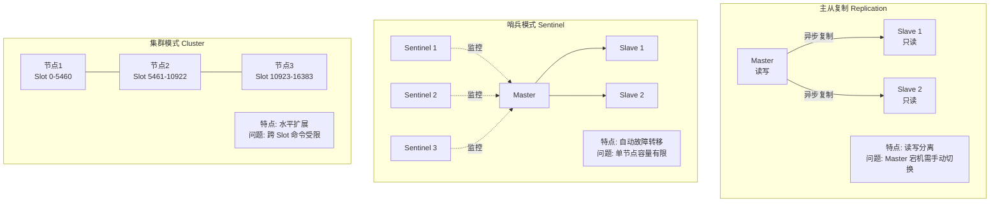
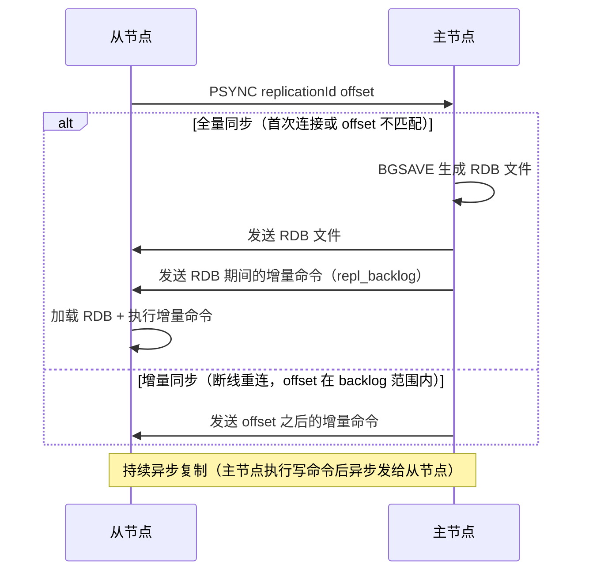
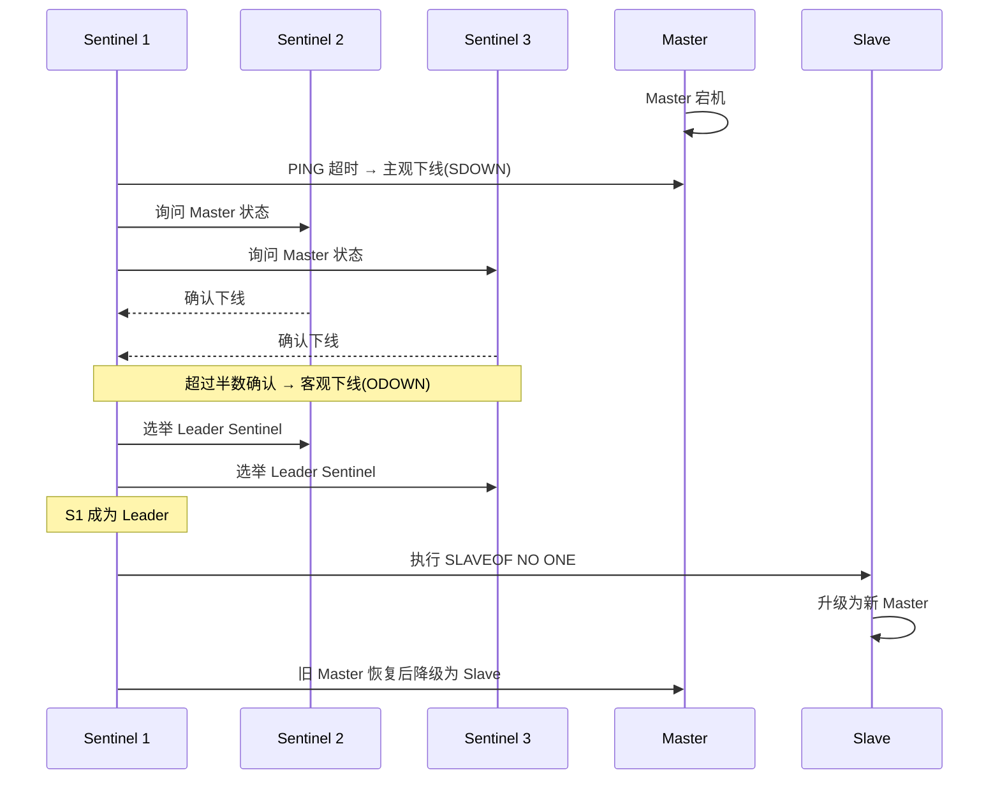
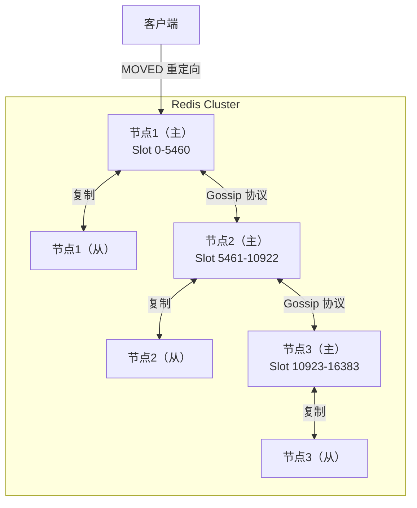
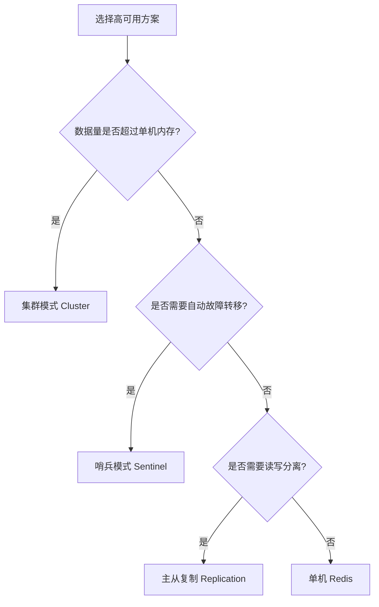

# Redis 高可用架构：主从、哨兵、集群

> **一句话记忆口诀**：
>
> 1. **主从复制**异步同步，`PSYNC` 先问能否增量、不行再 `BGSAVE` 走全量，复制积压缓冲区 `repl_backlog` 是断线重连能不能增量的唯一门槛。
> 2. **哨兵**三件套：**监控 / 通知 / 故障转移**，主观下线（SDOWN）一人说了算、客观下线（ODOWN）半数以上哨兵确认，Leader 选举走 Raft。
> 3. **集群**把 key 映射到 **16384 个 slot**（`CRC16(key) % 16384`），节点间跑 **Gossip** 协议交换拓扑，错路由返回 `MOVED`、迁移中返回 `ASK`。
> 4. **哈希标签** `{...}` 是跨 slot 命令（`MGET` / 事务 / Lua）的唯一通行证——`{}` 内相同即 slot 相同。
> 5. **容量 → 集群，自动切换 → 哨兵，仅读写分离 → 主从**，选型就这三档。

> 📖 **边界声明**：本文聚焦"Redis 高可用三大方案的**机制与选型**"，以下主题请见对应专题：
>
> - RDB / AOF 的生成与加载细节（`BGSAVE` 内部、混合持久化、`appendfsync` 三档）→ [持久化机制RDB与AOF](@redis-持久化机制RDB与AOF)
> - 分布式锁中的 RedLock 多节点算法 → [分布式锁](@redis-分布式锁)
> - 脑裂、主从延迟、大 Key 迁移卡顿等实战排查 → [应用型问题](@redis-应用型问题)
> - 单线程模型、epoll、Redis 6 I/O 多线程 → [单线程模型与网络IO](@redis-单线程模型与网络IO)

---

## 1. 引入：为什么需要高可用？

单机 Redis 存在以下问题：

| 问题 | 具体表现 | 解决方案 |
| :--- | :--- | :--- |
| **单点故障** | Redis 宕机，缓存层完全不可用 | 主从复制 + 哨兵自动切换 |
| **读性能瓶颈** | 单节点 QPS 约 10 万，高并发读场景不够 | 主从复制，读写分离 |
| **容量瓶颈** | 单机内存有限（通常 16~64GB） | 集群模式，水平扩展 |

---

## 2. 三种高可用方案概览



| 方案 | 适用场景 | 优点 | 缺点 |
| :--- | :--- | :--- | :--- |
| **主从复制** | 读多写少，简单场景 | 读写分离，提升读性能 | 主节点宕机需手动切换 |
| **哨兵模式** | 需要自动故障转移 | 自动选主，高可用 | 单节点容量有限，无法水平扩展 |
| **集群模式** | 数据量大，需要水平扩展 | 水平扩展，支持海量数据 | 跨 Slot 命令受限，运维复杂 |

---

## 3. 主从复制（Replication）

### 3.1 工作原理



### 3.2 主从复制的特点

**读写分离**：

- 主节点：处理写请求
- 从节点：处理读请求（需要客户端或代理层支持）

**异步复制**：

- 主节点执行写命令后**不等待**从节点确认，直接返回客户端
- 优点：性能好；缺点：主节点宕机时，从节点可能丢失少量数据

**配置示例**：

```bash
# 从节点 redis.conf
replicaof 192.168.1.100 6379   # 指定主节点地址
replica-read-only yes           # 从节点只读（推荐）
```

### 3.3 主从复制的问题

- **主节点宕机需手动切换**：需要人工执行 `SLAVEOF NO ONE` 将从节点提升为主节点
- **脑裂风险**：网络分区时，客户端可能同时向两个"主节点"写数据

---

## 4. 哨兵模式（Sentinel）

### 4.1 哨兵的职责

哨兵是一个独立的 Redis 进程，负责：

1. **监控**：定期向主从节点发送 PING，检测是否存活
2. **通知**：节点状态变化时通知客户端
3. **自动故障转移**：主节点宕机时，自动选举新主节点

!!! note "📖 术语家族：`Redis 高可用族`"
    **字面义**：**Replication**（复制）→ **Sentinel**（哨兵，字面义"哨兵 / 守望者"）→ **Cluster**（集群）三档递进的高可用方案。
    **在 Redis 中的含义**：三者解决**不同层次**的可用性问题——复制解决"读不够"、哨兵解决"主挂了没人自动切"、集群解决"单机装不下"；一个 Redis 部署只会落在其中一档上，不会同时启用哨兵 + Cluster（Cluster 自带故障转移，不需要哨兵）。
    **同家族成员**：

    | 成员 | 作用 | 关键术语 |
    | :-- | :-- | :-- |
    | `Replication` | 主从异步复制，读写分离 | `PSYNC` / `repl_backlog` / `replicationId` / `offset` |
    | `Sentinel` | 监控 + 自动故障转移 | `SDOWN`（主观下线）/ `ODOWN`（客观下线）/ `quorum` / `Leader 选举（Raft）` |
    | `Cluster` | 分片 + 高可用一体化 | `slot`（16384）/ `Gossip` / `MOVED` / `ASK` / `Hash Tag` |
    | `Failover` | 故障转移动作本身 | 主观下线 → 客观下线 → 选 Leader → 提升 Slave → 旧主降级 |
    | `Split-Brain`（脑裂） | 网络分区时出现双主 | 通过 `min-replicas-to-write` + `min-replicas-max-lag` 缓解 |

    **命名规律**：**"从单机 → 冗余 → 自动化 → 水平扩展"** 四步递进——读者看到一个 Redis 部署方案，只要判断它满足到第几步，就知道该落在哪个方案档位。

### 4.2 故障转移流程



**关键概念**：

- **主观下线（SDOWN）**：单个哨兵认为节点不可用
- **客观下线（ODOWN）**：超过半数哨兵确认节点不可用（防止网络抖动误判）
- **Leader 选举**：哨兵之间通过 Raft 算法选出 Leader，由 Leader 执行故障转移

> **为什么需要超过半数哨兵确认才客观下线**：防止网络分区导致的误判——如果只需要一个哨兵确认，网络抖动可能导致频繁的主从切换，影响稳定性。半数以上确认（Quorum）是分布式系统中常用的多数派原则。

### 4.3 哨兵配置示例

```bash
# sentinel.conf
sentinel monitor mymaster 192.168.1.100 6379 2  # 监控主节点，quorum=2
sentinel down-after-milliseconds mymaster 5000   # 5秒无响应则主观下线
sentinel failover-timeout mymaster 60000         # 故障转移超时60秒
sentinel parallel-syncs mymaster 1               # 故障转移时，同时同步的从节点数
```

### 4.4 哨兵模式的局限性

- **容量有限**：所有数据都在单个主节点，内存上限受单机限制
- **无法水平扩展**：写请求只能打到主节点，无法通过增加节点提升写性能

---

## 5. 集群模式（Cluster）

!!! note "📖 术语家族：`Cluster 分片族`"
    **字面义**：围绕"**把 key 分散到多台机器**"这件事的一组专有名词。
    **在 Redis 中的含义**：Redis Cluster 采用**预分片（Pre-sharding）**思路——不把 key 直接映射到机器，而是先映射到 **16384 个固定 slot**，再把 slot 动态分配给节点；扩容时迁移的是 slot，不是 key，迁移过程对客户端**部分透明**（靠 `MOVED` / `ASK` 重定向）。
    **同家族成员**：

    | 成员 | 作用 | 典型场景 |
    | :-- | :-- | :-- |
    | `Slot`（哈希槽，共 16384 个） | key 到节点的**中间映射层** | `slot = CRC16(key) % 16384` |
    | `CRC16` | 把 key 哈希成 16 位整数 | 决定 key 落到哪个 slot |
    | `Hash Tag` `{...}` | 强制一组 key 落到同一 slot | 跨 key 事务 / `MGET` / Lua 脚本 |
    | `Gossip` 协议 | 节点间交换拓扑与健康状态 | 心跳包携带 slot 位图（2KB） |
    | `MOVED` 重定向 | **永久**重定向，客户端应更新路由表 | slot 已完成迁移 |
    | `ASK` 重定向 | **临时**重定向，客户端不更新路由表 | slot 正在迁移中 |
    | `resharding` | 在线迁移 slot | 扩容 / 缩容 / 负载均衡 |

    **命名规律**：**"预分片 + 动态路由 + 最终一致"**——key 永远先过 slot 这层抽象，所以扩容不需要停机，但代价是跨 slot 命令受限（必须用 Hash Tag 兜住）。

### 5.1 分片原理

Redis Cluster 将数据分散到 **16384 个哈希槽（slot）** 中：

```txt
计算公式：slot = CRC16(key) % 16384

示例：
  key = "user:123"
  CRC16("user:123") = 12345
  slot = 12345 % 16384 = 12345
  → 该 key 存储在负责 slot 12345 的节点上
```

**为什么是 16384 个 slot（而不是 65536 或更多）**：

- 16384 个 slot，每个节点的心跳包需要携带 slot 信息（位图），16384/8 = **2KB**
- 如果是 65536 个 slot，心跳包需要 **8KB**，网络开销太大
- 16384 个 slot 对于 1000 个节点以内的集群已经足够

### 5.2 集群架构图



### 5.3 MOVED 重定向

客户端请求到错误节点时，节点返回 `MOVED` 响应，告知正确节点地址：

```txt
客户端：GET user:123
节点1：MOVED 12345 192.168.1.102:6379   # 该 key 在节点2
客户端：重新向节点2发送请求
```

> 智能客户端（如 Jedis Cluster、Lettuce）会缓存 slot 与节点的映射关系，避免每次都重定向。

### 5.4 集群模式的注意事项

**跨 Slot 命令限制**：

```bash
# ❌ 错误：mget 的多个 key 在不同 slot，Cluster 模式不支持
MGET user:123 user:456

# ✅ 正确：使用哈希标签 {} 强制多个 key 落到同一 slot
MGET {user:123}:name {user:123}:age   # {} 内的内容相同，slot 相同
```

**哈希标签（Hash Tag）**：

```txt
key = "{user:123}:name"
计算 slot 时只取 {} 内的内容：CRC16("user:123") % 16384
这样 {user:123}:name 和 {user:123}:age 会落到同一 slot
```

**集群扩容（在线迁移）**：

```txt
新节点加入集群 → 从现有节点迁移部分 slot → 迁移完成后更新路由表
迁移期间，被迁移的 slot 会返回 ASK 重定向（临时重定向，不更新缓存）
```

---

## 6. 三种方案选型指南



---

## 7. 常见问题

> 📖 **姊妹文档分工声明**：本文专注"高可用三大方案的**机制原理**题，以下实战调优类问题请见姊妹文档：
>
> - **故障排查**（脑裂、主从延迟、大Key迁移卡顿）→ [Redis应用型问题](@redis-应用型问题)
> - **性能调优**（配置参数、压测数据、优化建议）→ [Redis应用型问题](@redis-应用型问题)
> - **业务选型**（具体场景下A/B方案权衡）→ [Redis应用型问题](@redis-应用型问题)

**Q：哨兵模式和集群模式的区别？**
> 哨兵模式解决的是**高可用**问题（自动故障转移），数据仍在单个主节点，容量有限；集群模式解决的是**水平扩展**问题，数据分片存储在多个节点，支持海量数据，同时也具备高可用能力（每个分片有主从）。

**Q：Redis Cluster 为什么是 16384 个 slot？**
> 心跳包需要携带 slot 位图，16384 个 slot 只需 2KB，65536 个 slot 需要 8KB，网络开销太大。同时 16384 个 slot 对于千节点以内的集群已经足够。

**Q：集群模式下如何处理 mget/mset 等多 key 命令？**
> 使用**哈希标签（Hash Tag）**，在 key 中加入 `{相同标识}`，使相关 key 落到同一 slot。如 `{user:123}:name` 和 `{user:123}:age` 会落到同一 slot，可以正常使用 mget。

**Q：主从复制是同步还是异步？**
> **异步复制**。主节点执行写命令后不等待从节点确认，直接返回客户端。这意味着主节点宕机时，从节点可能丢失少量数据（未同步的部分）。如果需要强一致性，可以配置 `min-replicas-to-write` 要求至少 N 个从节点确认后才返回。

---

## 8. 总结

**一句话选型口诀**：**容量 → 集群，自动切换 → 哨兵，仅读写分离 → 主从**——三档递进，按需选择。
