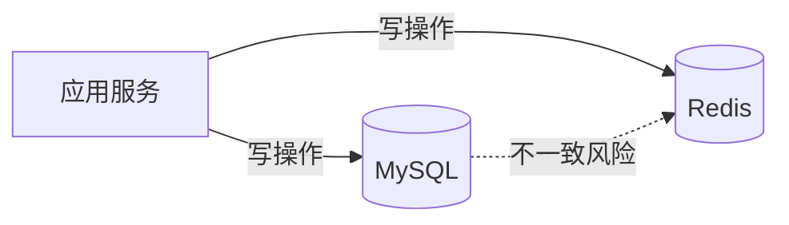
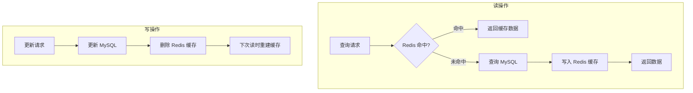
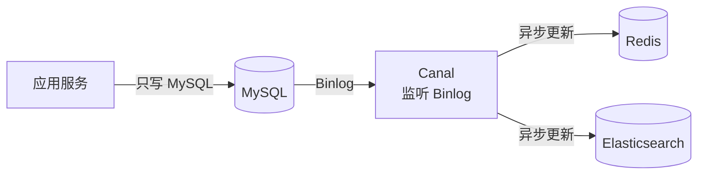
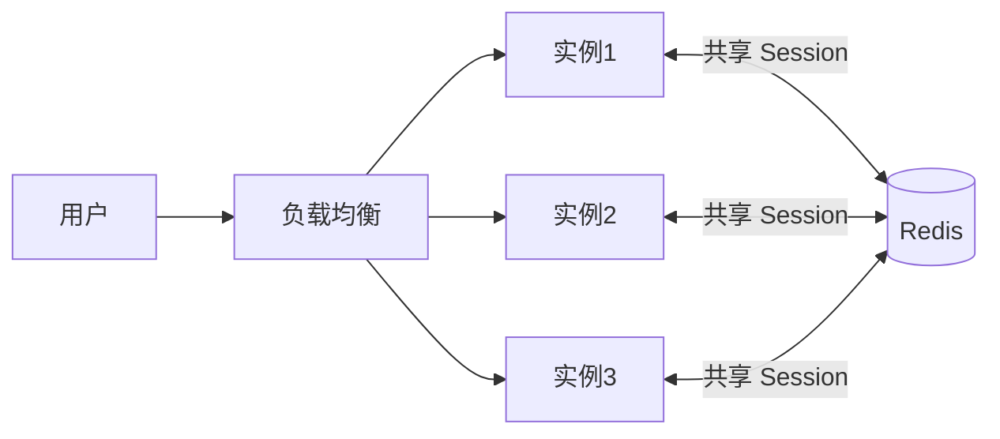
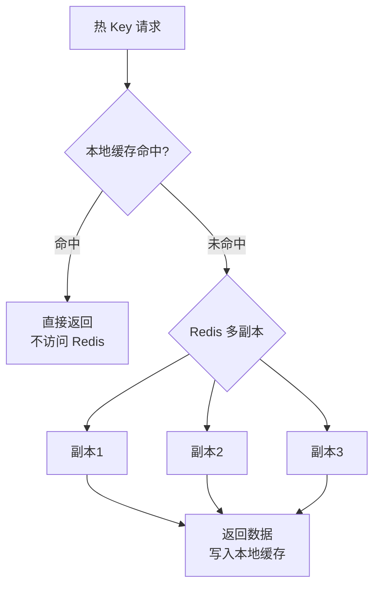

# Redis 应用型问题

---

## 一、缓存与数据库一致性

### 1.1 为什么缓存一致性是个难题？

缓存和数据库是两个独立的存储，任何写操作都需要同时更新两者，但**两步操作无法保证原子性**，中间任何一步失败都会导致数据不一致。



---

### 1.2 四种方案对比

| 方案 | 写操作顺序 | 一致性 | 性能 | 推荐度 |
|------|-----------|--------|------|-------|
| 先更新缓存，再更新 DB | 缓存→DB | ❌ 低（DB 失败则脏缓存） | 高 | ❌ 不推荐 |
| 先更新 DB，再更新缓存 | DB→缓存 | ❌ 低（并发写时脏数据） | 高 | ❌ 不推荐 |
| 先更新 DB，再删除缓存（Cache Aside） | DB→删缓存 | ✅ 较高 | 高 | ✅ **推荐** |
| 先删除缓存，再更新 DB | 删缓存→DB | ❌ 低（删后有并发读写入旧数据） | 高 | ❌ 不推荐 |

---

### 1.3 Cache Aside（旁路缓存）模式 ⭐

**这是最主流的方案**，读写逻辑如下：



**为什么写操作是"删除缓存"而不是"更新缓存"？**

> 并发场景下"更新缓存"会产生脏数据：
>
> ```
> 请求A（写）：更新 DB → （此时请求B抢先更新了缓存）→ 请求A再更新缓存（覆盖了B的新值）
> 结果：缓存中是A的旧值，DB中是B的新值 → 不一致！
> ```
>
> "删除缓存"则不会有这个问题：删除后下次读时从 DB 重建，始终是最新值。

---

### 1.4 Cache Aside 的残留问题：并发读写

即使用了 Cache Aside，极端并发场景下仍可能出现不一致：

```
T1: 请求A（写）更新 DB，准备删缓存
T2: 请求B（读）缓存未命中，查 DB 得到旧值
T3: 请求A 删除缓存
T4: 请求B 将旧值写入缓存
结果：缓存中是旧值！
```

**解决方案：延迟双删**

```java
public void updateUser(User user) {
    // 1. 更新数据库
    db.update(user);

    // 2. 第一次删除缓存
    redis.del("user:" + user.getId());

    // 3. 延迟一段时间（等待并发读请求完成），再删一次
    // 延迟时间 > 一次读操作的时间（通常 500ms~1s）
    Thread.sleep(500);
    redis.del("user:" + user.getId());
}
```

> ⚠️ 延迟双删不能完全保证一致性，只是降低了不一致的概率。对一致性要求极高的场景，需要引入分布式事务或 Canal 方案。

---

### 1.5 Canal 方案（最终一致性）

**原理**：监听 MySQL Binlog，异步同步到 Redis，彻底解耦业务代码与缓存更新。



| 方案 | 一致性 | 实现复杂度 | 适用场景 |
|------|--------|-----------|---------|
| Cache Aside + 延迟双删 | 最终一致（毫秒级） | 低 | 大多数业务场景 |
| Canal 异步同步 | 最终一致（秒级） | 高（需要部署 Canal） | 数据同步链路复杂，多个下游需要同步 |
| 分布式事务（2PC/Saga） | 强一致 | 极高 | 金融级一致性要求 |

---

## 二、典型业务场景

### 2.1 排行榜（ZSet）

**场景**：游戏积分榜、热搜榜、销量榜

```java
// 数据结构：ZSet（有序集合）
// key: rank:game:week
// member: userId
// score: 积分

// 更新积分（原子操作）
redis.zincrby("rank:game:week", 100, "user:1001");

// 获取前10名（score 从高到低）
Set<Tuple> top10 = redis.zrevrangeWithScores("rank:game:week", 0, 9);
top10.forEach(t -> System.out.println(t.getElement() + ": " + t.getScore()));

// 获取某用户排名（0-based，+1 得到实际排名）
Long rank = redis.zrevrank("rank:game:week", "user:1001");
System.out.println("排名：" + (rank + 1));

// 获取某用户积分
Double score = redis.zscore("rank:game:week", "user:1001");
```

**注意事项**：
- ZSet 的 score 是 `double` 类型，积分超过 2^53 时精度丢失，可以用 `member` 拼接时间戳来区分相同积分的先后顺序
- 排行榜数据量大时，可以只维护 Top N（如 Top 1000），超出范围的用 `zremrangebyrank` 定期清理

---

### 2.2 计数器（String INCR）

**场景**：文章阅读数、点赞数、接口调用次数

```java
// 文章阅读数（原子自增，天然线程安全）
Long views = redis.incr("article:views:1001");

// 带过期时间的计数（如每日访问量）
String key = "pv:" + LocalDate.now(); // pv:2024-01-15
redis.incr(key);
redis.expire(key, 86400 * 2); // 保留2天

// 批量获取多个计数
List<String> keys = Arrays.asList("article:views:1001", "article:views:1002");
List<String> values = redis.mget(keys);
```

**为什么用 Redis 而不是 MySQL？**
> MySQL 的 `UPDATE article SET views = views + 1` 需要行锁，高并发下性能差；Redis 的 `INCR` 是原子操作，单线程执行，无锁竞争，QPS 可达 10 万+。

---

### 2.3 接口限流（滑动窗口）

**场景**：防止接口被刷，限制每个用户每分钟最多调用 100 次

#### 方案一：固定窗口（简单但有临界问题）

```java
public boolean isAllowed(String userId) {
    String key = "rate:" + userId + ":" + (System.currentTimeMillis() / 60000);
    Long count = redis.incr(key);
    if (count == 1) redis.expire(key, 60); // 第一次设置过期时间
    return count <= 100;
}
// 问题：在窗口切换时（如 0:59 和 1:00），可能在2秒内请求200次
```

#### 方案二：滑动窗口（ZSet 实现）⭐

```java
public boolean isAllowed(String userId, int limit, int windowSeconds) {
    String key = "rate:slide:" + userId;
    long now = System.currentTimeMillis();
    long windowStart = now - windowSeconds * 1000L;

    // Lua 脚本保证原子性
    String luaScript = """
        local key = KEYS[1]
        local now = tonumber(ARGV[1])
        local windowStart = tonumber(ARGV[2])
        local limit = tonumber(ARGV[3])

        -- 删除窗口外的旧请求
        redis.call('zremrangebyscore', key, 0, windowStart)

        -- 统计窗口内的请求数
        local count = redis.call('zcard', key)

        if count < limit then
            -- 未超限，记录本次请求
            redis.call('zadd', key, now, now)
            redis.call('expire', key, ARGV[4])
            return 1
        else
            return 0
        end
        """;

    Long result = redis.eval(luaScript,
        Collections.singletonList(key),
        Arrays.asList(
            String.valueOf(now),
            String.valueOf(windowStart),
            String.valueOf(limit),
            String.valueOf(windowSeconds + 1)
        ));

    return result == 1L;
}
```

#### 方案三：令牌桶（Redisson RateLimiter）

```java
// Redisson 内置令牌桶限流器
RRateLimiter rateLimiter = redissonClient.getRateLimiter("api:limit:userId");

// 初始化：每秒生成10个令牌，桶容量10
rateLimiter.trySetRate(RateType.PER_CLIENT, 10, 1, RateIntervalUnit.SECONDS);

// 尝试获取令牌（非阻塞）
if (rateLimiter.tryAcquire()) {
    // 处理请求
} else {
    // 限流，返回 429
}
```

---

### 2.4 消息队列（List / Stream）

#### 方案一：List 实现简单队列

```java
// 生产者：从左边推入
redis.lpush("queue:order", JSON.toJSON(order));

// 消费者：从右边阻塞弹出（BRPOP，没有消息时阻塞等待）
List<String> result = redis.brpop(30, "queue:order"); // 最多等待30秒
if (result != null) {
    String message = result.get(1);
    processOrder(JSON.parse(message, Order.class));
}
```

**List 队列的缺点**：
- 消息消费后即删除，**不支持重复消费**
- 不支持消费者组
- 消费失败无法重试（消息已被弹出）

#### 方案二：Stream 实现可靠消息队列 ⭐

```java
// 生产者：发布消息
redis.xadd("stream:order", "*",  // * 表示自动生成消息ID
    "orderId", "1001",
    "userId", "2001",
    "amount", "99.9");

// 消费者组：创建消费者组（从头开始消费）
redis.xgroupCreate("stream:order", "group:payment", "0", true);

// 消费者：读取消息（未确认的消息会保留在 PEL 中）
List<MapRecord<String, Object, Object>> messages = redis.xreadgroup(
    Consumer.from("group:payment", "consumer-1"),
    XReadArgs.StreamOffset.lastConsumed("stream:order"),
    XReadArgs.Builder.count(10)
);

// 处理消息
for (MapRecord<String, Object, Object> msg : messages) {
    try {
        processOrder(msg.getValue());
        // 确认消息（从 PEL 中移除）
        redis.xack("stream:order", "group:payment", msg.getId());
    } catch (Exception e) {
        // 处理失败，消息留在 PEL 中，可以重新消费
        log.error("消息处理失败: {}", msg.getId(), e);
    }
}
```

**Redis Stream vs 专业 MQ 对比**：

| 维度 | Redis Stream | Kafka / RocketMQ |
|------|-------------|-----------------|
| 消息持久化 | ✅（依赖 AOF/RDB） | ✅（磁盘持久化） |
| 消费者组 | ✅ | ✅ |
| 消息回溯 | ✅（按 ID 回溯） | ✅ |
| 吞吐量 | 中（万级 QPS） | 高（百万级 QPS） |
| 消息堆积 | ❌（内存有限） | ✅（磁盘存储） |
| 适用场景 | 轻量级、消息量不大 | 高吞吐、海量消息 |

> **结论**：Redis Stream 适合轻量级消息场景（如内部服务通知）；高吞吐、海量消息场景用 Kafka/RocketMQ。

---

### 2.5 Session 共享

**场景**：多实例部署时，用户登录 Session 需要在所有实例间共享。



**Spring Session + Redis 实现**：

```java
// 1. 引入依赖
// spring-session-data-redis

// 2. 配置（application.yml）
// spring.session.store-type: redis
// spring.session.timeout: 30m

// 3. 启用（启动类）
@EnableRedisHttpSession(maxInactiveIntervalInSeconds = 1800)
@SpringBootApplication
public class Application { ... }

// 4. 使用（与普通 HttpSession 完全一样）
@PostMapping("/login")
public String login(HttpSession session, String username) {
    session.setAttribute("user", username);
    return "登录成功";
}

@GetMapping("/profile")
public String profile(HttpSession session) {
    return (String) session.getAttribute("user");
}
```

**Redis 中 Session 的存储结构**：
```
key: spring:session:sessions:{sessionId}
type: Hash
fields:
  sessionAttr:user → "张三"
  creationTime → 1705123456789
  lastAccessedTime → 1705123500000
  maxInactiveInterval → 1800
```

---

### 2.6 地理位置（GEO）

**场景**：附近的人、门店定位、外卖配送范围

```java
// 添加门店位置（经度, 纬度, 名称）
redis.geoadd("stores",
    116.404, 39.915, "store:1001",  // 北京天安门
    116.391, 39.907, "store:1002"   // 北京西单
);

// 查询附近5km内的门店（按距离排序）
GeoRadiusParam param = GeoRadiusParam.geoRadiusParam()
    .withDist()       // 返回距离
    .withCoord()      // 返回坐标
    .sortAscending()  // 按距离升序
    .count(10);       // 最多返回10个

List<GeoRadiusResponse> stores = redis.georadius(
    "stores", 116.397, 39.909, 5, GeoUnit.KM, param);

stores.forEach(s -> System.out.printf(
    "门店: %s, 距离: %.2fkm%n", s.getMemberByString(), s.getDistance()));
```

**底层原理**：GEO 底层使用 **ZSet** 存储，将经纬度通过 **GeoHash** 算法编码为一个 52 位整数作为 score，查询时通过 score 范围查询实现附近搜索。

---

## 三、大 Key 与热 Key 问题

### 3.1 大 Key 问题

**定义**：
- String 类型：value 超过 **10KB**
- Hash/List/Set/ZSet：元素数量超过 **5000** 个

**危害**：
- 读写大 Key 占用大量网络带宽，阻塞其他命令
- 删除大 Key（`DEL`）会阻塞 Redis 主线程（单线程！）
- 内存分布不均，导致某个节点内存远大于其他节点

**如何发现大 Key**：

```bash
# 方式1：redis-cli 扫描（推荐，不阻塞）
redis-cli --bigkeys

# 方式2：SCAN 命令遍历（生产环境推荐，可控速）
redis-cli --scan --pattern "*" | xargs -I {} redis-cli debug object {}

# 方式3：RDB 文件分析工具（rdb-tools）
rdb --command memory dump.rdb | sort -t',' -k4 -rn | head -20
```

**如何处理大 Key**：

```java
// 场景：Hash 存储了10万个用户信息
// ❌ 问题：单个 Key 过大
redis.hset("all:users", userId, userJson); // 10万条

// ✅ 方案1：Hash 分片（将大 Hash 拆分为多个小 Hash）
int shardCount = 100;
int shard = userId.hashCode() % shardCount;
redis.hset("users:shard:" + shard, userId, userJson); // 每个分片约1000条

// ✅ 方案2：对于 List/Set，按时间或范围分片
// 如：order:list:2024-01、order:list:2024-02

// ✅ 方案3：删除大 Key 用 UNLINK（异步删除，不阻塞主线程）
redis.unlink("big:key"); // 异步删除，Redis 4.0+
// 不要用 DEL，DEL 是同步删除，会阻塞主线程
```

---

### 3.2 热 Key 问题

**定义**：某个 Key 的访问频率远高于其他 Key（如秒杀商品、热搜词条），单个 Redis 节点承受所有流量。

**危害**：
- 单节点 CPU 打满，响应变慢
- 集群模式下，热 Key 所在节点成为瓶颈，其他节点空闲

**如何发现热 Key**：

```bash
# 方式1：redis-cli --hotkeys（需要开启 LFU 淘汰策略）
redis-cli --hotkeys

# 方式2：monitor 命令（生产慎用，性能影响大）
redis-cli monitor | grep "GET\|SET" | awk '{print $4}' | sort | uniq -c | sort -rn | head

# 方式3：业务层统计（推荐）
# 在应用层记录每个 Key 的访问次数，定期上报
```

**如何处理热 Key**：



**方案一：本地缓存（最有效）**

```java
// 使用 Caffeine 本地缓存，热 Key 直接在进程内命中
@Bean
public Cache<String, Object> localCache() {
    return Caffeine.newBuilder()
        .maximumSize(1000)
        .expireAfterWrite(5, TimeUnit.SECONDS) // 本地缓存5秒，允许短暂不一致
        .build();
}

public Object get(String key) {
    // 先查本地缓存
    Object value = localCache.getIfPresent(key);
    if (value != null) return value;

    // 再查 Redis
    value = redis.get(key);
    if (value != null) {
        localCache.put(key, value); // 写入本地缓存
    }
    return value;
}
```

**方案二：Key 复制（多副本分散热点）**

```java
// 将热 Key 复制为多个副本，随机读取
int replicaCount = 10;
String hotKey = "product:seckill:1001";

// 写入时，同时写入所有副本
for (int i = 0; i < replicaCount; i++) {
    redis.set(hotKey + ":replica:" + i, value, 300);
}

// 读取时，随机选择一个副本
int index = ThreadLocalRandom.current().nextInt(replicaCount);
Object value = redis.get(hotKey + ":replica:" + index);
```

---

## 四、常见问题

**Q：如何保证 Redis 和 MySQL 的数据一致性？**

> 推荐 **Cache Aside 模式**：读时先查缓存，未命中再查 DB 并写缓存；写时先更新 DB，再**删除**缓存（而非更新）。删除而非更新是为了避免并发写时的脏数据问题。
>
> 极端并发场景下可能出现短暂不一致，用**延迟双删**降低概率。对一致性要求极高时，用 **Canal 监听 Binlog** 异步同步，彻底解耦业务代码。

**Q：Redis 如何实现限流？**

> - **固定窗口**：`INCR` + `EXPIRE`，实现简单，但有窗口切换时的临界问题
> - **滑动窗口**：ZSet 存储请求时间戳，`ZREMRANGEBYSCORE` 删除窗口外的记录，`ZCARD` 统计窗口内请求数，精确但内存占用较大
> - **令牌桶**：Redisson `RRateLimiter`，支持突发流量，生产推荐

**Q：大 Key 如何删除？**

> 不能直接用 `DEL`，因为 Redis 是单线程，删除大 Key 会阻塞主线程，导致其他命令超时。
> - Redis 4.0+ 使用 `UNLINK` 命令，异步删除，不阻塞主线程
> - 对于大 Hash/Set/ZSet，先用 `HSCAN`/`SSCAN`/`ZSCAN` 分批删除元素，再删 Key

**Q：热 Key 如何处理？**

> 核心思路是**分散热点**：
> 1. **本地缓存**（最有效）：用 Caffeine 在进程内缓存热 Key，直接在内存命中，不访问 Redis
> 2. **Key 复制**：将热 Key 复制为多个副本（如 `key:replica:0~9`），读取时随机选择副本，将流量分散到多个节点
> 3. **读写分离**：Redis 集群的副本分片可以承担读请求，分散主分片压力

**Q：Redis 实现排行榜为什么用 ZSet 而不是 List？**

> ZSet 天然按 score 有序，支持 `ZREVRANGE`（按排名查询）、`ZREVRANK`（查询某成员排名）、`ZINCRBY`（原子更新积分）等操作，时间复杂度 O(log N)。List 只支持按插入顺序排列，不支持按分值排序，实现排行榜需要每次全量排序，性能差。

**Q：Redis 能完全替代 MQ 吗？**

> 不能。Redis 的 List/Stream 可以实现简单消息队列，但有明显局限：
> - **内存限制**：消息堆积时内存会被耗尽，而 Kafka 使用磁盘存储
> - **吞吐量**：Redis 万级 QPS，Kafka 百万级 QPS
> - **消息回溯**：Stream 支持，但不如 Kafka 灵活
>
> Redis 消息队列适合**轻量级、消息量小**的场景；高吞吐、海量消息、需要消息回溯的场景用 Kafka/RocketMQ。

---

> **复习检验标准**：能否说出 Cache Aside 的读写流程？能否解释为什么写操作要删缓存而不是更新缓存？能否说出大 Key 的危害和处理方式？能否用 ZSet 设计一个排行榜？