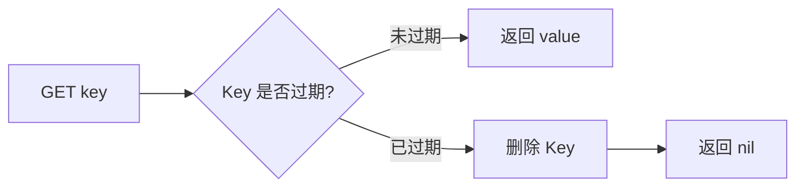
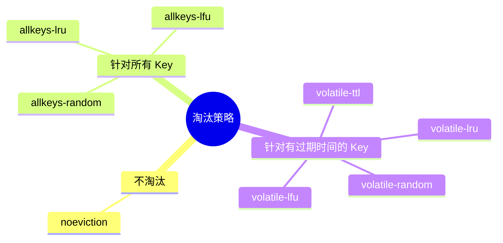
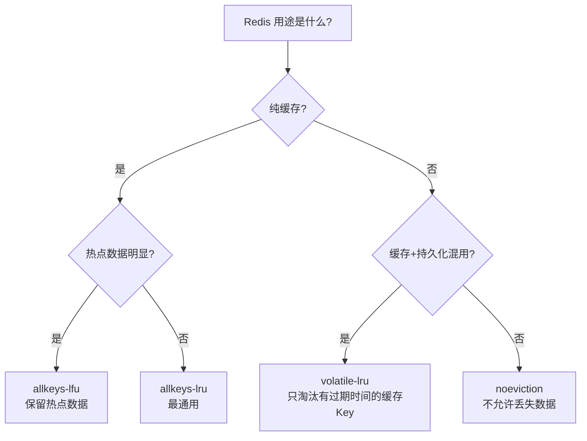

# Redis 内存管理与淘汰机制

---

## 1. 引入：为什么要关注内存管理？

Redis 是纯内存数据库，内存是最核心的资源。生产环境中常见的问题：

- **OOM（内存溢出）**：Redis 内存打满，写入报错 `OOM command not allowed when used memory > 'maxmemory'`
- **内存碎片率高**：`used_memory_rss` 远大于 `used_memory`，实际使用内存远超预期
- **Key 过期不及时**：大量过期 Key 未被清理，内存持续增长

理解内存管理，能帮助你：
- 合理配置 `maxmemory` 和淘汰策略，避免 OOM
- 排查内存碎片问题，降低内存占用
- 理解 Key 过期删除机制，避免内存泄漏

---

## 2. Redis 内存分配器：jemalloc

Redis 默认使用 **jemalloc** 作为内存分配器（而非 glibc 的 malloc）。

### 2.1 为什么选择 jemalloc？

| 对比项 | glibc malloc | jemalloc |
|--------|-------------|---------|
| 内存碎片率 | 较高 | 低（分级分配，减少碎片） |
| 多线程性能 | 一般 | 好（线程本地缓存） |
| 内存归还 | 慢 | 快（主动归还 OS） |

**jemalloc 分级分配原理**：将内存请求按大小分为多个级别（如 8B、16B、32B...），每次分配时向上取整到最近的级别，减少碎片。

```bash
# 查看 Redis 使用的内存分配器
redis-cli INFO server | grep mem_allocator
# 输出：mem_allocator:jemalloc-5.3.0
```

### 2.2 内存相关指标解读

```bash
redis-cli INFO memory
```

| 指标 | 含义 | 说明 |
|------|------|------|
| `used_memory` | Redis 实际使用的内存 | 包含所有数据、元数据 |
| `used_memory_rss` | OS 分配给 Redis 的物理内存 | 包含内存碎片 |
| `mem_fragmentation_ratio` | 内存碎片率 = rss / used | 正常值 1.0~1.5 |
| `used_memory_peak` | 历史内存使用峰值 | 用于评估内存水位 |
| `used_memory_lua` | Lua 引擎占用内存 | Lua 脚本过多时需关注 |

**内存碎片率判断**：

```
mem_fragmentation_ratio < 1.0  → 内存不足，Redis 在使用 Swap（严重！）
mem_fragmentation_ratio 1.0~1.5 → 正常
mem_fragmentation_ratio > 1.5  → 碎片率过高，需要处理
```

### 2.3 内存碎片整理

Redis 4.0+ 支持**在线内存碎片整理**（无需重启）：

```bash
# 查看碎片率
redis-cli INFO memory | grep mem_fragmentation_ratio

# 开启自动碎片整理（推荐）
redis-cli CONFIG SET activedefrag yes

# 碎片整理触发阈值配置
redis-cli CONFIG SET active-defrag-ignore-bytes 100mb  # 碎片超过100MB才整理
redis-cli CONFIG SET active-defrag-enabled yes
redis-cli CONFIG SET active-defrag-threshold-lower 10  # 碎片率超过10%触发
redis-cli CONFIG SET active-defrag-threshold-upper 100 # 碎片率超过100%全力整理
```

> ⚠️ 碎片整理会消耗 CPU，建议在低峰期开启，或设置合理的 CPU 使用上限（`active-defrag-max-scan-fields`）。

---

## 3. Key 过期删除机制

Redis 有两种过期 Key 删除策略，**同时使用**，互补不足：

### 3.1 惰性删除（Lazy Expiration）

**原理**：Key 过期后不立即删除，等到下次**访问该 Key 时**才检查是否过期，过期则删除并返回 nil。



**优点**：节省 CPU，不主动扫描  
**缺点**：过期 Key 如果一直不被访问，会一直占用内存（内存泄漏风险）

### 3.2 定期删除（Active Expiration）

**原理**：Redis 每隔 **100ms** 随机抽取一批设置了过期时间的 Key，检查并删除已过期的 Key。

**执行流程**：

```
每 100ms 执行一次：
  1. 从 expires 字典中随机抽取 20 个 Key
  2. 删除其中已过期的 Key
  3. 如果本批次过期 Key 比例 > 25%，立即再执行一次（直到比例 < 25% 或超时）
```

**优点**：主动回收内存，避免大量过期 Key 堆积  
**缺点**：随机抽取，不能保证所有过期 Key 都被及时清理

### 3.3 两种策略对比

| 策略 | 触发时机 | CPU 消耗 | 内存回收 |
|------|---------|---------|---------|
| 惰性删除 | 访问时 | 低 | 不及时 |
| 定期删除 | 每 100ms | 中 | 较及时 |

> **两者结合**：定期删除兜底大部分过期 Key，惰性删除处理漏网之鱼。但如果过期 Key 既不被访问、又没被定期删除抽到，就需要**内存淘汰策略**来兜底。

---

## 4. 内存淘汰策略（8 种）

当 Redis 内存达到 `maxmemory` 上限时，触发淘汰策略，决定淘汰哪些 Key 来腾出空间。

### 4.1 配置 maxmemory

```bash
# redis.conf 配置
maxmemory 4gb                    # 最大内存限制
maxmemory-policy allkeys-lru     # 淘汰策略

# 动态修改（无需重启）
redis-cli CONFIG SET maxmemory 4gb
redis-cli CONFIG SET maxmemory-policy allkeys-lru
```

### 4.2 8 种淘汰策略详解



| 策略 | 淘汰范围 | 淘汰规则 | 适用场景 |
|------|---------|---------|---------|
| `noeviction` | — | 不淘汰，内存满时写入报错 | 不允许数据丢失的场景（默认值） |
| `allkeys-lru` | 所有 Key | 淘汰最近最少使用的 Key | **最常用**，纯缓存场景 |
| `allkeys-lfu` | 所有 Key | 淘汰访问频率最低的 Key | 热点数据明显的场景（Redis 4.0+） |
| `allkeys-random` | 所有 Key | 随机淘汰 | 数据访问均匀，无明显热点 |
| `volatile-lru` | 有过期时间的 Key | 淘汰最近最少使用的 Key | 缓存+持久化混用场景 |
| `volatile-lfu` | 有过期时间的 Key | 淘汰访问频率最低的 Key | 缓存+持久化混用场景（Redis 4.0+） |
| `volatile-random` | 有过期时间的 Key | 随机淘汰 | 较少使用 |
| `volatile-ttl` | 有过期时间的 Key | 淘汰剩余 TTL 最短的 Key | 希望优先淘汰即将过期的数据 |

### 4.3 如何选择淘汰策略？



**生产推荐**：
- **纯缓存**：`allkeys-lru`（最常用，简单有效）
- **热点数据明显**：`allkeys-lfu`（LFU 比 LRU 更能保留真正的热点）
- **缓存与持久化数据混用**：`volatile-lru`（只淘汰设置了过期时间的缓存 Key，保护持久化数据）

---

## 5. LRU 与 LFU 算法原理

### 5.1 LRU（Least Recently Used，最近最少使用）

**标准 LRU**：维护一个双向链表，每次访问将 Key 移到链表头部，淘汰时删除链表尾部的 Key。

**Redis 的近似 LRU**：Redis 并未实现标准 LRU（维护链表开销大），而是使用**近似 LRU**：

```
每个 Key 维护一个 24 位的 lru_clock（最近访问时间戳，精度约 10 秒）
淘汰时：随机采样 N 个 Key（默认 5 个），淘汰其中 lru_clock 最小的那个
```

```bash
# 调整采样数量（越大越精准，但 CPU 消耗越高）
redis-cli CONFIG SET maxmemory-samples 10  # 默认 5，推荐 10
```

**近似 LRU 的问题**：无法区分"偶尔访问一次的 Key"和"频繁访问的热点 Key"，可能淘汰真正的热点。

### 5.2 LFU（Least Frequently Used，最少频率使用）

**Redis 4.0 引入**，每个 Key 维护一个**访问频率计数器**，淘汰访问频率最低的 Key。

**Redis LFU 的特殊设计**：

```
频率计数器不是简单累加，而是使用"对数计数器"：
- 访问次数越多，计数器增长越慢（避免老热点永远不被淘汰）
- 计数器会随时间衰减（避免历史热点占据内存）
```

```bash
# LFU 相关配置
lfu-log-factor 10      # 计数器增长速率（越大增长越慢，默认10）
lfu-decay-time 1       # 衰减时间（分钟），默认1分钟衰减一次
```

**LRU vs LFU 对比**：

| 对比项 | LRU | LFU |
|--------|-----|-----|
| 淘汰依据 | 最近访问时间 | 访问频率 |
| 热点保护 | 一般（偶发访问也能保留） | 好（真正高频的才保留） |
| 冷启动 | 好（新 Key 不会立即被淘汰） | 差（新 Key 频率为0，容易被淘汰） |
| 适用场景 | 通用 | 热点数据明显的场景 |

---

## 6. 内存优化实践

### 6.1 合理设置 maxmemory

```bash
# 建议：maxmemory 设置为物理内存的 60%~80%
# 预留空间给：AOF rewrite、主从复制缓冲区、Lua 脚本等

# 查看当前内存使用
redis-cli INFO memory | grep -E "used_memory_human|maxmemory_human"
```

### 6.2 使用合适的数据结构节省内存

```java
// ❌ 用 String 存对象（每个 Key 都有元数据开销）
redis.set("user:1001:name", "张三");
redis.set("user:1001:age", "25");
redis.set("user:1001:email", "zhangsan@qq.com");
// 3个 Key，每个 Key 约 50~100 字节元数据开销

// ✅ 用 Hash 存对象（共享 Key 元数据）
redis.hset("user:1001", "name", "张三", "age", "25", "email", "zhangsan@qq.com");
// 1个 Key，元素数 < 128 时使用 ziplist，内存节省 60%+
```

### 6.3 控制 Key 的数量和大小

```bash
# 查看 Key 数量
redis-cli DBSIZE

# 查看内存使用分布（按前缀统计）
redis-cli --scan --pattern "user:*" | wc -l

# 分析内存占用（采样分析，不阻塞）
redis-cli --memkeys
```

### 6.4 设置合理的 TTL

```java
// ❌ 不设置过期时间（内存只增不减）
redis.set("cache:product:1001", productJson);

// ✅ 设置过期时间 + 随机偏移（避免雪崩）
int ttl = 3600 + ThreadLocalRandom.current().nextInt(600); // 3600~4200秒
redis.setex("cache:product:1001", ttl, productJson);
```

---

## 7. 常见问题

**Q：Redis 内存碎片率高怎么处理？**

> 1. **开启自动碎片整理**（Redis 4.0+）：`CONFIG SET activedefrag yes`，Redis 会在后台自动整理碎片，对业务无感知
> 2. **重启 Redis**：重启后内存重新分配，碎片消失（需要配合持久化，避免数据丢失）
> 3. **主从切换**：先让从节点重启整理碎片，再切换主从角色

**Q：noeviction 策略下内存满了会怎样？**

> 所有写命令（SET/LPUSH/ZADD 等）都会返回错误 `OOM command not allowed when used memory > 'maxmemory'`，只读命令（GET/LRANGE 等）仍然可以执行。

**Q：LRU 和 LFU 怎么选？**

> - 大多数场景用 `allkeys-lru`，简单可靠
> - 如果业务有明显的热点数据（如秒杀商品、热搜词），用 `allkeys-lfu`，能更好地保留真正的热点 Key
> - 新上线的系统建议先用 LRU，稳定后根据监控数据决定是否切换 LFU

**Q：volatile-lru 和 allkeys-lru 怎么选？**

> - 如果 Redis 中**只存缓存数据**（所有 Key 都有 TTL）：用 `allkeys-lru`，淘汰范围更大，效果更好
> - 如果 Redis 中**同时存缓存和持久化数据**（部分 Key 无 TTL）：用 `volatile-lru`，只淘汰有过期时间的缓存 Key，保护无 TTL 的持久化数据

**Q：Redis 过期 Key 删除为什么不用定时删除？**

> 定时删除（为每个 Key 创建定时器，到期立即删除）虽然内存回收最及时，但 Redis 是单线程模型，大量定时器会占用大量 CPU，影响正常命令处理。因此 Redis 选择惰性删除 + 定期删除的组合，在 CPU 和内存之间取得平衡。

---

> **复习检验标准**：能否说出 8 种淘汰策略并知道各自适用场景？能否解释 Redis 的过期 Key 删除机制（惰性+定期）？能否解释内存碎片率的含义及处理方式？能否说出 LRU 和 LFU 的区别？
