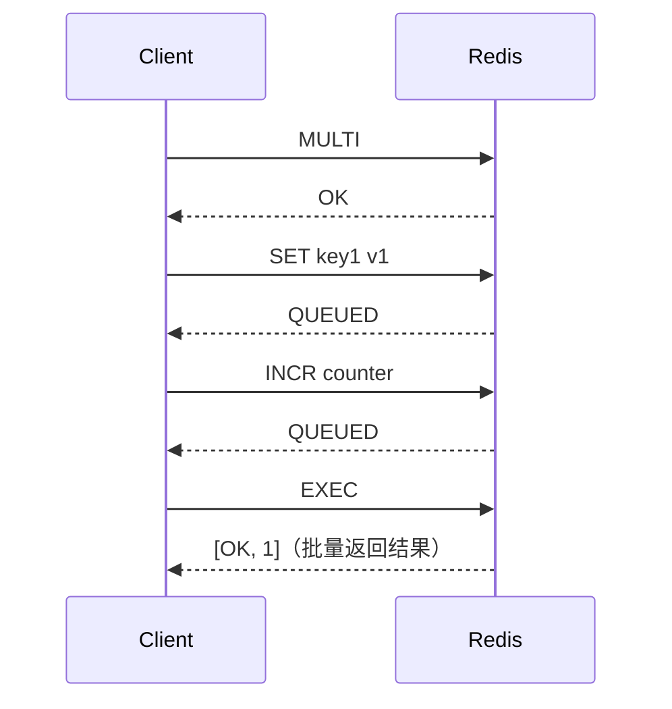
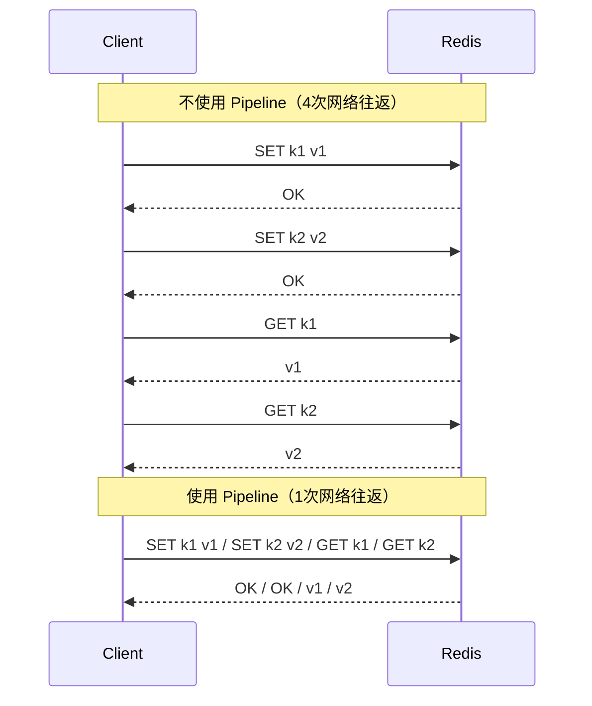

# Redis 事务与 Lua 脚本

> **一句话记忆口诀**：
>
> 1. `MULTI/EXEC` 只排队不回滚——**命令语法错**整事务拒，**运行时错**只报单条其他照跑；
> 2. `WATCH` = 乐观锁，冲突就重试，高并发下**性能差**，生产让位给 Lua；
> 3. `Lua 脚本` = 真原子——执行期间 Redis 不响应任何其他命令，是"判断+操作"复合逻辑的**生产首选**；
> 4. `Pipeline` **不是原子操作**，只压缩 RTT，命令之间仍可能被其他客户端插入；
> 5. 选型口诀：**无依赖批量 → Pipeline；固定命令组合 → MULTI；有条件判断 → Lua**。

> 📖 **边界声明**：本文聚焦"Redis 服务端的**原子性/批量性**原语（MULTI/EXEC、WATCH、Lua、Pipeline）"，以下主题请见对应专题：
>
> - 基于 Lua 实现的**分布式锁**（SETNX / 看门狗 / RedLock / 锁释放脚本）→ [分布式锁](@redis-分布式锁)
> - **内存淘汰**、**过期删除**、`OBJECT FREQ` 查询等 → [内存管理与淘汰机制](@redis-内存管理与淘汰机制)
> - Redis **单线程执行模型 / 事件循环**为什么能让 Lua 天然原子 → [单线程模型与网络IO](@redis-单线程模型与网络IO)
> - **缓存一致性**中的"延迟双删"、Canal 订阅 Binlog 等应用层事务 → [应用型问题](@redis-应用型问题)

---

## 1. 引入：为什么需要原子操作？

Redis 是单线程执行命令的，但**多个命令之间不是原子的**。考虑以下场景：

```reids
// 扣减库存：先查库存，再扣减
GET stock:product:1001      → 返回 10
SET stock:product:1001 9    → 设置为 9
```

如果两个请求同时执行，都读到库存为 10，然后都设置为 9，实际上只扣减了 1 次，但应该扣减 2 次——这就是**并发安全问题**。

解决方案：

1. **MULTI/EXEC 事务**：将多个命令打包，顺序执行
2. **Lua 脚本**：在 Redis 服务端执行，天然原子（**生产首选**）
3. **Pipeline**：批量发送命令，减少网络往返（注意：不是原子的）

---

## 2. Redis 事务（MULTI/EXEC）

!!! note "📖 术语家族：`事务与脚本族`"
    **字面义**：Redis 官方提供的**跨命令原子性/批量性**原语集合——从最轻量的 `Pipeline`（仅压 RTT）到最重的 `Lua 脚本`（真原子），按"原子强度"递进。
    **在 Redis 中的含义**：Redis 单线程模型决定了**单条命令天然原子**，但**多条命令之间不原子**，本族原语就是用来补齐"跨命令原子性"这道缺口的——每种原语的**原子强度 / 网络开销 / 逻辑能力**各不相同，**选型错了轻则性能差、重则出并发 Bug**。
    **同家族成员**：

    | 成员 | 原子强度 | 网络往返 | 逻辑能力 | 典型用途 |
    | :-- | :-- | :-- | :-- | :-- |
    | `MULTI` | — | 1 次入队 | — | 开启事务，后续命令进入队列 |
    | `EXEC` | ⚠️ 有限（不回滚） | 1 次执行 | 顺序执行 | 批量提交排队命令 |
    | `DISCARD` | — | 1 次 | — | 放弃当前事务（清空队列） |
    | `WATCH` / `UNWATCH` | 乐观锁 | 1 次 | — | CAS 监视 Key，冲突时 `EXEC` 返回 `nil` |
    | `EVAL` / `EVALSHA` | ✅ 真原子 | 1 次 | 条件/循环/变量 | **生产首选**的复杂原子逻辑 |
    | `SCRIPT LOAD` / `SCRIPT EXISTS` / `SCRIPT FLUSH` / `SCRIPT KILL` | — | 1 次 | — | Lua 脚本的生命周期管理 |
    | `Pipeline`（客户端能力） | ❌ 不原子 | **1 次打包** | 无 | 纯批量 RTT 优化，命令间可被插入 |

    **命名规律**：`MULTI/EXEC/DISCARD/WATCH` 借自关系型数据库事务命名哲学，但**语义大打折扣**（无回滚、仅单线程串行保证）；`EVAL*` 系围绕 Lua 虚拟机展开；`SCRIPT *` 系专管脚本生命周期。**一句话选型**：无依赖批量用 Pipeline、简单组合用 MULTI、有判断用 Lua。

### 2.1 基本用法

Redis 事务通过 `MULTI`、`EXEC`、`DISCARD`、`WATCH` 四个命令实现：

```bash
# 开启事务
MULTI

# 入队命令（此时命令不执行，只是排队）
SET key1 "value1"
INCR counter
LPUSH list "item"

# 提交事务（批量执行所有入队命令）
EXEC
# 返回：
# 1) OK
# 2) (integer) 1
# 3) (integer) 1

# 或者放弃事务
DISCARD
```



### 2.2 Redis 事务的特点

| 特性 | Redis 事务 | 关系型数据库事务 |
| :-- | :-- | :-- |
| 原子性 | ⚠️ 部分（见下文） | ✅ 完整 |
| 隔离性 | ✅（单线程，EXEC 期间不插入其他命令） | ✅ |
| 一致性 | ⚠️ 部分 | ✅ |
| 持久性 | 依赖持久化配置 | ✅ |
| 回滚 | ❌ 不支持 | ✅ |

**Redis 事务的"原子性"是有限的**：

```bash
MULTI
SET key1 "hello"      # 正确命令
INCR key1             # 错误：key1 是字符串，不能 INCR
SET key2 "world"      # 正确命令
EXEC
# 返回：
# 1) OK          ← SET key1 成功
# 2) ERR ...     ← INCR key1 失败（运行时错误）
# 3) OK          ← SET key2 成功（继续执行！）
```

> ⚠️ **Redis 事务不支持回滚**：某条命令执行失败，其他命令仍然继续执行。这与关系型数据库的事务完全不同。

**两种错误的区别**：

| 错误类型 | 示例 | 处理方式 |
| :-- | :-- | :-- |
| 语法错误（入队时报错） | `SET`（缺少参数） | 整个事务被拒绝，EXEC 返回错误 |
| 运行时错误（执行时报错） | 对 String 执行 `INCR` | 只有该命令失败，其他命令继续执行 |

### 2.3 WATCH：乐观锁

`WATCH` 命令实现**乐观锁**：监视一个或多个 Key，如果在 EXEC 之前这些 Key 被其他客户端修改，则整个事务取消（EXEC 返回 nil）。

```bash
# 场景：安全地扣减库存
WATCH stock:product:1001          # 监视库存 Key

stock = GET stock:product:1001    # 读取当前库存

MULTI                              # 开启事务
DECRBY stock:product:1001 1       # 扣减库存
EXEC
# 如果 WATCH 期间 stock:product:1001 被其他客户端修改：
#   EXEC 返回 nil（事务取消）
# 否则：
#   EXEC 正常执行，返回结果
```

**Java 实现（带重试）**：

```java
public boolean decrStock(String productId, int quantity) {
    String key = "stock:product:" + productId;

    for (int retry = 0; retry < 3; retry++) {
        // WATCH 监视 Key
        redis.watch(key);

        int stock = Integer.parseInt(redis.get(key));
        if (stock < quantity) {
            redis.unwatch();
            return false; // 库存不足
        }

        // 开启事务
        Transaction tx = redis.multi();
        tx.decrBy(key, quantity);

        // 提交事务
        List<Object> result = tx.exec();
        if (result != null) {
            return true; // 事务成功
        }
        // result == null 说明 WATCH 的 Key 被修改，重试
    }
    return false; // 重试3次失败
}
```

> ⚠️ **WATCH 的局限**：高并发下大量事务会因 WATCH 失败而重试，性能差。**生产环境推荐用 Lua 脚本替代**。

---

## 3. Lua 脚本（生产首选）

### 3.1 为什么 Lua 脚本是原子的？

Redis 执行 Lua 脚本时，**整个脚本作为一个原子操作执行**：

- 脚本执行期间，Redis 不会处理其他客户端的命令
- 脚本内的所有 Redis 命令要么全部执行，要么（脚本报错时）全部不执行


### 3.2 基本语法

```lua
-- EVAL script numkeys key [key ...] arg [arg ...]
-- KEYS[1], KEYS[2]... 对应传入的 key 参数
-- ARGV[1], ARGV[2]... 对应传入的 arg 参数

-- 示例：原子扣减库存
local stock = tonumber(redis.call('GET', KEYS[1]))
local quantity = tonumber(ARGV[1])

if stock == nil then
    return -1  -- Key 不存在
end

if stock < quantity then
    return 0   -- 库存不足
end

redis.call('DECRBY', KEYS[1], quantity)
return 1       -- 扣减成功
```

```bash
# 执行 Lua 脚本
EVAL "local stock = tonumber(redis.call('GET', KEYS[1])); if stock >= tonumber(ARGV[1]) then redis.call('DECRBY', KEYS[1], ARGV[1]); return 1 else return 0 end" 1 stock:product:1001 1
```

### 3.3 Java 中使用 Lua 脚本

```java
// 方式一：直接传脚本字符串（每次都需要编译，性能稍差）
String script = """
    local stock = tonumber(redis.call('GET', KEYS[1]))
    local quantity = tonumber(ARGV[1])
    if stock == nil then return -1 end
    if stock < quantity then return 0 end
    redis.call('DECRBY', KEYS[1], quantity)
    return 1
    """;

Long result = redis.eval(script,
    Collections.singletonList("stock:product:1001"),
    Collections.singletonList("1"));

// 方式二：SCRIPT LOAD 预加载（推荐，避免重复传输脚本）
// 1. 预加载脚本，获取 SHA1
String sha1 = redis.scriptLoad(script);
// 返回：e0e1f9fabfa9d353e2b9d2506e73e8e3e8e3e8e3

// 2. 后续用 EVALSHA 执行（只传 SHA1，不传脚本内容）
Long result = redis.evalsha(sha1,
    Collections.singletonList("stock:product:1001"),
    Collections.singletonList("1"));
```

### 3.4 典型 Lua 脚本案例

#### 案例一：原子扣减库存

```lua
-- decrStock.lua
local key = KEYS[1]
local quantity = tonumber(ARGV[1])

local stock = tonumber(redis.call('GET', key))
if stock == nil then
    return -1  -- 商品不存在
end
if stock < quantity then
    return 0   -- 库存不足
end

redis.call('DECRBY', key, quantity)
return redis.call('GET', key)  -- 返回扣减后的库存
```

#### 案例二：滑动窗口限流

```lua
-- rateLimiter.lua
local key = KEYS[1]
local now = tonumber(ARGV[1])
local windowMs = tonumber(ARGV[2])
local limit = tonumber(ARGV[3])

-- 删除窗口外的旧请求
redis.call('ZREMRANGEBYSCORE', key, 0, now - windowMs)

-- 统计窗口内请求数
local count = redis.call('ZCARD', key)

if count < limit then
    -- 未超限，记录本次请求（用时间戳作为 score 和 member）
    redis.call('ZADD', key, now, now)
    redis.call('EXPIRE', key, math.ceil(windowMs / 1000) + 1)
    return 1  -- 允许
else
    return 0  -- 限流
end
```

#### 案例三：分布式锁释放

```lua
-- releaseLock.lua（安全释放锁：只释放自己持有的锁）
if redis.call('GET', KEYS[1]) == ARGV[1] then
    return redis.call('DEL', KEYS[1])
else
    return 0
end
```

> 这是 Lua 脚本最经典的应用：**判断 + 操作** 两步必须原子执行，否则会出现并发问题。

### 3.5 Lua 脚本注意事项

```lua
-- ✅ 使用 redis.call()：命令失败时抛出错误，终止脚本
redis.call('SET', KEYS[1], ARGV[1])

-- ✅ 使用 redis.pcall()：命令失败时返回错误对象，脚本继续执行
local ok, err = redis.pcall('SET', KEYS[1], ARGV[1])
if err then
    -- 处理错误
end

-- ⚠️ 脚本中不能使用随机命令（如 RANDOMKEY、SRANDMEMBER）
-- 因为主从复制时，从节点执行相同脚本可能得到不同结果
-- 如果必须用，在脚本开头加：redis.replicate_commands()
```

---

## 4. Pipeline（管道）

### 4.1 什么是 Pipeline？

Pipeline 将多个命令**批量发送**给 Redis，一次性获取所有结果，减少网络往返次数（RTT）。



### 4.2 Java 使用 Pipeline

```java
// Jedis Pipeline
Pipeline pipeline = jedis.pipelined();
pipeline.set("k1", "v1");
pipeline.set("k2", "v2");
pipeline.incr("counter");
pipeline.get("k1");

// 批量执行，一次性获取所有结果
List<Object> results = pipeline.syncAndReturnAll();
// results: [OK, OK, 1, "v1"]

// Lettuce（Spring Boot 默认）
RedisAsyncCommands<String, String> async = connection.async();
RedisFuture<String> f1 = async.set("k1", "v1");
RedisFuture<String> f2 = async.set("k2", "v2");
LettuceFutures.awaitAll(1, TimeUnit.SECONDS, f1, f2);
```

### 4.3 Pipeline vs 事务 vs Lua 脚本

| 对比项 | Pipeline | MULTI/EXEC 事务 | Lua 脚本 |
| :-- | :-- | :-- | :-- |
| 原子性 | ❌ 不保证 | ⚠️ 有限（不支持回滚） | ✅ 完整原子 |
| 网络往返 | 1次（批量） | 2次（MULTI+EXEC） | 1次 |
| 服务端逻辑 | ❌ 不支持 | ❌ 不支持 | ✅ 支持条件判断、循环 |
| 错误处理 | 各命令独立 | 运行时错误不回滚 | 可用 pcall 捕获 |
| 适用场景 | 批量读写，无依赖关系 | 简单的命令组合 | 需要原子性的复杂逻辑 |

**选型建议**：

```txt
需要批量执行，命令间无依赖 → Pipeline（性能最好）
需要原子性，逻辑简单       → MULTI/EXEC（代码简单）
需要原子性，有条件判断      → Lua 脚本（生产首选）
```

---

## 5. 常见问题

**Q：Redis 事务支持回滚吗？**

> 不支持。Redis 事务中某条命令执行失败（运行时错误），其他命令仍然继续执行，不会回滚。Redis 的设计哲学是"简单高效"，回滚机制会增加复杂度。如果需要原子性，应该使用 Lua 脚本。

**Q：Lua 脚本和 MULTI/EXEC 事务有什么区别？**

> - **原子性**：Lua 脚本是真正的原子操作，脚本执行期间不处理其他命令；MULTI/EXEC 的原子性有限，运行时错误不会回滚
> - **逻辑能力**：Lua 脚本支持条件判断、循环、变量等复杂逻辑；MULTI/EXEC 只能顺序执行固定命令
> - **性能**：Lua 脚本只需 1 次网络往返；MULTI/EXEC 需要 2 次（MULTI 和 EXEC）
> - **生产推荐**：需要原子操作时，优先用 Lua 脚本

**Q：Pipeline 是原子的吗？**

> 不是。Pipeline 只是批量发送命令，减少网络往返，但命令之间可能被其他客户端的命令插入。Pipeline 适合批量读写且命令间无依赖关系的场景。

**Q：Lua 脚本执行时间过长会怎样？**

> Redis 是单线程的，Lua 脚本执行期间会阻塞所有其他命令。如果脚本执行时间超过 `lua-time-limit`（默认 5 秒），Redis 会开始接受 `SCRIPT KILL` 命令来终止脚本。因此 Lua 脚本应该尽量简短，避免复杂循环。

**Q：WATCH 和 Lua 脚本怎么选？**

> - **WATCH（乐观锁）**：适合冲突概率低的场景，实现简单，但高并发下重试次数多，性能差
> - **Lua 脚本**：适合高并发场景，无需重试，性能更好，是生产环境的首选

---

> **复习检验标准**：能否说出 Redis 事务的局限性（不支持回滚）？能否用 Lua 脚本实现原子扣减库存？能否区分 Pipeline、事务、Lua 脚本的适用场景？能否说出 Lua 脚本为什么是原子的？
