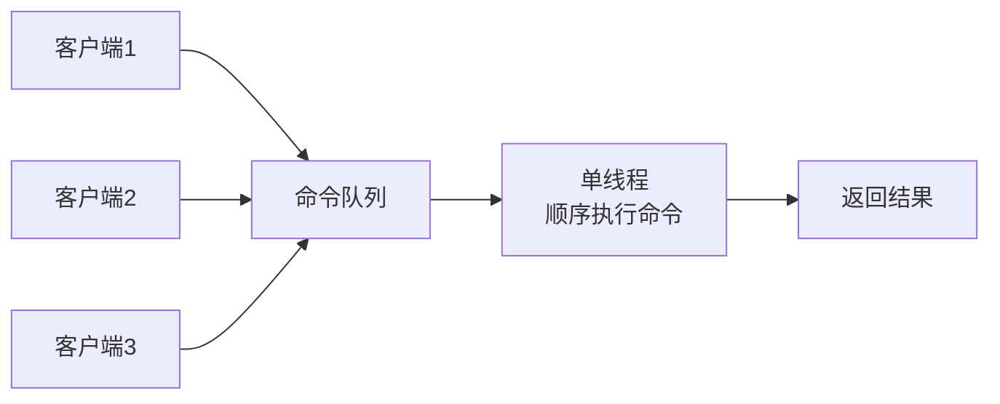
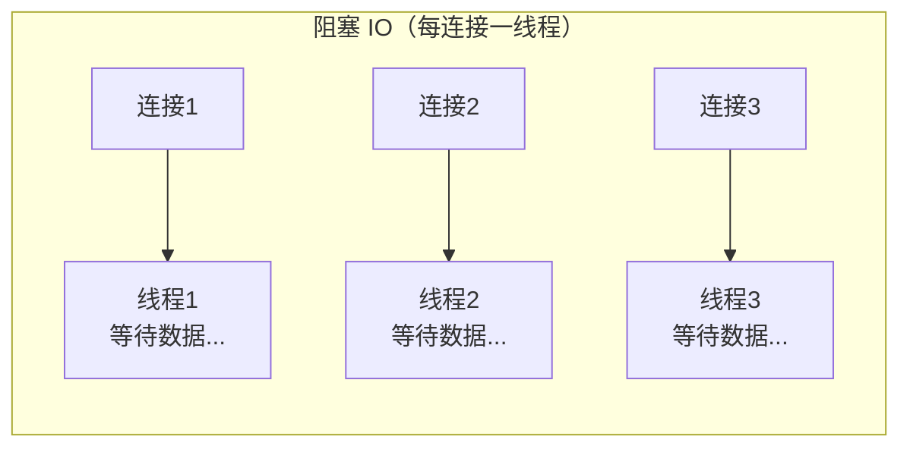
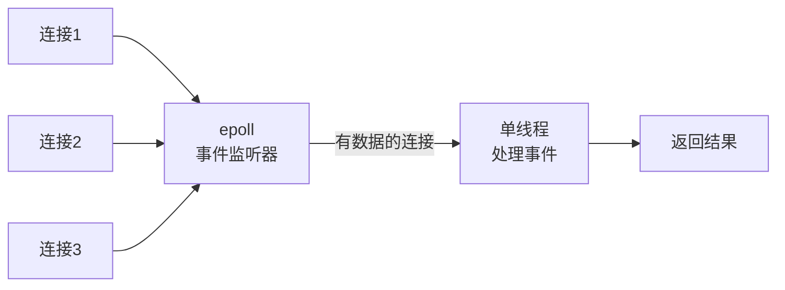
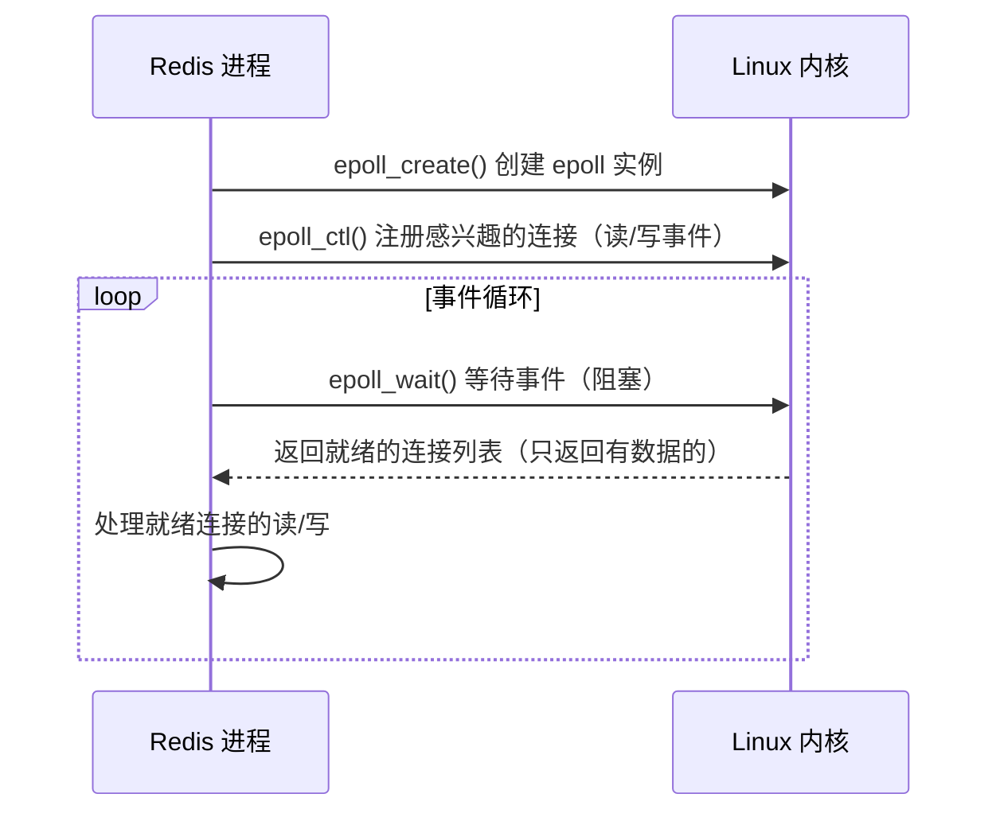
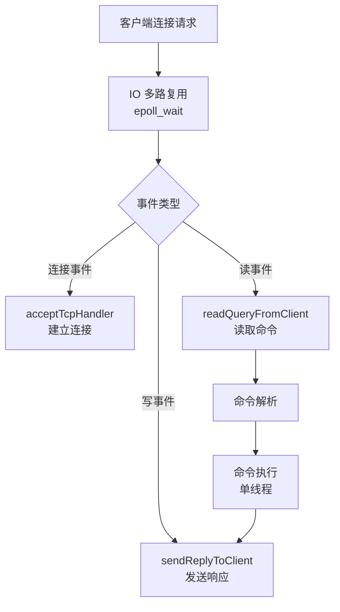
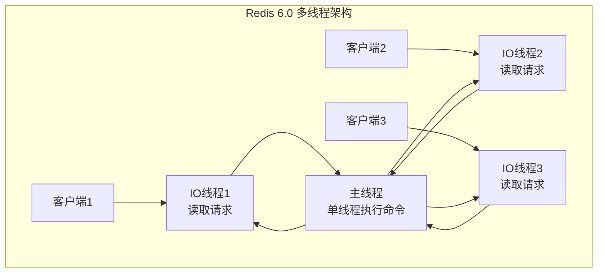

# Redis 单线程模型与网络 IO

---

## 1. 引入：Redis 为什么这么快？

面试中"Redis 为什么快"是高频问题，很多人只会回答"因为是内存数据库"，这是不完整的。完整答案需要从以下几个维度理解：

| 原因 | 说明 |
|------|------|
| **纯内存操作** | 数据存储在内存，读写速度比磁盘快 10 万倍 |
| **单线程避免锁竞争** | 命令执行是单线程，无需加锁，无线程切换开销 |
| **IO 多路复用** | 用 epoll 同时监听大量连接，不阻塞等待 |
| **高效的数据结构** | 跳表、压缩列表、SDS 等专为性能设计 |
| **简单的协议** | RESP 协议简单，解析开销极低 |

本文重点讲解后三点：**单线程模型**、**IO 多路复用**、**Redis 6.0 多线程**。

---

## 2. 单线程模型

### 2.1 什么是"单线程"？

Redis 的"单线程"指的是**命令处理是单线程的**：所有客户端的命令都在一个线程中顺序执行，不存在并发执行的情况。



> **注意**：Redis 并非完全单线程。后台有多个辅助线程处理：
> - **AOF 持久化**：`fsync` 操作在后台线程执行
> - **大 Key 异步删除**：`UNLINK` 命令在后台线程执行
> - **惰性释放内存**：`lazyfree` 相关操作在后台线程执行

### 2.2 单线程为什么还这么快？

**误区**：单线程 = 性能差

**正确理解**：Redis 的性能瓶颈不在 CPU，而在**内存带宽**和**网络 IO**。

```
CPU 执行速度：纳秒级
内存读写速度：纳秒~微秒级
网络 IO 速度：微秒~毫秒级

Redis 的命令执行时间：微秒级（主要是内存操作）
网络传输时间：微秒~毫秒级

结论：Redis 的瓶颈在网络 IO，不在 CPU
      单线程避免了锁竞争和线程切换，反而更高效
```

**单线程的优势**：

1. **无锁**：不需要对数据结构加锁，操作更简单高效
2. **无线程切换**：线程切换需要保存/恢复上下文，有 CPU 开销
3. **无竞争**：不存在多线程竞争同一资源的问题
4. **顺序执行**：命令顺序执行，天然保证了操作的原子性

### 2.3 单线程的局限

- **无法利用多核 CPU**：一个 Redis 实例只用一个 CPU 核心
- **慢命令会阻塞**：`KEYS *`、`FLUSHALL`、大 Key 的 `DEL` 等慢命令会阻塞所有其他命令

**解决方案**：
- 多核利用：在同一台机器上部署多个 Redis 实例（不同端口）
- 慢命令：用 `SCAN` 替代 `KEYS *`，用 `UNLINK` 替代 `DEL`

---

## 3. IO 多路复用

### 3.1 为什么需要 IO 多路复用？

Redis 需要同时处理**大量客户端连接**（生产环境可能有数千个连接）。如果每个连接用一个线程处理，线程数量会爆炸。

**传统阻塞 IO 的问题**：



每个线程在等待数据时都是阻塞的，大量线程浪费内存和 CPU。

### 3.2 IO 多路复用原理

**IO 多路复用**：用**一个线程**同时监听**多个连接**，哪个连接有数据就处理哪个，不阻塞等待。



**Linux 的三种 IO 多路复用**：

| 机制 | 最大连接数 | 性能 | 说明 |
|------|---------|------|------|
| `select` | 1024 | 低 | 每次调用需要遍历所有 fd |
| `poll` | 无限制 | 低 | 改进了 select，但仍需遍历 |
| `epoll` | 无限制 | **高** | 只返回就绪的 fd，O(1) 复杂度 |

**Redis 使用 epoll**（Linux），在 macOS 上使用 kqueue，在 Windows 上使用 select。

### 3.3 epoll 工作原理



**epoll 的核心优势**：
- `epoll_wait` 只返回**就绪的连接**，不需要遍历所有连接
- 内核通过**回调机制**通知就绪事件，时间复杂度 O(1)
- 支持**边缘触发（ET）**和**水平触发（LT）**两种模式

### 3.4 Redis 事件循环（Reactor 模型）

Redis 基于 **Reactor 模式**构建事件驱动架构：



**完整的命令处理流程**：

```
1. 客户端发送命令（TCP 连接）
2. epoll 检测到该连接有数据可读，触发读事件
3. Redis 读取数据，解析 RESP 协议
4. 在命令表中查找对应的处理函数
5. 执行命令，操作内存数据结构
6. 将结果写入输出缓冲区
7. epoll 检测到写事件，将结果发送给客户端
```

---

## 4. RESP 协议

### 4.1 什么是 RESP？

RESP（Redis Serialization Protocol）是 Redis 客户端与服务端通信的协议，设计原则是**简单、快速解析**。

### 4.2 RESP 格式

```
+OK\r\n                    → 简单字符串（Simple String）
-ERR unknown command\r\n   → 错误（Error）
:1000\r\n                  → 整数（Integer）
$6\r\nfoobar\r\n           → 批量字符串（Bulk String），$6 表示长度
*3\r\n$3\r\nSET\r\n$3\r\nkey\r\n$5\r\nvalue\r\n  → 数组（Array）
```

**`SET key value` 命令的 RESP 编码**：

```
*3\r\n       ← 数组，3个元素
$3\r\n       ← 第1个元素，长度3
SET\r\n      ← "SET"
$3\r\n       ← 第2个元素，长度3
key\r\n      ← "key"
$5\r\n       ← 第3个元素，长度5
value\r\n    ← "value"
```

**RESP 的优势**：
- 格式简单，解析速度极快
- 人类可读（可以用 `telnet` 直接发送命令）
- 二进制安全（Bulk String 通过长度而非分隔符确定边界）

---

## 5. Redis 6.0 多线程网络 IO

### 5.1 为什么引入多线程？

Redis 6.0 之前，网络 IO（读取请求、发送响应）也是单线程的。随着网络带宽越来越大，**网络 IO 成为瓶颈**：

```
Redis 单线程处理能力：约 10 万 QPS
网络 IO 瓶颈：在高并发下，单线程读写网络数据跟不上
```

### 5.2 多线程的设计

Redis 6.0 引入多线程，但**只用于网络 IO**，命令执行仍然是单线程：



**多线程处理流程**：

```
1. 主线程通过 epoll 接收连接，将连接分配给 IO 线程
2. IO 线程（多个）并行读取各自连接的数据，解析命令
3. 主线程（单线程）顺序执行所有命令
4. IO 线程（多个）并行将结果写回各自的连接
```

### 5.3 配置多线程

```bash
# redis.conf
io-threads 4              # IO 线程数（建议 = CPU 核心数 - 1）
io-threads-do-reads yes   # 读操作也使用多线程（默认只有写操作多线程）
```

**线程数建议**：
- 4 核机器：`io-threads 3`
- 8 核机器：`io-threads 6`
- 不建议超过 8 个 IO 线程（收益递减）

### 5.4 多线程的效果

| 场景 | 单线程 QPS | 多线程 QPS | 提升 |
|------|-----------|-----------|------|
| 小 Value（< 1KB） | ~10 万 | ~20 万 | 2x |
| 大 Value（> 10KB） | ~5 万 | ~15 万 | 3x |

> **注意**：命令执行仍是单线程，多线程只优化了网络 IO 部分。如果瓶颈在命令执行（如复杂 Lua 脚本），多线程帮助有限。

---

## 6. 慢查询与性能监控

### 6.1 慢查询日志

```bash
# 配置慢查询阈值（微秒）
redis-cli CONFIG SET slowlog-log-slower-than 10000  # 超过10ms记录
redis-cli CONFIG SET slowlog-max-len 128             # 最多保留128条

# 查看慢查询日志
redis-cli SLOWLOG GET 10   # 获取最近10条慢查询
redis-cli SLOWLOG LEN      # 查看慢查询总数
redis-cli SLOWLOG RESET    # 清空慢查询日志
```

**慢查询日志格式**：

```
1) 1) (integer) 14          ← 日志 ID
   2) (integer) 1705123456  ← 执行时间戳
   3) (integer) 15000       ← 执行耗时（微秒）
   4) 1) "KEYS"             ← 命令
      2) "*"
```

### 6.2 常见慢命令及替代方案

| 慢命令 | 问题 | 替代方案 |
|--------|------|---------|
| `KEYS *` | O(n) 遍历所有 Key，阻塞 | `SCAN` 游标分批遍历 |
| `HGETALL` | 大 Hash 时返回大量数据 | `HSCAN` 分批获取 |
| `SMEMBERS` | 大 Set 时返回大量数据 | `SSCAN` 分批获取 |
| `DEL bigkey` | 同步删除大 Key，阻塞主线程 | `UNLINK` 异步删除 |
| `FLUSHDB/FLUSHALL` | 清空数据库，阻塞 | `FLUSHDB ASYNC` 异步清空 |
| `SORT` | 大数据集排序，O(n+m*log(m)) | 业务层排序，或用 ZSet |

```bash
# SCAN 替代 KEYS *（游标分批，不阻塞）
SCAN 0 MATCH "user:*" COUNT 100
# 返回：
# 1) "128"    ← 下次游标（非0则继续）
# 2) 1) "user:1001"
#    2) "user:1002"
#    ...

# 继续扫描
SCAN 128 MATCH "user:*" COUNT 100
# 直到游标返回 0，表示扫描完成
```

---

## 7. 常见问题

**Q：Redis 单线程为什么还能达到 10 万 QPS？**

> 1. **纯内存操作**：命令执行时间在微秒级，CPU 处理速度极快
> 2. **IO 多路复用**：epoll 用一个线程管理数千个连接，不阻塞等待
> 3. **无锁设计**：单线程无需加锁，无线程切换开销
> 4. **高效数据结构**：跳表、压缩列表等专为性能优化
> 5. **简单协议**：RESP 协议解析开销极低
>
> 综合以上，Redis 的瓶颈在网络 IO，不在 CPU，单线程反而避免了多线程的额外开销。

**Q：Redis 6.0 的多线程和之前的单线程有什么区别？**

> Redis 6.0 引入多线程只用于**网络 IO**（读取请求数据、发送响应数据），**命令执行仍然是单线程**。这样既利用了多核 CPU 处理网络 IO 的能力，又保持了命令执行的简单性（无需加锁）。

**Q：为什么 `KEYS *` 会导致 Redis 卡顿？**

> `KEYS *` 需要遍历 Redis 中所有的 Key，时间复杂度 O(n)。Redis 是单线程的，执行 `KEYS *` 期间无法处理其他命令，如果 Key 数量达到百万级，可能阻塞数秒，导致所有客户端超时。生产环境应使用 `SCAN` 命令替代，`SCAN` 每次只扫描少量 Key，不会长时间阻塞。

**Q：epoll 和 select 有什么区别？**

> - **select**：每次调用需要将所有 fd 从用户空间复制到内核空间，内核遍历所有 fd 检查就绪状态，最大支持 1024 个连接，时间复杂度 O(n)
> - **epoll**：通过 `epoll_ctl` 注册 fd，内核通过回调机制维护就绪列表，`epoll_wait` 只返回就绪的 fd，无需遍历，时间复杂度 O(1)，支持无限连接数
> - Redis 使用 epoll（Linux），在高并发下性能远优于 select

**Q：Redis 的 Reactor 模型是什么？**

> Reactor 是一种事件驱动的设计模式：
> 1. **事件分发器**（epoll）：监听所有连接的 IO 事件
> 2. **事件处理器**：针对不同事件类型（连接、读、写）注册不同的处理函数
> 3. **事件循环**：主线程不断调用 `epoll_wait`，获取就绪事件，分发给对应处理器
>
> Redis 的单线程 Reactor 模型保证了命令执行的顺序性和原子性，同时通过 epoll 高效处理大量并发连接。

---

> **复习检验标准**：能否完整回答"Redis 为什么快"（5个维度）？能否解释 epoll 和 select 的区别？能否说出 Redis 6.0 多线程的设计（只有网络 IO 多线程，命令执行仍单线程）？能否说出哪些命令会导致 Redis 阻塞及替代方案？
