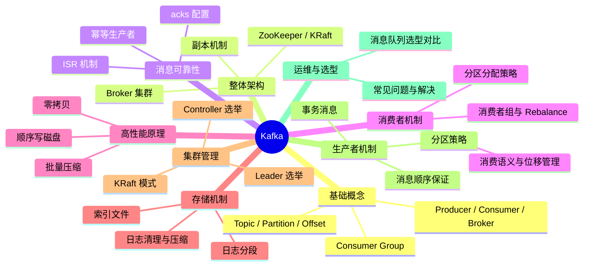
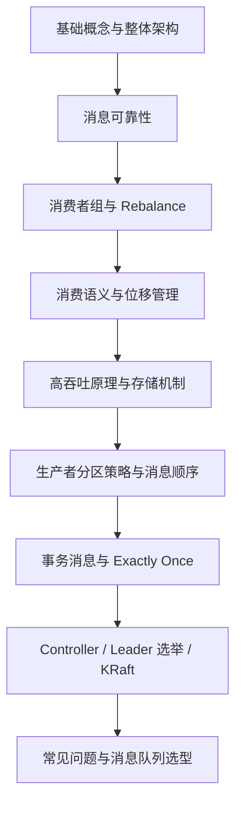

# Kafka 消息队列核心知识体系

> **学习目标**：从"会用"升级到"理解原理 → 能解决问题 → 能做技术决策"
>
> **检验标准**：学完每个模块后，能口述"这个技术解决了什么问题？不用它会怎样？工作中有哪些坑？"

---

## 整体知识地图

---

## 知识点导航

| # | 知识点 | 核心一句话 | 详细文档 |
|---|--------|-----------|---------|
| 01 | **基础概念** | Topic 逻辑分类、Partition 并行单位、Offset 消费进度、Consumer Group 分工协作 | [01-基础概念.md](./01-基础概念.md) |
| 02 | **整体架构** | Broker 集群 + 分区副本 + Controller 选举，高可用高吞吐的分布式架构 | [02-整体架构.md](./02-整体架构.md) |
| 03 | **消息可靠性** | 三端保障：生产者 acks=all + Broker 多副本 ISR + 消费者手动提交 offset | [03-消息可靠性.md](./03-消息可靠性.md) |
| 04 | **消费者组与 Rebalance** | 组内分区独占消费，成员变化触发 Rebalance，避免频繁 Rebalance 是关键 | [04-消费者组与Rebalance.md](./04-消费者组与Rebalance.md) |
| 05 | **高吞吐原理** | 顺序写磁盘 + 零拷贝 + 批量压缩 + 分区并行，四大机制保障高性能 | [05-高吞吐原理.md](./05-高吞吐原理.md) |
| 06 | **消息队列选型** | Kafka 高吞吐适合大数据/日志；RabbitMQ 低延迟适合业务消息；RocketMQ 事务消息强 | [06-消息队列选型.md](./06-消息队列选型.md) |
| 07 | **常见问题与解决** | 消息积压、重复消费、顺序消费、消费者阻塞等生产环境高频问题的排查与解决 | [07-常见问题与解决.md](./07-常见问题与解决.md) |
| 08 | **存储机制与日志设计** | 日志分段存储 + 稀疏索引 + 日志清理（delete/compact），磁盘友好的存储架构 | [08-存储机制与日志设计.md](./08-存储机制与日志设计.md) |
| 09 | **事务消息与 Exactly Once** | 幂等生产者 + 事务 API，实现跨分区的 Exactly Once 语义 | [09-事务消息与ExactlyOnce.md](./09-事务消息与ExactlyOnce.md) |
| 10 | **Controller 与 Leader 选举** | Controller 管理集群元数据，分区 Leader 选举从 ISR 中选取，保障高可用 | [10-Controller与Leader选举.md](./10-Controller与Leader选举.md) |
| 11 | **KRaft 模式与去 ZooKeeper** | KRaft 用 Raft 协议替代 ZooKeeper，简化部署、提升元数据管理性能 | [11-KRaft模式与去ZooKeeper.md](./11-KRaft模式与去ZooKeeper.md) |
| 12 | **消费语义与位移管理** | At Most/Least/Exactly Once 三种语义；offset 存储在 __consumer_offsets；手动提交是生产标配 | [12-消费语义与位移管理.md](./12-消费语义与位移管理.md) |
| 13 | **生产者分区策略与消息顺序** | 默认粘性分区、按 Key 哈希保证顺序、自定义分区器满足特殊需求 | [13-生产者分区策略与消息顺序.md](./13-生产者分区策略与消息顺序.md) |

---

## 高频问题索引

| 问题 | 详见 |
|------|------|
| Kafka 如何保证消息不丢失？ | [消息可靠性](./03-消息可靠性.md) |
| 消费者 Rebalance 是什么？如何避免频繁 Rebalance？ | [消费者组与 Rebalance](./04-消费者组与Rebalance.md) |
| Kafka 为什么这么快？ | [高吞吐原理](./05-高吞吐原理.md) |
| 消息积压了怎么办？ | [常见问题与解决](./07-常见问题与解决.md) |
| 如何保证消息顺序消费？ | [生产者分区策略与消息顺序](./13-生产者分区策略与消息顺序.md) |
| At Least Once / Exactly Once 怎么实现？ | [消费语义与位移管理](./12-消费语义与位移管理.md) |
| Kafka 事务消息怎么用？ | [事务消息与 Exactly Once](./09-事务消息与ExactlyOnce.md) |
| Kafka vs RabbitMQ vs RocketMQ 怎么选？ | [消息队列选型](./06-消息队列选型.md) |
| KRaft 模式是什么？为什么要去 ZooKeeper？ | [KRaft 模式与去 ZooKeeper](./11-KRaft模式与去ZooKeeper.md) |

---

## 学习路径建议

