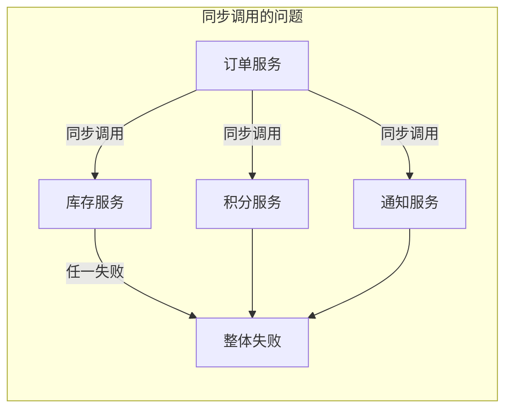
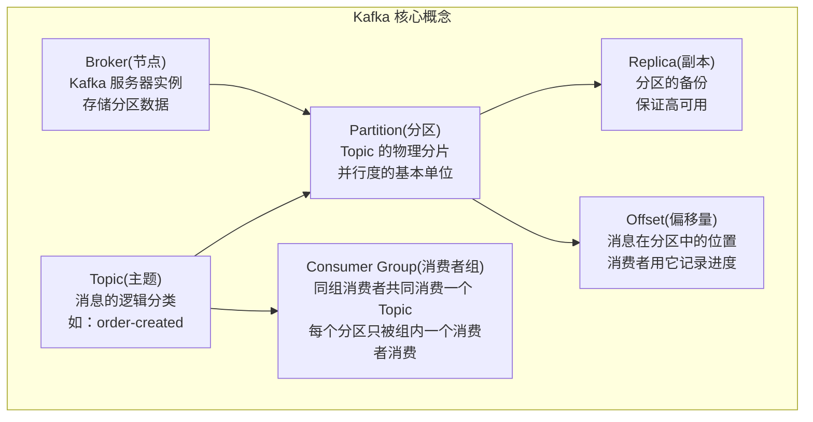
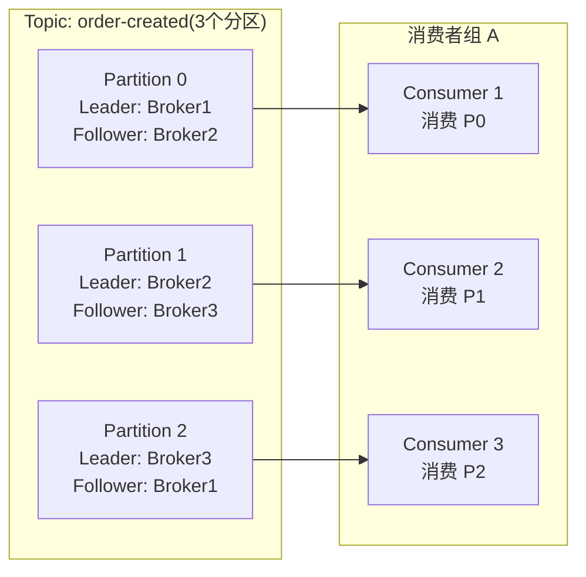

# Kafka 基础概念

---

## 1. 引入：它解决了什么问题？

**问题背景**：没有消息队列时，服务间通信是同步调用，存在三大痛点：



| 痛点 | 具体表现 | Kafka 的解决方案 |
|------|---------|---------------|
| **强耦合** | 订单服务必须知道所有下游服务的接口 | 生产者只写 Topic，不关心消费者 |
| **性能差** | 需要等待所有下游服务响应才能返回 | 生产者写完即返回，异步处理 |
| **可用性低** | 任一下游服务宕机，整个链路失败 | 消费者宕机后恢复可继续消费 |
| **流量峰值** | 瞬时高峰直接打到下游服务 | Kafka 作为缓冲层，消费者按能力消费 |

**不了解 Kafka 会导致的线上问题**：
- 消息丢失：`acks=1` 时 Leader 宕机，消息未同步到副本
- 消息重复：消费者处理成功但提交 offset 前崩溃，重启后重新消费
- 消息积压：消费者处理速度跟不上生产速度，Lag 持续增大
- 顺序错乱：多分区消费，同一订单的消息被不同消费者处理

---

## 2. 类比：用生活模型建立直觉

把 Kafka 类比为**快递分拣中心**：

| Kafka 概念 | 生活类比 | 映射关系 |
|-----------|---------|---------| 
| **Topic** | 快递类别（电子产品/食品/服装） | 消息的逻辑分类 |
| **Partition** | 同类快递的多条传送带 | 并行处理的基本单位 |
| **Producer** | 寄件人 | 发送消息的服务 |
| **Consumer** | 收件人 | 消费消息的服务 |
| **Consumer Group** | 同一公司的多个收件人 | 组内分工，每条传送带只有一人负责 |
| **Offset** | 快递单号 | 消息在分区中的位置，消费者用它记录进度 |
| **Broker** | 分拣中心的仓库 | 存储分区数据的服务器 |

> **关键直觉**：Kafka 是"异步邮局"，寄件人（Producer）把信投进邮箱（Topic）就走，不等收件人（Consumer）签收。邮局（Broker）负责保管，收件人按自己的节奏取信。

---

## 3. 核心概念

### 3.1 概念全景图



### 3.2 Topic 与 Partition 的关系



> **关键规则**：
> - 同一消费者组内，**一个分区只能被一个消费者消费**（保证顺序性）
> - 消费者数量 > 分区数时，多余的消费者**空闲等待**（浪费资源，分区数应 ≥ 消费者数）
> - 消费者数量 < 分区数时，一个消费者会消费多个分区

### 3.3 Offset 机制

**Offset（偏移量）** 是消息在分区中的唯一位置标识，消费者通过 offset 记录消费进度。每个分区的 offset 从 0 开始单调递增。

```
Partition 0 的消息序列：
┌─────┬─────┬─────┬─────┬─────┬─────┐
│ msg │ msg │ msg │ msg │ msg │ msg │
│  0  │  1  │  2  │  3  │  4  │  5  │
└─────┴─────┴─────┴─────┴─────┴─────┘
                    ↑
              Consumer A 当前消费到 offset=3
              下次从 offset=4 开始消费
```

> **深入了解**：Offset 的存储机制（`__consumer_offsets`）、提交方式（自动/手动）、重置策略、消费语义（At Least Once / Exactly Once）等详细内容，请参阅 → [12-消费语义与位移管理.md](./12-消费语义与位移管理.md)