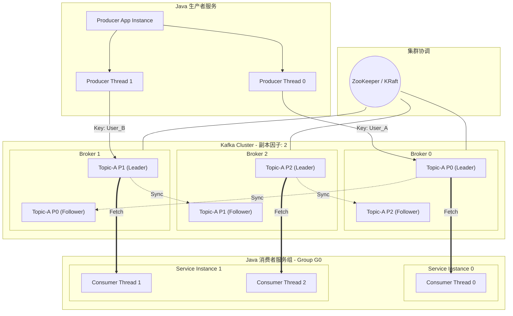

# Kafka 整体架构

---

## Kafka 整体架构图



> **注意**：Kafka 2.8+ 引入 **KRaft 模式**，用内置的 Raft 协议替代 ZooKeeper，Kafka 3.x 已完全支持无 ZooKeeper 部署。

---

## 架构核心要点

| 组件 | 职责 | 说明 |
|------|------|------|
| **Producer** | 消息生产者 | 将消息写入指定 Topic 的 Partition |
| **Broker** | Kafka 服务节点 | 存储分区数据，处理读写请求 |
| **Topic** | 消息主题 | 消息的逻辑分类，由多个 Partition 组成 |
| **Partition** | 分区 | Topic 的物理分片，是并行度的基本单位 |
| **Leader/Follower** | 主副本/从副本 | Leader 处理读写，Follower 同步数据 |
| **Consumer Group** | 消费者组 | 组内消费者共同消费 Topic，每个分区只被一个消费者消费 |
| **ZooKeeper/KRaft** | 元数据管理 | 存储集群元数据，负责 Controller 选举 |

---

## 数据流向

```
Producer → Broker(Leader Partition) → Follower Partition(副本同步)
                                    ↓
                              Consumer(拉取消费)
```

- **写入**：Producer 只写 Leader Partition，Follower 异步同步
- **消费**：Consumer 从 Leader Partition 拉取数据（Pull 模式）
- **副本**：Follower 持续从 Leader 同步，保证高可用