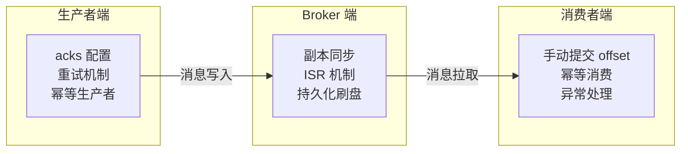
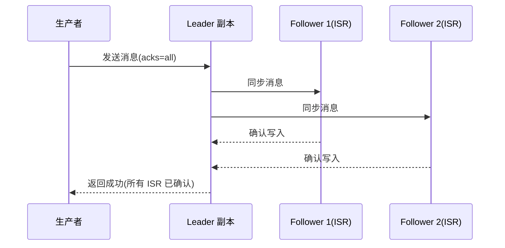
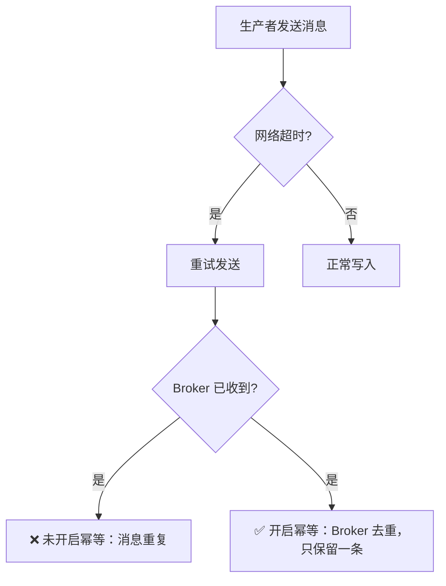

# Kafka 消息可靠性：如何保证消息不丢失？

---

消息丢失可能发生在三个环节，需要分别保障：



---

## 1. 生产者端：acks 参数

| acks 值 | 含义 | 可靠性 | 性能 | 适用场景 |
|---------|------|--------|------|---------| 
| `0` | 不等待任何确认 | 最低（可能丢消息） | 最高 | 日志收集（允许少量丢失） |
| `1` | 等待 Leader 写入确认 | 中等（Leader 宕机可能丢） | 中等 | 一般业务 |
| `-1`/`all` | 等待所有 ISR 副本确认 | 最高（不丢消息） | 最低 | 金融、订单等核心业务 |

> **ISR（In-Sync Replicas）**：与 Leader 保持同步的副本集合。落后太多的副本会被踢出 ISR。
> **为什么 acks=all 不是默认值**：acks=all 需要等待所有 ISR 副本确认，延迟更高。大多数业务场景可以接受极小概率的消息丢失（Leader 宕机的概率很低），用 acks=1 换取更低延迟。

---

## 2. Broker 端：副本同步



---

## 3. 消费者端：手动提交 Offset

消费者端保障消息不丢失的核心原则：**处理成功后再提交 offset**。

| 提交方式 | 语义 | 风险 |
|---------|------|------|
| 自动提交（`enable.auto.commit=true`） | 定时提交，不管处理是否成功 | 处理失败后 offset 已提交 → 消息丢失 |
| 手动提交（`enable.auto.commit=false`） | 处理成功后显式提交 | 提交失败 → 重复消费（可通过幂等处理解决） |

> **生产推荐**：关闭自动提交，使用手动提交。详细的提交方式（同步/异步/指定 offset）、消费语义（At Least Once / Exactly Once）和幂等消费方案，请参阅 → [12-消费语义与位移管理.md](./12-消费语义与位移管理.md)

---

## 4. 幂等性：防止重复消息



```java
// 开启幂等生产者（Producer ID + Sequence Number 去重）
props.put("enable.idempotence", "true");
// 开启幂等后，acks 自动设为 all，retries 自动设为 MAX_INT
// 为什么这样设计：幂等性依赖 acks=all 保证消息写入，依赖重试保证消息不丢
```

---

## 5. 三端保障总结

| 环节 | 关键配置/做法 | 作用 |
|------|-------------|------|
| **生产者** | `acks=all` + 重试 + 幂等 | 确保消息成功写入所有 ISR 副本 |
| **Broker** | 多副本 + ISR 同步 | 即使 Leader 宕机，Follower 可接管 |
| **消费者** | 手动提交 offset + 幂等处理 | 确保消息处理成功后才标记已消费 |