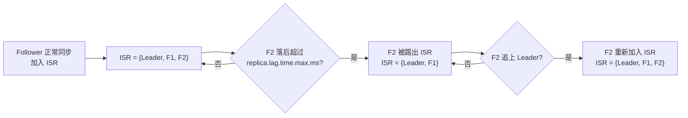
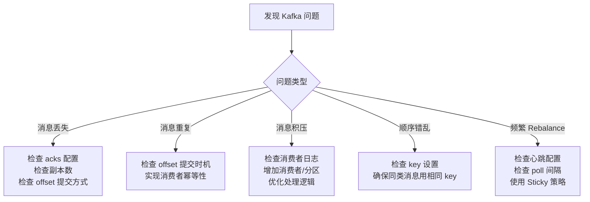

# Kafka 工作中常见问题与解决

---

## Kafka 如何保证消息不丢失？

消息丢失可能发生在**生产者、Broker、消费者**三个环节，需要分别保障。

### 生产者端配置

```java
Properties props = new Properties();
props.put(ProducerConfig.BOOTSTRAP_SERVERS_CONFIG, "localhost:9092");
props.put(ProducerConfig.KEY_SERIALIZER_CLASS_CONFIG, StringSerializer.class.getName());
props.put(ProducerConfig.VALUE_SERIALIZER_CLASS_CONFIG, StringSerializer.class.getName());

// ✅ 关键配置1：等待所有 ISR 副本确认（最高可靠性）
props.put(ProducerConfig.ACKS_CONFIG, "all");

// ✅ 关键配置2：开启幂等，防止重试导致重复
props.put(ProducerConfig.ENABLE_IDEMPOTENCE_CONFIG, true);
// 开启幂等后，acks 自动设为 all，retries 自动设为 MAX_INT

// ✅ 关键配置3：重试次数（幂等开启后可设大）
props.put(ProducerConfig.RETRIES_CONFIG, Integer.MAX_VALUE);

// ✅ 关键配置4：重试间隔（避免频繁重试）
props.put(ProducerConfig.RETRY_BACKOFF_MS_CONFIG, 300);

KafkaProducer<String, String> producer = new KafkaProducer<>(props);

// ✅ 发送时处理回调，记录失败消息
producer.send(new ProducerRecord<>("order-topic", orderId, message), (metadata, exception) -> {
    if (exception != null) {
        // 发送失败，记录到数据库或告警
        log.error("消息发送失败，topic={}, key={}", "order-topic", orderId, exception);
        // 可以写入本地补偿表，后续重试
        failedMessageService.save(orderId, message);
    } else {
        log.info("发送成功，partition={}, offset={}", metadata.partition(), metadata.offset());
    }
});
```

### Broker 端配置（server.properties）

```properties
# 副本数（建议生产环境至少 3 个）
default.replication.factor=3

# 最小 ISR 副本数（低于此数量时，拒绝写入，防止数据丢失）
min.insync.replicas=2

# 禁止不在 ISR 中的副本成为 Leader（防止数据丢失）
unclean.leader.election.enable=false

# 刷盘策略（默认依赖 OS 刷盘，生产环境一般不改，依赖副本保证可靠性）
# log.flush.interval.messages=10000
# log.flush.interval.ms=1000
```

### 消费者端配置

```java
Properties props = new Properties();
props.put(ConsumerConfig.BOOTSTRAP_SERVERS_CONFIG, "localhost:9092");
props.put(ConsumerConfig.GROUP_ID_CONFIG, "order-consumer-group");
props.put(ConsumerConfig.KEY_DESERIALIZER_CLASS_CONFIG, StringDeserializer.class.getName());
props.put(ConsumerConfig.VALUE_DESERIALIZER_CLASS_CONFIG, StringDeserializer.class.getName());

// ✅ 关键配置：关闭自动提交
props.put(ConsumerConfig.ENABLE_AUTO_COMMIT_CONFIG, false);

KafkaConsumer<String, String> consumer = new KafkaConsumer<>(props);
consumer.subscribe(Collections.singletonList("order-topic"));

while (true) {
    ConsumerRecords<String, String> records = consumer.poll(Duration.ofMillis(100));
    for (ConsumerRecord<String, String> record : records) {
        try {
            // 业务处理
            orderService.process(record.value());
        } catch (Exception e) {
            log.error("消息处理失败，offset={}", record.offset(), e);
            // 处理失败：可以写入死信队列，或记录到数据库后续补偿
            deadLetterService.save(record);
            // 注意：这里不 break，继续处理后续消息（根据业务决定是否跳过）
        }
    }
    // ✅ 所有消息处理完成后，手动提交 offset
    consumer.commitSync();
}
```

### Spring Boot 中的配置

```yaml
spring:
  kafka:
    bootstrap-servers: localhost:9092
    producer:
      acks: all
      retries: 3
      properties:
        enable.idempotence: true
    consumer:
      group-id: order-consumer-group
      enable-auto-commit: false
      auto-offset-reset: earliest  # 新消费者组从最早的消息开始消费
    listener:
      ack-mode: manual_immediate   # 手动提交模式
```

```java
@KafkaListener(topics = "order-topic", groupId = "order-consumer-group")
public void consume(ConsumerRecord<String, String> record, Acknowledgment ack) {
    try {
        orderService.process(record.value());
        ack.acknowledge();  // ✅ 处理成功后手动提交
    } catch (Exception e) {
        log.error("处理失败", e);
        // 不调用 ack.acknowledge()，消息会重新投递
    }
}
```

---

## Kafka 为什么吞吐量高？

### 核心机制详解

**1. 顺序写磁盘**

```
传统随机写：磁头需要寻道 → 每次 IO 约 10ms → 100 IOPS
顺序写磁盘：磁头不需要移动 → 速度接近内存 → 600 MB/s

Kafka 的 Log 文件是 Append Only，只追加写，不修改
```

**2. 零拷贝（sendfile 系统调用）**

```
传统文件传输（4次拷贝）：
磁盘 → 内核缓冲区 → 用户缓冲区 → Socket 缓冲区 → 网卡

零拷贝（2次拷贝）：
磁盘 → 内核缓冲区 → 网卡（跳过用户态，减少 CPU 上下文切换）
```

**3. 批量发送配置**

```java
// 生产者批量发送配置
props.put(ProducerConfig.BATCH_SIZE_CONFIG, 16384);        // 批次大小 16KB
props.put(ProducerConfig.LINGER_MS_CONFIG, 5);             // 等待 5ms 凑批
props.put(ProducerConfig.BUFFER_MEMORY_CONFIG, 33554432);  // 缓冲区 32MB
props.put(ProducerConfig.COMPRESSION_TYPE_CONFIG, "lz4"); // 压缩算法

// linger.ms 的作用：
// 设为 0：消息立即发送，批次小，网络请求多
// 设为 5：等待 5ms，让更多消息凑成一批，减少网络请求次数
// 权衡：延迟 vs 吞吐量
```

**4. 压缩算法对比**

| 算法 | 压缩率 | 速度 | CPU 消耗 | 适用场景 |
|------|--------|------|---------|---------|
| `none` | 无 | 最快 | 无 | 消息本身已压缩 |
| `gzip` | 最高 | 最慢 | 高 | 带宽紧张，CPU 充足 |
| `snappy` | 中等 | 快 | 低 | 通用场景 |
| `lz4` | 中等 | 最快 | 低 | **推荐，性能最均衡** |
| `zstd` | 高 | 快 | 中 | Kafka 2.1+ 推荐 |

---

## 什么是 Rebalance？如何减少影响？

### Rebalance 触发条件

```
1. 消费者组成员变化（新增/下线消费者实例）
2. 订阅的 Topic 分区数变化
3. 消费者长时间未发送心跳（被认为宕机）
4. 消费者处理消息时间过长（超过 max.poll.interval.ms）
```

### 关键配置

```java
Properties props = new Properties();

// ✅ 心跳超时时间（消费者多久没心跳被认为宕机）
// 建议：10~30 秒，不要太短（避免误判），不要太长（宕机后恢复慢）
props.put(ConsumerConfig.SESSION_TIMEOUT_MS_CONFIG, 30000);

// ✅ 心跳发送间隔（应小于 session.timeout.ms 的 1/3）
props.put(ConsumerConfig.HEARTBEAT_INTERVAL_MS_CONFIG, 10000);

// ✅ 两次 poll 之间的最大间隔（超过则被认为消费者挂了）
// 如果业务处理耗时较长，需要调大此值
props.put(ConsumerConfig.MAX_POLL_INTERVAL_MS_CONFIG, 300000);  // 5分钟

// ✅ 每次 poll 的最大消息数（减少每批处理时间，避免超时）
props.put(ConsumerConfig.MAX_POLL_RECORDS_CONFIG, 500);

// ✅ 使用 Sticky 分配策略（Rebalance 后尽量保持原有分配，减少迁移）
props.put(ConsumerConfig.PARTITION_ASSIGNMENT_STRATEGY_CONFIG,
    CooperativeStickyAssignor.class.getName());
```

### 分配策略对比

| 策略 | 特点 | 适用场景 |
|------|------|---------|
| `RangeAssignor` | 按范围分配，可能不均匀 | 默认策略 |
| `RoundRobinAssignor` | 轮询分配，较均匀 | 多 Topic 场景 |
| `StickyAssignor` | 尽量保持上次分配，减少迁移 | 减少 Rebalance 影响 |
| `CooperativeStickyAssignor` | 增量式 Rebalance，不停止全部消费 | **Kafka 2.4+ 推荐** |

### 实战：避免因处理超时触发 Rebalance

```java
// ❌ 危险：单条消息处理时间过长，超过 max.poll.interval.ms
@KafkaListener(topics = "order-topic")
public void consume(String message) {
    // 调用外部接口，可能超时 5 分钟
    externalService.slowProcess(message);
}

// ✅ 方案1：异步处理，快速提交 offset（注意：可能丢消息，需要幂等）
@KafkaListener(topics = "order-topic")
public void consume(ConsumerRecord<String, String> record, Acknowledgment ack) {
    // 先提交 offset，再异步处理
    ack.acknowledge();
    asyncExecutor.submit(() -> externalService.slowProcess(record.value()));
}

// ✅ 方案2：调大 max.poll.interval.ms，减少每批消息数
// max.poll.interval.ms=600000（10分钟）
// max.poll.records=50（每批只拉 50 条）
```

---

## Kafka 与 RocketMQ 如何选型？

### 详细对比

| 维度 | Kafka | RocketMQ | RabbitMQ |
|------|-------|----------|----------|
| **吞吐量** | 极高（百万级/秒） | 高（十万级/秒） | 中（万级/秒） |
| **延迟** | 毫秒级 | 毫秒级 | 微秒级 |
| **延迟消息** | ❌ 不支持 | ✅ 支持任意延迟 | ✅ 插件支持 |
| **事务消息** | ❌ 不支持 | ✅ 原生支持 | ❌ 不支持 |
| **消息回溯** | ✅ 支持（按 offset/时间） | ✅ 支持 | ❌ 不支持 |
| **顺序消息** | ✅ 分区内有序 | ✅ 支持 | ❌ 不保证 |
| **死信队列** | ❌ 需自己实现 | ✅ 原生支持 | ✅ 原生支持 |
| **运维复杂度** | 中（依赖 ZooKeeper，2.8+ 可不依赖） | 低 | 低 |
| **生态** | 极丰富（Flink/Spark/Hadoop） | 阿里系生态 | Spring 生态 |

### 选型建议

```
✅ 选 Kafka：
  - 日志收集、监控数据、埋点数据（超高吞吐）
  - 流式计算（与 Flink/Spark Streaming 集成）
  - 消息回溯（需要重放历史消息）

✅ 选 RocketMQ：
  - 电商订单、支付（需要事务消息）
  - 定时/延迟任务（需要延迟消息）
  - 金融级可靠性要求

✅ 选 RabbitMQ：
  - 任务队列（低延迟、灵活路由）
  - 微服务间通信（Spring AMQP 生态完善）
  - 消息量不大但需要复杂路由规则
```

---

## 如何解决消息重复消费？

### 方案1：数据库唯一键约束

```java
// 消息表结构
CREATE TABLE message_record (
    id BIGINT AUTO_INCREMENT PRIMARY KEY,
    message_id VARCHAR(64) NOT NULL UNIQUE,  -- 消息唯一ID
    status TINYINT DEFAULT 0,                -- 0:处理中 1:成功 2:失败
    create_time DATETIME DEFAULT NOW()
);

// 消费者实现
@KafkaListener(topics = "order-topic")
@Transactional
public void consume(ConsumerRecord<String, String> record, Acknowledgment ack) {
    String messageId = record.headers().lastHeader("messageId").toString();
    
    // 尝试插入消息记录（唯一键冲突则说明已处理）
    int inserted = messageRecordMapper.insertIgnore(messageId);
    if (inserted == 0) {
        log.info("消息已处理，跳过，messageId={}", messageId);
        ack.acknowledge();
        return;
    }
    
    try {
        orderService.process(record.value());
        messageRecordMapper.updateStatus(messageId, 1);  // 标记成功
        ack.acknowledge();
    } catch (Exception e) {
        messageRecordMapper.updateStatus(messageId, 2);  // 标记失败
        throw e;  // 不提交 offset，触发重试
    }
}
```

### 方案2：Redis 原子操作去重

```java
@KafkaListener(topics = "order-topic")
public void consume(ConsumerRecord<String, String> record, Acknowledgment ack) {
    String messageId = record.key();  // 用消息 key 作为唯一标识
    String redisKey = "kafka:processed:" + messageId;
    
    // setIfAbsent 是原子操作，只有第一次返回 true
    Boolean isNew = redisTemplate.opsForValue()
        .setIfAbsent(redisKey, "1", 24, TimeUnit.HOURS);
    
    if (Boolean.FALSE.equals(isNew)) {
        log.info("重复消息，跳过，messageId={}", messageId);
        ack.acknowledge();
        return;
    }
    
    try {
        orderService.process(record.value());
        ack.acknowledge();
    } catch (Exception e) {
        // 处理失败，删除 Redis 标记，允许重试
        redisTemplate.delete(redisKey);
        log.error("处理失败，messageId={}", messageId, e);
    }
}
```

### 方案3：业务状态机（最推荐）

```java
// 订单状态：PENDING → PROCESSING → COMPLETED
// 已完成的订单不重复处理，天然幂等

@KafkaListener(topics = "order-topic")
@Transactional
public void consume(String message, Acknowledgment ack) {
    OrderDTO dto = JSON.parseObject(message, OrderDTO.class);
    
    // 查询订单当前状态
    Order order = orderMapper.selectById(dto.getOrderId());
    
    // ✅ 状态机保护：只有 PENDING 状态才处理
    if (order == null || order.getStatus() != OrderStatus.PENDING) {
        log.info("订单状态不符，跳过，orderId={}, status={}", 
            dto.getOrderId(), order != null ? order.getStatus() : "null");
        ack.acknowledge();
        return;
    }
    
    // 处理订单
    orderService.process(dto);
    ack.acknowledge();
}
```

---

## Kafka 如何保证消息顺序？

### 问题根源

```
Kafka 的顺序保证：同一 Partition 内消息严格有序，跨 Partition 不保证顺序

常见乱序场景：
1. 消息发送到不同 Partition（未指定 key）
2. 生产者重试导致消息乱序（未开启幂等）
3. 消费者多线程并发处理同一 Partition 的消息
```

### 生产者端：指定 key 保证同一分区

```java
// ✅ 同一订单的所有消息，使用 orderId 作为 key
// Kafka 按 hash(key) % partitionCount 路由，相同 key 必然在同一分区
producer.send(new ProducerRecord<>("order-topic", orderId, message));

// ✅ 开启幂等，防止重试导致乱序
props.put(ProducerConfig.ENABLE_IDEMPOTENCE_CONFIG, true);
// 幂等开启后，同一 Partition 内消息严格按 Sequence Number 排序
// 即使重试，Broker 也会按正确顺序排列
```

### 消费者端：单线程消费保证顺序

```java
// ❌ 危险：多线程并发处理，破坏顺序
@KafkaListener(topics = "order-topic", concurrency = "3")
public void consume(String message) {
    // 3个线程并发处理，同一分区的消息可能乱序执行
    orderService.process(message);
}

// ✅ 方案1：单线程消费（concurrency=1，每个分区一个线程）
@KafkaListener(topics = "order-topic", concurrency = "1")
public void consume(String message) {
    orderService.process(message);
}

// ✅ 方案2：多线程但按 key 路由到同一线程（保证同一 key 顺序）
@KafkaListener(topics = "order-topic", concurrency = "3")
public void consume(ConsumerRecord<String, String> record) {
    String key = record.key();
    // 按 key 的 hash 路由到固定线程，保证同一 key 的消息顺序处理
    int threadIndex = Math.abs(key.hashCode()) % threadPool.getCorePoolSize();
    orderedExecutors[threadIndex].submit(() -> orderService.process(record.value()));
}
```

---

## ISR 是什么？与 OSR 的区别？

### ISR 机制详解

```
ISR（In-Sync Replicas）：与 Leader 保持同步的副本集合
OSR（Out-of-Sync Replicas）：落后 Leader 太多，被踢出 ISR 的副本

判断标准（Kafka 0.9+ 只看时间，不看消息条数）：
- replica.lag.time.max.ms（默认 30000ms）
- Follower 超过 30 秒没有向 Leader 发送 Fetch 请求，则被踢出 ISR
```

### 相关配置

```properties
# Broker 配置（server.properties）

# Follower 落后 Leader 多久被踢出 ISR（默认 30 秒）
replica.lag.time.max.ms=30000

# acks=all 时，最少需要多少个 ISR 副本确认
# 配合 replication.factor=3 使用，保证至少 2 个副本有数据
min.insync.replicas=2

# 禁止 OSR 副本成为 Leader（防止数据丢失）
# 代价：如果所有 ISR 副本都宕机，该分区不可用（宁可不可用，也不丢数据）
unclean.leader.election.enable=false
```

### ISR 收缩与扩张



---

## Kafka 事务消息如何实现？

### 使用场景

```
场景：订单服务创建订单后，需要同时发送消息到库存 Topic 和积分 Topic
要求：两个 Topic 的消息要么都发送成功，要么都不发送（原子性）
```

### 生产者事务配置

```java
Properties props = new Properties();
props.put(ProducerConfig.BOOTSTRAP_SERVERS_CONFIG, "localhost:9092");
// ✅ 必须设置唯一的事务 ID
props.put(ProducerConfig.TRANSACTIONAL_ID_CONFIG, "order-producer-001");
// 开启幂等（事务依赖幂等）
props.put(ProducerConfig.ENABLE_IDEMPOTENCE_CONFIG, true);

KafkaProducer<String, String> producer = new KafkaProducer<>(props);
producer.initTransactions();  // 初始化事务

try {
    producer.beginTransaction();  // 开启事务

    // 发送到多个 Topic，原子性保证
    producer.send(new ProducerRecord<>("inventory-topic", orderId, inventoryMsg));
    producer.send(new ProducerRecord<>("points-topic", orderId, pointsMsg));

    producer.commitTransaction();  // 提交事务
} catch (Exception e) {
    producer.abortTransaction();   // 回滚事务
    throw e;
}
```

### 消费者端：只读已提交的消息

```java
// ✅ 消费者配置：只读取已提交的事务消息（默认是 read_uncommitted）
props.put(ConsumerConfig.ISOLATION_LEVEL_CONFIG, "read_committed");
// read_uncommitted：读取所有消息（包括未提交的事务消息）
// read_committed：只读取已提交的事务消息（推荐）
```

---

## Kafka 消息积压如何处理？

### 排查步骤

```bash
# 1. 查看消费者组的 Lag（积压量）
kafka-consumer-groups.sh --bootstrap-server localhost:9092 \
    --group order-consumer-group --describe

# 输出示例：
# TOPIC          PARTITION  CURRENT-OFFSET  LOG-END-OFFSET  LAG
# order-topic    0          1000            5000            4000  ← 积压 4000 条
# order-topic    1          2000            6000            4000

# 2. 查看消费者是否在线
# 如果 CONSUMER-ID 为空，说明消费者已下线

# 3. 查看消费者日志，是否有异常
```

### 紧急扩容方案

```java
// 方案1：增加消费者实例（不超过分区数）
// 直接启动更多消费者进程，Kafka 会自动 Rebalance

// 方案2：增加分区数（需要重新分配）
// kafka-topics.sh --alter --topic order-topic --partitions 12

// 方案3：临时扩容——新建 Topic 转移积压消息
// 步骤：
// 1. 新建 order-topic-bak，分区数设为原来的 3 倍
// 2. 写一个转移程序，从 order-topic 消费，发送到 order-topic-bak
// 3. 启动多个消费者消费 order-topic-bak
// 4. 积压消化完后，切回 order-topic

// 方案4：优化消费者处理逻辑
@KafkaListener(topics = "order-topic", concurrency = "6")  // 增加并发数
public void consume(List<ConsumerRecord<String, String>> records, Acknowledgment ack) {
    // 批量处理，减少数据库交互次数
    List<OrderDTO> orders = records.stream()
        .map(r -> JSON.parseObject(r.value(), OrderDTO.class))
        .collect(Collectors.toList());

    orderService.batchProcess(orders);  // 批量插入，比逐条快 10 倍
    ack.acknowledge();
}
```

### Spring Boot 批量消费配置

```yaml
spring:
  kafka:
    listener:
      type: batch          # 开启批量消费模式
      ack-mode: manual_immediate
    consumer:
      max-poll-records: 500  # 每次 poll 最多 500 条
      fetch-min-size: 1      # 最小拉取字节数
      fetch-max-wait: 500    # 最长等待 500ms
```

---

## 一句话口诀

> **Kafka 靠分区并行，靠 ISR 保可靠，靠顺序写和零拷贝保高吞吐；**
> **消息不丢靠三端（acks+副本+手动提交），消息不重靠幂等（唯一键/Redis/状态机），消息有序靠同分区（相同 key + 单线程消费）。**

## 问题排查思路


