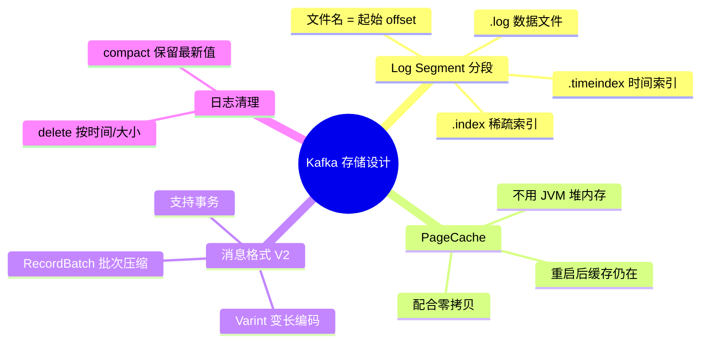

# Kafka 存储机制与日志设计

---

## 1. 为什么要理解存储机制？

Kafka 能做到高吞吐、低延迟，根本原因在于其存储设计。理解存储机制，才能回答：
- 为什么 Kafka 消费历史消息比 RabbitMQ 快？
- 为什么磁盘存储反而比内存队列更快？
- 消息保留多久？磁盘满了怎么办？

---

## 2. 日志文件结构

每个 Partition 对应磁盘上的一个目录，目录内由多个 **Log Segment（日志段）** 组成：

```
/kafka-logs/order-created-0/          ← Partition 目录（Topic名-分区号）
    ├── 00000000000000000000.log       ← 消息数据文件
    ├── 00000000000000000000.index     ← 偏移量索引文件
    ├── 00000000000000000000.timeindex ← 时间戳索引文件
    ├── 00000000000000500000.log       ← 第二个 Segment（从 offset=500000 开始）
    ├── 00000000000000500000.index
    └── 00000000000000500000.timeindex
```

**文件名含义**：文件名就是该 Segment 的**起始 offset**，用 20 位数字表示。

| 文件类型 | 作用 |
|---------|------|
| `.log` | 实际消息数据，顺序追加写入 |
| `.index` | 稀疏偏移量索引，记录 offset → 文件物理位置的映射 |
| `.timeindex` | 时间戳索引，支持按时间查找消息 |

---

## 3. 稀疏索引原理

Kafka 的索引是**稀疏索引**，不是每条消息都建索引，而是每隔一定字节数（`index.interval.bytes`，默认 4KB）建一条索引。

```
.index 文件内容（示意）：
┌──────────────────────────────────────┐
│ offset=0      → 文件位置 0           │
│ offset=100    → 文件位置 4096        │
│ offset=200    → 文件位置 8192        │
│ ...                                  │
└──────────────────────────────────────┘

查找 offset=150 的消息：
1. 二分查找 .index，找到最近的索引项：offset=100 → 位置 4096
2. 从 .log 文件的 4096 位置顺序扫描，直到找到 offset=150
```

**为什么用稀疏索引而不是全量索引？**

| 对比 | 全量索引 | 稀疏索引 |
|------|---------|---------|
| 查找速度 | O(1) | O(log n) + 少量顺序扫描 |
| 索引文件大小 | 与消息数量成正比（很大） | 固定小（可全部加载进内存） |
| 内存占用 | 高 | 低 |

> **结论**：稀疏索引牺牲了极少量查找性能，换来了索引文件可以常驻内存，整体查找效率反而更高。

---

## 4. PageCache 的利用

Kafka 不自己管理内存缓存，而是**完全依赖操作系统的 PageCache**：

```
写入流程：
Producer → Kafka Broker → PageCache（内存）→ 磁盘（异步刷盘）

读取流程（消费者消费最新消息）：
Consumer → Kafka Broker → PageCache（直接命中，不读磁盘）→ 网卡（零拷贝）
```

**为什么不自己管理内存？**

1. **JVM GC 问题**：如果 Kafka 用 JVM 堆内存缓存消息，大量对象会触发 Full GC，导致停顿
2. **重启恢复**：PageCache 由 OS 管理，Kafka 重启后 PageCache 仍然存在，不需要预热
3. **零拷贝配合**：`sendfile` 系统调用直接将 PageCache 中的数据发送到网卡，无需经过用户态

---

## 5. 消息格式演进（Message Format）

Kafka 消息格式经历了三个版本：

```
V0（Kafka 0.10 之前）：
┌────────┬──────┬────────┬─────┬───────┐
│ Offset │ Size │ CRC32  │ Key │ Value │
└────────┴──────┴────────┴─────┴───────┘
问题：不支持时间戳，不支持批量压缩

V1（Kafka 0.10）：
┌────────┬──────┬────────┬───────────┬─────┬───────┐
│ Offset │ Size │ CRC32  │ Timestamp │ Key │ Value │
└────────┴──────┴────────┴───────────┴─────┴───────┘
问题：每条消息单独压缩，效率低

V2（Kafka 0.11+，RecordBatch）：
┌─────────────────────────────────────────────────────┐
│ RecordBatch Header（批次头，包含压缩、时间戳等元数据）  │
├─────────────────────────────────────────────────────┤
│ Record 1（使用 Varint 变长编码，节省空间）             │
│ Record 2                                            │
│ Record N                                            │
└─────────────────────────────────────────────────────┘
优势：批次级别压缩，空间利用率更高；支持事务；使用 Varint 减少空间占用
```

---

## 6. 日志清理策略

Kafka 支持两种日志清理策略，通过 `log.cleanup.policy` 配置：

### 6.1 delete（按时间/大小删除）

```properties
# 消息保留时间（默认 7 天）
log.retention.hours=168

# 消息保留大小（默认 -1，不限制）
log.retention.bytes=-1

# 单个 Segment 文件大小上限（默认 1GB，超过则滚动新 Segment）
log.segment.bytes=1073741824
```

**删除流程**：后台线程定期扫描，将超过保留时间或大小的 Segment 整体删除（不是逐条删除）。

### 6.2 compact（日志压缩，保留最新值）

适用于**需要保留每个 Key 最新状态**的场景（如数据库变更日志、配置中心）：

```
压缩前：
Key=user1, Value={"name":"Alice"}   offset=0
Key=user2, Value={"name":"Bob"}     offset=1
Key=user1, Value={"name":"Alice2"}  offset=2  ← user1 的新值
Key=user1, Value=null               offset=3  ← 墓碑消息，表示删除

压缩后：
Key=user2, Value={"name":"Bob"}     offset=1  ← 保留
Key=user1, Value=null               offset=3  ← 保留墓碑消息（一段时间后删除）
```

> **墓碑消息（Tombstone）**：Value 为 null 的消息，表示该 Key 已被删除。压缩时会保留一段时间（`delete.retention.ms`），让消费者有机会感知到删除事件。

---

## 7. Log Segment 滚动时机

新 Segment 在以下任一条件满足时创建：

| 条件 | 配置参数 | 默认值 |
|------|---------|--------|
| Segment 文件大小超过阈值 | `log.segment.bytes` | 1 GB |
| Segment 存在时间超过阈值 | `log.roll.hours` | 168 小时（7天） |
| 索引文件满 | `log.index.size.max.bytes` | 10 MB |

---

## 8. 存储设计总结



| 设计决策 | 原因 |
|---------|------|
| 分段存储（Segment） | 便于按时间/大小删除，避免操作单个超大文件 |
| 稀疏索引 | 索引文件小，可常驻内存，查找效率高 |
| 依赖 PageCache | 避免 JVM GC，重启不需要预热，配合零拷贝 |
| 顺序追加写 | 磁盘顺序写速度接近内存，避免随机 IO |
