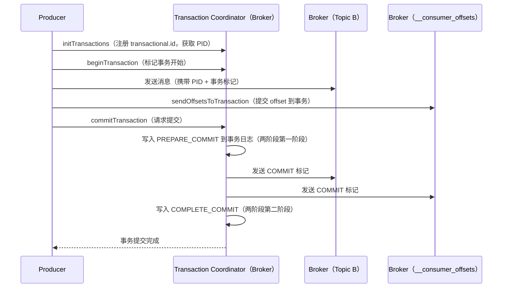
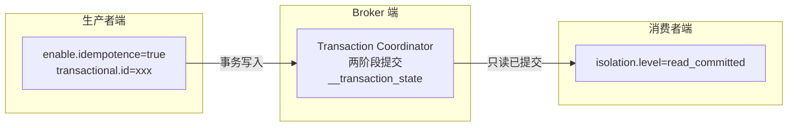

# Kafka 事务消息与 Exactly Once 语义

---

## 1. 三种消费语义

在分布式系统中，消息传递有三种语义保证：

| 语义 | 含义 | 实现方式 | 问题 |
|------|------|---------|------|
| **At Most Once** | 最多一次，可能丢消息 | 发送后不重试，自动提交 offset | 消息可能丢失 |
| **At Least Once** | 至少一次，可能重复 | `acks=all` + 重试 + 手动提交 offset | 消息可能重复 |
| **Exactly Once** | 恰好一次，不丢不重 | 幂等生产者 + 事务 | 实现复杂，性能有损耗 |

> **生产实践**：大多数业务用 **At Least Once + 消费端幂等** 来模拟 Exactly Once，因为真正的 Exactly Once 性能开销较大。

---

## 2. 幂等生产者（Idempotent Producer）

### 2.1 解决的问题

```
没有幂等性时：
Producer → 发送消息 → 网络超时 → 重试 → Broker 收到两条相同消息 → 消息重复

开启幂等性后：
Producer → 发送消息（携带 PID + Sequence Number）→ 网络超时 → 重试
→ Broker 发现 Sequence Number 已存在 → 去重，只保留一条
```

### 2.2 实现原理

```
每个 Producer 启动时，Broker 分配唯一的 PID（Producer ID）
每条消息携带：PID + Partition + Sequence Number（单调递增）

Broker 维护每个 (PID, Partition) 的最大 Sequence Number：
- 新消息的 Sequence Number = 已记录的 + 1 → 正常写入
- 新消息的 Sequence Number ≤ 已记录的 → 重复，丢弃
- 新消息的 Sequence Number > 已记录的 + 1 → 乱序，报错
```

### 2.3 局限性

幂等生产者**只能保证单分区、单会话**内的幂等：

- **单分区**：PID + Sequence Number 是针对每个 Partition 独立维护的，跨分区不保证
- **单会话**：Producer 重启后 PID 会变化，重启前的 Sequence Number 记录失效

```java
// 开启幂等生产者
props.put("enable.idempotence", "true");
// 开启后自动设置：acks=all, retries=MAX_INT, max.in.flight.requests.per.connection=5
```

---

## 3. 事务消息（Transactional Producer）

### 3.1 解决的问题

幂等生产者无法解决跨分区的原子性问题：

```
场景：消费 Topic A 的消息，处理后写入 Topic B（消费-转换-生产模式）

问题：
1. 写入 Topic B 成功，但提交 Topic A 的 offset 失败 → 消息重复处理
2. 提交 Topic A 的 offset 成功，但写入 Topic B 失败 → 消息丢失

需要：写入 Topic B 和提交 offset 这两个操作要么都成功，要么都失败
```

### 3.2 事务 API 使用

```java
// 配置事务 ID（唯一标识，重启后可恢复未完成的事务）
props.put("transactional.id", "order-processor-1");
props.put("enable.idempotence", "true"); // 事务依赖幂等性

KafkaProducer<String, String> producer = new KafkaProducer<>(props);
producer.initTransactions(); // 初始化事务，向 Broker 注册 transactional.id

try {
    producer.beginTransaction(); // 开启事务

    // 写入多个分区（原子性）
    producer.send(new ProducerRecord<>("topic-b", key, value));
    producer.send(new ProducerRecord<>("topic-c", key, value));

    // 提交消费者 offset（与写入操作原子性）
    Map<TopicPartition, OffsetAndMetadata> offsets = new HashMap<>();
    offsets.put(new TopicPartition("topic-a", 0), new OffsetAndMetadata(offset + 1));
    producer.sendOffsetsToTransaction(offsets, "consumer-group-id");

    producer.commitTransaction(); // 提交事务
} catch (Exception e) {
    producer.abortTransaction(); // 回滚事务
}
```

### 3.3 事务实现原理（两阶段提交）



**Transaction Coordinator** 是 Broker 上的一个组件，负责管理事务状态，存储在内部 Topic `__transaction_state` 中。

---

## 4. 消费者端：isolation.level

事务消息写入 Broker 后，消费者需要配置隔离级别才能实现 Exactly Once：

```java
// read_committed：只消费已提交事务的消息（默认是 read_uncommitted）
props.put("isolation.level", "read_committed");
```

| isolation.level | 行为 | 适用场景 |
|----------------|------|---------|
| `read_uncommitted`（默认） | 消费所有消息，包括未提交事务的消息 | 不关心事务的场景 |
| `read_committed` | 只消费已提交事务的消息，事务回滚的消息不可见 | 需要 Exactly Once 的场景 |

---

## 5. Exactly Once 完整链路



---

## 6. 与 RocketMQ 事务消息对比

| 对比维度 | Kafka 事务 | RocketMQ 事务消息 |
|---------|-----------|-----------------|
| **实现方式** | 两阶段提交（2PC） | 半消息 + 本地事务 + 回查 |
| **适用场景** | 跨分区/跨 Topic 原子写入 | 本地事务与消息发送的原子性 |
| **消费者感知** | 需配置 `isolation.level` | 消费者无感知 |
| **性能开销** | 较高（2PC 有协调开销） | 中等 |
| **典型用法** | Kafka Streams 流处理 | 订单创建 + 消息发送原子性 |

> **核心区别**：Kafka 事务解决的是**生产者跨分区原子写入**；RocketMQ 事务消息解决的是**本地数据库操作与消息发送的原子性**。两者场景不同，不能直接替换。

---

## 7. 实践建议

| 场景 | 推荐方案 |
|------|---------|
| 普通业务消息 | `acks=all` + 手动提交 offset + 消费端幂等（At Least Once） |
| 需要跨分区原子写入 | 开启事务（`transactional.id` + `isolation.level=read_committed`） |
| Kafka Streams 流处理 | 使用 `processing.guarantee=exactly_once_v2` |
| 本地事务 + 消息原子性 | 考虑 RocketMQ 事务消息，或本地消息表方案 |
