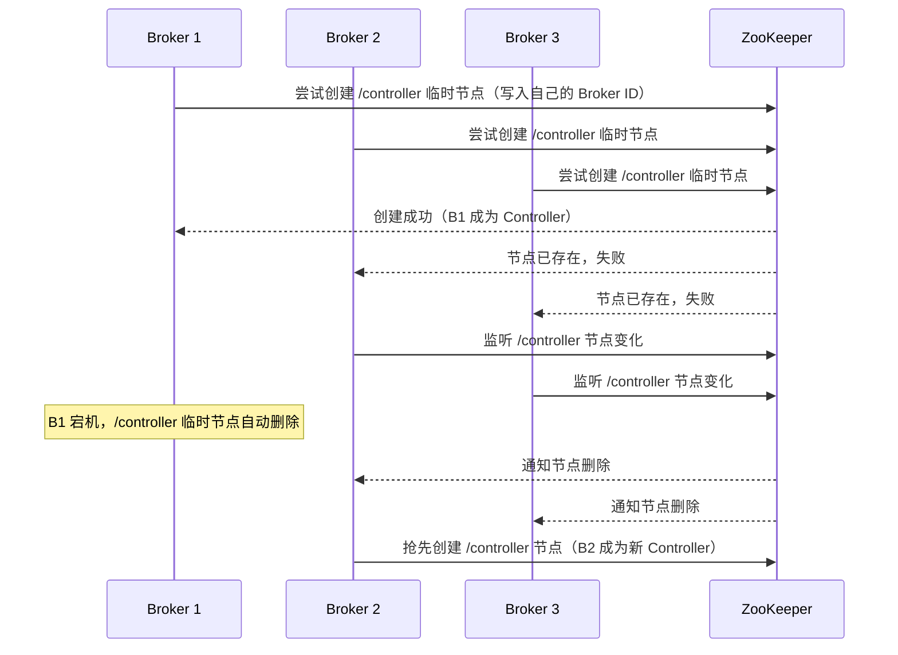
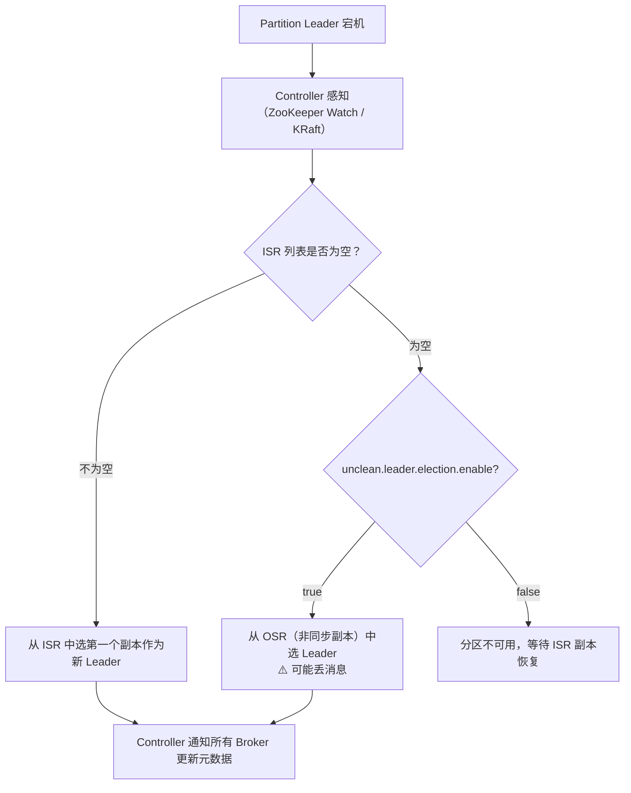
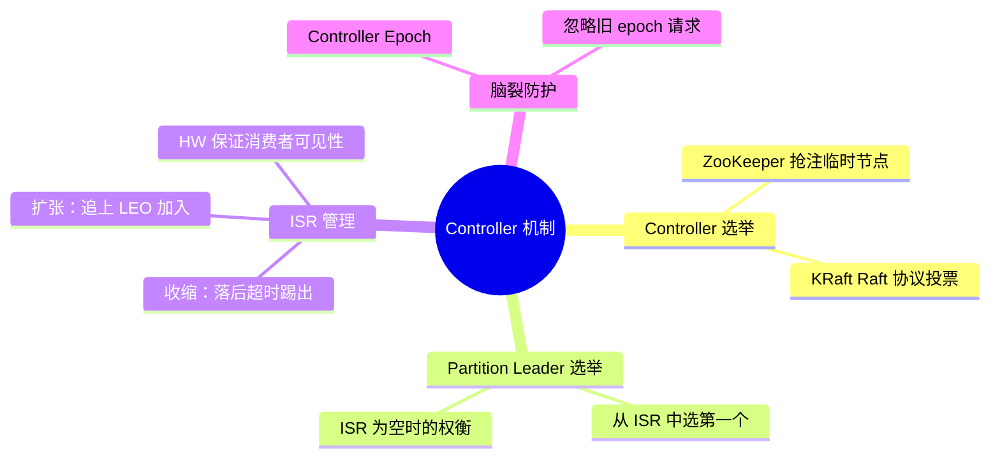

# Kafka Controller 与 Leader 选举机制

---

## 1. 什么是 Controller？

Kafka 集群中有多个 Broker，但只有一个 Broker 会被选为 **Controller（控制器）**。

Controller 负责整个集群的**元数据管理和协调工作**：

| Controller 职责 | 说明 |
|----------------|------|
| **Partition Leader 选举** | 当 Leader 宕机时，从 ISR 中选出新 Leader |
| **Broker 上下线感知** | 监听 Broker 的加入和退出 |
| **Topic 管理** | 处理 Topic 创建、删除、分区扩容 |
| **副本状态机管理** | 维护所有副本的状态（Online/Offline/NewReplica 等） |

---

## 2. Controller 选举（ZooKeeper 模式）



**关键点**：
- ZooKeeper 临时节点（Ephemeral Node）在会话断开时自动删除，天然实现了 Controller 宕机检测
- 多个 Broker 同时抢注，ZooKeeper 保证只有一个成功（分布式锁）

---

## 3. Controller 选举（KRaft 模式）

Kafka 3.x 引入 KRaft 模式，用内置 Raft 协议替代 ZooKeeper：

```
KRaft 集群角色：
- Controller 节点：专门负责元数据管理（可以与 Broker 合并部署）
- Broker 节点：负责数据存储和读写

Controller 选举流程（Raft）：
1. 每个 Controller 节点有一个 epoch（任期号）
2. 节点发现 Leader 失联后，增加 epoch，向其他节点发起投票请求
3. 获得多数票（>N/2）的节点成为新 Leader（Controller）
4. 新 Controller 同步最新的元数据日志，然后开始工作
```

---

## 4. Partition Leader 选举

当某个 Partition 的 Leader 宕机时，Controller 负责从 **ISR（In-Sync Replicas）** 中选出新 Leader：



**ISR（In-Sync Replicas）**：与 Leader 保持同步的副本集合。判断标准：

```properties
# Follower 落后 Leader 的最大时间（超过则踢出 ISR）
replica.lag.time.max.ms=30000
```

---

## 5. ISR 收缩与扩张

```
ISR 收缩（Follower 被踢出 ISR）：
Follower 超过 replica.lag.time.max.ms 未向 Leader 发送 Fetch 请求
→ Leader 将其从 ISR 中移除
→ 通知 Controller 更新 ISR 列表

ISR 扩张（Follower 重新加入 ISR）：
Follower 恢复后，持续从 Leader 同步数据
→ 追上 Leader 的 LEO（Log End Offset）
→ Leader 将其重新加入 ISR
```

| 术语 | 全称 | 含义 |
|------|------|------|
| **LEO** | Log End Offset | 分区日志的下一条消息的 offset（最新写入位置） |
| **HW** | High Watermark | 所有 ISR 副本都已同步的最大 offset，消费者只能消费到 HW |
| **ISR** | In-Sync Replicas | 与 Leader 保持同步的副本集合 |
| **OSR** | Out-of-Sync Replicas | 落后于 Leader 的副本集合 |

```
HW 的作用（消费者可见性）：

Leader LEO:    0  1  2  3  4  5  ← 已写入 6 条消息
Follower1 LEO: 0  1  2  3  4     ← 同步到 offset=4
Follower2 LEO: 0  1  2  3        ← 同步到 offset=3

HW = min(所有 ISR 的 LEO) = 3
消费者只能消费到 offset=3，offset=4、5 对消费者不可见

为什么这样设计：防止消费者消费了 Leader 上的消息，但 Leader 宕机后
新 Leader 没有这条消息，导致消费到"幻影消息"
```

---

## 6. unclean.leader.election.enable 的权衡

| 配置 | 行为 | 优点 | 缺点 |
|------|------|------|------|
| `false`（默认，推荐） | ISR 为空时分区不可用 | 不丢消息，数据一致性强 | 分区暂时不可用 |
| `true` | ISR 为空时从 OSR 选 Leader | 分区持续可用 | 可能丢失未同步的消息 |

> **生产建议**：金融、订单等核心业务保持 `false`；日志收集等允许少量丢失的场景可设为 `true`。

---

## 7. Controller 脑裂问题

**脑裂（Split Brain）**：网络分区导致出现两个 Controller 同时工作。

**ZooKeeper 模式的解决方案**：Controller Epoch（纪元号）

```
每次 Controller 选举，epoch 加 1
Broker 收到 Controller 的请求时，检查 epoch：
- 请求的 epoch = 当前 epoch → 合法请求，执行
- 请求的 epoch < 当前 epoch → 旧 Controller 的请求，忽略
```

---

## 8. 总结


