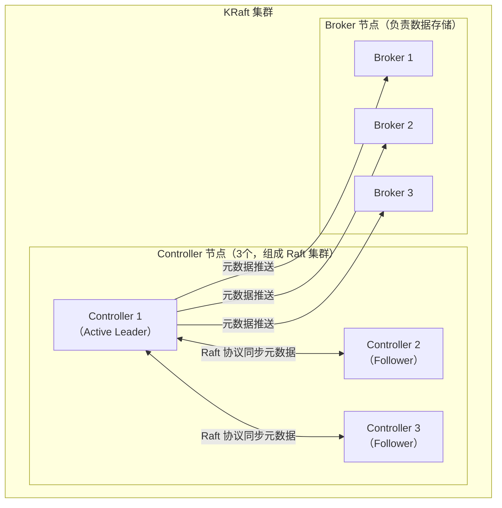
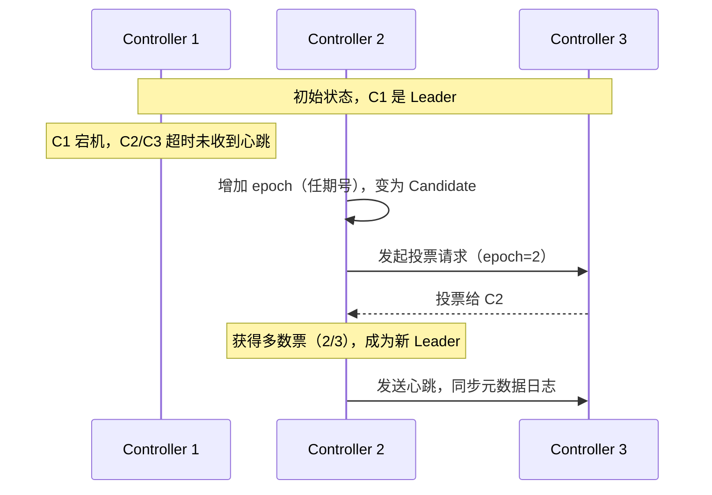

# KRaft 模式与去 ZooKeeper

---

## 1. ZooKeeper 模式的痛点

Kafka 早期依赖 ZooKeeper 存储集群元数据，随着规模增大，问题逐渐暴露：

| 痛点 | 说明 |
|------|------|
| **双系统运维** | 需要同时维护 Kafka 集群和 ZooKeeper 集群，运维复杂度翻倍 |
| **元数据瓶颈** | ZooKeeper 的写入吞吐有限，大规模集群（百万分区）时元数据操作成为瓶颈 |
| **Controller 重启慢** | Controller 宕机后，新 Controller 需要从 ZooKeeper 全量加载元数据，分区数越多越慢（可能需要数分钟） |
| **ZooKeeper 本身的问题** | ZooKeeper 的 ZAB 协议与 Kafka 的 Raft 是两套不同的一致性协议，增加了系统复杂性 |
| **扩展性上限** | ZooKeeper 实测在 20 万分区左右开始出现性能问题 |

---

## 2. KRaft 是什么？

**KRaft**（Kafka Raft）是 Kafka 内置的基于 **Raft 协议**的元数据管理方案，完全替代 ZooKeeper。

```
KRaft = Kafka + Raft
目标：让 Kafka 自己管理自己的元数据，不再依赖外部系统
```

**发展历程**：

| 版本 | 里程碑 |
|------|--------|
| Kafka 2.8（2021） | KRaft 预览版（不建议生产使用） |
| Kafka 3.3（2022） | KRaft 正式 GA，可用于生产 |
| Kafka 3.5（2023） | ZooKeeper 模式标记为 Deprecated |
| Kafka 4.0（2024） | 完全移除 ZooKeeper 支持 |

---

## 3. KRaft 架构

### 3.1 节点角色

KRaft 模式下，Kafka 节点有三种角色：



| 角色 | 职责 | 说明 |
|------|------|------|
| **Controller（Active）** | 处理所有元数据写入请求 | Raft Leader，同一时刻只有一个 |
| **Controller（Follower）** | 同步元数据，参与选举 | Raft Follower，可接管 Leader |
| **Broker** | 数据存储与读写 | 从 Active Controller 拉取最新元数据 |

> **部署灵活性**：Controller 和 Broker 可以合并部署（小集群），也可以分离部署（大集群，推荐）。

### 3.2 元数据存储：@metadata Topic

KRaft 将所有元数据存储在一个内部 Topic `__cluster_metadata` 中，以 **Raft 日志**的形式持久化：

```
__cluster_metadata 日志内容（示意）：
offset=1: RegisterBrokerRecord（Broker 1 注册）
offset=2: RegisterBrokerRecord（Broker 2 注册）
offset=3: TopicRecord（创建 Topic "orders"）
offset=4: PartitionRecord（分区 0 分配到 Broker 1）
offset=5: PartitionChangeRecord（Leader 从 Broker 1 变为 Broker 2）
...
```

**优势**：
- 元数据变更以日志形式追加，天然支持回放和审计
- Broker 通过拉取日志同步元数据，无需 ZooKeeper Watch 机制
- Controller 重启后只需从日志末尾继续，不需要全量加载

---

## 4. Raft 协议简介

KRaft 基于 Raft 协议实现 Controller 的高可用选举和元数据一致性。

### 4.1 Leader 选举



**Raft 选举规则**：
1. 节点超时未收到 Leader 心跳，增加 epoch，发起选举
2. 获得 **多数票（>N/2）** 的节点成为新 Leader
3. 新 Leader 同步最新日志后，开始处理请求

### 4.2 日志复制

```
写入流程（元数据变更）：
1. 客户端（Broker）向 Active Controller 发送元数据变更请求
2. Active Controller 将变更写入本地 Raft 日志
3. Active Controller 将日志复制给 Follower Controller
4. 多数 Follower 确认后，变更提交（Commit）
5. Active Controller 通知 Broker 更新元数据缓存
```

---

## 5. KRaft vs ZooKeeper 模式对比

| 对比维度 | ZooKeeper 模式 | KRaft 模式 |
|---------|--------------|-----------|
| **外部依赖** | 需要独立的 ZooKeeper 集群 | 无外部依赖，自包含 |
| **运维复杂度** | 高（两套系统） | 低（一套系统） |
| **Controller 故障恢复** | 慢（需全量加载元数据，分钟级） | 快（增量同步，秒级） |
| **分区扩展上限** | ~20 万分区 | **百万分区**（官方测试） |
| **元数据一致性** | ZAB 协议 | Raft 协议 |
| **元数据审计** | 不支持 | 支持（日志可回放） |
| **生产可用性** | 成熟稳定 | Kafka 3.3+ GA，逐渐成熟 |

---

## 6. KRaft 配置示例

```properties
# kraft/server.properties

# 节点角色：controller（纯控制节点）、broker（纯数据节点）、broker,controller（合并部署）
process.roles=broker,controller

# 节点 ID（集群内唯一）
node.id=1

# Controller 节点列表（格式：nodeId@host:port）
controller.quorum.voters=1@kafka1:9093,2@kafka2:9093,3@kafka3:9093

# 监听地址
listeners=PLAINTEXT://:9092,CONTROLLER://:9093
inter.broker.listener.name=PLAINTEXT
controller.listener.names=CONTROLLER

# 日志目录
log.dirs=/var/kafka/data
```

**初始化集群（首次启动必须执行）**：

```bash
# 生成唯一的集群 ID
KAFKA_CLUSTER_ID=$(kafka-storage.sh random-uuid)

# 格式化存储目录（所有节点都要执行）
kafka-storage.sh format -t $KAFKA_CLUSTER_ID -c /etc/kafka/kraft/server.properties

# 启动 Kafka
kafka-server-start.sh /etc/kafka/kraft/server.properties
```

---

## 7. 迁移：从 ZooKeeper 模式迁移到 KRaft

Kafka 3.x 提供了迁移工具，支持**滚动迁移**（不停机）：

```
迁移步骤（简化）：
1. 升级 Kafka 版本到 3.5+
2. 部署 KRaft Controller 节点（与现有 ZooKeeper 集群并行运行）
3. 将 Broker 配置为同时连接 ZooKeeper 和 KRaft Controller（桥接模式）
4. 元数据从 ZooKeeper 迁移到 KRaft
5. 逐步将 Broker 切换为纯 KRaft 模式
6. 下线 ZooKeeper 集群
```

> **生产建议**：新建集群直接使用 KRaft 模式；存量集群可在 Kafka 4.0 之前规划迁移。

---

## 8. 常见问题

**Q：KRaft 模式下 Controller 宕机，多久能恢复？**

> KRaft 模式下，Follower Controller 持续同步元数据日志，宕机后只需通过 Raft 选举（通常秒级完成），新 Leader 无需全量加载元数据，恢复速度远快于 ZooKeeper 模式（ZooKeeper 模式可能需要数分钟）。

**Q：KRaft 的 Controller 节点数量怎么选？**

> 推荐 **3 个或 5 个** Controller 节点（奇数，满足多数派要求）：
> - 3 个节点：可容忍 1 个节点故障
> - 5 个节点：可容忍 2 个节点故障，适合对可用性要求极高的场景
> - Controller 节点不需要太多，过多反而增加 Raft 同步开销

**Q：KRaft 模式下还能用 ZooKeeper 相关工具吗？**

> 不能。KRaft 模式下没有 ZooKeeper，原来依赖 ZooKeeper 的工具（如 `kafka-topics.sh --zookeeper`）需要改用 `--bootstrap-server` 参数。
