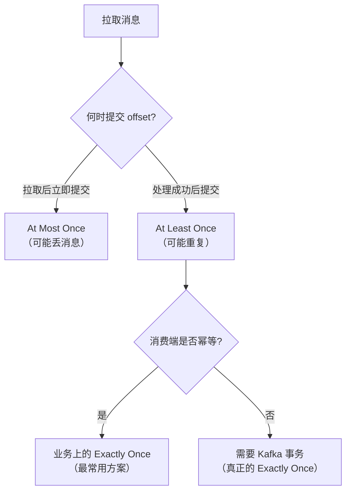
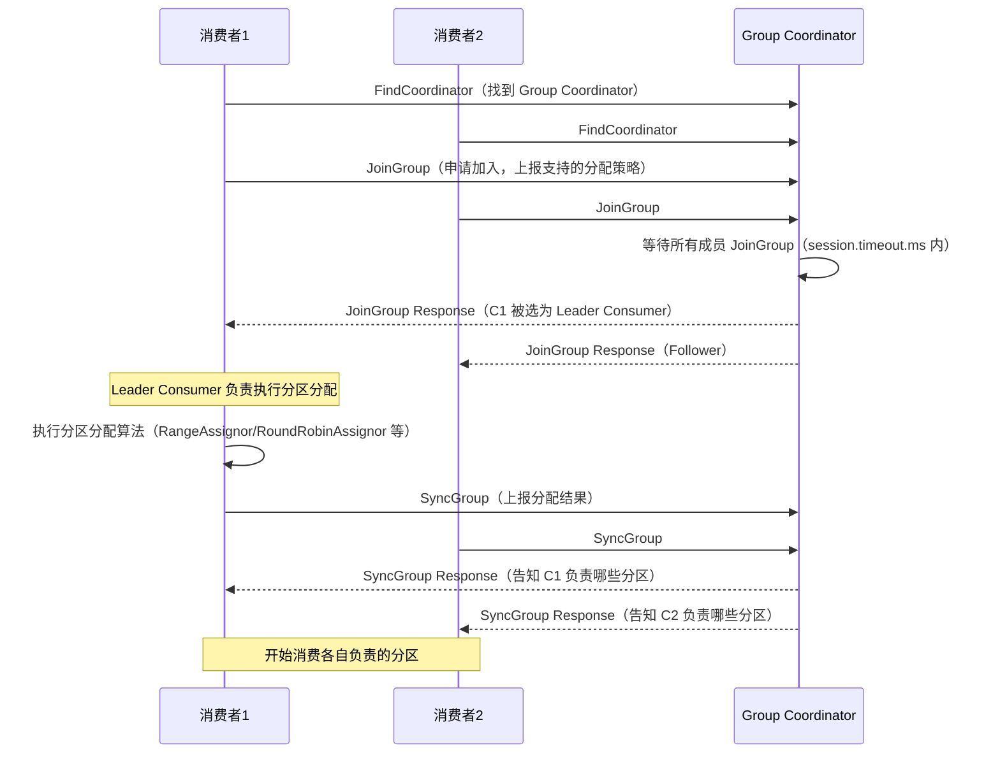

# 消费语义与位移管理

---

## 1. 三种消费语义

| 语义 | 含义 | 实现方式 | 风险 |
|------|------|---------|------|
| **At Most Once（最多一次）** | 消息可能丢失，不会重复 | 拉取消息后立即提交 offset，再处理 | 处理失败则消息丢失 |
| **At Least Once（至少一次）** | 消息不会丢失，可能重复 | 处理成功后再提交 offset | 处理成功但提交失败则重复消费 |
| **Exactly Once（恰好一次）** | 不丢不重 | 幂等生产者 + 事务 + `read_committed` | 实现复杂，性能有损耗 |



> **生产实践**：绝大多数业务采用 **At Least Once + 消费端幂等** 的方案，实现简单，性能好。真正的 Kafka 事务（Exactly Once）主要用于 Kafka Streams 等流处理场景。

---

## 2. offset 存储机制

### 2.1 `__consumer_offsets` 内部 Topic

Kafka 0.9 之后，消费者 offset 不再存储在 ZooKeeper，而是存储在 Kafka 内部 Topic `__consumer_offsets` 中：

```
__consumer_offsets 的结构：
- 默认 50 个分区（由 offsets.topic.num.partitions 控制）
- 每条消息的 Key：消费者组ID + Topic + 分区号
- 每条消息的 Value：offset + 元数据（提交时间、过期时间等）

确定分区的公式：
partition = Math.abs(groupId.hashCode()) % 50
```

**为什么从 ZooKeeper 迁移到 Kafka 自身？**

| 对比 | ZooKeeper 存储 | `__consumer_offsets` |
|------|--------------|---------------------|
| 写入吞吐 | 低（ZooKeeper 写入有限） | 高（Kafka 顺序写） |
| 扩展性 | 差 | 好 |
| 运维 | 需要 ZooKeeper | 无额外依赖 |

### 2.2 offset 提交方式

#### 自动提交（Auto Commit）

```java
// 配置
props.put("enable.auto.commit", "true");
props.put("auto.commit.interval.ms", "5000"); // 每5秒自动提交

// 消费代码
while (true) {
    ConsumerRecords<String, String> records = consumer.poll(Duration.ofMillis(100));
    for (ConsumerRecord<String, String> record : records) {
        process(record); // 处理消息
    }
    // 每5秒自动提交 offset（后台线程）
}
```

**问题**：自动提交是 At Least Once 语义，但如果 `poll` 后还没处理完就自动提交了，则变成 At Most Once。

#### 手动提交（Manual Commit）

```java
props.put("enable.auto.commit", "false"); // 关闭自动提交

while (true) {
    ConsumerRecords<String, String> records = consumer.poll(Duration.ofMillis(100));

    for (ConsumerRecord<String, String> record : records) {
        process(record);
    }

    // 方式一：同步提交（阻塞直到提交成功，可靠但慢）
    consumer.commitSync();

    // 方式二：异步提交（不阻塞，性能好，但失败不重试）
    consumer.commitAsync((offsets, exception) -> {
        if (exception != null) {
            log.error("提交 offset 失败: {}", offsets, exception);
        }
    });

    // 方式三：提交指定 offset（精细控制）
    Map<TopicPartition, OffsetAndMetadata> offsetMap = new HashMap<>();
    for (ConsumerRecord<String, String> record : records) {
        offsetMap.put(
            new TopicPartition(record.topic(), record.partition()),
            new OffsetAndMetadata(record.offset() + 1) // 注意：提交的是下一条消息的 offset
        );
    }
    consumer.commitSync(offsetMap);
}
```

**生产推荐**：使用**异步提交 + 关闭时同步提交**的组合：

```java
try {
    while (running) {
        ConsumerRecords<String, String> records = consumer.poll(Duration.ofMillis(100));
        process(records);
        consumer.commitAsync(); // 正常情况异步提交（性能好）
    }
} catch (Exception e) {
    log.error("消费异常", e);
} finally {
    try {
        consumer.commitSync(); // 关闭前同步提交，确保最后一批 offset 不丢失
    } finally {
        consumer.close();
    }
}
```

---

## 3. Group Coordinator（组协调器）

### 3.1 什么是 Group Coordinator？

每个消费者组都有一个 **Group Coordinator**，它是 Broker 上的一个组件，负责：

- 管理消费者组的成员关系（加入、离开、心跳）
- 触发和协调 Rebalance
- 存储消费者组的 offset（写入 `__consumer_offsets`）

**确定 Group Coordinator 的方式**：

```
1. 计算 __consumer_offsets 的分区号：
   partition = Math.abs(groupId.hashCode()) % 50

2. 该分区的 Leader 所在的 Broker，就是这个消费者组的 Group Coordinator
```

### 3.2 消费者加入流程



> **注意**：这里的 **Leader Consumer** 是消费者组内负责执行分区分配的消费者，与 Partition Leader 是完全不同的概念。

---

## 4. 分区分配策略

消费者组内的分区分配由 **Leader Consumer** 执行，支持多种策略：

### 4.1 RangeAssignor（范围分配，默认）

```
场景：2个消费者，Topic A 有 3 个分区，Topic B 有 3 个分区

分配结果：
消费者1：Topic A 分区0、1，Topic B 分区0、1
消费者2：Topic A 分区2，Topic B 分区2

问题：消费者1 比消费者2 多消费 2 个分区，不均衡
```

### 4.2 RoundRobinAssignor（轮询分配）

```
场景：2个消费者，Topic A 有 3 个分区，Topic B 有 3 个分区

所有分区排序：A-0, A-1, A-2, B-0, B-1, B-2
轮询分配：
消费者1：A-0, A-2, B-1
消费者2：A-1, B-0, B-2

优点：分配更均衡
缺点：要求所有消费者订阅相同的 Topic
```

### 4.3 StickyAssignor（粘性分配，推荐）

```
目标：在均衡分配的基础上，尽量保持原有分配不变（减少 Rebalance 时的分区迁移）

Rebalance 前：
消费者1：A-0, A-1, B-0
消费者2：A-2, B-1, B-2

消费者2 离开后，Rebalance：
StickyAssignor：消费者1 保留 A-0, A-1, B-0，新增 A-2（只迁移必要的分区）
RoundRobinAssignor：重新轮询，可能打乱所有分配

优点：减少不必要的分区迁移，降低 Rebalance 影响
```

```java
// 配置分配策略
props.put("partition.assignment.strategy",
    "org.apache.kafka.clients.consumer.StickyAssignor");
```

---

## 5. subscribe vs assign

消费者有两种订阅方式：

| 方式 | 方法 | 特点 | 适用场景 |
|------|------|------|---------|
| **动态订阅** | `subscribe(topics)` | 加入消费者组，自动分配分区，支持 Rebalance | 普通业务消费 |
| **手动分配** | `assign(partitions)` | 不加入消费者组，手动指定分区，不触发 Rebalance | 精确控制、数据迁移、回放历史消息 |

```java
// 方式一：subscribe（加入消费者组）
consumer.subscribe(Arrays.asList("orders", "payments"));

// 方式二：assign（手动指定分区，不加入消费者组）
TopicPartition partition0 = new TopicPartition("orders", 0);
TopicPartition partition1 = new TopicPartition("orders", 1);
consumer.assign(Arrays.asList(partition0, partition1));

// assign 后可以手动指定从哪个 offset 开始消费（用于回放）
consumer.seek(partition0, 1000); // 从 offset=1000 开始消费
```

---

## 6. 消费者 offset 重置策略

当消费者组第一次消费某个 Topic，或者 offset 已过期（超过 `offsets.retention.minutes`，默认 7 天），需要决定从哪里开始消费：

```java
// auto.offset.reset 配置
props.put("auto.offset.reset", "earliest"); // 从最早的消息开始（常用于数据回放）
props.put("auto.offset.reset", "latest");   // 从最新的消息开始（默认，只消费新消息）
props.put("auto.offset.reset", "none");     // 没有 offset 时抛出异常
```

**手动重置 offset（命令行）**：

```bash
# 重置消费者组 my-group 对 Topic orders 的 offset 到最早
kafka-consumer-groups.sh --bootstrap-server localhost:9092 \
  --group my-group \
  --topic orders \
  --reset-offsets --to-earliest \
  --execute

# 重置到指定时间点（用于故障恢复）
kafka-consumer-groups.sh --bootstrap-server localhost:9092 \
  --group my-group \
  --topic orders \
  --reset-offsets --to-datetime 2024-01-01T00:00:00.000 \
  --execute
```

---

## 7. 消费者 Lag 监控

**Consumer Lag**（消费延迟）= 分区最新 offset（LEO）- 消费者已提交 offset

```bash
# 查看消费者组的 Lag
kafka-consumer-groups.sh --bootstrap-server localhost:9092 \
  --group my-group \
  --describe

# 输出示例：
# GROUP     TOPIC   PARTITION  CURRENT-OFFSET  LOG-END-OFFSET  LAG
# my-group  orders  0          1000            1050            50   ← Lag=50
# my-group  orders  1          2000            2000            0
```

**Lag 告警建议**：
- Lag 持续增长 → 消费速度跟不上生产速度，需要扩容消费者或优化处理逻辑
- Lag 突然变大 → 可能是消费者宕机或处理异常，需要排查

---

## 8. 常见问题

**Q：自动提交和手动提交怎么选？**

> 生产环境推荐**手动提交**。自动提交无法精确控制 offset 提交时机，可能导致消息丢失（处理前就提交）或重复消费（提交失败）。手动提交虽然代码稍复杂，但能精确控制消费语义。

**Q：消费者 offset 提交失败了怎么办？**

> offset 提交失败不会导致消息丢失，只会导致下次重启后重复消费（At Least Once 语义）。因此消费端必须实现**幂等处理**，确保重复消费不会产生副作用。

**Q：如何实现消费端幂等？**

> 常见方案：
> 1. **数据库唯一键**：将消息 ID 作为唯一键插入数据库，重复消息会触发唯一键冲突
> 2. **Redis 去重**：用 `SET NX` 记录已处理的消息 ID，有效期设为消息可能重复的时间窗口
> 3. **业务天然幂等**：如更新操作（`UPDATE SET status=1 WHERE id=xxx`），重复执行结果相同
