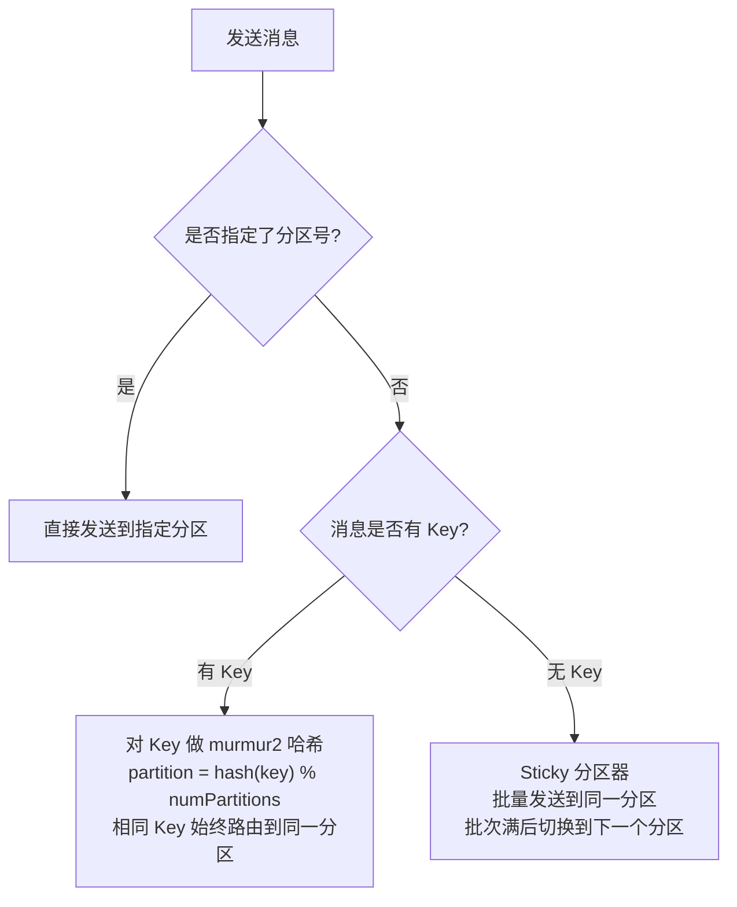
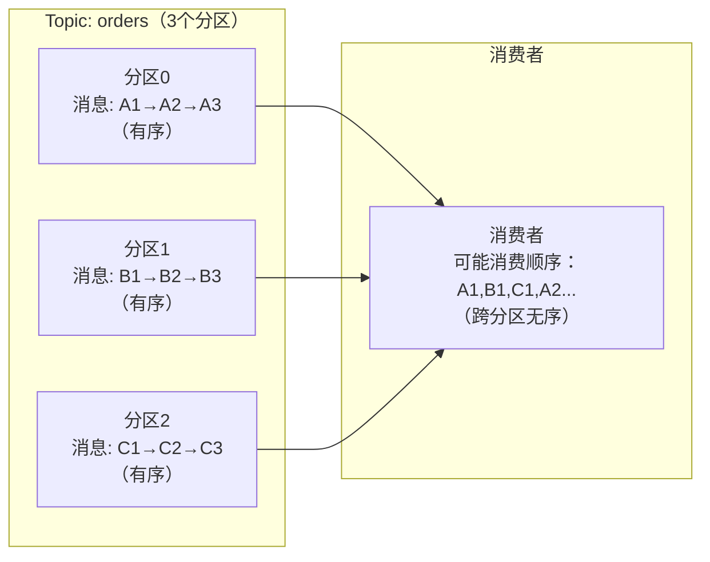

# 生产者分区策略与消息顺序

---

## 1. 为什么需要了解分区策略？

Kafka 的分区是并行处理的基本单位，分区策略决定了：
- **消息路由**：同一类消息是否落到同一分区（影响顺序性）
- **负载均衡**：消息是否均匀分布到各分区（影响吞吐量）
- **热点问题**：某些分区是否过载（影响稳定性）

---

## 2. 分区策略详解

### 2.1 默认分区器（DefaultPartitioner）

Kafka 生产者默认使用 `DefaultPartitioner`，规则如下：



**murmur2 哈希**：Kafka 选用 murmur2 而非 Java 的 `hashCode()`，原因是 murmur2 分布更均匀，且跨语言一致（Java/Python/Go 客户端计算结果相同）。

### 2.2 Sticky 分区器（无 Key 时）

Kafka 2.4 之前，无 Key 的消息使用**轮询（Round Robin）**分配分区，每条消息都可能发到不同分区，导致批次很小，网络开销大。

Kafka 2.4 引入 **Sticky 分区器**：

```
Sticky 分区器行为：
1. 选择一个分区，持续将消息发送到该分区（"粘"在上面）
2. 当该分区的批次满了（batch.size）或等待时间到了（linger.ms），切换到下一个分区
3. 切换时随机选择一个不同的分区

优势：
- 批次更大，减少网络请求次数
- 提高吞吐量（批量压缩效果更好）
```

### 2.3 自定义分区器

```java
public class OrderPartitioner implements Partitioner {

    @Override
    public int partition(String topic, Object key, byte[] keyBytes,
                         Object value, byte[] valueBytes, Cluster cluster) {
        List<PartitionInfo> partitions = cluster.partitionsForTopic(topic);
        int numPartitions = partitions.size();

        if (keyBytes == null) {
            // 无 Key：随机分配
            return ThreadLocalRandom.current().nextInt(numPartitions);
        }

        String keyStr = (String) key;

        // 业务逻辑：VIP 订单发到最后一个分区（专用分区，消费者优先处理）
        if (keyStr.startsWith("VIP_")) {
            return numPartitions - 1;
        }

        // 普通订单：按 Key 哈希，保证同一订单的消息有序
        return Math.abs(keyStr.hashCode()) % (numPartitions - 1);
    }

    @Override
    public void configure(Map<String, ?> configs) {}

    @Override
    public void close() {}
}

// 配置自定义分区器
props.put("partitioner.class", "com.example.OrderPartitioner");
```

---

## 3. 消息顺序性

### 3.1 Kafka 的顺序保证

```
Kafka 的顺序保证：
✅ 同一分区内的消息，严格按照写入顺序消费
❌ 跨分区的消息，不保证顺序
```



### 3.2 如何保证业务消息有序？

**方案：相同业务 Key 的消息发到同一分区**

```java
// 以订单 ID 作为 Key，同一订单的所有消息（创建、支付、发货）都路由到同一分区
producer.send(new ProducerRecord<>("orders", orderId, orderCreatedEvent));
producer.send(new ProducerRecord<>("orders", orderId, orderPaidEvent));
producer.send(new ProducerRecord<>("orders", orderId, orderShippedEvent));

// 同一 orderId → 相同分区 → 消费者按顺序消费
```

**注意事项**：

```
⚠️ 分区数变更会破坏顺序！
原来：hash("order-123") % 3 = 分区1
扩容后：hash("order-123") % 6 = 分区4（不同分区！）

解决方案：
1. 提前规划好分区数，避免后期扩容
2. 如果必须扩容，在扩容前等待所有历史消息消费完毕
3. 使用自定义分区器，基于业务逻辑而非分区数取模
```

### 3.3 消费者端保证顺序

即使生产者保证了同一 Key 在同一分区，消费者端也需要注意：

```java
// ❌ 多线程并发处理同一分区的消息，会破坏顺序
ExecutorService executor = Executors.newFixedThreadPool(10);
for (ConsumerRecord<String, String> record : records) {
    executor.submit(() -> process(record)); // 并发处理，顺序无法保证
}

// ✅ 方案一：单线程处理（简单，但吞吐低）
for (ConsumerRecord<String, String> record : records) {
    process(record); // 顺序处理
}

// ✅ 方案二：按 Key 分组，同一 Key 的消息串行处理，不同 Key 并行
Map<String, List<ConsumerRecord<String, String>>> grouped = records.stream()
    .collect(Collectors.groupingBy(ConsumerRecord::key));

grouped.forEach((key, keyRecords) -> {
    executor.submit(() -> {
        // 同一 Key 的消息在同一线程中顺序处理
        keyRecords.forEach(this::process);
    });
});
```

---

## 4. `max.in.flight.requests.per.connection` 与顺序性

这个参数控制**生产者在收到 Broker 响应之前，最多可以发送多少个未确认的请求**。

```
默认值：5

场景：发送消息 M1、M2、M3（max.in.flight=3）
M1 → Broker（发送中）
M2 → Broker（发送中）
M3 → Broker（发送中）

如果 M1 发送失败，M2、M3 已经发送成功：
重试 M1 → M1 被追加到 M2、M3 之后 → 顺序变为 M2、M3、M1 ❌
```

**解决方案**：

```java
// 方案一：设置 max.in.flight.requests.per.connection=1（严格顺序，但吞吐低）
props.put("max.in.flight.requests.per.connection", "1");

// 方案二：开启幂等生产者（推荐）
// 幂等生产者会检测乱序，自动保证顺序，同时 max.in.flight 可以设为 5
props.put("enable.idempotence", "true");
// 开启幂等后，Kafka 自动将 max.in.flight 限制为 5，并保证顺序
```

| 配置 | 顺序保证 | 吞吐量 |
|------|---------|--------|
| `max.in.flight=1` | ✅ 严格有序 | 低 |
| `max.in.flight=5` + 无幂等 | ❌ 重试可能乱序 | 高 |
| `max.in.flight=5` + 幂等 | ✅ 有序 | 高（推荐） |

---

## 5. 生产者核心参数调优

### 5.1 批量发送参数

```properties
# 批次大小（字节），批次满了立即发送（默认 16KB）
batch.size=65536

# 等待时间（毫秒），即使批次未满，等待 linger.ms 后也发送（默认 0，即不等待）
linger.ms=10

# 发送缓冲区大小（默认 32MB）
buffer.memory=33554432
```

**batch.size 和 linger.ms 的权衡**：

```
linger.ms=0（默认）：消息立即发送，延迟低，但批次小，吞吐低
linger.ms=10：等待10ms凑批，延迟略高，但批次大，吞吐高

生产建议：
- 低延迟场景（如实时告警）：linger.ms=0
- 高吞吐场景（如日志收集）：linger.ms=5~20，batch.size=64KB~256KB
```

### 5.2 可靠性参数

```properties
# 确认机制
acks=all          # 等待所有 ISR 副本确认（最可靠，推荐）
acks=1            # 只等待 Leader 确认（默认，可能丢消息）
acks=0            # 不等待确认（最快，可能丢消息）

# 重试次数（默认 MAX_INT，配合幂等使用）
retries=2147483647

# 重试间隔（默认 100ms）
retry.backoff.ms=100

# 请求超时时间
request.timeout.ms=30000
```

### 5.3 压缩参数

```properties
# 压缩算法（默认 none）
compression.type=lz4    # 推荐：压缩率和速度的最佳平衡
# compression.type=snappy  # 速度快，压缩率一般
# compression.type=gzip    # 压缩率最高，但 CPU 消耗大
# compression.type=zstd    # Kafka 2.1+，综合性能最好
```

**压缩效果对比**：

| 算法 | 压缩率 | 速度 | CPU 消耗 | 推荐场景 |
|------|--------|------|---------|---------|
| none | — | 最快 | 无 | 消息本身已压缩 |
| lz4 | 中 | 快 | 低 | **通用推荐** |
| snappy | 中 | 快 | 低 | 通用 |
| gzip | 高 | 慢 | 高 | 带宽紧张 |
| zstd | 高 | 中 | 中 | Kafka 2.1+，综合最优 |

---

## 6. 分区数规划

### 6.1 分区数如何影响性能？

```
分区数越多：
✅ 并行度越高，吞吐量越大
✅ 消费者可以更多（消费者数 ≤ 分区数）
❌ Controller 管理开销增大
❌ 文件句柄消耗增多（每个分区对应多个文件）
❌ Rebalance 时间变长
```

### 6.2 分区数规划公式

```
目标分区数 = max(生产者吞吐量 / 单分区写入吞吐, 消费者吞吐量 / 单分区消费吞吐)

经验值：
- 单分区写入吞吐：约 10~50 MB/s（取决于消息大小、压缩、副本数）
- 单分区消费吞吐：约 50~100 MB/s

示例：
目标总吞吐：500 MB/s
单分区写入：20 MB/s
分区数 = 500 / 20 = 25 个分区
```

**实践建议**：
- 初始分区数可以设置为**消费者实例数的 2~3 倍**，留有扩容余地
- 单个 Topic 分区数不建议超过 **200 个**（除非有明确的吞吐需求）
- 整个集群分区总数建议不超过 **每个 Broker 4000 个**

---

## 7. 常见问题

**Q：Kafka 能保证全局消息有序吗？**

> 不能。Kafka 只保证**单分区内有序**。如果需要全局有序，只能使用单分区 Topic，但这样会失去并行处理能力，吞吐量极低。实际业务中，通常只需要**同一业务实体（如同一订单）的消息有序**，用相同 Key 路由到同一分区即可满足需求。

**Q：分区数可以减少吗？**

> **不能减少**，只能增加。Kafka 不支持减少分区数，因为减少分区会导致数据丢失。如果分区数设置过多，只能新建 Topic 并迁移数据。

**Q：Key 为 null 时，消息会发到哪个分区？**

> Kafka 2.4 之前使用轮询（Round Robin），每条消息轮流发到不同分区。Kafka 2.4 之后使用 Sticky 分区器，批量发到同一分区，批次满后切换，提高了批量发送效率。

**Q：如何避免分区热点？**

> 分区热点通常由 Key 分布不均匀导致（如大量消息的 Key 相同）。解决方案：
> 1. **Key 加随机后缀**：`key = originalKey + "_" + random(0, N)`，将热点分散到 N 个分区（但会破坏顺序性）
> 2. **自定义分区器**：根据业务逻辑均匀分配
> 3. **监控分区流量**：通过 `kafka-log-dirs.sh` 或监控系统发现热点分区
