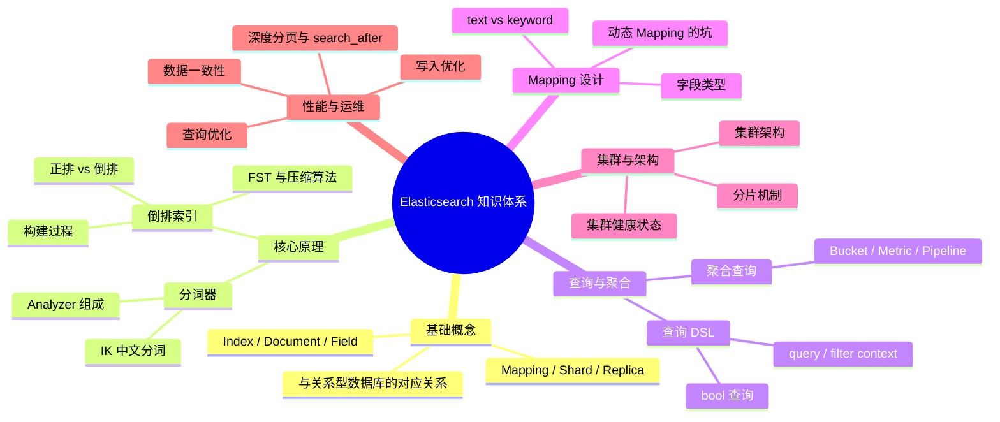

# Elasticsearch 搜索引擎核心

> **学习目标**：从"会用 ES 查询"升级到"理解原理 → 能设计索引方案 → 能排查性能问题"
>
> **检验标准**：学完每个模块后，能口述"这个技术解决了什么问题？不用它会怎样？工作中有哪些坑？"

---

## 整体知识地图

---

## 知识点导航

| # | 知识点 | 核心一句话 | 详细文档 |
|---|--------|-----------|---------|
| 01 | **引入与背景** | ES 解决全文搜索和复杂聚合问题，MySQL LIKE 全表扫描无法胜任 | [01-引入与背景.md](./01-引入与背景.md) |
| 02 | **核心概念** | Index≈数据库，Document≈行，Field≈列，Shard 实现水平扩展 | [02-核心概念.md](./02-核心概念.md) |
| 03 | **倒排索引** | 正排按文档找词，倒排按词找文档，比 LIKE 快几个数量级 | [03-倒排索引.md](./03-倒排索引.md) |
| 04 | **Mapping 设计** | text 分词可搜索，keyword 精确匹配可聚合，动态 Mapping 需谨慎 | [04-Mapping映射设计.md](./04-Mapping映射设计.md) |
| 05 | **查询 DSL** | query 计算相关性得分，filter 只过滤不评分且可缓存，性能更优 | [05-查询语法DSL.md](./05-查询语法DSL.md) |
| 06 | **集群架构与分片** | 主分片数创建后不可修改，副本分片提供高可用和读扩展 | [06-集群架构与分片机制.md](./06-集群架构与分片机制.md) |
| 07 | **性能优化** | 写入用 bulk 批量，查询用 filter 缓存，深分页用 search_after | [07-性能优化.md](./07-性能优化.md) |
| 08 | **数据一致性** | MySQL 与 ES 同步方案：Canal 监听 binlog 最可靠，双写有一致性风险 | [08-数据一致性.md](./08-数据一致性.md) |

---

## 高频问题索引

| 问题 | 详见 |
|------|------|
| 倒排索引和 B+ 树索引的区别？ | [倒排索引](./03-倒排索引.md) |
| text 和 keyword 有什么区别？ | [Mapping映射设计](./04-Mapping映射设计.md) |
| query 和 filter 有什么区别？ | [查询DSL](./05-查询语法DSL.md) |
| 写入数据后为什么不能立即查到？ | [性能优化](./07-性能优化.md) |
| 如何保证 MySQL 和 ES 的数据一致性？ | [数据一致性](./08-数据一致性.md) |
| 为什么主分片数创建后不可修改？ | [集群架构与分片机制](./06-集群架构与分片机制.md) |
| 深度分页怎么优化？ | [性能优化](./07-性能优化.md) |

---

## 一句话口诀

> ES 靠**倒排索引**做全文检索，靠 **Mapping** 定义字段类型，靠 **bool 查询**组合条件，靠 **filter** 提升性能，靠**分片**水平扩展，靠 **search_after** 解决深度分页。