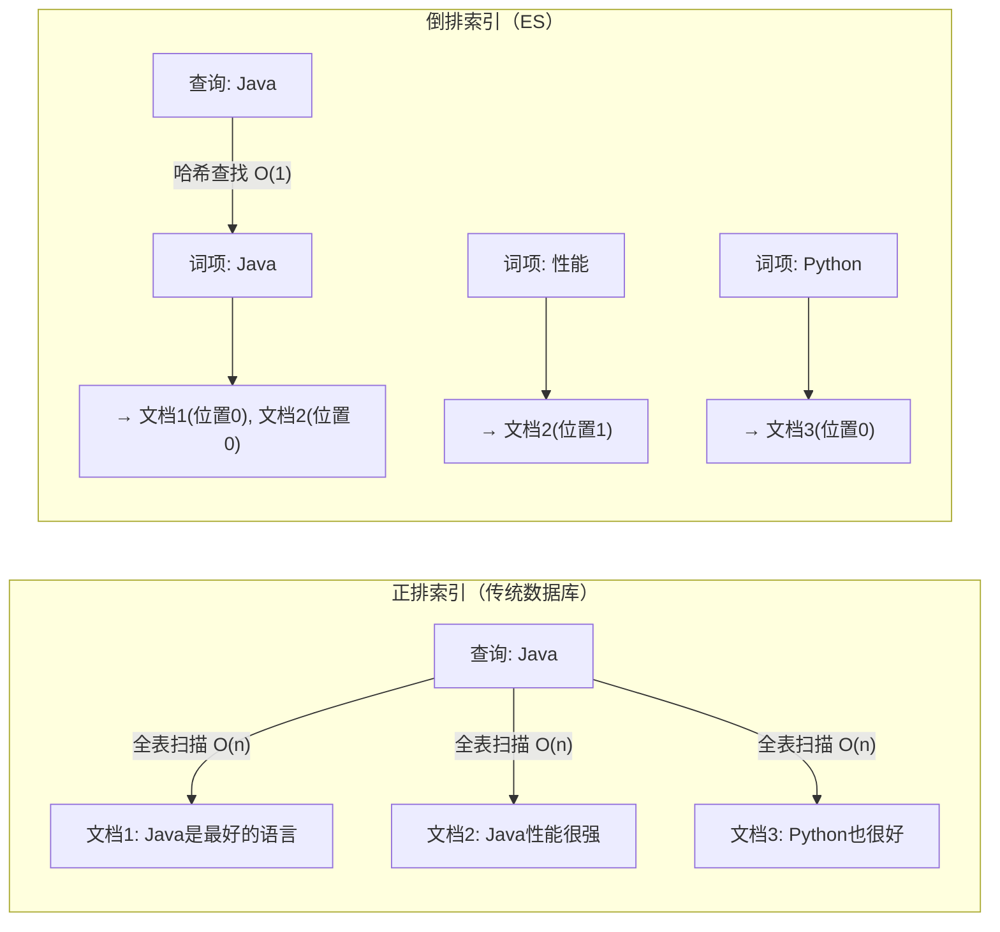
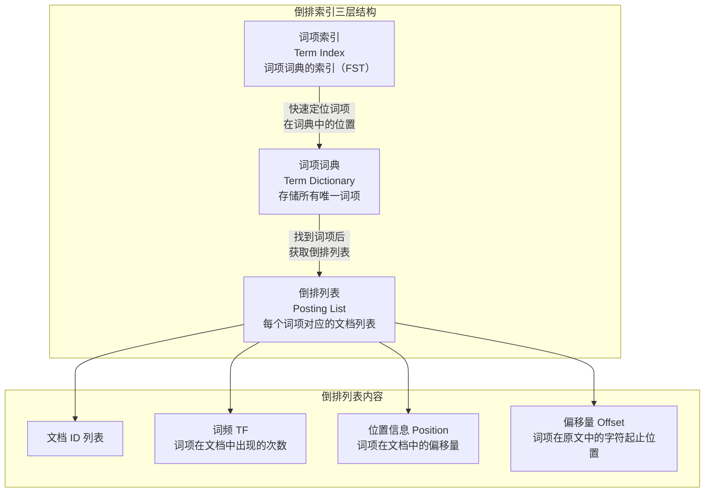
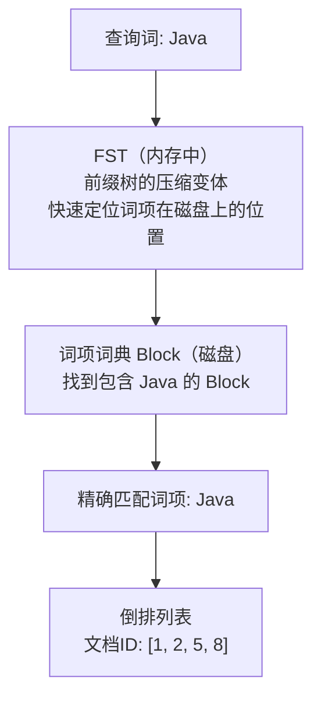
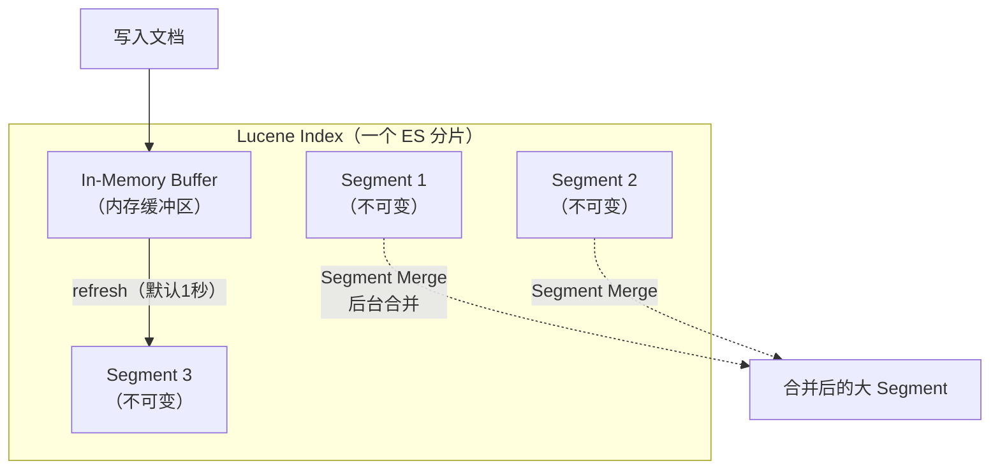

# ES 倒排索引：为何擅长全文检索

> **核心问题**：为什么 ES 的全文检索比 MySQL 的 LIKE 快几个数量级？倒排索引的底层结构是什么？ES 如何在海量词项中快速定位？

---

## 1. 它解决了什么问题？

传统数据库使用 B+ 树索引，擅长精确查询和范围查询，但对全文检索无能为力。`LIKE '%Java%'` 需要逐行扫描，百万数据需要数秒。

倒排索引**反转了查找方向**——不是"从文档找词"，而是"从词找文档"。通过预先建立"词项 → 文档列表"的映射，将全文检索的时间复杂度从 O(n) 降到 O(1)。

**生活类比**：正排索引就像翻书找某个词——你需要逐页翻阅；倒排索引就像书末尾的"索引页"——直接查词就能知道它在哪几页出现过。

---

## 2. 正排索引 vs 倒排索引



| 对比维度 | 正排索引（B+ 树） | 倒排索引 |
| :-- | :-- | :-- |
| **查找方向** | 文档 → 词 | 词 → 文档 |
| **适用场景** | 精确查询、范围查询 | 全文检索、模糊搜索 |
| **时间复杂度** | O(log n) ~ O(n) | O(1)（词项定位） |
| **典型代表** | MySQL B+ 树索引 | Elasticsearch 倒排索引 |

---

## 3. 倒排索引的完整结构

倒排索引由三个核心部分组成：



### 3.1 词项词典（Term Dictionary）

存储所有经过分词后的唯一词项，按字典序排列。

```txt
词项词典示例（按字典序排列）：
┌──────────┬──────────────────┐
│ 词项      │ 倒排列表指针      │
├──────────┼──────────────────┤
│ Java     │ → Posting List 1 │
│ Python   │ → Posting List 2 │
│ 性能      │ → Posting List 3 │
│ 最好      │ → Posting List 4 │
│ 语言      │ → Posting List 5 │
└──────────┴──────────────────┘
```

### 3.2 词项索引（Term Index）—— FST

词项词典可能非常大（百万级词项），不可能全部放在内存中。ES 使用 **FST（Finite State Transducer，有限状态转换器）** 作为词项索引，它是词项词典的"索引的索引"。



**FST 的核心优势**：

| 特性 | 说明 |
| :-- | :-- |
| **内存占用极小** | 通过共享前缀和后缀，压缩率极高，通常只有原始数据的 1/10 ~ 1/20 |
| **查找速度快** | O(len) 时间复杂度，len 是查询词的长度，与词典大小无关 |
| **支持前缀查询** | 天然支持前缀匹配，这也是 ES 前缀查询高效的原因 |

**FST vs 其他数据结构**：

| 数据结构 | 内存占用 | 查找速度 | 是否支持前缀 |
| :-- | :-- | :-- | :-- |
| HashMap | 大 | O(1) | ❌ |
| Trie（前缀树） | 大 | O(len) | ✅ |
| **FST** | **极小** | **O(len)** | **✅** |

### 3.3 倒排列表（Posting List）

每个词项对应一个倒排列表，记录包含该词项的所有文档信息：

```txt
词项 "Java" 的倒排列表：
┌─────────┬────────┬──────────┬───────────────┐
│ 文档 ID  │ 词频 TF │ 位置 Pos  │ 偏移量 Offset  │
├─────────┼────────┼──────────┼───────────────┤
│ 1       │ 1      │ [0]      │ [0, 4]        │
│ 2       │ 2      │ [0, 5]   │ [0,4], [20,24]│
│ 5       │ 1      │ [3]      │ [12, 16]      │
└─────────┴────────┴──────────┴───────────────┘
```

- **文档 ID**：包含该词项的文档编号
- **词频 TF**：该词项在文档中出现的次数（用于相关性评分）
- **位置 Position**：词项在文档中的第几个词（用于短语查询）
- **偏移量 Offset**：词项在原文中的字符起止位置（用于高亮显示）

---

## 4、倒排索引构建过程


**完整示例**：

```txt
原始文档：
  文档1: "Java 是最好的编程语言"
  文档2: "Java 性能很强，适合后端开发"
  文档3: "Python 也是很好的语言"

分词后：
  文档1: [java, 最好, 编程, 语言]
  文档2: [java, 性能, 很强, 适合, 后端, 开发]
  文档3: [python, 很好, 语言]

构建倒排索引：
  java     → [文档1, 文档2]
  最好     → [文档1]
  编程     → [文档1]
  语言     → [文档1, 文档3]
  性能     → [文档2]
  很强     → [文档2]
  后端     → [文档2]
  开发     → [文档2]
  python   → [文档3]
  很好     → [文档3]
```

---

## 5. 倒排列表的压缩算法

倒排列表中的文档 ID 列表可能非常长（热门词项可能关联百万文档），ES 使用多种压缩算法来减少存储空间和提升查询速度。

### 5.1 FOR（Frame of Reference）编码

核心思想：**存储差值（delta）而非原始值**，然后按位压缩。

```txt
原始文档 ID 列表：[73, 300, 302, 332, 343, 372]

Step 1: 计算差值（Delta Encoding）
  [73, 227, 2, 30, 11, 29]

Step 2: 分块（每块固定大小，如 3 个一组）
  Block 1: [73, 227, 2]    → 最大值 227，需要 8 bit
  Block 2: [30, 11, 29]    → 最大值 30，需要 5 bit

Step 3: 按块内最大值所需位数压缩
  Block 1: 每个数用 8 bit 存储 → 3 × 8 = 24 bit
  Block 2: 每个数用 5 bit 存储 → 3 × 5 = 15 bit

压缩前：6 × 32 bit = 192 bit
压缩后：24 + 15 = 39 bit（压缩率约 80%）
```

### 5.2 Roaring Bitmaps

当需要对多个倒排列表做交集/并集运算时（如 bool 查询），ES 使用 **Roaring Bitmaps** 加速集合运算。

```txt
查询: "Java AND 性能"
  → "Java" 的文档列表: [1, 2, 5, 8, 100, 200, ...]
  → "性能" 的文档列表: [2, 8, 50, 200, ...]
  → 交集运算（用 Roaring Bitmap 加速）: [2, 8, 200, ...]
```

Roaring Bitmap 将文档 ID 空间按 65536 为一块分组：

- **稀疏块**（元素少）：用有序数组存储
- **稠密块**（元素多）：用位图（Bitmap）存储
- 自动在两种存储方式之间切换，兼顾空间和速度

---

## 6. Segment 与不可变性

ES 的倒排索引存储在 **Segment（段）** 中，每个 Segment 是一个完整的倒排索引，且**一旦写入就不可修改**。



| 操作 | 实现方式 |
| :-- | :-- |
| **新增文档** | 写入新 Segment |
| **删除文档** | 在 `.del` 文件中标记删除，查询时过滤 |
| **更新文档** | 标记旧文档删除 + 写入新文档到新 Segment |
| **Segment 合并** | 后台定期将小 Segment 合并为大 Segment，物理删除已标记的文档 |

**不可变性的好处**：

- 无需加锁，天然支持并发读
- 可以被操作系统文件缓存（Page Cache）加速
- 压缩效果更好

---

## 7. 为什么比 LIKE 快几个数量级

| 维度 | MySQL `LIKE '%Java%'` | ES 倒排索引 |
| :-- | :-- | :-- |
| **查找方式** | 逐行扫描每条记录 | 通过 FST → 词项词典 → 倒排列表 |
| **时间复杂度** | O(n)，n 是总记录数 | O(len)，len 是查询词长度 |
| **百万数据** | 数秒 | 毫秒级 |
| **是否支持分词** | ❌ 只能整串匹配 | ✅ 分词后任意词项匹配 |
| **是否支持相关性排序** | ❌ | ✅ 基于 TF-IDF / BM25 评分 |

---

## 8. 常见问题

**Q：ES 的倒排索引和 MySQL 的 B+ 树索引有什么区别？**

> - B+ 树：适合精确查询、范围查询，按字段值排序存储，支持前缀匹配
> - 倒排索引：适合全文检索，按词项存储文档列表，支持分词后的任意词项查找
> - 本质区别：B+ 树是"从值找记录"，倒排索引是"从词项找文档"

**Q：FST 是什么？为什么 ES 要用 FST？**

> FST（有限状态转换器）是一种高度压缩的前缀树变体，用于在内存中快速定位词项在磁盘上的位置。它的内存占用极小（共享前缀和后缀），查找速度为 O(len)，是 ES 能在海量词项中快速定位的关键。

**Q：为什么 ES 写入数据后不能立即查到？**

> 因为文档先写入内存缓冲区，需要经过 refresh（默认 1 秒）才会生成新的 Segment 变为可搜索。这就是 ES 的 **Near Real-Time（近实时）** 特性。可以通过手动调用 `_refresh` API 或设置 `refresh_interval` 来调整。

**Q：倒排列表是如何压缩的？**

> 主要使用 FOR（Frame of Reference）编码：先计算文档 ID 的差值（delta），再按块压缩，每块用最小所需位数存储。对于集合运算（交集/并集），使用 Roaring Bitmaps 加速。

**Q：Segment 不可变会不会导致磁盘空间浪费？**

> 短期内会，因为删除只是标记而非物理删除。但 ES 后台会定期执行 Segment Merge（段合并），将多个小 Segment 合并为大 Segment，同时物理删除已标记的文档，回收磁盘空间。
