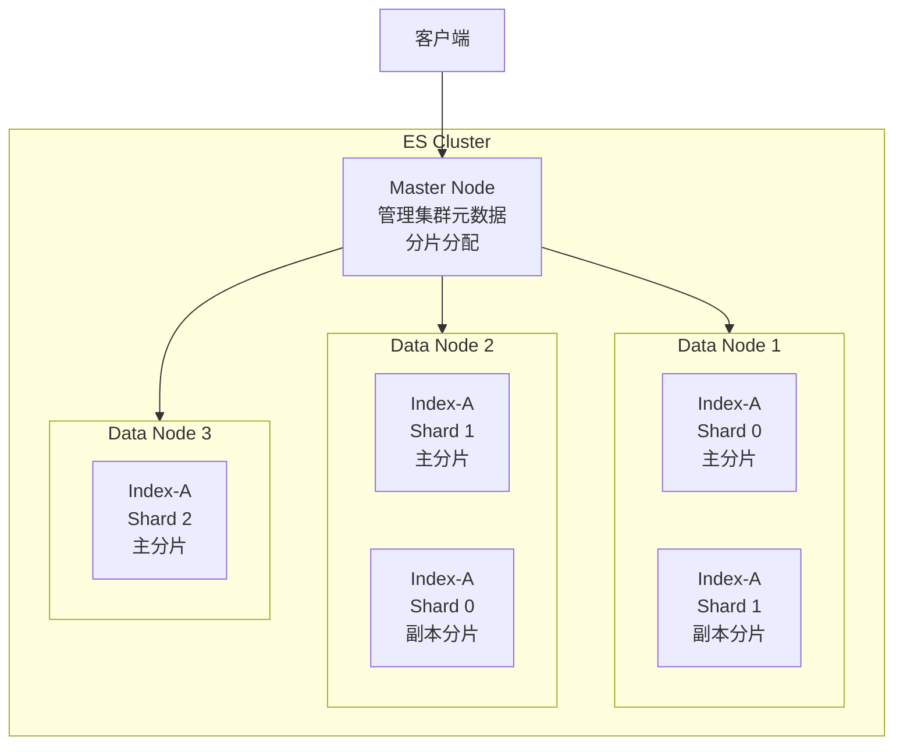

# ES 集群架构与分片机制

---

## ES 集群架构图

---

## 分片核心规则

| 规则 | 说明 | 为什么这样设计 |
|------|------|-------------|
| **主分片数创建后不可修改** | 路由公式：`shard = hash(id) % 主分片数` | 修改分片数会导致路由结果变化，已有数据找不到 |
| 副本分片可动态调整 | 可随时增减副本数量 | 副本只是主分片的复制，不影响路由 |
| 主副分片不在同一节点 | ES 自动保证 | 节点宕机时，副本在其他节点，数据不丢失 |
| 分片数 ≈ 节点数 × 1~3 | 经验值 | 分片过多增加管理开销，过少无法充分利用节点 |

> **为什么主分片数不可修改**：ES 通过 `hash(id) % 主分片数` 计算文档存储在哪个分片。如果修改分片数，同一文档的路由结果会变化，查询时去新分片找，但文档在旧分片，导致查不到。

---

## 集群健康状态

| 状态 | 含义 | 处理方式 |
|------|------|---------| 
| 🟢 Green | 所有主副分片正常 | 正常 |
| 🟡 Yellow | 主分片正常，部分副本未分配 | 检查节点数量，副本无法分配到同节点 |
| 🔴 Red | 部分主分片不可用 | 紧急处理，数据可能丢失 |

> **Yellow 最常见原因**：单节点集群设置了副本数 > 0，副本无法分配到同一节点（主副不能在同一节点），导致 Yellow。开发环境可设置 `number_of_replicas: 0`。

---

## 面试题：为什么主分片数创建后不可修改？

> ES 通过 `hash(id) % 主分片数` 计算文档存储在哪个分片。如果修改分片数，同一文档的路由结果会变化，查询时去新分片找，但文档在旧分片，导致查不到。